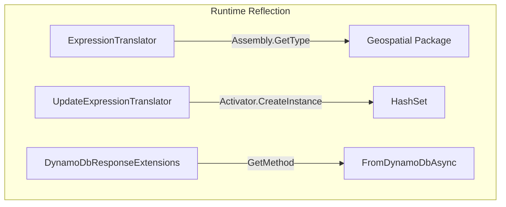
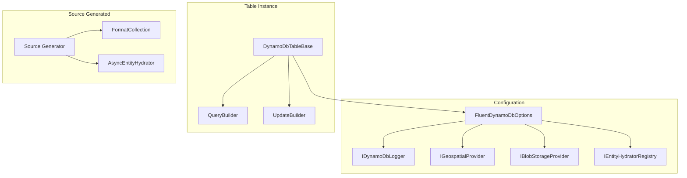

# Design Document: AOT-Compatible Service Registration

## Overview

This design introduces a service registration pattern to eliminate the remaining AOT-unsafe reflection in the Oproto.FluentDynamoDb library. The key principle is that **configuration flows through instance constructors, not global/ambient state**, ensuring test isolation and AOT compatibility.

The solution has three main components:
1. **FluentDynamoDbOptions** - Instance-based configuration object passed to table constructors
2. **Provider Interfaces** - Contracts for optional features (geospatial, blob storage, logging)
3. **Source-Generated Helpers** - Compile-time generated code for type-specific operations

## Architecture

### Current State (Reflection-Based)



### Target State (Interface-Based)



## Components and Interfaces

### 1. FluentDynamoDbOptions

Central configuration object that holds all optional services:

```csharp
namespace Oproto.FluentDynamoDb;

/// <summary>
/// Configuration options for FluentDynamoDb.
/// Passed to table constructors to configure optional features.
/// Thread-safe and immutable after construction.
/// </summary>
public sealed class FluentDynamoDbOptions
{
    /// <summary>
    /// Gets the logger for DynamoDB operations.
    /// </summary>
    public IDynamoDbLogger Logger { get; private init; } = NoOpLogger.Instance;
    
    /// <summary>
    /// Gets the geospatial provider for spatial queries.
    /// Null if geospatial features are not configured.
    /// </summary>
    public IGeospatialProvider? GeospatialProvider { get; private init; }
    
    /// <summary>
    /// Gets the blob storage provider for large object storage.
    /// Null if blob storage is not configured.
    /// </summary>
    public IBlobStorageProvider? BlobStorageProvider { get; private init; }
    
    /// <summary>
    /// Gets the field encryptor for sensitive data.
    /// Null if encryption is not configured.
    /// </summary>
    public IFieldEncryptor? FieldEncryptor { get; private init; }
    
    /// <summary>
    /// Gets the entity hydrator registry for async entity loading.
    /// </summary>
    internal IEntityHydratorRegistry HydratorRegistry { get; private init; } 
        = DefaultEntityHydratorRegistry.Instance;
    
    /// <summary>
    /// Creates a new options instance with the specified logger.
    /// </summary>
    public FluentDynamoDbOptions WithLogger(IDynamoDbLogger logger)
        => new() { 
            Logger = logger ?? NoOpLogger.Instance,
            GeospatialProvider = GeospatialProvider,
            BlobStorageProvider = BlobStorageProvider,
            FieldEncryptor = FieldEncryptor,
            HydratorRegistry = HydratorRegistry
        };
    
    /// <summary>
    /// Creates a new options instance with the specified blob storage provider.
    /// </summary>
    public FluentDynamoDbOptions WithBlobStorage(IBlobStorageProvider provider)
        => new() { 
            Logger = Logger,
            GeospatialProvider = GeospatialProvider,
            BlobStorageProvider = provider,
            FieldEncryptor = FieldEncryptor,
            HydratorRegistry = HydratorRegistry
        };
    
    /// <summary>
    /// Creates a new options instance with the specified field encryptor.
    /// </summary>
    public FluentDynamoDbOptions WithEncryption(IFieldEncryptor encryptor)
        => new() { 
            Logger = Logger,
            GeospatialProvider = GeospatialProvider,
            BlobStorageProvider = BlobStorageProvider,
            FieldEncryptor = encryptor,
            HydratorRegistry = HydratorRegistry
        };
}
```

### 2. Geospatial Provider Interface

Interface for geospatial operations, implemented by the Geospatial package:

```csharp
namespace Oproto.FluentDynamoDb;

/// <summary>
/// Provider interface for geospatial operations.
/// Implemented by Oproto.FluentDynamoDb.Geospatial package.
/// </summary>
public interface IGeospatialProvider
{
    /// <summary>
    /// Creates a bounding box from a center point and distance.
    /// </summary>
    GeoBoundingBoxResult CreateBoundingBox(double latitude, double longitude, double distanceMeters);
    
    /// <summary>
    /// Creates a bounding box from corner coordinates.
    /// </summary>
    GeoBoundingBoxResult CreateBoundingBox(
        double swLatitude, double swLongitude, 
        double neLatitude, double neLongitude);
    
    /// <summary>
    /// Gets the GeoHash range for a bounding box.
    /// </summary>
    (string MinHash, string MaxHash) GetGeoHashRange(GeoBoundingBoxResult bbox, int precision);
    
    /// <summary>
    /// Gets the S2 cell covering for a bounding box.
    /// </summary>
    IReadOnlyList<string> GetS2CellCovering(GeoBoundingBoxResult bbox, int level, int maxCells);
    
    /// <summary>
    /// Gets the H3 cell covering for a bounding box.
    /// </summary>
    IReadOnlyList<string> GetH3CellCovering(GeoBoundingBoxResult bbox, int resolution, int maxCells);
}

/// <summary>
/// Result of bounding box creation, used to pass to cell covering methods.
/// </summary>
public readonly struct GeoBoundingBoxResult
{
    public double SouthwestLatitude { get; init; }
    public double SouthwestLongitude { get; init; }
    public double NortheastLatitude { get; init; }
    public double NortheastLongitude { get; init; }
    internal object? NativeBox { get; init; } // For internal use by provider
}
```

### 3. Geospatial Options Extension

Extension method in the Geospatial package:

```csharp
// In Oproto.FluentDynamoDb.Geospatial package
namespace Oproto.FluentDynamoDb;

public static class GeospatialOptionsExtensions
{
    /// <summary>
    /// Adds geospatial support (GeoHash, S2, H3) to FluentDynamoDb.
    /// </summary>
    public static FluentDynamoDbOptions AddGeospatial(this FluentDynamoDbOptions options)
        => options.WithGeospatialProvider(new DefaultGeospatialProvider());
    
    /// <summary>
    /// Adds geospatial support with a custom provider.
    /// </summary>
    public static FluentDynamoDbOptions WithGeospatialProvider(
        this FluentDynamoDbOptions options, 
        IGeospatialProvider provider)
        => new FluentDynamoDbOptions
        {
            Logger = options.Logger,
            GeospatialProvider = provider,
            BlobStorageProvider = options.BlobStorageProvider,
            FieldEncryptor = options.FieldEncryptor,
            HydratorRegistry = options.HydratorRegistry
        };
}
```

### 4. Entity Hydrator Interface

Interface for async entity hydration, generated by source generator:

```csharp
namespace Oproto.FluentDynamoDb.Storage;

/// <summary>
/// Interface for async entity hydration with blob storage support.
/// Implemented by source-generated code for entities with blob references.
/// </summary>
public interface IAsyncEntityHydrator<TEntity> where TEntity : class
{
    /// <summary>
    /// Hydrates an entity from DynamoDB attributes, loading blob references.
    /// </summary>
    Task<TEntity> HydrateAsync(
        Dictionary<string, AttributeValue> item,
        IBlobStorageProvider blobProvider,
        CancellationToken cancellationToken = default);
    
    /// <summary>
    /// Hydrates an entity from multiple DynamoDB items (composite entities).
    /// </summary>
    Task<TEntity> HydrateAsync(
        IList<Dictionary<string, AttributeValue>> items,
        IBlobStorageProvider blobProvider,
        CancellationToken cancellationToken = default);
}

/// <summary>
/// Registry for entity hydrators.
/// </summary>
public interface IEntityHydratorRegistry
{
    /// <summary>
    /// Gets the hydrator for an entity type, or null if not registered.
    /// </summary>
    IAsyncEntityHydrator<TEntity>? GetHydrator<TEntity>() where TEntity : class;
    
    /// <summary>
    /// Registers a hydrator for an entity type.
    /// </summary>
    void Register<TEntity>(IAsyncEntityHydrator<TEntity> hydrator) where TEntity : class;
}
```

### 5. Source-Generated Collection Formatter

The source generator will emit type-specific formatters for collections:

```csharp
// Generated code for an entity with HashSet<DateTime> property
public static partial class MyEntityFormatters
{
    /// <summary>
    /// Formats a HashSet of DateTime values with the specified format string.
    /// </summary>
    public static HashSet<string> FormatDateTimeSet(HashSet<DateTime> values, string format)
    {
        var result = new HashSet<string>();
        foreach (var value in values)
        {
            result.Add(value.ToString(format, CultureInfo.InvariantCulture));
        }
        return result;
    }
}
```

### 6. Updated DynamoDbTableBase

Table base class updated to accept options:

```csharp
public abstract class DynamoDbTableBase
{
    /// <summary>
    /// Initializes a new instance with the specified options.
    /// </summary>
    /// <param name="client">The DynamoDB client.</param>
    /// <param name="tableName">The name of the table.</param>
    /// <param name="options">Configuration options. If null, uses defaults.</param>
    protected DynamoDbTableBase(
        IAmazonDynamoDB client, 
        string tableName, 
        FluentDynamoDbOptions? options = null)
    {
        DynamoDbClient = client;
        TableName = tableName;
        Options = options ?? new FluentDynamoDbOptions();
        Logger = Options.Logger;
        FieldEncryptor = Options.FieldEncryptor;
    }
    
    /// <summary>
    /// Gets the configuration options for this table.
    /// </summary>
    protected FluentDynamoDbOptions Options { get; }
    
    // Existing properties...
}
```

## Data Models

### Configuration Flow

| Component | Receives Options From | Passes Options To |
|-----------|----------------------|-------------------|
| Application | Creates new | DynamoDbTableBase |
| DynamoDbTableBase | Constructor | Request Builders |
| QueryRequestBuilder | Constructor | ExpressionTranslator |
| ExpressionTranslator | Constructor | IGeospatialProvider |
| DynamoDbResponseExtensions | Method parameter | IEntityHydratorRegistry |

### Provider Registration

| Package | Extension Method | Registers |
|---------|-----------------|-----------|
| Core | (built-in) | IDynamoDbLogger, IFieldEncryptor |
| Geospatial | `AddGeospatial()` | IGeospatialProvider |
| BlobStorage.S3 | `WithBlobStorage(s3Provider)` | IBlobStorageProvider |
| Logging.Extensions | `WithLogger(adapter)` | IDynamoDbLogger |
| Encryption.Kms | `WithEncryption(kmsEncryptor)` | IFieldEncryptor |

## Correctness Properties

*A property is a characteristic or behavior that should hold true across all valid executions of a system-essentially, a formal statement about what the system should do. Properties serve as the bridge between human-readable specifications and machine-verifiable correctness guarantees.*

### Property 1: Configuration Isolation

*For any* two table instances created with different `FluentDynamoDbOptions`, and *for any* sequence of operations on those tables, the configuration of one table SHALL NOT affect the configuration of the other table, and no configuration SHALL be stored in static mutable fields or AsyncLocal storage.

**Validates: Requirements 7.4, 8.1, 8.2, 8.3, 8.5**

### Property 2: Options Immutability

*For any* `FluentDynamoDbOptions` instance, calling `With*` or `Add*` methods SHALL return a new instance without modifying the original instance's properties.

**Validates: Requirements 8.2**

### Property 3: No Reflection for Registered Services

*For any* operation using a registered service (geospatial provider, entity hydrator, collection formatter), the library SHALL NOT use `Assembly.GetType()`, `Type.GetMethod()`, `Activator.CreateInstance()`, or other reflection APIs to invoke the service.

**Validates: Requirements 2.2, 3.2, 4.2, 6.4**

### Property 4: Core Operations Without Optional Packages

*For any* table created without optional packages (geospatial, blob storage), and *for any* combination of optional packages that are registered, core DynamoDB operations (Query, Scan, Get, Put, Update, Delete) SHALL function correctly.

**Validates: Requirements 1.3, 1.4**

### Property 5: Logger Propagation

*For any* `FluentDynamoDbOptions` with a configured logger, and *for any* request builder or translator created from a table using those options, the configured logger SHALL be used for logging operations.

**Validates: Requirements 5.3**

### Property 6: Collection Type Preservation

*For any* collection property with a format string, when formatting is applied, the resulting collection SHALL be of the same generic type as the input (e.g., `HashSet<DateTime>` formatted becomes `HashSet<string>`).

**Validates: Requirements 4.4**

### Property 7: Default Options Behavior

*For any* table created without explicit options or with `new FluentDynamoDbOptions()`, the table SHALL use `NoOpLogger.Instance` for logging, null for optional providers, and SHALL function correctly for core operations.

**Validates: Requirements 1.3, 5.2, 7.3**

## Error Handling

### Missing Provider Errors

When an optional feature is used without registration:

```csharp
// In ExpressionTranslator
if (_options.GeospatialProvider == null)
{
    throw new InvalidOperationException(
        "Geospatial features require configuration. " +
        "Add the Oproto.FluentDynamoDb.Geospatial package and call " +
        "options.AddGeospatial() when creating your table.");
}
```

### Hydrator Not Found

When async hydration is needed but no hydrator is registered:

```csharp
// In DynamoDbResponseExtensions
var hydrator = options.HydratorRegistry.GetHydrator<T>();
if (hydrator == null)
{
    throw new InvalidOperationException(
        $"No async hydrator registered for {typeof(T).Name}. " +
        "Ensure the entity is marked with [DynamoDbEntity] and the source generator is running.");
}
```

## Testing Strategy

### Dual Testing Approach

This feature requires both unit tests and property-based tests:

1. **Unit Tests**: Verify specific configuration scenarios
2. **Property-Based Tests**: Verify isolation and immutability properties

### Property-Based Testing Framework

Use **FsCheck** (via FsCheck.Xunit) for property-based testing:

```csharp
[Property(MaxTest = 100)]
public Property ConfigurationIsolation_ParallelTables()
{
    return Prop.ForAll(
        Arb.Default.String().Filter(s => !string.IsNullOrEmpty(s)),
        Arb.Default.String().Filter(s => !string.IsNullOrEmpty(s)),
        (tableName1, tableName2) =>
        {
            var logger1 = new TestLogger("Logger1");
            var logger2 = new TestLogger("Logger2");
            
            var options1 = new FluentDynamoDbOptions().WithLogger(logger1);
            var options2 = new FluentDynamoDbOptions().WithLogger(logger2);
            
            var table1 = new TestTable(mockClient, tableName1, options1);
            var table2 = new TestTable(mockClient, tableName2, options2);
            
            // Verify isolation
            return table1.Options.Logger == logger1 && 
                   table2.Options.Logger == logger2;
        });
}
```

### Test Categories

| Category | Test Type | Framework |
|----------|-----------|-----------|
| Configuration Isolation | Property-Based | FsCheck |
| Options Immutability | Property-Based | FsCheck |
| Provider Registration | Unit | xUnit |
| Missing Provider Errors | Unit | xUnit |
| Parallel Test Execution | Integration | xUnit (parallel) |

### Property Test Configuration

- Minimum iterations: 100 per property
- Each property test tagged with: `**Feature: aot-compatible-service-registration, Property {N}: {description}**`

## Additional Refactoring Details

### EntityExecuteAsyncExtensions Refactoring

The `EntityExecuteAsyncExtensions.cs` file currently uses `GetMethod()` reflection to discover `FromDynamoDbAsync` and `ToDynamoDbAsync` methods at runtime. These are NOT interface methods - they are additional static methods generated by the source generator only for entities with blob references.

The `IAsyncEntityHydrator<T>` interface and `DefaultEntityHydratorRegistry` already exist to solve this problem. The source generator creates hydrator implementations that wrap the entity's `FromDynamoDbAsync` method.

**Current Pattern (AOT-unsafe):**
```csharp
var fromDynamoDbAsyncMethod = typeof(T).GetMethod(
    "FromDynamoDbAsync",
    BindingFlags.Public | BindingFlags.Static,
    null,
    new[] { typeof(Dictionary<string, AttributeValue>), typeof(IBlobStorageProvider), typeof(CancellationToken) },
    null);

if (fromDynamoDbAsyncMethod != null)
{
    var task = (Task<T>)fromDynamoDbAsyncMethod.Invoke(null, new object[] { response.Item, blobProvider, cancellationToken })!;
    return await task;
}
```

**Target Pattern (AOT-safe):**
```csharp
// The hydrator is registered at startup by the source-generated code
// or manually by the user for entities with blob references
var hydrator = options.HydratorRegistry.GetHydrator<T>();
if (hydrator != null && blobProvider != null)
{
    // Use the registered hydrator (no reflection)
    return await hydrator.HydrateAsync(response.Item, blobProvider, cancellationToken);
}
else
{
    // Fall back to synchronous method via static interface method (AOT-safe)
    return T.FromDynamoDb<T>(response.Item);
}
```

**Key Points:**
- `FromDynamoDb<T>` is a static abstract interface method on `IDynamoDbEntity` - AOT-safe
- `FromDynamoDbAsync` is NOT an interface method - it's generated only for entities with blob refs
- The hydrator registry provides AOT-safe lookup of async hydration capability
- Source generator creates `IAsyncEntityHydrator<T>` implementations that wrap `FromDynamoDbAsync`

### ExpressionTranslator Refactoring

The `ExpressionTranslator.cs` file has several reflection patterns that need different approaches:

#### 1. IsGeoLocationPropertyAccess (Lines 414, 421)

**Current Pattern:**
```csharp
var propertyType = parentMember.Member.DeclaringType?.GetProperty(parentMember.Member.Name)?.PropertyType;
```

**Target Pattern (use MemberExpression.Member directly):**
```csharp
// MemberExpression.Member is already a MemberInfo captured at compile time
if (parentMember.Member is PropertyInfo propertyInfo)
{
    var propertyType = propertyInfo.PropertyType;
    return IsGeoLocationType(propertyType);
}
```

#### 2. EvaluateConstantExpression (Lines 1061, 1067)

**Current Pattern:**
```csharp
var field = memberConstant.Value?.GetType().GetField(member.Member.Name);
var property = memberConstant.Value?.GetType().GetProperty(member.Member.Name);
```

**Target Pattern (use MemberExpression.Member directly):**
```csharp
// member.Member is already the FieldInfo/PropertyInfo from the expression tree
if (member.Member is FieldInfo field)
{
    return (T)field.GetValue(memberConstant.Value)!;
}
if (member.Member is PropertyInfo property)
{
    return (T)property.GetValue(memberConstant.Value)!;
}
```

#### 3. ExtractGeoLocationCoordinates (Lines 1220, 1221)

**Current Pattern:**
```csharp
var latitudeProperty = type.GetProperty("Latitude");
var longitudeProperty = type.GetProperty("Longitude");
```

**Target Pattern (use IGeospatialProvider interface):**

Add a method to `IGeospatialProvider`:
```csharp
public interface IGeospatialProvider
{
    // Existing methods...
    
    /// <summary>
    /// Extracts coordinates from a GeoLocation object.
    /// </summary>
    (double Latitude, double Longitude) ExtractCoordinates(object geoLocation);
}
```

Then in ExpressionTranslator:
```csharp
var (latitude, longitude) = _options.GeospatialProvider!.ExtractCoordinates(geoLocation);
```

#### 4. ExtractBoundingBoxCoordinates (Lines 1337, 1338)

**Current Pattern:**
```csharp
var southwestProperty = type.GetProperty("Southwest");
var northeastProperty = type.GetProperty("Northeast");
```

**Target Pattern (use IGeospatialProvider interface):**

Add a method to `IGeospatialProvider`:
```csharp
public interface IGeospatialProvider
{
    // Existing methods...
    
    /// <summary>
    /// Extracts coordinates from a GeoBoundingBox object.
    /// </summary>
    (double SwLat, double SwLon, double NeLat, double NeLon) ExtractBoundingBoxCoordinates(object boundingBox);
}
```

Then in ExpressionTranslator:
```csharp
var (swLat, swLon, neLat, neLon) = _options.GeospatialProvider!.ExtractBoundingBoxCoordinates(boundingBox);
```


