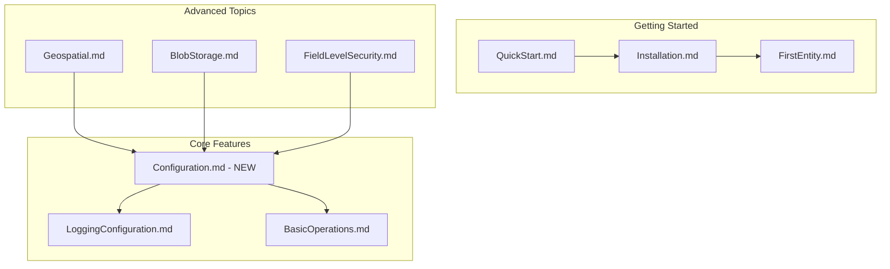

# Design Document: AOT Service Registration Documentation Updates

## Overview

This design specifies the documentation updates needed to reflect the new AOT-compatible service registration pattern introduced in the library. The primary change is the introduction of `FluentDynamoDbOptions` as the central configuration object, replacing individual constructor parameters for optional features like logging, encryption, blob storage, and geospatial support.

## Architecture

### Documentation Structure



## Components and Interfaces

### 1. New Documentation Files

| File | Location | Purpose |
|------|----------|---------|
| Configuration.md | docs/core-features/ | Central guide for FluentDynamoDbOptions |

### 2. Updated Documentation Files

| File | Changes Required |
|------|------------------|
| docs/getting-started/QuickStart.md | Update table initialization examples |
| docs/getting-started/Installation.md | Add optional package configuration |
| docs/core-features/LoggingConfiguration.md | Update to use WithLogger() pattern |
| docs/core-features/BasicOperations.md | Update table creation examples |
| docs/advanced-topics/FieldLevelSecurity.md | Update encryption configuration |
| docs/DeveloperGuide.md | Update configuration sections |
| README.md | Update Quick Start and logging examples |

## Data Models

### Configuration Pattern Examples

#### Basic Configuration (No Optional Features)
```csharp
var client = new AmazonDynamoDBClient();

// Option 1: Omit options entirely (uses defaults)
var table = new UsersTable(client, "users");

// Option 2: Explicit default options
var options = new FluentDynamoDbOptions();
var table = new UsersTable(client, "users", options);
```

#### With Logging
```csharp
var loggerFactory = serviceProvider.GetRequiredService<ILoggerFactory>();
var options = new FluentDynamoDbOptions()
    .WithLogger(loggerFactory.CreateLogger<UsersTable>().ToDynamoDbLogger());

var table = new UsersTable(client, "users", options);
```

#### With Geospatial Support
```csharp
var options = new FluentDynamoDbOptions()
    .AddGeospatial();

var table = new LocationsTable(client, "locations", options);
```

#### With Blob Storage
```csharp
var s3Client = new AmazonS3Client();
var blobProvider = new S3BlobProvider(s3Client, "my-bucket");

var options = new FluentDynamoDbOptions()
    .WithBlobStorage(blobProvider);

var table = new DocumentsTable(client, "documents", options);
```

#### With Encryption
```csharp
var kmsClient = new AmazonKeyManagementServiceClient();
var encryptor = new AwsEncryptionSdkFieldEncryptor(
    new AwsEncryptionSdkOptions { KeyArn = "arn:aws:kms:..." });

var options = new FluentDynamoDbOptions()
    .WithEncryption(encryptor);

var table = new SecretsTable(client, "secrets", options);
```

#### Combined Configuration
```csharp
var options = new FluentDynamoDbOptions()
    .WithLogger(logger.ToDynamoDbLogger())
    .AddGeospatial()
    .WithBlobStorage(blobProvider)
    .WithEncryption(encryptor);

var table = new MyTable(client, "my-table", options);
```

## Correctness Properties

*A property is a characteristic or behavior that should hold true across all valid executions of a system-essentially, a formal statement about what the system should do. Properties serve as the bridge between human-readable specifications and machine-verifiable correctness guarantees.*

### Property 1: Documentation Code Sample Validity

*For any* code sample in the documentation that demonstrates FluentDynamoDbOptions configuration, the code SHALL compile successfully when extracted and compiled against the current library version.

**Validates: Requirements 1.4, 2.4, 3.4, 4.3, 5.4**

## Error Handling

### Documentation Error Scenarios

The documentation should explain these error scenarios:

1. **Geospatial Not Configured**
   - Error: "Geospatial features require configuration. Add the Oproto.FluentDynamoDb.Geospatial package and call options.AddGeospatial() when creating your table."
   - Resolution: Install package and add `AddGeospatial()` to options

2. **Blob Storage Not Configured**
   - Error: "Blob storage features require configuration. Call options.WithBlobStorage(provider) when creating your table."
   - Resolution: Create blob provider and add `WithBlobStorage()` to options

3. **Encryption Not Configured**
   - Error: "Field encryption requires configuration. Call options.WithEncryption(encryptor) when creating your table."
   - Resolution: Create encryptor and add `WithEncryption()` to options

## Testing Strategy

### Dual Testing Approach

This documentation update requires both unit tests and property-based tests:

1. **Unit Tests**: Verify specific documentation content exists
2. **Property-Based Tests**: Verify all code samples compile

### Property-Based Testing Framework

Use **FsCheck** (via FsCheck.Xunit) for property-based testing:

```csharp
[Property(MaxTest = 100)]
public Property AllCodeSamplesCompile()
{
    // Extract code samples from markdown files
    // Verify each compiles successfully
}
```

### Test Categories

| Category | Test Type | Framework |
|----------|-----------|-----------|
| Code Sample Validity | Property-Based | FsCheck |
| Documentation Content | Unit | xUnit |

### Property Test Configuration

- Minimum iterations: 100 per property
- Each property test tagged with: `**Feature: aot-service-registration-docs, Property {N}: {description}**`

## Documentation Content Specifications

### Configuration.md Structure

```markdown
# Configuration Guide

## Overview
- Introduction to FluentDynamoDbOptions
- When to use configuration

## Basic Configuration
- Default options
- Table initialization

## Logging Configuration
- WithLogger() method
- Microsoft.Extensions.Logging adapter

## Geospatial Configuration
- AddGeospatial() method
- Package installation

## Blob Storage Configuration
- WithBlobStorage() method
- S3BlobProvider setup

## Encryption Configuration
- WithEncryption() method
- KMS encryptor setup

## Combining Features
- Method chaining
- Complete examples

## Test Isolation
- Instance-based configuration
- Parallel test support
```


