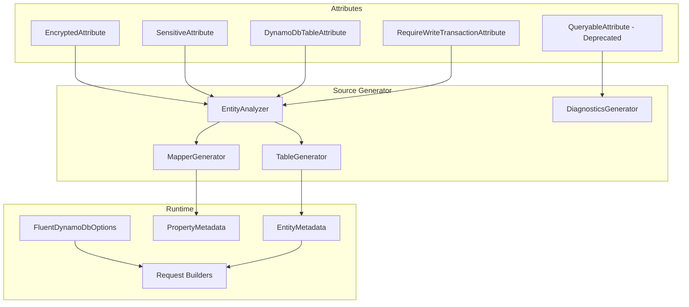

# Design Document: API Enhancements v0.9

## Overview

This design document describes the implementation of six key enhancements for Oproto.FluentDynamoDb v0.9.0:

1. **Encrypted → Sensitive Auto-Marking**: Automatically set `IsSensitive = true` for encrypted properties
2. **Custom Namespace Support**: Allow `[DynamoDbTable(Namespace = "...")]` for generated table classes
3. **Deprecate `[Queryable]`**: Derive query capabilities from PK/SK metadata
4. **`[RequireWriteTransaction]` Attribute**: Enforce transactional writes at runtime
5. **Default Request Options**: Configure common request settings in `FluentDynamoDbOptions`
6. **NuGet Packaging Fixes**: Exclude test/example projects from packages

## Architecture

### Component Diagram



## Components and Interfaces

### 1. EncryptedAttribute Enhancement

No changes to the attribute itself. The source generator's `EntityAnalyzer` will be modified to automatically set `IsSensitive = true` when `IsEncrypted = true`.

**MapperGenerator Changes:**
```csharp
// In generated PropertyMetadata initialization
new PropertyMetadata
{
    PropertyName = "SocialSecurityNumber",
    AttributeName = "ssn",
    IsEncrypted = true,
    IsSensitive = true,  // Automatically set when IsEncrypted is true
    // ...
}
```

### 2. DynamoDbTableAttribute Enhancement

**Updated Attribute:**
```csharp
[AttributeUsage(AttributeTargets.Class)]
public class DynamoDbTableAttribute : Attribute
{
    public string TableName { get; }
    
    /// <summary>
    /// Gets or sets the namespace for the generated table class.
    /// If null, uses the entity's namespace.
    /// </summary>
    public string? Namespace { get; set; }
    
    // Existing properties...
}
```

**TableGenerator Changes:**
- Read `Namespace` property from attribute
- Use specified namespace or fall back to entity namespace
- Generate appropriate `using` directives

### 3. QueryableAttribute Deprecation

**Attribute Update:**
```csharp
[Obsolete("The [Queryable] attribute is deprecated. Query capabilities are now derived from [PartitionKey] and [SortKey] attributes. This attribute will be removed in v1.0.")]
[AttributeUsage(AttributeTargets.Property)]
public class QueryableAttribute : Attribute
{
    // Existing implementation...
}
```

**Diagnostic Addition:**
- Emit `DYNDB103` warning when `[Queryable]` is used
- Message: "The [Queryable] attribute is deprecated. Query capabilities are now derived from [PartitionKey] and [SortKey] attributes."

**EntityAnalyzer Changes:**
- Derive `SupportedOperations` from key attributes:
  - Partition Key: `[Equals]`
  - Sort Key: `[Equals, BeginsWith, Between, GreaterThan, LessThan]`

### 4. RequireWriteTransactionAttribute

**New Attribute:**
```csharp
namespace Oproto.FluentDynamoDb.Attributes;

/// <summary>
/// Marks an entity class as requiring write operations to be performed within a transaction.
/// When applied, Put, Update, Delete, and BatchWrite operations will throw InvalidOperationException
/// unless performed within a TransactWrite operation.
/// </summary>
[AttributeUsage(AttributeTargets.Class, AllowMultiple = false)]
public sealed class RequireWriteTransactionAttribute : Attribute
{
}
```

**AOT-Safe Implementation Approach:**

Since the base request builders (`PutItemRequestBuilder<TEntity>`, etc.) already have the `TEntity` type parameter, and all entities implement `IDynamoDbEntity`, we can access the static `RequiresWriteTransaction` property directly in the base builders without needing entity-specific builder classes.

1. **IDynamoDbEntity Interface Extension:**
```csharp
public interface IDynamoDbEntity
{
    // Existing members...
    
    /// <summary>
    /// Gets whether this entity type requires write operations within a transaction.
    /// Source-generated based on [RequireWriteTransaction] attribute.
    /// </summary>
    static abstract bool RequiresWriteTransaction { get; }
}
```

2. **Source Generator Enhancement:**
The source generator will emit the static property for each entity:
```csharp
// Generated code for entity with [RequireWriteTransaction]
public partial class Order : IDynamoDbEntity
{
    public static bool RequiresWriteTransaction => true;
}

// Generated code for entity without the attribute
public partial class Product : IDynamoDbEntity
{
    public static bool RequiresWriteTransaction => false;
}
```

3. **Base Builder Validation:**
The base request builders will add validation in their execution methods. Since `TEntity` implements `IDynamoDbEntity`, we can access `TEntity.RequiresWriteTransaction` directly:
```csharp
// In PutItemRequestBuilder<TEntity> where TEntity : class, IDynamoDbEntity
public async Task<PutItemResponse> ToDynamoDbResponseAsync(CancellationToken cancellationToken = default)
{
    if (TEntity.RequiresWriteTransaction)
    {
        throw new InvalidOperationException(
            $"Entity '{typeof(TEntity).Name}' is marked with [RequireWriteTransaction] and cannot be modified " +
            "outside of a transaction. Use DynamoDbTransactions.Write() to perform this operation.");
    }
    // ... rest of method
}
```

4. **Entity-Specific Update Builder:**
The existing `EntitySpecificUpdateBuilderGenerator` already generates entity-specific update builders (e.g., `OrderUpdateBuilder`) to simplify the `Set()` method's generic parameters. This generator will be updated to include transaction validation in its `ToDynamoDbResponseAsync()` override.

**Why This Approach:**
- **AOT-Safe**: No reflection needed - the `RequiresWriteTransaction` property is accessed via the static abstract interface member
- **Simpler**: No need to generate entity-specific Put or Delete builders - validation is in the base classes
- **Consistent**: Uses the same pattern as `ToDynamoDb<T>()` and `FromDynamoDb<T>()` which access static interface members
- **Minimal Code Generation**: Only the existing Update builder generator needs modification

**EntityMetadata Enhancement (for tooling/diagnostics):**
```csharp
public class EntityMetadata
{
    // Existing properties...
    
    /// <summary>
    /// Gets or sets whether this entity requires write operations to be performed within a transaction.
    /// </summary>
    public bool RequiresWriteTransaction { get; set; }
}
```

**Validation Points:**

The validation strategy is unified: **tighten the type constraint and validate at execution time in `ToDynamoDbResponseAsync()`**.

The base write builders (`PutItemRequestBuilder<TEntity>`, `UpdateItemRequestBuilder<TEntity>`, `DeleteItemRequestBuilder<TEntity>`) will be updated to constrain `TEntity : class, IDynamoDbEntity`. This allows direct access to `TEntity.RequiresWriteTransaction` via the static abstract interface member.

**Unified validation in all three base builders:**
```csharp
public async Task<PutItemResponse> ToDynamoDbResponseAsync(CancellationToken cancellationToken = default)
{
    if (TEntity.RequiresWriteTransaction)
    {
        throw new InvalidOperationException(
            $"Entity '{typeof(TEntity).Name}' is marked with [RequireWriteTransaction] and cannot be modified " +
            "outside of a transaction. Use DynamoDbTransactions.Write() to perform this operation.");
    }
    // ... rest of method
}
```

**Validation points:**
1. **Put**: In `PutItemRequestBuilder<TEntity>.ToDynamoDbResponseAsync()` - checks `TEntity.RequiresWriteTransaction`
2. **Update**: In `UpdateItemRequestBuilder<TEntity>.ToDynamoDbResponseAsync()` - checks `TEntity.RequiresWriteTransaction`
3. **Delete**: In `DeleteItemRequestBuilder<TEntity>.ToDynamoDbResponseAsync()` - checks `TEntity.RequiresWriteTransaction`
4. **BatchWrite**: In `BatchWriteBuilder.ExecuteAsync()` - validates all entities in the batch
5. **TransactionWrite**: Skips validation - transactions are the allowed path for these entities

**Why this approach:**
- **Consistent**: All three write operations validate at the same point (execution time) in the same way
- **AOT-Safe**: No reflection - uses static abstract interface member
- **Simple**: No entity-specific builders needed for Put/Delete, no generated code for validation
- **Correct constraint**: `IDynamoDbEntity` is required for hydration anyway, so tightening the constraint is appropriate

### 5. FluentDynamoDbOptions Default Request Settings

**Extended Options:**
```csharp
public sealed class FluentDynamoDbOptions
{
    // Existing properties...
    
    /// <summary>
    /// Gets the default setting for consistent reads.
    /// </summary>
    public bool? DefaultConsistentRead { get; private init; }
    
    /// <summary>
    /// Gets the default setting for return consumed capacity.
    /// </summary>
    public ReturnConsumedCapacity? DefaultReturnConsumedCapacity { get; private init; }
    
    /// <summary>
    /// Gets the default setting for return item collection metrics.
    /// </summary>
    public ReturnItemCollectionMetrics? DefaultReturnItemCollectionMetrics { get; private init; }
    
    /// <summary>
    /// Gets the default setting for return values on write operations.
    /// </summary>
    public ReturnValue? DefaultReturnValues { get; private init; }
    
    // Builder methods with matching names to request builder methods
    public FluentDynamoDbOptions UseConsistentRead(bool value = true);
    public FluentDynamoDbOptions ReturnConsumedCapacity(ReturnConsumedCapacity value);
    public FluentDynamoDbOptions ReturnItemCollectionMetrics(ReturnItemCollectionMetrics value);
    public FluentDynamoDbOptions ReturnValues(ReturnValue value);
}
```

**Request Builder Integration:**
- Request builders read defaults from `Options` during construction
- Explicit builder method calls override defaults
- Defaults are applied when building the final request

### 6. NuGet Packaging Fixes

**Project File Changes:**
- Add `<IsPackable>false</IsPackable>` to all test projects
- Add `<IsPackable>false</IsPackable>` to all example projects
- Remove duplicate icon files from test/example project directories
- Verify `Directory.Build.props` only applies packaging to packable projects

## Data Models

### PropertyMetadata (Updated)

```csharp
public class PropertyMetadata
{
    public string PropertyName { get; set; }
    public string AttributeName { get; set; }
    public Type PropertyType { get; set; }
    public bool IsPartitionKey { get; set; }
    public bool IsSortKey { get; set; }
    public bool IsEncrypted { get; set; }
    public bool IsSensitive { get; set; }  // Now auto-set when IsEncrypted is true
    public DynamoDbOperation[] SupportedOperations { get; set; }  // Now derived from key attributes
    // ... other existing properties
}
```

### EntityMetadata (Updated)

```csharp
public class EntityMetadata
{
    public string EntityName { get; set; }
    public string TableName { get; set; }
    public string Namespace { get; set; }  // New: custom namespace support
    public bool RequiresWriteTransaction { get; set; }  // New: transaction requirement
    public List<PropertyMetadata> Properties { get; set; }
    // ... other existing properties
}
```

## Correctness Properties

*A property is a characteristic or behavior that should hold true across all valid executions of a system-essentially, a formal statement about what the system should do. Properties serve as the bridge between human-readable specifications and machine-verifiable correctness guarantees.*

### Property 1: Encrypted properties are automatically sensitive
*For any* entity with a property marked `[Encrypted]`, the generated PropertyMetadata SHALL have `IsSensitive = true`.
**Validates: Requirements 1.1, 1.3**

### Property 2: Custom namespace is applied to generated table class
*For any* entity with `[DynamoDbTable(Namespace = "X")]`, the generated table class SHALL be in namespace "X".
**Validates: Requirements 2.1**

### Property 3: Partition key properties support equality operations
*For any* property marked with `[PartitionKey]`, the generated PropertyMetadata SHALL include `DynamoDbOperation.Equals` in SupportedOperations.
**Validates: Requirements 3.3**

### Property 4: Sort key properties support range operations
*For any* property marked with `[SortKey]`, the generated PropertyMetadata SHALL include `[Equals, BeginsWith, Between, GreaterThan, LessThan]` in SupportedOperations.
**Validates: Requirements 3.4**

### Property 5: Transaction-required entities block non-transactional writes
*For any* entity with `[RequireWriteTransaction]` and any write operation (Put, Update, Delete, BatchWrite) attempted outside a transaction, the system SHALL throw `InvalidOperationException`.
**Validates: Requirements 4.2, 4.3, 4.4, 4.5**

### Property 6: Transaction-required entities allow transactional writes
*For any* entity with `[RequireWriteTransaction]` and any write operation within a TransactWrite, the system SHALL allow the operation to proceed without exception.
**Validates: Requirements 4.6**

### Property 7: Default options propagate to request builders
*For any* `FluentDynamoDbOptions` with configured defaults and any request builder created with those options, the builder's request SHALL reflect the configured defaults unless explicitly overridden.
**Validates: Requirements 5.1, 5.2, 5.3, 5.4**

### Property 8: Explicit builder calls override default options
*For any* request builder with default options configured, when an explicit builder method is called, the explicit value SHALL take precedence over the default.
**Validates: Requirements 5.5**

## Error Handling

### InvalidOperationException for Transaction-Required Entities

When a write operation is attempted on a transaction-required entity outside a transaction:

```csharp
throw new InvalidOperationException(
    $"Entity '{entityName}' is marked with [RequireWriteTransaction] and cannot be modified " +
    $"outside of a transaction. Use DynamoDbTransactions.Write() to perform this operation.");
```

### Deprecation Warning for [Queryable]

Compiler warning `DYNDB103`:
```
warning DYNDB103: The [Queryable] attribute is deprecated. Query capabilities are now derived from [PartitionKey] and [SortKey] attributes. This attribute will be removed in v1.0.
```

## Testing Strategy

### Property-Based Testing

The project uses **FsCheck** for property-based testing, as established in the existing test infrastructure.

**Test Configuration:**
- Minimum 100 iterations per property test
- Tests tagged with `**Feature: api-enhancements-v0.9, Property {N}: {description}**`

### Unit Tests

Unit tests will cover:
- Attribute parsing in EntityAnalyzer
- Metadata generation in MapperGenerator
- Namespace handling in TableGenerator
- Runtime validation in request builders
- Default options propagation

### Integration Tests

Integration tests will verify:
- End-to-end encrypted property redaction in logs
- Transaction enforcement with real DynamoDB operations
- Package contents verification after build

### Test Organization

```
Oproto.FluentDynamoDb.UnitTests/
├── Attributes/
│   └── RequireWriteTransactionAttributeTests.cs
├── Requests/
│   └── TransactionRequirementValidationTests.cs
└── FluentDynamoDbOptionsDefaultsPropertyTests.cs

Oproto.FluentDynamoDb.SourceGenerator.UnitTests/
├── Analysis/
│   ├── EncryptedSensitivePropertyTests.cs
│   └── QueryableDeprecationTests.cs
└── Generators/
    └── CustomNamespaceGenerationTests.cs
```
