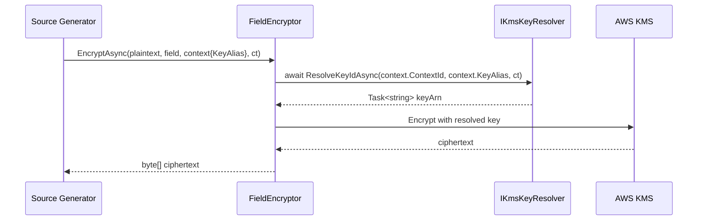
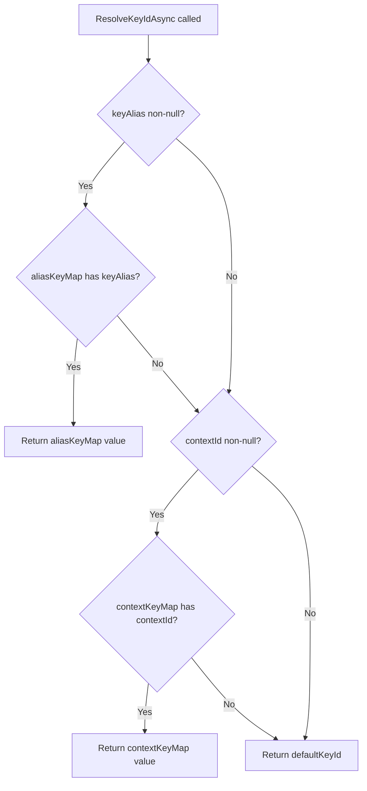

# Design Document: Async KMS Key Resolver

## Overview

This design converts the `IKmsKeyResolver` interface from synchronous to asynchronous and adds per-property key alias support. The change eliminates the last synchronous bottleneck in the encryption pipeline, enabling multi-tenant implementations to resolve keys from external sources (databases, vaults, APIs) without blocking the thread pool.

The feature introduces three coordinated changes:
1. **Async interface** — `ResolveKeyId` → `ResolveKeyIdAsync` returning `Task<string>`
2. **Key alias dimension** — A new `keyAlias` parameter enables per-property key differentiation (e.g., PII vs. financial data)
3. **Pipeline threading** — The alias flows from `[Encrypted(KeyAlias = "...")]` → source generator → `FieldEncryptionContext.KeyAlias` → `ResolveKeyIdAsync(contextId, keyAlias, ct)`

This is a **breaking change** to the `IKmsKeyResolver` contract. Consumers must update implementations and any code that constructs `DefaultKmsKeyResolver`.

## Architecture



### Resolution Priority (DefaultKmsKeyResolver)



## Components and Interfaces

### IKmsKeyResolver (Modified — Breaking Change)

```csharp
namespace Oproto.FluentDynamoDb.Encryption.Kms;

public interface IKmsKeyResolver
{
    Task<string> ResolveKeyIdAsync(
        string? contextId,
        string? keyAlias = null,
        CancellationToken cancellationToken = default);
}
```

- Removes synchronous `ResolveKeyId(string? contextId)` method entirely
- Adds `keyAlias` parameter for per-property key selection
- Adds `CancellationToken` for cooperative cancellation
- Returns `Task<string>` — the resolved KMS key ARN or alias

### DefaultKmsKeyResolver (Modified)

```csharp
namespace Oproto.FluentDynamoDb.Encryption.Kms;

public sealed class DefaultKmsKeyResolver : IKmsKeyResolver
{
    private readonly string _defaultKeyId;
    private readonly IReadOnlyDictionary<string, string>? _contextKeyMap;
    private readonly IReadOnlyDictionary<string, string>? _aliasKeyMap;

    public DefaultKmsKeyResolver(
        string defaultKeyId,
        IReadOnlyDictionary<string, string>? contextKeyMap = null,
        IReadOnlyDictionary<string, string>? aliasKeyMap = null)
    {
        // throws ArgumentException if defaultKeyId is null/empty/whitespace
    }

    public Task<string> ResolveKeyIdAsync(
        string? contextId,
        string? keyAlias = null,
        CancellationToken cancellationToken = default)
    {
        // 1. If keyAlias non-null and in aliasKeyMap → return alias mapping
        // 2. Else if contextId non-null and in contextKeyMap → return context mapping
        // 3. Else → return defaultKeyId
        // All paths return Task.FromResult (no actual async work)
    }
}
```

**Resolution order:**
1. `keyAlias` → `aliasKeyMap` (highest priority)
2. `contextId` → `contextKeyMap` (fallback)
3. `defaultKeyId` (final fallback)

All lookups are case-sensitive. Returns `Task.FromResult` since no I/O occurs.

### AwsEncryptionSdkFieldEncryptor (Modified Call Sites)

Changes in `EncryptAsync` and `DecryptAsync`:

```csharp
// Before:
keyArn = _keyResolver.ResolveKeyId(context.ContextId);

// After:
keyArn = await _keyResolver.ResolveKeyIdAsync(
    context.ContextId,
    context.KeyAlias,
    cancellationToken).ConfigureAwait(false);
```

**Error handling changes:**
- `OperationCanceledException` — propagated unwrapped (not caught in the general catch)
- Other exceptions from `ResolveKeyIdAsync` — wrapped in `FieldEncryptionException` with field name, context ID, and key alias info
- Null/empty return — throws `FieldEncryptionException` (same as today, but message now includes key alias)

### EncryptedAttribute (Modified)

```csharp
[AttributeUsage(AttributeTargets.Property, AllowMultiple = false)]
public sealed class EncryptedAttribute : Attribute
{
    public int CacheTtlSeconds { get; set; } = 300;
    public string? KeyAlias { get; set; }
}
```

New `KeyAlias` property defaults to `null`. When set, the source generator propagates it into the emitted `FieldEncryptionContext`.

### FieldEncryptionContext (Modified)

```csharp
public class FieldEncryptionContext
{
    public string? ContextId { get; init; }
    public string? KeyAlias { get; init; }
    public int CacheTtlSeconds { get; init; } = 300;
    public bool IsExternalBlob { get; init; }
    public string? EntityId { get; init; }
}
```

New `KeyAlias` property with `init` accessor, defaults to `null`.

### Source Generator Changes (MapperGenerator)

In `GenerateEncryptedPropertyToAttributeValue` and `GenerateEncryptedPropertyFromAttributeValue`, the emitted `FieldEncryptionContext` initializer gains a `KeyAlias` line:

```csharp
// Emitted when KeyAlias is specified and non-empty:
var encryptionContext = new FieldEncryptionContext
{
    ContextId = DynamoDbOperationContext.EncryptionContextId,
    CacheTtlSeconds = 300,
    KeyAlias = "pii",       // <-- new line, only emitted when KeyAlias is specified
    EntityId = typedEntity.Pk?.ToString()
};

// Emitted when KeyAlias is null or empty/whitespace: KeyAlias line is omitted entirely
```

**Rules:**
- If `KeyAlias` is a non-empty, non-whitespace string → emit `KeyAlias = "value"`
- If `KeyAlias` is null, empty string, or whitespace-only → omit the `KeyAlias` property (defaults to `null` at runtime)

### FieldEncryptionException (Modified)

Add a `KeyAlias` property to provide diagnostic context:

```csharp
public sealed class FieldEncryptionException : Exception
{
    public string FieldName { get; }
    public string? ContextId { get; }
    public string? KeyId { get; }
    public string? KeyAlias { get; }  // New property
    
    // New constructor overload or modify existing constructors to accept keyAlias
}
```

## Data Models

### Resolution Input

| Field | Type | Source |
|-------|------|--------|
| `contextId` | `string?` | `FieldEncryptionContext.ContextId` (set at runtime via `DynamoDbOperationContext.EncryptionContextId`) |
| `keyAlias` | `string?` | `FieldEncryptionContext.KeyAlias` (set by source generator from `[Encrypted(KeyAlias = "...")]`) |
| `cancellationToken` | `CancellationToken` | Passed from `EncryptAsync`/`DecryptAsync` caller |

### Resolution Output

| Field | Type | Constraints |
|-------|------|-------------|
| Return value | `string` | Must be non-null, non-empty. Valid KMS key ARN or KMS alias. |

### DefaultKmsKeyResolver Constructor Parameters

| Parameter | Type | Required | Description |
|-----------|------|----------|-------------|
| `defaultKeyId` | `string` | Yes | Fallback key. Must be non-null/non-whitespace. |
| `contextKeyMap` | `IReadOnlyDictionary<string, string>?` | No | Maps context IDs → key ARNs |
| `aliasKeyMap` | `IReadOnlyDictionary<string, string>?` | No | Maps key aliases → key ARNs |

### EncryptedAttribute Properties

| Property | Type | Default | Description |
|----------|------|---------|-------------|
| `CacheTtlSeconds` | `int` | `300` | Data key cache TTL (existing) |
| `KeyAlias` | `string?` | `null` | Data classification alias for per-property key selection |

## Correctness Properties

*A property is a characteristic or behavior that should hold true across all valid executions of a system—essentially, a formal statement about what the system should do. Properties serve as the bridge between human-readable specifications and machine-verifiable correctness guarantees.*

### Property 1: Resolution priority ordering

*For any* `DefaultKmsKeyResolver` constructed with a `defaultKeyId`, an optional `contextKeyMap`, and an optional `aliasKeyMap`, and *for any* `contextId` and `keyAlias` inputs, the resolved key SHALL equal:
- The `aliasKeyMap[keyAlias]` value if `keyAlias` is non-null and present in `aliasKeyMap` (case-sensitive)
- Otherwise, the `contextKeyMap[contextId]` value if `contextId` is non-null and present in `contextKeyMap` (case-sensitive)
- Otherwise, the `defaultKeyId`

**Validates: Requirements 2.2, 2.3, 2.4, 2.5, 2.8**

### Property 2: Synchronous task completion

*For any* `DefaultKmsKeyResolver` and *for any* combination of `contextId`, `keyAlias`, and non-cancelled `CancellationToken`, the `Task<string>` returned by `ResolveKeyIdAsync` SHALL be already completed (i.e., `Task.IsCompletedSuccessfully == true`).

**Validates: Requirements 2.7**

### Property 3: Context and alias forwarding

*For any* `FieldEncryptionContext` with arbitrary `ContextId` and `KeyAlias` values, when `EncryptAsync` or `DecryptAsync` is called on the field encryptor, the `ResolveKeyIdAsync` method on the resolver SHALL be invoked with `contextId` equal to `context.ContextId` and `keyAlias` equal to `context.KeyAlias`.

**Validates: Requirements 3.3**

### Property 4: Non-cancellation exceptions are wrapped

*For any* exception type that is not `OperationCanceledException` (or derived), when `ResolveKeyIdAsync` throws that exception during an encrypt or decrypt operation, the field encryptor SHALL throw a `FieldEncryptionException` where:
- `FieldName` equals the field name passed to the operation
- `ContextId` equals the `FieldEncryptionContext.ContextId`
- `KeyAlias` equals the `FieldEncryptionContext.KeyAlias`
- `InnerException` is the original thrown exception

**Validates: Requirements 3.5, 8.1**

### Property 5: Invalid key return produces diagnostic exception

*For any* field name, context ID, and key alias combination, when `ResolveKeyIdAsync` returns a null or whitespace-only string, the field encryptor SHALL throw a `FieldEncryptionException` where:
- `FieldName` equals the field name passed to the operation
- `ContextId` equals the context ID that was passed to the resolver
- `KeyAlias` equals the key alias that was passed to the resolver
- The `Message` indicates the resolver returned an invalid key

**Validates: Requirements 1.6, 3.6, 8.2, 8.3**

## Error Handling

### Error Propagation Strategy

| Error Source | Exception Type | Behavior |
|---|---|---|
| `ResolveKeyIdAsync` throws `OperationCanceledException` | `OperationCanceledException` | Propagated unwrapped to caller |
| `ResolveKeyIdAsync` throws other exception | `FieldEncryptionException` | Wraps original with field name, context ID, key alias, inner exception |
| `ResolveKeyIdAsync` returns null/empty/whitespace | `FieldEncryptionException` | New exception with diagnostic message including field name, context ID, key alias |
| AWS Encryption SDK failure | `FieldEncryptionException` | Wraps SDK exception (existing behavior, unchanged) |
| Constructor `defaultKeyId` invalid | `ArgumentException` | Thrown immediately at construction time |

### FieldEncryptionException Enhancement

The `FieldEncryptionException` class gains a `KeyAlias` property to support diagnostics in per-property key scenarios. This requires either:
- A new constructor overload accepting `keyAlias`, or
- Adding `KeyAlias` as a settable property

Recommended approach: Add `KeyAlias` as a gettable property set through new constructor overloads, maintaining backward compatibility with existing constructor signatures.

### OperationCanceledException Handling

The `AwsEncryptionSdkFieldEncryptor` catch blocks must be updated to let `OperationCanceledException` pass through:

```csharp
catch (OperationCanceledException)
{
    throw; // Propagate without wrapping per Requirement 1.7
}
catch (FieldEncryptionException)
{
    throw; // Re-throw our own exceptions
}
catch (Exception ex)
{
    throw new FieldEncryptionException(..., ex);
}
```

## Testing Strategy

### Unit Tests (xUnit + NSubstitute + FluentAssertions)

**DefaultKmsKeyResolver:**
- Constructor validation (null/empty/whitespace → ArgumentException)
- Alias lookup hit
- Alias lookup miss → context fallback
- Context lookup hit
- Both miss → default fallback
- Case sensitivity verification
- Pre-cancelled token → OperationCanceledException
- Thread safety (concurrent access)

**AwsEncryptionSdkFieldEncryptor:**
- Verify `ResolveKeyIdAsync` called with correct contextId and keyAlias
- Verify cancellation token forwarded
- Null/empty return → FieldEncryptionException with correct properties
- Resolver throws exception → FieldEncryptionException wraps it
- Resolver throws OperationCanceledException → propagates unwrapped
- Existing tests updated from `ResolveKeyId` → `ResolveKeyIdAsync`

**EncryptedAttribute:**
- Default KeyAlias is null
- KeyAlias can be set

**FieldEncryptionContext:**
- Default KeyAlias is null
- KeyAlias can be set via init

### Property-Based Tests (xUnit + FsCheck)

Property-based testing is appropriate for this feature because `DefaultKmsKeyResolver` is a pure function with clear input/output behavior and a large input space (arbitrary string keys and values in dictionaries).

**Library:** FsCheck (well-established .NET PBT library compatible with xUnit)

**Configuration:** Minimum 100 iterations per property test.

**Tag format:** `Feature: async-kms-key-resolver, Property {number}: {property_text}`

Properties to implement:
1. **Resolution priority ordering** — Generate random maps and inputs, verify resolution follows alias > context > default priority
2. **Synchronous task completion** — Generate random inputs, verify returned task is already completed
3. **Context and alias forwarding** — Generate random FieldEncryptionContext values, verify resolver called with matching arguments
4. **Non-cancellation exception wrapping** — Generate random exceptions (excluding OCE), verify wrapping behavior
5. **Invalid return diagnostic** — Generate random field names / context IDs / aliases with null/whitespace returns, verify exception properties

### Source Generator Tests

- Entity with `[Encrypted(KeyAlias = "pii")]` → emitted code includes `KeyAlias = "pii"`
- Entity with `[Encrypted]` (no KeyAlias) → emitted code omits `KeyAlias`
- Entity with `[Encrypted(KeyAlias = "")]` → emitted code omits `KeyAlias`
- Entity with `[Encrypted(KeyAlias = "   ")]` → emitted code omits `KeyAlias`

### Test Migration

Existing tests in `DefaultKmsKeyResolverTests.cs` and `AwsEncryptionSdkFieldEncryptorTests.cs` must be updated:
- Replace `ResolveKeyId(...)` mock setups with `ResolveKeyIdAsync(...)` returning `Task.FromResult(...)`
- Replace synchronous assertions with async equivalents where applicable
- Add new test cases for the `keyAlias` parameter dimension

