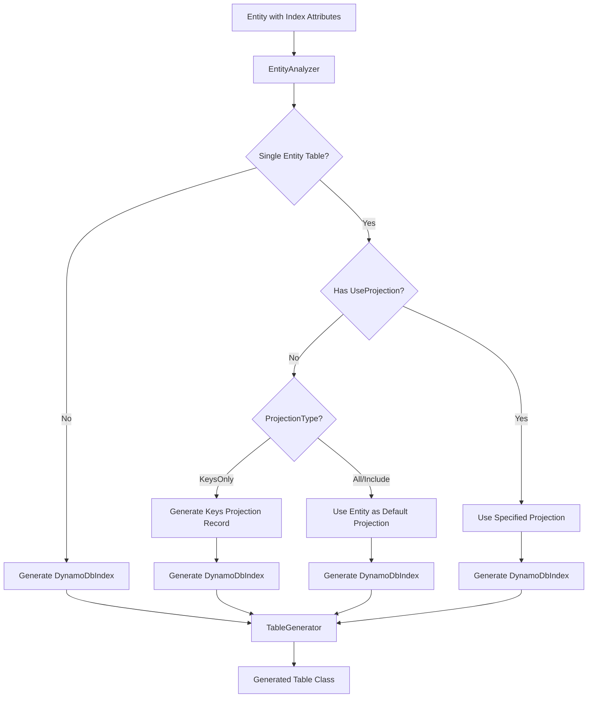

# Design Document: Automatic Index Projections

## Overview

This feature enhances the source generator to automatically create appropriate projection types for GSI/LSI indexes based on table design and configuration. The key improvements are:

1. **Single-entity tables** automatically use the main entity type as the default projection for indexes, enabling non-generic `Query()` methods
2. **ProjectionType property** on index attributes allows specifying ALL, KEYS_ONLY, or INCLUDE projection types
3. **Auto-generated Keys Only projections** create read-only record types when `ProjectionType = KeysOnly` is specified

This reduces boilerplate for common scenarios while maintaining full flexibility for advanced use cases.

### Important: ProjectionType is Metadata Only

The `ProjectionType` property on index attributes is **metadata only** and does not affect query behavior:

- **DynamoDB Index Projection** (configured when creating the index in AWS): Determines what attributes are physically stored in the index
- **Query Projection Expression** (set via `WithProjection()` or `[UseProjection]`): Determines what attributes to return from a query

The `ProjectionType` attribute property serves these purposes:
1. **Documentation**: Reflects the actual DynamoDB index configuration for code clarity
2. **Schema Validation**: Enables validation that the index is configured as expected
3. **Keys Only Auto-Generation**: Triggers generation of a keys-only projection record when `KeysOnly` is specified
4. **Metadata Population**: Populates `IndexMetadata.ProjectionType` for tooling and introspection

The `[UseProjection]` attribute and `WithProjection()` method work independently - they control what the query returns, regardless of what's physically stored in the index. If you query for attributes not in the index projection, DynamoDB will fetch them from the base table (for GSIs) or return them if available (for LSIs with ALL projection).

## Architecture

### Component Interaction



### Decision Flow for Index Generation

| Condition | Result |
|-----------|--------|
| Multi-entity table, no `[UseProjection]` | `DynamoDbIndex` (simple, generic required) |
| Multi-entity table, has `[UseProjection]` | `DynamoDbIndex<TProjection>` |
| Single-entity table, no `[UseProjection]`, `ProjectionType = All` | `DynamoDbIndex<TEntity>` |
| Single-entity table, no `[UseProjection]`, `ProjectionType = KeysOnly` | `DynamoDbIndex<{Index}KeysProjection>` |
| Single-entity table, has `[UseProjection]` | `DynamoDbIndex<TProjection>` |

## Components and Interfaces

### Modified Attributes

#### GlobalSecondaryIndexAttribute Enhancement

```csharp
namespace Oproto.FluentDynamoDb.Attributes;

[AttributeUsage(AttributeTargets.Property)]
public class GlobalSecondaryIndexAttribute : Attribute
{
    // Existing properties...
    public string IndexName { get; }
    public string? Name { get; set; }
    public bool IsPartitionKey { get; set; }
    public bool IsSortKey { get; set; }
    public string? KeyFormat { get; set; }
    public string? DiscriminatorProperty { get; set; }
    public string? DiscriminatorValue { get; set; }
    public string? DiscriminatorPattern { get; set; }
    
    // NEW: ProjectionType property
    /// <summary>
    /// Gets or sets the DynamoDB projection type for this index.
    /// Defaults to <see cref="Metadata.ProjectionType.All"/>.
    /// When set to <see cref="Metadata.ProjectionType.KeysOnly"/>, 
    /// a read-only projection record is auto-generated.
    /// </summary>
    public ProjectionType ProjectionType { get; set; } = ProjectionType.All;
    
    public GlobalSecondaryIndexAttribute(string indexName) { ... }
}
```

#### LocalSecondaryIndexAttribute Enhancement

```csharp
namespace Oproto.FluentDynamoDb.Attributes;

[AttributeUsage(AttributeTargets.Property)]
public class LocalSecondaryIndexAttribute : Attribute
{
    // Existing properties...
    public string IndexName { get; }
    public string? Name { get; set; }
    
    // NEW: ProjectionType property
    /// <summary>
    /// Gets or sets the DynamoDB projection type for this index.
    /// Defaults to <see cref="Metadata.ProjectionType.All"/>.
    /// When set to <see cref="Metadata.ProjectionType.KeysOnly"/>, 
    /// a read-only projection record is auto-generated.
    /// </summary>
    public ProjectionType ProjectionType { get; set; } = ProjectionType.All;
    
    public LocalSecondaryIndexAttribute(string indexName) { ... }
}
```

### Source Generator Changes

#### IndexModel Enhancement

```csharp
// In Oproto.FluentDynamoDb.SourceGenerator/Models/IndexModel.cs
public class IndexModel
{
    // Existing properties...
    public string IndexName { get; set; }
    public string? CustomName { get; set; }
    public string? ResolvedPropertyName { get; set; }
    public bool IsGsi { get; set; }
    public string PartitionKeyProperty { get; set; }
    public string? SortKeyProperty { get; set; }
    public bool HasSortKey { get; set; }
    public string[] ProjectedProperties { get; set; }
    
    // NEW: ProjectionType from attribute
    public ProjectionType ProjectionType { get; set; } = ProjectionType.All;
    
    // NEW: Computed property for Keys Only generation
    public bool RequiresKeysOnlyProjection => ProjectionType == ProjectionType.KeysOnly;
}
```

#### EntityAnalyzer Changes

The `EntityAnalyzer` will be updated to:

1. Parse the `ProjectionType` property from index attributes
2. Determine if the table is single-entity or multi-entity
3. Set appropriate flags for projection generation

```csharp
// Pseudocode for enhanced index analysis
private IndexModel AnalyzeIndex(PropertyDeclarationSyntax property, AttributeData indexAttribute)
{
    var model = new IndexModel
    {
        IndexName = GetIndexName(indexAttribute),
        // ... existing analysis ...
        
        // NEW: Parse ProjectionType
        ProjectionType = GetProjectionType(indexAttribute)
    };
    
    return model;
}

private ProjectionType GetProjectionType(AttributeData attribute)
{
    var projectionTypeArg = attribute.NamedArguments
        .FirstOrDefault(a => a.Key == "ProjectionType");
    
    if (projectionTypeArg.Value.Value is int value)
    {
        return (ProjectionType)value;
    }
    
    return ProjectionType.All; // Default
}
```

#### TableGenerator Changes

The `TableGenerator` will be updated to:

1. Detect single-entity vs multi-entity tables
2. Generate appropriate index properties based on the decision flow
3. Generate Keys Only projection records when needed

```csharp
// Pseudocode for enhanced index generation
private void GenerateIndexProperties(StringBuilder sb, EntityModel entity, string tableClassName, bool isSingleEntityTable)
{
    foreach (var index in entity.Indexes)
    {
        var projectionType = DetermineProjectionType(entity, index, isSingleEntityTable);
        
        if (projectionType != null)
        {
            // Generate typed index with projection
            GenerateTypedIndexProperty(sb, index, projectionType, tableClassName);
        }
        else
        {
            // Generate simple DynamoDbIndex (multi-entity, no projection)
            GenerateSimpleIndexProperty(sb, index);
        }
    }
}

private string? DetermineProjectionType(EntityModel entity, IndexModel index, bool isSingleEntityTable)
{
    // 1. Check for explicit [UseProjection] - highest priority
    var explicitProjection = GetProjectionTypeForIndex(entity, index);
    if (explicitProjection != null && explicitProjection != "HasProjection")
    {
        return explicitProjection;
    }
    
    // 2. Check for KeysOnly - generates auto projection
    if (index.ProjectionType == ProjectionType.KeysOnly)
    {
        return $"{index.ResolvedPropertyName}KeysProjection";
    }
    
    // 3. Single-entity table - use entity type
    if (isSingleEntityTable)
    {
        return entity.ClassName;
    }
    
    // 4. Multi-entity table without projection - simple index
    return null;
}
```

### Generated Keys Only Projection Record

When `ProjectionType = KeysOnly` is specified, the generator creates a nested record. Per DynamoDB behavior, "Keys Only" projection includes:

- **For GSI**: The GSI's partition key and sort key (if any), PLUS the base table's partition key and sort key
- **For LSI**: The base table's partition key, the LSI's sort key, and the base table's sort key (if different)

```csharp
// Example generated code for an index named "StatusIndex" on entity "Order"
// GSI keys: partition key "Gsi1Pk", sort key "Gsi1Sk"
// Table keys: partition key "Pk", sort key "Sk"

public partial class OrdersTable
{
    /// <summary>
    /// Keys-only projection for the StatusIndex index.
    /// Contains the GSI keys (gsi1pk, gsi1sk) and the base table keys (pk, sk).
    /// </summary>
    public sealed record StatusIndexKeysProjection : IReadOnlyEntity<StatusIndexKeysProjection>
    {
        // Base table partition key
        /// <summary>
        /// Gets or sets the base table partition key value.
        /// </summary>
        [DynamoDbAttribute("pk")]
        public string Pk { get; init; } = string.Empty;
        
        // Base table sort key
        /// <summary>
        /// Gets or sets the base table sort key value.
        /// </summary>
        [DynamoDbAttribute("sk")]
        public string Sk { get; init; } = string.Empty;
        
        // GSI partition key
        /// <summary>
        /// Gets or sets the GSI partition key value.
        /// </summary>
        [DynamoDbAttribute("gsi1pk")]
        public string Gsi1Pk { get; init; } = string.Empty;
        
        // GSI sort key
        /// <summary>
        /// Gets or sets the GSI sort key value.
        /// </summary>
        [DynamoDbAttribute("gsi1sk")]
        public string Gsi1Sk { get; init; } = string.Empty;
        
        /// <summary>
        /// Gets the projection expression for this projection type.
        /// </summary>
        public static string ProjectionExpression => "pk, sk, gsi1pk, gsi1sk";
        
        /// <summary>
        /// Creates an instance from DynamoDB attributes.
        /// </summary>
        public static StatusIndexKeysProjection FromDynamoDb(
            Dictionary<string, AttributeValue> attributes,
            FluentDynamoDbOptions? options = null)
        {
            return new StatusIndexKeysProjection
            {
                Pk = attributes.TryGetValue("pk", out var tablePk) ? tablePk.S : string.Empty,
                Sk = attributes.TryGetValue("sk", out var tableSk) ? tableSk.S : string.Empty,
                Gsi1Pk = attributes.TryGetValue("gsi1pk", out var gsiPk) ? gsiPk.S : string.Empty,
                Gsi1Sk = attributes.TryGetValue("gsi1sk", out var gsiSk) ? gsiSk.S : string.Empty
            };
        }
        
        // IReadOnlyEntity implementation
        public static EntityMetadata GetEntityMetadata() => Order.GetEntityMetadata();
        public string GetPartitionKey() => Pk;  // Returns base table PK for entity lookup
        public string? GetSortKey() => Sk;      // Returns base table SK for entity lookup
    }
    
    /// <summary>
    /// Global Secondary Index: StatusIndex
    /// GSI Partition Key: Gsi1Pk
    /// GSI Sort Key: Gsi1Sk
    /// Projection: Keys Only (includes base table keys: pk, sk)
    /// </summary>
    public DynamoDbIndex<StatusIndexKeysProjection> StatusIndex => 
        new DynamoDbIndex<StatusIndexKeysProjection>(this, "StatusIndex", StatusIndexKeysProjection.ProjectionExpression);
}
```

## Data Models

### IndexMetadata Updates

The existing `IndexMetadata` class already has the necessary properties, and both `SchemaValidator` and `TableCreator` already use `IndexMetadata.ProjectionType`. The source generator will now populate these values correctly from the attribute:

```csharp
// Generated metadata example
new IndexMetadata
{
    IndexName = "StatusIndex",
    IndexType = IndexType.GlobalSecondaryIndex,
    PartitionKeyProperty = "Gsi1Pk",
    PartitionKeyAttributeName = "gsi1pk",
    PartitionKeyAttributeType = "S",
    SortKeyProperty = "Gsi1Sk",
    SortKeyAttributeName = "gsi1sk",
    SortKeyAttributeType = "S",
    ProjectionType = ProjectionType.KeysOnly,  // From attribute - used by TableCreator and SchemaValidator
    HasProjectionModel = true,                  // True for KeysOnly
    ProjectedProperties = new[] { "pk", "sk", "gsi1pk", "gsi1sk" }  // All keys for KeysOnly
}
```

### Integration with Existing Features

**Schema Validation** (`SchemaValidator.ValidateIndexProjection`):
- Already compares `IndexMetadata.ProjectionType` against actual DynamoDB index projection
- Will now receive accurate projection type from source generator
- No changes needed to validation logic

**Table Creation** (`TableCreator.BuildProjection`):
- Already uses `IndexMetadata.ProjectionType` to set `Projection.ProjectionType`
- Already handles `ProjectedProperties` for INCLUDE projections
- No changes needed to creation logic

The only change needed is in the source generator to populate `IndexMetadata.ProjectionType` from the attribute value instead of always defaulting to `All`.

## Correctness Properties

*A property is a characteristic or behavior that should hold true across all valid executions of a system—essentially, a formal statement about what the system should do. Properties serve as the bridge between human-readable specifications and machine-verifiable correctness guarantees.*

### Property 1: Single-entity table indexes use entity as default projection

*For any* single-entity table with an index that has no `[UseProjection]` attribute and `ProjectionType != KeysOnly`, the generated index property SHALL be `DynamoDbIndex<TEntity>` where `TEntity` is the entity type.

**Validates: Requirements 1.1, 1.2**

### Property 2: Multi-entity table indexes use simple DynamoDbIndex

*For any* multi-entity table with an index that has no `[UseProjection]` attribute, the generated index property SHALL be `DynamoDbIndex` (non-generic).

**Validates: Requirements 1.3, 6.2**

### Property 3: Explicit UseProjection takes precedence

*For any* index with an explicit `[UseProjection(typeof(T))]` attribute, the generated index property SHALL use `DynamoDbIndex<T>` regardless of single-entity or multi-entity table design.

**Validates: Requirements 1.4, 6.3**

### Property 4: ProjectionType defaults to All

*For any* index attribute without an explicit `ProjectionType` value, the generated `IndexMetadata.ProjectionType` SHALL be `ProjectionType.All`.

**Validates: Requirements 2.3, 6.1**

### Property 5: ProjectionType propagates to metadata

*For any* index attribute with an explicit `ProjectionType` value, the generated `IndexMetadata.ProjectionType` SHALL equal the specified value.

**Validates: Requirements 2.4, 4.1**

### Property 6: KeysOnly generates correct projection structure

*For any* index with `ProjectionType = KeysOnly`:
- A record named `{IndexPropertyName}KeysProjection` SHALL be generated
- For GSI: the record SHALL contain the GSI keys AND the base table keys
- For LSI: the record SHALL contain the base table partition key, LSI sort key, and base table sort key
- The record SHALL implement `IReadOnlyEntity<TSelf>`
- The record SHALL be nested within the table class
- The record SHALL have a `FromDynamoDb` method
- The record SHALL NOT have a `ToDynamoDb` method
- The `GetPartitionKey()` and `GetSortKey()` methods SHALL return base table keys
- The index property SHALL be `DynamoDbIndex<{IndexPropertyName}KeysProjection>`
- `IndexMetadata.HasProjectionModel` SHALL be `true`
- `IndexMetadata.ProjectedProperties` SHALL contain all key attribute names (GSI + table keys)

**Validates: Requirements 2.5, 3.1, 3.2, 3.3, 3.4, 3.5, 3.6, 3.7, 3.8, 3.9, 4.2, 4.3**

## Error Handling

### Diagnostic Codes

| Code | Severity | Description |
|------|----------|-------------|
| FDDB070 | Warning | `ProjectionType = Include` specified but no `ProjectedProperties` defined |
| FDDB071 | Error | `ProjectionType = KeysOnly` on index without sort key (LSI only has sort key) |
| FDDB072 | Warning | `ProjectionType = KeysOnly` combined with `[UseProjection]` - UseProjection takes precedence |

### Error Scenarios

1. **Include without properties**: When `ProjectionType = Include` is specified but no projected properties are defined, emit warning FDDB070
2. **KeysOnly on partition-only index**: For GSIs with only a partition key (no sort key), the Keys Only projection will contain only the partition key - this is valid
3. **Conflicting attributes**: When both `ProjectionType = KeysOnly` and `[UseProjection]` are specified, `[UseProjection]` takes precedence with warning FDDB072

## Testing Strategy

### Unit Tests

Unit tests will verify:
- Attribute property parsing
- Single-entity vs multi-entity detection
- Index property generation logic
- Keys Only projection record generation
- Metadata population

### Property-Based Tests

Property-based tests using FsCheck will verify the correctness properties defined above:

1. **Property 1 Test**: Generate random single-entity table configurations, verify `DynamoDbIndex<TEntity>` generation
2. **Property 2 Test**: Generate random multi-entity table configurations, verify `DynamoDbIndex` generation
3. **Property 3 Test**: Generate configurations with `[UseProjection]`, verify specified type is used
4. **Property 4 Test**: Generate indexes without `ProjectionType`, verify default is `All`
5. **Property 5 Test**: Generate indexes with various `ProjectionType` values, verify metadata
6. **Property 6 Test**: Generate indexes with `KeysOnly`, verify complete projection structure

### Integration Tests

Integration tests will verify end-to-end scenarios:
- Querying single-entity table indexes without type parameter
- Querying with auto-generated Keys Only projections
- Schema validation with different projection types
