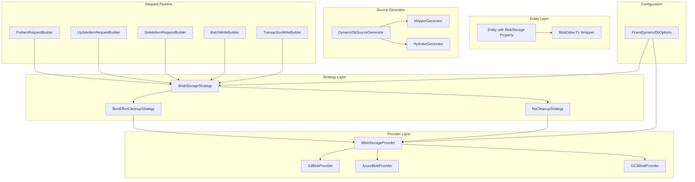

# Design Document: Blob Storage Redesign

## Overview

This design document describes the redesign of the blob storage feature in Oproto.FluentDynamoDb. The redesign addresses several issues with the current `[BlobReference]` implementation:

1. **Confusing semantics**: The attribute name suggests a reference, but the property holds actual data
2. **No transaction safety**: S3 and DynamoDB operations are out-of-band with no coordination on failures
3. **Eager loading only**: All blob data is downloaded on entity retrieval, even if unused
4. **No failure recovery**: If DynamoDB write fails after S3 upload, orphaned blobs remain

The redesign introduces:
- A renamed `[BlobStorage]` attribute with clear semantics
- A `BlobData<T>` wrapper type for lazy/eager loading control
- An `IBlobStorageStrategy` interface for coordinating failure handling
- Built-in strategies: `BestEffortCleanupStrategy` and `NoCleanupStrategy`

## Architecture



## Components and Interfaces

### BlobStorageAttribute

Replaces `[BlobReference]` with clearer semantics:

```csharp
namespace Oproto.FluentDynamoDb.Attributes;

[AttributeUsage(AttributeTargets.Property)]
public class BlobStorageAttribute : Attribute
{
    /// <summary>
    /// Gets or sets whether to defer blob loading until explicitly requested.
    /// Default is false (eager loading).
    /// </summary>
    public bool LazyLoad { get; set; } = false;
}
```

### BlobData&lt;T&gt; Wrapper Type

A wrapper type that encapsulates blob storage behavior:

```csharp
namespace Oproto.FluentDynamoDb.Providers.BlobStorage;

public sealed class BlobData<T>
{
    private T? _value;
    private readonly IBlobStorageProvider? _provider;
    private readonly FluentDynamoDbOptions? _options;
    
    /// <summary>
    /// Gets the loaded data value. Throws InvalidOperationException if not loaded.
    /// </summary>
    public T Value => IsLoaded 
        ? _value! 
        : throw new InvalidOperationException(
            "Blob data has not been loaded. Call LoadAsync() first or configure eager loading.");
    
    /// <summary>
    /// Gets the reference key for the stored blob, or null if not yet stored.
    /// </summary>
    public string? ReferenceKey { get; private set; }
    
    /// <summary>
    /// Gets whether the blob data has been loaded from storage.
    /// </summary>
    public bool IsLoaded { get; private set; }
    
    /// <summary>
    /// Gets whether this instance has data to be stored (created via Create()).
    /// </summary>
    public bool HasPendingData { get; private set; }
    
    /// <summary>
    /// Creates a new BlobData instance with data to be stored.
    /// </summary>
    public static BlobData<T> Create(T value) => new()
    {
        _value = value,
        IsLoaded = true,
        HasPendingData = true
    };
    
    /// <summary>
    /// Creates a BlobData instance from a reference key (for deserialization).
    /// </summary>
    internal static BlobData<T> FromReferenceKey(
        string referenceKey, 
        IBlobStorageProvider provider,
        FluentDynamoDbOptions options) => new()
    {
        ReferenceKey = referenceKey,
        _provider = provider,
        _options = options,
        IsLoaded = false,
        HasPendingData = false
    };
    
    /// <summary>
    /// Loads the blob data from storage asynchronously.
    /// </summary>
    public async Task LoadAsync(CancellationToken cancellationToken = default)
    {
        if (IsLoaded) return;
        
        if (_provider == null)
            throw new InvalidOperationException(
                "Cannot load blob data: no blob storage provider configured. " +
                "Call FluentDynamoDbOptions.WithBlobStorage() to configure a provider.");
        
        if (string.IsNullOrEmpty(ReferenceKey))
            throw new InvalidOperationException(
                "Cannot load blob data: no reference key available.");
        
        try
        {
            using var stream = await _provider.RetrieveAsync(ReferenceKey, cancellationToken);
            _value = await DeserializeAsync(stream, cancellationToken);
            IsLoaded = true;
        }
        catch (Exception ex) when (ex is not InvalidOperationException)
        {
            throw new BlobStorageException(
                $"Failed to load blob data from storage. ReferenceKey: {ReferenceKey}", ex);
        }
    }
    
    private async Task<T> DeserializeAsync(Stream stream, CancellationToken ct)
    {
        // Implementation handles JSON deserialization if configured,
        // decryption if [Encrypted], etc.
        // Generated code will provide the actual implementation.
        throw new NotImplementedException("Generated code provides implementation");
    }
    
    private BlobData() { }
}
```

### IBlobStorageStrategy Interface

Coordinates blob storage and DynamoDB operations:

```csharp
namespace Oproto.FluentDynamoDb.Providers.BlobStorage;

public interface IBlobStorageStrategy
{
    /// <summary>
    /// Called before DynamoDB write to upload blob data.
    /// Returns the reference keys for the uploaded blobs.
    /// </summary>
    Task<BlobWriteResult> OnBeforeDynamoDbWriteAsync(
        BlobWriteContext context,
        CancellationToken cancellationToken = default);
    
    /// <summary>
    /// Called after successful DynamoDB write.
    /// Can be used to finalize or commit blob operations.
    /// </summary>
    Task OnAfterDynamoDbWriteSuccessAsync(
        BlobWriteContext context,
        CancellationToken cancellationToken = default);
    
    /// <summary>
    /// Called after failed DynamoDB write.
    /// Can be used to clean up uploaded blobs.
    /// </summary>
    Task OnAfterDynamoDbWriteFailureAsync(
        BlobWriteContext context,
        Exception exception,
        CancellationToken cancellationToken = default);
    
    /// <summary>
    /// Called before DynamoDB delete to prepare for blob cleanup.
    /// </summary>
    Task<BlobDeleteContext> OnBeforeDynamoDbDeleteAsync(
        BlobDeleteContext context,
        CancellationToken cancellationToken = default);
    
    /// <summary>
    /// Called after successful DynamoDB delete to clean up blobs.
    /// </summary>
    Task OnAfterDynamoDbDeleteSuccessAsync(
        BlobDeleteContext context,
        CancellationToken cancellationToken = default);
}

public class BlobWriteContext
{
    public required string EntityType { get; init; }
    public required IReadOnlyList<BlobPropertyContext> BlobProperties { get; init; }
    public IReadOnlyDictionary<string, string>? UploadedReferenceKeys { get; set; }
}

public class BlobPropertyContext
{
    public required string PropertyName { get; init; }
    public required string AttributeName { get; init; }
    public required Stream Data { get; init; }
    public string? ContentType { get; init; }
    public string? ExistingReferenceKey { get; init; }
}

public class BlobWriteResult
{
    public required IReadOnlyDictionary<string, string> ReferenceKeys { get; init; }
}

public class BlobDeleteContext
{
    public required string EntityType { get; init; }
    public required IReadOnlyList<string> ReferenceKeys { get; init; }
}
```

### BlobStoreOptions

Options for blob storage operations:

```csharp
namespace Oproto.FluentDynamoDb.Providers.BlobStorage;

public class BlobStoreOptions
{
    /// <summary>
    /// Gets or sets the content type (MIME type) of the blob.
    /// </summary>
    public string? ContentType { get; set; }
    
    /// <summary>
    /// Gets or sets custom metadata to store with the blob.
    /// </summary>
    public IDictionary<string, string>? Metadata { get; set; }
    
    /// <summary>
    /// Gets or sets tags to apply to the blob (for providers that support tagging).
    /// </summary>
    public IDictionary<string, string>? Tags { get; set; }
}
```

### Updated IBlobStorageProvider Interface

Extended to support metadata:

```csharp
namespace Oproto.FluentDynamoDb.Providers.BlobStorage;

public interface IBlobStorageProvider
{
    Task<string> StoreAsync(
        Stream data,
        string? suggestedKey = null,
        CancellationToken cancellationToken = default);
    
    Task<string> StoreAsync(
        Stream data,
        BlobStoreOptions options,
        string? suggestedKey = null,
        CancellationToken cancellationToken = default);
    
    Task<Stream> RetrieveAsync(
        string referenceKey,
        CancellationToken cancellationToken = default);
    
    Task DeleteAsync(
        string referenceKey,
        CancellationToken cancellationToken = default);
    
    Task<bool> ExistsAsync(
        string referenceKey,
        CancellationToken cancellationToken = default);
}
```

### BestEffortCleanupStrategy

Default strategy that attempts cleanup on failure:

```csharp
namespace Oproto.FluentDynamoDb.Providers.BlobStorage;

public class BestEffortCleanupStrategy : IBlobStorageStrategy
{
    private readonly IBlobStorageProvider _provider;
    private readonly IDynamoDbLogger? _logger;
    
    public BestEffortCleanupStrategy(
        IBlobStorageProvider provider, 
        IDynamoDbLogger? logger = null)
    {
        _provider = provider;
        _logger = logger;
    }
    
    public async Task<BlobWriteResult> OnBeforeDynamoDbWriteAsync(
        BlobWriteContext context,
        CancellationToken cancellationToken = default)
    {
        var referenceKeys = new Dictionary<string, string>();
        
        foreach (var prop in context.BlobProperties)
        {
            var key = await _provider.StoreAsync(
                prop.Data, 
                prop.ExistingReferenceKey, 
                cancellationToken);
            referenceKeys[prop.PropertyName] = key;
        }
        
        context.UploadedReferenceKeys = referenceKeys;
        return new BlobWriteResult { ReferenceKeys = referenceKeys };
    }
    
    public Task OnAfterDynamoDbWriteSuccessAsync(
        BlobWriteContext context,
        CancellationToken cancellationToken = default)
    {
        // Nothing to do on success - blobs are already stored
        return Task.CompletedTask;
    }
    
    public async Task OnAfterDynamoDbWriteFailureAsync(
        BlobWriteContext context,
        Exception exception,
        CancellationToken cancellationToken = default)
    {
        if (context.UploadedReferenceKeys == null) return;
        
        foreach (var (propertyName, referenceKey) in context.UploadedReferenceKeys)
        {
            try
            {
                await _provider.DeleteAsync(referenceKey, cancellationToken);
                _logger?.LogDebug(
                    LogEventIds.BlobCleanupSuccess,
                    "Cleaned up orphaned blob after DynamoDB write failure. " +
                    "Property: {PropertyName}, Key: {ReferenceKey}",
                    propertyName, referenceKey);
            }
            catch (Exception cleanupEx)
            {
                _logger?.LogWarning(
                    LogEventIds.BlobCleanupFailed,
                    "Failed to clean up orphaned blob after DynamoDB write failure. " +
                    "Property: {PropertyName}, Key: {ReferenceKey}, Error: {Error}",
                    propertyName, referenceKey, cleanupEx.Message);
                // Continue without throwing - best effort cleanup
            }
        }
    }
    
    public Task<BlobDeleteContext> OnBeforeDynamoDbDeleteAsync(
        BlobDeleteContext context,
        CancellationToken cancellationToken = default)
    {
        // Store reference keys for cleanup after successful delete
        return Task.FromResult(context);
    }
    
    public async Task OnAfterDynamoDbDeleteSuccessAsync(
        BlobDeleteContext context,
        CancellationToken cancellationToken = default)
    {
        foreach (var referenceKey in context.ReferenceKeys)
        {
            try
            {
                await _provider.DeleteAsync(referenceKey, cancellationToken);
            }
            catch (Exception ex)
            {
                _logger?.LogWarning(
                    LogEventIds.BlobCleanupFailed,
                    "Failed to delete blob after entity deletion. Key: {ReferenceKey}, Error: {Error}",
                    referenceKey, ex.Message);
                // Continue without throwing - best effort cleanup
            }
        }
    }
}
```

### NoCleanupStrategy

Simple strategy with no cleanup:

```csharp
namespace Oproto.FluentDynamoDb.Providers.BlobStorage;

public class NoCleanupStrategy : IBlobStorageStrategy
{
    private readonly IBlobStorageProvider _provider;
    
    public NoCleanupStrategy(IBlobStorageProvider provider)
    {
        _provider = provider;
    }
    
    public async Task<BlobWriteResult> OnBeforeDynamoDbWriteAsync(
        BlobWriteContext context,
        CancellationToken cancellationToken = default)
    {
        var referenceKeys = new Dictionary<string, string>();
        
        foreach (var prop in context.BlobProperties)
        {
            var key = await _provider.StoreAsync(
                prop.Data, 
                prop.ExistingReferenceKey, 
                cancellationToken);
            referenceKeys[prop.PropertyName] = key;
        }
        
        return new BlobWriteResult { ReferenceKeys = referenceKeys };
    }
    
    public Task OnAfterDynamoDbWriteSuccessAsync(
        BlobWriteContext context,
        CancellationToken cancellationToken = default) => Task.CompletedTask;
    
    public Task OnAfterDynamoDbWriteFailureAsync(
        BlobWriteContext context,
        Exception exception,
        CancellationToken cancellationToken = default) => Task.CompletedTask;
    
    public Task<BlobDeleteContext> OnBeforeDynamoDbDeleteAsync(
        BlobDeleteContext context,
        CancellationToken cancellationToken = default) => Task.FromResult(context);
    
    public Task OnAfterDynamoDbDeleteSuccessAsync(
        BlobDeleteContext context,
        CancellationToken cancellationToken = default) => Task.CompletedTask;
}
```

### FluentDynamoDbOptions Extensions

```csharp
public class FluentDynamoDbOptions
{
    // Existing properties...
    
    public IBlobStorageProvider? BlobStorageProvider { get; private set; }
    public IBlobStorageStrategy? BlobStorageStrategy { get; private set; }
    
    public FluentDynamoDbOptions WithBlobStorage(IBlobStorageProvider provider)
    {
        BlobStorageProvider = provider ?? throw new ArgumentNullException(nameof(provider));
        
        // Set default strategy if not already configured
        BlobStorageStrategy ??= new BestEffortCleanupStrategy(provider, Logger);
        
        return this;
    }
    
    public FluentDynamoDbOptions WithBlobStorageStrategy(IBlobStorageStrategy strategy)
    {
        BlobStorageStrategy = strategy ?? throw new ArgumentNullException(nameof(strategy));
        return this;
    }
}
```

## Data Models

### Attribute Value Serialization

`BlobData<T>` serializes to DynamoDB as a simple string containing the reference key:

```json
{
  "pk": { "S": "USER#123" },
  "sk": { "S": "PROFILE" },
  "largeDocument": { "S": "documents/user-123/profile-doc-abc123.json" }
}
```

### Processing Pipeline Order

For properties with multiple attributes, the processing order is:

**Serialization (ToDynamoDb):**
1. Get value from `BlobData<T>.Value`
2. If `[JsonBlob]`: Serialize to JSON
3. If `[Encrypted]`: Encrypt the data
4. Upload to blob storage via strategy
5. Store reference key in DynamoDB

**Deserialization (FromDynamoDb):**
1. Read reference key from DynamoDB
2. Create `BlobData<T>` with reference key
3. If eager loading: Call `LoadAsync()` which:
   - Downloads from blob storage
   - If `[Encrypted]`: Decrypt the data
   - If `[JsonBlob]`: Deserialize from JSON
4. Return entity with populated `BlobData<T>`

## Correctness Properties

*A property is a characteristic or behavior that should hold true across all valid executions of a system-essentially, a formal statement about what the system should do. Properties serve as the bridge between human-readable specifications and machine-verifiable correctness guarantees.*

### Property 1: BlobData Value Access Throws When Not Loaded
*For any* `BlobData<T>` instance that has `IsLoaded = false`, accessing the `Value` property SHALL throw `InvalidOperationException`.
**Validates: Requirements 2.1, 3.3**

### Property 2: BlobData ReferenceKey Reflects Storage State
*For any* `BlobData<T>` instance, `ReferenceKey` SHALL be non-null if and only if the data has been stored or the instance was created from a reference key.
**Validates: Requirements 2.2**

### Property 3: BlobData IsLoaded State Consistency
*For any* `BlobData<T>` instance, `IsLoaded` SHALL be true if and only if `Value` can be accessed without throwing.
**Validates: Requirements 2.3**

### Property 4: LoadAsync Idempotence
*For any* `BlobData<T>` instance, calling `LoadAsync()` multiple times SHALL result in exactly one call to the blob storage provider.
**Validates: Requirements 2.5**

### Property 5: BlobData Create Factory Produces Loaded Instance
*For any* value of type T, `BlobData<T>.Create(value)` SHALL produce an instance where `IsLoaded = true` and `Value` returns the provided value.
**Validates: Requirements 2.6**

### Property 6: BlobData Serialization Round Trip
*For any* `BlobData<T>` instance with data, serializing to DynamoDB and deserializing back SHALL produce an equivalent instance after calling `LoadAsync()`.
**Validates: Requirements 2.7**

### Property 7: Eager Loading Populates Value During Deserialization
*For any* entity with `[BlobStorage(LazyLoad = false)]` properties, after `FromDynamoDbAsync()` completes, all blob properties SHALL have `IsLoaded = true`.
**Validates: Requirements 3.1, 3.4**

### Property 8: Lazy Loading Defers Value Population
*For any* entity with `[BlobStorage(LazyLoad = true)]` properties, after `FromDynamoDb()` completes, all blob properties SHALL have `IsLoaded = false` until `LoadAsync()` is called.
**Validates: Requirements 3.2**

### Property 9: Strategy Lifecycle Order for Writes
*For any* Put or Update operation on an entity with `[BlobStorage]` properties, the strategy methods SHALL be called in order: `OnBeforeDynamoDbWriteAsync` → DynamoDB operation → `OnAfterDynamoDbWriteSuccessAsync` or `OnAfterDynamoDbWriteFailureAsync`.
**Validates: Requirements 4.1, 4.2, 4.3, 7.1, 7.2**

### Property 10: Strategy Lifecycle Order for Deletes
*For any* Delete operation on an entity with `[BlobStorage]` properties, the strategy methods SHALL be called in order: `OnBeforeDynamoDbDeleteAsync` → DynamoDB operation → `OnAfterDynamoDbDeleteSuccessAsync`.
**Validates: Requirements 4.4, 7.3**

### Property 11: BestEffortCleanupStrategy Attempts Cleanup on Write Failure
*For any* DynamoDB write failure when using `BestEffortCleanupStrategy`, the strategy SHALL attempt to delete all blobs uploaded in `OnBeforeDynamoDbWriteAsync`.
**Validates: Requirements 5.1**

### Property 12: BestEffortCleanupStrategy Cleanup Failures Don't Propagate
*For any* cleanup failure in `BestEffortCleanupStrategy`, the strategy SHALL log the failure and complete without throwing an exception.
**Validates: Requirements 5.2**

### Property 13: NoCleanupStrategy Never Deletes Blobs
*For any* operation using `NoCleanupStrategy`, the strategy SHALL never call `DeleteAsync` on the blob storage provider.
**Validates: Requirements 6.1, 6.2, 6.3**

### Property 14: Missing Provider Configuration Throws
*For any* operation on an entity with `[BlobStorage]` properties when no provider is configured, the operation SHALL throw `InvalidOperationException` with a message indicating the missing configuration.
**Validates: Requirements 8.1, 8.2**

### Property 15: Provider Errors Wrapped in BlobStorageException
*For any* blob storage provider failure, the error SHALL be wrapped in `BlobStorageException` with the original exception as the inner exception.
**Validates: Requirements 8.3, 8.4**

### Property 16: JsonBlob Serialization Order
*For any* property with both `[BlobStorage]` and `[JsonBlob]`, serialization SHALL occur before blob upload, and deserialization SHALL occur after blob download.
**Validates: Requirements 9.1, 9.2**

### Property 17: Encryption Order
*For any* property with both `[BlobStorage]` and `[Encrypted]`, encryption SHALL occur after JSON serialization (if applicable) and before blob upload; decryption SHALL occur after blob download and before JSON deserialization (if applicable).
**Validates: Requirements 11.1, 11.2, 11.5**

### Property 18: Missing Encryptor Configuration Throws
*For any* operation on a property with both `[BlobStorage]` and `[Encrypted]` when no encryptor is configured, the operation SHALL throw `EncryptionRequiredException`.
**Validates: Requirements 11.4**

### Property 19: Sensitive Properties Redacted in Logs
*For any* property with both `[BlobStorage]` and `[Sensitive]`, both the reference key and data value SHALL be redacted in log output.
**Validates: Requirements 10.1, 10.2**

### Property 20: Provider-Agnostic Reference Keys
*For any* `IBlobStorageProvider` implementation, the reference key format returned by `StoreAsync` SHALL be accepted by `RetrieveAsync` and `DeleteAsync` without modification.
**Validates: Requirements 12.6**

## Error Handling

### Exception Types

```csharp
namespace Oproto.FluentDynamoDb.Providers.BlobStorage;

/// <summary>
/// Exception thrown when blob storage operations fail.
/// </summary>
public class BlobStorageException : Exception
{
    public string? ReferenceKey { get; }
    
    public BlobStorageException(string message) : base(message) { }
    
    public BlobStorageException(string message, Exception innerException) 
        : base(message, innerException) { }
    
    public BlobStorageException(string message, string referenceKey, Exception innerException)
        : base(message, innerException)
    {
        ReferenceKey = referenceKey;
    }
}
```

### Error Scenarios

| Scenario | Exception | Message |
|----------|-----------|---------|
| No provider configured | `InvalidOperationException` | "Property '{PropertyName}' has [BlobStorage] attribute but no blob storage provider is configured. Call FluentDynamoDbOptions.WithBlobStorage() to configure a provider." |
| LoadAsync without provider | `InvalidOperationException` | "Cannot load blob data: no blob storage provider configured. Call FluentDynamoDbOptions.WithBlobStorage() to configure a provider." |
| Value access before load | `InvalidOperationException` | "Blob data has not been loaded. Call LoadAsync() first or configure eager loading." |
| Provider store failure | `BlobStorageException` | "Failed to store blob data. {ProviderMessage}" |
| Provider retrieve failure | `BlobStorageException` | "Failed to load blob data from storage. ReferenceKey: {Key}" |
| Encryption required | `EncryptionRequiredException` | "Property '{PropertyName}' has [Encrypted] attribute but no field encryptor is configured. Call FluentDynamoDbOptions.WithEncryption() to configure an encryptor." |

## Testing Strategy

### Dual Testing Approach

The implementation will use both unit tests and property-based tests:

**Unit Tests:**
- Verify specific examples and edge cases
- Test error conditions and exception messages
- Test integration points between components

**Property-Based Tests:**
- Verify universal properties that should hold across all inputs
- Use FsCheck for generating test data
- Each correctness property will have a corresponding property-based test

### Property-Based Testing Framework

The tests will use **FsCheck** (already used in the project for geospatial tests) with a minimum of 100 iterations per property.

### Test Annotations

Each property-based test will be annotated with:
```csharp
/// <summary>
/// **Feature: blob-storage-redesign, Property 1: BlobData Value Access Throws When Not Loaded**
/// </summary>
[Property(MaxTest = 100)]
public Property BlobData_Value_ThrowsWhenNotLoaded()
```

## Breaking Changes

> **Note:** This is a complete redesign of the experimental blob storage feature. The current `[BlobReference]` attribute is replaced entirely by `[BlobStorage]` and `BlobData<T>`. Since this feature is documented as experimental with limited adoption, breaking changes are acceptable.

The `[BlobReference]` attribute will emit deprecation warning DYNDB104 directing users to migrate to `[BlobStorage]`.
