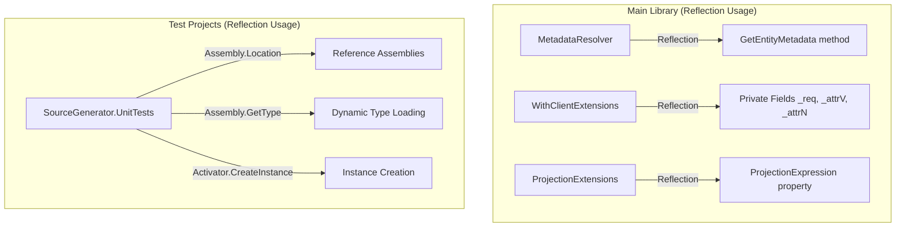
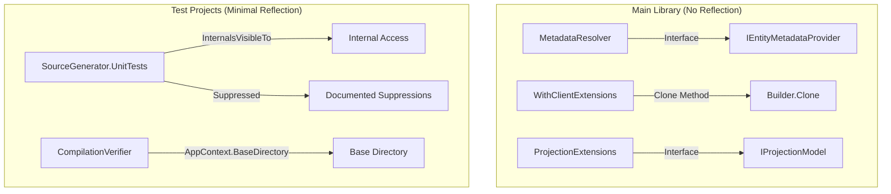

# Design Document: Code Cleanup - Warnings and Reflection Removal

## Overview

This design addresses two related code quality concerns in the Oproto.FluentDynamoDb library:

1. **Compiler Warning Elimination**: The solution currently produces ~200+ warnings during build, primarily from test projects. These warnings obscure real issues and reduce confidence in code quality.

2. **Reflection Removal**: The main library uses reflection in three files (`MetadataResolver.cs`, `WithClientExtensions.cs`, `ProjectionExtensions.cs`), which breaks AOT compatibility and trimmer safety - core promises of the library.

The solution involves refactoring reflection-based code to use compile-time patterns (interfaces, internal accessors, clone methods) and systematically addressing or suppressing warnings with proper documentation.

## Architecture

### Current State



### Target State



## Components and Interfaces

### 1. Entity Metadata Provider Interface

Replace reflection-based metadata discovery with a compile-time interface:

```csharp
namespace Oproto.FluentDynamoDb.Storage;

/// <summary>
/// Interface for entities that provide their own metadata.
/// Implemented by source-generated entity classes.
/// </summary>
public interface IEntityMetadataProvider
{
    /// <summary>
    /// Gets the entity metadata for this type.
    /// </summary>
    static abstract EntityMetadata GetEntityMetadata();
}
```

### 2. Projection Model Interface

Replace reflection-based projection discovery:

```csharp
namespace Oproto.FluentDynamoDb.Storage;

/// <summary>
/// Interface for projection models that provide their projection expression.
/// Implemented by source-generated projection classes.
/// </summary>
public interface IProjectionModel
{
    /// <summary>
    /// Gets the DynamoDB projection expression for this model.
    /// </summary>
    static abstract string ProjectionExpression { get; }
    
    /// <summary>
    /// Creates an instance from DynamoDB attributes.
    /// </summary>
    static abstract IProjectionModel FromDynamoDb(Dictionary<string, AttributeValue> item);
}

/// <summary>
/// Interface for projection models with discriminator support.
/// </summary>
public interface IDiscriminatedProjection : IProjectionModel
{
    /// <summary>
    /// Gets the discriminator property name.
    /// </summary>
    static abstract string? DiscriminatorProperty { get; }
    
    /// <summary>
    /// Gets the expected discriminator value.
    /// </summary>
    static abstract string? DiscriminatorValue { get; }
}
```

### 3. WithClient Method on Builders

Instead of using reflection in extension methods, add a native `WithClient` method directly on each request builder. The simplest solution is to make the client field non-readonly and swap it in place:

```csharp
// In each request builder class, change:
// private readonly IAmazonDynamoDB _dynamoDbClient;
// To:
private IAmazonDynamoDB _dynamoDbClient;

/// <summary>
/// Replaces the DynamoDB client used for executing this request.
/// Used for tenant-specific STS credential scenarios.
/// </summary>
/// <param name="client">The scoped DynamoDB client to use.</param>
/// <returns>This builder instance for method chaining.</returns>
public QueryRequestBuilder<TEntity> WithClient(IAmazonDynamoDB client)
{
    _dynamoDbClient = client;
    return this;
}
```

This is the simplest approach - no copying of state needed, just swap the client reference.
```

### 4. Remove WithClientExtensions

Once `WithClient` methods are added to the builders themselves, the `WithClientExtensions` class can be deleted entirely. This is prerelease code, so no deprecation period is needed.

### 5. Internal Accessor Pattern (for Tests)

For test projects that need access to internal state, use InternalsVisibleTo instead of reflection:

```csharp
// In AssemblyInfo.cs or project file
[assembly: InternalsVisibleTo("Oproto.FluentDynamoDb.UnitTests")]
[assembly: InternalsVisibleTo("Oproto.FluentDynamoDb.SourceGenerator.UnitTests")]
```

### 5. Warning Suppression Strategy

For unavoidable reflection in source generator tests:

```csharp
/// <summary>
/// Helper class for source generator test compilation verification.
/// Contains reflection-based code that is unavoidable for dynamic assembly testing.
/// </summary>
[SuppressMessage("Trimming", "IL2026:RequiresUnreferencedCode", 
    Justification = "Source generator tests require dynamic assembly loading for verification")]
[SuppressMessage("AOT", "IL3050:RequiresDynamicCode",
    Justification = "Source generator tests require dynamic type instantiation")]
internal static class DynamicCompilationHelper
{
    // Isolated reflection code here
}
```

## Data Models

### Builder State Model

Each request builder maintains internal state. The `WithClient` method simply swaps the client reference:

| Builder Type | Client Field Change | WithClient Behavior |
|-------------|---------------------|---------------------|
| QueryRequestBuilder | `readonly` → mutable | Swap client reference, return `this` |
| GetItemRequestBuilder | `readonly` → mutable | Swap client reference, return `this` |
| PutItemRequestBuilder | `readonly` → mutable | Swap client reference, return `this` |
| UpdateItemRequestBuilder | `readonly` → mutable | Swap client reference, return `this` |
| DeleteItemRequestBuilder | `readonly` → mutable | Swap client reference, return `this` |
| ScanRequestBuilder | `readonly` → mutable | Swap client reference, return `this` |

## Correctness Properties

*A property is a characteristic or behavior that should hold true across all valid executions of a system-essentially, a formal statement about what the system should do. Properties serve as the bridge between human-readable specifications and machine-verifiable correctness guarantees.*

### Property 1: No Reflection in Main Library

*For any* source file in the main library projects (Oproto.FluentDynamoDb, Oproto.FluentDynamoDb.SourceGenerator, extension libraries), the file SHALL NOT contain `using System.Reflection` imports or direct reflection API calls (GetMethod, GetProperty, GetField, Invoke, SetValue, GetValue on reflection types).

**Validates: Requirements 2.1**

### Property 2: WithClient Returns Same Builder

*For any* request builder instance, calling `WithClient(newClient)` SHALL return the same builder instance (reference equality) with only the client reference changed. All other configuration (request, attribute mappings) SHALL remain unchanged.

**Validates: Requirements 5.1, 5.4**

### Property 3: Reflection Usage Reduction in Tests

*For any* test file that previously used reflection for member access (Assembly.GetType, Type.GetProperty, Activator.CreateInstance), after refactoring, the file SHALL either use direct type references via InternalsVisibleTo OR have documented suppression attributes with justification.

**Validates: Requirements 3.2, 3.3, 3.4**

### Property 4: WithClient Method Availability

*For any* request builder type (QueryRequestBuilder, GetItemRequestBuilder, PutItemRequestBuilder, UpdateItemRequestBuilder, DeleteItemRequestBuilder, ScanRequestBuilder), the builder SHALL have a public `WithClient(IAmazonDynamoDB client)` method that returns a new builder instance.

**Validates: Requirements 5.2**

## Error Handling

### Compile-Time Errors

- **Missing Interface Implementation**: If an entity doesn't implement `IEntityMetadataProvider`, the source generator will produce a diagnostic
- **Invalid Clone**: If builder state cannot be cloned, throw `InvalidOperationException` with details

### Runtime Errors

- **Projection Mismatch**: `ProjectionValidationException` when projection type doesn't match GSI constraints
- **Mapping Failure**: `DynamoDbMappingException` when entity hydration fails

## Testing Strategy

### Dual Testing Approach

This feature requires both unit tests and property-based tests:

1. **Unit Tests**: Verify specific scenarios like cloning a builder with specific configuration
2. **Property-Based Tests**: Verify universal properties hold across all valid inputs

### Property-Based Testing Framework

Use **FsCheck** (via FsCheck.Xunit) for property-based testing in C#/.NET:

```csharp
[Property]
public Property WithClientPreservesConfiguration(
    string tableName,
    string keyCondition,
    Dictionary<string, string> attributeNames)
{
    // Generate arbitrary builder configuration
    // Call WithClient with a different client
    // Verify request configuration is preserved
}
```

### Test Categories

| Category | Test Type | Framework |
|----------|-----------|-----------|
| Reflection Absence | Static Analysis | Custom analyzer or grep-based |
| WithClient Behavior | Property-Based | FsCheck |
| Warning Count | Integration | dotnet build output parsing |
| InternalsVisibleTo | Unit | xUnit |

### Property Test Configuration

- Minimum iterations: 100 per property
- Each property test tagged with: `**Feature: code-cleanup-warnings-reflection, Property {N}: {description}**`
