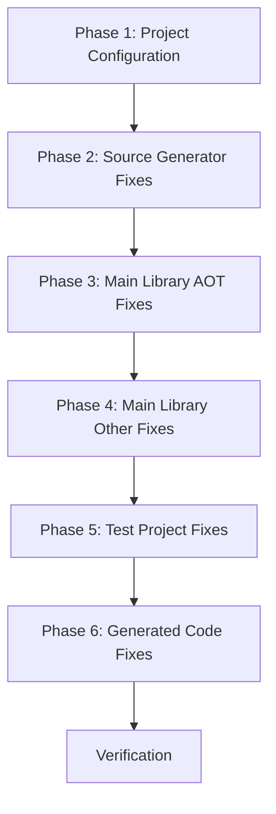

# Design Document: Compile Warning Reduction

## Overview

This design document outlines the approach for systematically reducing the 1,182 compile-time warnings in the Oproto.FluentDynamoDb solution. The strategy prioritizes high-impact fixes that address the root causes of warnings rather than blanket suppressions, while acknowledging that some warnings in test code may be appropriately suppressed with justification.

## Architecture

The warning reduction effort is organized into phases based on warning categories and their impact:



### Phase 1: Project Configuration
- Fix NuGet package version constraints (NU1608)
- Disable AOT/trimming analysis for Source Generator project (NETSDK1210) - Source generators run at compile time in Roslyn, not in user binaries, so they don't need AOT compatibility
- Set up global warning suppressions where appropriate

### Phase 2: Source Generator Fixes
- Address Roslyn analyzer warnings (RS2008, RS1032)
- Fix obsolete API usage (CS0618)

### Phase 3: Main Library AOT Fixes (Critical)
These are real AOT compatibility issues that must be fixed in the main library:

**Oproto.FluentDynamoDb (12 warnings):**
- `DynamoDbMappingException.ToString()` - Remove `RequiresDynamicCode`/`RequiresUnreferencedCode` attributes or restructure to avoid override mismatch (IL2046, IL3051)
- `UpdateExpressionTranslator` - Replace `Array.CreateInstance(Type, Int32)` with AOT-compatible alternative (IL3050)

**Oproto.FluentDynamoDb.Geospatial (16 warnings):**
- `SpatialContinuationToken` - Uses JSON to serialize pagination state (CellIndex + LastEvaluatedKey) to Base64 for passing between requests. Fix: Use System.Text.Json source generation with `[JsonSerializable]` attribute (IL2026, IL3050)
- `SpatialQueryExtensions` - Uses JSON to serialize DynamoDB's `LastEvaluatedKey` dictionary for pagination. Fix: Use System.Text.Json source generation (IL2026, IL3050)

### Phase 4: Main Library Other Fixes
- Resolve nullable reference type warnings
- Fix any remaining library-level issues

### Phase 5: Test Project Fixes
- Address nullable warnings in test code
- Fix async method warnings (CS1998, xUnit1031)
- Suppress AOT/trimming warnings in test projects (tests don't run in AOT mode)
- Address custom analyzer warnings (DYNDB021, DYNDB023)

### Phase 6: Generated Code Fixes
- Update source generator to produce warning-free code
- Add nullable annotations to generated code

## Components and Interfaces

### Warning Suppression Strategy

For warnings that cannot or should not be fixed directly, the following suppression hierarchy applies:

1. **Project-level suppression** (in .csproj): For warnings that apply to entire test projects
2. **File-level suppression** (pragma): For warnings in specific files
3. **Line-level suppression** (pragma): For individual occurrences with justification

### Suppression File Structure

```xml
<!-- In test project .csproj files -->
<PropertyGroup>
  <NoWarn>$(NoWarn);IL2026;IL2075;IL3050</NoWarn>
</PropertyGroup>
```

```csharp
// File-level pragma for test files using reflection
#pragma warning disable IL2026 // Test code intentionally uses reflection
```

## Data Models

No new data models are required for this effort.

## Correctness Properties

*A property is a characteristic or behavior that should hold true across all valid executions of a system-essentially, a formal statement about what the system should do. Properties serve as the bridge between human-readable specifications and machine-verifiable correctness guarantees.*

Given that this specification is about reducing compile warnings, the correctness properties are verification-focused rather than behavioral properties. The primary correctness property is:

**Property 1: Warning Count Reduction**
*For any* build of the solution after implementing fixes, the total warning count SHALL be significantly reduced from the baseline of 1,182 warnings, with a target of fewer than 100 warnings.
**Validates: Requirements 1.1, 1.2, 2.1-2.6, 3.1-3.2, 4.1-4.4, 5.1-5.3, 6.1-6.2, 7.1-7.2, 8.1, 9.1-9.2**

**Property 2: No New Errors**
*For any* warning fix applied, the build SHALL continue to succeed without introducing new compilation errors.
**Validates: Requirements 1.1-9.2**

**Property 3: Test Suite Integrity**
*For any* warning fix applied to test code, all existing tests SHALL continue to pass.
**Validates: Requirements 2.1-2.6, 3.1-3.2, 4.1-4.4, 5.1-5.3, 7.1-7.2**

## Error Handling

### Rollback Strategy
If a warning fix introduces regressions:
1. Revert the specific change
2. Document the issue
3. Consider alternative approaches or suppression

### Verification Process
After each phase:
1. Run full build to verify warning count
2. Run test suite to verify no regressions
3. Document remaining warnings and justifications

## Testing Strategy

### Verification Approach

Since this is a code quality improvement effort, testing consists of:

1. **Build Verification**: Run `dotnet build` and count warnings before and after each phase
2. **Test Suite Execution**: Run `dotnet test` to ensure no regressions
3. **Warning Categorization**: Track warnings by category to measure progress

### Verification Commands

```bash
# Count total warnings
dotnet build 2>&1 | grep -c "warning"

# Count warnings by category
dotnet build 2>&1 | grep -E "warning [A-Z]+[0-9]+" | sed 's/.*warning \([A-Z]*[0-9]*\):.*/\1/' | sort | uniq -c | sort -rn

# Run tests
dotnet test
```

### Success Criteria

| Phase | Target Warning Reduction |
|-------|-------------------------|
| Phase 1 | NU1608, NETSDK1210 → 0 |
| Phase 2 | RS2008, RS1032 → 0 |
| Phase 3 | Main library AOT warnings → 0 (IL2026, IL2046, IL3050, IL3051) |
| Phase 4 | Main library other warnings → 0 |
| Phase 5 | Test warnings reduced by 80% |
| Phase 6 | Generated code warnings → 0 |
| **Total** | **< 100 warnings** |

### Property-Based Testing

This specification does not require property-based testing as the correctness properties are verified through build output analysis rather than runtime behavior.

### Unit Testing

No new unit tests are required. Existing tests serve as regression tests to ensure warning fixes don't break functionality.
