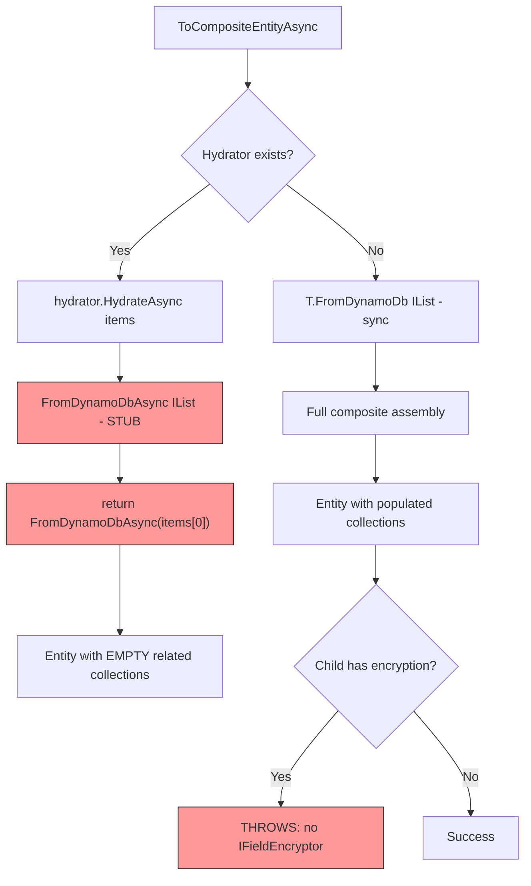
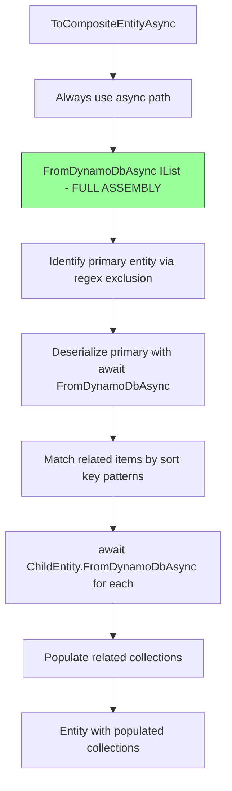

# Composite Entity Related Items Fix - Design

## Overview

The generated multi-item `FromDynamoDbAsync` is a stub that only processes `items[0]`, discarding all related entity items. The fix implements full composite assembly logic in the async multi-item method — primary entity identification, regex-based sort key pattern matching, and related entity collection population — and routes `ToCompositeEntityAsync` through this async path unconditionally. This eliminates the distinction between encrypted/non-encrypted parent entities for composite assembly and ensures child entities with encrypted properties are always deserialized correctly regardless of the parent's encryption status.

## Architecture

### Current Flow (Broken)



### Fixed Flow



## Components and Changes

### 1. Source Generator: `MapperGenerator.cs`

**Method to modify**: The method that generates the multi-item `FromDynamoDbAsync<TSelf>(IList<...> items, ...)` body.

**Current stub**:
```csharp
// Multi-item entity: combine all items into a single entity
// Note: Multi-item entities with blob references not yet fully supported
return await FromDynamoDbAsync<TSelf>(items[0], blobProvider, fieldEncryptor, options, cancellationToken)
    .ConfigureAwait(false);
```

**Replace with**: Full composite assembly logic that mirrors the sync `FromDynamoDb(IList<...> items, ...)` method but uses async deserialization throughout.

Generated code structure for the async multi-item method:

```csharp
public static async Task<TSelf> FromDynamoDbAsync<TSelf>(
    IList<Dictionary<string, AttributeValue>> items,
    IBlobStorageProvider? blobProvider,
    IFieldEncryptor? fieldEncryptor = null,
    FluentDynamoDbOptions? options = null,
    CancellationToken cancellationToken = default) where TSelf : IDynamoDbEntity
{
    if (items == null || items.Count == 0)
        throw new ArgumentException("Items collection cannot be null or empty", nameof(items));

    // If only one item or no relationships, use single-item path
    if (items.Count == 1)
        return await FromDynamoDbAsync<TSelf>(items[0], blobProvider, fieldEncryptor, options, cancellationToken)
            .ConfigureAwait(false);

    var entity = new ParentEntity();

    // ── Primary Entity Identification ──
    // Find the item that does NOT match any [RelatedEntity] pattern
    Dictionary<string, AttributeValue>? primaryItem = null;
    foreach (var item in items)
    {
        if (item.TryGetValue("sk", out var sortKeyValue))
        {
            var sortKey = sortKeyValue.S ?? string.Empty;
            var isPrimaryEntity = true;

            // Exclude items matching related pattern: PARENT#*#CHILD#*
            if (Regex.IsMatch(sortKey, @"^PARENT\#[^\#]*\#CHILD\#[^\#]*$"))
                isPrimaryEntity = false;

            if (isPrimaryEntity)
            {
                primaryItem = item;
                break;
            }
        }
    }

    if (primaryItem == null)
        return default!;

    // ── Deserialize Primary Entity Properties ──
    // (same property-by-property deserialization as single-item, including await for encrypted fields)
    if (primaryItem.TryGetValue("pk", out var pkValue))
        entity.Pk = pkValue.S;
    // ... all properties including encrypted ones with await ...

    // ── Populate Related Entity Collections ──
    var childItems = new List<ChildEntityType>();
    foreach (var item in items)
    {
        if (item.TryGetValue("sk", out var sortKeyValue))
        {
            var sortKey = sortKeyValue.S ?? string.Empty;
            if (Regex.IsMatch(sortKey, @"^PARENT\#[^\#]*\#CHILD\#[^\#]*$"))
            {
                try
                {
                    var relatedEntity = await ChildEntityType.FromDynamoDbAsync<ChildEntityType>(
                        item, blobProvider, fieldEncryptor, options, cancellationToken)
                        .ConfigureAwait(false);
                    childItems.Add(relatedEntity);
                }
                catch (Exception ex)
                {
                    options?.Logger?.LogWarning(...);
                }
            }
        }
    }
    entity.Children = childItems;

    return (TSelf)(object)entity;
}
```

Key points:
- Always uses `await ChildEntity.FromDynamoDbAsync(...)` for related entity deserialization — works whether or not the child has encrypted properties (non-encrypted children just won't await anything meaningful)
- Same regex-based sort key pattern matching as the sync path
- Same primary entity identification via exclusion
- Passes `blobProvider`, `fieldEncryptor`, `options`, and `cancellationToken` through to children

### 2. Runtime: `EntityExecuteAsyncExtensions.cs`

**Method to modify**: `ToCompositeEntityAsync<T>`

**Current routing**:
```csharp
var hydrator = options.HydratorRegistry?.GetHydrator<T>();
if (hydrator != null)
{
    return await hydrator.HydrateAsync(items, blobProvider, options, cancellationToken);
}
// Sync fallback
return T.FromDynamoDb<T>(items, builder.GetOptions());
```

**Replace with**: Always use async path via `IDynamoDbEntity` interface.

This requires adding the multi-item async method to the `IDynamoDbEntity` interface (or using a different dispatch mechanism). Options:

**Option A** — Call through hydrator always (every composite entity gets a hydrator registered):
- Requires always registering hydrators, even for non-encrypted entities
- Too invasive

**Option B** — Add `FromDynamoDbAsync(IList<...>)` to `IDynamoDbEntity` interface:
- Clean but breaking change to the interface

**Option C** — Keep hydrator routing for encrypted entities, add a new static async method call for non-encrypted entities:
```csharp
if (hydrator != null)
{
    return await hydrator.HydrateAsync(items, blobProvider, options, cancellationToken);
}
// For entities with relationships that have encrypted children,
// still use async path via a generated static method
return await T.FromDynamoDbAsync<T>(items, null, null, options, cancellationToken);
```

This works because every entity already has `FromDynamoDbAsync` generated. It just needs to be accessible through the interface.

**Option D (Recommended)** — Add `FromDynamoDbAsync` multi-item to `IDynamoDbEntity` interface as a static abstract:
```csharp
public interface IDynamoDbEntity
{
    // Existing
    static abstract TSelf FromDynamoDb<TSelf>(Dictionary<string, AttributeValue> item, ...) where TSelf : IDynamoDbEntity;
    static abstract TSelf FromDynamoDb<TSelf>(IList<Dictionary<string, AttributeValue>> items, ...) where TSelf : IDynamoDbEntity;
    
    // New
    static abstract Task<TSelf> FromDynamoDbAsync<TSelf>(
        IList<Dictionary<string, AttributeValue>> items,
        IBlobStorageProvider? blobProvider,
        IFieldEncryptor? fieldEncryptor,
        FluentDynamoDbOptions? options,
        CancellationToken cancellationToken) where TSelf : IDynamoDbEntity;
}
```

Then `ToCompositeEntityAsync` always calls:
```csharp
return await T.FromDynamoDbAsync<T>(items, options?.BlobStorageProvider, 
    options?.FieldEncryptor, options, cancellationToken);
```

No hydrator check needed for composite path. Hydrators remain for `ToListAsync` single-item deserialization.

### 3. Sync Multi-Item `FromDynamoDb` — No Change

The existing sync multi-item `FromDynamoDb(IList<...> items, options)` stays as-is. It continues to work for:
- `ToCompositeEntityListAsync` (which groups items by PK and calls the multi-item sync method for each group)
- Any direct sync callers

For `ToCompositeEntityListAsync`, if a child entity has encryption, the sync path would still fail. But that's a separate issue — `ToCompositeEntityListAsync` was never designed for composite assembly (it's a list operation that happens to group by PK). The composite assembly use case is specifically `ToCompositeEntityAsync` (singular).

## Data Model Changes

### `IDynamoDbEntity` Interface

Add one new static abstract member:

```csharp
static abstract Task<TSelf> FromDynamoDbAsync<TSelf>(
    IList<Dictionary<string, AttributeValue>> items,
    IBlobStorageProvider? blobProvider,
    IFieldEncryptor? fieldEncryptor,
    FluentDynamoDbOptions? options,
    CancellationToken cancellationToken) where TSelf : IDynamoDbEntity;
```

### No Changes to `RelationshipModel`

The `ChildEntityRequiresAsync` property is NOT needed with this approach — we always call `FromDynamoDbAsync` on children unconditionally.

## Correctness Properties

### Property 1: Async Composite Assembly

For any entity with `[RelatedEntity]` collection properties, when `FromDynamoDbAsync(IList<...> items, ...)` is called with items containing both a primary entity item and items matching `[RelatedEntity]` sort key patterns, the method SHALL populate all related collections with correctly deserialized entities.

### Property 2: Preservation — Non-Composite Paths

For any entity without `[RelatedEntity]` properties, the fix SHALL produce no behavioral change to `FromDynamoDbAsync`, `FromDynamoDb`, `ToListAsync`, or any other existing operation.

### Property 3: Encryption Throughout Hierarchy

For any related entity with `[Encrypted]` properties, when deserialized during async composite assembly, encrypted fields SHALL be correctly decrypted using the provided `fieldEncryptor`.

### Property 4: Sync Path Preservation

The sync multi-item `FromDynamoDb(IList<...> items, options)` SHALL remain unchanged and continue to work for non-encrypted composite entities called through sync entry points.

## Testing Strategy

### Unit Tests (Source Generator Output)
- Verify generated `FromDynamoDbAsync(IList<...>)` contains composite assembly logic when entity has relationships
- Verify generated code calls `ChildEntity.FromDynamoDbAsync(...)` for related entity deserialization
- Verify generated code contains regex-based sort key pattern matching
- Verify entities without relationships still generate simple `items[0]` delegation (or `items.Count == 1` fast path)

### Integration Tests
- Parent with encryption + child without encryption → collections populated
- Parent without encryption + child with encryption → collections populated (async path handles decryption)
- Parent with encryption + child with encryption → both deserialized correctly
- Parent with encryption + multiple [RelatedEntity] types → all collections populated
- Single item query (parent only) → empty collections, no error
- InvoiceManager continues to work (regression)

### Property-Based Tests
- Generate random entity configurations and verify: entities with relationships always get composite assembly in async multi-item method
- Generate random item sets matching patterns and verify: all matching items end up in correct collections
