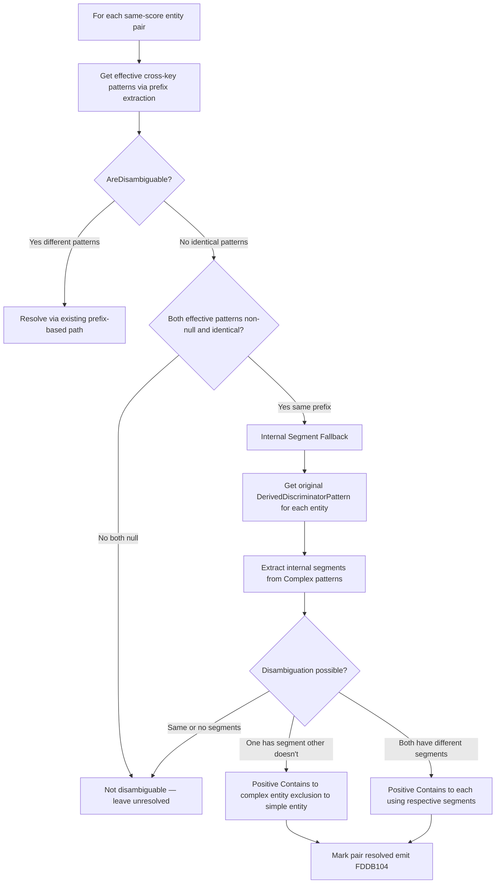

# Design Document: Compound Discrimination Internal Segment

## Overview

This feature adds a fallback resolution path in `CompoundPromotionPass.Analyze` for same-score entity pairs where prefix-based disambiguation fails because both entities reduce to the same effective cross-key prefix. When `AreDisambiguable` returns `false` due to identical effective patterns, the pass now checks whether either entity's *original* `DerivedDiscriminatorPattern` is Complex and contains an internal segment that can distinguish it from the other entity.

The core idea: a pattern like `TENANT#*#ROLE#*` reduces to `TENANT#*` for prefix comparison, making it identical to a simple `TENANT#*` pattern. But the original pattern contains `#ROLE#` as an internal segment — text between wildcards that the simpler pattern lacks. By assigning a positional `IndexOf("#ROLE#", prefixLength)` constraint to the complex entity and a negated positional check as an exclusion to the simpler entity, the pair becomes disambiguable.

**All internal-segment constraints use positional `IndexOf` with an offset equal to the prefix length**, not plain `Contains`. This prevents false matches when a field value in the simpler entity's wildcard portion happens to contain the internal segment text. For example, `TENANT#SOMEROLE#VALUE` would false-match `Contains("#ROLE#")` if the value coincidentally contains that substring, but `IndexOf("#ROLE#", 7)` (where 7 = length of `"TENANT#"`) correctly checks only the structural position after the prefix.

This enhancement is isolated to `CompoundPromotionPass.cs` with a minor addition to `CompoundConstraint.cs` (an `OffsetIndex` property for positional checks). The code generator is extended to handle `OffsetIndex > 0` on compound constraints using `IndexOf(literal, offset)`.

## Architecture

The fallback logic inserts into the existing flow at the point where `AreDisambiguable` returns `false`:



**Key design decisions:**

1. **Fallback placement**: The internal-segment logic runs only when prefix-based disambiguation fails (both effective patterns are identical non-null), keeping the existing fast path unchanged.
2. **Reuse of extraction logic**: The internal segment extraction algorithm replicates the same logic as `PatternOverlapAnalyzer.CreateExclusionPattern` — split on `*`, skip the prefix segment, iterate remaining segments last-to-first, select the first segment not contained within the prefix. This ensures consistency between exclusion patterns and compound constraints.
3. **Model extension**: `CompoundConstraint` gains an `OffsetIndex` property (mirroring `ExclusionPattern.OffsetIndex`) for positional checks. **All internal-segment constraints use `OffsetIndex > 0`** — both meaningful segments and bare separators. The code generator emits `IndexOf(literal, offset)` for all compound constraints with `OffsetIndex > 0`, eliminating false matches from coincidental substring presence in wildcard values.
4. **No modification to external files**: `PatternOverlapAnalyzer.cs`, `DiscriminatorAnalyzer.cs`, and `DiscriminatorConfig.cs` are not modified.

## Components and Interfaces

### CompoundPromotionPass.cs — Modified

New private method for internal segment extraction:

```csharp
/// <summary>
/// Extracts a distinguishing internal segment from a Complex cross-key pattern.
/// Replicates the logic of PatternOverlapAnalyzer.CreateExclusionPattern for
/// segment selection: splits on '*', skips the prefix (first non-empty segment),
/// iterates remaining segments last-to-first, selects the first segment not
/// contained within the prefix.
///
/// Returns a tuple of (literalText, strategy, offsetIndex):
/// - Meaningful segment: (segment, None, prefixLength) — uses IndexOf at prefix offset
/// - Bare separator (all contained in prefix): (bareSeparator, None, prefixLength)
/// - No segments found: null
///
/// All internal-segment constraints use Strategy=None with OffsetIndex=prefixLength
/// to generate IndexOf(literal, offset) checks. This prevents false matches from
/// coincidental substring presence in wildcard values within the prefix portion.
/// </summary>
private static (string LiteralText, DiscriminatorStrategy Strategy, int OffsetIndex)?
    ExtractInternalSegment(string complexPattern, string reducedPrefix)
```

Modified `Analyze` method: after `AreDisambiguable` returns `false`, adds a check for the internal-segment fallback path when both effective patterns are identical non-null strings.

### CompoundConstraint.cs — Modified

```csharp
/// <summary>
/// When greater than 0, the code generator emits IndexOf(LiteralText, OffsetIndex) >= 0
/// instead of Contains(LiteralText). Used for all internal-segment compound constraints
/// to prevent false matches from coincidental substring presence in wildcard values
/// within the prefix portion. All internal-segment constraints set OffsetIndex to the
/// prefix length. A value of 0 (default) preserves existing Contains/StartsWith behavior
/// for prefix-based compound constraints. Mirrors ExclusionPattern.OffsetIndex.
/// </summary>
public int OffsetIndex { get; set; }
```

### MapperGenerator.cs — Modified

`GeneratePositiveCompoundConstraintCheck` and `GenerateSingleExclusionCheck` extended to handle `OffsetIndex > 0` on `CompoundConstraint`, emitting `IndexOf(literal, offset) >= 0` instead of `Contains(literal)` when `OffsetIndex > 0` (matching the existing `ExclusionPattern` code generation pattern). All internal-segment compound constraints use this path since they always set `OffsetIndex` to the prefix length.

For positive constraints with `OffsetIndex > 0`:
```csharp
// OffsetIndex > 0 — positional check
sb.AppendLine($"            if (compoundValue.S.IndexOf(\"{literal}\", {offset}) < 0)");
sb.AppendLine("                return false;");
```

For exclusion guards with `OffsetIndex > 0`:
```csharp
// OffsetIndex > 0 — positional exclusion check
sb.AppendLine($"            if (item.TryGetValue(\"{prop}\", out var {varName}) && {varName}.S != null");
sb.AppendLine($"                && {varName}.S.IndexOf(\"{literal}\", {offset}) >= 0)");
sb.AppendLine("                return false;");
```

## Data Models

### Internal Segment Extraction Algorithm

The extraction algorithm mirrors `PatternOverlapAnalyzer.CreateExclusionPattern`:

```
FUNCTION ExtractInternalSegment(complexPattern, reducedPrefix)
  INPUT: complexPattern — the original DerivedDiscriminatorPattern (e.g., "TENANT#*#ROLE#*")
         reducedPrefix — the prefix segment (text before first '*', e.g., "TENANT#")
  OUTPUT: (LiteralText, Strategy, OffsetIndex) or null

  segments := complexPattern.Split('*')
  internalSegments := segments.Where(s => s.Length > 0).Skip(1)  // skip prefix

  IF internalSegments is empty THEN
    RETURN null
  END IF

  // Try segments from last to first, looking for meaningful (non-bare) segment
  FOR i := internalSegments.Count - 1 DOWNTO 0 DO
    candidate := internalSegments[i]
    IF NOT reducedPrefix.Contains(candidate) THEN
      RETURN (candidate, None, reducedPrefix.Length)  // positional check at prefix offset
    END IF
  END FOR

  // All internal segments are bare separators — still use positional approach
  bareSeparator := internalSegments[0]
  RETURN (bareSeparator, None, reducedPrefix.Length)
END FUNCTION
```

### Fallback Resolution Logic (Pseudocode)

```
// Inside Analyze, after AreDisambiguable returns false:

IF crossKeyPatternA != null AND crossKeyPatternB != null
   AND crossKeyPatternA == crossKeyPatternB THEN

  // Both reduced to same prefix — try internal segment fallback
  originalPatternA := entityA.Properties[crossKey].DerivedDiscriminatorPattern
  originalPatternB := entityB.Properties[crossKey].DerivedDiscriminatorPattern

  strategyA := DeterminePatternStrategy(originalPatternA ?? "")
  strategyB := DeterminePatternStrategy(originalPatternB ?? "")

  // The reduced prefix text (without trailing '*')
  reducedPrefix := crossKeyPatternA.TrimEnd('*')

  segmentA := null
  segmentB := null

  IF strategyA == Complex THEN
    segmentA := ExtractInternalSegment(originalPatternA, reducedPrefix)
  END IF

  IF strategyB == Complex THEN
    segmentB := ExtractInternalSegment(originalPatternB, reducedPrefix)
  END IF

  // Case 1: One has segment, other doesn't
  IF segmentA != null AND segmentB == null THEN
    AssignInternalSegmentConstraint(entityA, crossKeyAttrName, segmentA, isExclusion: false)
    AssignInternalSegmentConstraint(entityB, crossKeyAttrName, segmentA, isExclusion: true, sourceEntity: entityA.ClassName)
    Mark resolved
  ELSE IF segmentB != null AND segmentA == null THEN
    AssignInternalSegmentConstraint(entityB, crossKeyAttrName, segmentB, isExclusion: false)
    AssignInternalSegmentConstraint(entityA, crossKeyAttrName, segmentB, isExclusion: true, sourceEntity: entityB.ClassName)
    Mark resolved
  // Case 2: Both have segments, and they differ
  ELSE IF segmentA != null AND segmentB != null
          AND (segmentA.LiteralText != segmentB.LiteralText) THEN
    AssignInternalSegmentConstraint(entityA, crossKeyAttrName, segmentA, isExclusion: false)
    AssignInternalSegmentConstraint(entityB, crossKeyAttrName, segmentB, isExclusion: false)
    Mark resolved
  END IF
  // Case 3: Same segments or no segments → not disambiguable (do nothing)
END IF
```

### Constraint Assignment for Internal Segments

A new helper method creates `CompoundConstraint` instances from extracted internal segment data:

```csharp
private static void AssignInternalSegmentConstraint(
    EntityModel entity,
    string crossKeyAttrName,
    (string LiteralText, DiscriminatorStrategy Strategy, int OffsetIndex) segment,
    bool isExclusion,
    string sourceEntity = "")
{
    var constraint = new CompoundConstraint
    {
        PropertyName = crossKeyAttrName,
        Pattern = entity.Properties[crossKey].DerivedDiscriminatorPattern ?? "",
        Strategy = segment.Strategy,
        LiteralText = segment.LiteralText,
        IsExclusion = isExclusion,
        ExclusionSourceEntity = sourceEntity,
        OffsetIndex = segment.OffsetIndex
    };

    // Reuse existing multi-overlap accumulation logic:
    // - If entity already has a positive constraint, preserve it
    // - If entity already has an exclusion, accumulate in AdditionalExclusions
    // Same rules as existing AssignExclusionConstraint / AssignPositiveConstraint
}
```

### Multi-Overlap Interaction

When entity A has a Complex pattern and overlaps with both B and C (both non-Complex, same prefix):
- Entity A receives a single positive `Contains` constraint from the first resolved pair. Subsequent pairs find it already set and skip (idempotent, same as existing logic).
- Entity B receives an exclusion guard from the (A, B) resolution.
- Entity C receives an exclusion guard from the (A, C) resolution. If C already has an exclusion from B, C's exclusion for A is accumulated in `AdditionalExclusions`.

When entity A has a prefix-based resolution with B (different prefixes) and an internal-segment resolution with C (same prefix):
- Entity A retains its `StartsWith` positive constraint from the (A, B) pair.
- Entity C receives the exclusion guard from the (A, C) internal-segment resolution.
- Entity A does NOT receive a new positive constraint from the (A, C) pair because it already has one (positive takes precedence, existing logic).

### Concrete Example

**RoleCapabilityEntity** (PK: `TENANT#*#ROLE#*`) vs **TenantSettingsEntity** (PK: `TENANT#*`):

1. Both reduce to prefix `TENANT#*` → `AreDisambiguable` returns false
2. Fallback: RoleCapabilityEntity's original pattern is Complex, TenantSettingsEntity's is StartsWith
3. `ExtractInternalSegment("TENANT#*#ROLE#*", "TENANT#")` → `("#ROLE#", None, 7)` — positional check at offset 7 (length of "TENANT#")
4. RoleCapabilityEntity gets positive `CompoundConstraint` with `Strategy=None`, `LiteralText="#ROLE#"`, `OffsetIndex=7`
5. TenantSettingsEntity gets exclusion `CompoundConstraint` with `Strategy=None`, `LiteralText="#ROLE#"`, `OffsetIndex=7`, `IsExclusion=true`

Generated code for RoleCapabilityEntity:
```csharp
// Compound constraint: pk (positional — checks for #ROLE# after prefix)
if (!item.TryGetValue("pk", out var compoundValue) || compoundValue.S == null)
    return false;
if (compoundValue.S.IndexOf("#ROLE#", 7) < 0)
    return false;
```

Generated code for TenantSettingsEntity:
```csharp
// Compound exclusion: pk pattern from RoleCapabilityEntity (positional)
if (item.TryGetValue("pk", out var compoundValue) && compoundValue.S != null
    && compoundValue.S.IndexOf("#ROLE#", 7) >= 0)
    return false;
```

### Bare-Separator Example

**Entity A** (PK: `CAP#*#*`) vs **Entity B** (PK: `CAP#*`):

1. Both reduce to `CAP#*` → `AreDisambiguable` returns false
2. Entity A's original pattern is Complex. `ExtractInternalSegment("CAP#*#*", "CAP#")`:
   - Internal segments after splitting: `["#"]` — contained within prefix `"CAP#"` → bare separator
   - Returns `("#", None, 4)` — positional check at offset 4
3. Entity A gets `CompoundConstraint` with `Strategy=None`, `LiteralText="#"`, `OffsetIndex=4`
4. Entity B gets exclusion with same parameters, `IsExclusion=true`

Generated code for Entity A:
```csharp
// Compound constraint: pk (positional)
if (!item.TryGetValue("pk", out var compoundValue) || compoundValue.S == null)
    return false;
if (compoundValue.S.IndexOf("#", 4) < 0)
    return false;
```


## Correctness Properties

*A property is a characteristic or behavior that should hold true across all valid executions of a system — essentially, a formal statement about what the system should do. Properties serve as the bridge between human-readable specifications and machine-verifiable correctness guarantees.*

### Property 1: Complex-vs-Non-Complex Same-Prefix Resolution

*For any* same-score entity pair where both effective cross-key patterns are identical (same reduced prefix), one entity has a Complex original pattern with a distinguishing internal segment (not contained in the prefix), and the other entity has a non-Complex pattern, the `CompoundPromotionPass` SHALL classify the pair as disambiguable and assign:
- A positive `CompoundConstraint` with `Strategy=None`, `LiteralText` equal to the extracted internal segment, and `OffsetIndex` equal to the prefix length, to the Complex entity
- An exclusion `CompoundConstraint` with `Strategy=None`, `LiteralText` equal to the same internal segment, `OffsetIndex` equal to the prefix length, and `IsExclusion=true` to the non-Complex entity

**Validates: Requirements 1.1, 3.1, 3.2, 3.4**

### Property 2: Dual-Complex Same-Prefix Different-Segment Resolution

*For any* same-score entity pair where both effective cross-key patterns are identical, both entities have Complex original patterns with the same reduced prefix but different distinguishing internal segments, the `CompoundPromotionPass` SHALL classify the pair as disambiguable and assign a positive `CompoundConstraint` with `Strategy=None`, `OffsetIndex` equal to the prefix length, to each entity using its respective extracted internal segment as `LiteralText`.

**Validates: Requirements 1.1, 3.3**

### Property 3: Same-Prefix Identical-Segment Non-Resolution

*For any* same-score entity pair where both effective cross-key patterns are identical, both entities have Complex original patterns with the same reduced prefix and the same extracted internal segment (string-equal), the `CompoundPromotionPass` SHALL NOT classify the pair as disambiguable and SHALL NOT assign any `CompoundConstraint` to either entity.

**Validates: Requirements 1.3**

### Property 4: Internal Segment Extraction Correctness

*For any* Complex cross-key pattern with two or more non-empty internal segments (segments after splitting on `*` and skipping the first non-empty segment), the extraction algorithm SHALL select the last segment (iterating from the end) that is not contained within the prefix segment. When multiple meaningful segments exist, only the last meaningful one is selected, matching the order used by `PatternOverlapAnalyzer.CreateExclusionPattern`.

**Validates: Requirements 2.1, 2.2**

### Property 5: Bare-Separator Positional Constraint

*For any* same-score entity pair where both effective cross-key patterns are identical, one entity has a Complex original pattern whose only internal segments are bare separators (all contained within the prefix segment), and the other entity has a non-Complex pattern, the `CompoundPromotionPass` SHALL assign constraints using `Strategy=None`, `LiteralText` equal to the bare separator, and `OffsetIndex` equal to the length of the reduced prefix segment. Both the positive constraint (on the Complex entity) and the exclusion guard (on the non-Complex entity) SHALL use the same strategy, offset index, and literal text. Note: meaningful segments also use `Strategy=None` with `OffsetIndex=prefixLength` — the bare-separator case differs only in that the literal text is a separator character rather than a meaningful segment name.

**Validates: Requirements 2.3, 3.5, 3.6**

### Property 6: Diagnostic Behavior for Internally-Resolved Pairs

*For any* entity pair resolved via internal-segment discrimination, the pair SHALL appear in `ResolvedPairs` (suppressing FDDB102/DISC004 diagnostics), and exactly two FDDB104 info diagnostics SHALL be emitted (one per entity in the pair).

**Validates: Requirements 4.1, 4.2**

### Property 7: Mutual Exclusivity of Generated MatchesEntity Logic

*For any* two entities resolved by internal-segment discrimination and *for any* DynamoDB item where both the discriminator attribute and the cross-key attribute exist with non-null string values, at most one entity's `MatchesEntity` logic returns true. Items whose cross-key value contains the more-specific entity's internal segment match only the more-specific entity; items whose cross-key value does not contain the internal segment match only the less-specific entity.

**Validates: Requirements 6.1, 6.2, 6.3**

### Property 8: Preservation of Existing Behavior

*For any* entity pair that does NOT trigger the internal-segment fallback path (both effective patterns null, both effective patterns already differ, one null and one non-null, or neither entity has a Complex original pattern), the `CompoundPromotionPass` SHALL produce the same result as before this enhancement — same `ResolvedPairs`, same `CompoundConstraint` assignments, same diagnostics.

**Validates: Requirements 1.2, 1.4, 4.3, 5.1, 5.2, 5.3, 5.7**

## Error Handling

### No Complex Patterns in Pair

When neither entity in a same-prefix pair has a Complex original pattern (both are simple `StartsWith` that happen to be identical), the fallback path is not entered. The pair remains unresolved with existing FDDB102/DISC004 diagnostics.

### Complex Pattern with No Internal Segments

When a Complex pattern has no non-empty segments after the prefix (structurally unusual, e.g., `PREFIX#*`), `ExtractInternalSegment` returns `null`. The pair is not resolved via internal segments.

### Missing Cross-Key Property

When the cross-key `PropertyModel` is null or has no `DerivedDiscriminatorPattern`, the entity cannot contribute an internal segment. If neither entity contributes a segment, the pair is not resolved.

### Bare-Separator Offset Zero Edge Case

If the reduced prefix is empty (which shouldn't happen since both effective patterns are non-null and identical, meaning they have a non-empty prefix), the positional offset would be 0. The extraction logic guards against this by requiring the prefix segment to have length > 0 before entering the bare-separator path.

### Multi-Overlap Constraint Accumulation

When an entity receives both a prefix-based positive constraint (from one pair) and an internal-segment positive constraint (from another pair), the first-assigned positive constraint wins (existing idempotency logic in `AssignPositiveConstraint`). The second pair's resolution still marks the pair as resolved and emits FDDB104, but the entity's constraint is not overwritten.

When an entity accumulates multiple exclusion guards from different pairs, they are stored in `AdditionalExclusions` — the entity must pass all exclusion checks (none must match) for `MatchesEntity` to return true.

## Testing Strategy

### Property-Based Tests (FsCheck + xUnit)

Each correctness property maps to one or more property-based tests with minimum 100 iterations. The PBT library is **FsCheck** integrated with **xUnit**, consistent with the existing test infrastructure.

- **Property 1**: Generate random same-prefix pairs (Complex + non-Complex). Verify positive Contains constraint on Complex entity, exclusion on non-Complex entity.
  - Tag: `Feature: compound-discrimination-internal-segment, Property 1: Complex-vs-Non-Complex Same-Prefix Resolution`
- **Property 2**: Generate random same-prefix pairs (both Complex, different segments). Verify dual positive Contains constraints.
  - Tag: `Feature: compound-discrimination-internal-segment, Property 2: Dual-Complex Same-Prefix Different-Segment Resolution`
- **Property 3**: Generate random same-prefix pairs (both Complex, same segment). Verify not resolved.
  - Tag: `Feature: compound-discrimination-internal-segment, Property 3: Same-Prefix Identical-Segment Non-Resolution`
- **Property 4**: Generate random Complex patterns with known internal segments. Verify extraction correctness.
  - Tag: `Feature: compound-discrimination-internal-segment, Property 4: Internal Segment Extraction Correctness`
- **Property 5**: Generate random bare-separator Complex patterns. Verify positional constraints.
  - Tag: `Feature: compound-discrimination-internal-segment, Property 5: Bare-Separator Positional Constraint`
- **Property 6**: Generate resolved internal-segment pairs. Verify FDDB104 diagnostics and FDDB102/DISC004 suppression.
  - Tag: `Feature: compound-discrimination-internal-segment, Property 6: Diagnostic Behavior for Internally-Resolved Pairs`
- **Property 7**: Generate DynamoDB items for internally-resolved pairs. Verify mutual exclusivity of matching logic.
  - Tag: `Feature: compound-discrimination-internal-segment, Property 7: Mutual Exclusivity of Generated MatchesEntity Logic`
- **Property 8**: Run existing property tests from `CompoundPromotionPassPropertyTests.cs` to verify no regressions.
  - Tag: `Feature: compound-discrimination-internal-segment, Property 8: Preservation of Existing Behavior`

**Generator Strategy:**
- Reuse `GenPrefix` and `GenSuffix` element generators from existing test files
- Generate Complex patterns: `$"{prefix}#*#{suffix}#*"` with controllable prefix and suffix
- Generate bare-separator patterns: `$"{prefix}#*#*"` where `"#"` is contained in prefix
- Generate non-Complex same-prefix patterns: `$"{prefix}#*"` matching the Complex entity's reduced prefix
- For Property 7, generate mock DynamoDB items as `Dictionary<string, AttributeValue>` with controlled pk/sk values

### Unit Tests (Example-Based)

- **Concrete scenario**: RoleCapabilityEntity (`TENANT#*#ROLE#*`) vs TenantSettingsEntity (`TENANT#*`) — the motivating example from the requirements
- **Bare-separator scenario**: Entity A (`CAP#*#*`) vs Entity B (`CAP#*`) — positional constraint with OffsetIndex
- **Three-entity multi-overlap**: Entity A (Complex) overlapping with both B and C (non-Complex) — verifying constraint accumulation
- **Mixed resolution**: Entity A resolved with B via prefix and with C via internal segment — verifying constraint preservation
- **Missing cross-key**: Verify `MatchesEntity` returns false for both entities when cross-key attribute is absent
- **Both Complex, same segment**: Verify not disambiguable
- **Complex with empty-prefix original**: Pattern starting with `*` — should not enter internal segment path (already handled as null effective pattern)

### Integration with Existing Tests

All existing tests in `CompoundPromotionPassTests.cs`, `CompoundPromotionPassPropertyTests.cs`, and `CompoundPromotionPassComplexPatternTests.cs` must continue to pass without modification. These provide the preservation guarantee for Property 8.
