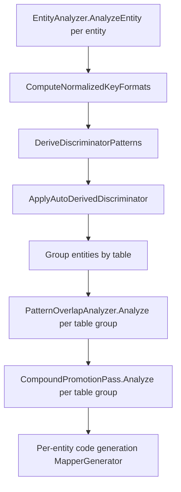
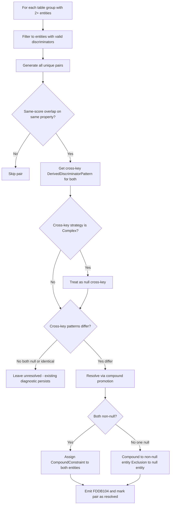

# Design Document: Compound Key Discrimination

## Overview

This feature extends the existing discriminator analysis pipeline in the Roslyn source generator to automatically resolve same-score discriminator overlaps by inspecting the cross-key `DerivedDiscriminatorPattern`. When two entities share an identical discriminator pattern on one key (e.g., both have `"CAP#*"` on the sort key), the new **CompoundPromotionPass** checks whether their partition key patterns differ. If they do, it promotes one or both entities to a compound discriminator check (primary match AND cross-key match), suppresses the previously-emitted FDDB102/DISC004 diagnostics, and ensures generated `MatchesEntity` methods are mutually exclusive.

The feature integrates as a post-processing pass after `PatternOverlapAnalyzer.Analyze` and before code generation, requiring changes to:
- The internal model (`DiscriminatorConfig` gains a `CompoundConstraint` property)
- A new analysis pass (`CompoundPromotionPass`)
- Code generation in `MapperGenerator` (compound checks and exclusion guards on the cross-key)
- Diagnostic reporting (suppression of FDDB102/DISC004 for resolved pairs, new FDDB104 info diagnostic)

## Architecture

The compound promotion pass sits between overlap analysis and code generation in the existing pipeline:



**Key design decisions:**
1. **Post-overlap placement**: CompoundPromotionPass runs after PatternOverlapAnalyzer so it can consume same-score overlap information without re-computing it.
2. **Read-only overlap data**: The pass reads overlap state from PatternOverlapAnalyzer's output (diagnostics list) but does NOT mutate `OverlappingPatterns` lists — it only writes to `DiscriminatorConfig.CompoundConstraint`.
3. **Reuse of existing strategy logic**: Pattern-to-strategy derivation reuses `DiscriminatorAnalyzer.DeterminePatternStrategy` for consistency.
4. **Diagnostic filtering**: Rather than modifying PatternOverlapAnalyzer, the CompoundPromotionPass returns a set of "resolved pair" identifiers that the pipeline uses to filter out FDDB102/DISC004 diagnostics before reporting them.

## Components and Interfaces

### CompoundPromotionPass (New)

```csharp
namespace Oproto.FluentDynamoDb.SourceGenerator.Analysis;

/// <summary>
/// Resolves same-score discriminator overlaps by inspecting cross-key DerivedDiscriminatorPatterns.
/// Runs after PatternOverlapAnalyzer.Analyze and before code generation.
/// </summary>
internal static class CompoundPromotionPass
{
    /// <summary>
    /// Analyzes a table group for same-score overlaps resolvable via cross-key disambiguation.
    /// Returns diagnostics to emit (FDDB104 info) and a set of resolved entity-pair identifiers
    /// that should have their FDDB102/DISC004 diagnostics suppressed.
    /// </summary>
    /// <param name="tableEntities">All entities in the same table group.</param>
    /// <param name="overlapDiagnostics">Diagnostics produced by PatternOverlapAnalyzer.Analyze.</param>
    /// <returns>Result containing new diagnostics and resolved pair identifiers.</returns>
    public static CompoundPromotionResult Analyze(
        List<EntityModel> tableEntities,
        List<Diagnostic> overlapDiagnostics);
}

/// <summary>
/// Result of compound promotion analysis for a single table group.
/// </summary>
internal class CompoundPromotionResult
{
    /// <summary>
    /// New diagnostics to emit (FDDB104 info diagnostics for resolved pairs).
    /// </summary>
    public List<Diagnostic> Diagnostics { get; set; } = new();

    /// <summary>
    /// Set of entity class name pairs that were resolved by compound promotion.
    /// Used to filter FDDB102/DISC004 diagnostics before reporting.
    /// Format: ordered tuple (min(nameA, nameB), max(nameA, nameB)) for stable lookup.
    /// </summary>
    public HashSet<(string, string)> ResolvedPairs { get; set; } = new();
}
```

### DiscriminatorConfig Changes (Modified)

```csharp
internal class DiscriminatorConfig
{
    // ... existing properties unchanged ...

    /// <summary>
    /// Optional secondary constraint (AND'd with primary check).
    /// Populated by CompoundPromotionPass when a same-score overlap on the primary
    /// discriminator property is resolvable via cross-key disambiguation.
    /// When non-null, the generated MatchesEntity method verifies BOTH the primary
    /// discriminator AND this compound constraint.
    /// </summary>
    public CompoundConstraint? CompoundConstraint { get; set; }
}
```

### CompoundConstraint (New Model)

```csharp
namespace Oproto.FluentDynamoDb.SourceGenerator.Models;

/// <summary>
/// Represents a secondary cross-key constraint for compound discrimination.
/// Either a positive match (entity WITH a cross-key pattern) or an exclusion guard
/// (entity WITHOUT a cross-key pattern that must negate the other entity's pattern).
/// </summary>
internal class CompoundConstraint
{
    /// <summary>
    /// The DynamoDB attribute name of the cross-key property (e.g., "pk" when discriminator is on "sk").
    /// </summary>
    public string PropertyName { get; set; } = string.Empty;

    /// <summary>
    /// The pattern string for the cross-key match (e.g., "PLATFORM#*").
    /// For exclusion guards, this is the OTHER entity's cross-key pattern being negated.
    /// </summary>
    public string Pattern { get; set; } = string.Empty;

    /// <summary>
    /// The matching strategy derived from the pattern (StartsWith, ExactMatch, EndsWith, Contains).
    /// </summary>
    public DiscriminatorStrategy Strategy { get; set; }

    /// <summary>
    /// The literal text to use in the string operation (pattern with wildcards removed).
    /// </summary>
    public string LiteralText { get; set; } = string.Empty;

    /// <summary>
    /// Whether this is an exclusion guard (negate match) rather than a positive compound check.
    /// When true, MatchesEntity returns false if the cross-key value MATCHES the pattern.
    /// When false, MatchesEntity returns true only if the cross-key value matches the pattern.
    /// </summary>
    public bool IsExclusion { get; set; }

    /// <summary>
    /// The entity class name whose pattern this exclusion negates (for generated code comments).
    /// Only meaningful when IsExclusion is true.
    /// </summary>
    public string ExclusionSourceEntity { get; set; } = string.Empty;
}
```

### FDDB104 Diagnostic Descriptor (New)

```csharp
// In DiagnosticDescriptors.cs
public static readonly DiagnosticDescriptor CompoundPromotionResolved = new(
    "FDDB104",
    "Compound discrimination resolved overlap",
    "Entity '{0}' promoted to compound discrimination ({1}: '{2}' + {3}: '{4}') to resolve overlap with '{5}'",
    "FluentDynamoDb.Discriminator",
    DiagnosticSeverity.Info,
    isEnabledByDefault: true,
    helpLinkUri: string.Format(DiagnosticHelpLinks.BaseUrlFormat, "FDDB104"));
```

## Data Models

### CompoundPromotionPass Algorithm



### Cross-Key Resolution Logic (Pseudocode)

```
For each pair (entityA, entityB) with same-score overlap on discriminatorProperty:
  
  crossKeyPropertyA = (discriminatorProperty == SK) ? PK : SK
  crossKeyPropertyB = (discriminatorProperty == SK) ? PK : SK
  
  patternA = entityA.Properties[crossKeyPropertyA].DerivedDiscriminatorPattern
  patternB = entityB.Properties[crossKeyPropertyB].DerivedDiscriminatorPattern
  
  // Treat Complex-strategy patterns as null (cannot reduce to single string op)
  if patternA != null && DeterminePatternStrategy(patternA) == Complex:
    patternA = null
  if patternB != null && DeterminePatternStrategy(patternB) == Complex:
    patternB = null
  
  // Check disambiguability
  if patternA == patternB:  // both null, or identical non-null
    continue  // not disambiguable, existing diagnostic persists
  
  // Resolved! Assign constraints
  if patternA != null && patternB != null:
    entityA.Discriminator.CompoundConstraint = CreatePositiveConstraint(crossKeyAttrName, patternA)
    entityB.Discriminator.CompoundConstraint = CreatePositiveConstraint(crossKeyAttrName, patternB)
  elif patternA != null:
    entityA.Discriminator.CompoundConstraint = CreatePositiveConstraint(crossKeyAttrName, patternA)
    entityB.Discriminator.CompoundConstraint = CreateExclusionConstraint(crossKeyAttrName, patternA, entityA.ClassName)
  else:  // patternB != null
    entityB.Discriminator.CompoundConstraint = CreatePositiveConstraint(crossKeyAttrName, patternB)
    entityA.Discriminator.CompoundConstraint = CreateExclusionConstraint(crossKeyAttrName, patternB, entityB.ClassName)
  
  Mark (entityA, entityB) as resolved
  Emit FDDB104 info diagnostic
```

### Multi-Constraint Handling

When an entity is involved in multiple same-score overlaps with different entities (e.g., entity A overlaps with B and C), and both are resolvable:
- If A's compound constraint from the A-B resolution is the same pattern/strategy as from the A-C resolution, only one CompoundConstraint is needed.
- If they differ (shouldn't happen for positive constraints since A's own cross-key pattern doesn't change), the design handles this by taking the entity's own cross-key pattern for positive constraints — which is inherently the same regardless of which pair triggered it.
- For exclusion guards (entity has null cross-key), it may accumulate multiple exclusions from different overlapping entities. The `CompoundConstraint` model uses a list approach for exclusions in this scenario:

```csharp
/// <summary>
/// Additional exclusion guards when entity has multiple compound-resolved overlaps.
/// Populated when this entity has a null cross-key pattern and overlaps with
/// multiple entities that each have different cross-key patterns.
/// </summary>
public List<CompoundConstraint>? AdditionalExclusions { get; set; }
```

### Code Generation: Generated MatchesEntity Examples

**Entity with positive CompoundConstraint (PlatformCapability):**

```csharp
public static bool MatchesEntity(Dictionary<string, AttributeValue> item)
{
    if (!item.ContainsKey("pk")) return false;
    if (!item.ContainsKey("sk")) return false;

    // Discriminator check on "sk"
    if (!item.TryGetValue("sk", out var discriminatorValue) || discriminatorValue.S == null)
        return false;

    // Positive match: this entity's pattern
    if (!discriminatorValue.S.StartsWith("CAP#"))
        return false;

    // Compound constraint: pk (resolved overlap with TenantCapability)
    if (!item.TryGetValue("pk", out var compoundValue) || compoundValue.S == null)
        return false;
    if (!compoundValue.S.StartsWith("PLATFORM#"))
        return false;

    return true;
}
```

**Entity with exclusion CompoundConstraint (TenantCapability):**

```csharp
public static bool MatchesEntity(Dictionary<string, AttributeValue> item)
{
    if (!item.ContainsKey("pk")) return false;
    if (!item.ContainsKey("sk")) return false;

    // Discriminator check on "sk"
    if (!item.TryGetValue("sk", out var discriminatorValue) || discriminatorValue.S == null)
        return false;

    // Positive match: this entity's pattern
    if (!discriminatorValue.S.StartsWith("CAP#"))
        return false;

    // Compound exclusion: pk pattern from PlatformCapability
    if (item.TryGetValue("pk", out var compoundValue) && compoundValue.S != null
        && compoundValue.S.StartsWith("PLATFORM#"))
        return false;

    return true;
}
```

**Key difference for exclusion guard:** When the cross-key attribute is missing or null, the exclusion does NOT fire (returns true based on primary match). This is correct because if the cross-key isn't present, the primary discriminator match is sufficient — the exclusion is only needed to prevent matching items that belong to the other entity.

### Pipeline Integration in DynamoDbSourceGenerator.cs

```csharp
// After existing overlap analysis
foreach (var tableGroup in entitiesByTable)
{
    var tableEntities = tableGroup.Value;

    var overlapDiagnostics = PatternOverlapAnalyzer.Analyze(tableEntities);
    
    // NEW: Compound promotion pass — resolves same-score overlaps via cross-key
    var compoundResult = CompoundPromotionPass.Analyze(tableEntities, overlapDiagnostics);
    
    // Filter out diagnostics for resolved pairs
    foreach (var diagnostic in overlapDiagnostics)
    {
        if (IsResolvedByCompoundPromotion(diagnostic, compoundResult.ResolvedPairs))
            continue;  // Suppressed — compound promotion resolved this pair
        context.ReportDiagnostic(diagnostic);
    }
    
    // Emit new FDDB104 info diagnostics for resolved pairs
    foreach (var diagnostic in compoundResult.Diagnostics)
    {
        context.ReportDiagnostic(diagnostic);
    }
}
```

### Diagnostic Filtering Helper

```csharp
private static bool IsResolvedByCompoundPromotion(
    Diagnostic diagnostic,
    HashSet<(string, string)> resolvedPairs)
{
    // Only filter FDDB102 and DISC004
    if (diagnostic.Id != "FDDB102" && diagnostic.Id != "DISC004")
        return false;
    
    // Extract entity names from diagnostic message args
    // FDDB102 format: "Entities '{0}' and '{1}' have overlapping..."
    // DISC004 format: "...'{1}' on {entityA} and '{3}' on {entityB}..."
    var entityNames = ExtractEntityNamesFromDiagnostic(diagnostic);
    if (entityNames == null)
        return false;
    
    var orderedPair = OrderPair(entityNames.Value.Item1, entityNames.Value.Item2);
    return resolvedPairs.Contains(orderedPair);
}
```

## Correctness Properties

*A property is a characteristic or behavior that should hold true across all valid executions of a system — essentially, a formal statement about what the system should do. Properties serve as the bridge between human-readable specifications and machine-verifiable correctness guarantees.*

### Property 1: Disambiguability Classification

*For any* two entities with a same-score discriminator overlap on the same property, the CompoundPromotionPass classifies the pair as disambiguable if and only if their effective cross-key patterns differ (where "effective" means the `DerivedDiscriminatorPattern` is non-null AND `DeterminePatternStrategy` does not return `Complex`; otherwise it is treated as null).

**Validates: Requirements 1.2, 1.3, 1.4, 7.6**

### Property 2: Symmetric Cross-Key Inspection

*For any* entity pair with a same-score overlap, the CompoundPromotionPass inspects the partition key's `DerivedDiscriminatorPattern` when the primary discriminator is on the sort key attribute, and inspects the sort key's `DerivedDiscriminatorPattern` when the primary discriminator is on the partition key attribute.

**Validates: Requirements 1.5**

### Property 3: Dual Compound Constraint Assignment

*For any* disambiguable entity pair where both entities have non-null effective cross-key patterns, both entities receive a positive `CompoundConstraint` referencing their own cross-key pattern with the correct `PropertyName`, `Pattern`, `Strategy`, and `LiteralText`.

**Validates: Requirements 2.1, 2.3**

### Property 4: Asymmetric Constraint Assignment

*For any* disambiguable entity pair where one entity has a non-null effective cross-key pattern and the other has null, the non-null entity receives a positive `CompoundConstraint` and the null entity receives an exclusion `CompoundConstraint` referencing the non-null entity's cross-key pattern.

**Validates: Requirements 2.2, 2.4**

### Property 5: Strategy Derivation from Pattern

*For any* cross-key pattern used in a `CompoundConstraint`, the `Strategy` and `LiteralText` are consistent with the result of `DiscriminatorAnalyzer.DeterminePatternStrategy` and `DiscriminatorAnalyzer.GetPatternText` applied to that pattern.

**Validates: Requirements 2.5, 7.1, 7.2, 7.3, 7.4**

### Property 6: Diagnostic Suppression for Resolved Pairs

*For any* entity pair resolved by compound promotion, no FDDB102 or DISC004 diagnostic is emitted for that pair, and exactly one FDDB104 info diagnostic is emitted per resolved pair.

**Validates: Requirements 3.1, 3.3**

### Property 7: Diagnostic Persistence for Unresolved Pairs

*For any* same-score overlap pair where the cross-key patterns are both null or identical, FDDB102 or DISC004 diagnostics are emitted unchanged (as if CompoundPromotionPass did not run).

**Validates: Requirements 3.2, 3.4**

### Property 8: Non-Interference for Non-Overlapping Entities

*For any* table group where entities have non-overlapping patterns or overlaps with different specificity scores (already resolved by exclusion), the CompoundPromotionPass does not modify any entity's `DiscriminatorConfig`.

**Validates: Requirements 5.2, 5.3**

### Property 9: Mutual Exclusivity of Generated MatchesEntity

*For any* two entities resolved by compound promotion and *for any* DynamoDB item where both the discriminator attribute and the cross-key attribute exist with non-null string values, at most one entity's generated `MatchesEntity` logic returns true.

**Validates: Requirements 6.1, 6.2, 6.3, 6.5**

### Property 10: Pairwise Completeness in Multi-Entity Groups

*For any* table group of N entities (N ≥ 2) sharing the same same-score overlap, the CompoundPromotionPass evaluates all C(N, 2) unique pairs and resolves each independently where cross-key patterns differ.

**Validates: Requirements 1.6, 5.7**

## Error Handling

### Invalid or Missing Cross-Key Properties

When an entity's `Properties` array does not contain a partition key or sort key property (structurally invalid entity), the CompoundPromotionPass skips that entity gracefully — it cannot participate in compound disambiguation.

### Complex Cross-Key Patterns

When `DeterminePatternStrategy` returns `Complex` for a cross-key pattern (multi-wildcard pattern like `"TENANT#*#REGION#*"`), the pass treats the entity as having a null cross-key pattern. This prevents generating compound checks that require multiple string operations, which the current `MatchesEntity` code generation infrastructure does not support for compound constraints.

### Multiple Overlaps on Same Entity

When entity A has same-score overlaps with both B and C:
- If A has a non-null cross-key pattern, it always gets the same positive `CompoundConstraint` (its own pattern) regardless of which pair triggered it. The first resolved pair sets the constraint; subsequent pairs are idempotent.
- If A has a null cross-key pattern and overlaps with multiple entities that have different cross-key patterns, A accumulates multiple exclusion guards. All exclusions must pass (none must match) for A's `MatchesEntity` to return true.

### Diagnostic Extraction Failures

If the helper `ExtractEntityNamesFromDiagnostic` cannot parse entity names from a diagnostic's message arguments (e.g., due to unexpected formatting), the diagnostic is NOT suppressed — it passes through unchanged. This fail-open behavior ensures no diagnostics are silently dropped.

## Testing Strategy

### Property-Based Tests (Using FsCheck via xUnit)

Each correctness property maps to one or more property-based tests with minimum 100 iterations. The PBT library is **FsCheck** integrated with **xUnit** (consistent with the existing test infrastructure in `Oproto.FluentDynamoDb.SourceGenerator.UnitTests`).

Configuration:
- Minimum 100 iterations per property test
- Custom generators for `EntityModel` pairs with controlled key patterns
- Tag format: `Feature: compound-key-discrimination, Property {N}: {description}`

**Generator Strategy:**
- Generate random prefix strings (1-10 alphanumeric chars + separator)
- Generate patterns using templates: `"{prefix}#*"`, `"{constant}"`, `"*#{suffix}"`, `"*#{middle}#*"`
- Combine into entity pairs with matching same-score discriminators and varying cross-key patterns

### Unit Tests (Example-Based)

- Entity with CompoundConstraint + missing cross-key attribute → MatchesEntity returns false
- Entity with ExclusionGuard + missing cross-key attribute → MatchesEntity returns true
- Three-entity group: A overlaps B (resolvable) and C (not resolvable) → correct selective suppression
- Generated code compilation verification using Roslyn in-memory compilation

### Integration Tests

- Full pipeline test: define two entity classes with same SK prefix but different PK prefixes, run full source generation, verify:
  - No FDDB102/DISC004 emitted
  - FDDB104 emitted
  - Generated MatchesEntity code compiles
  - Generated code correctly discriminates test items
