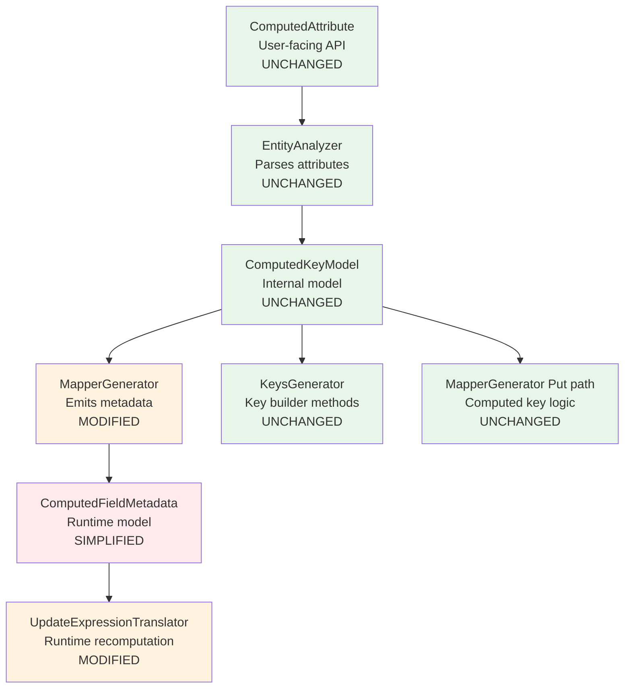

# Design Document: Computed Field Format Normalization

## Overview

This feature normalizes all computed field configurations into a single `Format` string at compile time in the Roslyn incremental source generator, eliminating redundant runtime fields (`Separator`, `Prefix`, `PrefixSeparator`) from `ComputedFieldMetadata`. At runtime, all computed field recomputation paths use `string.Format(format, values)` exclusively — aligning the Update path with the existing Put and Key builder paths.

**Core insight**: The `KeysGenerator` and `MapperGenerator` Put path already use `string.Format` when `HasCustomFormat` is true. The `UpdateExpressionTranslator` currently uses `string.Join` + prefix concatenation. This refactoring makes all three paths identical by having the source generator pre-compute the format string for every computed field configuration.

### Current State (Before)

```
ComputedAttribute        →  Source Generator  →  ComputedFieldMetadata (runtime)
  .SourceProperties              │                  .SourceProperties
  .Separator = "#"               │                  .Separator = "#"
  .Format = null                 │                  .Prefix = "ORDER"
                                 │                  .PrefixSeparator = "#"
                                 ▼
                    UpdateExpressionTranslator
                      string.Join(sep, parts)
                      + prefix + prefixSep logic
```

### Target State (After)

```
ComputedAttribute        →  Source Generator  →  ComputedFieldMetadata (runtime)
  .SourceProperties              │                  .SourceProperties
  .Separator = "#"               │                  .Format = "ORDER#{0}#{1}"
  .Format = null                 │
                                 ▼
                    UpdateExpressionTranslator
                      string.Format(cf.Format, values)
```

## Architecture

The change touches three architectural layers:



**Legend**: Green = unchanged, Orange = modified, Red = breaking change (internal only)

### Design Rationale

1. **Single source of truth**: The format string is the one authoritative representation of how to reconstruct a computed value. No interpretation at runtime.
2. **Compile-time computation**: All translation from Separator/Prefix/PrefixSeparator → format string happens in the source generator where it has full context.
3. **Path unification**: Once all paths use `string.Format(format, values)`, cross-operation consistency is guaranteed by construction.
4. **Backwards compatibility**: `ComputedAttribute` API is unchanged. Users still write `Separator = "#"` — the generator translates it transparently.

## Components and Interfaces

### 1. ComputedFieldMetadata (Modified)

**File**: `Oproto.FluentDynamoDb/Metadata/ComputedFieldMetadata.cs`

```csharp
namespace Oproto.FluentDynamoDb.Metadata;

public class ComputedFieldMetadata
{
    /// <summary>
    /// Gets or sets the ordered list of source property names that compose this computed field.
    /// </summary>
    public string[] SourceProperties { get; set; } = Array.Empty<string>();

    /// <summary>
    /// Gets or sets the format string used to reconstruct the computed value via string.Format().
    /// Always non-null at runtime. Contains positional placeholders {0} through {N-1}.
    /// </summary>
    public string Format { get; set; } = "{0}";
}
```

**Removed**: `Separator`, `Prefix`, `PrefixSeparator` properties.

### 2. Format String Computation (New Logic in MapperGenerator)

**File**: `Oproto.FluentDynamoDb.SourceGenerator/Generators/MapperGenerator.cs`

A new helper method computes the format string from the available configuration:

```csharp
/// <summary>
/// Computes the format string for a computed field based on its configuration.
/// Called at compile time during metadata emission.
/// </summary>
internal static string ComputeFormatString(ComputedKeyModel computedKey, KeyFormatModel? keyFormat)
{
    // 1. If explicit Format is specified, use it directly (highest priority)
    if (computedKey.HasCustomFormat)
        return computedKey.Format!;

    // 2. Build format from Separator (+ optional key Prefix)
    var sourceCount = computedKey.SourceProperties.Length;
    
    // Generate placeholders: "{0}#{1}#{2}" for separator="#", 3 sources
    var placeholders = string.Join(
        computedKey.Separator,
        Enumerable.Range(0, sourceCount).Select(i => $"{{{i}}}"));

    // Prepend key prefix if configured
    if (keyFormat != null && !string.IsNullOrEmpty(keyFormat.Prefix))
    {
        return $"{keyFormat.Prefix}{keyFormat.Separator}{placeholders}";
    }

    return placeholders;
}
```

### 3. MapperGenerator Metadata Emission (Modified)

**File**: `Oproto.FluentDynamoDb.SourceGenerator/Generators/MapperGenerator.cs`

The existing `ComputedField = new ComputedFieldMetadata { ... }` emission block (lines ~4823-4860) changes from emitting `Separator`, `Prefix`, `PrefixSeparator` to emitting a single `Format` assignment:

```csharp
// Current (BEFORE):
sb.AppendLine("ComputedField = new ComputedFieldMetadata");
sb.AppendLine("{");
sb.AppendLine($"    SourceProperties = new[] {{ {sourcePropsArray} }},");
sb.AppendLine($"    Separator = \"{EscapeString(computedKey.Separator)}\",");
// ... Prefix/PrefixSeparator logic ...
sb.AppendLine("},");

// New (AFTER):
var formatString = ComputeFormatString(computedKey, property.KeyFormat);
sb.AppendLine("ComputedField = new ComputedFieldMetadata");
sb.AppendLine("{");
sb.AppendLine($"    SourceProperties = new[] {{ {sourcePropsArray} }},");
sb.AppendLine($"    Format = \"{EscapeString(formatString)}\"");
sb.AppendLine("},");
```

The `EscapeString` method already handles C# string escaping for quotes and backslashes. Curly braces in the format string (`{0}`, `{1}`) do not need escaping in C# string literals — only in format strings consumed by `string.Format`.

### 4. UpdateExpressionTranslator Recomputation (Modified)

**File**: `Oproto.FluentDynamoDb/Expressions/UpdateExpressionTranslator.cs`

The `ValidateAndProcessComputedFields` method (line ~2580) changes from `string.Join` + prefix logic to `string.Format`:

```csharp
// Current (BEFORE - lines 2658-2668):
var parts = cf.SourceProperties
    .Select(s => assignedSources[s]?.ToString() ?? string.Empty)
    .ToArray();
var recomputedValue = string.Join(cf.Separator, parts);
if (!string.IsNullOrEmpty(cf.Prefix))
{
    var prefixSep = cf.PrefixSeparator ?? cf.Separator;
    recomputedValue = cf.Prefix + prefixSep + recomputedValue;
}

// New (AFTER):
var parts = cf.SourceProperties
    .Select(s => (object)(assignedSources[s]?.ToString() ?? string.Empty))
    .ToArray();
var recomputedValue = string.Format(cf.Format, parts);
```

This is a direct replacement — 8 lines become 4 lines, and the logic is now identical to what `string.Format` does in the Keys and Put paths.

### 5. Diagnostic Validation (Enhanced)

**File**: `Oproto.FluentDynamoDb.SourceGenerator/Analysis/EntityAnalyzer.cs`

The existing `ValidateComputedKeyFormat` method already validates placeholder count vs source property count. The only change is making the diagnostic an **error** (currently a warning at `DYNDB036`) when an explicit `Format` has a placeholder count mismatch:

```csharp
// Promote from Warning to Error for placeholder count mismatch
if (placeholderCount != computedKey.SourceProperties.Length)
{
    ReportDiagnostic(DiagnosticDescriptors.ComputedFormatPlaceholderMismatch, ...);
}
```

A new diagnostic descriptor will be added:

```csharp
public static readonly DiagnosticDescriptor ComputedFormatPlaceholderMismatch = new(
    "FDDB090",
    "Format placeholder count mismatch",
    "Computed property '{0}' has format '{1}' with {2} placeholders but {3} source properties",
    "DynamoDb",
    DiagnosticSeverity.Error,
    isEnabledByDefault: true,
    description: "The format string must contain exactly one placeholder ({0}, {1}, etc.) for each source property.");
```

### 6. ComputedAttribute (UNCHANGED)

**File**: `Oproto.FluentDynamoDb/Attributes/ComputedAttribute.cs`

No changes. The `Separator` and `Format` properties remain as-is. The source generator reads them and translates to a unified format string.

### 7. ComputedKeyModel (UNCHANGED)

**File**: `Oproto.FluentDynamoDb.SourceGenerator/Models/ComputedKeyModel.cs`

No changes. The internal model still carries `Separator`, `Format`, and `HasCustomFormat` for the source generator to make decisions during compilation.

## Data Models

### ComputedFieldMetadata (Simplified)

| Property | Type | Default | Description |
|----------|------|---------|-------------|
| `SourceProperties` | `string[]` | `Array.Empty<string>()` | Ordered source property names |
| `Format` | `string` | `"{0}"` | .NET composite format string for `string.Format()` |

**Removed fields**: `Separator` (string), `Prefix` (string?), `PrefixSeparator` (string?)

### Format String Generation Rules

| Input Configuration | Generated Format String |
|---|---|
| `Separator="#"`, 1 source | `"{0}"` |
| `Separator="#"`, 2 sources | `"{0}#{1}"` |
| `Separator="#"`, 3 sources | `"{0}#{1}#{2}"` |
| `Separator="_"`, 2 sources | `"{0}_{1}"` |
| `Separator="#"`, Prefix="ORDER", KeySep="#", 2 sources | `"ORDER#{0}#{1}"` |
| `Separator="#"`, Prefix="USER", KeySep="_", 2 sources | `"USER_{0}#{1}"` |
| `Format="TENANT#{0}#USER#{1}#"` (explicit) | `"TENANT#{0}#USER#{1}#"` |
| Both `Format` and `Separator` specified | Format wins (Separator ignored) |

## Correctness Properties

*A property is a characteristic or behavior that should hold true across all valid executions of a system — essentially, a formal statement about what the system should do. Properties serve as the bridge between human-readable specifications and machine-verifiable correctness guarantees.*

### Property 1: Format Generation Round-Trip (No Prefix)

*For any* separator string and *for any* N source values (N ≥ 1, values converted via ToString()), the format string generated by the source generator for a Separator-only configuration SHALL satisfy: `string.Format(generatedFormat, values) == string.Join(separator, values)`

**Validates: Requirements 1.1, 1.2, 4.4, 7.1**

### Property 2: Format Generation Round-Trip (With Prefix)

*For any* key prefix, key separator, computed separator, and N source values (N ≥ 1), the format string generated by the source generator for a configuration with key prefix SHALL satisfy: `string.Format(generatedFormat, values) == prefix + keySeparator + string.Join(computedSeparator, values)`

**Validates: Requirements 1.3, 7.2**

### Property 3: Explicit Format Pass-Through

*For any* valid .NET format string containing exactly N positional placeholders ({0} through {N-1}), when specified as the `Format` property on a ComputedAttribute with N source properties, the source generator SHALL emit that format string unchanged as the `Format` value in `ComputedFieldMetadata`

**Validates: Requirements 1.4, 1.5, 7.3**

### Property 4: Placeholder Count Invariant

*For any* computed field configuration (whether Separator-based or explicit Format), the generated format string SHALL contain exactly N sequential positional placeholders {0} through {N-1} where N equals the count of source properties declared in the ComputedAttribute

**Validates: Requirements 1.6, 2.4**

### Property 5: Cross-Operation Consistency

*For any* computed field configuration and *for any* ordered set of source property string values (including null/empty), the computed result produced by the Keys builder path, the Put mapper path, and the Update recomputation path SHALL be byte-for-byte identical

**Validates: Requirements 3.1, 3.3, 5.1, 5.2, 5.4**

### Property 6: String Escaping Correctness

*For any* format string containing characters that require C# string literal escaping (backslash, double-quote, or literal curly braces as text), the escaped string literal emitted by the MapperGenerator SHALL compile without error and evaluate at runtime to the original intended format string

**Validates: Requirements 6.1, 6.3**

## Error Handling

### Compile-Time Errors (Source Generator)

| Diagnostic | Code | Trigger | Message |
|---|---|---|---|
| Placeholder count mismatch | `FDDB090` | Explicit `Format` has different placeholder count than source property count | "Computed property '{name}' has format '{format}' with {N} placeholders but {M} source properties" |
| Invalid source property | `DYNDB031` | Source property doesn't exist in entity | Existing behavior unchanged |
| Self-referencing key | `DYNDB034` | Computed property references itself | Existing behavior unchanged |
| Circular dependency | `DYNDB033` | Circular computed key dependency chain | Existing behavior unchanged |

### Runtime Errors (UpdateExpressionTranslator)

| Exception | Code | Trigger |
|---|---|---|
| `PartialSourceAssignmentException` | FDDB072 | Not all source properties assigned in update expression |
| `MixedAssignmentException` | FDDB073 | Both direct computed field assignment and source property assignment |
| `EntityParameterReferenceException` | FDDB071 | Source property value references entity lambda parameter |
| `FormatException` | — | Malformed format string at runtime (should not occur if generator is correct) |

### Null Value Handling

When a source property value is `null`, the translator substitutes `string.Empty` before passing to `string.Format`. This ensures:
- No `NullReferenceException` from `string.Format`
- Consistent behavior: null → empty position in the formatted output
- Matches existing behavior in the Put path where `typedEntity.Property` resolves to the property's default

## Testing Strategy

### Property-Based Tests (FsCheck)

The project uses xUnit with FluentAssertions. For property-based testing, **FsCheck** (via `FsCheck.Xunit`) is the standard .NET PBT library.

**Configuration**:
- Minimum 100 iterations per property test
- Each property test tagged with: `Feature: computed-field-format-normalization, Property {N}: {description}`

**Test targets**:
1. Properties 1-4: Test the `ComputeFormatString` helper directly (pure function, no source generator infrastructure needed)
2. Property 5: Integration test using `UpdateExpressionTranslator` with mock `EntityMetadata` comparing against `string.Format` with the same format string
3. Property 6: Test `EscapeString` utility with format strings containing special characters

### Unit Tests (xUnit)

| Test | Purpose |
|---|---|
| `ComputedFieldMetadata_HasFormat_NoSeparator` | Verify simplified class shape |
| `MapperGenerator_EmitsFormatOnly` | Verify generated code contains Format but not Separator/Prefix/PrefixSeparator |
| `UpdateTranslator_UsesStringFormat` | Verify recomputation uses string.Format |
| `Diagnostic_FDDB090_PlaceholderMismatch` | Verify compile-time error on mismatched placeholders |
| `ExplicitFormat_TenantUser_AllPaths` | Concrete example from Requirement 5.3 |
| `NullSourceValue_SubstitutesEmpty` | Verify null → string.Empty substitution |

### Integration Tests

| Test | Purpose |
|---|---|
| `ComputedGsiField_UpdateProducesSameAsPut` | End-to-end: put entity, read it, update sources, verify computed field matches |
| `BackwardsCompatibility_SeparatorConfigs` | Existing separator-based entities produce same values after upgrade |

### Test Organization

```
Oproto.FluentDynamoDb.UnitTests/
  Expressions/
    UpdateExpressionTranslator_FormatNormalizationTests.cs
  Metadata/
    ComputedFieldMetadataTests.cs
  SourceGenerator/
    ComputeFormatStringPropertyTests.cs    ← Property-based tests
    MapperGenerator_ComputedFieldTests.cs
```
