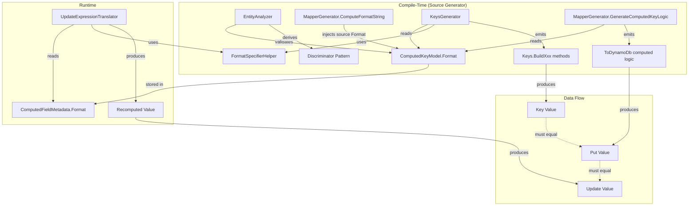
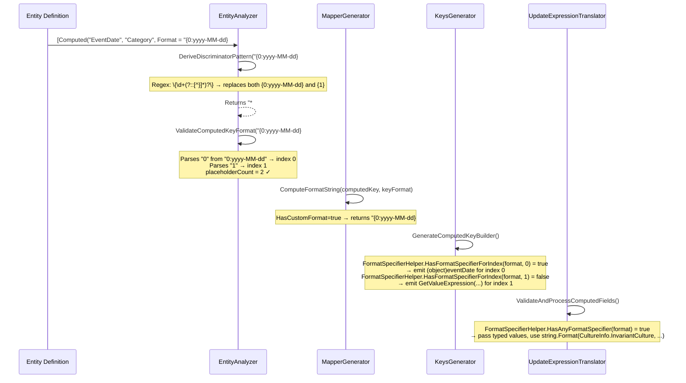

# Design Document: Computed Field Format Specifiers

## Overview

This feature adds support for .NET format specifiers (e.g., `{0:yyyy-MM-dd}`, `{0:D4}`, `{0:G}`) in computed field format strings within the Oproto.FluentDynamoDb source generator and runtime. Currently, several code paths assume all placeholders are simple `{N}` patterns. When format specifiers are present, these paths break—producing incorrect discriminator patterns, false compiler diagnostics, and silently dropping format specifiers by pre-stringifying values before `string.Format` can apply them.

The fix spans two layers:
1. **Source Generator (compile-time)**: EntityAnalyzer regex/validation, KeysGenerator code emission, MapperGenerator format string computation
2. **Runtime**: UpdateExpressionTranslator computed field recomputation

Additionally, this feature adds a **source property Format fallback** enhancement: when a computed format placeholder has no explicit specifier but the source property has `[DynamoDbAttribute(Format = "...")]`, the source generator injects the format at compile time.

### Design Decisions

| Decision | Rationale |
|----------|-----------|
| Single regex update in `DeriveDiscriminatorPattern` | Minimal change, captures both `{N}` and `{N:format}` variants |
| Conditional pre-stringification bypass (per-index) | Preserves backwards compatibility for placeholders without specifiers |
| `CultureInfo.InvariantCulture` for all format specifier paths | Prevents locale-dependent key values that would corrupt DynamoDB queries |
| Source property Format injection at compile time in `ComputeFormatString` | No runtime metadata changes needed; effective format flows through all paths |
| New `FormatSpecifierHelper` static utility | Centralizes format detection logic, used by both KeysGenerator and UpdateExpressionTranslator |
| No changes to `ComputedFieldMetadata` runtime class | The format string already carries specifiers; no additional metadata needed |

## Architecture



### Component Interaction Sequence



## Components and Interfaces

### 1. FormatSpecifierHelper (New Utility)

**Location**: `Oproto.FluentDynamoDb.SourceGenerator/Utilities/FormatSpecifierHelper.cs` (for source generator) and `Oproto.FluentDynamoDb/Utilities/FormatSpecifierHelper.cs` (for runtime)

This static helper centralizes format specifier detection logic.

```csharp
namespace Oproto.FluentDynamoDb.Utilities;

/// <summary>
/// Provides helper methods for detecting format specifiers in .NET composite format strings.
/// </summary>
internal static class FormatSpecifierHelper
{
    // Regex: matches {N:specifier} where N is one or more digits and specifier is non-empty
    private static readonly Regex FormatSpecifierPattern = 
        new(@"\{(\d+):([^}]+)\}", RegexOptions.Compiled);

    /// <summary>
    /// Determines whether any placeholder in the format string contains a format specifier.
    /// </summary>
    /// <param name="format">The composite format string (e.g., "{0:yyyy-MM-dd}#{1}").</param>
    /// <returns>True if at least one placeholder has a format specifier after the colon.</returns>
    public static bool HasAnyFormatSpecifier(string? format)
    {
        if (string.IsNullOrEmpty(format))
            return false;
        return FormatSpecifierPattern.IsMatch(format);
    }

    /// <summary>
    /// Determines whether the placeholder at the given index has a format specifier.
    /// </summary>
    /// <param name="format">The composite format string.</param>
    /// <param name="index">The placeholder index to check.</param>
    /// <returns>True if the placeholder at that index has a format specifier.</returns>
    public static bool HasFormatSpecifierForIndex(string? format, int index)
    {
        if (string.IsNullOrEmpty(format))
            return false;

        foreach (Match match in FormatSpecifierPattern.Matches(format))
        {
            if (int.TryParse(match.Groups[1].Value, out var matchIndex) && matchIndex == index)
                return true;
        }
        return false;
    }

    /// <summary>
    /// Returns the set of placeholder indices that have format specifiers.
    /// </summary>
    public static HashSet<int> GetIndicesWithFormatSpecifiers(string? format)
    {
        var result = new HashSet<int>();
        if (string.IsNullOrEmpty(format))
            return result;

        foreach (Match match in FormatSpecifierPattern.Matches(format))
        {
            if (int.TryParse(match.Groups[1].Value, out var index))
                result.Add(index);
        }
        return result;
    }
}
```

**Design Decision**: This utility is duplicated (not shared) between the source generator project and the main library project because the source generator cannot reference the main library at compile time. Both copies are `internal static` and share identical logic.

### 2. EntityAnalyzer Changes

#### A. `DeriveDiscriminatorPattern` — Regex Update

**Current**:
```csharp
var pattern = Regex.Replace(normalizedKeyFormat, @"\{\d+\}", "*");
```

**New**:
```csharp
var pattern = Regex.Replace(normalizedKeyFormat, @"\{\d+(?::[^}]*)?\}", "*");
```

The regex change adds `(?::[^}]*)?` — an optional non-capturing group matching a colon followed by zero or more non-`}` characters. This handles:
- `{0}` → matched (no specifier)
- `{0:yyyy-MM-dd}` → matched
- `{0:HH:mm:ss}` → matched (colons in the specifier portion are fine since we match up to `}`)
- `{12:D4}` → matched (multi-digit indices)

#### B. `ValidateComputedKeyFormat` — Parse Index Before Colon

**Current logic** (pseudocode):
```csharp
var placeholderText = format.Substring(i + 1, endIndex - i - 1);
if (int.TryParse(placeholderText, out var placeholderIndex))
    placeholderCount = Math.Max(placeholderCount, placeholderIndex + 1);
else if (!placeholderText.Contains(':'))
    // emit diagnostic
```

**New logic**:
```csharp
var placeholderText = format.Substring(i + 1, endIndex - i - 1);

// Extract index portion: everything before the first colon
var colonIndex = placeholderText.IndexOf(':');
var indexText = colonIndex >= 0 
    ? placeholderText.Substring(0, colonIndex) 
    : placeholderText;

if (int.TryParse(indexText, out var placeholderIndex) && placeholderIndex >= 0)
{
    placeholderCount = Math.Max(placeholderCount, placeholderIndex + 1);
}
else
{
    // Invalid placeholder format - the index portion is not a valid non-negative integer
    ReportDiagnostic(DiagnosticDescriptors.InvalidComputedKeyFormat,
        computedProperty.PropertyDeclaration?.Identifier.GetLocation(),
        computedProperty.PropertyName, format, $"Invalid placeholder: {{{placeholderText}}}");
    return;
}
```

**Key changes**:
1. Always split on first colon to extract the index portion
2. `int.TryParse` on the index portion only
3. Remove the `!placeholderText.Contains(':')` special-case that was silently skipping format-specifier placeholders
4. Validate that parsed index is non-negative

### 3. KeysGenerator Changes

#### `GenerateComputedKeyBuilder` — Conditional Pre-Stringification Bypass

**Current** (line ~195 in the method):
```csharp
var formatArgs = string.Join(", ", sourceProperties.Select(p => 
    GetValueExpression(GetParameterName(p!.PropertyName), p.PropertyType)));
sb.AppendLine($"{indent}        var keyValue = string.Format(\"{computedKey.Format}\", {formatArgs});");
```

**New**:
```csharp
// Determine which indices have format specifiers
var specifierIndices = FormatSpecifierHelper.GetIndicesWithFormatSpecifiers(computedKey.Format);

var formatArgs = string.Join(", ", sourceProperties.Select((p, idx) =>
{
    if (specifierIndices.Contains(idx))
    {
        // Pass typed value cast to object — let string.Format apply the format specifier via IFormattable
        return $"(object){GetParameterName(p!.PropertyName)}";
    }
    else
    {
        // No format specifier at this index — use existing pre-stringification logic
        return GetValueExpression(GetParameterName(p!.PropertyName), p!.PropertyType);
    }
}));

if (specifierIndices.Count > 0)
{
    // Use CultureInfo.InvariantCulture when format specifiers are present
    sb.AppendLine($"{indent}        var keyValue = string.Format(System.Globalization.CultureInfo.InvariantCulture, \"{computedKey.Format}\", {formatArgs});");
}
else
{
    sb.AppendLine($"{indent}        var keyValue = string.Format(\"{computedKey.Format}\", {formatArgs});");
}
```

**Rationale**: By selectively bypassing pre-stringification only for indices that have format specifiers, we:
1. Preserve backwards compatibility for simple `{0}#{1}` formats
2. Allow `string.Format` to invoke `IFormattable.ToString(format, provider)` on typed values
3. Use `CultureInfo.InvariantCulture` to ensure deterministic output regardless of machine locale

### 4. MapperGenerator Changes

#### `GenerateComputedKeyLogic` — InvariantCulture for Format Specifier Paths

**Current**:
```csharp
var formatArgs = string.Join(", ", computedKey.SourceProperties.Select(sp => $"typedEntity.{EscapePropertyName(sp)}"));
sb.AppendLine($"            typedEntity.{escapedPropertyName} = string.Format(\"{computedKey.Format}\", {formatArgs});");
```

**New**:
```csharp
var formatArgs = string.Join(", ", computedKey.SourceProperties.Select(sp => $"typedEntity.{EscapePropertyName(sp)}"));

if (FormatSpecifierHelper.HasAnyFormatSpecifier(computedKey.Format))
{
    sb.AppendLine($"            typedEntity.{escapedPropertyName} = string.Format(System.Globalization.CultureInfo.InvariantCulture, \"{computedKey.Format}\", {formatArgs});");
}
else
{
    sb.AppendLine($"            typedEntity.{escapedPropertyName} = string.Format(\"{computedKey.Format}\", {formatArgs});");
}
```

**Note**: The Put/ToDynamoDb path already passes typed property values directly, so format specifiers already work. The only change here is adding `CultureInfo.InvariantCulture` for locale safety.

#### `ComputeFormatString` — Source Property Format Injection

**Current**: Returns the explicit format or builds a separator-based format.

**New** (added after existing logic):
```csharp
internal static string ComputeFormatString(ComputedKeyModel computedKey, KeyFormatModel? keyFormat, PropertyModel[] sourceProperties)
{
    // 1. If explicit Format is specified, use it directly (highest priority)
    if (computedKey.HasCustomFormat)
        return computedKey.Format!;

    // 2. Build format from Separator (+ optional key Prefix)
    var sourceCount = computedKey.SourceProperties.Length;

    // Generate placeholders with source property Format injection
    var placeholders = new string[sourceCount];
    for (int i = 0; i < sourceCount; i++)
    {
        var sourceProperty = sourceProperties.Length > i ? sourceProperties[i] : null;
        var sourceFormat = sourceProperty?.Format;
        
        // Inject source property's DynamoDbAttribute.Format if available and non-empty
        if (!string.IsNullOrEmpty(sourceFormat))
        {
            placeholders[i] = $"{{{i}:{sourceFormat}}}";
        }
        else
        {
            placeholders[i] = $"{{{i}}}";
        }
    }

    var formatString = string.Join(computedKey.Separator, placeholders);

    // Prepend key prefix if configured
    if (keyFormat != null && !string.IsNullOrEmpty(keyFormat.Prefix))
    {
        return $"{keyFormat.Prefix}{keyFormat.Separator}{formatString}";
    }

    return formatString;
}
```

**Signature change**: The method gains a `PropertyModel[] sourceProperties` parameter so it can look up each source property's `DynamoDbAttribute.Format`. Callers will need updating to pass this context.

### 5. UpdateExpressionTranslator Changes

**Current** (in `ValidateAndProcessComputedFields`):
```csharp
var parts = cf.SourceProperties
    .Select(s => (object)(assignedSources[s]?.ToString() ?? string.Empty))
    .ToArray();
var recomputedValue = string.Format(cf.Format, parts);
```

**New**:
```csharp
object[] parts;
string recomputedValue;

if (FormatSpecifierHelper.HasAnyFormatSpecifier(cf.Format))
{
    // Format specifiers present — pass typed values so string.Format can apply IFormattable
    parts = cf.SourceProperties
        .Select(s => assignedSources[s] ?? (object)string.Empty)
        .ToArray();
    recomputedValue = string.Format(
        System.Globalization.CultureInfo.InvariantCulture, cf.Format, parts);
}
else
{
    // No format specifiers — preserve existing behavior (pre-stringify)
    parts = cf.SourceProperties
        .Select(s => (object)(assignedSources[s]?.ToString() ?? string.Empty))
        .ToArray();
    recomputedValue = string.Format(cf.Format, parts);
}
```

**Rationale**:
- When format specifiers are present, values must remain typed so `string.Format` can invoke `IFormattable.ToString(format, provider)`
- When no specifiers are present, the existing `.ToString()` behavior is preserved for backwards compatibility
- `CultureInfo.InvariantCulture` ensures deterministic output matching the compile-time code paths
- Null values become empty string to prevent `NullReferenceException` in `string.Format`

### 6. ComputedFieldMetadata (No Changes)

The `ComputedFieldMetadata.Format` property already stores the full format string including any specifiers (e.g., `"{0:yyyy-MM-dd}#{1}"`). The source generator emits this format directly when populating metadata at compile time. No structural changes are needed.

### 7. Documentation and Changelog

**New file**: `docs/core-features/ComputedFieldFormatSpecifiers.md`  
**Updates**: `CHANGELOG.md`, `docs/DOCUMENTATION_CHANGELOG.md`

## Data Models

### Existing Models (No Changes)

| Model | Location | Notes |
|-------|----------|-------|
| `ComputedKeyModel` | SourceGenerator/Models/ | `Format` already stores specifiers. No changes. |
| `ComputedFieldMetadata` | FluentDynamoDb/Metadata/ | `Format` already stores specifiers. No changes. |
| `PropertyModel` | SourceGenerator/Models/ | `Format` property already available for injection. |
| `KeyFormatModel` | SourceGenerator/Models/ | Unchanged. |

### Format String Lifecycle

```
User declares: [Computed("EventDate", "Category", Format = "{0:yyyy-MM-dd}#{1}")]
                                                      ↓
EntityAnalyzer stores: ComputedKeyModel.Format = "{0:yyyy-MM-dd}#{1}"
                                                      ↓
ComputeFormatString returns: "{0:yyyy-MM-dd}#{1}" (unchanged, explicit format)
                                                      ↓
NormalizedKeyFormat = "{0:yyyy-MM-dd}#{1}"
                                                      ↓
DeriveDiscriminatorPattern → regex replaces both placeholders → "*#*" → null
                                                      ↓
Source generator emits metadata: 
    ComputedFieldMetadata { Format = "{0:yyyy-MM-dd}#{1}", SourceProperties = [...] }
```

For the Format injection path (no explicit specifier):
```
User declares: [Computed("EventDate", "Category")]
               EventDate has [DynamoDbAttribute("date", Format = "yyyy-MM-dd")]
                                                      ↓
ComputeFormatString injects: "{0:yyyy-MM-dd}#{1}" (using default separator)
                                                      ↓
All downstream paths use injected format string identically
```

## Correctness Properties

*A property is a characteristic or behavior that should hold true across all valid executions of a system—essentially, a formal statement about what the system should do. Properties serve as the bridge between human-readable specifications and machine-verifiable correctness guarantees.*

### Property 1: Discriminator Pattern Replaces All Placeholders

*For any* valid composite format string containing placeholders of the form `{N}` or `{N:format}` (where N is one or more digits and format is any sequence of non-`}` characters), `DeriveDiscriminatorPattern` SHALL replace every such placeholder with `*`, leaving all literal text and separators unchanged.

**Validates: Requirements 1.1, 1.2, 1.3, 1.4**

### Property 2: Discriminator Pattern Null for Variable Prefix

*For any* composite format string where the first character is `{` (i.e., the format starts with a placeholder), `DeriveDiscriminatorPattern` SHALL return null.

**Validates: Requirements 1.5**

### Property 3: Placeholder Count Extraction Correctness

*For any* composite format string containing placeholders of the form `{N}` or `{N:format}`, `ValidateComputedKeyFormat` SHALL compute the placeholder count as `max(index) + 1` where indices are extracted by parsing the substring before the first colon in each placeholder text.

**Validates: Requirements 2.1, 2.4, 7.5**

### Property 4: Format Mismatch Diagnostic Fires Correctly

*For any* computed format string where the distinct placeholder index count does not equal the source property count, the EntityAnalyzer SHALL emit diagnostic FDDB090 reporting the mismatch.

**Validates: Requirements 2.3, 7.3, 7.4**

### Property 5: Invalid Placeholder Index Detection

*For any* placeholder text where the portion before the first colon is not a valid non-negative integer (e.g., `{abc:format}`, `{-1:format}`), the EntityAnalyzer SHALL emit a diagnostic indicating an invalid placeholder format.

**Validates: Requirements 2.5, 7.2**

### Property 6: Typed Value Preservation for Format Specifier Indices

*For any* computed format string containing a format specifier at index I, the KeysGenerator SHALL emit code that passes the source property at index I as `(object)parameterName` (typed value cast to object) rather than the result of `GetValueExpression()`.

**Validates: Requirements 3.1, 3.2, 3.5**

### Property 7: Backwards-Compatible Pre-Stringification

*For any* computed format string where no placeholder has a format specifier, the KeysGenerator SHALL emit code using `GetValueExpression()` for all arguments, identical to the current behavior.

**Validates: Requirements 3.3**

### Property 8: Update Recomputation Produces Correct Formatted Output

*For any* `ComputedFieldMetadata` with format specifiers and any set of typed source property values, the `UpdateExpressionTranslator` recomputation SHALL produce the same result as `string.Format(CultureInfo.InvariantCulture, format, typedValues)`.

**Validates: Requirements 4.1, 4.2, 5.4**

### Property 9: Cross-Operation Consistency

*For any* computed field with format specifiers and any set of typed source values, the output of the Keys builder path, the Put/ToDynamoDb path, and the Update recomputation path SHALL produce identical string values.

**Validates: Requirements 5.1, 5.2, 5.3, 5.4**

### Property 10: Source Property Format Injection

*For any* computed format string without explicit format specifiers where a source property at index I has a non-null, non-empty `DynamoDbAttribute.Format` value, `ComputeFormatString` SHALL inject that Format into the placeholder at index I, producing `{I:format}`.

**Validates: Requirements 6.1, 6.2, 6.3, 6.6**

### Property 11: Explicit Specifier Precedence Over Source Property Format

*For any* computed format string where placeholder at index I already has an explicit format specifier, the source property Format at index I SHALL NOT be used, and the effective format string retains the explicit specifier unchanged.

**Validates: Requirements 3.5, 6.2**

## Error Handling

### Diagnostic Changes

| Diagnostic | Current Behavior | New Behavior |
|------------|-----------------|--------------|
| FDDB090 (placeholder mismatch) | False positive for `{N:format}` | Correctly counts indices from format specifier placeholders |
| InvalidComputedKeyFormat | Silently skips `{N:format}` | Reports invalid if index portion is not a non-negative integer |

### Runtime Error Handling

| Scenario | Behavior |
|----------|----------|
| Null source value with format specifiers | Substituted with empty string before `string.Format` |
| Null source value without format specifiers | `.ToString()` called, returns `""` (existing behavior) |
| `string.Format` throws FormatException | Bubbles up as `InvalidOperationException` with context (existing catch block in KeysGenerator) |
| Invalid format specifier (e.g., `{0:ZZZZ}` on int) | `string.Format` throws `FormatException` at runtime; no compile-time detection possible |

### Backwards Compatibility

All changes are gated on the presence of format specifiers:
- **No format specifiers**: All code paths behave identically to current behavior
- **With format specifiers**: New behavior activates (typed values, InvariantCulture)

This means existing entities without format specifiers require no changes and produce identical output.

## Testing Strategy

### Property-Based Testing

This feature is well-suited for property-based testing because:
- Core logic is in pure functions (regex replacement, index parsing, format string manipulation)
- The input space is large (arbitrary format strings, indices, types)
- Universal properties hold across all valid inputs

**Library**: [FsCheck](https://fscheck.github.io/FsCheck/) via FsCheck.Xunit for xUnit integration

**Configuration**: Minimum 100 iterations per property test

**Tag format**: `Feature: computed-field-format-specifiers, Property {N}: {description}`

### Test Categories

#### Property Tests (PBT)

| Property | Test Target | Generator Strategy |
|----------|------------|-------------------|
| 1: All placeholders replaced | `DeriveDiscriminatorPattern` | Generate format strings with random separators, 1-5 placeholders, random format specifiers |
| 2: Null for variable prefix | `DeriveDiscriminatorPattern` | Generate format strings starting with `{N}` or `{N:format}` |
| 3: Index extraction | `ValidateComputedKeyFormat` | Generate format strings with mixed specifiers, verify index count |
| 4: Mismatch diagnostic | `ValidateComputedKeyFormat` | Generate (format, sourceCount) pairs with intentional mismatch |
| 5: Invalid index detection | `ValidateComputedKeyFormat` | Generate placeholders with non-numeric index portions |
| 6: Typed value preservation | `KeysGenerator` output analysis | Generate format strings, verify code emission patterns |
| 7: Backwards compat | `KeysGenerator` output analysis | Generate format strings without specifiers, verify unchanged behavior |
| 8: Update recomputation | `UpdateExpressionTranslator` | Generate typed values + format strings, verify output matches `string.Format` |
| 9: Cross-operation consistency | Integration | Compare outputs of all three paths with same inputs |
| 10: Format injection | `ComputeFormatString` | Generate source properties with/without Format, verify injection |
| 11: Precedence | `ComputeFormatString` | Generate cases with both explicit and source Format |

#### Unit Tests (Example-Based)

| Test | Scenario |
|------|----------|
| DateOnly with `{0:yyyy-MM-dd}` | Verifies 2024-03-15 → "2024-03-15" |
| Int with `{0:D4}` | Verifies 42 → "0042" |
| Enum with `{0:G}` | Verifies Status.Active → "Active" |
| `{0:HH:mm:ss}` (colons in specifier) | Verifies correct index extraction |
| Repeated index `{0:D4}#{0:G}#{1}` | Verifies distinct count = 2 |
| Null source value | Verifies empty string substitution |
| Mixed `{0:D4}#{1}` | Verifies index 0 typed, index 1 pre-stringified |
| Source property Format injection | Verifies `{0}#{1}` + Format="yyyy-MM-dd" → `{0:yyyy-MM-dd}#{1}` |
| Empty string Format (treated as null) | Verifies placeholder unchanged |

#### Integration Tests

| Test | Scenario |
|------|----------|
| End-to-end DateOnly entity | Full source generator + runtime, Put + Get + Update cycle |
| End-to-end Int zero-padding | Full source generator + runtime, all three paths produce same value |
| Discriminator pattern with specifiers | Multi-entity table, verify entity type resolution still works |

### Test File Organization

```
Oproto.FluentDynamoDb.SourceGenerator.UnitTests/
  Analysis/
    EntityAnalyzer_FormatSpecifierTests.cs           ← Regex + validation property tests
  Generators/
    KeysGenerator_FormatSpecifierTests.cs            ← Code emission property tests
  Generators/
    MapperGenerator_FormatSpecifierTests.cs          ← ComputeFormatString property tests

Oproto.FluentDynamoDb.UnitTests/
  Expressions/
    UpdateExpressionTranslator_FormatSpecifierTests.cs  ← Runtime recomputation property tests
  Utilities/
    FormatSpecifierHelperTests.cs                       ← Helper utility property tests
```
