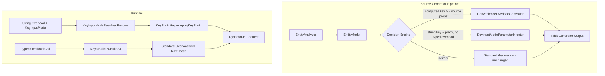
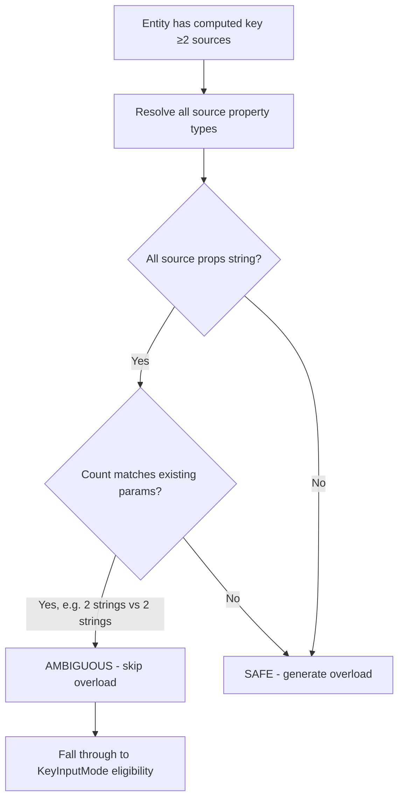
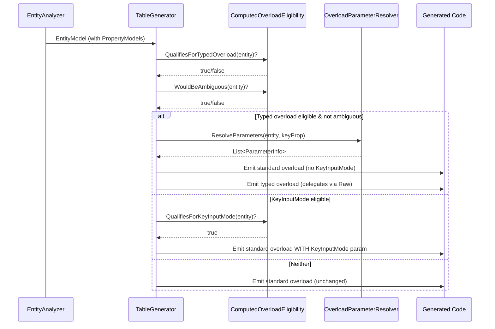

# Design Document: Computed Key Accessor Overloads

## Overview

This feature extends the Roslyn-based incremental source generator (`Oproto.FluentDynamoDb.SourceGenerator`) to produce two complementary enhancements for entities with computed keys and/or string keys with prefixes:

1. **Typed Parameter Convenience Overloads** — For entities with computed keys (`PropertyModel.IsComputed && ComputedKey.SourceProperties.Length >= 2`), generate additional Get, Delete, Update, and ConditionCheck overloads that accept the individual source property components directly rather than requiring callers to pre-build key strings via `Entity.Keys.BuildPk(...)`.

2. **KeyInputMode Integration** — For entities with string keys that have a configured prefix but do NOT qualify for typed overloads, add an optional `KeyInputMode mode = KeyInputMode.Default` parameter to standard accessor methods so callers can control prefix application behavior per-call.

These two features are mutually exclusive per entity: when a typed overload exists, the string overload is unambiguously for pre-built keys and no KeyInputMode parameter is needed.

### Design Goals

- Zero breaking changes to existing generated code
- Compile-time type safety for computed key components
- Centralized key composition through existing `Keys.BuildPk()`/`BuildSk()` methods
- AOT compatible, no reflection
- Deterministic code generation suitable for incremental source generators

## Architecture



### High-Level Component Interaction

The source generator already processes `EntityModel` instances through `TableGenerator` to emit accessor methods. This feature adds a decision layer that inspects each entity's key configuration and determines which generation path to follow:

| Entity Key Configuration | Generated Output |
|---|---|
| Computed PK (≥2 sources) + simple SK | Typed overload (PK components + SK string) |
| Simple PK + computed SK (≥2 sources) | Typed overload (PK string + SK components) |
| Both computed | Single typed overload (all PK components + all SK components) |
| Computed PK only, no SK | Typed overload (PK components only) |
| String PK with prefix, no computed | KeyInputMode parameter on string overloads |
| Non-string keys, no prefix | Standard generation (no changes) |

## Components and Interfaces

### 1. Eligibility Analysis (`ComputedOverloadEligibility`)

A new internal static helper that encapsulates the decision logic:

```csharp
internal static class ComputedOverloadEligibility
{
    /// <summary>
    /// Determines whether an entity qualifies for typed parameter convenience overloads.
    /// </summary>
    internal static bool QualifiesForTypedOverload(EntityModel entity)
    {
        var pk = entity.PartitionKeyProperty;
        var sk = entity.SortKeyProperty;
        
        bool pkComputed = pk?.IsComputed == true 
            && pk.ComputedKey!.SourceProperties.Length >= 2;
        bool skComputed = sk?.IsComputed == true 
            && sk.ComputedKey!.SourceProperties.Length >= 2;
        
        return pkComputed || skComputed;
    }

    /// <summary>
    /// Determines whether the generated typed overload would be ambiguous with existing overloads.
    /// </summary>
    internal static bool WouldBeAmbiguous(EntityModel entity)
    {
        // If all computed source properties resolve to 'string' and count matches
        // the existing overload parameter count, it's ambiguous
        var typedParams = GetTypedOverloadParameters(entity);
        var standardParams = GetStandardOverloadParameters(entity);
        
        return typedParams.Count == standardParams.Count
            && typedParams.Zip(standardParams, (t, s) => t.Type == s.Type).All(x => x);
    }

    /// <summary>
    /// Determines whether an entity qualifies for KeyInputMode parameter injection.
    /// </summary>
    internal static bool QualifiesForKeyInputMode(EntityModel entity)
    {
        if (QualifiesForTypedOverload(entity) && !WouldBeAmbiguous(entity))
            return false; // typed overload handles disambiguation
        
        var pk = entity.PartitionKeyProperty;
        var sk = entity.SortKeyProperty;
        
        bool pkEligible = pk != null 
            && pk.PropertyType == "string" 
            && !string.IsNullOrEmpty(pk.KeyFormat?.Prefix);
        bool skEligible = sk != null 
            && sk.PropertyType == "string" 
            && !string.IsNullOrEmpty(sk.KeyFormat?.Prefix);
        
        return pkEligible || skEligible;
    }
}
```

### 2. Parameter Resolution (`OverloadParameterResolver`)

Resolves source property names to their types from the entity model:

```csharp
internal static class OverloadParameterResolver
{
    internal record ParameterInfo(string Name, string Type, bool IsNullable);

    /// <summary>
    /// Resolves the parameter list for a typed convenience overload.
    /// Returns null if any source property cannot be resolved (diagnostic emitted).
    /// </summary>
    internal static List<ParameterInfo>? ResolveParameters(
        EntityModel entity,
        PropertyModel keyProperty)
    {
        var parameters = new List<ParameterInfo>();
        foreach (var sourcePropName in keyProperty.ComputedKey!.SourceProperties)
        {
            var prop = entity.Properties.FirstOrDefault(
                p => p.PropertyName == sourcePropName);
            if (prop == null)
                return null; // unresolvable — emit diagnostic
            
            parameters.Add(new ParameterInfo(
                Name: ToCamelCase(prop.PropertyName),
                Type: prop.PropertyType,
                IsNullable: prop.IsNullable));
        }
        return parameters;
    }
}
```

### 3. Code Emitter Integration

The existing `TableGenerator.GenerateAccessorGetMethod`, `GenerateAccessorDeleteMethod`, `GenerateAccessorUpdateMethod`, and `GenerateAccessorConditionCheckMethod` methods are extended with:

- A call to `ComputedOverloadEligibility.QualifiesForTypedOverload()` to decide whether to emit a convenience overload after the standard overload.
- A call to `ComputedOverloadEligibility.QualifiesForKeyInputMode()` to decide whether to inject the `KeyInputMode mode` parameter into the standard overload signature.

### 4. Generated Code Shapes

#### Typed Overload (Computed PK + Simple SK)

```csharp
// Standard overload (unchanged)
public GetItemRequestBuilder<Event> Get(string pK, string sK) =>
    _table.Get<Event>().WithKey("pk", pK, "sk", sK);

// NEW: Typed parameter convenience overload
public GetItemRequestBuilder<Event> Get(int year, int month, int day, string sK) =>
    Get(Event.Keys.BuildPk(year, month, day), sK, KeyInputMode.Raw);
//  ↑ delegates to standard overload with Raw to avoid double-prefixing
```

Wait — per Requirement 4 AC 2, when a typed overload IS generated, the standard string overload does NOT get a KeyInputMode parameter. So the delegation from the typed overload calls the standard overload and passes `KeyInputMode.Raw` directly:

```csharp
// Standard overload (NO KeyInputMode since typed overload exists)
public GetItemRequestBuilder<Event> Get(string pK, string sK) =>
    _table.Get<Event>().WithKey("pk", pK, "sk", sK);

// Typed overload delegates with internally-handled Raw key
public GetItemRequestBuilder<Event> Get(int year, int month, int day, string sK)
{
    var computedPk = Event.Keys.BuildPk(year, month, day);
    return _table.Get<Event>().WithKey("pk", computedPk, "sk", sK);
}
```

#### KeyInputMode on Standard Overload (No Typed Overload)

```csharp
// Standard overload with KeyInputMode parameter
public GetItemRequestBuilder<Order> Get(
    string pK, 
    string sK, 
    KeyInputMode mode = KeyInputMode.Default)
{
    var resolvedMode = KeyInputModeResolver.Resolve(mode, _table.Options);
    var effectivePk = KeyPrefixHelper.ApplyKeyPrefix(pK, "ORDER", "#", resolvedMode);
    var effectiveSk = KeyPrefixHelper.ApplyKeyPrefix(sK, "LINE", "#", resolvedMode);
    return _table.Get<Order>().WithKey("pk", effectivePk, "sk", effectiveSk);
}
```

### 5. Ambiguity Detection Algorithm



The algorithm compares the typed overload's required parameters (excluding optional parameters with defaults) against the existing overload's parameters. If count and positional types match exactly, the overload is skipped silently.

### 6. Table-Level and Convenience Method Propagation

Table-level methods (`table.Get(pk, sk)`) and express-route convenience methods (`table.GetAsync(pk, sk)`) delegate to entity accessor methods. The same eligibility logic applies:

- If the entity gets typed overloads → table-level typed overloads are generated (delegating to entity accessor)
- If the entity gets KeyInputMode → table-level methods get the `mode` parameter and pass it through

## Data Models

### Existing Models Used (No Changes Required)

| Model | Role |
|---|---|
| `EntityModel` | Contains `Properties`, `PartitionKeyProperty`, `SortKeyProperty` |
| `PropertyModel` | `IsComputed`, `ComputedKey`, `PropertyType`, `IsNullable`, `KeyFormat` |
| `ComputedKeyModel` | `SourceProperties[]`, `Separator`, `Format` |
| `KeyFormatModel` | `Prefix`, `Separator` |

### New Internal Types

```csharp
/// <summary>
/// Captures the resolved overload generation decision for an entity.
/// </summary>
internal record OverloadDecision(
    bool GenerateTypedOverload,
    bool InjectKeyInputMode,
    List<ParameterInfo>? TypedParameters,
    bool PkHasPrefix,
    string? PkPrefix,
    string? PkSeparator,
    bool SkHasPrefix,
    string? SkPrefix,
    string? SkSeparator
);
```

This decision record is computed once per entity during generation and threaded through to all accessor method generators (Get, Delete, Update, ConditionCheck, GetAsync, DeleteAsync, and their table-level counterparts).

### Data Flow



## Correctness Properties

*A property is a characteristic or behavior that should hold true across all valid executions of a system — essentially, a formal statement about what the system should do. Properties serve as the bridge between human-readable specifications and machine-verifiable correctness guarantees.*

### Property 1: Typed overload generation correctness

*For any* `EntityModel` where at least one key has `IsComputed == true` and `ComputedKey.SourceProperties.Length >= 2`, and the typed overload is not ambiguous with the existing overload, the generated code SHALL contain a method with parameters matching each source property in declaration order (PK components first, SK components second), where computed-key source properties are typed parameters and non-computed key(s) are a single string parameter.

**Validates: Requirements 1.1, 1.3, 1.6, 1.7**

### Property 2: Consistency across CRUD methods

*For any* entity that qualifies for a typed parameter convenience overload, the generated Get, Delete, Update, and ConditionCheck methods SHALL each contain a typed overload with an identical parameter signature (same parameter names, types, and positional order).

**Validates: Requirements 1.4**

### Property 3: No overload for non-computed entities

*For any* `EntityModel` where neither the partition key nor the sort key has `IsComputed == true` with `ComputedKey.SourceProperties.Length >= 2`, the generated code SHALL NOT contain any typed parameter convenience overloads beyond the standard `(string)` or `(string, string)` overloads.

**Validates: Requirements 1.5**

### Property 4: Parameter type and name resolution

*For any* source property referenced by a computed key's `SourceProperties` array, the generated convenience overload parameter SHALL have a type matching the source property's `PropertyType` (including nullability) and a name that is the camelCase transformation of the source property's `PropertyName` (first character lowercased, remaining unchanged).

**Validates: Requirements 2.1, 2.2, 2.4, 2.5**

### Property 5: Delegation to Keys.Build methods with Raw bypass

*For any* entity with a typed convenience overload, the generated overload method body SHALL call `Entity.Keys.BuildPk(...)` for computed partition keys and/or `Entity.Keys.BuildSk(...)` for computed sort keys with parameters in declaration order, and the composed key value SHALL be passed to the DynamoDB request without any further prefix transformation (equivalent to KeyInputMode.Raw behavior).

**Validates: Requirements 3.1, 3.2, 3.3, 3.4, 5.1, 5.2**

### Property 6: Path equivalence (round-trip)

*For any* valid set of source property component values, invoking the typed convenience overload SHALL produce a DynamoDB request with key `AttributeValue` entries byte-for-byte identical to manually calling `Entity.Keys.BuildPk(...)` / `Entity.Keys.BuildSk(...)` with the same values and passing the results to the standard accessor overload with the composed key strings.

**Validates: Requirements 3.5, 9.3**

### Property 7: KeyInputMode eligibility

*For any* `EntityModel`, the generated standard accessor methods (Get, Delete, Update, ConditionCheck, GetAsync, DeleteAsync, and their table-level counterparts) SHALL include an optional `KeyInputMode mode = KeyInputMode.Default` parameter if and only if: (a) at least one key is of type `string` with a non-null/non-empty `KeyFormat.Prefix`, AND (b) no non-ambiguous typed parameter convenience overload is being generated for that entity.

**Validates: Requirements 4.1, 4.2, 4.7, 6.1, 6.3, 7.1, 7.3, 10.1, 10.2, 11.6**

### Property 8: Ambiguity detection

*For any* entity where the resolved typed overload parameter types (excluding optional parameters with defaults) would match the existing standard overload's required parameter types in count and positional type order, the source generator SHALL skip generation of the typed overload silently (no convenience overload emitted, no diagnostic).

**Validates: Requirements 8.1, 8.2, 8.3, 8.4**

### Property 9: Standard overload preservation (backward compatibility)

*For any* entity that previously generated `(string)` or `(string, string)` accessor overloads, those overloads SHALL remain present with identical parameter names, types, return types, and method bodies after this feature is applied — regardless of whether typed overloads or KeyInputMode parameters are also generated.

**Validates: Requirements 11.1, 11.5**

## Error Handling

### Source Generator Diagnostics

| Diagnostic ID | Severity | Condition | Message |
|---|---|---|---|
| FDDB070 | Error | Source property in `ComputedKey.SourceProperties` cannot be resolved to a property in `EntityModel.Properties` | `Cannot resolve source property '{name}' for computed key on '{entityName}.{keyPropertyName}'. Convenience overload will not be generated.` |
| FDDB071 | Warning | Entity has `UseFluentResults` enabled and typed overload generated — reminder to verify FluentResults overloads | `Entity '{entityName}' has typed overloads generated with FluentResults. Verify GetAsyncResult and DeleteAsyncResult overloads.` |

### Runtime Error Conditions

The generated typed overloads delegate to `Keys.BuildPk()`/`BuildSk()` which already perform:
- `ArgumentNullException` for null parameters
- `ArgumentException` for empty/whitespace string parameters
- `ArgumentException` for empty Guid parameters
- `ArgumentException` for default DateTime values
- `InvalidOperationException` if key composition fails unexpectedly
- Length validation (>2048 bytes)

No additional runtime error handling is needed in the generated overload methods themselves since all validation is centralized in the Keys class.

### KeyInputMode Runtime Errors

The existing `KeyInputModeResolver.Resolve()` throws `ArgumentOutOfRangeException` for undefined enum values. This behavior is unchanged. The generated code calls:
```csharp
var resolvedMode = Oproto.FluentDynamoDb.Utility.KeyInputModeResolver.Resolve(mode, _table.Options);
```

## Testing Strategy

### Unit Tests (Source Generator Output Verification)

These tests use the existing pattern in the project: construct an `EntityModel`, call `TableGenerator.GenerateTableClass()`, and assert on the generated string output.

| Test Category | Description |
|---|---|
| Computed PK only (no SK) | Verify typed overload with PK source params only |
| Computed SK only (simple PK) | Verify typed overload with PK string + SK source params |
| Both keys computed | Verify single typed overload with all params |
| Non-string source types | Verify int, DateTime, Guid, enum parameter types |
| Nullable source types | Verify nullable types preserved in parameters |
| Ambiguity detection | Verify no overload when all-string params match existing |
| KeyInputMode on string+prefix | Verify mode parameter appears on standard overloads |
| No KeyInputMode without prefix | Verify mode parameter absent when no prefix |
| No KeyInputMode with typed overload | Verify mode parameter absent when typed overload generated |
| Non-string key exclusion | Verify non-string keys don't trigger KeyInputMode |
| Table-level propagation | Verify table-level methods mirror entity accessor behavior |
| FluentResults integration | Verify FluentResults methods get mode parameter when eligible |
| Re-enabled non-string key tests | Remove Skip attributes, verify passing |

### Property-Based Tests (Correctness Verification)

Property-based testing is appropriate for this feature because the source generator is a pure function (EntityModel → generated code string) with a large input space (varying key configurations, types, prefix combinations).

**Library:** [FsCheck.Xunit](https://github.com/fscheck/FsCheck) (mature .NET PBT library, already compatible with xUnit)

**Configuration:** Minimum 100 iterations per property test.

**Tag format:** `Feature: computed-key-accessor-overloads, Property {number}: {property_text}`

Each correctness property above maps to a property-based test that generates random `EntityModel` configurations and asserts the property holds across all generated inputs.

### Integration Tests (Runtime Behavior Verification)

Integration tests instantiate a source-generated table class with a mocked `IAmazonDynamoDB` (via NSubstitute), invoke the generated methods, and capture the DynamoDB request to assert key values:

| Test Category | Description |
|---|---|
| Typed overload key equivalence | Compare typed overload request vs manual Keys.Build + standard |
| KeyInputMode.Auto with prefixed value | Verify no double-prefix |
| KeyInputMode.Auto without prefix in value | Verify prefix applied |
| KeyInputMode.Raw | Verify value unchanged |
| KeyInputMode.Value | Verify prefix always applied |
| Default mode backward compat | Verify pre-prefixed values pass through unchanged |
| No-prefix key with any mode | Verify no transformation |

### Test Infrastructure

All tests follow existing project conventions:
- xUnit test framework
- FluentAssertions for readable assertions  
- NSubstitute for mocking `IAmazonDynamoDB`
- Tests in `Oproto.FluentDynamoDb.SourceGenerator.UnitTests` project

