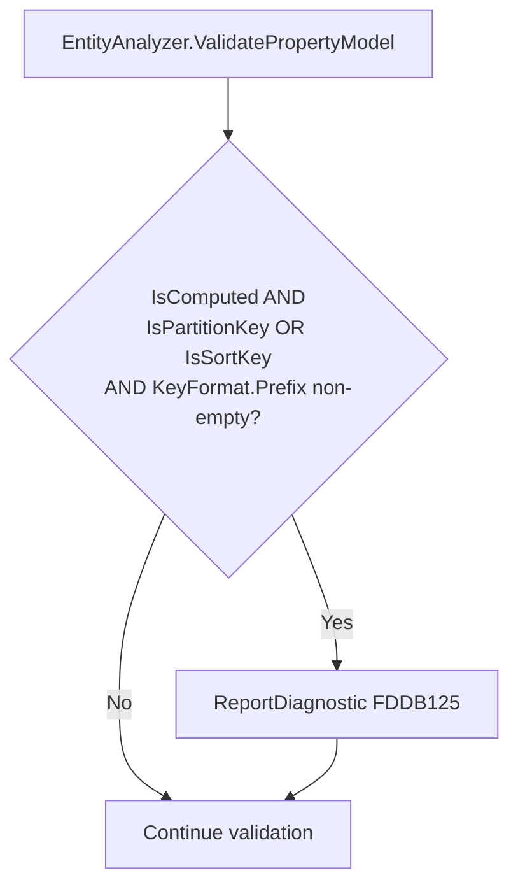

# Design Document: Computed Key Prefix Conflict (FDDB125)

## Overview

This feature adds a compile-time diagnostic (FDDB125) that fires when a property is simultaneously a computed key (`[Computed]`) and has a `Prefix` configured on its `[PartitionKey]` or `[SortKey]` attribute. The source generator's `GenerateKeyPrefixApplication` method already excludes computed keys with a `!p.IsComputed` filter — the prefix is silently ignored at runtime. This diagnostic surfaces the misconfiguration at compile time so developers discover it immediately rather than through runtime debugging.

The implementation is a simple validation check in `EntityAnalyzer.ValidatePropertyModel()` that inspects the existing `PropertyModel` state. No new analysis infrastructure is needed.

## Architecture



The diagnostic integrates into the existing single-pass property validation pipeline. It runs after key attributes and computed key attributes have been extracted, ensuring all required state is already populated on `PropertyModel`.

### Placement Rationale

The check is placed in `ValidatePropertyModel()` (alongside FDDB120, FDDB121, FDDB123) rather than in `ValidateComputedAndExtractedKeys()` because:
1. It's a per-property check, not a cross-property relationship check
2. The existing pattern for similar conflicts (FDDB120: constant+computed, FDDB121: constant+prefix) lives in `ValidatePropertyModel()`
3. The required state (`IsComputed`, `IsPartitionKey`, `IsSortKey`, `KeyFormat`) is all on the same `PropertyModel` instance

## Components and Interfaces

### DiagnosticDescriptors.cs

A new static `DiagnosticDescriptor` field:

```csharp
public static readonly DiagnosticDescriptor ComputedKeyPrefixConflict = new(
    "FDDB125",
    "Computed key property has redundant Prefix",
    "Property '{0}' is a computed key with Prefix = \"{1}\" configured on its key attribute. " +
    "Prefixes are not applied to computed keys — remove the Prefix and embed it in the " +
    "[Computed] Format if the prefix should appear in the stored value",
    "DynamoDb",
    DiagnosticSeverity.Error,
    isEnabledByDefault: true,
    description: "A computed key derives its value entirely from [Computed] configuration. " +
    "The Prefix on [PartitionKey] or [SortKey] is silently ignored at runtime. " +
    "Remove the Prefix to avoid confusion, or use Format = \"PREFIX#{0}\" on [Computed] " +
    "if the prefix should appear in the stored value.",
    helpLinkUri: string.Format(DiagnosticHelpLinks.BaseUrlFormat, "FDDB125"));
```

### EntityAnalyzer.ValidatePropertyModel()

New validation block added after the existing FDDB121 check:

```csharp
// FDDB125: Computed key + Prefix conflict
if (propertyModel.IsComputed &&
    (propertyModel.IsPartitionKey || propertyModel.IsSortKey) &&
    !string.IsNullOrEmpty(propertyModel.KeyFormat?.Prefix))
{
    ReportDiagnostic(DiagnosticDescriptors.ComputedKeyPrefixConflict,
        propertyModel.PropertyDeclaration?.GetLocation(),
        propertyModel.PropertyName,
        propertyModel.KeyFormat!.Prefix!);
}
```

### Test Entity Updates

Two existing test entities need their `Prefix` removed from the key attribute on computed properties:

1. `ComputedPkWithPrefixTestEntity` — remove `Prefix = "EVT"` from `[PartitionKey]`
2. `NonComputedPkComputedSkTestEntity` — remove `Prefix = "LOC"` from `[SortKey]` on the computed SK

The behavioral property these tests validate (computed keys don't receive prefix application) remains unchanged — the tests just no longer use an invalid attribute configuration.

## Data Models

No new data models are introduced. The feature relies entirely on existing `PropertyModel` fields:

| Field | Type | Usage |
|-------|------|-------|
| `IsComputed` | `bool` | Whether property has `[Computed]` attribute |
| `IsPartitionKey` | `bool` | Whether property has `[PartitionKey]` |
| `IsSortKey` | `bool` | Whether property has `[SortKey]` |
| `KeyFormat` | `KeyFormatModel?` | Contains `Prefix` and `Separator` |
| `ComputedKey` | `ComputedKeyModel?` | Contains `Format` and `HasCustomFormat` |

## Correctness Properties

*A property is a characteristic or behavior that should hold true across all valid executions of a system — essentially, a formal statement about what the system should do. Properties serve as the bridge between human-readable specifications and machine-verifiable correctness guarantees.*

### Property 1: Computed key with prefix always emits FDDB125

*For any* property that is both a key property (partition or sort) and a computed property, and has a non-empty Prefix configured on the key attribute, the source generator SHALL emit FDDB125 as an error diagnostic whose message contains both the property name and the configured prefix value — regardless of whether `[Computed]` has an explicit Format or not.

**Validates: Requirements 1.1, 1.2, 2.1, 2.2, 2.3**

### Property 2: No false positives for non-conflicting configurations

*For any* property where EITHER (a) it is not a computed property, OR (b) it has no non-empty Prefix on the key attribute, OR (c) it is not a key property, the source generator SHALL NOT emit FDDB125.

**Validates: Requirements 4.1, 4.2, 4.3, 4.4**

## Error Handling

- **Non-halting behavior**: FDDB125 is reported via `ReportDiagnostic()` and does not throw or return early. The EntityAnalyzer continues processing remaining properties and entities, consistent with FDDB120–FDDB124 patterns.
- **Null safety**: The check uses `?.` null-conditional access on `KeyFormat` and null-checks `Prefix` via `string.IsNullOrEmpty`, preventing NREs when key format is absent.
- **No code generation impact**: The diagnostic is an error, so the source generator will not emit code for the entity (matching existing behavior for other Error-severity diagnostics). This prevents invalid generated code from being produced.

## Testing Strategy

### Unit Tests (Example-Based)

- **Descriptor structure tests**: Verify FDDB125 descriptor has correct code, severity (Error), category ("DynamoDb"), enabled-by-default flag, and help link URI containing "FDDB125"
- **Non-halting test**: Entity with 2+ computed key properties each with prefix → both FDDB125 diagnostics emitted
- **No false positive for non-key computed property**: Property with `[Computed]` but no `[PartitionKey]`/`[SortKey]` → no FDDB125
- **Existing test entities compile cleanly**: After removing Prefix, `ComputedPkWithPrefixTestEntity` and `NonComputedPkComputedSkTestEntity` compile without FDDB125

### Property-Based Tests (FsCheck)

**Library**: FsCheck (already in use across the project)
**Minimum iterations**: 100 per property test

Each property test must reference its design document property:
- **Feature: computed-key-prefix-conflict, Property 1**: Generate random non-empty prefix strings and property names. Construct entity source with computed key + prefix (with and without Format). Run source generator. Verify FDDB125 is emitted with Error severity and message contains property name and prefix.
- **Feature: computed-key-prefix-conflict, Property 2**: Generate random entities that have either (a) prefix without computed, or (b) computed without prefix, or (c) computed non-key. Run source generator. Verify FDDB125 is NOT emitted.
