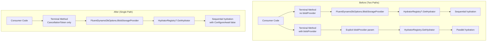
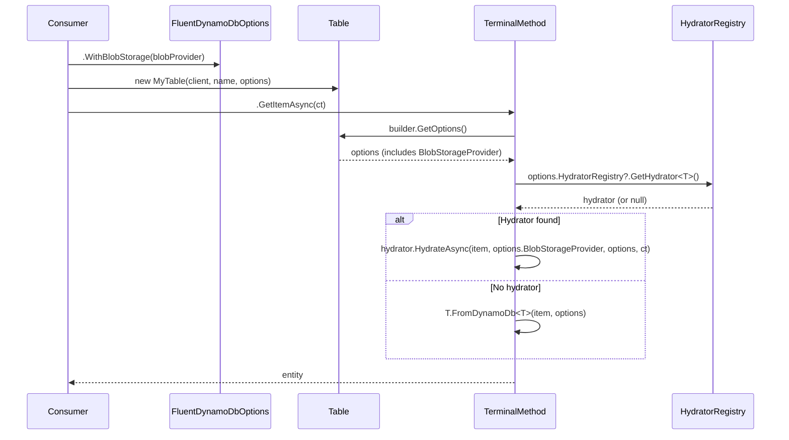

# Design Document: Consolidate Hydration Paths

## Overview

This feature removes all legacy `IBlobStorageProvider` parameter overloads from `EntityExecuteAsyncExtensions` and `FluentResultsExtensions`, consolidating to the single options-based hydration path. The options-based path (`FluentDynamoDbOptions.WithBlobStorage(...)`) resolves the provider at table construction time and passes it through the builder chain automatically.

The legacy overloads predate the options-based configuration, carry known bugs (broken `PutAsync`, null-safety mismatches, parallel vs sequential divergence), and have become a maintenance burden. This is a breaking API change that simplifies the hydration surface from two code paths to one.

### Design Rationale

- **Single path eliminates divergence bugs**: Path A (options-based) has been the primary path for over a year and has received all bug fixes for encrypted entities, composite entities, and deferred serialization. Path B (explicit parameter) has known unfixed bugs.
- **Null safety**: Path A uses null-conditional access on `HydratorRegistry` (`?.GetHydrator<T>()`), while Path B dereferences directly (can NPE). Removing Path B eliminates the unsafe path.
- **Sequential hydration**: Path A uses `foreach + await` (sequential, order-preserving). Path B uses `Task.WhenAll` (parallel, unordered). The retained path preserves DynamoDB response ordering.
- **PutAsync correctness**: Path A resolves deferred entities before building the request. Path B skips this step, breaking encrypted entities with blob storage.

## Architecture



### Migration Flow



## Components and Interfaces

### Files Modified

| File | Change Type | Description |
|------|-------------|-------------|
| `Oproto.FluentDynamoDb/Requests/Extensions/EntityExecuteAsyncExtensions.cs` | Remove methods | Remove 8 `IBlobStorageProvider` parameter overloads and `WithItemAsync` extension |
| `Oproto.FluentDynamoDb.FluentResults/FluentResultsExtensions.cs` | Remove methods | Remove `GetItemAsyncResult`, `ToListAsyncResult` (Query + Scan), `PutAsyncResult` overloads accepting `IBlobStorageProvider` |
| `Oproto.FluentDynamoDb.ApiConsistencyTests/FluentResults/GetApiSurfaceFluentResults.cs` | Remove tests | Remove `GetItemAsyncResult_WithBlobProvider_ShouldCompile` and blob-provider lines in cancellation-token tests |
| `Oproto.FluentDynamoDb.ApiConsistencyTests/FluentResults/PutApiSurfaceFluentResults.cs` | Remove tests | Remove `PutAsyncResult_WithBlobProvider_ShouldCompile` and blob-provider lines in cancellation-token tests |
| `Oproto.FluentDynamoDb.ApiConsistencyTests/FluentResults/QueryApiSurfaceFluentResults.cs` | Remove tests | Remove `ToListAsyncResult_WithBlobProvider_ShouldCompile` and blob-provider lines in cancellation-token tests |
| `Oproto.FluentDynamoDb.ApiConsistencyTests/FluentResults/ScanApiSurfaceFluentResults.cs` | Remove tests | Remove `ToListAsyncResult_WithBlobProvider_ShouldCompile` and blob-provider lines in cancellation-token tests |
| `CHANGELOG.md` | Add entry | Document breaking change with migration example |
| `.kiro/steering/fluentdynamodb.md` | Verify/update | Confirm no `IBlobStorageProvider` terminal-method examples exist |

### Methods Removed from EntityExecuteAsyncExtensions

1. `GetItemAsync<T>(GetItemRequestBuilder<T>, IBlobStorageProvider, CancellationToken)`
2. `ToListAsync<T>(QueryRequestBuilder<T>, IBlobStorageProvider, CancellationToken)`
3. `ToListAsync<T>(ScanRequestBuilder<T>, IBlobStorageProvider, CancellationToken)`
4. `ToCompositeEntityListAsync<T>(QueryRequestBuilder<T>, IBlobStorageProvider, CancellationToken)`
5. `ToCompositeEntityListAsync<T>(ScanRequestBuilder<T>, IBlobStorageProvider, CancellationToken)`
6. `ToCompositeEntityAsync<T>(QueryRequestBuilder<T>, IBlobStorageProvider, CancellationToken)`
7. `ToCompositeEntityAsync<T>(ScanRequestBuilder<T>, IBlobStorageProvider, CancellationToken)`
8. `PutAsync<T>(PutItemRequestBuilder<T>, IBlobStorageProvider, CancellationToken)`

Additionally removed:
- `WithItemAsync<T>(PutItemRequestBuilder<T>, T, IBlobStorageProvider, CancellationToken)` — legacy helper that was only useful with Path B

### Methods Removed from FluentResultsExtensions

1. `GetItemAsyncResult<T>(GetItemRequestBuilder<T>, IBlobStorageProvider, CancellationToken)`
2. `ToListAsyncResult<T>(QueryRequestBuilder<T>, IBlobStorageProvider, CancellationToken)`
3. `ToListAsyncResult<T>(ScanRequestBuilder<T>, IBlobStorageProvider, CancellationToken)`
4. `PutAsyncResult<T>(PutItemRequestBuilder<T>, IBlobStorageProvider, CancellationToken)`

Note: `ToCompositeEntityListAsyncResult` and `ToCompositeEntityAsyncResult` with `IBlobStorageProvider` parameter do not exist in `FluentResultsExtensions` (only the non-blob-provider versions were implemented). No composite entity FluentResults wrappers need removal.

### Retained API Surface

The following methods remain unchanged:

- `GetItemAsync<T>(GetItemRequestBuilder<T>, CancellationToken)` — resolves blob provider from options
- `ToListAsync<T>(QueryRequestBuilder<T>, CancellationToken)` — resolves blob provider from options
- `ToListAsync<T>(ScanRequestBuilder<T>, CancellationToken)` — resolves blob provider from options
- `ToCompositeEntityListAsync<T>(QueryRequestBuilder<T>, CancellationToken)` — resolves blob provider from options
- `ToCompositeEntityListAsync<T>(ScanRequestBuilder<T>, CancellationToken)` — resolves blob provider from options
- `ToCompositeEntityAsync<T>(QueryRequestBuilder<T>, CancellationToken)` — resolves blob provider from options
- `ToCompositeEntityAsync<T>(ScanRequestBuilder<T>, CancellationToken)` — resolves blob provider from options (uses `FromDynamoDbAsync` path)
- `PutAsync<T>(PutItemRequestBuilder<T>, CancellationToken)` — resolves blob provider from options, handles deferred serialization
- `UpdateAsync<T>(UpdateItemRequestBuilder<T>, CancellationToken)` — unchanged (never had blob-provider overload)
- `DeleteAsync<T>(DeleteItemRequestBuilder<T>, CancellationToken)` — unchanged (never had blob-provider overload)
- `WithItem<T>(PutItemRequestBuilder<T>, T)` — retained (synchronous, delegates to builder instance method)

All corresponding FluentResults wrappers (non-blob-provider overloads) remain unchanged.

## Data Models

No data model changes. The `FluentDynamoDbOptions` class, `IAsyncEntityHydrator<T>` interface, `IBlobStorageProvider` interface, and `HydratorRegistry` all remain unchanged. The only change is the removal of the explicit-parameter code paths that bypass the options-based resolution.

### Configuration Pattern (Unchanged)

```csharp
// Configure blob provider at options level (existing pattern, now the ONLY pattern)
var options = new FluentDynamoDbOptions()
    .WithBlobStorage(new S3BlobProvider(s3Client, bucketName));

var table = new MyTable(client, "TableName", options);

// All terminal methods resolve provider automatically
var entity = await table.Users.Get(userId).GetItemAsync();
await table.Users.Put(entity).PutAsync();
var list = await table.Users.Query(x => x.Pk == pk).ToListAsync();
```

## Correctness Properties

*A property is a characteristic or behavior that should hold true across all valid executions of a system — essentially, a formal statement about what the system should do. Properties serve as the bridge between human-readable specifications and machine-verifiable correctness guarantees.*

This feature is a pure code-removal change with no new algorithmic logic, data transformations, or input-dependent behavior introduced. Property-based testing does not apply — there is no meaningful "for all inputs X, property P(X) holds" statement for deleting method overloads.

**Why PBT does not apply:**

- No new functions or logic are being written — only existing overloads are deleted
- The retained code paths are unchanged; correctness is validated by the existing test suite
- The primary verification is binary (compilation succeeds or fails), not input-dependent
- Documentation correctness is a manual review concern, not a property over generated inputs

**Verification approach instead of PBT:**

1. **Compilation success** — `dotnet build` confirms no internal or external callers reference removed overloads
2. **Existing test suite passes** — `dotnet test` confirms the retained options-based path is unaffected
3. **API surface tests compile** — ApiConsistencyTests validate the retained public API patterns still work
4. **Documentation review** — CHANGELOG and steering docs correctly reflect the removal

### Property 1: Retained path behavioral equivalence

*For any* entity operation exercised by the existing test suite (GetItemAsync, ToListAsync, PutAsync, ToCompositeEntityAsync, ToCompositeEntityListAsync), the observable behavior after removing the legacy overloads SHALL be identical to the behavior before removal — verified by the existing unit and API consistency tests passing without modification to their assertions.

**Validates: Requirements 1.3, 2.4, 6.1, 6.2, 6.3, 6.4, 6.5, 6.6**

## Error Handling

No changes to error handling. The retained path:

1. **Null HydratorRegistry**: Uses null-conditional (`options.HydratorRegistry?.GetHydrator<T>()`) — falls back to synchronous `FromDynamoDb` when no hydrator is registered.
2. **Null BlobStorageProvider**: The `HydrateAsync` method on `IAsyncEntityHydrator<T>` accepts `IBlobStorageProvider?` (nullable). Encryption-only entities pass null for the blob provider. If an entity actually needs blob storage and the provider is null, the generated hydrator code will throw at the point of blob retrieval.
3. **Deferred entity resolution**: `PutAsync` checks `builder.HasDeferredEntity` and resolves via the hydrator's `SerializeAsync` before building the PutItemRequest — this was the bug in Path B that is eliminated.
4. **OperationCanceledException**: Rethrown without wrapping (existing behavior, unchanged).
5. **All other exceptions**: Wrapped in `DynamoDbMappingException` with context about the operation type (existing behavior, unchanged).

## Testing Strategy

### Why Property-Based Testing Does Not Apply

This feature is a **pure removal** of existing API overloads with no new algorithmic logic introduced. The retained code paths are unchanged — only the legacy alternative paths are deleted. PBT requires meaningful input variation and universal properties; here the correctness criteria are:

- **Compilation succeeds** after method removal (binary pass/fail, no input variation)
- **Documentation content** is correct (manual verification)
- **Existing behavior** is preserved (covered by the existing test suite)

There is no "for all inputs X, property P(X) holds" statement that would be meaningful for a code-removal feature.

### Testing Approach

#### 1. Compilation Verification (SMOKE)

The primary validation mechanism is that the solution builds successfully after the removal:

```bash
dotnet build
```

This verifies:
- Removed methods are gone from the assembly
- No internal callers reference the removed overloads
- No unused `using` directives remain
- ApiConsistencyTests compile without the removed test methods

#### 2. ApiConsistencyTests (Retained Surface)

The existing `ApiConsistencyTests` project validates that the retained API surface compiles correctly. After removing the `WithBlobProvider` test methods and their blob-provider lines from cancellation-token tests, the remaining tests confirm the options-based overloads are still accessible.

Files to modify:
- `FluentResults/GetApiSurfaceFluentResults.cs` — remove `GetItemAsyncResult_WithBlobProvider_ShouldCompile` and blob-provider line from cancellation test
- `FluentResults/PutApiSurfaceFluentResults.cs` — remove `PutAsyncResult_WithBlobProvider_ShouldCompile` and blob-provider line from cancellation test
- `FluentResults/QueryApiSurfaceFluentResults.cs` — remove `ToListAsyncResult_WithBlobProvider_ShouldCompile` and blob-provider line from cancellation test
- `FluentResults/ScanApiSurfaceFluentResults.cs` — remove `ToListAsyncResult_WithBlobProvider_ShouldCompile` and blob-provider line from cancellation test

#### 3. Existing Unit Tests (INTEGRATION)

Run the full test suite to confirm no regressions in the retained path:

```bash
dotnet test
```

The existing unit tests in `Oproto.FluentDynamoDb.UnitTests` already cover:
- Options-based hydration for `GetItemAsync`, `ToListAsync`, `PutAsync`
- Sequential hydration ordering
- Null `HydratorRegistry` fallback to synchronous mapping
- Composite entity assembly via `ToCompositeEntityAsync` / `ToCompositeEntityListAsync`
- Deferred entity resolution in `PutAsync`
- `ConfigureAwait(false)` compliance (enforced by project conventions)

No new tests are needed because no new logic is being added.

#### 4. Documentation Verification (EXAMPLE)

Manual verification that:
- CHANGELOG contains the breaking change entry with migration example
- `.kiro/steering/fluentdynamodb.md` contains no per-call `IBlobStorageProvider` examples (already confirmed — the steering doc only shows the options-based pattern)

### Removal Checklist

| Step | Validation |
|------|-----------|
| Remove 8 overloads from `EntityExecuteAsyncExtensions` | `dotnet build` succeeds |
| Remove `WithItemAsync` extension method | `dotnet build` succeeds |
| Remove 4 overloads from `FluentResultsExtensions` | `dotnet build` succeeds |
| Remove `using Oproto.FluentDynamoDb.Providers.BlobStorage;` if unused | `dotnet build` with no warnings |
| Remove `WithBlobProvider` test methods from ApiConsistencyTests | `dotnet build` succeeds |
| Remove blob-provider lines from cancellation-token tests | `dotnet build` succeeds |
| Remove unused `var blobProvider` declarations | `dotnet build` with no warnings |
| Remove unused `using` directives from test files | `dotnet build` with no warnings |
| Add CHANGELOG entry | Manual review |
| Verify steering doc | Grep for `IBlobStorageProvider` in terminal method examples |
| Run full test suite | `dotnet test` — all pass |

### Build Order

The removal must happen in dependency order:

1. **FluentResultsExtensions** (depends on EntityExecuteAsyncExtensions blob-provider overloads)
2. **EntityExecuteAsyncExtensions** (the core methods)
3. **ApiConsistencyTests** (depends on both of the above)

Alternatively, all removals can happen in a single commit since the removed FluentResults methods only call the removed EntityExecuteAsyncExtensions methods — removing both simultaneously keeps the build green at every step.

