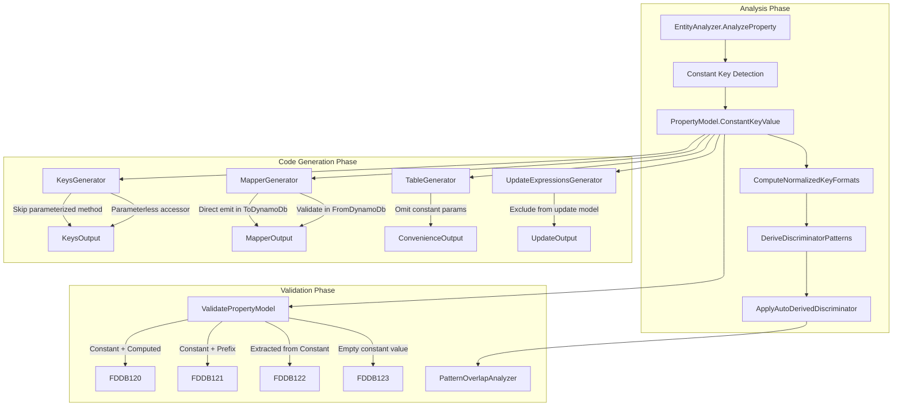

# Design Document: Constant Key Detection

## Overview

This design introduces constant key detection into the Roslyn incremental source generator pipeline. The feature identifies key properties (`[PartitionKey]` or `[SortKey]`) that return a fixed compile-time string value via expression-body (`=>`) or read-only auto-property syntax, stores the detected value in `PropertyModel.ConstantKeyValue`, and propagates that information through discriminator derivation, Keys class generation, convenience method generation, serialization, deserialization, and diagnostics.

The approach is additive — existing `PropertyModel` gets one new nullable field, and each downstream generator checks `ConstantKeyValue != null` to branch into constant-aware code paths. No breaking changes to existing entities or generated APIs.

## Architecture

The constant key detection feature integrates into the existing source generator pipeline at three stages:



### Design Decisions

1. **Single field on PropertyModel** — `ConstantKeyValue: string?` is the canonical signal. All downstream components check this one field. This avoids scattering detection logic and keeps the model lean.

2. **Detection at AnalyzeProperty time** — Constant detection runs during property analysis (before validation), so validators and generators both have access to the result.

3. **ExactMatch discriminator strategy** — Constant keys produce discriminator patterns with `DiscriminatorStrategy.ExactMatch`, which integrates directly with the existing `PatternOverlapAnalyzer` without modification.

4. **Diagnostic ID range FDDB120–FDDB123** — Continues the FDDB series after the schema version range (FDDB110–FDDB116), maintaining a coherent numbering scheme.

## Components and Interfaces

### PropertyModel Extension

```csharp
// Models/PropertyModel.cs — new field
internal class PropertyModel
{
    // ... existing fields ...

    /// <summary>
    /// Gets or sets the compile-time constant value for this key property.
    /// Non-null when the property is detected as a Constant_Key via expression-body
    /// returning a string literal/const, or read-only auto-property with string literal/const initializer.
    /// Null for all non-constant key properties.
    /// </summary>
    public string? ConstantKeyValue { get; set; }

    /// <summary>
    /// Gets a value indicating whether this property is a constant key.
    /// </summary>
    public bool IsConstantKey => ConstantKeyValue != null;
}
```

### EntityAnalyzer — Detection Logic

New private method `DetectConstantKeyValue` called from `AnalyzeProperty` after `ExtractKeyAttributes`:

```csharp
private void DetectConstantKeyValue(
    PropertyDeclarationSyntax propertyDecl,
    SemanticModel semanticModel,
    PropertyModel propertyModel)
{
    // Only applies to key properties
    if (!propertyModel.IsPartitionKey && !propertyModel.IsSortKey)
        return;

    // Case 1: Expression-body property (public string Sk => "PROFILE")
    if (propertyDecl.ExpressionBody != null)
    {
        var expr = propertyDecl.ExpressionBody.Expression;
        var constantValue = semanticModel.GetConstantValue(expr);
        if (constantValue.HasValue && constantValue.Value is string strValue)
        {
            propertyModel.ConstantKeyValue = strValue;
        }
        return;
    }

    // Case 2: Read-only auto-property (public string Sk { get; } = "PROFILE")
    if (propertyDecl.AccessorList != null)
    {
        var accessors = propertyDecl.AccessorList.Accessors;
        bool hasOnlyGet = accessors.Count == 1
            && accessors[0].Kind() == SyntaxKind.GetAccessorDeclaration;

        if (hasOnlyGet && propertyDecl.Initializer != null)
        {
            var initExpr = propertyDecl.Initializer.Value;
            var constantValue = semanticModel.GetConstantValue(initExpr);
            if (constantValue.HasValue && constantValue.Value is string strValue)
            {
                propertyModel.ConstantKeyValue = strValue;
            }
        }
    }
}
```

Key behaviors:
- Uses `SemanticModel.GetConstantValue()` for both cases — handles string literals and const field references uniformly
- Returns null (no detection) for method calls, interpolated strings, property accesses, or non-resolvable expressions
- Does not detect properties with `set` or `init` accessors, even with initializers

### EntityAnalyzer — Discriminator Derivation

Extends `ComputeNormalizedKeyFormats` and `DeriveDiscriminatorPatterns`:

```csharp
// In ComputeNormalizedKeyFormats:
if (property.IsConstantKey)
{
    property.NormalizedKeyFormat = property.ConstantKeyValue;
    // No placeholder substitution needed — the format IS the value
}

// In DeriveDiscriminatorPatterns:
if (property.IsConstantKey)
{
    property.DerivedDiscriminatorPattern = property.ConstantKeyValue;
    // ExactMatch — no wildcards
}
```

The existing `ApplyAutoDerivedDiscriminator` creates a `DiscriminatorConfig` with `Strategy = ExactMatch` and `ExactValue = constantValue` when it encounters a non-null `DerivedDiscriminatorPattern` without wildcards.

### EntityAnalyzer — Validation

New validation checks in `ValidatePropertyModel`:

```csharp
// FDDB120: Constant key + [Computed]
if (propertyModel.IsConstantKey && propertyModel.IsComputed)
{
    ReportDiagnostic(DiagnosticDescriptors.ConstantKeyComputedConflict,
        propertyModel.PropertyDeclaration?.GetLocation(),
        propertyModel.PropertyName);
}

// FDDB121: Constant key + Prefix
if (propertyModel.IsConstantKey && propertyModel.KeyFormat?.Prefix != null)
{
    ReportDiagnostic(DiagnosticDescriptors.ConstantKeyPrefixConflict,
        propertyModel.PropertyDeclaration?.GetLocation(),
        propertyModel.PropertyName);
}

// FDDB123: Empty/whitespace constant value
if (propertyModel.IsConstantKey && string.IsNullOrWhiteSpace(propertyModel.ConstantKeyValue))
{
    ReportDiagnostic(DiagnosticDescriptors.ConstantKeyEmptyValue,
        propertyModel.PropertyDeclaration?.GetLocation(),
        propertyModel.PropertyName);
}
```

FDDB122 (Extracted from constant) is validated during `ValidateExtractedProperty`:

```csharp
// In ValidateExtractedProperty:
if (sourceProperty.IsConstantKey)
{
    ReportDiagnostic(DiagnosticDescriptors.ConstantKeyExtractedConflict,
        extractedProperty.PropertyDeclaration?.GetLocation(),
        extractedProperty.PropertyName, sourceProperty.PropertyName);
}
```

### KeysGenerator Changes

```csharp
// In GeneratePartitionKeyBuilder / GenerateSortKeyBuilder:
if (property.IsConstantKey)
{
    // Generate parameterless property instead of parameterized method
    sb.AppendLine($"        public static string {methodName} => \"{EscapeString(property.ConstantKeyValue!)}\";");
    return; // Skip parameterized method generation
}

// In GenerateCompositeKeyBuilder:
// Determine which keys are constant vs variable
var constantKeys = new[] { partitionKeyProperty, sortKeyProperty }
    .Where(k => k.IsConstantKey).ToArray();
var variableKeys = new[] { partitionKeyProperty, sortKeyProperty }
    .Where(k => !k.IsConstantKey).ToArray();

if (variableKeys.Length == 0)
{
    // All keys constant — parameterless Key() returning tuple
    sb.AppendLine($"        public static (string pk, string sk) Key() => " +
        $"(\"{EscapeString(partitionKeyProperty.ConstantKeyValue!)}\", " +
        $"\"{EscapeString(sortKeyProperty.ConstantKeyValue!)}\");");
}
else if (constantKeys.Length == 1)
{
    // One constant, one variable — single-parameter Key(variable)
    var variable = variableKeys[0];
    var constant = constantKeys[0];
    // Generate Key() accepting only the variable parameter
    // Return tuple with constant value injected
}
```

### MapperGenerator — Serialization (ToDynamoDb)

```csharp
// In GeneratePropertyToAttributeValue:
if (property.IsConstantKey)
{
    // Emit constant directly — don't read from entity instance
    sb.AppendLine($"            [\"{property.AttributeName}\"] = " +
        $"new AttributeValue {{ S = \"{EscapeString(property.ConstantKeyValue!)}\" }},");
    return;
}
```

### MapperGenerator — Deserialization (FromDynamoDb)

```csharp
// In GeneratePropertyFromAttributeValue:
if (property.IsConstantKey)
{
    // Validate incoming value matches expected constant
    sb.AppendLine($"            if (item.TryGetValue(\"{property.AttributeName}\", out var {property.PropertyName}Attr))");
    sb.AppendLine($"            {{");
    sb.AppendLine($"                if ({property.PropertyName}Attr.S != \"{EscapeString(property.ConstantKeyValue!)}\")");
    sb.AppendLine($"                {{");
    sb.AppendLine($"                    options?.Logger?.LogWarning(\"Expected constant key '{property.AttributeName}' " +
        $"= \\\"{EscapeString(property.ConstantKeyValue!)}\\\" but got \\\"{{0}}\\\"\", " +
        $"{property.PropertyName}Attr.S);");
    sb.AppendLine($"                }}");
    sb.AppendLine($"            }}");
    sb.AppendLine($"            else");
    sb.AppendLine($"            {{");
    sb.AppendLine($"                options?.Logger?.LogWarning(\"Expected constant key attribute " +
        $"'{property.AttributeName}' was missing from item\");");
    sb.AppendLine($"            }}");
    // No property assignment — expression-body has no setter,
    // read-only auto-property is set by initializer
    return;
}
```

### TableGenerator — Convenience Methods

In `GenerateAccessorGetMethod`, `GenerateAccessorDeleteMethod`, `GenerateAccessorUpdateMethod`:

```csharp
// Determine if sort key (or partition key) is constant
var constantSk = entity.SortKeyProperty?.IsConstantKey == true;
var constantPk = entity.PartitionKeyProperty?.IsConstantKey == true;

if (constantSk && !constantPk)
{
    // Generate single-parameter methods accepting only PK
    // Inject SK constant value in request construction
}
else if (constantPk && !constantSk)
{
    // Generate single-parameter methods accepting only SK
    // Inject PK constant value in request construction
}
else if (constantPk && constantSk)
{
    // Generate parameterless methods
    // Inject both constant values in request construction
}
```

The injected constant appears in the `.WithKey()` call inside the generated method body:

```csharp
// Generated code example for constant SK:
public GetItemRequestBuilder<Customer> Get(string pk)
    => new GetItemRequestBuilder<Customer>(_table)
        .WithKey("pk", pk)
        .WithKey("sk", "PROFILE");
```

### UpdateExpressionsGenerator — Exclusion

```csharp
// In update model property enumeration:
if (property.IsConstantKey)
    continue; // Exclude from update model — value cannot change
```

## Data Models

### New Diagnostic Descriptors

| ID | Title | Severity | Message |
|----|-------|----------|---------|
| FDDB120 | Constant key conflicts with computed attribute | Error | Property '{0}' is a constant key but also has [Computed] — these are mutually exclusive |
| FDDB121 | Prefix not applicable to constant key | Error | Property '{0}' is a constant key but has Prefix configured — prefix is meaningless on a constant value |
| FDDB122 | Cannot extract from constant key | Error | Property '{0}' has [Extracted] referencing constant key property '{1}' — extraction from a constant is invalid |
| FDDB123 | Empty constant key value | Error | Property '{0}' has an empty or whitespace-only constant key value — keys must contain at least one non-whitespace character |

### PropertyModel Field Summary

| Field | Type | Default | Purpose |
|-------|------|---------|---------|
| `ConstantKeyValue` | `string?` | `null` | The resolved compile-time constant string value for a key property |
| `IsConstantKey` | `bool` (computed) | `false` | Convenience: `ConstantKeyValue != null` |


## Correctness Properties

*A property is a characteristic or behavior that should hold true across all valid executions of a system — essentially, a formal statement about what the system should do. Properties serve as the bridge between human-readable specifications and machine-verifiable correctness guarantees.*

### Property 1: Expression-body constant key detection

*For any* non-empty string literal S used as the return expression in an expression-body property marked with `[PartitionKey]` or `[SortKey]`, the EntityAnalyzer SHALL set `PropertyModel.ConstantKeyValue` to exactly S.

**Validates: Requirements 1.1**

### Property 2: Read-only auto-property constant key detection

*For any* non-empty string literal S used as the initializer of a get-only auto-property (no set/init accessor) marked with `[PartitionKey]` or `[SortKey]`, the EntityAnalyzer SHALL set `PropertyModel.ConstantKeyValue` to exactly S.

**Validates: Requirements 2.1**

### Property 3: Set/init accessor prevents constant key detection

*For any* property marked with `[PartitionKey]` or `[SortKey]` that has a `set` or `init` accessor, regardless of initializer value, `PropertyModel.ConstantKeyValue` SHALL remain null.

**Validates: Requirements 2.3**

### Property 4: Discriminator derivation produces ExactMatch

*For any* detected constant key value V (non-null, non-whitespace), the auto-derived `DiscriminatorConfig` SHALL have `Strategy == ExactMatch`, `ExactValue == V`, and `IsAutoDerived == true`.

**Validates: Requirements 3.1**

### Property 5: Keys class provides parameterless accessor for constant keys

*For any* constant key property with value V, the generated Keys class SHALL contain a parameterless static property returning V and SHALL NOT contain a parameterized method accepting a value for that key.

**Validates: Requirements 4.1, 4.4**

### Property 6: Composite Key() method accepts only variable parameters

*For any* entity with one constant key (value C) and one variable key, the generated `Key()` method SHALL accept exactly one parameter (for the variable key) and SHALL return a tuple containing both the variable key result and the constant value C.

**Validates: Requirements 4.2**

### Property 7: Convenience methods omit constant key parameters

*For any* entity where exactly one of partition key or sort key is constant, the generated `Get()`, `Delete()`, `DeleteAsync()`, and `Update()` methods SHALL accept only the variable key parameter and SHALL inject the constant key value internally when constructing the DynamoDB request.

**Validates: Requirements 5.1, 5.2, 5.3, 5.4**

### Property 8: Serialization emits constant value directly

*For any* constant key property with attribute name A and constant value V, the generated `ToDynamoDb` method SHALL emit `[A] = new AttributeValue { S = V }` directly and SHALL NOT read the property value from the entity instance.

**Validates: Requirements 6.1, 6.2, 6.3**

### Property 9: Deserialization validates constant key value

*For any* constant key with expected value V and any incoming string W where W ≠ V (ordinal comparison), the generated `FromDynamoDb` method SHALL invoke the configured `IDynamoDbLogger.LogWarning` with a message containing both the expected and actual values.

**Validates: Requirements 7.1**

### Property 10: Update model excludes constant key properties

*For any* property detected as a constant key, the generated update model class SHALL NOT include that property, regardless of whether the property uses expression-body or read-only auto-property syntax.

**Validates: Requirements 8.1, 8.2, 8.3**

### Property 11: Empty or whitespace constant key value produces error diagnostic

*For any* string composed entirely of whitespace characters (including the empty string) used as a constant key value, the source generator SHALL emit diagnostic FDDB123 with severity Error.

**Validates: Requirements 9.4**

## Error Handling

### Diagnostic Errors (Compile-Time)

All diagnostic errors halt code generation for the affected entity to prevent invalid output:

| Diagnostic | Trigger | Recovery |
|-----------|---------|----------|
| FDDB120 | Constant key + `[Computed]` | Remove one attribute — they are mutually exclusive |
| FDDB121 | Constant key + `Prefix` | Remove prefix — constant values include their own value |
| FDDB122 | `[Extracted]` referencing constant key | Change extraction source to a non-constant property |
| FDDB123 | Empty/whitespace constant value | Provide a meaningful non-whitespace string value |

When any FDDB120–FDDB123 error fires, the entity is excluded from code generation (ToDynamoDb, FromDynamoDb, Keys class, table accessor). This matches existing behavior for DYNDB001–DYNDB005 critical errors.

### Runtime Warnings (Deserialization)

During `FromDynamoDb`, two warning scenarios are handled via `IDynamoDbLogger`:

1. **Value mismatch**: Item has the attribute but with a different value. The entity is still deserialized (the property retains its compile-time value), but a warning is logged indicating potential data corruption or misrouted item.

2. **Missing attribute**: Item does not contain the constant key attribute at all. Warning logged. This could indicate schema migration or incorrect table scan without discriminator filter.

Both scenarios are non-fatal — the entity instance is returned with the property at its declared constant value. This matches the library's existing philosophy of "log and continue" for unexpected attribute shapes.

### Edge Cases

- **Const field in different assembly**: `SemanticModel.GetConstantValue()` resolves cross-assembly const references within the same compilation. If the const is in a referenced assembly and inlined, it resolves correctly. If it cannot resolve, detection falls through gracefully (property remains non-constant).

- **Numeric constant key**: The detection explicitly requires the resolved value to be a `string`. Numeric or other types return null from the `is string` check and are not detected. This is correct — DynamoDB keys are always string-typed in the S attribute.

- **Record types**: Expression-body and get-only properties work identically on records. No special handling needed.

## Testing Strategy

### Property-Based Testing (FsCheck)

This feature is well-suited for property-based testing because:
- The detection logic is a pure function: syntax input → model output
- The generated code structure is deterministic given model inputs
- Universal properties hold across wide input spaces (any valid string, any property configuration)

**Library**: FsCheck (standard .NET PBT library, already compatible with xUnit)
**Minimum iterations**: 100 per property test
**Tag format**: `Feature: constant-key-detection, Property {N}: {description}`

Each correctness property (1–11) maps to one property-based test. Generators produce:
- Random non-empty strings for constant values
- Random property names (valid C# identifiers)
- Random attribute names (valid DynamoDB attribute names)
- Random entity configurations (PK-only, PK+SK, with/without prefixes on the variable key)

### Unit Tests (xUnit + FluentAssertions)

Example-based tests for scenarios not suited to PBT:

| Area | Test Cases |
|------|-----------|
| Const field resolution (Req 1.2, 2.2) | Compilation with const field reference, cross-type const, nested class const |
| Non-resolvable expressions (Req 1.3, 1.4) | Method call, property access, interpolated string, conditional, `nameof()` |
| Discriminator conflict diagnostics (Req 3.5) | Entity with both explicit DiscriminatorValue and constant key |
| Pattern overlap (Req 3.4) | Two entities same table, one with constant key matching another's prefix pattern |
| All-keys-constant scenario (Req 4.3) | Both PK and SK constant — parameterless Key() |
| Table-level method simplification (Req 5.5) | table.Get<Customer>(pk) with constant SK |
| KeyCondition parameter preservation (Req 5.6) | Simplified methods still accept optional KeyCondition |
| Missing attribute during deser (Req 7.4) | Item without the constant key attribute — warning logged |
| Expression-body no assignment (Req 7.2) | Generated FromDynamoDb has no setter call |

### Integration Tests

End-to-end compilation tests using the source generator test infrastructure:

1. **Full compilation**: Define a constant-key entity, compile with source generator, verify generated code compiles and passes basic smoke tests
2. **Multi-entity table**: Two entities with overlapping constant values on same table — verify overlap diagnostic
3. **Existing entity compatibility**: Entities without constant keys continue generating identical code (regression)

### Test Organization

```
Oproto.FluentDynamoDb.SourceGenerator.UnitTests/
├── Analysis/
│   └── ConstantKeyDetectionTests.cs       # Detection logic (Properties 1-3, 11)
├── Generators/
│   ├── ConstantKeyKeysGeneratorTests.cs   # Keys class output (Properties 5-6)
│   ├── ConstantKeyMapperTests.cs          # Serialization/deser (Properties 8-9)
│   ├── ConstantKeyTableGeneratorTests.cs  # Convenience methods (Property 7)
│   └── ConstantKeyUpdateModelTests.cs     # Update exclusion (Property 10)
└── Diagnostics/
    └── ConstantKeyDiagnosticTests.cs      # FDDB120-123 (Property 11 + examples)
```
