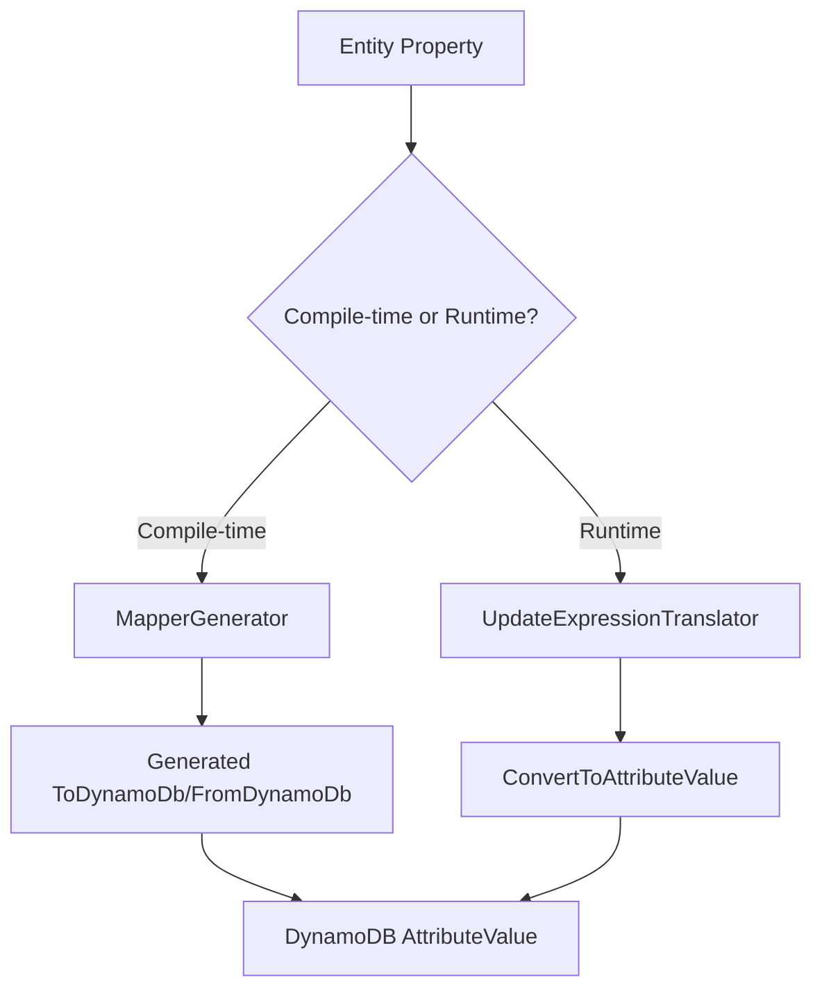

# Design Document: DateOnly and TimeOnly Serialization

## Overview

This design document describes the implementation of native serialization support for `DateOnly` and `TimeOnly` types in Oproto.FluentDynamoDb. These .NET 6+ types are currently not handled by the library, causing them to incorrectly fall through to the enum handling code path (since they're not in the known primitives list), which results in `Enum.Parse` failures at runtime.

The implementation requires changes in two areas:
1. **Source Generator (MapperGenerator)** - Compile-time code generation for entity serialization/deserialization
2. **UpdateExpressionTranslator** - Runtime conversion for update and filter expressions

## Architecture

The serialization system has two distinct code paths:



### MapperGenerator (Compile-time)

The `MapperGenerator` class generates entity mapping code at compile time. It uses two key methods:
- `GetToAttributeValueExpression()` - Generates code to convert C# values to `AttributeValue`
- `GetFromAttributeValueExpression()` - Generates code to convert `AttributeValue` back to C# values

These methods use a switch expression on the base type name to determine the conversion logic.

### UpdateExpressionTranslator (Runtime)

The `UpdateExpressionTranslator` class handles runtime conversion of values in lambda expressions. It uses:
- `ConvertToAttributeValue()` - Converts runtime values to `AttributeValue` using pattern matching

## Components and Interfaces

### Modified Components

#### 1. MapperGenerator.cs

**Location:** `Oproto.FluentDynamoDb.SourceGenerator/Generators/MapperGenerator.cs`

**Changes:**
- Add `DateOnly` and `TimeOnly` to the `knownPrimitives` array in `IsEnumType()` method
- Add cases for `DateOnly` and `TimeOnly` in `GetToAttributeValueExpression()` method
- Add cases for `DateOnly` and `TimeOnly` in `GetFromAttributeValueExpression()` method
- Add cases for `DateOnly` and `TimeOnly` in `GetToAttributeValueExpressionForCollectionElement()` method
- Add cases for `DateOnly` and `TimeOnly` in `GetFromAttributeValueExpressionForCollectionElement()` method
- Add format string support for `DateOnly` and `TimeOnly` in `GenerateFormattedToAttributeValue()` method
- Add format string support for `DateOnly` and `TimeOnly` in `GenerateFormattedFromAttributeValue()` method

#### 2. UpdateExpressionTranslator.cs

**Location:** `Oproto.FluentDynamoDb/Expressions/UpdateExpressionTranslator.cs`

**Changes:**
- Add cases for `DateOnly` and `TimeOnly` in `ConvertToAttributeValue()` method

### Serialization Formats

| Type | Default Format | DynamoDB Type | Example |
|------|---------------|---------------|---------|
| `DateOnly` | `yyyy-MM-dd` (ISO 8601) | String (S) | `"2024-12-28"` |
| `TimeOnly` | `HH:mm:ss.fffffff` (ISO 8601) | String (S) | `"14:30:45.1234567"` |

### Format String Support

Custom format strings can be specified using the `Format` property on `[DynamoDbAttribute]`:

```csharp
[DynamoDbTable("Events")]
public partial class Event
{
    [PartitionKey]
    [DynamoDbAttribute("pk")]
    public string Pk { get; set; } = string.Empty;
    
    // Default format: "2024-12-28"
    [DynamoDbAttribute("eventDate")]
    public DateOnly EventDate { get; set; }
    
    // Custom format: "12/28/2024"
    [DynamoDbAttribute("displayDate", Format = "MM/dd/yyyy")]
    public DateOnly DisplayDate { get; set; }
    
    // Default format: "14:30:45.1234567"
    [DynamoDbAttribute("startTime")]
    public TimeOnly StartTime { get; set; }
    
    // Custom format: "2:30 PM"
    [DynamoDbAttribute("displayTime", Format = "h:mm tt")]
    public TimeOnly DisplayTime { get; set; }
}
```

## Data Models

No new data models are required. The existing `PropertyModel` class already supports the `Format` property for custom format strings.

## Correctness Properties

*A property is a characteristic or behavior that should hold true across all valid executions of a system—essentially, a formal statement about what the system should do. Properties serve as the bridge between human-readable specifications and machine-verifiable correctness guarantees.*

### Property 1: DateOnly Round-Trip Consistency

*For any* valid `DateOnly` value, serializing it to a DynamoDB `AttributeValue` and then deserializing it back SHALL produce an equivalent `DateOnly` value.

**Validates: Requirements 1.1, 1.2, 1.5**

### Property 2: TimeOnly Round-Trip Consistency

*For any* valid `TimeOnly` value, serializing it to a DynamoDB `AttributeValue` and then deserializing it back SHALL produce an equivalent `TimeOnly` value.

**Validates: Requirements 2.1, 2.2, 2.5**

### Property 3: UpdateExpressionTranslator DateOnly Conversion

*For any* valid `DateOnly` value used in an update expression, the `UpdateExpressionTranslator` SHALL convert it to a DynamoDB string `AttributeValue` in ISO 8601 date format (yyyy-MM-dd).

**Validates: Requirements 3.1**

### Property 4: UpdateExpressionTranslator TimeOnly Conversion

*For any* valid `TimeOnly` value used in an update expression, the `UpdateExpressionTranslator` SHALL convert it to a DynamoDB string `AttributeValue` in ISO 8601 time format (HH:mm:ss.fffffff).

**Validates: Requirements 3.2**

### Property 5: Collection Round-Trip Consistency

*For any* valid `List<DateOnly>` or `List<TimeOnly>` collection, serializing it to a DynamoDB list `AttributeValue` and then deserializing it back SHALL produce an equivalent collection with all elements preserved.

**Validates: Requirements 4.1, 4.2, 4.3, 4.4**

## Error Handling

### Invalid Format Strings

If a custom format string is invalid, the generated code will throw a `FormatException` at runtime when attempting to serialize or deserialize the value. This is consistent with the existing behavior for `DateTime` format strings.

### Null Handling

- Non-nullable `DateOnly` and `TimeOnly` properties are always serialized
- Nullable `DateOnly?` and `TimeOnly?` properties with `null` values are either skipped or set to DynamoDB NULL, consistent with existing nullable type handling

### Parse Failures

If a stored string value cannot be parsed back to `DateOnly` or `TimeOnly`, a `FormatException` will be thrown. This is consistent with existing behavior for other types like `DateTime` and `Guid`.

## Testing Strategy

### Unit Tests

Unit tests will verify:
- Correct format string generation for `DateOnly` and `TimeOnly`
- Correct parsing code generation for `DateOnly` and `TimeOnly`
- Null handling for nullable types
- Custom format string support
- Collection element conversion

### Property-Based Tests

Property-based tests will use FsCheck to verify:
- Round-trip consistency for `DateOnly` values
- Round-trip consistency for `TimeOnly` values
- Round-trip consistency for collections
- UpdateExpressionTranslator conversion correctness

**Test Configuration:**
- Minimum 100 iterations per property test
- Use FsCheck arbitrary generators for `DateOnly` and `TimeOnly`
- Tag format: **Feature: date-time-type-serialization, Property {number}: {property_text}**

### Integration Tests

Integration tests will verify end-to-end behavior:
- Put and Get operations with `DateOnly` and `TimeOnly` properties
- Update operations using lambda expressions
- Query operations with filter expressions
