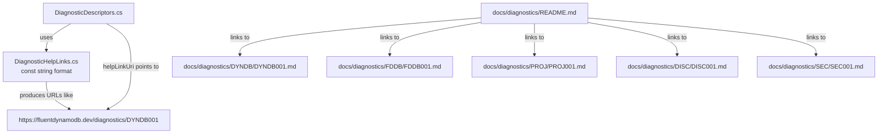

# Design Document: Diagnostics Reference

## Overview

This feature establishes a centralized diagnostics reference for the Oproto.FluentDynamoDb source generator. It creates structured documentation for all ~85 diagnostic codes, wires up clickable `helpLinkUri` values in every `DiagnosticDescriptor` definition, and tracks the changes in both the DOCUMENTATION_CHANGELOG and CHANGELOG.md.

The design addresses three distinct concerns:

1. **Source generator modification** — Adding a centralized URL format constant and applying `helpLinkUri` to all DiagnosticDescriptor constructors
2. **Documentation structure** — Creating `docs/diagnostics/` with per-prefix subdirectories and per-code markdown pages
3. **Changelog entries** — Recording the work in both DOCUMENTATION_CHANGELOG and CHANGELOG.md

## Architecture

The feature is purely additive — no existing behavior changes. The architecture is straightforward:



### Key Design Decisions

1. **Separate file for URL constant** — The URL format constant lives in a new `DiagnosticHelpLinks.cs` file in the `Diagnostics` namespace rather than inside `DiagnosticDescriptors.cs`. This keeps the descriptors file focused on descriptors and provides a clear single location for help link configuration.

2. **String interpolation via `string.Format`** — The constant is a format string (`"https://fluentdynamodb.dev/diagnostics/{0}"`). Each descriptor uses `string.Format(DiagnosticHelpLinks.BaseUrlFormat, "DYNDB001")` to produce its URL. This avoids magic strings repeated 85+ times while remaining explicit at each call site.

3. **Per-prefix subdirectories** — Documentation files are organized as `docs/diagnostics/{PREFIX}/{FULL_CODE}.md` (e.g., `docs/diagnostics/DYNDB/DYNDB001.md`). This groups related diagnostics for browsability without creating overly deep hierarchies.

4. **Markdown template consistency** — Every per-code page follows an identical structure to enable future automated validation and website generation.

## Components and Interfaces

### Component 1: DiagnosticHelpLinks (Source Generator)

**File:** `Oproto.FluentDynamoDb.SourceGenerator/Diagnostics/DiagnosticHelpLinks.cs`

```csharp
namespace Oproto.FluentDynamoDb.SourceGenerator.Diagnostics;

/// <summary>
/// Centralized URL format for diagnostic help links.
/// </summary>
internal static class DiagnosticHelpLinks
{
    /// <summary>
    /// Base URL format for diagnostic documentation pages.
    /// Use with string.Format to produce the full URL for a diagnostic code.
    /// </summary>
    internal const string BaseUrlFormat = "https://fluentdynamodb.dev/diagnostics/{0}";
}
```

**Rationale:** A `const string` enables compile-time string concatenation when used with `string.Format` in a constant context. However, since `DiagnosticDescriptor` requires a runtime string for `helpLinkUri`, we use `string.Format` at the static field initializer level. The constant ensures a single source of truth for the URL pattern.

### Component 2: DiagnosticDescriptor Modifications

**File:** `Oproto.FluentDynamoDb.SourceGenerator/Diagnostics/DiagnosticDescriptors.cs`

Each descriptor gains the `helpLinkUri` parameter (8th positional argument). Example transformation:

**Before:**
```csharp
public static readonly DiagnosticDescriptor MissingPartitionKey = new(
    "DYNDB001",
    "Missing partition key",
    "Entity '{0}' must have exactly one property marked with [PartitionKey]",
    "DynamoDb",
    DiagnosticSeverity.Error,
    isEnabledByDefault: true,
    description: "Every DynamoDB entity must have exactly one partition key property.");
```

**After:**
```csharp
public static readonly DiagnosticDescriptor MissingPartitionKey = new(
    "DYNDB001",
    "Missing partition key",
    "Entity '{0}' must have exactly one property marked with [PartitionKey]",
    "DynamoDb",
    DiagnosticSeverity.Error,
    isEnabledByDefault: true,
    description: "Every DynamoDB entity must have exactly one partition key property.",
    helpLinkUri: string.Format(DiagnosticHelpLinks.BaseUrlFormat, "DYNDB001"));
```

The `helpLinkUri` parameter is the 8th positional parameter of the `DiagnosticDescriptor` constructor. We use the named parameter syntax for clarity.

### Component 3: Documentation Directory Structure

```
docs/diagnostics/
├── README.md                    # Index page with tables grouped by prefix
├── DYNDB/
│   ├── DYNDB001.md
│   ├── DYNDB002.md
│   ├── ... (through DYNDB036)
│   ├── DYNDB101.md
│   ├── ... (through DYNDB115)
│   ├── DYNDB120.md
│   ├── ... (through DYNDB127)
│   ├── DYNDB1001.md
│   └── ... (through DYNDB1004)
├── FDDB/
│   ├── FDDB001.md
│   ├── ... (through FDDB006)
│   ├── FDDB0020.md
│   ├── FDDB0021.md
│   ├── FDDB050.md
│   ├── ... (through FDDB055)
│   ├── FDDB060.md
│   ├── ... (through FDDB062)
│   ├── FDDB070.md
│   ├── FDDB072.md
│   ├── FDDB080.md
│   ├── FDDB081.md
│   ├── FDDB090.md
│   ├── FDDB100.md
│   └── ... (through FDDB103)
├── PROJ/
│   ├── PROJ001.md
│   ├── ... (through PROJ006)
│   ├── PROJ101.md
│   └── PROJ102.md
├── DISC/
│   ├── DISC001.md
│   └── ... (through DISC006)
└── SEC/
    ├── SEC001.md
    └── SEC002.md
```

### Component 4: Per-Code Documentation Template

Each `{FULL_CODE}.md` file follows this template:

```markdown
# {FULL_CODE}: {Title}

## Code & Severity

| Field | Value |
|-------|-------|
| Code | `{FULL_CODE}` |
| Severity | {Error\|Warning\|Info} |

## Message

`{MessageFormat with placeholders}`

## Description

{Description text from DiagnosticDescriptor. Up to 3 paragraphs explaining what
condition causes the diagnostic to be emitted and why the flagged code is
problematic.}

## Example

The following code triggers this diagnostic:

```csharp
// Self-contained C# snippet (max 30 lines) that triggers the diagnostic
```

## Fix

The corrected version:

```csharp
// Self-contained C# snippet (max 30 lines) showing the fix
```
```

### Component 5: README.md Index Page

The index page contains:

1. A header and introduction
2. A total count of documented diagnostics
3. A "Numbering Conventions" section (per Requirement 4)
4. Tables grouped by prefix in alphabetical order (DISC, DYNDB, FDDB, PROJ, SEC)
5. Each table row: Code (linked), Severity, Title

**Example table structure:**

```markdown
## DISC — Discriminator Configuration

| Code | Severity | Title |
|------|----------|-------|
| [DISC001](DISC/DISC001.md) | Warning | Both DiscriminatorValue and DiscriminatorPattern specified |
| [DISC002](DISC/DISC002.md) | Error | DiscriminatorValue or DiscriminatorPattern without DiscriminatorProperty |
...
```

### Component 6: DOCUMENTATION_CHANGELOG Entry

A new entry under a date heading following the established format, categorized as "New Feature Documentation" with Description and Reason blocks.

### Component 7: CHANGELOG.md Entry

A single bullet under `[Unreleased]` > `### Added` following the `- **Bold Title** - Description` format.

## Data Models

No new data models are introduced. The feature modifies an existing static class (`DiagnosticDescriptors`) by adding a parameter to each constructor call, and creates markdown documentation files. The only "model" is the documentation template structure described above.

### Diagnostic Code Inventory

The complete set of diagnostic codes derived from `DiagnosticDescriptors.cs`:

| Prefix | Codes | Count |
|--------|-------|-------|
| DYNDB | 001–036, 101–115, 120–127, 1001–1004 | 57 |
| FDDB | 001–006, 0020–0021, 050–055, 060–062, 070, 072, 080–081, 090, 100–103 | 26 |
| PROJ | 001–006, 101–102 | 8 |
| DISC | 001–006 | 6 |
| SEC | 001–002 | 2 |
| **Total** | | **99** |

## Correctness Properties

*A property is a characteristic or behavior that should hold true across all valid executions of a system — essentially, a formal statement about what the system should do. Properties serve as the bridge between human-readable specifications and machine-verifiable correctness guarantees.*

### Property 1: helpLinkUri matches URL format for all descriptors

*For any* DiagnosticDescriptor field defined in DiagnosticDescriptors.cs, the `helpLinkUri` value SHALL equal `string.Format("https://fluentdynamodb.dev/diagnostics/{0}", descriptor.Id)` — that is, the help link URL is the base URL pattern with the descriptor's own diagnostic code substituted.

**Validates: Requirements 3.2, 3.3, 3.4, 3.5**

### Property 2: Documentation file exists for every descriptor

*For any* DiagnosticDescriptor field defined in DiagnosticDescriptors.cs, a corresponding markdown file SHALL exist at the path `docs/diagnostics/{PREFIX}/{FULL_CODE}.md` where PREFIX is the alphabetical prefix of the code and FULL_CODE is the complete diagnostic identifier.

**Validates: Requirements 1.3, 7.1**

### Property 3: Documentation files contain all required sections

*For any* markdown file in `docs/diagnostics/{PREFIX}/`, the file SHALL contain all required sections: a heading with the code, a "Code & Severity" section, a "Message" section, a "Description" section, an "Example" section with a code block of at most 30 lines, and a "Fix" section with a code block of at most 30 lines.

**Validates: Requirements 1.5, 2.1, 2.2, 2.3, 2.4, 2.5, 2.7**

### Property 4: README index row exists for every descriptor

*For any* DiagnosticDescriptor field defined in DiagnosticDescriptors.cs, the `docs/diagnostics/README.md` SHALL contain a table row with the full code (as a relative markdown link to the detail page), the severity level, and the diagnostic title.

**Validates: Requirements 1.4, 7.2**

## Error Handling

This feature does not introduce runtime error paths. The changes are:

1. **Compile-time constant** — `DiagnosticHelpLinks.BaseUrlFormat` is a `const string`. If it's malformed, compilation fails immediately.
2. **Static field initializers** — Each `DiagnosticDescriptor` is initialized with `string.Format(...)`. If the format string is invalid, the static initializer throws `FormatException` at assembly load time, surfacing the error immediately during testing.
3. **Documentation files** — These are static assets. Errors in content (wrong format, missing sections) are caught by validation tests, not at runtime.

### Failure Modes

| Scenario | Consequence | Mitigation |
|----------|-------------|------------|
| BaseUrlFormat has wrong placeholder count | `FormatException` at static init | Unit test verifying format works with any single string argument |
| A descriptor omits helpLinkUri | IDE shows no help link for that code | Integration test checking all descriptors have non-null HelpLinkUri |
| Documentation file missing required section | Incomplete docs page on website | Validation test parsing all markdown files for required headings |
| README count doesn't match file count | User confusion about completeness | Validation test comparing stated count to actual file count |

## Testing Strategy

### Unit Tests

Unit tests verify the source generator's help link wiring using reflection:

1. **All descriptors have helpLinkUri** — Reflect over all `DiagnosticDescriptor` fields in `DiagnosticDescriptors` and assert each has a non-null, non-empty `HelpLinkUri`.
2. **helpLinkUri format is correct** — For each descriptor, assert `HelpLinkUri == string.Format(DiagnosticHelpLinks.BaseUrlFormat, descriptor.Id)`.
3. **BaseUrlFormat produces valid URLs** — Assert the format string contains exactly one `{0}` placeholder and starts with `https://fluentdynamodb.dev/diagnostics/`.

### Property-Based Tests

Property-based tests validate the URL format invariant across generated inputs:

- **Library:** [FsCheck](https://fscheck.github.io/FsCheck/) (via FsCheck.Xunit) — the standard PBT library for .NET/xUnit projects
- **Configuration:** Minimum 100 iterations per property
- **Tag format:** `Feature: diagnostics-reference, Property {number}: {property_text}`

**Property Test 1:** For any valid diagnostic code string (matching pattern `[A-Z]{2,5}[0-9]{1,4}`), formatting with `DiagnosticHelpLinks.BaseUrlFormat` produces a URL matching `https://fluentdynamodb.dev/diagnostics/{CODE}`.

**Property Test 2:** For any DiagnosticDescriptor field selected from the complete set, `HelpLinkUri` equals the formatted base URL with that descriptor's `Id`.

### Integration / Validation Tests

These tests validate the documentation structure and content:

1. **Coverage completeness** — Parse `DiagnosticDescriptors.cs` for all diagnostic IDs, verify each has a corresponding `.md` file.
2. **README structure** — Verify the README has all prefixes in alphabetical order, codes in ascending order per prefix, and a valid total count.
3. **Documentation file structure** — For each `.md` file, verify it contains all required sections (Code & Severity, Message, Description, Example, Fix).
4. **Message consistency** — For each documentation file, verify the Message section matches the DiagnosticDescriptor's `messageFormat` string.
5. **Code snippet line counts** — Verify Example and Fix sections have code blocks of at most 30 lines each.
6. **CHANGELOG entries** — Verify CHANGELOG.md has the entry under `[Unreleased]` > `### Added` and DOCUMENTATION_CHANGELOG has the appropriately formatted entry.

