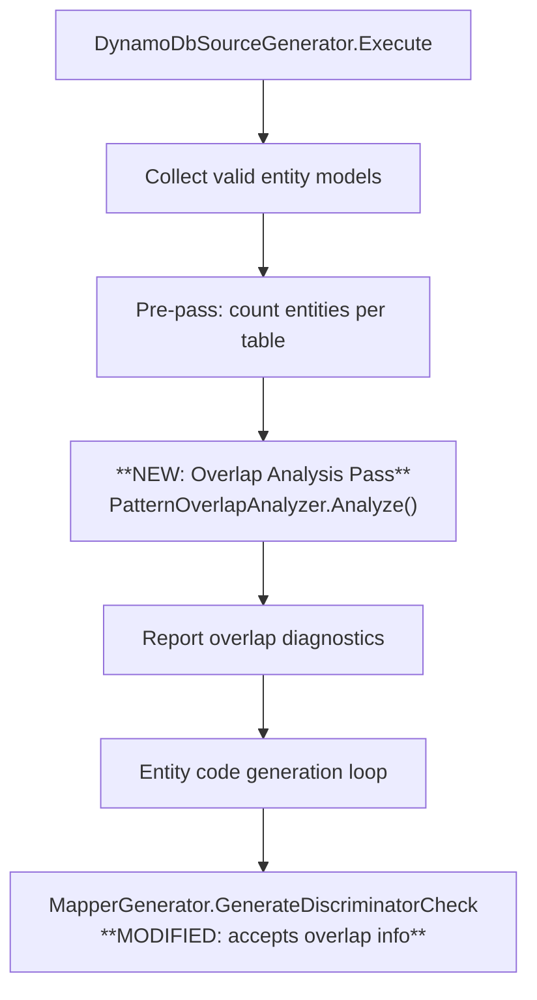

# Design Document: Discriminator Enhancement — Most-Specific Pattern Matching

## Overview

This feature enhances the existing discriminator system in the Oproto.FluentDynamoDb source generator to support most-specific pattern matching when multiple entities share a DynamoDB table and have overlapping wildcard discriminator patterns. The enhancement is entirely compile-time: the source generator analyzes all entity patterns within a table group, computes specificity scores, detects overlaps, and generates exclusion guards in the `MatchesEntity` method so that each DynamoDB item is claimed by exactly one entity type.

The primary use case is hierarchical sort key designs where parent and child entities share a common key prefix (e.g., `INVOICE#*` vs `INVOICE#*#LINE#*`). Today, both entities' `MatchesEntity` methods would return true for a child item. After this enhancement, the parent's method will exclude items that match the more-specific child pattern.

No runtime library changes are required. All logic is resolved at compile time via pattern analysis and code generation.

## Architecture

The feature integrates into the existing source generator pipeline at three points:



### Key Architectural Decisions

1. **Overlap analysis runs in `DynamoDbSourceGenerator.Execute`** after `GroupEntitiesByTableName` sets `TableEntityCount` but before the per-entity generation loop. This gives us a complete view of all entities per table.

2. **Overlap information is stored on `DiscriminatorConfig`** as a list of more-specific patterns to exclude. This avoids changing the `EntityModel` shape significantly and keeps the data close to where it's consumed in `GenerateDiscriminatorCheck`.

3. **Specificity is a simple segment count** — split the pattern on `*`, count non-empty segments. No regex. No weighting. This is deterministic and easy to reason about.

4. **ExactMatch always wins** — assigned `int.MaxValue` specificity so it beats any wildcard pattern regardless of segment count.

5. **Overlap detection uses structural analysis** — two patterns overlap if one pattern's literal prefix/suffix is compatible with the other's structure. This avoids runtime string matching at compile time.

## Components and Interfaces

### New: `PatternOverlapAnalyzer` (Analysis/)

Static class responsible for analyzing overlap relationships between discriminator patterns within a table group.

```csharp
internal static class PatternOverlapAnalyzer
{
    /// <summary>
    /// Analyzes all entities in a table group for discriminator pattern overlaps.
    /// Populates DiscriminatorConfig.OverlappingPatterns for entities that need exclusion guards.
    /// Reports diagnostics for ambiguous overlaps (same score) and resolved overlaps (info).
    /// </summary>
    public static List<Diagnostic> Analyze(List<EntityModel> tableEntities);

    /// <summary>
    /// Computes the specificity score for a discriminator configuration.
    /// ExactMatch returns int.MaxValue; wildcard patterns return count of non-empty literal segments.
    /// </summary>
    public static int ComputeSpecificityScore(DiscriminatorConfig config);

    /// <summary>
    /// Determines whether two discriminator patterns on the same property could match the same value.
    /// </summary>
    public static bool PatternsOverlap(DiscriminatorConfig a, DiscriminatorConfig b);
}
```

### Modified: `DiscriminatorConfig` (Models/)

Add a property to hold the list of more-specific patterns that this entity must exclude:

```csharp
internal class DiscriminatorConfig
{
    // ... existing properties ...

    /// <summary>
    /// Gets or sets the list of more-specific overlapping patterns that this entity's
    /// MatchesEntity method must exclude. Each entry contains the pattern string and
    /// the strategy to use for the exclusion check.
    /// Populated by PatternOverlapAnalyzer during the overlap analysis pass.
    /// </summary>
    public List<ExclusionPattern> OverlappingPatterns { get; set; } = new();
}
```

### New: `ExclusionPattern` (Models/)

Lightweight model representing a single exclusion guard to generate:

```csharp
internal class ExclusionPattern
{
    /// <summary>
    /// The entity class name that owns the more-specific pattern (for comments in generated code).
    /// </summary>
    public string EntityName { get; set; } = string.Empty;

    /// <summary>
    /// The original pattern string of the more-specific entity.
    /// </summary>
    public string Pattern { get; set; } = string.Empty;

    /// <summary>
    /// The matching strategy for the exclusion check (StartsWith, EndsWith, Contains, ExactMatch).
    /// </summary>
    public DiscriminatorStrategy Strategy { get; set; }

    /// <summary>
    /// The literal text to use in the exclusion check (extracted from the pattern).
    /// </summary>
    public string LiteralText { get; set; } = string.Empty;
}
```

### Modified: `MapperGenerator.GenerateDiscriminatorCheck`

The existing method is extended to emit exclusion guards when `DiscriminatorConfig.OverlappingPatterns` is non-empty. The generated code structure becomes:

```
1. Key presence checks (unchanged)
2. Discriminator value extraction (unchanged)
3. Positive match check for this entity's pattern
4. **NEW: For each exclusion pattern, emit early-return-false if value also matches**
5. Return true
```

### New Diagnostic Descriptors

| ID | Severity | Condition |
|----|----------|-----------|
| `DISC004` | Error | Two overlapping patterns have the same specificity score (ambiguous) |
| `DISC005` | Info | Overlapping patterns resolved by specificity ordering |

## Data Models

### Specificity Scoring Algorithm

```
Score(config):
  if config.Strategy == ExactMatch:
    return int.MaxValue
  segments = config.Pattern.Split('*')
  return segments.Count(s => s.Length > 0)
```

Examples:
| Pattern | Segments after split | Non-empty | Score |
|---------|---------------------|-----------|-------|
| `"INVOICE#*"` | `["INVOICE#", ""]` | `["INVOICE#"]` | 1 |
| `"INVOICE#*#LINE#*"` | `["INVOICE#", "#LINE#", ""]` | `["INVOICE#", "#LINE#"]` | 2 |
| `"*#AUDIT"` | `["", "#AUDIT"]` | `["#AUDIT"]` | 1 |
| `"*#LINE#*"` | `["", "#LINE#", ""]` | `["#LINE#"]` | 1 |
| `"A#*#B#*#C#*"` | `["A#", "#B#", "#C#", ""]` | `["A#", "#B#", "#C#"]` | 3 |
| `"USER"` (exact) | N/A | N/A | int.MaxValue |

### Overlap Detection Logic

Two patterns overlap if a single string value could satisfy both. The detection uses structural rules:

1. **Same strategy, compatible literals**: e.g., `"INVOICE#*"` (StartsWith "INVOICE#") overlaps `"INVOICE#*#LINE#*"` (Contains "#LINE#" + StartsWith "INVOICE#") because any string starting with "INVOICE#" and containing "#LINE#" matches both.

2. **ExactMatch vs pattern**: An ExactMatch value `"INVOICE#123"` overlaps a StartsWith pattern `"INVOICE#*"` if the exact value matches the pattern.

3. **Different properties**: Never overlap, regardless of pattern content.

4. **Conservative approach**: When structural analysis is ambiguous, assume overlap. False positives (unnecessary exclusion guards) are harmless — they just add a redundant check. False negatives (missed overlaps) cause incorrect behavior.

### Generated Code Example

For entities `Invoice` (pattern `"INVOICE#*"`, score 1) and `InvoiceLine` (pattern `"INVOICE#*#LINE#*"`, score 2):

**InvoiceLine.MatchesEntity** (most specific — unchanged):
```csharp
public static bool MatchesEntity(Dictionary<string, AttributeValue> item)
{
    if (!item.ContainsKey("pk")) return false;
    if (!item.ContainsKey("sk")) return false;

    if (!item.TryGetValue("sk", out var discriminatorValue) || discriminatorValue.S == null)
        return false;

    return discriminatorValue.S.StartsWith("INVOICE#") && discriminatorValue.S.Contains("#LINE#");
}
```

**Invoice.MatchesEntity** (less specific — with exclusion guard):
```csharp
public static bool MatchesEntity(Dictionary<string, AttributeValue> item)
{
    if (!item.ContainsKey("pk")) return false;
    if (!item.ContainsKey("sk")) return false;

    if (!item.TryGetValue("sk", out var discriminatorValue) || discriminatorValue.S == null)
        return false;

    // Positive match: this entity's pattern
    if (!discriminatorValue.S.StartsWith("INVOICE#"))
        return false;

    // Exclusion: more-specific pattern from InvoiceLine (score: 2)
    if (discriminatorValue.S.Contains("#LINE#"))
        return false;

    return true;
}
```

### Execution Flow in DynamoDbSourceGenerator.Execute

```csharp
// After GroupEntitiesByTableName and before entity generation loop:
foreach (var tableGroup in entitiesByTable)
{
    var tableEntities = tableGroup.Value;
    
    // NEW: Analyze discriminator pattern overlaps within this table group
    var overlapDiagnostics = PatternOverlapAnalyzer.Analyze(tableEntities);
    foreach (var diagnostic in overlapDiagnostics)
    {
        context.ReportDiagnostic(diagnostic);
    }
}
```

## Correctness Properties

*A property is a characteristic or behavior that should hold true across all valid executions of a system — essentially, a formal statement about what the system should do. Properties serve as the bridge between human-readable specifications and machine-verifiable correctness guarantees.*

### Property 1: Specificity score equals non-empty literal segment count

*For any* valid discriminator pattern string containing wildcard characters, the computed specificity score SHALL equal the number of non-empty strings produced by splitting the pattern on the `*` character.

**Validates: Requirements 1.3, 2.2**

### Property 2: ExactMatch always scores higher than any wildcard pattern

*For any* discriminator pattern containing at least one wildcard character, the specificity score of an ExactMatch discriminator SHALL be strictly greater than the wildcard pattern's specificity score.

**Validates: Requirements 2.4**

### Property 3: Overlap detection is symmetric and property-scoped

*For any* two discriminator configurations A and B, `PatternsOverlap(A, B)` SHALL return true if and only if `PatternsOverlap(B, A)` returns true, AND shall return false when A and B have different DiscriminatorProperty values regardless of pattern content.

**Validates: Requirements 1.6, 2.1**

### Property 4: Mutual exclusivity of MatchesEntity across overlapping entities

*For any* table entity group with overlapping discriminator patterns and any discriminator string value that matches at least one entity's pattern, exactly one entity's generated MatchesEntity logic (positive match minus exclusions) SHALL claim that value.

**Validates: Requirements 1.1, 1.4**

### Property 5: Exclusion list contains all and only higher-scoring overlapping patterns

*For any* entity in a table group with overlapping patterns, its `OverlappingPatterns` list SHALL contain exactly those entities whose specificity score is strictly higher than its own AND whose pattern overlaps with its pattern on the same DiscriminatorProperty.

**Validates: Requirements 1.7, 3.4**

### Property 6: Exclusion guard uses the correct string operation

*For any* exclusion pattern entry, the generated string operation (StartsWith, EndsWith, Contains, or equality) SHALL match the `Strategy` of the more-specific entity's discriminator configuration.

**Validates: Requirements 3.1, 3.2**

### Property 7: Non-overlapping entities produce no exclusion logic or overlap diagnostics

*For any* table entity group where no two entities have overlapping discriminator patterns, the generated MatchesEntity code SHALL contain no exclusion guards AND no overlap-related diagnostics (DISC004, DISC005) SHALL be emitted.

**Validates: Requirements 1.5, 4.1, 4.3, 4.4**

### Property 8: Ambiguous same-score overlaps produce an error diagnostic

*For any* pair of entities in the same table group with overlapping patterns on the same DiscriminatorProperty AND the same specificity score, the analyzer SHALL emit a diagnostic with severity Error containing both entity names.

**Validates: Requirements 2.3**

### Property 9: Resolved overlaps produce an informational diagnostic

*For any* pair of entities in the same table group with overlapping patterns on the same DiscriminatorProperty AND different specificity scores, the analyzer SHALL emit a diagnostic with severity Info containing the less-specific entity name, the more-specific entity name, and the excluded pattern.

**Validates: Requirements 2.5**

## Error Handling

| Scenario | Behavior |
|----------|----------|
| Two overlapping patterns with same specificity score | Emit `DISC004` error diagnostic. Do NOT generate exclusion logic — the ambiguity must be resolved by the developer. |
| Pattern with `Strategy = Complex` (multi-wildcard, non-standard position) | Conservatively assume overlap with any other pattern on the same property. Score using standard segment-count algorithm. |
| Entity with `Discriminator = null` or `IsValid = false` | Skip entirely during overlap analysis (these entities use Tier 2/3 key-only checks). |
| Single-entity table | Skip overlap analysis (nothing to compare against). |
| ExactMatch vs ExactMatch overlap | Impossible — two exact values either match (same string = same entity, which is a different error) or don't overlap. |
| Overlap analysis produces empty exclusion list | No exclusion code generated — existing behavior preserved. |

## Testing Strategy

### Property-Based Tests (using FsCheck or equivalent)

The feature is well-suited for property-based testing because:
- The specificity scoring function is pure (input pattern → output score)
- Overlap detection is a pure predicate (two configs → bool)
- The exclusion list construction is deterministic given a set of entities
- Mutual exclusivity can be verified by generating random discriminator values and checking exactly one entity claims each

**Configuration**: Minimum 100 iterations per property test.

**PBT Library**: FsCheck (standard .NET property-based testing library, integrates with xUnit).

**Tag format**: `Feature: discriminator-enhancement, Property {N}: {property text}`

### Unit Tests (example-based)

- Specific pattern pairs from the requirements (e.g., `INVOICE#*` vs `INVOICE#*#LINE#*`)
- Three-entity hierarchies (e.g., `INVOICE#*`, `INVOICE#*#LINE#*`, `INVOICE#*#LINE#*#ADJUSTMENT#*`)
- ExactMatch vs wildcard precedence
- Generated code structure verification (exclusion placement between positive match and return)
- Diagnostic message content verification
- Backward compatibility regression: entities with non-overlapping patterns produce byte-identical generated code

### Integration Tests

- End-to-end source generator test: define entities with overlapping patterns, run the generator, compile the output, and execute `MatchesEntity` with test data
- Verify no new warnings/errors for existing test entities that have non-overlapping patterns
