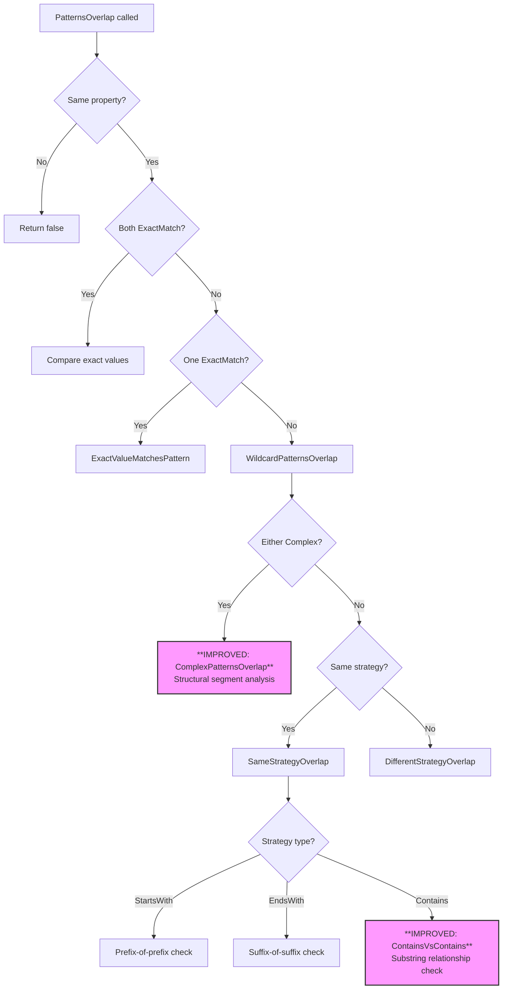
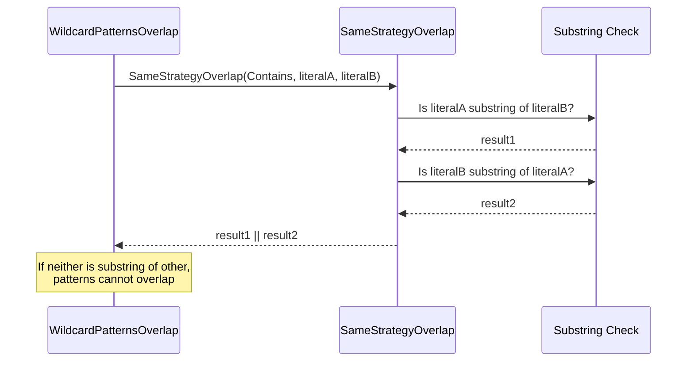
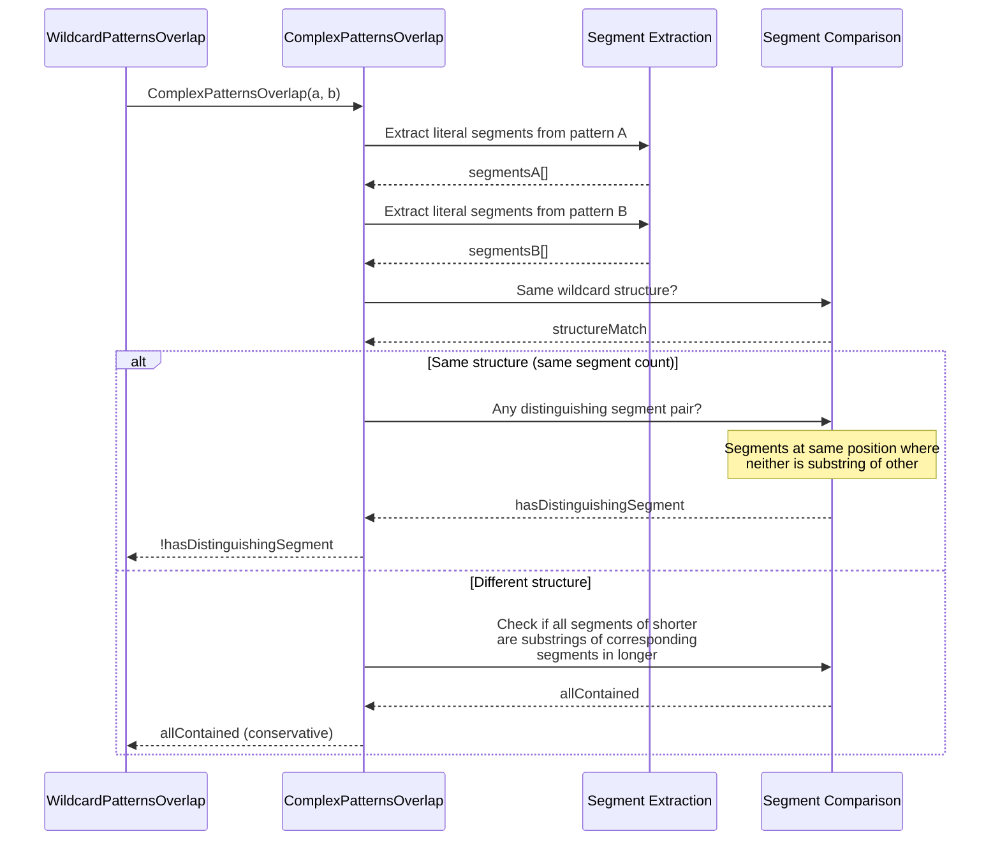

# Design Document: Discriminator Pattern Overlap Analysis Improvement

## Overview

The current `PatternOverlapAnalyzer` in the Oproto.FluentDynamoDb source generator uses overly conservative overlap detection for `Contains` and `Complex` strategy patterns. It assumes all Contains patterns overlap with each other and all Complex patterns overlap with everything, which causes false-positive DISC004 errors for one of the most common multi-entity table patterns: sibling entities sharing a partition key with different type markers in the sort key.

This design improves the overlap detection algorithms for Contains-vs-Contains and Complex pattern comparisons by performing structural analysis of the literal segments within patterns. The fix is entirely within `PatternOverlapAnalyzer.cs` — no model changes, no code generation changes, and no runtime library changes are needed.

The primary use case is sibling entities with sort key patterns like `*#DEDUCTION#*`, `*#GARNISHMENT#*`, `*#PAYRATE#*` (Contains strategy) or `EMPLOYEE#*#DEDUCTION#*`, `EMPLOYEE#*#GARNISHMENT#*` (Complex strategy), which are clearly non-overlapping but currently trigger DISC004.

## Architecture

The change is localized to two methods in `PatternOverlapAnalyzer`:



### Sequence: Contains vs Contains Analysis



### Sequence: Complex Pattern Analysis



## Components and Interfaces

### Component: `PatternOverlapAnalyzer` (modified)

**Purpose**: Analyzes overlap relationships between discriminator patterns within a table group.

**Interface** (public API unchanged):

```csharp
internal static class PatternOverlapAnalyzer
{
    // Existing public methods — signatures unchanged
    public static int ComputeSpecificityScore(DiscriminatorConfig config);
    public static bool PatternsOverlap(DiscriminatorConfig a, DiscriminatorConfig b);
    public static List<Diagnostic> Analyze(List<EntityModel> tableEntities);
}
```

**Modified private methods**:

```csharp
// MODIFIED: Now performs substring analysis instead of returning true
private static bool SameStrategyOverlap(DiscriminatorStrategy strategy, string literalA, string literalB);

// MODIFIED: No longer short-circuits to true for Complex patterns
private static bool WildcardPatternsOverlap(DiscriminatorConfig a, DiscriminatorConfig b);

// NEW: Handles Complex-vs-Complex and Complex-vs-Simple comparisons
private static bool ComplexPatternsOverlap(DiscriminatorConfig a, DiscriminatorConfig b);

// NEW: Extracts non-empty literal segments from a pattern
private static string[] GetLiteralSegments(string pattern);
```

**Responsibilities**:
- Determine if two Contains patterns can match the same string value
- Determine if two Complex patterns (or Complex vs simple) can match the same string value
- Maintain symmetry: `PatternsOverlap(a, b) == PatternsOverlap(b, a)`
- Remain conservative for genuinely ambiguous cases (prefer false positives over false negatives)

## Data Models

No new data models are introduced. The existing `DiscriminatorConfig`, `ExclusionPattern`, and `DiscriminatorStrategy` models remain unchanged.

### Existing Model Reference

```csharp
internal class DiscriminatorConfig
{
    public string PropertyName { get; set; }
    public string? ExactValue { get; set; }
    public string? Pattern { get; set; }
    public DiscriminatorStrategy Strategy { get; set; }
    public bool IsValid { get; }
    public List<ExclusionPattern> OverlappingPatterns { get; set; }
}

internal enum DiscriminatorStrategy
{
    None, ExactMatch, StartsWith, EndsWith, Contains, Complex
}
```

## Algorithmic Pseudocode

### Algorithm 1: Improved Contains-vs-Contains Overlap

```csharp
/// <summary>
/// Two Contains patterns *X* and *Y* overlap if and only if one literal
/// is a substring of the other. If neither literal is a substring of the
/// other, no single string can satisfy both Contains constraints simultaneously
/// in the discriminator context (since DynamoDB key patterns use structured
/// delimiters like '#' that prevent accidental substring matches).
/// </summary>
private static bool ContainsVsContainsOverlap(string literalA, string literalB)
{
    // If either literal contains the other as a substring, a string could
    // exist that satisfies both patterns.
    // Example: "*ORDER*" and "*ORD*" overlap because "ORD" ⊂ "ORDER"
    //          "*#DEDUCTION#*" and "*#GARNISHMENT#*" do NOT overlap
    return literalA.IndexOf(literalB, StringComparison.Ordinal) >= 0 ||
           literalB.IndexOf(literalA, StringComparison.Ordinal) >= 0;
}
```

**Preconditions:**
- `literalA` is the text extracted from pattern A (between the `*` wildcards), non-null, non-empty
- `literalB` is the text extracted from pattern B (between the `*` wildcards), non-null, non-empty
- Both patterns use the Contains strategy

**Postconditions:**
- Returns `true` if a string could exist matching both `*literalA*` and `*literalB*`
- Returns `false` if no such string can exist (neither is a substring of the other)
- Result is symmetric: `f(a, b) == f(b, a)`

**Loop Invariants:** N/A (no loops)

### Algorithm 2: Complex Pattern Overlap Detection

```csharp
/// <summary>
/// Determines if two patterns overlap when at least one is Complex (multi-wildcard).
/// 
/// Strategy:
/// 1. Extract literal segments from both patterns (split on '*', filter empty)
/// 2. If patterns have the same structure (same number of segments with wildcards
///    in same positions), check if there exists at least one position where the
///    segments are structurally distinguishing (neither is a substring of the other).
/// 3. If patterns have different structures, use a conservative approach:
///    check if the shorter pattern's segments can all be found as substrings
///    of the longer pattern's full text.
/// </summary>
private static bool ComplexPatternsOverlap(DiscriminatorConfig a, DiscriminatorConfig b)
{
    var segmentsA = GetLiteralSegments(a.Pattern!);
    var segmentsB = GetLiteralSegments(b.Pattern!);

    // Same segment count AND same wildcard boundary structure
    if (segmentsA.Length == segmentsB.Length && HasSameWildcardStructure(a.Pattern!, b.Pattern!))
    {
        // Patterns have identical structure (wildcards in same positions).
        // They are non-overlapping if ANY corresponding segment pair is distinguishing.
        for (int i = 0; i < segmentsA.Length; i++)
        {
            if (!SegmentsCanMatch(segmentsA[i], segmentsB[i]))
            {
                return false; // Found a distinguishing segment — cannot overlap
            }
        }
        return true; // All segments are compatible — could overlap
    }

    // Different structures — conservative approach
    // The pattern with fewer segments is potentially less specific.
    // Check if ALL segments of the shorter pattern appear as substrings
    // in the full pattern text of the longer one.
    var shorterSegments = segmentsA.Length <= segmentsB.Length ? segmentsA : segmentsB;
    var longerPattern = segmentsA.Length <= segmentsB.Length ? b.Pattern! : a.Pattern!;

    foreach (var segment in shorterSegments)
    {
        if (longerPattern.IndexOf(segment, StringComparison.Ordinal) < 0)
        {
            return false; // A required segment isn't present — cannot overlap
        }
    }

    return true; // All shorter segments found in longer pattern — conservatively overlap
}
```

**Preconditions:**
- At least one of `a` or `b` has `Strategy == DiscriminatorStrategy.Complex`
- Both `a.Pattern` and `b.Pattern` are non-null and non-empty
- Both configs share the same `PropertyName`

**Postconditions:**
- Returns `true` if the patterns could potentially match the same string
- Returns `false` if structural analysis proves they cannot match the same string
- Result is symmetric: `f(a, b) == f(b, a)`
- Conservatively returns `true` when analysis is inconclusive

### Algorithm 3: Helper — Get Literal Segments

```csharp
/// <summary>
/// Extracts non-empty literal segments from a pattern by splitting on '*'.
/// Example: "EMPLOYEE#*#DEDUCTION#*" → ["EMPLOYEE#", "#DEDUCTION#"]
/// Example: "*#DEDUCTION#*" → ["#DEDUCTION#"]
/// </summary>
private static string[] GetLiteralSegments(string pattern)
{
    return pattern.Split('*')
        .Where(s => s.Length > 0)
        .ToArray();
}
```

**Preconditions:**
- `pattern` is non-null and non-empty

**Postconditions:**
- Returns array of non-empty string segments
- Array preserves order of segments as they appear in the pattern
- No element contains the `*` character

### Algorithm 4: Helper — Same Wildcard Structure Check

```csharp
/// <summary>
/// Determines if two patterns have wildcards in the same boundary positions.
/// "EMPLOYEE#*#DEDUCTION#*" and "EMPLOYEE#*#GARNISHMENT#*" have the same structure:
///   both start with a literal, have a wildcard, then another literal, then end with wildcard.
/// "EMPLOYEE#*#DEDUCTION#*" and "*#DEDUCTION#*" do NOT have the same structure:
///   one starts with literal, the other starts with wildcard.
/// </summary>
private static bool HasSameWildcardStructure(string patternA, string patternB)
{
    bool aStartsWithWildcard = patternA.StartsWith("*");
    bool bStartsWithWildcard = patternB.StartsWith("*");
    bool aEndsWithWildcard = patternA.EndsWith("*");
    bool bEndsWithWildcard = patternB.EndsWith("*");

    return aStartsWithWildcard == bStartsWithWildcard &&
           aEndsWithWildcard == bEndsWithWildcard;
}
```

**Preconditions:**
- Both patterns are non-null and non-empty
- Patterns have the same number of literal segments

**Postconditions:**
- Returns `true` if wildcards appear at the same boundary positions
- Returns `false` if patterns differ in leading/trailing wildcard placement

### Algorithm 5: Helper — Segments Can Match

```csharp
/// <summary>
/// Determines if two literal segments at the same structural position could appear
/// at the same location in a matching string. Two segments "can match" if one is
/// a substring of the other (a more general segment subsumes a more specific one).
/// 
/// Example: "EMPLOYEE#" and "EMPLOYEE#" → true (identical)
/// Example: "#DEDUCTION#" and "#GARNISHMENT#" → false (neither is substring of other)
/// Example: "#LINE#" and "#LINE#ITEM#" → true ("#LINE#" ⊂ "#LINE#ITEM#")
/// </summary>
private static bool SegmentsCanMatch(string segmentA, string segmentB)
{
    return segmentA.IndexOf(segmentB, StringComparison.Ordinal) >= 0 ||
           segmentB.IndexOf(segmentA, StringComparison.Ordinal) >= 0;
}
```

**Preconditions:**
- Both segments are non-null and non-empty
- Segments are at corresponding positions in patterns with the same wildcard structure

**Postconditions:**
- Returns `true` if the segments are structurally compatible (could match same substring)
- Returns `false` if segments are distinguishing (cannot match same substring)
- Result is symmetric: `f(a, b) == f(b, a)`

## Key Functions with Formal Specifications

### Function: `SameStrategyOverlap` (modified)

```csharp
private static bool SameStrategyOverlap(DiscriminatorStrategy strategy, string literalA, string literalB)
```

**Preconditions:**
- `strategy` is one of `StartsWith`, `EndsWith`, or `Contains`
- `literalA` and `literalB` are non-null, non-empty literal segments extracted from patterns
- Both patterns use the same strategy

**Postconditions:**
- For `StartsWith`: returns `true` iff one literal is a prefix of the other
- For `EndsWith`: returns `true` iff one literal is a suffix of the other
- For `Contains`: returns `true` iff one literal is a substring of the other
- Result is symmetric in all cases

### Function: `WildcardPatternsOverlap` (modified)

```csharp
private static bool WildcardPatternsOverlap(DiscriminatorConfig a, DiscriminatorConfig b)
```

**Preconditions:**
- Neither `a` nor `b` is `ExactMatch` strategy
- Both have non-null, non-empty patterns
- Both share the same `PropertyName`

**Postconditions:**
- Routes to `ComplexPatternsOverlap` if either pattern is Complex
- Routes to `SameStrategyOverlap` if both share same strategy
- Routes to `DifferentStrategyOverlap` for cross-strategy (non-Complex) comparisons
- Result is symmetric: `f(a, b) == f(b, a)`

### Function: `ComplexPatternsOverlap` (new)

```csharp
private static bool ComplexPatternsOverlap(DiscriminatorConfig a, DiscriminatorConfig b)
```

**Preconditions:**
- At least one of `a`, `b` has `Strategy == Complex`
- Both have non-null, non-empty patterns

**Postconditions:**
- Returns `false` if structural analysis proves patterns cannot match the same string
- Returns `true` conservatively when overlap is possible or indeterminate
- Handles Complex-vs-Complex and Complex-vs-Simple (StartsWith/EndsWith/Contains)

## Example Usage

```csharp
// Example 1: Contains patterns that should NOT overlap
var deduction = new DiscriminatorConfig
{
    PropertyName = "sk",
    Pattern = "*#DEDUCTION#*",
    Strategy = DiscriminatorStrategy.Contains
};
var garnishment = new DiscriminatorConfig
{
    PropertyName = "sk",
    Pattern = "*#GARNISHMENT#*",
    Strategy = DiscriminatorStrategy.Contains
};
PatternOverlapAnalyzer.PatternsOverlap(deduction, garnishment); // false

// Example 2: Contains patterns that SHOULD overlap (substring relationship)
var order = new DiscriminatorConfig
{
    PropertyName = "sk",
    Pattern = "*ORDER*",
    Strategy = DiscriminatorStrategy.Contains
};
var ord = new DiscriminatorConfig
{
    PropertyName = "sk",
    Pattern = "*ORD*",
    Strategy = DiscriminatorStrategy.Contains
};
PatternOverlapAnalyzer.PatternsOverlap(order, ord); // true ("ORD" ⊂ "ORDER")

// Example 3: Complex patterns that should NOT overlap (same structure, distinguishing segment)
var complexDeduction = new DiscriminatorConfig
{
    PropertyName = "sk",
    Pattern = "EMPLOYEE#*#DEDUCTION#*",
    Strategy = DiscriminatorStrategy.Complex
};
var complexGarnishment = new DiscriminatorConfig
{
    PropertyName = "sk",
    Pattern = "EMPLOYEE#*#GARNISHMENT#*",
    Strategy = DiscriminatorStrategy.Complex
};
PatternOverlapAnalyzer.PatternsOverlap(complexDeduction, complexGarnishment); // false

// Example 4: Complex patterns that SHOULD overlap (different structure, subsumption)
var invoiceLine = new DiscriminatorConfig
{
    PropertyName = "sk",
    Pattern = "INVOICE#*#LINE#*",
    Strategy = DiscriminatorStrategy.Complex
};
var invoiceAny = new DiscriminatorConfig
{
    PropertyName = "sk",
    Pattern = "INVOICE#*",
    Strategy = DiscriminatorStrategy.StartsWith
};
PatternOverlapAnalyzer.PatternsOverlap(invoiceLine, invoiceAny); // true

// Example 5: Complex vs Contains — non-overlapping
var complexPayrate = new DiscriminatorConfig
{
    PropertyName = "sk",
    Pattern = "EMPLOYEE#*#PAYRATE#*",
    Strategy = DiscriminatorStrategy.Complex
};
var containsDeduction = new DiscriminatorConfig
{
    PropertyName = "sk",
    Pattern = "*#DEDUCTION#*",
    Strategy = DiscriminatorStrategy.Contains
};
PatternOverlapAnalyzer.PatternsOverlap(complexPayrate, containsDeduction); // false
```

## Correctness Properties

*A property is a characteristic or behavior that should hold true across all valid executions of a system — essentially, a formal statement about what the system should do. Properties serve as the bridge between human-readable specifications and machine-verifiable correctness guarantees.*

### Property 1: Overlap detection remains symmetric

*For any* two valid `DiscriminatorConfig` instances A and B (sharing the same `PropertyName`), `PatternsOverlap(A, B)` SHALL return the same value as `PatternsOverlap(B, A)`.

**Validates: Requirements 4.1**

### Property 2: Contains patterns with no substring relationship are non-overlapping

*For any* two Contains patterns `*X*` and `*Y*` where neither X is a substring of Y nor Y is a substring of X, `PatternsOverlap` SHALL return `false`.

**Validates: Requirements 1.1**

### Property 3: Complex patterns with same structure and a distinguishing segment are non-overlapping

*For any* two Complex patterns with identical wildcard structure (same number of segments, wildcards in same boundary positions) where at least one corresponding segment pair has neither segment as a substring of the other, `PatternsOverlap` SHALL return `false`.

**Validates: Requirements 2.1**

### Property 4: Substring relationship implies overlap for Contains patterns

*For any* two Contains patterns `*X*` and `*Y*` where X is a substring of Y (or vice versa), `PatternsOverlap` SHALL return `true`.

**Validates: Requirements 1.2**

### Property 5: Non-overlapping patterns produce no DISC004 diagnostics

*For any* set of entities in a table group where all pairs of discriminator patterns are structurally non-overlapping (by the rules above), `Analyze` SHALL produce zero DISC004 diagnostics.

**Validates: Requirements 6.1, 6.4**

### Property 6: Complex patterns with different structure and missing segment are non-overlapping

*For any* Complex-strategy pattern compared with a non-Complex pattern where at least one literal segment of the less-structured pattern does not appear as a substring in the more-structured pattern's full text, `PatternsOverlap` SHALL return `false`.

**Validates: Requirements 3.1, 3.2**

### Property 7: Segment extraction preserves pattern structure

*For any* valid pattern string, `GetLiteralSegments` SHALL produce an array equivalent to splitting the pattern on `*` and filtering to non-empty segments, preserving original order.

**Validates: Requirements 8.1**

### Property 8: StartsWith patterns overlap iff one literal is a prefix of the other

*For any* two StartsWith-strategy patterns sharing the same discriminator property, `PatternsOverlap` SHALL return `true` if and only if one literal is a prefix of the other.

**Validates: Requirements 5.1**

### Property 9: EndsWith patterns overlap iff one literal is a suffix of the other

*For any* two EndsWith-strategy patterns sharing the same discriminator property, `PatternsOverlap` SHALL return `true` if and only if one literal is a suffix of the other.

**Validates: Requirements 5.2**

## Error Handling

### Error Scenario 1: Null or empty patterns on Complex configs

**Condition**: A `DiscriminatorConfig` with `Strategy == Complex` has a null or empty `Pattern`.
**Response**: `GetLiteralSegments` returns an empty array; `ComplexPatternsOverlap` falls through to conservative `true` (assumes overlap). No crash.
**Recovery**: The existing `IsValid` check should prevent this scenario from reaching overlap analysis.

### Error Scenario 2: Pattern with only wildcards (e.g., `"***"`)

**Condition**: A pattern consists entirely of `*` characters, yielding zero literal segments.
**Response**: `GetLiteralSegments` returns empty array. Conservative overlap assumed (`true`).
**Recovery**: Such patterns are degenerate and should be caught by upstream validation. If they reach the analyzer, conservative behavior prevents false negatives.

## Testing Strategy

### Unit Testing Approach

- Test each decision boundary in `SameStrategyOverlap` for the Contains case
- Test `ComplexPatternsOverlap` for same-structure and different-structure scenarios
- Test the real-world patterns from the issue (`*#DEDUCTION#*` vs `*#GARNISHMENT#*`)
- Test edge cases: single-character literals, identical patterns, substring relationships
- Verify backward compatibility: StartsWith and EndsWith behavior unchanged

### Property-Based Testing Approach

**Property Test Library**: FsCheck (already used in the project)

- Property 1: Symmetry (already exists — verify it still passes with the changes)
- Property 2: Contains non-overlap (generate pairs of Contains patterns with non-substring literals, verify `false`)
- Property 3: Complex non-overlap (generate same-structure Complex patterns with distinguishing segments, verify `false`)
- Property 4: Contains overlap (generate pairs where one literal contains the other, verify `true`)
- Property 5: End-to-end — non-overlapping sets produce no DISC004

### Integration Testing Approach

- Update existing `AmbiguousSameScoreDiagnosticIntegrationTests.Analyze_OverlappingSameScoreContainsPatterns_EmitsDISC004Diagnostic` test (currently expects DISC004 for `*#DATA#*` vs `*#INFO#*` — this should now expect NO diagnostic since they don't overlap)
- Add integration test for the real-world employee sort key pattern

## Performance Considerations

The changes add substring checks (`IndexOf`) which are O(n*m) where n and m are literal lengths. For DynamoDB key patterns, literals are typically short (5-30 characters), so this is negligible. The segment extraction (`Split`) is O(n) on pattern length. No performance concerns for compile-time analysis.

## Security Considerations

Not applicable — this is compile-time analysis in a source generator with no runtime security implications.

## Dependencies

No new dependencies. Uses only:
- `System.Linq` (already imported)
- `System.String` methods (IndexOf, Split, StartsWith, EndsWith)
- Existing project models (`DiscriminatorConfig`, `DiscriminatorStrategy`)
