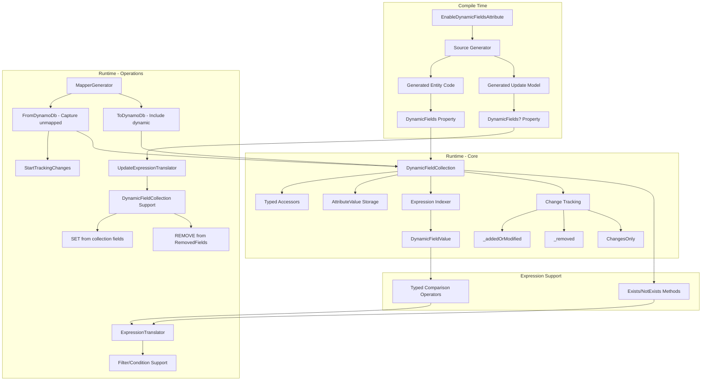

# Design Document: Dynamic Fields Support

## Overview

This document describes the design for adding dynamic fields support to Oproto.FluentDynamoDb entities. Dynamic fields enable entities to capture and work with DynamoDB attributes that are not explicitly defined as properties on the entity class, supporting multi-tenant applications where end users can define custom fields.

The feature is opt-in via the `[EnableDynamicFields]` attribute and integrates with the existing source generation infrastructure while maintaining AOT compatibility.

## Architecture

The dynamic fields feature consists of four main components:



### Design Principles

1. **Opt-in**: Only entities with `[EnableDynamicFields]` get dynamic field support
2. **AOT-compatible**: No reflection at runtime; all mapping code is source-generated
3. **Developer-friendly API**: Typed accessors hide `AttributeValue` complexity
4. **Consistent patterns**: Follows existing library patterns for attributes, generation, and expressions
5. **Secure by default**: Dynamic field values are redacted in logs by default

## Components and Interfaces

### 1. EnableDynamicFieldsAttribute

```csharp
namespace Oproto.FluentDynamoDb.Attributes;

/// <summary>
/// Enables dynamic fields support for an entity, allowing capture of unmapped DynamoDB attributes.
/// </summary>
[AttributeUsage(AttributeTargets.Class, AllowMultiple = false, Inherited = false)]
public sealed class EnableDynamicFieldsAttribute : Attribute
{
    /// <summary>
    /// Gets or sets whether dynamic field values should be included in logs.
    /// Default is false (values are redacted, only field names are logged).
    /// </summary>
    public bool SensitiveLogging { get; set; } = true;
}
```

### 2. DynamicFieldType Enum

An enum to identify the DynamoDB type of a dynamic field:

```csharp
namespace Oproto.FluentDynamoDb.Entities;

/// <summary>
/// Represents the DynamoDB data type of a dynamic field.
/// </summary>
public enum DynamicFieldType
{
    /// <summary>Field does not exist in the collection.</summary>
    NotFound,
    /// <summary>String (S) that is not a recognized date format - use GetString/TryGetString.</summary>
    String,
    /// <summary>
    /// String (S) that parses as DateTime or DateTimeOffset - use GetDateTime/GetDateTimeOffset or TryGet variants.
    /// Note: The underlying storage is still a string; this indicates the value is parseable as a date/time.
    /// </summary>
    DateTime,
    /// <summary>Number (N) - use GetInt/GetLong/GetDouble/GetDecimal or TryGet variants.</summary>
    Number,
    /// <summary>Binary (B) - use GetBytes/TryGetBytes.</summary>
    Binary,
    /// <summary>Boolean (BOOL) - use GetBool/TryGetBool.</summary>
    Boolean,
    /// <summary>Null (NULL) - field exists but has null value.</summary>
    Null,
    /// <summary>List (L) - use GetStringList/GetIntList or TryGet variants.</summary>
    List,
    /// <summary>Map (M) - nested object, use GetRaw for AttributeValue access.</summary>
    Map,
    /// <summary>String Set (SS) - use GetStringSet/TryGetStringSet.</summary>
    StringSet,
    /// <summary>Number Set (NS) - use GetNumberSet/TryGetNumberSet.</summary>
    NumberSet,
    /// <summary>Binary Set (BS) - use GetRaw for AttributeValue access.</summary>
    BinarySet
}
```

**DateTime Detection Logic:**

When `GetFieldType` is called on a string field, the implementation attempts to parse the string value as a date/time:

```csharp
public DynamicFieldType GetFieldType(string fieldName)
{
    if (!_fields.TryGetValue(fieldName, out var value))
        return DynamicFieldType.NotFound;
    
    // Check DynamoDB type
    if (value.S != null)
    {
        // Try to detect if string is a DateTime/DateTimeOffset
        // Supports ISO 8601 formats: "2024-01-15T10:30:00Z", "2024-01-15T10:30:00+05:00", etc.
        if (DateTimeOffset.TryParse(value.S, CultureInfo.InvariantCulture, 
            DateTimeStyles.RoundtripKind, out _))
        {
            return DynamicFieldType.DateTime;
        }
        return DynamicFieldType.String;
    }
    if (value.N != null) return DynamicFieldType.Number;
    if (value.B != null) return DynamicFieldType.Binary;
    if (value.IsBOOLSet) return DynamicFieldType.Boolean;
    if (value.NULL) return DynamicFieldType.Null;
    if (value.IsLSet) return DynamicFieldType.List;
    if (value.IsMSet) return DynamicFieldType.Map;
    if (value.SS?.Count > 0) return DynamicFieldType.StringSet;
    if (value.NS?.Count > 0) return DynamicFieldType.NumberSet;
    if (value.BS?.Count > 0) return DynamicFieldType.BinarySet;
    
    return DynamicFieldType.NotFound;
}
```

This allows developers to:
1. Check if a string field contains a parseable date before accessing it
2. Use `GetDateTime` or `GetDateTimeOffset` for date values
3. Fall back to `GetString` for non-date strings

### 3. DynamicFieldCollection

The core runtime type for storing and accessing dynamic fields with change tracking support:

```csharp
namespace Oproto.FluentDynamoDb.Entities;

/// <summary>
/// A collection of dynamic fields captured from DynamoDB items that are not mapped to entity properties.
/// Provides typed accessors for common types while maintaining the underlying AttributeValue storage.
/// Supports change tracking for efficient update operations.
/// </summary>
public sealed class DynamicFieldCollection : IEnumerable<KeyValuePair<string, AttributeValue>>
{
    private readonly Dictionary<string, AttributeValue> _fields;
    private readonly HashSet<string> _addedOrModified = new();
    private readonly HashSet<string> _removed = new();
    private bool _trackChanges = false;
    
    public DynamicFieldCollection();
    public DynamicFieldCollection(Dictionary<string, AttributeValue> fields);
    
    // Type detection - allows developers to discover what type a field contains
    public DynamicFieldType GetFieldType(string fieldName);
    
    // Typed getters - return default/null if field doesn't exist
    public string? GetString(string fieldName);
    public int? GetInt(string fieldName);
    public long? GetLong(string fieldName);
    public double? GetDouble(string fieldName);
    public decimal? GetDecimal(string fieldName);
    public bool? GetBool(string fieldName);
    public DateTime? GetDateTime(string fieldName);
    public DateTimeOffset? GetDateTimeOffset(string fieldName);
    public byte[]? GetBytes(string fieldName);
    public List<string>? GetStringList(string fieldName);
    public List<int>? GetIntList(string fieldName);
    public HashSet<string>? GetStringSet(string fieldName);
    public HashSet<int>? GetNumberSet(string fieldName);
    
    // TryGet pattern - returns false if field doesn't exist or type mismatch
    public bool TryGetString(string fieldName, out string? value);
    public bool TryGetInt(string fieldName, out int? value);
    public bool TryGetLong(string fieldName, out long? value);
    public bool TryGetDouble(string fieldName, out double? value);
    public bool TryGetDecimal(string fieldName, out decimal? value);
    public bool TryGetBool(string fieldName, out bool? value);
    public bool TryGetDateTime(string fieldName, out DateTime? value);
    public bool TryGetDateTimeOffset(string fieldName, out DateTimeOffset? value);
    public bool TryGetBytes(string fieldName, out byte[]? value);
    public bool TryGetStringList(string fieldName, out List<string>? value);
    public bool TryGetIntList(string fieldName, out List<int>? value);
    public bool TryGetStringSet(string fieldName, out HashSet<string>? value);
    public bool TryGetNumberSet(string fieldName, out HashSet<int>? value);
    
    // Generic getter with type conversion
    public T? Get<T>(string fieldName);
    public bool TryGet<T>(string fieldName, out T? value);
    
    // Typed setters - null removes the field, tracks changes when tracking is enabled
    public void SetString(string fieldName, string? value);
    public void SetInt(string fieldName, int? value);
    public void SetLong(string fieldName, long? value);
    public void SetDouble(string fieldName, double? value);
    public void SetDecimal(string fieldName, decimal? value);
    public void SetBool(string fieldName, bool? value);
    public void SetDateTime(string fieldName, DateTime? value);
    public void SetDateTimeOffset(string fieldName, DateTimeOffset? value);
    public void SetBytes(string fieldName, byte[]? value);
    public void SetStringList(string fieldName, List<string>? value);
    public void SetIntList(string fieldName, List<int>? value);
    public void SetStringSet(string fieldName, HashSet<string>? value);
    public void SetNumberSet(string fieldName, HashSet<int>? value);
    
    // Generic setter
    public void Set<T>(string fieldName, T? value);
    
    // Raw AttributeValue access
    public AttributeValue? GetRaw(string fieldName);
    public void SetRaw(string fieldName, AttributeValue? value);
    
    // Collection operations
    public bool ContainsKey(string fieldName);
    public bool Remove(string fieldName);
    public void Clear();
    public int Count { get; }
    public IEnumerable<string> FieldNames { get; }
    
    // Change tracking operations
    /// <summary>
    /// Returns a new collection containing only the fields that have been added or modified,
    /// with tracking of removed fields. By default, resets change tracking on the source collection.
    /// </summary>
    /// <param name="resetTracking">If true (default), resets change tracking on the source collection.
    /// Set to false for retry scenarios where you need to preserve tracking.</param>
    public DynamicFieldCollection ChangesOnly(bool resetTracking = true);
    
    /// <summary>
    /// Manually resets change tracking, clearing all tracked additions, modifications, and removals.
    /// </summary>
    public void ResetChangeTracking();
    
    /// <summary>
    /// Gets the set of field names that have been marked for removal.
    /// Used by the expression translator to generate REMOVE clauses.
    /// </summary>
    public IReadOnlySet<string> RemovedFields { get; }
    
    /// <summary>
    /// Gets whether this collection has any tracked changes (additions, modifications, or removals).
    /// </summary>
    public bool HasChanges { get; }
    
    // Internal: Called by FromDynamoDb after populating the collection
    internal void StartTrackingChanges();
    
    // Internal: Get all fields as dictionary (used by mapper)
    internal Dictionary<string, AttributeValue> ToDictionary();
    
    // IEnumerable implementation
    public IEnumerator<KeyValuePair<string, AttributeValue>> GetEnumerator();
}
```

**Change Tracking Behavior:**

When change tracking is enabled (after `FromDynamoDb` calls `StartTrackingChanges()`):

1. **Set operations** add the field name to `_addedOrModified` and remove from `_removed`
2. **Remove operations** add the field name to `_removed` and remove from `_addedOrModified`
3. **Clear operations** add all current field names to `_removed` and clear `_addedOrModified`

**ChangesOnly() Behavior:**

```csharp
public DynamicFieldCollection ChangesOnly(bool resetTracking = true)
{
    var changes = new DynamicFieldCollection();
    
    // Copy added/modified fields
    foreach (var key in _addedOrModified.Where(k => _fields.ContainsKey(k)))
    {
        changes._fields[key] = _fields[key];
    }
    
    // Copy removed fields list (for REMOVE clause generation)
    foreach (var key in _removed)
    {
        changes._removed.Add(key);
    }
    
    // Reset tracking on source collection (default behavior)
    if (resetTracking)
    {
        ResetChangeTracking();
    }
    
    return changes;
}
```

**Usage Patterns:**

```csharp
// Typical update flow
var product = await table.Products.GetAsync(pk, sk);
product.DynamicFields.SetString("color", "Red");
product.DynamicFields.Remove("temporary_note");

await table.Products.Update(pk, sk)
    .Set(x => new ProductUpdateModel 
    { 
        Price = product.Price,
        DynamicFields = product.DynamicFields.ChangesOnly()
    })
    .UpdateAsync();

// Retry scenario
try
{
    await table.Products.Update(pk, sk)
        .Set(x => new ProductUpdateModel 
        { 
            DynamicFields = product.DynamicFields.ChangesOnly(resetTracking: false)
        })
        .UpdateAsync();
    
    product.DynamicFields.ResetChangeTracking(); // Manual reset on success
}
catch (Exception)
{
    // Retry will include the same changes
}

// Creating changes without loading entity
var changes = new DynamicFieldCollection();
changes.SetString("color", "Blue");
changes.Remove("old_field");

await table.Products.Update(pk, sk)
    .Set(x => new ProductUpdateModel { DynamicFields = changes })
    .UpdateAsync();
```
```

### 3. DynamicFieldValue (for Expression Support)

A value type that enables natural typed comparisons in lambda expressions:

```csharp
namespace Oproto.FluentDynamoDb.Entities;

/// <summary>
/// Represents a dynamic field value for use in lambda expressions.
/// This type provides comparison operators that enable natural expression syntax
/// like <c>x.DynamicFields["score"] > 100</c>.
/// </summary>
/// <remarks>
/// <para>
/// This type is designed for use in expression trees only. The comparison operators
/// are analyzed by the expression translator and converted to DynamoDB expression syntax.
/// They should never be called directly at runtime.
/// </para>
/// <para>
/// Supported comparisons:
/// </para>
/// <list type="bullet">
/// <item><description>Equality: <c>== "value"</c>, <c>== 42</c>, <c>== true</c></description></item>
/// <item><description>Inequality: <c>!= "value"</c></description></item>
/// <item><description>Numeric comparisons: <c>&gt; 100</c>, <c>&lt; 50</c>, <c>&gt;= 10</c>, <c>&lt;= 20</c></description></item>
/// </list>
/// </remarks>
public readonly struct DynamicFieldValue
{
    internal string FieldName { get; }
    
    internal DynamicFieldValue(string fieldName);
    
    // String comparisons
    public static bool operator ==(DynamicFieldValue field, string? value);
    public static bool operator !=(DynamicFieldValue field, string? value);
    
    // Integer comparisons
    public static bool operator ==(DynamicFieldValue field, int value);
    public static bool operator !=(DynamicFieldValue field, int value);
    public static bool operator >(DynamicFieldValue field, int value);
    public static bool operator <(DynamicFieldValue field, int value);
    public static bool operator >=(DynamicFieldValue field, int value);
    public static bool operator <=(DynamicFieldValue field, int value);
    
    // Long comparisons
    public static bool operator ==(DynamicFieldValue field, long value);
    public static bool operator !=(DynamicFieldValue field, long value);
    public static bool operator >(DynamicFieldValue field, long value);
    public static bool operator <(DynamicFieldValue field, long value);
    public static bool operator >=(DynamicFieldValue field, long value);
    public static bool operator <=(DynamicFieldValue field, long value);
    
    // Double comparisons
    public static bool operator ==(DynamicFieldValue field, double value);
    public static bool operator !=(DynamicFieldValue field, double value);
    public static bool operator >(DynamicFieldValue field, double value);
    public static bool operator <(DynamicFieldValue field, double value);
    public static bool operator >=(DynamicFieldValue field, double value);
    public static bool operator <=(DynamicFieldValue field, double value);
    
    // Decimal comparisons
    public static bool operator ==(DynamicFieldValue field, decimal value);
    public static bool operator !=(DynamicFieldValue field, decimal value);
    public static bool operator >(DynamicFieldValue field, decimal value);
    public static bool operator <(DynamicFieldValue field, decimal value);
    public static bool operator >=(DynamicFieldValue field, decimal value);
    public static bool operator <=(DynamicFieldValue field, decimal value);
    
    // Boolean comparisons
    public static bool operator ==(DynamicFieldValue field, bool value);
    public static bool operator !=(DynamicFieldValue field, bool value);
    
    // AttributeValue comparisons (for backward compatibility)
    public static bool operator ==(DynamicFieldValue field, AttributeValue? value);
    public static bool operator !=(DynamicFieldValue field, AttributeValue? value);
}
```

**Design Rationale:**

The `DynamicFieldValue` struct enables a consistent API paradigm between runtime access and expression-based filtering:

- **Runtime access** uses typed getters: `product.DynamicFields.GetInt("score")`
- **Expression filtering** uses natural typed comparisons: `x.DynamicFields["score"] > 100`

This avoids requiring developers to construct `AttributeValue` objects in expressions, which would be inconsistent with the typed getter/setter API and more verbose:

```csharp
// ❌ Inconsistent - requires AttributeValue construction
.WithFilter(x => x.DynamicFields["score"] == new AttributeValue { N = "100" })

// ✅ Consistent - natural typed comparison
.WithFilter(x => x.DynamicFields["score"] > 100)
```

All operators throw `InvalidOperationException` at runtime with a helpful message directing developers to use the typed getter methods for runtime access.

### 4. DynamicFieldCollection Expression Support

The `DynamicFieldCollection` class includes an indexer and existence check methods for expression support:

```csharp
// In DynamicFieldCollection class

/// <summary>
/// Gets a <see cref="DynamicFieldValue"/> for the specified field. 
/// Used in lambda expressions for filter and condition expressions.
/// </summary>
/// <exception cref="InvalidOperationException">
/// Always thrown when called directly at runtime. This indexer is designed for use in expression trees only.
/// </exception>
/// <example>
/// <code>
/// // Filter by string value
/// table.Query().WithFilter(x => x.DynamicFields["customField"] == "value");
/// 
/// // Filter by numeric value with comparison
/// table.Query().WithFilter(x => x.DynamicFields["score"] > 100);
/// </code>
/// </example>
public DynamicFieldValue this[string fieldName]
{
    get => throw new InvalidOperationException(
        $"DynamicFieldCollection indexer cannot be called directly at runtime. " +
        $"Use GetString(\"{fieldName}\"), GetInt(\"{fieldName}\"), or other typed getter methods.");
}

/// <summary>
/// Checks if a dynamic field exists. Used in lambda expressions for filter and condition expressions.
/// Translates to DynamoDB <c>attribute_exists()</c> function.
/// </summary>
/// <exception cref="InvalidOperationException">
/// Always thrown when called directly at runtime. Use <see cref="ContainsKey"/> for runtime existence checks.
/// </exception>
public bool Exists(string fieldName)
{
    throw new InvalidOperationException(
        $"DynamicFieldCollection.Exists cannot be called directly at runtime. " +
        $"Use ContainsKey(\"{fieldName}\") for runtime existence checks.");
}

/// <summary>
/// Checks if a dynamic field does not exist. Used in lambda expressions for filter and condition expressions.
/// Translates to DynamoDB <c>attribute_not_exists()</c> function.
/// </summary>
/// <exception cref="InvalidOperationException">
/// Always thrown when called directly at runtime. Use <c>!ContainsKey(fieldName)</c> for runtime non-existence checks.
/// </exception>
public bool NotExists(string fieldName)
{
    throw new InvalidOperationException(
        $"DynamicFieldCollection.NotExists cannot be called directly at runtime. " +
        $"Use !ContainsKey(\"{fieldName}\") for runtime non-existence checks.");
}
```

**API Consistency:**

| Use Case | Runtime API | Expression API |
|----------|-------------|----------------|
| Get string value | `fields.GetString("name")` | `x.DynamicFields["name"] == "value"` |
| Get numeric value | `fields.GetInt("score")` | `x.DynamicFields["score"] > 100` |
| Check existence | `fields.ContainsKey("field")` | `x.DynamicFields.Exists("field")` |
| Check non-existence | `!fields.ContainsKey("field")` | `x.DynamicFields.NotExists("field")` |

### 5. Source Generator Changes

The `MapperGenerator` will be extended to:

1. Detect `[EnableDynamicFields]` attribute on entities
2. Generate a `DynamicFields` property of type `DynamicFieldCollection`
3. In `FromDynamoDb`: Capture all attributes not mapped to properties into `DynamicFields`
4. In `ToDynamoDb`: Include all `DynamicFields` entries in the output dictionary

### 6. Expression Translator Changes

The `ExpressionTranslator` will be extended to:

1. Recognize `DynamicFields[fieldName]` indexer access patterns returning `DynamicFieldValue`
2. Handle `DynamicFieldValue` comparison operators (`==`, `!=`, `>`, `<`, `>=`, `<=`) with typed values
3. Generate proper attribute name placeholders for dynamic field names
4. Support comparison operators, `begins_with`, `contains` for dynamic fields
5. Handle reserved words and special characters in field names
6. Recognize `Exists()` and `NotExists()` method calls on `DynamicFieldCollection`

### 7. Update Expression Translator Changes

The `UpdateExpressionTranslator` will be extended to:

1. Recognize `DynamicFields` property assignments in update model expressions
2. When `DynamicFields` is assigned a `DynamicFieldCollection`:
   - Generate SET clauses for each field in the collection
   - Generate REMOVE clauses for each field in `RemovedFields`
3. Handle reserved words and special characters in dynamic field names
4. Skip `DynamicFields` processing when the property is null

**Expression Translation Logic:**

```csharp
// When processing update model properties
if (propertyName == "DynamicFields" && value is DynamicFieldCollection collection)
{
    // Generate SET clauses for all fields in the collection
    foreach (var kvp in collection)
    {
        var placeholder = GenerateAttributeNamePlaceholder(kvp.Key);
        var valuePlaceholder = GenerateValuePlaceholder();
        AddSetClause($"{placeholder} = {valuePlaceholder}");
        AddAttributeName(placeholder, kvp.Key);
        AddAttributeValue(valuePlaceholder, kvp.Value);
    }
    
    // Generate REMOVE clauses for tracked removals
    foreach (var removedField in collection.RemovedFields)
    {
        var placeholder = GenerateAttributeNamePlaceholder(removedField);
        AddRemoveClause(placeholder);
        AddAttributeName(placeholder, removedField);
    }
}
```

### 8. Generated Update Model Changes

For entities with `[EnableDynamicFields]`, the source generator will include a `DynamicFields` property in the generated update model:

```csharp
// Generated update model for Product entity
public class ProductUpdateModel
{
    public decimal? Price { get; set; }
    public string? Name { get; set; }
    
    /// <summary>
    /// Dynamic fields to update. Set to a DynamicFieldCollection to update specific fields,
    /// or leave null to not modify any dynamic fields.
    /// Use entity.DynamicFields.ChangesOnly() to update only changed fields.
    /// </summary>
    public DynamicFieldCollection? DynamicFields { get; set; }
}
```

**Usage in Lambda Expressions:**

```csharp
// Update only changed dynamic fields
await table.Products.Update(pk, sk)
    .Set(x => new ProductUpdateModel 
    { 
        Price = 34.99m,
        DynamicFields = product.DynamicFields.ChangesOnly()
    })
    .UpdateAsync();

// Update specific dynamic fields (without loading entity)
var dynamicUpdates = new DynamicFieldCollection();
dynamicUpdates.SetString("color", "Blue");
dynamicUpdates.Remove("temporary_note");

await table.Products.Update(pk, sk)
    .Set(x => new ProductUpdateModel 
    { 
        DynamicFields = dynamicUpdates
    })
    .UpdateAsync();

// No dynamic field changes (DynamicFields is null)
await table.Products.Update(pk, sk)
    .Set(x => new ProductUpdateModel { Price = 29.99m })
    .UpdateAsync();
```

## Data Models

### Generated Entity Structure

For an entity with `[EnableDynamicFields]`:

```csharp
// User-defined entity
[DynamoDbTable("Products")]
[EnableDynamicFields]
public partial class Product
{
    [PartitionKey]
    [DynamoDbAttribute("pk")]
    public string Pk { get; set; } = string.Empty;
    
    [SortKey]
    [DynamoDbAttribute("sk")]
    public string Sk { get; set; } = string.Empty;
    
    [DynamoDbAttribute("name")]
    public string Name { get; set; } = string.Empty;
    
    [DynamoDbAttribute("price")]
    public decimal Price { get; set; }
}

// Generated partial class
public partial class Product : IDynamoDbEntity
{
    /// <summary>
    /// Dynamic fields captured from DynamoDB that are not mapped to entity properties.
    /// </summary>
    public DynamicFieldCollection DynamicFields { get; set; } = new();
    
    // ... existing generated methods with dynamic field support
}
```

### DynamoDB Item Mapping

Given a DynamoDB item:
```json
{
    "pk": { "S": "PRODUCT#123" },
    "sk": { "S": "META" },
    "name": { "S": "Widget" },
    "price": { "N": "29.99" },
    "custom_color": { "S": "blue" },
    "custom_weight": { "N": "1.5" },
    "custom_tags": { "SS": ["sale", "featured"] }
}
```

The entity will have:
- `Pk = "PRODUCT#123"`
- `Sk = "META"`
- `Name = "Widget"`
- `Price = 29.99m`
- `DynamicFields` containing:
  - `"custom_color"` → `{ S: "blue" }`
  - `"custom_weight"` → `{ N: "1.5" }`
  - `"custom_tags"` → `{ SS: ["sale", "featured"] }`


## Correctness Properties

*A property is a characteristic or behavior that should hold true across all valid executions of a system-essentially, a formal statement about what the system should do. Properties serve as the bridge between human-readable specifications and machine-verifiable correctness guarantees.*

Based on the prework analysis, the following correctness properties have been identified. Redundant properties have been consolidated.

### Property 1: Source Generator Attribute Detection

*For any* entity class, the source generator SHALL generate dynamic field handling code if and only if the `[EnableDynamicFields]` attribute is present on the class.

**Validates: Requirements 1.1, 1.2, 1.3**

### Property 2: DynamicFieldCollection Type Conversion Correctness

*For any* `DynamicFieldCollection` containing an `AttributeValue` of type T, calling the typed getter for type T SHALL return the correct converted value, and calling a typed getter for an incompatible type SHALL throw a descriptive exception.

**Validates: Requirements 2.1, 2.3**

### Property 3: DynamicFieldCollection Missing Key Behavior

*For any* `DynamicFieldCollection` and any field name not present in the collection, calling any typed getter SHALL return null or default value without throwing an exception.

**Validates: Requirements 2.2**

### Property 4: DynamicFieldCollection Enumeration Completeness

*For any* `DynamicFieldCollection` with N fields, enumerating the collection SHALL yield exactly N key-value pairs, and `ContainsKey` SHALL return true for all stored field names and false for all others.

**Validates: Requirements 2.4, 2.5**

### Property 5: Read Operations Populate Dynamic Fields

*For any* DynamoDB item containing unmapped attributes, when retrieved via GetItem, Query, or Scan operations on an entity with dynamic fields enabled, the returned entity's `DynamicFields` property SHALL contain all unmapped attributes from the response.

**Validates: Requirements 3.1, 3.2, 3.3**

### Property 6: Projection Expression Filtering

*For any* read operation with a projection expression on an entity with dynamic fields enabled, the `DynamicFields` property SHALL only contain attributes that were included in the projection.

**Validates: Requirements 3.4**

### Property 7: DynamicFieldCollection Setter Correctness

*For any* value of a supported type set via a typed setter, the underlying `AttributeValue` SHALL be correctly constructed, and setting null SHALL remove the field from the collection.

**Validates: Requirements 4.1, 4.4**

### Property 8: PutItem Includes Dynamic Fields

*For any* entity with dynamic fields, when serialized via `ToDynamoDb`, the resulting dictionary SHALL include all dynamic fields, and mapped properties SHALL take precedence over dynamic fields with the same name.

**Validates: Requirements 4.2, 4.3**

### Property 9: Update Expression Dynamic Field Support

*For any* dynamic field name (including reserved words and special characters), the UpdateItemRequestBuilder SHALL generate correct SET and REMOVE expressions with properly escaped attribute names.

**Validates: Requirements 5.1, 5.2, 5.3**

### Property 10: Update Return Value Population

*For any* update operation with `ReturnValues` set to return the updated item, the returned entity's `DynamicFields` property SHALL reflect the current state of dynamic fields after the update.

**Validates: Requirements 5.4**

### Property 11: Expression Translator Dynamic Field Support

*For any* dynamic field reference in a filter or condition expression, the Expression Translator SHALL generate correct DynamoDB expression syntax with properly escaped attribute name placeholders, supporting equality, comparison, and string operations.

**Validates: Requirements 6.1, 6.2, 6.3, 6.4, 7.1, 7.3**

### Property 12: Attribute Existence Functions

*For any* dynamic field reference using `Exists()` or `NotExists()` methods, the Expression Translator SHALL generate correct `attribute_exists()` or `attribute_not_exists()` function calls.

**Validates: Requirements 7.2**

### Property 13: Lambda Update Expression Support

*For any* lambda expression with an update model containing a non-null `DynamicFields` property, the Update Expression Translator SHALL generate SET clauses for all fields in the collection and REMOVE clauses for all fields in `RemovedFields`.

**Validates: Requirements 8.1, 8.2, 8.3, 8.4, 12.2, 12.3**

### Property 16: Change Tracking Accuracy

*For any* `DynamicFieldCollection` with change tracking enabled, after a sequence of Set and Remove operations, `ChangesOnly()` SHALL return a collection containing exactly the fields that were added or modified, and `RemovedFields` SHALL contain exactly the fields that were removed.

**Validates: Requirements 11.2, 11.3, 11.4**

### Property 17: Change Tracking Reset Behavior

*For any* `DynamicFieldCollection`, calling `ChangesOnly()` with default parameters SHALL reset change tracking on the source collection, and calling `ChangesOnly(resetTracking: false)` SHALL preserve change tracking on the source collection.

**Validates: Requirements 11.5, 11.6**

### Property 18: Update Model DynamicFields Null Handling

*For any* update operation where the update model's `DynamicFields` property is null, the Expression Translator SHALL not generate any SET or REMOVE clauses for dynamic fields.

**Validates: Requirements 8.3, 12.4**

### Property 14: Logging Redaction Behavior

*For any* logging operation involving dynamic fields, field values SHALL be redacted by default (showing only field names), unless `SensitiveLogging = false` is specified on the attribute.

**Validates: Requirements 9.1, 9.2, 9.3**

### Property 15: Serialization Round-Trip

*For any* entity with dynamic fields, serializing to DynamoDB format and then deserializing back SHALL produce an entity with equivalent dynamic field values to the original.

**Validates: Requirements 10.1, 10.2, 10.3**

## Error Handling

### Type Conversion Errors

When accessing a dynamic field with an incompatible type:

```csharp
public class DynamicFieldTypeException : InvalidOperationException
{
    public string FieldName { get; }
    public Type RequestedType { get; }
    public string ActualDynamoDbType { get; }
    
    public DynamicFieldTypeException(string fieldName, Type requestedType, string actualType)
        : base($"Dynamic field '{fieldName}' cannot be converted to {requestedType.Name}. " +
               $"The field contains a DynamoDB {actualType} value.")
    {
        FieldName = fieldName;
        RequestedType = requestedType;
        ActualDynamoDbType = actualType;
    }
}
```

### Expression Translation Errors

When a dynamic field expression cannot be translated:

```csharp
// Existing UnsupportedExpressionException will be used with appropriate messages
throw new UnsupportedExpressionException(
    $"Dynamic field access pattern not supported. Use DynamicFields[\"fieldName\"] syntax.",
    expression);
```

### Source Generator Diagnostics

| Diagnostic ID | Severity | Message |
|---------------|----------|---------|
| FDDB0020 | Error | `[EnableDynamicFields]` requires the class to be declared as partial |
| FDDB0021 | Warning | `[EnableDynamicFields]` on a class that already has a `DynamicFields` property |

## Testing Strategy

### Property-Based Testing Framework

The design uses **FsCheck** (via FsCheck.Xunit) for property-based testing, consistent with existing tests in the codebase.

### Unit Tests

Unit tests will cover:

1. **DynamicFieldCollection API**
   - All typed getters and setters
   - Null handling and field removal
   - Enumeration and ContainsKey
   - Type conversion edge cases

2. **Source Generator**
   - Attribute detection
   - Generated code structure
   - Diagnostic emission for invalid usage

3. **Expression Translators**
   - Dynamic field access patterns
   - Reserved word escaping
   - Existence function translation

### Property-Based Tests

Property tests will verify:

1. **Round-trip serialization**: Any entity with dynamic fields survives ToDynamoDb → FromDynamoDb
2. **Type conversion correctness**: Typed accessors return correct values for all supported types
3. **Enumeration completeness**: All stored fields are enumerable
4. **Expression escaping**: All field names (including reserved words) are properly escaped

### Integration Tests

Integration tests against DynamoDB Local will cover:

1. **GetItem with dynamic fields**
2. **Query with dynamic fields**
3. **Scan with dynamic fields**
4. **PutItem with dynamic fields**
5. **UpdateItem SET/REMOVE dynamic fields**
6. **Filter expressions with dynamic fields**
7. **Condition expressions with dynamic fields**
8. **Projection expressions with dynamic fields**

### Example Project

A new example project `examples/DynamicFieldsDemo` will demonstrate:

1. Entity definition with `[EnableDynamicFields]`
2. Reading entities with custom fields
3. Writing entities with custom fields
4. Updating specific dynamic fields
5. Querying/filtering by dynamic field values

## Implementation Notes

### Mapped Property Names (Static Compile-Time Set)

The source generator creates a **static readonly** `HashSet<string>` containing all mapped attribute names. This set is:
- Generated at compile time by the source generator
- Initialized once when the type is first accessed (static field)
- Shared across all instances of the entity
- Zero runtime cost after initial type loading

```csharp
// Generated as a static field in the entity partial class
private static readonly HashSet<string> _mappedAttributeNames = new(StringComparer.Ordinal)
{
    "pk", "sk", "name", "price"  // All [DynamoDbAttribute] names - known at compile time
};

// Used in FromDynamoDb to identify dynamic fields
public static TSelf FromDynamoDb<TSelf>(Dictionary<string, AttributeValue> item, ...)
{
    var entity = new Product();
    
    // Map known properties (existing logic)
    if (item.TryGetValue("pk", out var pkValue))
        entity.Pk = pkValue.S;
    // ... other mapped properties
    
    // Capture dynamic fields - single pass, O(n) where n = item attributes
    foreach (var kvp in item)
    {
        if (!_mappedAttributeNames.Contains(kvp.Key))
        {
            entity.DynamicFields.SetRaw(kvp.Key, kvp.Value);
        }
    }
    
    return (TSelf)(object)entity;
}
```

This approach ensures:
1. **No runtime reflection** - attribute names are embedded in generated code
2. **No per-instance overhead** - the set is static and shared
3. **O(1) lookup** - HashSet provides constant-time contains check
4. **Single iteration** - dynamic fields are captured in one pass over the item

### Performance Considerations

1. **Lazy initialization**: `DynamicFieldCollection` is initialized lazily to avoid allocation when no dynamic fields exist
2. **Pre-sized dictionary**: When deserializing, the dictionary is pre-sized based on unmapped attribute count
3. **No reflection**: All type conversions use compile-time generated code paths

### Thread Safety

`DynamicFieldCollection` is not thread-safe. This is consistent with entity instances themselves, which are not designed for concurrent modification.

### Null vs Empty

- An entity with no dynamic fields has an empty `DynamicFieldCollection` (not null)
- Individual field values can be null (which removes them from the collection)
- The `DynamicFields` property itself is never null after deserialization
