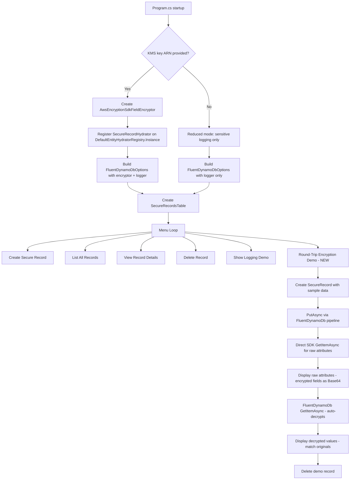

# Design Document: encryption-demo-completion

## Overview

This design completes the EncryptionDemo sample application so it demonstrates real end-to-end field-level encryption using AWS KMS via the `AwsEncryptionSdkFieldEncryptor`. The demo currently only shows `[Sensitive]` log redaction; after this change it will also show a working round-trip: write encrypted fields to DynamoDB, inspect the raw binary ciphertext, then read and decrypt them back to plaintext.

The scope is limited to four files inside `examples/EncryptionDemo/` plus the entity doc comments and README. No library code changes are required — the encryption pipeline was already fixed in the `encryption-pipeline-fix` spec.

### Key Design Decisions

1. **No fake/local encryptor** — the demo uses the real `AwsEncryptionSdkFieldEncryptor` with KMS. If no KMS key is provided, the demo runs in reduced mode (sensitive logging only).
2. **AWS credentials from environment** — no profile prompt. The user sets `AWS_PROFILE` or env vars before running.
3. **Hydrator registration on the singleton** — since `WithHydratorRegistry` is `internal`, the demo registers the source-generated `SecureRecordHydrator` directly on `DefaultEntityHydratorRegistry.Instance` before constructing `FluentDynamoDbOptions`.
4. **Direct SDK call for raw attribute inspection** — the round-trip demo uses `IAmazonDynamoDB.GetItemAsync` directly (not the FluentDynamoDb pipeline) to show the raw encrypted binary values stored in DynamoDB.
5. **DynamoDB Local for all paths** — DynamoDB Local handles binary attributes without issue. The only real AWS dependency is KMS (for data key generation/unwrapping). The demo always uses DynamoDB Local, consistent with all other sample projects.

## Architecture

The demo is a single console application with a menu-driven flow. No new classes or services are introduced — only modifications to existing files.



## Components and Interfaces

### Modified Files

| File | Changes |
|------|---------|
| `examples/EncryptionDemo/Program.cs` | Remove AWS profile prompt, remove pending-completion banner, register hydrator, add round-trip demo menu option, update banner text |
| `examples/EncryptionDemo/Entities/SecureRecord.cs` | Remove "pending completion" XML doc remarks from `SocialSecurityNumber` and `CreditCardNumber` properties |
| `examples/EncryptionDemo/README.md` | Update to reflect completed encryption, document prerequisites, document round-trip demo, update attribute behavior table |
| `examples/EncryptionDemo/EncryptionDemo.csproj` | No changes expected — already references `Oproto.FluentDynamoDb.Encryption.Kms` |

### Program.cs Changes Detail

**Startup sequence (modified):**

1. Display updated banner (no "pending" warning)
2. Prompt for KMS key ARN only (remove AWS profile prompt)
3. Connect to DynamoDB Local
4. Register `SecureRecordHydrator` on `DefaultEntityHydratorRegistry.Instance`
5. Build `FluentDynamoDbOptions`:
   - Always: `.WithLogger(logger)`
   - If KMS key provided: `.WithEncryption(encryptor)`
6. Create `SecureRecordsTable`

**New menu option: "Round-Trip Encryption Demo"**

This option is only available when encryption is configured (KMS key was provided). The flow:

1. Create a `SecureRecord` with hardcoded sample data (deterministic for demo clarity)
2. Store via `table.Put<SecureRecord>().WithItem(record).PutAsync()` (uses deferred async serialization through the hydrator)
3. Read raw attributes via direct `client.GetItemAsync(new GetItemRequest { ... })`
4. Display each attribute:
   - `pk`, `label`, `email`, `createdAt` → show as readable strings
   - `ssn`, `creditCard` → show as Base64-encoded binary (proving encryption)
5. Read via FluentDynamoDb pipeline: `table.SecureRecords.Get(record.Id).GetItemAsync()`
6. Display decrypted values, confirming they match originals
7. Delete the demo record

**Existing menu options preserved:**
- Create Secure Record (option 1) — uses `table.Put<SecureRecord>().WithItem(record).PutAsync()` instead of the generated accessor's `Put(entity)` to ensure deferred serialization works
- List All Records (option 2) — unchanged
- View Record Details (option 3) — unchanged
- Delete Record (option 4) — unchanged
- Show Logging Demo (option 5) — unchanged

### Hydrator Registration Pattern

Since `FluentDynamoDbOptions.WithHydratorRegistry()` is `internal` and the demo project doesn't have `InternalsVisibleTo` access, the demo registers the hydrator on the default singleton registry:

```csharp
// Register the source-generated hydrator before building options
DefaultEntityHydratorRegistry.Instance.RegisterSecureRecordHydrator();
```

This works because `FluentDynamoDbOptions` defaults to `DefaultEntityHydratorRegistry.Instance` for its `HydratorRegistry` property.

### Put Path for Encrypted Entities

The generated `SecureRecordsAccessor.Put(entity)` may call `ToDynamoDb` synchronously, which throws `NotSupportedException` for encrypted entities. The `PutItemRequestBuilder.WithItem(entity)` method handles this by catching the exception and deferring to async serialization. So the existing `table.SecureRecords.Put(record).PutAsync()` pattern should work. However, to be safe and explicit, the demo will use:

```csharp
await table.Put<SecureRecord>().WithItem(record).PutAsync();
```

This ensures the deferred serialization path is used.

## Data Models

### SecureRecord Entity (existing, unchanged structure)

```csharp
[DynamoDbTable("encryption-demo", IsDefault = true)]
[Scannable]
[GenerateEntityProperty(Name = "SecureRecords")]
public partial class SecureRecord
{
    [PartitionKey]
    [DynamoDbAttribute("pk")]
    public string Id { get; set; }          // Plain text in DynamoDB

    [DynamoDbAttribute("label")]
    public string Label { get; set; }        // Plain text in DynamoDB

    [Sensitive]
    [DynamoDbAttribute("email")]
    public string Email { get; set; }        // Plain text in DynamoDB, [REDACTED] in logs

    [Encrypted]
    [DynamoDbAttribute("ssn")]
    public string SocialSecurityNumber { get; set; }  // Binary ciphertext in DynamoDB

    [Encrypted]
    [Sensitive]
    [DynamoDbAttribute("creditCard")]
    public string CreditCardNumber { get; set; }      // Binary ciphertext in DynamoDB, [REDACTED] in logs

    [DynamoDbAttribute("createdAt")]
    public DateTime CreatedAt { get; set; }  // Plain text in DynamoDB
}
```

### DynamoDB Storage Format (with encryption enabled)

| Attribute | DynamoDB Type | Example Value |
|-----------|--------------|---------------|
| `pk` | S (String) | `"demo-round-trip-001"` |
| `label` | S (String) | `"Round-Trip Demo Record"` |
| `email` | S (String) | `"demo@example.com"` |
| `ssn` | B (Binary) | `<Base64 encoded ciphertext>` |
| `creditCard` | B (Binary) | `<Base64 encoded ciphertext>` |
| `createdAt` | S (String) | `"2024-01-15T10:30:00Z"` |


## Error Handling

### KMS Key ARN Validation

The demo wraps `AwsEncryptionSdkFieldEncryptor` construction in a try/catch. If the encryptor fails to initialize (e.g., invalid ARN format), the demo falls back to reduced mode with a warning message rather than crashing.

### Encryption Failures at Runtime

If encryption or decryption fails during the round-trip demo (e.g., KMS permissions issue, key disabled), the existing `catch (Exception ex)` block in the menu loop displays the error via `ConsoleHelpers.ShowError(ex, "Operation failed")`. The `FieldEncryptionException` thrown by the encryptor includes descriptive messages about common KMS errors (access denied, key not found, invalid ciphertext).

### Reduced Mode Guard

Menu options that require encryption (the round-trip demo) check whether encryption is configured before proceeding. If not configured, they display an informational message and return early. The existing CRUD menu options continue to work without encryption — they just store/retrieve plaintext values.

### Missing Hydrator

If the hydrator registration is somehow skipped, `PutItemRequestBuilder.WithItem(entity)` will catch the `NotSupportedException` from the synchronous `ToDynamoDb` call and defer to async serialization. However, without a registered hydrator, `PutAsync` will fail. The demo ensures registration happens before any operations.

## Testing Strategy

### Why Property-Based Testing Does Not Apply

This feature is a demo/sample application consisting of:
- Console UI interactions (prompts, menus, banners)
- Configuration wiring (hydrator registration, encryptor setup)
- Documentation updates (README, XML doc comments)
- Integration flows requiring real AWS KMS and DynamoDB

None of these have the characteristics needed for PBT: pure functions with meaningful input variation where 100+ iterations would find more bugs than a few examples. The encryption round-trip correctness is already covered by property-based tests in the library's `encryption-pipeline-fix` spec.

### Recommended Testing Approach

**Manual testing** is the primary verification method for this demo application:

1. Run the demo without a KMS key → verify reduced mode works, sensitive logging demo works
2. Run the demo with a valid KMS key → verify round-trip encryption demo shows encrypted binary in raw attributes and decrypted plaintext in pipeline results
3. Verify all existing menu options still work

**Code review** covers the documentation and cleanup requirements:
- Verify "pending completion" text is removed from Program.cs, SecureRecord.cs, and README.md
- Verify updated banner text is present
- Verify README documents prerequisites and round-trip demo

**Existing library tests** already cover the encryption pipeline correctness:
- `EncryptionPipelinePreservationTests` — property-based tests for the serialization/deserialization round-trip
- `EncryptionPipelineBugExplorationTests` — exploration tests for the pipeline fix
- Source generator tests verify `SecureRecordHydrator` is generated correctly
