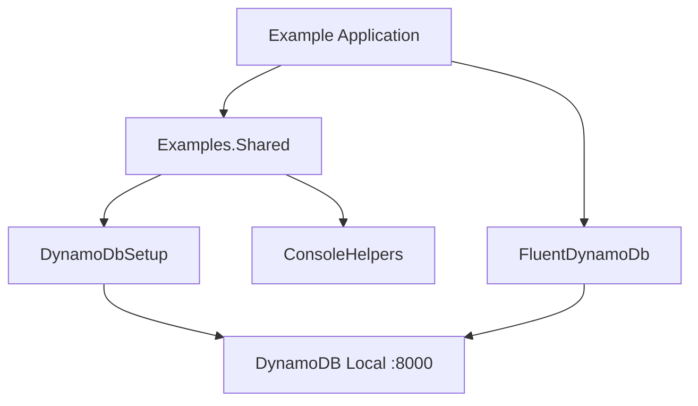

# Design Document: Example Applications

## Overview

This design document describes four console-based example applications that demonstrate the capabilities of Oproto.FluentDynamoDb for a hackathon presentation. The examples showcase CRUD operations, single-table multi-entity design, transactions, and geospatial queries using DynamoDB Local.

## Architecture

### High-Level Structure

All example projects are part of the main `Oproto.FluentDynamoDb.sln` solution and use direct project references to the library projects (not NuGet packages). This allows the examples to always use the latest source code.

```
examples/
├── Examples.Shared/              # Shared utilities and infrastructure
│   ├── DynamoDbSetup.cs         # Table creation and DynamoDB Local connection
│   ├── ConsoleHelpers.cs        # Menu display and input handling
│   └── Examples.Shared.csproj
├── TodoList/                     # Simple CRUD example
│   ├── Entities/
│   ├── Tables/
│   ├── Program.cs
│   └── TodoList.csproj
├── InvoiceManager/               # Single-table multi-entity example
│   ├── Entities/
│   ├── Tables/
│   ├── Program.cs
│   └── InvoiceManager.csproj
├── TransactionDemo/              # Transaction comparison example
│   ├── Entities/
│   ├── Tables/
│   ├── Program.cs
│   └── TransactionDemo.csproj
└── StoreLocator/                 # Geospatial queries example
    ├── Entities/
    ├── Tables/
    ├── Program.cs
    └── StoreLocator.csproj
```

### Project References

Each example project references the main library via project references:

```xml
<!-- Example .csproj project references -->
<ItemGroup>
    <ProjectReference Include="..\..\Oproto.FluentDynamoDb\Oproto.FluentDynamoDb.csproj" />
    <ProjectReference Include="..\..\Oproto.FluentDynamoDb.SourceGenerator\Oproto.FluentDynamoDb.SourceGenerator.csproj" 
                      OutputItemType="Analyzer" 
                      ReferenceOutputAssembly="false" />
    <ProjectReference Include="..\Examples.Shared\Examples.Shared.csproj" />
</ItemGroup>

<!-- StoreLocator additionally references -->
<ItemGroup>
    <ProjectReference Include="..\..\Oproto.FluentDynamoDb.Geospatial\Oproto.FluentDynamoDb.Geospatial.csproj" />
</ItemGroup>
```

### Solution Integration

The example projects will be added to the main solution under an "Examples" solution folder:

```
Oproto.FluentDynamoDb.sln
├── src/
│   ├── Oproto.FluentDynamoDb
│   ├── Oproto.FluentDynamoDb.SourceGenerator
│   ├── Oproto.FluentDynamoDb.Geospatial
│   └── ...
├── tests/
│   └── ...
└── examples/                     # Solution folder
    ├── Examples.Shared
    ├── TodoList
    ├── InvoiceManager
    ├── TransactionDemo
    └── StoreLocator
```

### Shared Infrastructure

All examples share common infrastructure for DynamoDB Local connectivity and console UI:



## Components and Interfaces

### Examples.Shared Project

#### DynamoDbSetup

Provides idempotent table creation and DynamoDB client configuration:

```csharp
public static class DynamoDbSetup
{
    /// <summary>
    /// Creates a DynamoDB client configured for DynamoDB Local.
    /// </summary>
    public static IAmazonDynamoDB CreateLocalClient();
    
    /// <summary>
    /// Creates a table if it doesn't exist. Safe to call multiple times.
    /// </summary>
    public static Task EnsureTableExistsAsync(
        IAmazonDynamoDB client,
        string tableName,
        string partitionKeyName,
        string? sortKeyName = null,
        List<GlobalSecondaryIndex>? gsis = null);
}
```

#### ConsoleHelpers

Provides consistent menu display and input handling:

```csharp
public static class ConsoleHelpers
{
    /// <summary>
    /// Displays a numbered menu and returns the selected option.
    /// </summary>
    public static int ShowMenu(string title, params string[] options);
    
    /// <summary>
    /// Prompts for string input with validation.
    /// </summary>
    public static string GetInput(string prompt, bool required = true);
    
    /// <summary>
    /// Displays a formatted table of data.
    /// </summary>
    public static void DisplayTable<T>(IEnumerable<T> items, params (string Header, Func<T, string> Selector)[] columns);
    
    /// <summary>
    /// Displays a success message.
    /// </summary>
    public static void ShowSuccess(string message);
    
    /// <summary>
    /// Displays an error message without stack trace.
    /// </summary>
    public static void ShowError(string message);
}
```

### TodoList Application

#### Entity: TodoItem

```csharp
[DynamoDbEntity]
[DynamoDbTable("todo-items")]
[Scannable]  // Opt-in to scan operations for small datasets
public partial class TodoItem
{
    [PartitionKey]
    [DynamoDbAttribute("pk")]
    public string Id { get; set; }
    
    [DynamoDbAttribute("description")]
    public string Description { get; set; }
    
    [DynamoDbAttribute("isComplete")]
    public bool IsComplete { get; set; }
    
    [DynamoDbAttribute("createdAt")]
    public DateTime CreatedAt { get; set; }
    
    [DynamoDbAttribute("completedAt")]
    public DateTime? CompletedAt { get; set; }
}
```

#### Table: TodoTable

Uses scannable pattern for small dataset:

```csharp
public class TodoTable : DynamoDbTableBase
{
    public TodoTable(IAmazonDynamoDB client) 
        : base(client, "todo-items") { }
    
    // Entity accessor generated by source generator
    public TodoItemAccessor TodoItems => ...;
}
```

### InvoiceManager Application

#### Entities

Uses single-table design with discriminated entity types:

```csharp
// Base interface for all invoice-related entities
public interface IInvoiceEntity
{
    string Pk { get; }
    string Sk { get; }
}

[DynamoDbEntity]
[DynamoDbTable("invoices")]
public partial class Customer : IInvoiceEntity
{
    [PartitionKey]
    [DynamoDbAttribute("pk")]
    public string Pk { get; set; }  // "CUSTOMER#{customerId}"
    
    [SortKey]
    [DynamoDbAttribute("sk")]
    public string Sk { get; set; }  // "PROFILE"
    
    [DynamoDbAttribute("customerId")]
    public string CustomerId { get; set; }
    
    [DynamoDbAttribute("name")]
    public string Name { get; set; }
    
    [DynamoDbAttribute("email")]
    public string Email { get; set; }
}

[DynamoDbEntity]
[DynamoDbTable("invoices")]
public partial class Invoice : IInvoiceEntity
{
    [PartitionKey]
    [DynamoDbAttribute("pk")]
    public string Pk { get; set; }  // "CUSTOMER#{customerId}"
    
    [SortKey]
    [DynamoDbAttribute("sk")]
    public string Sk { get; set; }  // "INVOICE#{invoiceNumber}"
    
    [DynamoDbAttribute("invoiceNumber")]
    public string InvoiceNumber { get; set; }
    
    [DynamoDbAttribute("date")]
    public DateTime Date { get; set; }
    
    [DynamoDbAttribute("status")]
    public string Status { get; set; }
    
    // Populated by ToComplexEntity
    [ExtractedAttribute]
    public List<InvoiceLine> Lines { get; set; } = new();
    
    public decimal Total => Lines.Sum(l => l.Amount);
}

[DynamoDbEntity]
[DynamoDbTable("invoices")]
public partial class InvoiceLine : IInvoiceEntity
{
    [PartitionKey]
    [DynamoDbAttribute("pk")]
    public string Pk { get; set; }  // "CUSTOMER#{customerId}"
    
    [SortKey]
    [DynamoDbAttribute("sk")]
    public string Sk { get; set; }  // "INVOICE#{invoiceNumber}#LINE#{lineNumber}"
    
    [DynamoDbAttribute("lineNumber")]
    public int LineNumber { get; set; }
    
    [DynamoDbAttribute("description")]
    public string Description { get; set; }
    
    [DynamoDbAttribute("quantity")]
    public int Quantity { get; set; }
    
    [DynamoDbAttribute("unitPrice")]
    public decimal UnitPrice { get; set; }
    
    public decimal Amount => Quantity * UnitPrice;
}
```

#### Table: InvoiceTable

```csharp
public class InvoiceTable : DynamoDbTableBase
{
    public InvoiceTable(IAmazonDynamoDB client) 
        : base(client, "invoices") { }
    
    // Query complete invoice with lines using begins_with
    public async Task<Invoice?> GetCompleteInvoiceAsync(string customerId, string invoiceNumber)
    {
        var results = await Query<Invoice>()
            .Where(x => x.Pk == $"CUSTOMER#{customerId}" && x.Sk.StartsWith($"INVOICE#{invoiceNumber}"))
            .ExecuteAsync();
        
        return results.ToComplexEntity<Invoice>();
    }
}
```

### TransactionDemo Application

#### Entities

Simple entities for demonstrating transactions:

```csharp
[DynamoDbEntity]
[DynamoDbTable("transaction-demo")]
public partial class Account
{
    [PartitionKey]
    [DynamoDbAttribute("pk")]
    public string Pk { get; set; }  // "ACCOUNT#{accountId}"
    
    [SortKey]
    [DynamoDbAttribute("sk")]
    public string Sk { get; set; }  // "PROFILE"
    
    [DynamoDbAttribute("balance")]
    public decimal Balance { get; set; }
}

[DynamoDbEntity]
[DynamoDbTable("transaction-demo")]
public partial class TransactionRecord
{
    [PartitionKey]
    [DynamoDbAttribute("pk")]
    public string Pk { get; set; }  // "ACCOUNT#{accountId}"
    
    [SortKey]
    [DynamoDbAttribute("sk")]
    public string Sk { get; set; }  // "TXN#{timestamp}#{txnId}"
    
    [DynamoDbAttribute("amount")]
    public decimal Amount { get; set; }
    
    [DynamoDbAttribute("type")]
    public string Type { get; set; }
}
```

#### Transaction Comparison

The demo shows identical operations using FluentDynamoDb vs raw SDK:

```csharp
// FluentDynamoDb approach (concise)
public async Task ExecuteFluentTransactionAsync()
{
    var transaction = DynamoDbTransactions.Write(client);
    
    for (int i = 0; i < 25; i++)
    {
        transaction.Add(table.Put<Account>()
            .WithItem(new Account { ... }));
    }
    
    await transaction.ExecuteAsync();
}

// Raw SDK approach (verbose)
public async Task ExecuteRawSdkTransactionAsync()
{
    var request = new TransactWriteItemsRequest
    {
        TransactItems = new List<TransactWriteItem>()
    };
    
    for (int i = 0; i < 25; i++)
    {
        request.TransactItems.Add(new TransactWriteItem
        {
            Put = new Put
            {
                TableName = "transaction-demo",
                Item = new Dictionary<string, AttributeValue>
                {
                    ["pk"] = new AttributeValue { S = $"ACCOUNT#{i}" },
                    ["sk"] = new AttributeValue { S = "PROFILE" },
                    ["balance"] = new AttributeValue { N = "1000" }
                }
            }
        });
    }
    
    await client.TransactWriteItemsAsync(request);
}
```

### StoreLocator Application

#### Entities

Three entity types for comparing spatial index approaches:

```csharp
// GeoHash-indexed store
// Uses composite sort key: geohash#storeId to allow multiple stores per cell
[DynamoDbEntity]
[DynamoDbTable("stores-geohash")]
public partial class StoreGeoHash
{
    [PartitionKey]
    [DynamoDbAttribute("pk")]
    public string Pk { get; set; }  // "STORE"
    
    [SortKey]
    [DynamoDbAttribute("sk")]
    public string Sk { get; set; }  // "{geohash}#{storeId}" - composite for uniqueness
    
    [DynamoDbAttribute("storeId")]
    public string StoreId { get; set; }
    
    [DynamoDbAttribute("name")]
    public string Name { get; set; }
    
    [DynamoDbAttribute("address")]
    public string Address { get; set; }
    
    // GeoLocation with GeoHash encoding - stores the geohash for queries
    [DynamoDbAttribute("location", GeoHashPrecision = 7)]
    [StoreCoordinates]
    public GeoLocation Location { get; set; }
}

// S2-indexed store with multiple GeoLocation properties at different precision levels
// Each GeoLocation property automatically encodes at its specified S2 level
[DynamoDbEntity]
[DynamoDbTable("stores-s2")]
public partial class StoreS2
{
    [PartitionKey]
    [DynamoDbAttribute("pk")]
    public string Pk { get; set; }  // "STORE"
    
    // Primary sort key: high precision S2 + storeId for uniqueness
    [SortKey]
    [DynamoDbAttribute("sk")]
    public string Sk { get; set; }  // "{s2_l16}#{storeId}"
    
    [DynamoDbAttribute("storeId")]
    public string StoreId { get; set; }
    
    [DynamoDbAttribute("name")]
    public string Name { get; set; }
    
    [DynamoDbAttribute("address")]
    public string Address { get; set; }
    
    // High precision (~1.5km) - used for nearby searches
    [DynamoDbAttribute("location_l16", SpatialIndexType = SpatialIndexType.S2, S2Level = 16)]
    [StoreCoordinates]
    public GeoLocation LocationL16 { get; set; }
    
    // Medium precision (~6km) - GSI for medium-range searches
    [DynamoDbAttribute("location_l14", SpatialIndexType = SpatialIndexType.S2, S2Level = 14)]
    [GlobalSecondaryIndex("gsi-s2-l14", IndexPartitionKey = "pk", IndexSortKey = "sk_l14")]
    public GeoLocation LocationL14 { get; set; }
    
    // Low precision (~25km) - GSI for wide-area searches
    [DynamoDbAttribute("location_l12", SpatialIndexType = SpatialIndexType.S2, S2Level = 12)]
    [GlobalSecondaryIndex("gsi-s2-l12", IndexPartitionKey = "pk", IndexSortKey = "sk_l12")]
    public GeoLocation LocationL12 { get; set; }
    
    // GSI sort keys include storeId for uniqueness
    [DynamoDbAttribute("sk_l14")]
    public string SkL14 { get; set; }  // "{s2_l14}#{storeId}"
    
    [DynamoDbAttribute("sk_l12")]
    public string SkL12 { get; set; }  // "{s2_l12}#{storeId}"
}

// H3-indexed store with multiple GeoLocation properties at different resolutions
// Each GeoLocation property automatically encodes at its specified H3 resolution
[DynamoDbEntity]
[DynamoDbTable("stores-h3")]
public partial class StoreH3
{
    [PartitionKey]
    [DynamoDbAttribute("pk")]
    public string Pk { get; set; }  // "STORE"
    
    // Primary sort key: high resolution H3 + storeId for uniqueness
    [SortKey]
    [DynamoDbAttribute("sk")]
    public string Sk { get; set; }  // "{h3_r9}#{storeId}"
    
    [DynamoDbAttribute("storeId")]
    public string StoreId { get; set; }
    
    [DynamoDbAttribute("name")]
    public string Name { get; set; }
    
    [DynamoDbAttribute("address")]
    public string Address { get; set; }
    
    // High resolution (~174m) - used for nearby searches
    [DynamoDbAttribute("location_r9", SpatialIndexType = SpatialIndexType.H3, H3Resolution = 9)]
    [StoreCoordinates]
    public GeoLocation LocationR9 { get; set; }
    
    // Medium resolution (~1.2km) - GSI for medium-range searches
    [DynamoDbAttribute("location_r7", SpatialIndexType = SpatialIndexType.H3, H3Resolution = 7)]
    [GlobalSecondaryIndex("gsi-h3-r7", IndexPartitionKey = "pk", IndexSortKey = "sk_r7")]
    public GeoLocation LocationR7 { get; set; }
    
    // Low resolution (~8km) - GSI for wide-area searches
    [DynamoDbAttribute("location_r5", SpatialIndexType = SpatialIndexType.H3, H3Resolution = 5)]
    [GlobalSecondaryIndex("gsi-h3-r5", IndexPartitionKey = "pk", IndexSortKey = "sk_r5")]
    public GeoLocation LocationR5 { get; set; }
    
    // GSI sort keys include storeId for uniqueness
    [DynamoDbAttribute("sk_r7")]
    public string SkR7 { get; set; }  // "{h3_r7}#{storeId}"
    
    [DynamoDbAttribute("sk_r5")]
    public string SkR5 { get; set; }  // "{h3_r5}#{storeId}"
}
```

#### Seed Data

The application seeds 50+ stores in the San Francisco Bay Area:

```csharp
public static class StoreSeedData
{
    // San Francisco Bay Area bounds
    public static readonly GeoBoundingBox BayArea = new(
        southwest: new GeoLocation(37.2, -122.6),
        northeast: new GeoLocation(37.9, -121.8)
    );
    
    public static IEnumerable<(string Name, string Address, GeoLocation Location)> GetStores()
    {
        // Returns 50+ predefined store locations within the Bay Area
    }
}
```

## Data Models

### Key Design Patterns

| Application | Partition Key | Sort Key | Pattern |
|-------------|---------------|----------|---------|
| TodoList | `{todoId}` | - | Simple single-entity |
| InvoiceManager | `CUSTOMER#{customerId}` | `PROFILE` / `INVOICE#{num}` / `INVOICE#{num}#LINE#{line}` | Single-table multi-entity |
| TransactionDemo | `ACCOUNT#{accountId}` | `PROFILE` / `TXN#{timestamp}#{id}` | Single-table multi-entity |
| StoreLocator | `STORE` | `{spatialIndex}` | Geospatial with GSIs |

### DynamoDB Table Schemas

#### todo-items
- PK: `pk` (String)
- No sort key (simple key)

#### invoices
- PK: `pk` (String)
- SK: `sk` (String)

#### transaction-demo
- PK: `pk` (String)
- SK: `sk` (String)

#### stores-geohash
- PK: `pk` (String)
- SK: `sk` (String) - format: `{geohash}#{storeId}`

#### stores-s2
- PK: `pk` (String)
- SK: `sk` (String) - format: `{s2_l16}#{storeId}`
- GSI `gsi-s2-l14`: PK=`pk`, SK=`sk_l14` (format: `{s2_l14}#{storeId}`)
- GSI `gsi-s2-l12`: PK=`pk`, SK=`sk_l12` (format: `{s2_l12}#{storeId}`)

#### stores-h3
- PK: `pk` (String)
- SK: `sk` (String) - format: `{h3_r9}#{storeId}`
- GSI `gsi-h3-r7`: PK=`pk`, SK=`sk_r7` (format: `{h3_r7}#{storeId}`)
- GSI `gsi-h3-r5`: PK=`pk`, SK=`sk_r5` (format: `{h3_r5}#{storeId}`)

## Correctness Properties

*A property is a characteristic or behavior that should hold true across all valid executions of a system-essentially, a formal statement about what the system should do. Properties serve as the bridge between human-readable specifications and machine-verifiable correctness guarantees.*

Based on the prework analysis, the following correctness properties have been identified:

### Property 1: Idempotent Table Creation
*For any* table name and schema, calling EnsureTableExistsAsync twice in succession should result in the table existing and no errors being thrown.
**Validates: Requirements 1.2**

### Property 2: Todo Item Creation Completeness
*For any* valid description string, creating a todo item should result in an item with a non-empty ID, the provided description, IsComplete=false, and a CreatedAt timestamp within the last minute.
**Validates: Requirements 2.1**

### Property 3: Todo List Retrieval Completeness
*For any* set of todo items stored in the table, querying all items should return exactly those items with all fields intact.
**Validates: Requirements 2.2**

### Property 4: Todo Completion State Transition
*For any* incomplete todo item, marking it as complete should set IsComplete=true and CompletedAt to a non-null timestamp, while preserving all other fields.
**Validates: Requirements 2.3**

### Property 5: Todo Description Edit Preservation
*For any* todo item and new description, editing the description should update only the description field while preserving Id, IsComplete, CreatedAt, and CompletedAt.
**Validates: Requirements 2.4**

### Property 6: Todo Deletion Removes Item
*For any* existing todo item, deleting it should result in the item no longer being retrievable from the table.
**Validates: Requirements 2.5**

### Property 7: Todo List Sort Order
*For any* list of todo items, the displayed order should have all incomplete items before all completed items, with each group sorted by CreatedAt ascending.
**Validates: Requirements 2.6**

### Property 8: Customer Key Format
*For any* customer ID, the stored customer should have Pk="CUSTOMER#{customerId}" and Sk="PROFILE".
**Validates: Requirements 3.1**

### Property 9: Invoice Key Format
*For any* customer ID and invoice number, the stored invoice should have Pk="CUSTOMER#{customerId}" and Sk="INVOICE#{invoiceNumber}".
**Validates: Requirements 3.2**

### Property 10: Invoice Line Key Format
*For any* customer ID, invoice number, and line number, the stored line should have Pk="CUSTOMER#{customerId}" and Sk="INVOICE#{invoiceNumber}#LINE#{lineNumber}".
**Validates: Requirements 3.3**

### Property 11: Single Query Invoice Retrieval
*For any* invoice with N line items, a single query using begins_with should return exactly N+1 items (1 invoice + N lines).
**Validates: Requirements 3.4**

### Property 12: Complex Entity Assembly
*For any* invoice with line items, ToComplexEntity should produce an Invoice object where Lines.Count equals the number of stored line items.
**Validates: Requirements 3.5**

### Property 13: Invoice Total Calculation
*For any* invoice with line items, the Total property should equal the sum of (Quantity * UnitPrice) for all lines.
**Validates: Requirements 3.6**

### Property 14: Customer Invoice Listing
*For any* customer with invoices and line items, querying with invoice prefix filter should return only Invoice entities, not InvoiceLine entities.
**Validates: Requirements 3.7**

### Property 15: Transaction Atomicity Success
*For any* successful transaction of N items, exactly N items should exist in the table after completion.
**Validates: Requirements 4.4**

### Property 16: Transaction Atomicity Failure
*For any* transaction that fails (e.g., due to condition check failure), zero items from that transaction should exist in the table.
**Validates: Requirements 4.5**

### Property 17: Spatial Search Distance Ordering
*For any* center point and radius, the returned stores should be ordered by ascending distance from the center.
**Validates: Requirements 5.2**

### Property 18: Store Display Completeness
*For any* store in search results, the display should include non-empty name, address, a numeric distance, and a non-empty spatial cell identifier.
**Validates: Requirements 5.7**

### Property 19: Adaptive Precision Selection
*For any* search radius, the system should select a precision level where the cell size is smaller than the radius but not excessively small (within one order of magnitude).
**Validates: Requirements 5.8**

### Property 20: Error Message Safety
*For any* exception thrown during an operation, the displayed error message should not contain "at " followed by a file path (indicating stack trace exposure).
**Validates: Requirements 6.5**

## Error Handling

### DynamoDB Connection Errors
- Display user-friendly message: "Cannot connect to DynamoDB Local. Please ensure it is running on port 8000."
- Provide instructions to start DynamoDB Local

### Table Creation Errors
- Catch ResourceInUseException (table already exists) and continue silently
- Display other errors with guidance

### Transaction Failures
- Catch TransactionCanceledException
- Display which condition failed if available
- Demonstrate rollback by showing no items were written

### Invalid User Input
- Validate all input before operations
- Display specific validation error messages
- Re-prompt for valid input

## Testing Strategy

### Property-Based Testing Framework
The examples will use **FsCheck** for property-based testing, integrated with xUnit.

### Unit Tests
Unit tests will cover:
- Entity key generation (correct format)
- Console helper formatting
- Input validation logic

### Property-Based Tests
Each correctness property will have a corresponding property-based test:

```csharp
// Example: Property 2 - Todo Item Creation Completeness
[Property]
public Property TodoCreation_HasRequiredFields(NonEmptyString description)
{
    var item = TodoItem.Create(description.Get);
    
    return (!string.IsNullOrEmpty(item.Id)).Label("Has ID")
        .And((item.Description == description.Get).Label("Has description"))
        .And((!item.IsComplete).Label("Not complete"))
        .And((item.CreatedAt <= DateTime.UtcNow).Label("Valid timestamp"));
}
```

### Integration Tests
Integration tests will verify end-to-end behavior against DynamoDB Local:
- Table creation idempotency
- CRUD operations
- Transaction atomicity
- Spatial queries

### Test Organization
```
examples/
└── Examples.Tests/
    ├── TodoList/
    │   ├── TodoItemPropertyTests.cs
    │   └── TodoTableIntegrationTests.cs
    ├── InvoiceManager/
    │   ├── KeyFormatPropertyTests.cs
    │   └── InvoiceTableIntegrationTests.cs
    ├── TransactionDemo/
    │   └── TransactionAtomicityTests.cs
    └── StoreLocator/
        ├── SpatialSearchPropertyTests.cs
        └── PrecisionSelectionTests.cs
```
