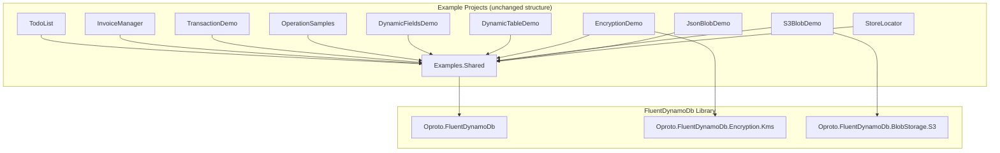

# Design Document: Example Projects Modernization

## Overview

This design covers the modernization of 11 existing example projects in the `examples/` directory to demonstrate recently added FluentDynamoDb features. The modernization is a code refactoring effort that updates entity definitions, Program.cs files, and adds new sample files to showcase the current recommended API surface.

The core constraint is **behavioral preservation**: after all changes, the examples must produce identical DynamoDB data shapes and pass existing tests. The modernization touches entity attributes, key construction in Put operations, encryption configuration, blob provider setup, and introduces new sample files for KeyInputMode, typed overloads, and computed field updates.

### Design Decisions

1. **Incremental approach**: Each requirement maps to an isolated set of file changes. Projects can be modernized independently without cross-project dependencies.
2. **New files over large rewrites**: Requirements 5, 6, and 8 introduce new sample files rather than heavily modifying existing code, minimizing regression risk.
3. **Comments as documentation**: Each modernization change includes inline comments explaining the new pattern, serving as living documentation for users.
4. **Schema version in AssemblyInfo.cs**: Rather than cluttering Program.cs (which already has top-level statements), the schema version attribute goes in a dedicated `AssemblyInfo.cs` file per project.

## Architecture

The modernization does not change the architectural structure of the examples. Each example project remains a standalone .NET 8 console application referencing `Examples.Shared` for DynamoDB Local setup utilities.



### Change Categories

| Category | Projects Affected | Nature of Change |
|----------|------------------|-----------------|
| Auto Key Mode (Req 1) | InvoiceManager, TransactionDemo, OperationSamples | Modify Put operations in Program.cs / sample files |
| Discriminator Removal (Req 2) | InvoiceManager, TransactionDemo | Modify entity `[DynamoDbTable]` attributes |
| Per-Property Key Aliases (Req 3) | EncryptionDemo | Modify entity attributes + Program.cs resolver config |
| Named Blob Providers (Req 4) | S3BlobDemo | New entity or extended entity + Program.cs config |
| KeyInputMode (Req 5) | OperationSamples | New sample file: `KeyInputModeSamples.cs` |
| Typed Overloads (Req 6) | OperationSamples | New entity + new sample file |
| Schema Version (Req 7) | All 10 projects with entities | New `AssemblyInfo.cs` per project |
| Computed Field Updates (Req 8) | OperationSamples | Extended entity + new sample file |
| Preserve Functionality (Req 9) | All | Build + test verification |

## Components and Interfaces

### Requirement 1: Auto Key Mode for Put Operations

**Affected files:**
- `examples/InvoiceManager/Program.cs` — Remove `Customer.Keys.Pk()`, `Invoice.Keys.Pk()`, `Invoice.Keys.Sk()`, `InvoiceLine.Keys.Pk()` from Put operations
- `examples/TransactionDemo/TransactionComparison.cs` — Remove `Account.Keys.Pk()`, `TransactionRecord.Keys.Pk()` from Put operations
- `examples/OperationSamples/Samples/PutSamples.cs` — Remove `Order.Keys.Pk()` from Put example entities

**Pattern:**
```csharp
// Before:
var customer = new Customer
{
    Pk = Customer.Keys.Pk(customerId),  // Manual prefix application
    Sk = Customer.ProfileSk,
    ...
};

// After:
var customer = new Customer
{
    Pk = customerId,  // Auto key mode applies "CUSTOMER#" prefix during serialization
    Sk = Customer.ProfileSk,
    ...
};
```

**Key constraint:** Sort keys constructed from multiple segments (e.g., `$"INVOICE#{invoiceNumber}#LINE#{lineNumber}"` or `$"TXN#{timestamp}#{txnId}"`) are NOT changed because auto key mode only applies single-value prefix mappings. Get/Delete/Update operations continue using `Entity.Keys.Pk(value)`.

### Requirement 2: Discriminator Removal

**Affected entity files:**
| Entity | File | Current Config | After |
|--------|------|---------------|-------|
| Invoice | `InvoiceManager/Entities/Invoice.cs` | `DiscriminatorProperty = "sk", DiscriminatorPattern = "INVOICE#*"` | Removed (auto-derived from `[SortKey(Prefix = "INVOICE")]`) |
| InvoiceLine | `InvoiceManager/Entities/InvoiceLine.cs` | `DiscriminatorProperty = "sk", DiscriminatorPattern = "INVOICE#*#LINE#*"` | Removed (auto-derived from hierarchical key composition) |
| Customer | `InvoiceManager/Entities/Customer.cs` | `DiscriminatorProperty = "sk", DiscriminatorValue = "PROFILE"` | Removed (auto-derived from constant SK value) |
| Account | `TransactionDemo/Entities/Account.cs` | `DiscriminatorProperty = "sk", DiscriminatorValue = "PROFILE"` | Removed (auto-derived from constant SK value) |
| TransactionRecord | `TransactionDemo/Entities/TransactionRecord.cs` | `DiscriminatorProperty = "sk", DiscriminatorPattern = "TXN#*"` | Removed (auto-derived from `[SortKey(Prefix = "TXN")]`) |
| FinancialTransaction | `TransactionDemo/Entities/FinancialTransaction.cs` | `DiscriminatorProperty = "sk", DiscriminatorPattern = "FIN#*"` | Removed (auto-derived from `[SortKey(Prefix = "FIN")]`) |

**Pattern:**
```csharp
// Before:
[DynamoDbTable("invoices", IsDefault = true,
    DiscriminatorProperty = "sk",
    DiscriminatorPattern = "INVOICE#*")]
public partial class Invoice { ... }

// After:
/// <summary>
/// ... Discriminator pattern "INVOICE#*" is auto-derived from the [SortKey(Prefix = "INVOICE")]
/// attribute by the source generator.
/// </summary>
[DynamoDbTable("invoices", IsDefault = true)]
public partial class Invoice { ... }
```

### Requirement 3: Per-Property Key Aliases

**Affected files:**
- `examples/EncryptionDemo/Entities/SecureRecord.cs` — Add `KeyAlias` to `[Encrypted]` attributes
- `examples/EncryptionDemo/Program.cs` — Update `DefaultKmsKeyResolver` constructor with `aliasKeyMap`

**Entity change:**
```csharp
[Encrypted(KeyAlias = "pii")]
[DynamoDbAttribute("ssn")]
public string SocialSecurityNumber { get; set; } = string.Empty;

[Encrypted(KeyAlias = "financial")]
[Sensitive]
[DynamoDbAttribute("creditCard")]
public string CreditCardNumber { get; set; } = string.Empty;
```

**Resolver configuration:**
```csharp
// Resolution priority: alias map → context map → default key
var aliasKeyMap = new Dictionary<string, string>
{
    ["pii"] = kmsKeyArn,        // In real apps, each alias maps to a different key
    ["financial"] = kmsKeyArn   // Using same key for demo simplicity
};
var keyResolver = new DefaultKmsKeyResolver(kmsKeyArn, aliasKeyMap: aliasKeyMap);
```

### Requirement 4: Named Blob Providers

**Affected files:**
- `examples/S3BlobDemo/Entities/MediaItem.cs` — Add two new `[BlobStorage(Provider = "...")]` properties
- `examples/S3BlobDemo/Program.cs` — Register named providers via `WithBlobStorage(name, provider)`

**New properties on MediaItem (or a new entity):**
```csharp
// Default provider (no Provider parameter) — uses the default registered provider
[BlobStorage]
[DynamoDbAttribute("dataRef")]
public string DataReference { get; set; } = string.Empty;

// Named provider "images" — routes to the images bucket/provider
[BlobStorage(Provider = "images")]
[DynamoDbAttribute("thumbnailRef")]
public BlobData<byte[]> Thumbnail { get; set; }

// Named provider "documents" — routes to the documents bucket/provider
[BlobStorage(Provider = "documents")]
[DynamoDbAttribute("attachmentRef")]
public BlobData<byte[]> Attachment { get; set; }
```

**Options configuration:**
```csharp
var options = new FluentDynamoDbOptions()
    .WithBlobStorage(defaultProvider)                    // Default for [BlobStorage] without Provider
    .WithBlobStorage("images", imagesBucketProvider)     // For [BlobStorage(Provider = "images")]
    .WithBlobStorage("documents", docsBucketProvider);   // For [BlobStorage(Provider = "documents")]
```

### Requirement 5: KeyInputMode Samples

**New file:** `examples/OperationSamples/Samples/KeyInputModeSamples.cs`

Demonstrates `KeyInputMode.Raw` and `KeyInputMode.Auto` using the same logical entity key (same Order entity used by existing samples):

```csharp
// KeyInputMode.Auto — detects prefix is absent, prepends "ORDER#" automatically
var order1 = await table.Orders.Get("12345", "META", KeyInputMode.Auto).GetItemAsync();

// KeyInputMode.Raw — value is used as-is, must include prefix
var order2 = await table.Orders.Get("ORDER#12345", "META", KeyInputMode.Raw).GetItemAsync();

// Both retrieve the same item
```

### Requirement 6: Typed Convenience Overloads

**New files:**
- `examples/OperationSamples/Models/ScheduledEvent.cs` — Entity with `[Computed]` PK from Year, Month, Day
- `examples/OperationSamples/Samples/TypedOverloadSamples.cs` — Demonstrates typed Get, Delete, Update

**Entity definition:**
```csharp
[DynamoDbTable("Orders")]
[GenerateEntityProperty(Name = "ScheduledEvents")]
public partial class ScheduledEvent
{
    [PartitionKey]
    [DynamoDbAttribute("pk")]
    [Computed("Year", "Month", "Day", Separator = "#")]
    public string Pk { get; set; } = string.Empty;

    [SortKey]
    [DynamoDbAttribute("sk")]
    public string Sk { get; set; } = string.Empty;

    [Extracted("Pk", 0)]
    [DynamoDbAttribute("year")]
    public int Year { get; set; }

    [Extracted("Pk", 1)]
    [DynamoDbAttribute("month")]
    public int Month { get; set; }

    [Extracted("Pk", 2)]
    [DynamoDbAttribute("day")]
    public int Day { get; set; }

    [DynamoDbAttribute("title")]
    public string Title { get; set; } = string.Empty;
}
```

### Requirement 7: Schema Version Attribute

**New file per project:** `AssemblyInfo.cs`

```csharp
using Oproto.FluentDynamoDb.Attributes;

// Schema versions decouple generated code shape from NuGet package version.
// Pinning the version ensures upgrading the package won't change generated patterns
// until you explicitly bump this value.
[assembly: FluentDynamoDbSchemaVersion(1, 0)]
```

Applied to all 10 projects containing `[DynamoDbTable]` entities: TodoList, InvoiceManager, TransactionDemo, OperationSamples, DynamicFieldsDemo, DynamicTableDemo, EncryptionDemo, S3BlobDemo, JsonBlobDemo, StoreLocator.

### Requirement 8: Computed Field Update Model

**Extended entity or new entity in OperationSamples** with a non-key computed field (e.g., GSI partition key computed from Category + Region):

```csharp
[DynamoDbTable("Orders")]
public partial class CatalogItem
{
    [PartitionKey]
    [DynamoDbAttribute("pk")]
    public string Pk { get; set; } = string.Empty;

    [SortKey]
    [DynamoDbAttribute("sk")]
    public string Sk { get; set; } = string.Empty;

    [DynamoDbAttribute("category")]
    [Extracted("Gsi1Pk", 0)]
    public string Category { get; set; } = string.Empty;

    [DynamoDbAttribute("region")]
    [Extracted("Gsi1Pk", 1)]
    public string Region { get; set; } = string.Empty;

    // Non-key computed field: GSI partition key computed from Category + Region
    [GsiPartitionKey("category-region-index")]
    [DynamoDbAttribute("gsi1pk")]
    [Computed("Category", "Region", Separator = "#")]
    public string Gsi1Pk { get; set; } = string.Empty;

    [DynamoDbAttribute("title")]
    public string Title { get; set; } = string.Empty;
}
```

**New file:** `examples/OperationSamples/Samples/ComputedFieldUpdateSamples.cs`

```csharp
// Non-key computed fields are recomputed automatically from source property values.
// Setting Category and Region in the update model triggers the expression translator
// to produce a SET expression targeting gsi1pk with the concatenated value.
await table.CatalogItems.Update(pk, sk)
    .Set(x => new CatalogItemUpdateModel
    {
        Category = "electronics",
        Region = "us-west-2"
    })
    .UpdateAsync();
// Result: gsi1pk = "electronics#us-west-2", category = "electronics", region = "us-west-2"
```

## Data Models

No new DynamoDB tables are created. The existing tables used by examples remain unchanged:

| Table | Used By | Key Schema |
|-------|---------|-----------|
| `todo-items` | TodoList | PK only |
| `invoices` | InvoiceManager | PK + SK |
| `transaction-demo` | TransactionDemo | PK + SK |
| `Orders` | OperationSamples | PK + SK |
| `products` | DynamicFieldsDemo | PK + SK |
| `dynamic-table-demo` | DynamicTableDemo | PK + SK |
| `encryption-demo` | EncryptionDemo | PK only |
| `s3-blob-demo` | S3BlobDemo | PK only |
| `json-blob-demo` | JsonBlobDemo | PK only |
| `stores-h3` / `stores-s2` | StoreLocator | PK + SK + GSIs |

New entities added to OperationSamples (`ScheduledEvent`, `CatalogItem`) reuse the existing `Orders` table with separate entity accessors.

## Correctness Properties

This feature is a code modernization/refactoring effort, not the implementation of new algorithmic logic. There is no meaningful input space to generate random values against — the correctness criteria are binary (either the refactored code is equivalent to the original, or it isn't). Property-based testing does not apply here.

Instead, correctness is verified through the following invariants that must hold after all modernization changes:

### Property 1: Build Correctness

All 10 example projects (TodoList, InvoiceManager, TransactionDemo, OperationSamples, DynamicFieldsDemo, DynamicTableDemo, EncryptionDemo, S3BlobDemo, JsonBlobDemo, StoreLocator) SHALL compile with zero errors after modernization. A successful `dotnet build examples/` is the verification mechanism.

**Validates: Requirements 9.1**

### Property 2: Data Shape Preservation

DynamoDB attribute names, key formats (partition key and sort key string values including prefix and separator characters), and prefix patterns (e.g., "CUSTOMER#", "INVOICE#", "ORDER#") SHALL be identical before and after modernization for all Put and Update operations. The `[DynamoDbAttribute]` names and `[PartitionKey(Prefix = ...)]` / `[SortKey(Prefix = ...)]` values must remain unchanged.

**Validates: Requirements 9.2, 9.5**

### Property 3: Behavioral Equivalence

All existing xUnit tests in the Examples.Tests project SHALL pass without modification to test assertions. This confirms that the runtime behavior of the modernized code is functionally equivalent to the original.

**Validates: Requirements 9.3**

## Error Handling

No new error handling patterns are introduced. The modernization preserves all existing error handling:

- **Build errors from incorrect discriminator removal**: The source generator emits diagnostics (FDDB100-103) if auto-derived patterns conflict. Build failure is the signal.
- **Runtime encryption errors**: If KMS key ARN is invalid with per-property aliases, the `DefaultKmsKeyResolver` still resolves gracefully (falls through to default key).
- **Named blob provider not registered**: Throws `InvalidOperationException` at runtime if a `[BlobStorage(Provider = "name")]` references an unregistered provider. The S3BlobDemo handles this by ensuring providers are registered before table construction.
- **KeyInputMode.Raw with wrong value**: Passing a non-prefixed key with `KeyInputMode.Raw` results in a DynamoDB error (item not found). The sample demonstrates this contrast explicitly.

## Testing Strategy

### Why PBT Does Not Apply

This feature is a **code modernization/refactoring effort**, not the implementation of new algorithmic logic. The acceptance criteria are:
- "Does the code compile?" (build verification)
- "Does the code produce the same DynamoDB data shapes?" (integration test)
- "Are comments present?" (static analysis/code review)

There is no meaningful input space to generate random values against. The correctness property is binary: either the refactored code produces identical behavior to the original, or it doesn't. Existing integration tests are the correct verification mechanism.

### Testing Approach

**Build Verification (all requirements):**
```bash
dotnet build examples/
```
Zero errors across all projects confirms:
- Discriminator auto-derivation is working (Req 2)
- Schema version attribute is correctly placed (Req 7)
- New entities with `[Computed]`/`[Extracted]` are valid (Req 6, 8)
- `[Encrypted(KeyAlias = ...)]` compiles (Req 3)
- `[BlobStorage(Provider = ...)]` compiles (Req 4)
- KeyInputMode parameter overloads exist (Req 5)

**Integration Tests (Req 9.2, 9.3):**
```bash
dotnet test Examples.Tests/
```
Existing xUnit tests against DynamoDB Local verify behavioral preservation. All existing test assertions must pass without modification.

**Manual Verification:**
- Run each console app against DynamoDB Local to confirm interactive functionality (Req 9.4)
- Spot-check inline comments on modified code (Req 1.4, 3.4, 5.3, etc.)

### Unit Tests for New Samples

New sample files (KeyInputModeSamples, TypedOverloadSamples, ComputedFieldUpdateSamples) should have corresponding tests added to `Examples.Tests` that:
1. Seed test data via the new entities
2. Execute each demonstrated operation
3. Assert the expected results match

These are **example-based unit tests** (not property tests) since each sample demonstrates a specific concrete scenario.
