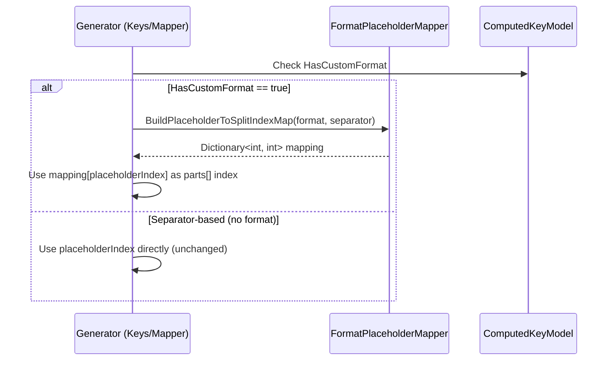

# Bugfix Design: Extract Components Naive Split Indexing Fix

## Overview

For entities using `[Computed(..., Format = "...")]` with constant literal segments in the format string, the generated `Extract{Property}Components()` methods and `FromDynamoDb` hydration code return wrong values. The fix introduces a shared `FormatPlaceholderMapper` utility that parses format strings to build a mapping from placeholder index to split index, then both `KeysGenerator` and `MapperGenerator` use this mapping when `HasCustomFormat == true`. Separator-based keys (no format string) are unaffected.

## Glossary

- **Placeholder Index**: The integer N in a .NET format placeholder `{N}` or `{N:format}` — represents the position in the source properties array
- **Split Index**: The zero-based position of a segment after splitting a string on the separator character
- **Custom Format**: A computed key defined with `Format = "..."` containing constant literal segments and `{N}` placeholders (i.e., `HasCustomFormat == true`)
- **Separator-Based Key**: A computed key defined with `Separator = "..."` and multiple source properties but no `Format` — all segments are variable values

## Bug Details

For entities using `[Computed(..., Format = "...")]` with constant literal segments in the format string, the generated `Extract{Property}Components()` methods and `FromDynamoDb` hydration code return wrong values. They use the `[Extracted]` attribute's `Index` (the placeholder position like `{0}`) directly as the array index into `parts[]` after splitting on the separator.

This is only correct when there are no constant segments. When the format string has constant segments (e.g., `"TENANT#{0}#EXTERNAL_ACCESS"`), the split produces `["TENANT", "myValue", "EXTERNAL_ACCESS"]` and `parts[0]` returns `"TENANT"` instead of `"myValue"`.

**Affected code paths:**
1. `KeysGenerator.GenerateExtractionHelper()` (~line 134) — generates `Extract{Property}Components()` static methods
2. `MapperGenerator.GenerateExtractedKeyLogic()` (~line 5826) — generates `FromDynamoDb` property hydration

**Root cause**: Both methods index into the split array using `ExtractedKey.Index` (the placeholder index from `{N}`) without accounting for constant segments that shift the actual positions in the split array.

### Affected Pattern Examples

| Format String | Key Value | Split Result | `parts[0]` returns | Expected |
|---|---|---|---|---|
| `TENANT#{0}#EXTERNAL_ACCESS` | `TENANT#val#EXTERNAL_ACCESS` | `["TENANT", "val", "EXTERNAL_ACCESS"]` | `"TENANT"` ❌ | `"val"` |
| `TENANT#{0}#SHARE#RESOURCE#{1}#{2}` | `TENANT#t1#SHARE#RESOURCE#r1#r2` | `["TENANT", "t1", "SHARE", "RESOURCE", "r1", "r2"]` | `"TENANT"` ❌ | `"t1"` |
| `CAP#{0}#{1}` | `CAP#svc1#cap1` | `["CAP", "svc1", "cap1"]` | `"CAP"` ❌ | `"svc1"` |
| `SEQ#{0:D4}` | `SEQ#0007` | `["SEQ", "0007"]` | `"SEQ"` ❌ | `"0007"` |

## Expected Behavior

When the source property has `ComputedKey.HasCustomFormat == true`, the generator must parse the format string to determine the actual split index for each `{N}` placeholder:

1. Split the format string on the separator character
2. For each segment, check if it matches `{N}` or `{N:format}` (a regex like `^\{(\d+)(?::.*?)?\}$`)
3. Build a `Dictionary<int, int>` mapping placeholder index → split position
4. Use this mapping instead of the raw `ExtractedKey.Index` when generating `parts[...]` indexing

For separator-based keys (no format string, `HasCustomFormat == false`), the behavior is unchanged — placeholder indices already equal split indices because all segments are variables.

### Mapping Examples

```
Format: "TENANT#{0}#EXTERNAL_ACCESS"
Split on '#': ["TENANT", "{0}", "EXTERNAL_ACCESS"]
Mapping: {0}→1

Format: "TENANT#{0}#SHARE#RESOURCE#{1}#{2}"
Split on '#': ["TENANT", "{0}", "SHARE", "RESOURCE", "{1}", "{2}"]
Mapping: {0}→1, {1}→4, {2}→5

Format: "SEQ#{0:D4}"
Split on '#': ["SEQ", "{0:D4}"]
Mapping: {0}→1
```

## Hypothesized Root Cause

In `KeysGenerator.GenerateExtractionHelper()`, the generated code does:

```csharp
var parts = pk.Split('#');
return parts[{extractedProperty.ExtractedKey.Index}]; // Index is placeholder position, NOT split index
```

The `ExtractedKey.Index` comes from the `[Extracted("Pk", 0)]` attribute — it's the placeholder index (`{0}`), meaning "the first variable". But `parts[]` after splitting contains **all** segments — both constant literals and variable values. The code assumes a 1:1 mapping between placeholder indices and split indices, which is only true for separator-based computed keys where every segment is a variable.

The same bug exists in `MapperGenerator.GenerateExtractedKeyLogic()`:

```csharp
var pkParts = entity.Pk.Split('#');
entity.PkTenantId = pkParts[{index}]; // Same wrong index
```

The forward path (`Keys.Pk()`) uses `string.Format("TENANT#{0}#EXTERNAL_ACCESS", value)` which correctly places the variable value at the `{0}` position. The reverse path doesn't parse the format string at all — it just splits and uses the placeholder index as the array index.

## Fix Implementation

### Approach: Shared Utility with Format String Parsing



### Step 1: Add `FormatPlaceholderMapper` Utility

Create `Oproto.FluentDynamoDb.SourceGenerator/Utilities/FormatPlaceholderMapper.cs`:

```csharp
internal static class FormatPlaceholderMapper
{
    private static readonly Regex PlaceholderPattern =
        new Regex(@"^\{(\d+)(?::.*?)?\}$", RegexOptions.Compiled);

    public static Dictionary<int, int> BuildPlaceholderToSplitIndexMap(string format, char separator)
    {
        var segments = format.Split(separator);
        var mapping = new Dictionary<int, int>();

        for (int i = 0; i < segments.Length; i++)
        {
            var match = PlaceholderPattern.Match(segments[i]);
            if (match.Success)
            {
                var placeholderIndex = int.Parse(match.Groups[1].Value);
                mapping[placeholderIndex] = i;
            }
        }

        return mapping;
    }

    public static int GetSplitIndex(string format, char separator, int placeholderIndex)
    {
        var mapping = BuildPlaceholderToSplitIndexMap(format, separator);
        return mapping.TryGetValue(placeholderIndex, out var splitIndex) ? splitIndex : placeholderIndex;
    }
}
```

### Step 2: Fix `KeysGenerator.GenerateExtractionHelper()`

In the method, after resolving the source property, add a branch for `HasCustomFormat`:

```csharp
// Existing: var index = extractedProperty.ExtractedKey!.Index;
// New: resolve the actual split index
Dictionary<int, int>? placeholderMapping = null;
if (sourceProperty.ComputedKey?.HasCustomFormat == true)
{
    placeholderMapping = FormatPlaceholderMapper.BuildPlaceholderToSplitIndexMap(
        sourceProperty.ComputedKey.Format!, separator[0]);
}

// For single return:
var splitIndex = placeholderMapping != null
    ? placeholderMapping[extractedProperty.ExtractedKey!.Index]
    : extractedProperty.ExtractedKey!.Index;

// For tuple return:
var returnValues = returnProperties.Select(p =>
{
    var idx = placeholderMapping != null
        ? placeholderMapping[p.ExtractedKey!.Index]
        : p.ExtractedKey!.Index;
    return $"{p.PropertyName}: {GetExtractionExpression($"parts[{idx}]", p.PropertyType, p.IsEnum)}";
});
```

### Step 3: Fix `MapperGenerator.GenerateExtractedKeyLogic()`

The method signature needs the entity's properties (or the source property) to check `HasCustomFormat`. Either:
- Pass the `EntityModel` as an additional parameter, or
- Pass the source `PropertyModel` directly

Then use the mapping when `HasCustomFormat == true`:

```csharp
var actualIndex = index; // default: placeholder index
if (sourcePropertyModel?.ComputedKey?.HasCustomFormat == true)
{
    actualIndex = FormatPlaceholderMapper.GetSplitIndex(
        sourcePropertyModel.ComputedKey.Format!, separator[0], index);
}
// Use actualIndex instead of index for parts[] access and bounds check
```

## Testing Strategy

### Bug Condition Tests (Task 1)
- Construct `EntityModel` objects with custom format strings and extracted properties
- Call `KeysGenerator.GenerateKeysClass()` and `MapperGenerator.GenerateEntityImplementation()`
- Assert the generated C# source contains the correct split indices (not placeholder indices)
- These tests MUST FAIL on unfixed code

### Preservation Tests (Task 2)
- Construct `EntityModel` objects with separator-based computed keys (no format)
- Assert the generated code uses placeholder indices directly (unchanged behavior)
- These tests MUST PASS on both unfixed and fixed code

### Utility Tests (Task 4)
- Test `FormatPlaceholderMapper.BuildPlaceholderToSplitIndexMap()` with various format strings
- Cover: leading constants, interspersed constants, format specifiers, no constants

## Correctness Properties

*A property is a characteristic or behavior that should hold true across all valid executions of a system — essentially, a formal statement about what the system should do. Properties serve as the bridge between human-readable specifications and machine-verifiable correctness guarantees.*

### Property 1: Bug Condition — Format-string extraction uses placeholder index as split index

*For any* computed key with `HasCustomFormat == true` and constant literal segments in the format string, the generated `Extract{Property}Components()` method and `FromDynamoDb` hydration code use `parts[placeholderIndex]` which returns constant literal values instead of the actual variable values.

**Validates: Requirements 1.1, 1.2, 1.3, 1.4**

### Property 2: Placeholder-to-split-index mapping correctness

*For any* valid format string containing placeholder patterns `{N}` or `{N:format}` interspersed with constant segments, splitting the format string on the separator and identifying placeholder positions produces a mapping where each placeholder index N maps to the correct split position, such that `formatSegments[mapping[N]]` matches `{N}` or `{N:format}`.

**Validates: Requirements 2.1, 2.2, 2.3**

### Property 3: Separator-based extraction is unchanged

*For any* computed key with `HasCustomFormat == false` (separator-based, no format string), the generated extraction code continues to use the placeholder index directly as the split index, producing identical output to the unfixed code.

**Validates: Requirements 3.1, 3.2, 3.3, 3.4, 3.5**

### Property 4: Bounds validation uses correct max split index

*For any* computed key with custom format and multiple extracted properties, the generated bounds check `parts.Length <= N` uses the maximum *split index* (from the mapping), not the maximum *placeholder index*, ensuring the guard correctly validates array bounds for format strings with interspersed constants.

**Validates: Requirements 2.4**
