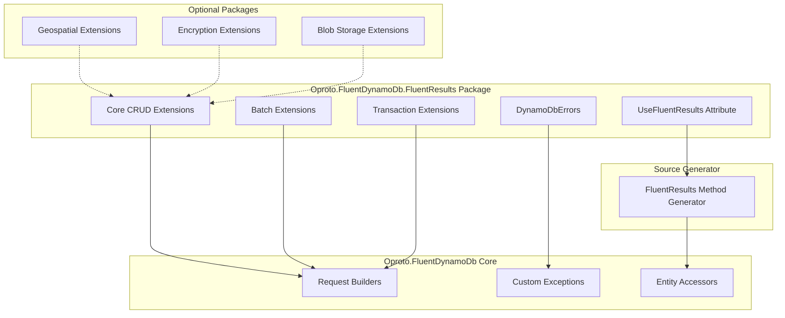
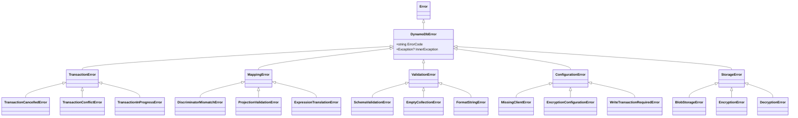

# Design Document: Comprehensive FluentResults API Integration

## Overview

This design document describes the comprehensive integration of FluentResults with Oproto.FluentDynamoDb, providing a complete Result<T> pattern alternative to the traditional async/exception-based API. The implementation uses a combination of:

1. **Extension methods** in the FluentResults package for all builder operations
2. **Source generation** via `[UseFluentResults]` attribute for convenience methods on entity accessors
3. **Standardized error types** that map all library exceptions to typed FluentResults errors

The design prioritizes:
- **Minimal dependencies**: FluentResults package only depends on core Oproto.FluentDynamoDb
- **Opt-in experience**: Developers choose to use FluentResults via attribute or explicit extension method calls
- **Comprehensive coverage**: All async operations have Result-returning equivalents
- **Type-safe error handling**: All exceptions map to specific error types with relevant context

## Architecture



## Components and Interfaces

### 1. DynamoDbErrors Class

The central error factory that maps all exceptions to typed FluentResults errors.

```csharp
namespace Oproto.FluentDynamoDb.FluentResults;

public static class DynamoDbErrors
{
    /// <summary>
    /// Converts any exception to an appropriate DynamoDbError.
    /// </summary>
    public static DynamoDbError FromException(Exception ex);
}

/// <summary>
/// Base class for all DynamoDB-related errors.
/// </summary>
public abstract class DynamoDbError : Error
{
    public abstract string ErrorCode { get; }
    public Exception? InnerException { get; }
}
```

### 2. Error Type Hierarchy



### 3. Extension Method Pattern

All FluentResults extensions follow a consistent pattern:

```csharp
public static class FluentResultsExtensions
{
    public static async Task<Result<T?>> GetItemAsyncResult<T>(
        this GetItemRequestBuilder<T> builder,
        CancellationToken cancellationToken = default)
        where T : class, IDynamoDbEntity
    {
        try
        {
            var entity = await builder.GetItemAsync(cancellationToken);
            return Result.Ok(entity);
        }
        catch (OperationCanceledException)
        {
            throw; // Re-throw cancellation without wrapping
        }
        catch (Exception ex)
        {
            return Result.Fail<T?>(DynamoDbErrors.FromException(ex));
        }
    }
}
```

### 4. UseFluentResults Attribute

```csharp
namespace Oproto.FluentDynamoDb.Attributes;

/// <summary>
/// Enables FluentResults API generation for the decorated entity or table.
/// </summary>
[AttributeUsage(AttributeTargets.Class, AllowMultiple = false)]
public sealed class UseFluentResultsAttribute : Attribute
{
    /// <summary>
    /// When true (default), suppresses generation of traditional async methods.
    /// When false, generates both traditional async and Result-returning methods.
    /// </summary>
    public bool HideGeneratedAsyncMethods { get; set; } = true;
}
```

### 5. Generated Convenience Methods

When `[UseFluentResults]` is applied, the source generator creates:

```csharp
// Generated on entity accessor
public partial class UserAccessor
{
    // Result-returning convenience methods
    public Task<Result<User?>> GetAsyncResult(string pk, CancellationToken ct = default)
        => Get(pk).GetItemAsyncResult(ct);
    
    public Task<Result> PutAsyncResult(User entity, CancellationToken ct = default)
        => Put(entity).PutAsyncResult(ct);
    
    public Task<Result> DeleteAsyncResult(string pk, CancellationToken ct = default)
        => Delete(pk).DeleteAsyncResult(ct);
    
    public Task<Result<List<User>>> QueryAsyncResult(
        Expression<Func<User, bool>> predicate, 
        CancellationToken ct = default)
        => Query().Where(predicate).ToListAsyncResult(ct);
}
```

## Data Models

### Error Types with Context

```csharp
public class TransactionCancelledError : TransactionError
{
    public override string ErrorCode => "TRANSACTION_CANCELLED";
    public IReadOnlyList<string> CancellationReasons { get; }
}

public class MappingError : DynamoDbError
{
    public override string ErrorCode => "MAPPING_ERROR";
    public string? EntityType { get; }
    public string? FieldName { get; }
}

public class SchemaValidationError : ValidationError
{
    public override string ErrorCode => "SCHEMA_VALIDATION_FAILED";
    public IReadOnlyList<string> ValidationErrors { get; }
}

public class EncryptionError : StorageError
{
    public override string ErrorCode => "ENCRYPTION_FAILED";
    public string? FieldName { get; }
    public string? ContextId { get; }
    public string? KeyArn { get; }
}

public class OperationLimitExceededError : ConfigurationError
{
    public override string ErrorCode => "OPERATION_LIMIT_EXCEEDED";
    public int Limit { get; }
    public int ActualCount { get; }
}
```

## Correctness Properties

*A property is a characteristic or behavior that should hold true across all valid executions of a system-essentially, a formal statement about what the system should do. Properties serve as the bridge between human-readable specifications and machine-verifiable correctness guarantees.*

### Property 1: Exception to Error Mapping Completeness
*For any* exception thrown by a DynamoDB operation, calling DynamoDbErrors.FromException SHALL return a non-null DynamoDbError with a non-empty ErrorCode.
**Validates: Requirements 1.2, 1.4**

### Property 2: Result Success Preserves Value
*For any* successful DynamoDB operation, the Result-returning extension method SHALL return Result.Ok with the same value as the traditional async method would return.
**Validates: Requirements 2.1-2.6, 3.1-3.3**

### Property 3: Result Failure Contains Error
*For any* failed DynamoDB operation (exception thrown), the Result-returning extension method SHALL return Result.Fail with a DynamoDbError containing the original exception.
**Validates: Requirements 2.7, 4.5, 6.3-6.5, 7.4**

### Property 4: Cancellation Token Passthrough
*For any* Result-returning extension method, when the CancellationToken is cancelled, the method SHALL throw OperationCanceledException without wrapping it in a Result.
**Validates: Requirements 12.1**

### Property 5: Error Type Specificity
*For any* specific exception type (e.g., TransactionCanceledException, ConditionalCheckFailedException), DynamoDbErrors.FromException SHALL return the corresponding specific error type (e.g., TransactionCancelledError, OptimisticLockingError).
**Validates: Requirements 1.3, 14.1-14.17**

### Property 6: Batch Unprocessed Items Warning
*For any* batch operation that completes with unprocessed items, the Result SHALL be successful AND contain warnings about the unprocessed items.
**Validates: Requirements 5.4**

### Property 7: Error Aggregation Ordering
*For any* batch or transaction operation with multiple failures, the errors in the Result SHALL be in the same order as the corresponding operations in the request.
**Validates: Requirements 11.1-11.3**

### Property 8: Blob Storage Error Context
*For any* blob storage operation failure, the BlobStorageError SHALL contain the blob key and operation type.
**Validates: Requirements 4.5**

### Property 9: Encryption Error Context
*For any* encryption operation failure, the EncryptionError SHALL contain the field name and context ID.
**Validates: Requirements 16.1-16.3**

## Error Handling

### Exception Mapping Strategy

The `DynamoDbErrors.FromException` method uses pattern matching to map exceptions:

```csharp
public static DynamoDbError FromException(Exception ex) => ex switch
{
    // AWS SDK DynamoDB Exceptions
    TransactionCanceledException tce => new TransactionCancelledError(tce),
    TransactionConflictException => new TransactionConflictError(),
    TransactionInProgressException => new TransactionInProgressError(),
    ConditionalCheckFailedException => new OptimisticLockingError(),
    ProvisionedThroughputExceededException => new ProvisionedThroughputExceededError(),
    RequestLimitExceededException => new RequestLimitExceededError(),
    ResourceNotFoundException => new ResourceNotFoundError(),
    IdempotentParameterMismatchException => new IdempotencyError(),
    ItemCollectionSizeLimitExceededException => new CollectionSizeLimitError(),
    LimitExceededException => new LimitExceededError(),
    
    // Custom Library Exceptions
    DynamoDbMappingException mex => new MappingError(mex),
    SchemaValidationException svex => new SchemaValidationError(svex),
    ExpressionTranslationException etex => new ExpressionTranslationError(etex),
    BlobStorageException bsex => new BlobStorageError(bsex),
    FieldEncryptionException feex => new EncryptionError(feex),
    StreamProcessingException spex => new StreamProcessingError(spex),
    DiscriminatorMismatchException dmex => new DiscriminatorMismatchError(dmex),
    ProjectionValidationException pvex => new ProjectionValidationError(pvex),
    
    // InvalidOperationException with specific messages
    InvalidOperationException ioe when ioe.Message.Contains("RequireWriteTransaction") 
        => new WriteTransactionRequiredError(ioe),
    InvalidOperationException ioe when ioe.Message.Contains("same DynamoDB client") 
        => new ClientMismatchError(ioe),
    InvalidOperationException ioe when ioe.Message.Contains("no operations") 
        => new EmptyOperationError(ioe),
    InvalidOperationException ioe when ioe.Message.Contains("maximum of") 
        => new OperationLimitExceededError(ioe),
    InvalidOperationException ioe when ioe.Message.Contains("No DynamoDB client") 
        => new MissingClientError(ioe),
    InvalidOperationException ioe when ioe.Message.Contains("Cannot mix") 
        => new UpdateExpressionConflictError(ioe),
    InvalidOperationException ioe when ioe.Message.Contains("encryption is required") 
        => new EncryptionConfigurationError(ioe),
    
    // ArgumentException cases
    ArgumentException aex when aex.Message.Contains("empty") 
        => new EmptyCollectionError(aex),
    FormatException fex => new FormatStringError(fex),
    
    // Service errors
    AmazonDynamoDBException dbEx when dbEx.StatusCode == HttpStatusCode.InternalServerError 
        => new ServiceError(dbEx),
    
    // Fallback
    _ => new UnexpectedError(ex)
};
```

## Testing Strategy

### Dual Testing Approach

The implementation uses both unit tests and property-based tests:

1. **Unit Tests**: Verify specific examples and edge cases
2. **Property-Based Tests**: Verify universal properties across all inputs

### Property-Based Testing Framework

Use **FsCheck** for property-based testing in C#:

```csharp
[Property(MaxTest = 100)]
public Property ExceptionToErrorMapping_AlwaysReturnsNonNullError()
{
    return Prop.ForAll(
        Arb.From<Exception>(),
        ex => DynamoDbErrors.FromException(ex) != null
    );
}
```

### Test Categories

1. **Error Mapping Tests**: Verify each exception type maps to correct error type
2. **Extension Method Tests**: Verify Result wrapping behavior
3. **Source Generator Tests**: Verify generated code correctness
4. **Integration Tests**: Verify end-to-end FluentResults usage

### Test Annotations

Each property-based test must be annotated with the property it validates:

```csharp
/// <summary>
/// **Feature: fluentresults-comprehensive-api, Property 1: Exception to Error Mapping Completeness**
/// </summary>
[Property(MaxTest = 100)]
public Property ExceptionMapping_AlwaysReturnsNonNullErrorWithCode() { ... }
```
