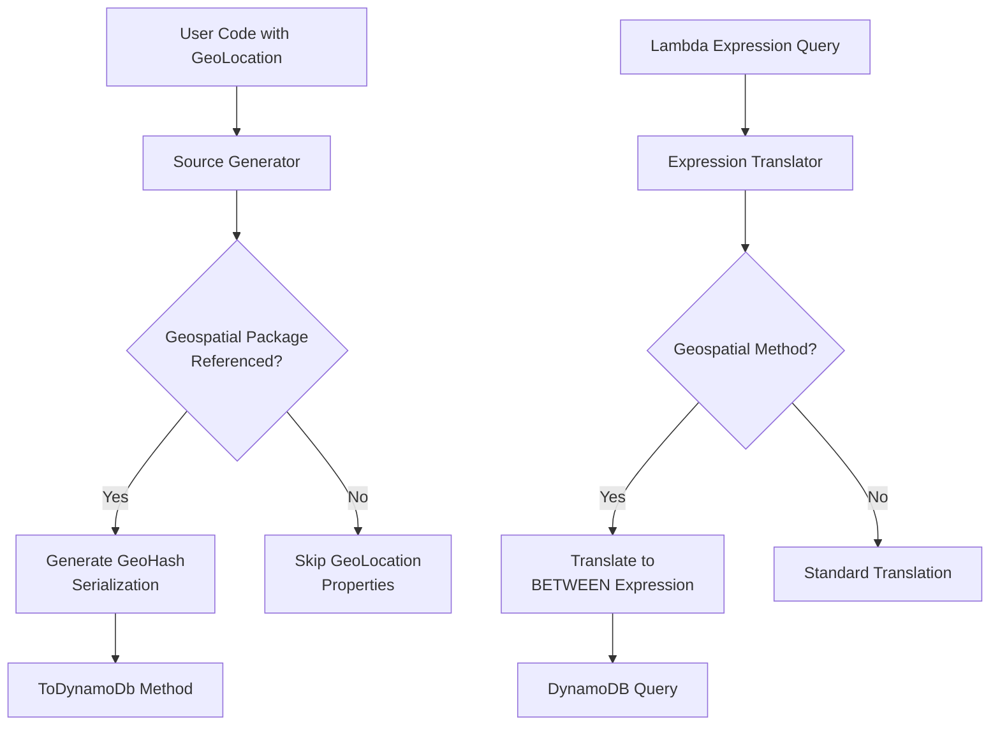

# Design Document

## Overview

This design document describes the architecture and implementation approach for adding geospatial query support to Oproto.FluentDynamoDb using GeoHash encoding. The feature will be delivered as a separate NuGet package (`Oproto.FluentDynamoDb.Geospatial`) that integrates seamlessly with the existing library infrastructure.

### Design Goals

1. **Optional Integration**: The main library functions without the geospatial package
2. **Type Safety**: Leverage C# type system for compile-time validation
3. **AOT Compatibility**: Ensure all code works with Native AOT compilation
4. **Extensibility**: Design namespace structure to support future encoding schemes (S2, H3)
5. **Performance**: Optimize for common query patterns in DynamoDB
6. **Developer Experience**: Provide intuitive APIs with clear error messages

### Key Design Decisions

1. **Custom GeoHash Implementation**: Implement GeoHash algorithm in-house rather than using external libraries to ensure AOT compatibility and full control
2. **Struct-Based Types**: Use readonly structs for GeoLocation, GeoBoundingBox, and GeoHashCell to minimize allocations
3. **Extension Method Pattern**: Use extension methods for encoding/decoding to keep types focused
4. **Conditional Compilation**: Use package detection in source generator to enable/disable geospatial features
5. **Default Precision of 6**: Balance between accuracy (~1.2km) and query efficiency

## Architecture

### Package Structure

```
Oproto.FluentDynamoDb.Geospatial/
├── GeoLocation.cs                    (Shared core type)
├── GeoBoundingBox.cs                 (Shared core type)
└── GeoHash/
    ├── GeoHashEncoder.cs             (Internal encoding logic)
    ├── GeoHashCell.cs                (GeoHash-specific cell type)
    ├── GeoHashExtensions.cs          (Encoding/decoding extensions)
    ├── GeoHashBoundingBoxExtensions.cs (Range calculation extensions)
    └── GeoHashQueryExtensions.cs     (Lambda expression query methods)
```


### Integration Points

The geospatial package integrates with the main library at three key points:

1. **Source Generator**: Detects package presence and generates GeoHash serialization code
2. **Expression Translator**: Recognizes geospatial extension methods and translates to DynamoDB expressions
3. **Attribute System**: Extends DynamoDbAttributeAttribute with GeoHashPrecision property



## Components and Interfaces

### 1. GeoLocation (Core Type)

**Purpose**: Represent a geographic coordinate with validation and distance calculations.

**Design Rationale**: 
- Readonly struct for value semantics and zero-allocation scenarios
- Implements IEquatable for proper equality comparisons
- Validation in constructor ensures invalid states are impossible
- Distance methods support both meters and kilometers for convenience

```csharp
namespace Oproto.FluentDynamoDb.Geospatial;

public readonly struct GeoLocation : IEquatable<GeoLocation>
{
    public double Latitude { get; }
    public double Longitude { get; }
    
    public GeoLocation(double latitude, double longitude)
    {
        if (latitude < -90 || latitude > 90)
            throw new ArgumentOutOfRangeException(nameof(latitude), 
                "Latitude must be between -90 and 90 degrees");
        if (longitude < -180 || longitude > 180)
            throw new ArgumentOutOfRangeException(nameof(longitude), 
                "Longitude must be between -180 and 180 degrees");
        
        Latitude = latitude;
        Longitude = longitude;
    }
    
    /// <summary>
    /// Calculates the distance to another location in meters using the Haversine formula.
    /// </summary>
    public double DistanceToMeters(GeoLocation other);
    
    /// <summary>
    /// Calculates the distance to another location in kilometers using the Haversine formula.
    /// </summary>
    public double DistanceToKilometers(GeoLocation other);
    
    /// <summary>
    /// Calculates the distance to another location in miles using the Haversine formula.
    /// </summary>
    public double DistanceToMiles(GeoLocation other);
    
    public bool IsValid();
    public bool Equals(GeoLocation other);
    public override bool Equals(object? obj);
    public override int GetHashCode();
    public override string ToString();
    public static bool operator ==(GeoLocation left, GeoLocation right);
    public static bool operator !=(GeoLocation left, GeoLocation right);
}
```


### 2. GeoBoundingBox (Core Type)

**Purpose**: Represent a rectangular geographic area for query operations.

**Design Rationale**:
- Readonly struct for value semantics
- Factory methods for common use cases (center + distance in various units)
- Contains method for post-query filtering

```csharp
namespace Oproto.FluentDynamoDb.Geospatial;

public readonly struct GeoBoundingBox
{
    public GeoLocation Southwest { get; }
    public GeoLocation Northeast { get; }
    public GeoLocation Center { get; }
    
    public GeoBoundingBox(GeoLocation southwest, GeoLocation northeast);
    
    /// <summary>
    /// Creates a bounding box from a center point and distance in meters.
    /// </summary>
    public static GeoBoundingBox FromCenterAndDistanceMeters(
        GeoLocation center, 
        double distanceMeters);
    
    /// <summary>
    /// Creates a bounding box from a center point and distance in kilometers.
    /// </summary>
    public static GeoBoundingBox FromCenterAndDistanceKilometers(
        GeoLocation center, 
        double distanceKilometers);
    
    /// <summary>
    /// Creates a bounding box from a center point and distance in miles.
    /// </summary>
    public static GeoBoundingBox FromCenterAndDistanceMiles(
        GeoLocation center, 
        double distanceMiles);
    
    public bool Contains(GeoLocation location);
}
```

**Distance to Bounding Box Conversion**:
The `FromCenterAndDistance*` methods use approximate calculations for speed:
- Latitude degree ≈ 111,320 meters (constant)
- Longitude degree ≈ 111,320 * cos(latitude) meters (varies by latitude)
- 1 kilometer = 1,000 meters
- 1 mile = 1,609.344 meters

This approximation is sufficient for creating query bounding boxes and is much faster than precise geodetic calculations.

### 3. GeoHashEncoder (Internal)

**Purpose**: Core GeoHash encoding and decoding algorithm.

**Design Rationale**:
- Internal class (not exposed in public API)
- Static methods for stateless operations
- Custom implementation ensures AOT compatibility
- Base32 encoding with standard character set

**Algorithm Overview**:
1. Start with world bounds: lat [-90, 90], lon [-180, 180]
2. Alternate between longitude and latitude subdivision
3. For each subdivision, set bit to 1 if value is in upper half, 0 if lower half
4. Group bits into 5-bit chunks and encode as base32 characters
5. Continue until desired precision is reached

```csharp
namespace Oproto.FluentDynamoDb.Geospatial.GeoHash;

internal static class GeoHashEncoder
{
    private const string Base32 = "0123456789bcdefghjkmnpqrstuvwxyz";
    
    public static string Encode(double latitude, double longitude, int precision);
    public static (double Latitude, double Longitude) Decode(string geohash);
    public static (double MinLat, double MaxLat, double MinLon, double MaxLon) 
        DecodeBounds(string geohash);
    public static string[] GetNeighbors(string geohash);
}
```


### 4. GeoHashCell

**Purpose**: Represent a GeoHash cell with its properties and relationships.

**Design Rationale**:
- Readonly struct for value semantics
- Provides navigation methods (neighbors, parent, children)
- Useful for advanced query scenarios (boundary handling)

```csharp
namespace Oproto.FluentDynamoDb.Geospatial.GeoHash;

public readonly struct GeoHashCell
{
    public string Hash { get; }
    public int Precision { get; }
    public GeoBoundingBox Bounds { get; }
    
    public GeoHashCell(string hash);
    public GeoHashCell(GeoLocation location, int precision);
    
    public GeoHashCell[] GetNeighbors();
    public GeoHashCell GetParent();
    public GeoHashCell[] GetChildren();
}
```

### 5. Extension Methods

**Purpose**: Provide convenient conversion methods between types.

**Design Rationale**:
- Extension methods keep core types focused
- Separate classes for different concerns (encoding, bounding box, queries)
- Default parameters for common use cases

```csharp
namespace Oproto.FluentDynamoDb.Geospatial.GeoHash;

public static class GeoHashExtensions
{
    public static string ToGeoHash(this GeoLocation location, int precision = 6);
    public static GeoLocation FromGeoHash(string geohash);
    public static GeoHashCell ToGeoHashCell(this GeoLocation location, int precision = 6);
}

public static class GeoHashBoundingBoxExtensions
{
    public static (string MinHash, string MaxHash) GetGeoHashRange(
        this GeoBoundingBox bbox, 
        int precision = 6);
}

public static class GeoHashQueryExtensions
{
    /// <summary>
    /// Checks if the location is within a specified distance in meters from a center point.
    /// </summary>
    public static bool WithinDistanceMeters(
        this GeoLocation location, 
        GeoLocation center, 
        double distanceMeters);
    
    /// <summary>
    /// Checks if the location is within a specified distance in kilometers from a center point.
    /// </summary>
    public static bool WithinDistanceKilometers(
        this GeoLocation location, 
        GeoLocation center, 
        double distanceKilometers);
    
    /// <summary>
    /// Checks if the location is within a specified distance in miles from a center point.
    /// </summary>
    public static bool WithinDistanceMiles(
        this GeoLocation location, 
        GeoLocation center, 
        double distanceMiles);
    
    public static bool WithinBoundingBox(
        this GeoLocation location, 
        GeoBoundingBox boundingBox);
    
    public static bool WithinBoundingBox(
        this GeoLocation location, 
        GeoLocation southwest, 
        GeoLocation northeast);
}
```


## Data Models

### GeoHash Precision Levels

| Precision | Cell Width | Cell Height | Use Case |
|-----------|------------|-------------|----------|
| 1 | ±2500 km | ±2500 km | Continental queries |
| 2 | ±630 km | ±630 km | Country-level queries |
| 3 | ±78 km | ±156 km | Large city queries |
| 4 | ±20 km | ±20 km | City queries |
| 5 | ±2.4 km | ±4.9 km | Neighborhood queries |
| 6 | ±0.61 km | ±0.61 km | **Default** - District queries |
| 7 | ±0.076 km | ±0.153 km | Street-level queries |
| 8 | ±0.019 km | ±0.019 km | Building-level queries |
| 9 | ±4.8 m | ±4.8 m | Precise location queries |
| 10 | ±1.2 m | ±0.6 m | Very precise queries |
| 11 | ±0.149 m | ±0.149 m | Sub-meter precision |
| 12 | ±0.037 m | ±0.037 m | Centimeter precision |

**Recommendation**: Use precision 6-7 for most applications. Higher precision increases storage and reduces query efficiency.

### DynamoDB Storage Format

GeoLocation properties are stored as string attributes containing the GeoHash:

```
{
  "pk": { "S": "STORE#123" },
  "location": { "S": "9q8yy9r" },  // GeoHash at precision 7
  "name": { "S": "Downtown Store" }
}
```

### Entity Model Example

```csharp
using Oproto.FluentDynamoDb.Attributes;
using Oproto.FluentDynamoDb.Geospatial;

[DynamoDbTable("stores")]
public partial class Store
{
    [PartitionKey]
    [DynamoDbAttribute("pk")]
    public string StoreId { get; set; }
    
    [DynamoDbAttribute("location", GeoHashPrecision = 7)]
    public GeoLocation Location { get; set; }
    
    [DynamoDbAttribute("name")]
    public string Name { get; set; }
}
```

## Error Handling

### Validation Strategy

All validation occurs at construction time, making invalid states unrepresentable:

1. **GeoLocation**: Validates latitude/longitude ranges in constructor
2. **GeoHashEncoder**: Validates precision and character set
3. **Expression Translator**: Validates method signatures and parameter types

### Exception Types

| Exception | When Thrown | Example |
|-----------|-------------|---------|
| ArgumentOutOfRangeException | Invalid latitude/longitude/precision | `new GeoLocation(100, 0)` |
| ArgumentException | Invalid GeoHash string | `FromGeoHash("invalid!")` |
| UnsupportedExpressionException | Unsupported geospatial method | Custom geospatial method |

### Error Messages

Error messages should be clear and actionable:

```csharp
throw new ArgumentOutOfRangeException(
    nameof(latitude),
    latitude,
    "Latitude must be between -90 and 90 degrees");
```


## Source Generator Integration

### Package Detection

The source generator detects the geospatial package using compilation references:

```csharp
var hasGeospatialPackage = context.Compilation.ReferencedAssemblyNames
    .Any(a => a.Name == "Oproto.FluentDynamoDb.Geospatial");
```

### Generated Code Pattern

When the geospatial package is detected, the generator produces serialization code:

```csharp
// Generated ToDynamoDb method
public static Dictionary<string, AttributeValue> ToDynamoDb(Store entity)
{
    var item = new Dictionary<string, AttributeValue>();
    
    item["pk"] = new AttributeValue { S = entity.StoreId };
    
    // GeoLocation serialization (only when package is present)
    if (entity.Location != default)
    {
        item["location"] = new AttributeValue 
        { 
            S = entity.Location.ToGeoHash(7) // Uses attribute precision
        };
    }
    
    item["name"] = new AttributeValue { S = entity.Name };
    
    return item;
}

// Generated FromDynamoDb method
public static Store FromDynamoDb(Dictionary<string, AttributeValue> item)
{
    var entity = new Store();
    
    if (item.TryGetValue("pk", out var pkAttr))
        entity.StoreId = pkAttr.S;
    
    // GeoLocation deserialization (only when package is present)
    if (item.TryGetValue("location", out var locationAttr) && 
        locationAttr.S != null)
    {
        entity.Location = GeoLocation.FromGeoHash(locationAttr.S);
    }
    
    if (item.TryGetValue("name", out var nameAttr))
        entity.Name = nameAttr.S;
    
    return entity;
}
```

### Conditional Compilation

The generator uses conditional compilation to avoid errors when the package is not present:

```csharp
#if HAS_GEOSPATIAL_PACKAGE
using Oproto.FluentDynamoDb.Geospatial.GeoHash;
#endif
```


## Expression Translator Integration

### Method Recognition

The expression translator identifies geospatial methods by their declaring type:

```csharp
private bool IsGeospatialMethod(MethodCallExpression methodCall)
{
    var declaringType = methodCall.Method.DeclaringType;
    return declaringType?.FullName == 
        "Oproto.FluentDynamoDb.Geospatial.GeoHash.GeoHashQueryExtensions";
}
```

### Translation Strategy

Geospatial methods are translated to DynamoDB BETWEEN expressions:

```
Lambda Expression:
  x.Location.WithinDistanceMeters(center, 5000)
  x.Location.WithinDistanceKilometers(center, 5)
  x.Location.WithinDistanceMiles(center, 3.1)

Translates To:
  location BETWEEN :minHash AND :maxHash

Where:
  :minHash = GeoHash of southwest corner
  :maxHash = GeoHash of northeast corner
  
The translator converts all distance units to meters internally before creating the bounding box.
```

### Translation Implementation

**AOT Compatibility Note**: The expression translator must evaluate constant expressions at translation time. We use `Expression.Lambda().Compile()` which is AOT-compatible when the expression tree contains only constants and simple operations (no dynamic types or reflection).

```csharp
private string TranslateWithinDistance(MethodCallExpression methodCall)
{
    // Extract arguments
    var locationExpr = methodCall.Arguments[0]; // 'this' parameter
    var centerExpr = methodCall.Arguments[1];
    var distanceExpr = methodCall.Arguments[2];
    
    // Evaluate center and distance - these must be constants or simple expressions
    // This is AOT-safe because we're compiling expression trees of known types
    var center = EvaluateConstantExpression<GeoLocation>(centerExpr);
    var distance = EvaluateConstantExpression<double>(distanceExpr);
    
    // Create bounding box and get GeoHash range
    var bbox = GeoBoundingBox.FromCenterAndDistance(center, distance);
    var precision = GetPrecisionForProperty(locationExpr);
    var (minHash, maxHash) = bbox.GetGeoHashRange(precision);
    
    // Translate location property to attribute name
    var locationField = TranslateExpression(locationExpr);
    
    // Generate parameter names
    var minParam = GenerateParameterName();
    var maxParam = GenerateParameterName();
    
    // Add to parameter dictionary
    _parameters[minParam] = new AttributeValue { S = minHash };
    _parameters[maxParam] = new AttributeValue { S = maxHash };
    
    // Return BETWEEN expression
    return $"{locationField} BETWEEN {minParam} AND {maxParam}";
}

// AOT-safe constant evaluation helper
private T EvaluateConstantExpression<T>(Expression expression)
{
    // Handle constant expressions directly
    if (expression is ConstantExpression constant)
        return (T)constant.Value;
    
    // Handle member access on constants (e.g., variable references)
    if (expression is MemberExpression member && 
        member.Expression is ConstantExpression memberConstant)
    {
        var field = memberConstant.Value.GetType()
            .GetField(member.Member.Name);
        return (T)field.GetValue(memberConstant.Value);
    }
    
    // For other cases, compile and invoke (AOT-safe for simple expressions)
    var lambda = Expression.Lambda<Func<T>>(expression);
    var compiled = lambda.Compile();
    return compiled();
}
```

### Precision Resolution

The translator needs to determine the precision for the property being queried:

1. Check if property has DynamoDbAttribute with GeoHashPrecision
2. Use attribute precision if specified
3. Fall back to default precision of 6


## Testing Strategy

### Unit Test Organization

```
Oproto.FluentDynamoDb.Geospatial.UnitTests/
├── GeoLocationTests.cs
├── GeoBoundingBoxTests.cs
├── GeoHash/
│   ├── GeoHashEncoderTests.cs
│   ├── GeoHashCellTests.cs
│   ├── GeoHashExtensionsTests.cs
│   └── GeoHashQueryExtensionsTests.cs
└── TestData/
    └── KnownGeoHashVectors.cs
```

### Test Categories

1. **Core Type Tests**
   - GeoLocation construction and validation
   - Distance calculations (Haversine formula)
   - Equality and hash code
   - Edge cases (poles, date line)

2. **GeoHash Algorithm Tests**
   - Encoding accuracy with known test vectors
   - Decoding accuracy
   - Round-trip consistency
   - Neighbor cell calculations
   - Edge case handling

3. **Bounding Box Tests**
   - FromCenterAndDistance calculations
   - Contains method accuracy
   - Center point calculation
   - Edge cases (crossing date line)

4. **Extension Method Tests**
   - ToGeoHash/FromGeoHash conversions
   - GetGeoHashRange calculations
   - Query extension method behavior

5. **Integration Tests** (in main library test project)
   - Source generator integration
   - Expression translator integration
   - End-to-end query scenarios

### Known Test Vectors

Use these well-known locations for validation:

```csharp
public static class KnownGeoHashVectors
{
    public static readonly (double Lat, double Lon, string Hash)[] TestCases = 
    {
        (37.7749, -122.4194, "9q8yy"),  // San Francisco
        (40.7128, -74.0060, "dr5ru"),   // New York
        (51.5074, -0.1278, "gcpvj"),    // London
        (35.6762, 139.6503, "xn76g"),   // Tokyo
        (-33.8688, 151.2093, "r3gx2"),  // Sydney
        (0.0, 0.0, "s0000"),            // Null Island
        (90.0, 0.0, "upbpb"),           // North Pole
        (-90.0, 0.0, "00000"),          // South Pole
    };
}
```

### Test Coverage Goals

- Overall coverage: >90%
- Critical paths (encoding/decoding): 100%
- Edge cases: Comprehensive coverage
- Error handling: All exception paths tested


## Performance Considerations

### GeoHash Encoding Performance

- Encoding/decoding is O(precision) - very fast
- Typical encoding time: <1 microsecond
- No allocations except for the result string
- Can be cached if needed

### Query Performance

**DynamoDB Query Pattern**:
```
BETWEEN query on GeoHash string attribute
- Uses lexicographic ordering of GeoHash strings
- Efficient for range queries
- Works with both Query and Scan operations
```

**Performance Characteristics**:
- Query efficiency depends on precision and data distribution
- Lower precision = fewer items to scan but less accurate
- Higher precision = more accurate but may require multiple queries for large areas
- Recommended: Use GSI with GeoHash prefix for location-based access patterns

### Memory Efficiency

All core types are readonly structs:
- GeoLocation: 16 bytes (2 doubles)
- GeoBoundingBox: 32 bytes (2 GeoLocations)
- GeoHashCell: ~40 bytes (string reference + int + GeoBoundingBox)

No heap allocations except for string results.

### Optimization Opportunities

1. **GeoHash Caching**: Cache frequently used GeoHash values
2. **Bounding Box Caching**: Cache bounding boxes for common distances
3. **Neighbor Calculation**: Pre-compute neighbor lookup tables
4. **Precision Selection**: Use lower precision for large-area queries

## Limitations and Trade-offs

### DynamoDB Query Limitations

1. **No Native Distance Sorting**: DynamoDB cannot sort by distance from a point
   - Workaround: Retrieve results and sort in memory using DistanceTo()
   - Impact: Pagination becomes complex for distance-sorted results

2. **Rectangular Queries Only**: BETWEEN operator creates rectangular bounding boxes
   - Circular queries require post-filtering
   - Some results outside the circle will be returned

3. **Single Range Query**: DynamoDB supports one BETWEEN condition per query
   - Cannot query multiple non-contiguous GeoHash ranges efficiently
   - Boundary cases may require multiple queries

### GeoHash Limitations

1. **Edge Cases**: Locations near GeoHash cell boundaries may require querying neighbor cells
2. **Poles**: GeoHash precision decreases near poles due to longitude convergence
3. **Date Line**: Queries crossing the international date line require special handling
4. **Precision Trade-off**: Lower precision = less accurate, higher precision = more queries needed

### Design Trade-offs

| Decision | Benefit | Cost |
|----------|---------|------|
| Custom GeoHash implementation | AOT compatible, full control | Maintenance burden |
| Readonly structs | Performance, immutability | Less flexible |
| Default precision 6 | Good balance | May not suit all use cases |
| Extension methods | Clean API | Requires using directives |
| Optional package | Main library stays lean | Integration complexity |


## Usage Examples

### Basic Usage

```csharp
using Oproto.FluentDynamoDb.Geospatial;
using Oproto.FluentDynamoDb.Geospatial.GeoHash;

// Create a location
var sanFrancisco = new GeoLocation(37.7749, -122.4194);

// Encode to GeoHash
string hash = sanFrancisco.ToGeoHash(7); // "9q8yy9r"

// Decode from GeoHash
var location = GeoLocation.FromGeoHash("9q8yy9r");

// Calculate distance in different units
var newYork = new GeoLocation(40.7128, -74.0060);
double distanceMeters = sanFrancisco.DistanceToMeters(newYork); // ~4,130,000 meters
double distanceKm = sanFrancisco.DistanceToKilometers(newYork); // ~4,130 km
double distanceMiles = sanFrancisco.DistanceToMiles(newYork); // ~2,566 miles
```

### Lambda Expression Queries

```csharp
// Find stores within 5km of a location
var center = new GeoLocation(37.7749, -122.4194);
var nearbyStores = await storeTable.Query
    .Where<Store>(x => x.Location.WithinDistanceKilometers(center, 5))
    .ExecuteAsync();

// Or use meters
var nearbyStoresMeters = await storeTable.Query
    .Where<Store>(x => x.Location.WithinDistanceMeters(center, 5000))
    .ExecuteAsync();

// Or use miles
var nearbyStoresMiles = await storeTable.Query
    .Where<Store>(x => x.Location.WithinDistanceMiles(center, 3.1))
    .ExecuteAsync();

// Find stores in a bounding box
var southwest = new GeoLocation(37.7, -122.5);
var northeast = new GeoLocation(37.8, -122.4);
var storesInArea = await storeTable.Query
    .Where<Store>(x => x.Location.WithinBoundingBox(southwest, northeast))
    .ExecuteAsync();

// Post-filter and sort by distance
var sortedStores = nearbyStores
    .Where(s => s.Location.DistanceToKilometers(center) <= 5) // Exact circle
    .OrderBy(s => s.Location.DistanceToKilometers(center))
    .ToList();
```

### Manual Query Pattern

```csharp
// For advanced scenarios or when not using lambda expressions
var center = new GeoLocation(37.7749, -122.4194);

// Choose your preferred unit
var bboxMeters = GeoBoundingBox.FromCenterAndDistanceMeters(center, 5000);
var bboxKm = GeoBoundingBox.FromCenterAndDistanceKilometers(center, 5);
var bboxMiles = GeoBoundingBox.FromCenterAndDistanceMiles(center, 3.1);

var (minHash, maxHash) = bboxKm.GetGeoHashRange(7);

var stores = await storeTable.Query
    .Where("location BETWEEN :minHash AND :maxHash")
    .WithValue(":minHash", minHash)
    .WithValue(":maxHash", maxHash)
    .ExecuteAsync();
```

### Entity Definition

```csharp
[DynamoDbTable("stores")]
public partial class Store
{
    [PartitionKey]
    [DynamoDbAttribute("pk")]
    public string StoreId { get; set; }
    
    [DynamoDbAttribute("location", GeoHashPrecision = 7)]
    public GeoLocation Location { get; set; }
    
    [DynamoDbAttribute("name")]
    public string Name { get; set; }
}
```

### Working with GeoHash Cells

```csharp
var location = new GeoLocation(37.7749, -122.4194);
var cell = location.ToGeoHashCell(6);

// Get cell properties
Console.WriteLine($"Hash: {cell.Hash}");
Console.WriteLine($"Precision: {cell.Precision}");
Console.WriteLine($"Bounds: {cell.Bounds}");

// Navigate cell hierarchy
var parent = cell.GetParent();
var children = cell.GetChildren();
var neighbors = cell.GetNeighbors();

// Handle boundary cases
var allCellsToQuery = new[] { cell }
    .Concat(cell.GetNeighbors())
    .ToArray();
```

## Security Considerations

### Input Validation

All inputs are validated at construction time:
- Latitude/longitude ranges checked
- Precision bounds enforced
- GeoHash character set validated

### No Sensitive Data Exposure

GeoHash encoding is deterministic and reversible:
- GeoHash strings can be decoded to approximate locations
- Consider privacy implications when storing location data
- Use appropriate DynamoDB encryption for sensitive location data

### Denial of Service Prevention

- Precision limited to 1-12 to prevent excessive computation
- No recursive operations that could cause stack overflow
- All operations have bounded execution time


## Migration and Compatibility

### Adding to Existing Projects

For projects with existing location data:

1. **Add Package Reference**:
   ```xml
   <PackageReference Include="Oproto.FluentDynamoDb.Geospatial" Version="1.0.0" />
   ```

2. **Update Entity Definitions**:
   ```csharp
   // Before
   [DynamoDbAttribute("lat")]
   public double Latitude { get; set; }
   
   [DynamoDbAttribute("lon")]
   public double Longitude { get; set; }
   
   // After
   [DynamoDbAttribute("location", GeoHashPrecision = 7)]
   public GeoLocation Location { get; set; }
   ```

3. **Migrate Data** (if needed):
   ```csharp
   // Read with old schema
   var items = await table.Scan.ExecuteAsync();
   
   // Convert and write with new schema
   foreach (var item in items)
   {
       item.Location = new GeoLocation(item.Latitude, item.Longitude);
       await table.Put.Item(item).ExecuteAsync();
   }
   ```

### Backward Compatibility

The geospatial package is fully optional:
- Main library works without it
- No breaking changes to existing APIs
- Source generator gracefully handles missing package

### Version Compatibility

- Requires Oproto.FluentDynamoDb >= 1.0.0
- Compatible with .NET 8.0+
- AOT compatible from first release

## Future Enhancements

### Alternative Encoding Schemes

The namespace structure supports future additions:

```
Oproto.FluentDynamoDb.Geospatial.S2/
├── S2Cell.cs
├── S2Extensions.cs
└── S2QueryExtensions.cs

Oproto.FluentDynamoDb.Geospatial.H3/
├── H3Cell.cs
├── H3Extensions.cs
└── H3QueryExtensions.cs
```

### Advanced Features

Potential future enhancements:
1. **Automatic Neighbor Queries**: Query adjacent cells for boundary cases
2. **Multi-Cell Queries**: Efficiently query multiple non-contiguous cells
3. **Geospatial Aggregations**: Count, average, etc. within areas
4. **Geofencing**: Check if location enters/exits defined areas
5. **Route Queries**: Find locations along a path

### Performance Optimizations

Future optimization opportunities:
1. **Span-based APIs**: Reduce allocations in hot paths
2. **SIMD Operations**: Vectorize distance calculations
3. **Lookup Tables**: Pre-compute common GeoHash operations
4. **Caching Layer**: Cache frequently accessed GeoHash values

## Documentation Plan

### Package README

- Quick start guide
- Installation instructions
- Basic usage examples
- Link to full documentation

### API Documentation

- XML comments on all public types and members
- Code examples in XML comments
- Precision guide table
- Performance recommendations

### Conceptual Documentation

- How GeoHash works
- DynamoDB query patterns for geospatial data
- Precision selection guide
- Handling edge cases (poles, date line, boundaries)
- Performance tuning guide
- Migration guide for existing projects

### Example Projects

- Basic geospatial queries
- Store locator application
- Real-time location tracking
- Geofencing scenarios

## Summary

This design provides a comprehensive geospatial query solution for Oproto.FluentDynamoDb that:

1. **Integrates Seamlessly**: Works with existing source generator and expression translator
2. **Maintains Quality**: AOT compatible, type-safe, well-tested
3. **Performs Well**: Efficient encoding, minimal allocations, optimized for DynamoDB
4. **Extensible**: Namespace structure supports future encoding schemes
5. **Developer Friendly**: Intuitive APIs, clear documentation, helpful error messages

The implementation balances functionality, performance, and maintainability while staying true to the library's design principles.
