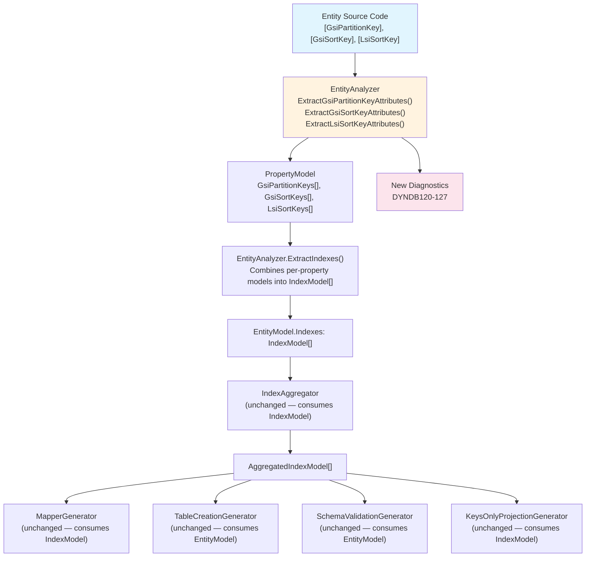
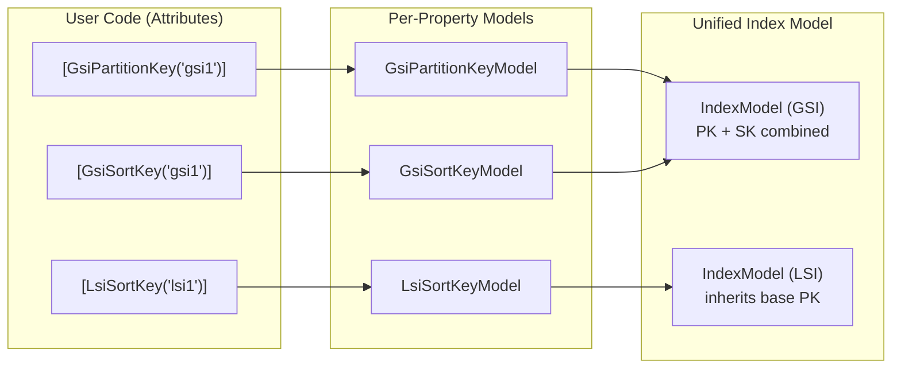

# Design Document: Index Attribute Redesign

## Overview

This design replaces the existing `[GlobalSecondaryIndex]` and `[LocalSecondaryIndex]` attributes with three new, self-describing attributes: `[GsiPartitionKey]`, `[GsiSortKey]`, and `[LsiSortKey]`. The key role (partition key vs sort key) and index type (GSI vs LSI) are encoded directly in the attribute name, eliminating the error-prone `IsPartitionKey = true` / `IsSortKey = true` boolean flags.

The change is a clean break with no backward compatibility requirement (no public users on 0.8). The internal models (`GlobalSecondaryIndexModel`, `LocalSecondaryIndexModel`, `IndexModel`, `AggregatedIndexModel`) already represent the parsed metadata correctly — the main work is in the attribute classes themselves, the `EntityAnalyzer` extraction methods, new diagnostic descriptors, and updating all usages across examples, tests, and steering files.

### Before vs After

```csharp
// BEFORE: Boolean flags — easy to forget IsPartitionKey
[GlobalSecondaryIndex("status-index", IsPartitionKey = true)]
[DynamoDbAttribute("status")]
public string Status { get; set; }

[GlobalSecondaryIndex("status-index", IsSortKey = true)]
[DynamoDbAttribute("createdAt")]
public DateTime CreatedAt { get; set; }

[LocalSecondaryIndex("lsi1")]
[DynamoDbAttribute("updatedAt")]
public DateTime UpdatedAt { get; set; }

// AFTER: Role is in the attribute name — impossible to omit
[GsiPartitionKey("status-index")]
[DynamoDbAttribute("status")]
public string Status { get; set; }

[GsiSortKey("status-index")]
[DynamoDbAttribute("createdAt")]
public DateTime CreatedAt { get; set; }

[LsiSortKey("lsi1")]
[DynamoDbAttribute("updatedAt")]
public DateTime UpdatedAt { get; set; }
```

### Design Rationale

1. **Self-describing names**: `[GsiPartitionKey]` is unambiguous — the developer cannot forget to specify the key role.
2. **DynamoDB-native vocabulary**: GSI and LSI are standard DynamoDB terms that developers already know.
3. **Three attributes, not one**: Separating partition key, sort key, and LSI sort key into distinct types means the compiler enforces correct usage at the attribute level.
4. **Minimal internal model changes**: The downstream pipeline (`IndexModel` → `IndexAggregator` → generators) already works with a unified index model. Only the extraction layer in `EntityAnalyzer` needs to change.

## Architecture

The source generator pipeline processes entity attributes through a series of stages. This redesign touches the first stage (attribute extraction) and adds new validation, while leaving the downstream stages largely unchanged.



### Key Architectural Decision: Reuse Internal Models

The `GlobalSecondaryIndexModel` and `LocalSecondaryIndexModel` classes on `PropertyModel` will be **replaced** with new model classes that mirror the new attributes:

- `GsiPartitionKeyModel` (replaces `GlobalSecondaryIndexModel` for PK role)
- `GsiSortKeyModel` (replaces `GlobalSecondaryIndexModel` for SK role)
- `LsiSortKeyModel` (replaces `LocalSecondaryIndexModel`)

The unified `IndexModel` (which is what all downstream consumers use) stays the same. The `ExtractIndexes()` method in `EntityAnalyzer` will be updated to combine the new per-property models into `IndexModel` instances, just as it does today.

## Components and Interfaces

### 1. New Attribute Classes (Runtime Library)

All three attributes live in `Oproto.FluentDynamoDb/Attributes/` and are part of the public API.

#### GsiPartitionKeyAttribute

```csharp
namespace Oproto.FluentDynamoDb.Attributes;

[AttributeUsage(AttributeTargets.Property, AllowMultiple = true)]
public class GsiPartitionKeyAttribute : Attribute
{
    public string IndexName { get; }
    public string? Name { get; set; }
    public ProjectionType ProjectionType { get; set; } = ProjectionType.All;
    public string? DiscriminatorProperty { get; set; }
    public string? DiscriminatorValue { get; set; }
    public string? DiscriminatorPattern { get; set; }

    public GsiPartitionKeyAttribute(string indexName)
    {
        IndexName = indexName;
    }
}
```

#### GsiSortKeyAttribute

```csharp
[AttributeUsage(AttributeTargets.Property, AllowMultiple = true)]
public class GsiSortKeyAttribute : Attribute
{
    public string IndexName { get; }
    public string? Name { get; set; }
    public ProjectionType ProjectionType { get; set; } = ProjectionType.All;

    public GsiSortKeyAttribute(string indexName)
    {
        IndexName = indexName;
    }
}
```

**Design decision**: `GsiSortKeyAttribute` does not carry discriminator properties. Discriminator configuration is an index-level concern that belongs on the partition key declaration (the "primary" declaration for a GSI). If only a `[GsiSortKey]` specifies `Name` or `ProjectionType`, those values are used as fallbacks when the `[GsiPartitionKey]` for the same index doesn't specify them.

#### LsiSortKeyAttribute

```csharp
[AttributeUsage(AttributeTargets.Property, AllowMultiple = true)]
public class LsiSortKeyAttribute : Attribute
{
    public string IndexName { get; }
    public string? Name { get; set; }
    public ProjectionType ProjectionType { get; set; } = ProjectionType.All;

    public LsiSortKeyAttribute(string indexName)
    {
        IndexName = indexName;
    }
}
```

**Design decision**: No discriminator properties on LSI — LSIs share the base table's partition key and don't need separate discrimination.

### 2. New Per-Property Models (Source Generator)

These replace `GlobalSecondaryIndexModel` and `LocalSecondaryIndexModel` on `PropertyModel`.

#### GsiPartitionKeyModel

```csharp
internal class GsiPartitionKeyModel
{
    public string IndexName { get; set; } = string.Empty;
    public string? CustomName { get; set; }
    public ProjectionType ProjectionType { get; set; } = ProjectionType.All;
    public DiscriminatorConfig? Discriminator { get; set; }
}
```

#### GsiSortKeyModel

```csharp
internal class GsiSortKeyModel
{
    public string IndexName { get; set; } = string.Empty;
    public string? CustomName { get; set; }
    public ProjectionType ProjectionType { get; set; } = ProjectionType.All;
}
```

#### LsiSortKeyModel

```csharp
internal class LsiSortKeyModel
{
    public string IndexName { get; set; } = string.Empty;
    public string? CustomName { get; set; }
    public ProjectionType ProjectionType { get; set; } = ProjectionType.All;
}
```

#### PropertyModel Changes

```csharp
internal class PropertyModel
{
    // REMOVED:
    // public GlobalSecondaryIndexModel[] GlobalSecondaryIndexes { get; set; }
    // public LocalSecondaryIndexModel[] LocalSecondaryIndexes { get; set; }

    // ADDED:
    public GsiPartitionKeyModel[] GsiPartitionKeys { get; set; } = Array.Empty<GsiPartitionKeyModel>();
    public GsiSortKeyModel[] GsiSortKeys { get; set; } = Array.Empty<GsiSortKeyModel>();
    public LsiSortKeyModel[] LsiSortKeys { get; set; } = Array.Empty<LsiSortKeyModel>();

    // Convenience properties updated:
    public bool IsPartOfGsi => GsiPartitionKeys.Length > 0 || GsiSortKeys.Length > 0;
    public bool IsPartOfLsi => LsiSortKeys.Length > 0;
}
```

### 3. EntityAnalyzer Changes

The `EntityAnalyzer` gets three new extraction methods replacing the existing two:

| Old Method | New Method(s) |
|---|---|
| `ExtractGsiAttributes()` | `ExtractGsiPartitionKeyAttributes()`, `ExtractGsiSortKeyAttributes()` |
| `ExtractLsiAttributes()` | `ExtractLsiSortKeyAttributes()` |

The `ExtractIndexes()` method is updated to iterate over the new per-property model arrays instead of the old ones. The logic for combining per-property models into `IndexModel` instances is structurally the same — iterate properties, group by index name, assign PK/SK roles.

#### ExtractIndexes() Changes

```csharp
private void ExtractIndexes(EntityModel entityModel)
{
    var indexes = new Dictionary<string, IndexModel>();

    // Extract GSI indexes from GsiPartitionKey attributes
    foreach (var property in entityModel.Properties)
    {
        foreach (var gsiPk in property.GsiPartitionKeys)
        {
            if (!indexes.TryGetValue(gsiPk.IndexName, out var indexModel))
            {
                indexModel = new IndexModel
                {
                    IndexName = gsiPk.IndexName,
                    IndexType = IndexType.GlobalSecondaryIndex,
                    ProjectionType = gsiPk.ProjectionType
                };
                indexes[gsiPk.IndexName] = indexModel;
            }

            indexModel.PartitionKeyProperty = property.PropertyName;
            indexModel.PartitionKeyAttribute = property.AttributeName;

            // GsiPartitionKey values take precedence
            if (gsiPk.ProjectionType != ProjectionType.All)
                indexModel.ProjectionType = gsiPk.ProjectionType;
            if (gsiPk.Discriminator != null && indexModel.GsiDiscriminator == null)
                indexModel.GsiDiscriminator = gsiPk.Discriminator;
            if (!string.IsNullOrEmpty(gsiPk.CustomName) && string.IsNullOrEmpty(indexModel.CustomName))
                indexModel.CustomName = gsiPk.CustomName;
        }
    }

    // Extract GSI sort keys
    foreach (var property in entityModel.Properties)
    {
        foreach (var gsiSk in property.GsiSortKeys)
        {
            if (!indexes.TryGetValue(gsiSk.IndexName, out var indexModel))
            {
                indexModel = new IndexModel
                {
                    IndexName = gsiSk.IndexName,
                    IndexType = IndexType.GlobalSecondaryIndex,
                    ProjectionType = gsiSk.ProjectionType
                };
                indexes[gsiSk.IndexName] = indexModel;
            }

            indexModel.SortKeyProperty = property.PropertyName;
            indexModel.SortKeyAttribute = property.AttributeName;

            // GsiSortKey values are fallbacks (only if GsiPartitionKey didn't set them)
            if (!string.IsNullOrEmpty(gsiSk.CustomName) && string.IsNullOrEmpty(indexModel.CustomName))
                indexModel.CustomName = gsiSk.CustomName;
            if (gsiSk.ProjectionType != ProjectionType.All && indexModel.ProjectionType == ProjectionType.All)
                indexModel.ProjectionType = gsiSk.ProjectionType;
        }
    }

    // Extract LSI indexes
    var partitionKeyProperty = entityModel.Properties.FirstOrDefault(p => p.IsPartitionKey);
    foreach (var property in entityModel.Properties)
    {
        foreach (var lsiSk in property.LsiSortKeys)
        {
            if (!indexes.TryGetValue(lsiSk.IndexName, out var indexModel))
            {
                indexModel = new IndexModel
                {
                    IndexName = lsiSk.IndexName,
                    IndexType = IndexType.LocalSecondaryIndex,
                    PartitionKeyProperty = partitionKeyProperty?.PropertyName ?? string.Empty,
                    PartitionKeyAttribute = partitionKeyProperty?.AttributeName ?? string.Empty,
                    ProjectionType = lsiSk.ProjectionType
                };
                indexes[lsiSk.IndexName] = indexModel;
            }

            indexModel.SortKeyProperty = property.PropertyName;
            indexModel.SortKeyAttribute = property.AttributeName;

            if (!string.IsNullOrEmpty(lsiSk.CustomName) && string.IsNullOrEmpty(indexModel.CustomName))
                indexModel.CustomName = lsiSk.CustomName;
        }
    }

    // Resolve property names (unchanged logic)
    foreach (var indexModel in indexes.Values)
    {
        indexModel.ResolvedPropertyName = !string.IsNullOrEmpty(indexModel.CustomName)
            ? indexModel.CustomName
            : ConvertToPascalCase(indexModel.IndexName);
    }

    entityModel.Indexes = indexes.Values.ToArray();
}
```

### 4. New Diagnostic Descriptors

New diagnostics for the redesigned attributes, using the DYNDB120-127 range:

| Code | Severity | Condition | Message |
|---|---|---|---|
| DYNDB120 | Error | GSI has `[GsiSortKey]` but no `[GsiPartitionKey]` for the same index name | GSI '{0}' on entity '{1}' has a sort key but no partition key. Add `[GsiPartitionKey("{0}")]` to a property. |
| DYNDB121 | Error | GSI has multiple `[GsiPartitionKey]` for the same index name | GSI '{0}' on entity '{1}' has multiple partition keys: properties '{2}' and '{3}'. Only one is allowed. |
| DYNDB122 | Error | GSI has multiple `[GsiSortKey]` for the same index name | GSI '{0}' on entity '{1}' has multiple sort keys: properties '{2}' and '{3}'. Only one is allowed. |
| DYNDB123 | Error | LSI has multiple `[LsiSortKey]` for the same index name | LSI '{0}' on entity '{1}' has multiple sort keys: properties '{2}' and '{3}'. Only one is allowed. |
| DYNDB124 | Error | `[GsiPartitionKey]` with empty/whitespace index name | `[GsiPartitionKey]` on property '{0}' has an empty or whitespace index name. |
| DYNDB125 | Error | `[GsiSortKey]` with empty/whitespace index name | `[GsiSortKey]` on property '{0}' has an empty or whitespace index name. |
| DYNDB126 | Error | `[LsiSortKey]` with empty/whitespace index name | `[LsiSortKey]` on property '{0}' has an empty or whitespace index name. |
| DYNDB127 | Error | Same index name used as both GSI and LSI within same entity | Index name '{0}' on entity '{1}' is used as both a GSI and an LSI. An index name must be exclusively GSI or LSI. |

The existing DYNDB006 (`InvalidGsiConfiguration`) is updated to reference the new attribute names in its message text. The existing FDDB050-055 aggregation diagnostics remain unchanged since they operate on `IndexModel`/`AggregatedIndexModel`.

### 5. Validation Logic in EntityAnalyzer

A new `ValidateIndexAttributes()` method runs after `ExtractIndexes()` and before the entity is passed to downstream generators:

```csharp
private void ValidateIndexAttributes(EntityModel entityModel)
{
    // 1. Check for empty/whitespace index names (DYNDB124-126)
    foreach (var property in entityModel.Properties)
    {
        foreach (var gsiPk in property.GsiPartitionKeys)
            if (string.IsNullOrWhiteSpace(gsiPk.IndexName))
                ReportDiagnostic(DYNDB124, property);
        foreach (var gsiSk in property.GsiSortKeys)
            if (string.IsNullOrWhiteSpace(gsiSk.IndexName))
                ReportDiagnostic(DYNDB125, property);
        foreach (var lsiSk in property.LsiSortKeys)
            if (string.IsNullOrWhiteSpace(lsiSk.IndexName))
                ReportDiagnostic(DYNDB126, property);
    }

    // 2. Group by index name and check for conflicts
    var gsiPartitionKeys = entityModel.Properties
        .SelectMany(p => p.GsiPartitionKeys.Select(g => (Property: p, Model: g)))
        .GroupBy(x => x.Model.IndexName);

    var gsiSortKeys = entityModel.Properties
        .SelectMany(p => p.GsiSortKeys.Select(g => (Property: p, Model: g)))
        .GroupBy(x => x.Model.IndexName);

    var lsiSortKeys = entityModel.Properties
        .SelectMany(p => p.LsiSortKeys.Select(g => (Property: p, Model: g)))
        .GroupBy(x => x.Model.IndexName);

    // 3. Check duplicate GSI partition keys (DYNDB121)
    foreach (var group in gsiPartitionKeys.Where(g => g.Count() > 1))
    {
        var props = group.Select(x => x.Property.PropertyName).ToArray();
        ReportDiagnostic(DYNDB121, group.Key, entityModel.ClassName, props[0], props[1]);
    }

    // 4. Check duplicate GSI sort keys (DYNDB122)
    foreach (var group in gsiSortKeys.Where(g => g.Count() > 1))
    {
        var props = group.Select(x => x.Property.PropertyName).ToArray();
        ReportDiagnostic(DYNDB122, group.Key, entityModel.ClassName, props[0], props[1]);
    }

    // 5. Check duplicate LSI sort keys (DYNDB123)
    foreach (var group in lsiSortKeys.Where(g => g.Count() > 1))
    {
        var props = group.Select(x => x.Property.PropertyName).ToArray();
        ReportDiagnostic(DYNDB123, group.Key, entityModel.ClassName, props[0], props[1]);
    }

    // 6. Check GSI sort key without partition key (DYNDB120)
    var gsiPkIndexNames = new HashSet<string>(
        entityModel.Properties.SelectMany(p => p.GsiPartitionKeys.Select(g => g.IndexName)));
    foreach (var group in gsiSortKeys)
    {
        if (!gsiPkIndexNames.Contains(group.Key))
            ReportDiagnostic(DYNDB120, group.Key, entityModel.ClassName);
    }

    // 7. Check same index name used as both GSI and LSI (DYNDB127)
    var gsiIndexNames = new HashSet<string>(
        entityModel.Properties
            .SelectMany(p => p.GsiPartitionKeys.Select(g => g.IndexName)
                .Concat(p.GsiSortKeys.Select(g => g.IndexName))));
    var lsiIndexNames = new HashSet<string>(
        entityModel.Properties.SelectMany(p => p.LsiSortKeys.Select(l => l.IndexName)));

    foreach (var overlap in gsiIndexNames.Intersect(lsiIndexNames))
        ReportDiagnostic(DYNDB127, overlap, entityModel.ClassName);
}
```

### 6. Downstream Generator Impact

| Generator | Impact | Reason |
|---|---|---|
| `IndexAggregator` | **No changes** | Consumes `IndexModel[]` from `EntityModel.Indexes` |
| `MapperGenerator` | **No changes** | Consumes `IndexModel` via `GenerateIndexMetadata()` |
| `TableCreationGenerator` | **No changes** | Consumes `EntityModel` via `GetEntityMetadata()` |
| `SchemaValidationGenerator` | **No changes** | Consumes `EntityModel` via `GetEntityMetadata()` |
| `KeysOnlyProjectionGenerator` | **No changes** | Consumes `IndexModel` and `EntityModel` |

All five downstream generators consume the unified `IndexModel` or `EntityModel`, not the per-property attribute models. Since `IndexModel` is unchanged, these generators require no modifications.

### 7. Files to Delete

| File | Reason |
|---|---|
| `Oproto.FluentDynamoDb/Attributes/GlobalSecondaryIndexAttribute.cs` | Replaced by `GsiPartitionKeyAttribute` and `GsiSortKeyAttribute` |
| `Oproto.FluentDynamoDb/Attributes/LocalSecondaryIndexAttribute.cs` | Replaced by `LsiSortKeyAttribute` |
| `Oproto.FluentDynamoDb.SourceGenerator/Models/GlobalSecondaryIndexModel.cs` | Replaced by `GsiPartitionKeyModel` and `GsiSortKeyModel` |
| `Oproto.FluentDynamoDb.SourceGenerator/Models/LocalSecondaryIndexModel.cs` | Replaced by `LsiSortKeyModel` |

### 8. Files to Create

| File | Purpose |
|---|---|
| `Oproto.FluentDynamoDb/Attributes/GsiPartitionKeyAttribute.cs` | New GSI partition key attribute |
| `Oproto.FluentDynamoDb/Attributes/GsiSortKeyAttribute.cs` | New GSI sort key attribute |
| `Oproto.FluentDynamoDb/Attributes/LsiSortKeyAttribute.cs` | New LSI sort key attribute |
| `Oproto.FluentDynamoDb.SourceGenerator/Models/GsiPartitionKeyModel.cs` | New per-property model |
| `Oproto.FluentDynamoDb.SourceGenerator/Models/GsiSortKeyModel.cs` | New per-property model |
| `Oproto.FluentDynamoDb.SourceGenerator/Models/LsiSortKeyModel.cs` | New per-property model |

## Data Models

### Attribute → Model → IndexModel Flow



### Model Property Mapping

| Attribute Property | Per-Property Model Field | IndexModel Field |
|---|---|---|
| `GsiPartitionKeyAttribute.IndexName` | `GsiPartitionKeyModel.IndexName` | `IndexModel.IndexName` |
| `GsiPartitionKeyAttribute.Name` | `GsiPartitionKeyModel.CustomName` | `IndexModel.CustomName` |
| `GsiPartitionKeyAttribute.ProjectionType` | `GsiPartitionKeyModel.ProjectionType` | `IndexModel.ProjectionType` |
| `GsiPartitionKeyAttribute.Discriminator*` | `GsiPartitionKeyModel.Discriminator` | `IndexModel.GsiDiscriminator` |
| Property hosting `[GsiPartitionKey]` | — | `IndexModel.PartitionKeyProperty`, `.PartitionKeyAttribute` |
| `GsiSortKeyAttribute.IndexName` | `GsiSortKeyModel.IndexName` | `IndexModel.IndexName` |
| `GsiSortKeyAttribute.Name` | `GsiSortKeyModel.CustomName` | `IndexModel.CustomName` (fallback) |
| `GsiSortKeyAttribute.ProjectionType` | `GsiSortKeyModel.ProjectionType` | `IndexModel.ProjectionType` (fallback) |
| Property hosting `[GsiSortKey]` | — | `IndexModel.SortKeyProperty`, `.SortKeyAttribute` |
| `LsiSortKeyAttribute.IndexName` | `LsiSortKeyModel.IndexName` | `IndexModel.IndexName` |
| `LsiSortKeyAttribute.Name` | `LsiSortKeyModel.CustomName` | `IndexModel.CustomName` |
| `LsiSortKeyAttribute.ProjectionType` | `LsiSortKeyModel.ProjectionType` | `IndexModel.ProjectionType` |
| Property hosting `[LsiSortKey]` | — | `IndexModel.SortKeyProperty`, `.SortKeyAttribute` |
| Base table `[PartitionKey]` property | — | `IndexModel.PartitionKeyProperty` (LSI only) |

### Precedence Rules for Shared Properties

When both `[GsiPartitionKey]` and `[GsiSortKey]` specify `Name` or `ProjectionType` for the same index:

1. `[GsiPartitionKey]` values are authoritative
2. `[GsiSortKey]` values are used only when `[GsiPartitionKey]` does not specify them
3. This matches the mental model that the partition key declaration is the "primary" declaration for a GSI


## Correctness Properties

*A property is a characteristic or behavior that should hold true across all valid executions of a system — essentially, a formal statement about what the system should do. Properties serve as the bridge between human-readable specifications and machine-verifiable correctness guarantees.*

### Property 1: Index attribute extraction preserves all configuration values

*For any* valid entity property annotated with `[GsiPartitionKey]`, `[GsiSortKey]`, or `[LsiSortKey]` with any combination of optional configuration values (Name, ProjectionType, Discriminator), the `EntityAnalyzer` extraction SHALL produce an `IndexModel` where every specified configuration value is correctly propagated, and unspecified optional values retain their defaults.

**Validates: Requirements 1.1, 2.1, 3.1, 5.1, 5.2, 5.3**

### Property 2: GSI partition key and sort key combination

*For any* entity where one property has `[GsiPartitionKey("X")]` and another property has `[GsiSortKey("X")]` for the same index name X, the `EntityAnalyzer` SHALL produce exactly one `IndexModel` with `IndexName = X`, `PartitionKeyProperty` set to the PK-annotated property, and `SortKeyProperty` set to the SK-annotated property. *For any* entity where a property has `[GsiPartitionKey("X")]` but no property has `[GsiSortKey("X")]`, the resulting `IndexModel` SHALL have `SortKeyProperty = null`.

**Validates: Requirements 5.4, 5.5**

### Property 3: GsiPartitionKey takes precedence over GsiSortKey for shared settings

*For any* GSI where both `[GsiPartitionKey]` and `[GsiSortKey]` specify `Name` and/or `ProjectionType`, the resulting `IndexModel.CustomName` and `IndexModel.ProjectionType` SHALL equal the values from the `[GsiPartitionKey]` attribute. The `[GsiSortKey]` values SHALL only be used when the `[GsiPartitionKey]` does not specify them.

**Validates: Requirements 2.5**

### Property 4: Multi-index property produces independent IndexModels

*For any* property annotated with N index attributes (any mix of `[GsiPartitionKey]`, `[GsiSortKey]`, `[LsiSortKey]`) referencing N distinct index names, the `EntityAnalyzer` SHALL produce at least N `IndexModel` entries on the entity, each with the correct `IndexName`, key role (PK or SK), and `IndexType` (GSI or LSI).

**Validates: Requirements 6.1, 6.2, 6.3, 6.4, 6.5**

### Property 5: LSI inherits base table partition key

*For any* entity with a `[PartitionKey]` property and one or more `[LsiSortKey]` attributes, every resulting LSI `IndexModel` SHALL have `IndexType = LocalSecondaryIndex`, `PartitionKeyProperty` equal to the base table's partition key property name, and `PartitionKeyAttribute` equal to the base table's partition key DynamoDB attribute name.

**Validates: Requirements 3.5**

### Property 6: Duplicate and missing key diagnostics

*For any* entity where a GSI index name has a `[GsiSortKey]` but no `[GsiPartitionKey]`, the validator SHALL emit DYNDB120. *For any* entity where a GSI index name has more than one `[GsiPartitionKey]` on different properties, the validator SHALL emit DYNDB121. *For any* entity where a GSI index name has more than one `[GsiSortKey]` on different properties, the validator SHALL emit DYNDB122. *For any* entity where an LSI index name has more than one `[LsiSortKey]` on different properties, the validator SHALL emit DYNDB123.

**Validates: Requirements 8.1, 8.2, 8.3, 8.4**

### Property 7: Empty index name diagnostics

*For any* index attribute (`[GsiPartitionKey]`, `[GsiSortKey]`, or `[LsiSortKey]`) applied with an index name that is empty or composed entirely of whitespace characters, the validator SHALL emit the corresponding diagnostic (DYNDB124, DYNDB125, or DYNDB126 respectively).

**Validates: Requirements 8.5, 8.6, 8.7**

### Property 8: GSI/LSI type conflict detection

*For any* entity where the same index name appears on both a GSI attribute (`[GsiPartitionKey]` or `[GsiSortKey]`) and an LSI attribute (`[LsiSortKey]`), the validator SHALL emit DYNDB127.

**Validates: Requirements 8.8**

## Error Handling

### Compile-Time Diagnostics

All index configuration errors are reported as Roslyn diagnostics at compile time. The source generator never throws exceptions — it emits diagnostics and skips code generation for invalid configurations.

| Error Category | Diagnostic Codes | Behavior on Error |
|---|---|---|
| Empty index name | DYNDB124, DYNDB125, DYNDB126 | Skip index, emit error |
| Missing GSI partition key | DYNDB120 | Skip index, emit error |
| Duplicate keys for same index | DYNDB121, DYNDB122, DYNDB123 | Skip index, emit error |
| GSI/LSI type conflict | DYNDB127 | Skip index, emit error |
| Cross-entity PK conflict | FDDB053 | Emit error (existing) |
| Cross-entity SK conflict | FDDB054 | Emit error (existing) |
| Cross-entity type conflict | FDDB055 | Emit error (existing) |

### Graceful Degradation

When validation errors are detected:
1. The invalid index is excluded from `EntityModel.Indexes`
2. All other valid indexes on the same entity continue to generate correctly
3. Downstream generators (MapperGenerator, TableCreationGenerator, etc.) never see invalid indexes
4. The developer gets actionable error messages with the property name and index name

### Migration Errors

After the old attributes are deleted, any code referencing `[GlobalSecondaryIndex]` or `[LocalSecondaryIndex]` will produce standard C# compilation errors (`CS0246: The type or namespace name could not be found`). No special migration diagnostic is needed since there are no public users.

## Testing Strategy

### Property-Based Tests (FsCheck)

Property-based tests use **FsCheck** (the standard .NET PBT library) with xUnit integration. Each property test runs a minimum of 100 iterations with randomly generated inputs.

**Test organization**: A new test class `IndexAttributeExtractionPropertyTests` in `Oproto.FluentDynamoDb.SourceGenerator.UnitTests/Analysis/`.

The tests operate at the model level — they construct `PropertyModel` instances with various combinations of `GsiPartitionKeyModel`, `GsiSortKeyModel`, and `LsiSortKeyModel`, then invoke the extraction/validation logic and assert the resulting `IndexModel[]` and diagnostics.

| Property | Test Method | Generators |
|---|---|---|
| Property 1: Extraction preserves config | `ExtractionPreservesAllConfigurationValues` | Random index names, optional Name/ProjectionType/Discriminator |
| Property 2: PK+SK combination | `GsiPartitionAndSortKeyCombineIntoSingleIndex` | Random PK/SK property pairs with matching index names |
| Property 3: PK precedence | `GsiPartitionKeyTakesPrecedenceOverSortKey` | Random Name/ProjectionType on both PK and SK |
| Property 4: Multi-index | `MultiIndexPropertyProducesIndependentModels` | Random N (1-5) index attributes with distinct names |
| Property 5: LSI inherits PK | `LsiInheritsBaseTablePartitionKey` | Random entities with PK + LSI configurations |
| Property 6: Duplicate/missing diagnostics | `InvalidConfigurationsProduceCorrectDiagnostics` | Random duplicate-key and missing-PK scenarios |
| Property 7: Empty name diagnostics | `WhitespaceIndexNamesProduceDiagnostics` | Random whitespace strings |
| Property 8: Type conflict | `GsiLsiTypeConflictProducesDiagnostic` | Random index names used as both GSI and LSI |

**Tag format**: Each test is tagged with a comment:
```csharp
// Feature: index-attribute-redesign, Property 1: Extraction preserves all configuration values
```

### Unit Tests (Example-Based)

Example-based unit tests cover specific scenarios and integration points:

| Test Category | Test Class | Coverage |
|---|---|---|
| Attribute API shape | `GsiPartitionKeyAttributeTests` | Constructor, defaults, AllowMultiple |
| Attribute API shape | `GsiSortKeyAttributeTests` | Constructor, defaults, AllowMultiple |
| Attribute API shape | `LsiSortKeyAttributeTests` | Constructor, defaults, AllowMultiple |
| End-to-end generation | `IndexAttributeGenerationTests` | Full source generator pipeline with new attributes |
| Diagnostic messages | `IndexDiagnosticTests` | Verify diagnostic message text and severity |
| Aggregation (existing) | `IndexAggregatorTests` | Existing tests updated to use new attributes |

### Integration Tests

Integration tests verify the full source generator pipeline:

1. Define entity classes with new attributes
2. Run the source generator
3. Verify generated code compiles
4. Verify generated `GetEntityMetadata()` returns correct `IndexMetadata`
5. Verify generated `CreateTableAsync()` produces correct `CreateTableRequest`

### Test Configuration

```xml
<!-- Add FsCheck to test project -->
<PackageReference Include="FsCheck" Version="3.*" />
<PackageReference Include="FsCheck.Xunit" Version="3.*" />
```

Each property-based test runs with:
- Minimum 100 iterations (`MaxTest = 100`)
- Deterministic seed for reproducibility
- Custom generators for index names (non-empty alphanumeric + hyphens)
