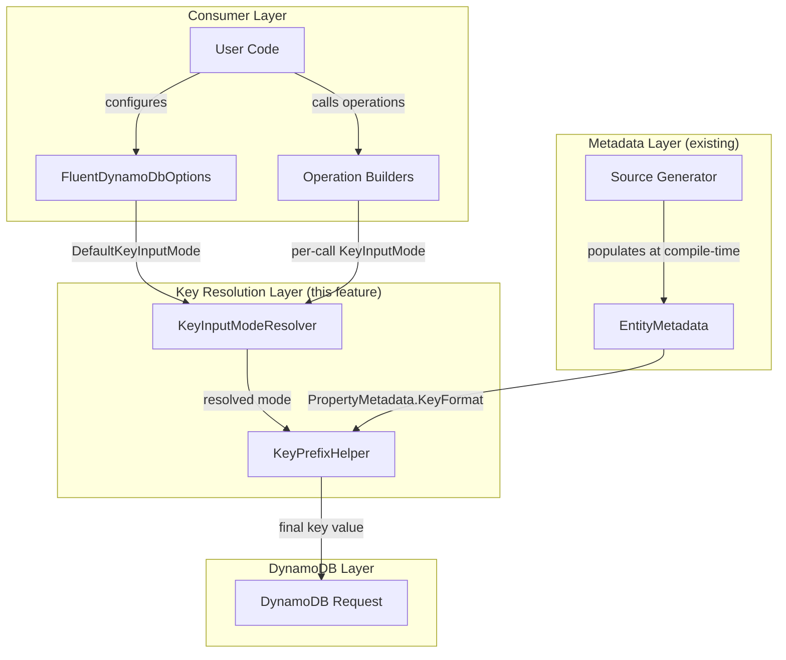

# Design Document: KeyInputMode

## Overview

This feature introduces a `KeyInputMode` enum and supporting infrastructure that controls how key values are interpreted before being sent to DynamoDB operations. The design enables the library to automatically apply key prefixes based on a configurable strategy, reducing boilerplate for consumers while maintaining full backward compatibility.

The core components are:

1. **`KeyInputMode` enum** — Defines four interpretation strategies: `Default`, `Auto`, `Value`, `Raw`
2. **`FluentDynamoDbOptions.DefaultKeyInputMode` property** — Global configuration with `Auto` as default
3. **`KeyInputModeResolver` utility** — Internal static helper that resolves `Default` to the configured mode
4. **`KeyPrefixHelper` utility** — Internal static helper that applies prefix logic based on resolved mode
5. **Runtime key metadata** — Already available via `PropertyMetadata.KeyFormat` / `KeyFormatMetadata`

This is foundational infrastructure. The integration into specific operations (Get, Put, Update, Delete) is handled by separate features that build on this.

## Architecture



### Data Flow

1. User configures `DefaultKeyInputMode` on `FluentDynamoDbOptions` (defaults to `Auto`)
2. Operation builders accept an optional per-call `KeyInputMode` parameter (defaults to `Default`)
3. `KeyInputModeResolver.Resolve()` maps `Default` → configured option, passes others through
4. `KeyPrefixHelper.ApplyKeyPrefix()` applies the prefix transformation based on resolved mode
5. The final key value is used in the DynamoDB request

## Components and Interfaces

### KeyInputMode Enum

```csharp
namespace Oproto.FluentDynamoDb;

/// <summary>
/// Controls how key values are interpreted when passed to DynamoDB operations.
/// </summary>
public enum KeyInputMode
{
    /// <summary>
    /// Defers to the value configured on <see cref="FluentDynamoDbOptions.DefaultKeyInputMode"/>.
    /// This is the default parameter value on all operation methods.
    /// </summary>
    Default = 0,

    /// <summary>
    /// Automatically detects whether the prefix is already applied using an ordinal
    /// case-sensitive StartsWith check. If the value starts with the prefix followed
    /// by the separator, it passes through unchanged. Otherwise, the prefix and
    /// separator are prepended. When no prefix is configured, behaves identically to Raw.
    /// </summary>
    Auto = 1,

    /// <summary>
    /// Always treats the input as the raw component value and prepends the configured
    /// prefix and separator. Equivalent to calling Entity.Keys.Pk(value) manually.
    /// When no prefix is configured, behaves identically to Raw.
    /// </summary>
    Value = 2,

    /// <summary>
    /// Passes the value through to DynamoDB unchanged. This is the legacy behavior.
    /// The caller is fully responsible for providing the correct prefixed value.
    /// </summary>
    Raw = 3
}
```

**Location:** `Oproto.FluentDynamoDb/KeyInputMode.cs`

### FluentDynamoDbOptions Extension

New property and method added to the existing `FluentDynamoDbOptions` class:

```csharp
/// <summary>
/// Gets the default key input mode used when operations specify KeyInputMode.Default.
/// Default value: KeyInputMode.Auto
/// </summary>
public KeyInputMode DefaultKeyInputMode { get; private init; } = KeyInputMode.Auto;

/// <summary>
/// Creates a new options instance with the specified default key input mode.
/// </summary>
/// <param name="mode">The key input mode to use as the default. Cannot be KeyInputMode.Default.</param>
/// <returns>A new FluentDynamoDbOptions instance with the specified key input mode.</returns>
/// <exception cref="ArgumentException">Thrown when KeyInputMode.Default is specified.</exception>
public FluentDynamoDbOptions UseKeyInputMode(KeyInputMode mode)
{
    if (mode == KeyInputMode.Default)
        throw new ArgumentException(
            "KeyInputMode.Default is only valid as a per-call parameter value. " +
            "Specify Auto, Value, or Raw for the global default.",
            nameof(mode));
    return CloneWith(defaultKeyInputMode: mode);
}
```

The `CloneWith` method is extended with a `KeyInputMode? defaultKeyInputMode = null` parameter that preserves the existing immutable clone pattern.

### KeyInputModeResolver (Internal Static Helper)

```csharp
namespace Oproto.FluentDynamoDb.Utility;

/// <summary>
/// Resolves KeyInputMode.Default to the actual configured mode.
/// </summary>
internal static class KeyInputModeResolver
{
    /// <summary>
    /// Resolves the effective key input mode. If the specified mode is Default,
    /// returns the configured default from options. Otherwise returns the specified mode.
    /// </summary>
    /// <param name="specified">The mode specified by the caller.</param>
    /// <param name="options">The options instance containing the default mode.</param>
    /// <returns>The resolved mode (never returns Default).</returns>
    /// <exception cref="ArgumentOutOfRangeException">
    /// Thrown when an undefined KeyInputMode enum value is specified.
    /// </exception>
    internal static KeyInputMode Resolve(KeyInputMode specified, FluentDynamoDbOptions options)
    {
        return specified switch
        {
            KeyInputMode.Default => options.DefaultKeyInputMode,
            KeyInputMode.Auto => KeyInputMode.Auto,
            KeyInputMode.Value => KeyInputMode.Value,
            KeyInputMode.Raw => KeyInputMode.Raw,
            _ => throw new ArgumentOutOfRangeException(
                nameof(specified),
                specified,
                $"Undefined KeyInputMode value: {(int)specified}")
        };
    }
}
```

**Location:** `Oproto.FluentDynamoDb/Utility/KeyInputModeResolver.cs`

### KeyPrefixHelper (Internal Static Helper)

```csharp
namespace Oproto.FluentDynamoDb.Utility;

/// <summary>
/// Applies key prefix transformations based on the resolved KeyInputMode.
/// </summary>
internal static class KeyPrefixHelper
{
    /// <summary>
    /// Applies the appropriate prefix transformation to a key value based on the resolved mode.
    /// </summary>
    /// <param name="value">The key value to transform. Must not be null.</param>
    /// <param name="prefix">The configured prefix for the key. Null/empty means no prefix configured.</param>
    /// <param name="separator">The separator between prefix and value (e.g., "#").</param>
    /// <param name="mode">The resolved KeyInputMode (must not be Default).</param>
    /// <returns>The transformed key value.</returns>
    /// <exception cref="ArgumentNullException">Thrown when value is null.</exception>
    internal static string ApplyKeyPrefix(string value, string? prefix, string separator, KeyInputMode mode)
    {
        ArgumentNullException.ThrowIfNull(value);

        if (string.IsNullOrWhiteSpace(prefix))
            return value;

        return mode switch
        {
            KeyInputMode.Raw => value,
            KeyInputMode.Value => $"{prefix}{separator}{value}",
            KeyInputMode.Auto => value.StartsWith($"{prefix}{separator}", StringComparison.Ordinal)
                ? value
                : $"{prefix}{separator}{value}",
            _ => value
        };
    }
}
```

**Location:** `Oproto.FluentDynamoDb/Utility/KeyPrefixHelper.cs`

### Runtime Key Metadata (Existing Infrastructure)

The metadata system already supports key format information:

```csharp
// Already exists in Oproto.FluentDynamoDb/Metadata/PropertyMetadata.cs
public class KeyFormatMetadata
{
    public string? Prefix { get; set; }
    public string? Separator { get; set; }
}

// PropertyMetadata already has:
public KeyFormatMetadata? KeyFormat { get; set; }
```

The source generator already populates `KeyFormat` for partition and sort key properties. This feature verifies the existing behavior and documents the contract that `KeyFormat` is non-null for key properties and null for non-key properties.

## Data Models

### KeyInputMode Enum Values

| Value | Ordinal | Behavior |
|-------|---------|----------|
| `Default` | 0 | Resolves to `FluentDynamoDbOptions.DefaultKeyInputMode` |
| `Auto` | 1 | StartsWith check; prepend only if not already prefixed |
| `Value` | 2 | Always prepend prefix + separator |
| `Raw` | 3 | Pass through unchanged (legacy behavior) |

### KeyFormatMetadata (Existing)

| Property | Type | Description |
|----------|------|-------------|
| `Prefix` | `string?` | Key prefix from attribute (e.g., `"ORDER"`) |
| `Separator` | `string?` | Separator between prefix and value (default: `"#"`) |

### FluentDynamoDbOptions State

The `DefaultKeyInputMode` property follows the same `private init` pattern as all other options properties:

| Property | Type | Default | Description |
|----------|------|---------|-------------|
| `DefaultKeyInputMode` | `KeyInputMode` | `Auto` | Global default used when operations specify `Default` |

## Correctness Properties

*A property is a characteristic or behavior that should hold true across all valid executions of a system — essentially, a formal statement about what the system should do. Properties serve as the bridge between human-readable specifications and machine-verifiable correctness guarantees.*

### Property 1: UseKeyInputMode immutability and preservation

*For any* `FluentDynamoDbOptions` instance with arbitrary pre-configured properties (logger, blob storage, encryption, consistent read, etc.) and *for any* valid `KeyInputMode` (Auto, Value, or Raw), calling `UseKeyInputMode(mode)` SHALL return a new distinct instance with `DefaultKeyInputMode` set to the specified mode and all other properties preserved unchanged from the original, and the original instance SHALL remain unmodified.

**Validates: Requirements 2.3, 2.4**

### Property 2: Resolution never returns Default

*For any* `KeyInputMode` value (Default, Auto, Value, Raw) and *for any* `FluentDynamoDbOptions` instance with a configured `DefaultKeyInputMode`, the result of `KeyInputModeResolver.Resolve()` SHALL never be `KeyInputMode.Default`. When the input is `Default`, the result equals the configured option value; when the input is non-Default, the result equals the input.

**Validates: Requirements 3.1, 3.2, 3.4**

### Property 3: Raw mode passthrough

*For any* non-null string value, *any* prefix (including non-empty), and *any* separator, `KeyPrefixHelper.ApplyKeyPrefix` with `KeyInputMode.Raw` SHALL return the input value unchanged.

**Validates: Requirements 4.1**

### Property 4: Value mode always prepends

*For any* non-null string value, *any* non-null/non-empty/non-whitespace prefix, and *any* separator, `KeyPrefixHelper.ApplyKeyPrefix` with `KeyInputMode.Value` SHALL return the string `prefix + separator + value`.

**Validates: Requirements 4.2**

### Property 5: Auto mode idempotency

*For any* non-null/non-empty/non-whitespace prefix, *any* separator, and *any* suffix string, `KeyPrefixHelper.ApplyKeyPrefix` with `KeyInputMode.Auto` and input `prefix + separator + suffix` SHALL return the input unchanged (no double-prefixing).

**Validates: Requirements 4.3, 6.1**

### Property 6: Auto mode prepend for unprefixed values

*For any* non-null string value that does not start with `prefix + separator` (using ordinal case-sensitive comparison), *any* non-null/non-empty/non-whitespace prefix, and *any* separator, `KeyPrefixHelper.ApplyKeyPrefix` with `KeyInputMode.Auto` SHALL return `prefix + separator + value`.

**Validates: Requirements 4.4, 6.2**

### Property 7: Null/empty prefix passthrough

*For any* `KeyInputMode` (Auto, Value, or Raw), *any* non-null string value, and *any* prefix that is null, empty, or whitespace-only, `KeyPrefixHelper.ApplyKeyPrefix` SHALL return the input value unchanged.

**Validates: Requirements 4.5, 6.3**

## Error Handling

| Scenario | Exception | Message |
|----------|-----------|---------|
| `UseKeyInputMode(KeyInputMode.Default)` | `ArgumentException` | "KeyInputMode.Default is only valid as a per-call parameter value. Specify Auto, Value, or Raw for the global default." |
| `KeyInputModeResolver.Resolve()` with undefined enum value | `ArgumentOutOfRangeException` | "Undefined KeyInputMode value: {value}" |
| `KeyPrefixHelper.ApplyKeyPrefix()` with null value | `ArgumentNullException` | Parameter name: "value" |

### Design Rationale

- **ArgumentException for Default on options**: Prevents configuration errors where a consumer accidentally sets the global default to `Default`, which would create an infinite dereference loop.
- **ArgumentOutOfRangeException for invalid enum**: Guards against future enum extension or invalid casts that could silently produce incorrect behavior.
- **ArgumentNullException for null value**: Fail-fast on invalid input rather than producing a NullReferenceException in string operations.

## Testing Strategy

### Property-Based Tests (FsCheck)

The project uses **FsCheck** with **FsCheck.Xunit** for property-based testing. Each property test runs a minimum of 100 iterations.

**Test File:** `Oproto.FluentDynamoDb.UnitTests/KeyInputModePropertyTests.cs`

| Property | Generator Strategy |
|----------|-------------------|
| Property 1 (Immutability) | Generate random KeyInputMode (Auto/Value/Raw), random pre-configured options |
| Property 2 (Resolution) | Generate random KeyInputMode (all 4), random options with non-Default default |
| Property 3 (Raw passthrough) | Generate random strings for value, prefix, separator |
| Property 4 (Value prepend) | Generate random non-empty strings for value, prefix, separator |
| Property 5 (Auto idempotency) | Generate random prefix, separator, suffix; construct prefixed input |
| Property 6 (Auto prepend) | Generate random value guaranteed NOT to start with prefix+separator |
| Property 7 (Null/empty prefix) | Generate random mode, random value, null/empty/whitespace prefix |

**Configuration:**
- Minimum 100 iterations per property (`[Property(MaxTest = 100)]`)
- Each test tagged with: `Feature: key-input-mode, Property {N}: {title}`

### Unit Tests (xUnit + AwesomeAssertions)

**Test File:** `Oproto.FluentDynamoDb.UnitTests/KeyInputModeTests.cs`

| Test Category | Tests |
|---------------|-------|
| Enum validation | Verify ordinal values (Default=0, Auto=1, Value=2, Raw=3) |
| Default value | `new FluentDynamoDbOptions().DefaultKeyInputMode == KeyInputMode.Auto` |
| UseKeyInputMode(Default) throws | Verify `ArgumentException` with correct message |
| Resolve with invalid cast | Verify `ArgumentOutOfRangeException` for `(KeyInputMode)99` |
| ApplyKeyPrefix null value | Verify `ArgumentNullException` |
| Source generator metadata | Verify `KeyFormat` is populated correctly for test entities |
| Backward compatibility | Existing options methods still work after adding `DefaultKeyInputMode` |

### Integration Tests

Source generator metadata population is verified via integration tests that define test entities with various key configurations and assert the generated `GetEntityMetadata()` output.

### Test Dependencies

- `FsCheck` + `FsCheck.Xunit` for property-based testing
- `AwesomeAssertions` for readable assertions
- `NSubstitute` for mocking (if needed for options isolation tests)
- `InternalsVisibleTo` for testing internal static helpers
