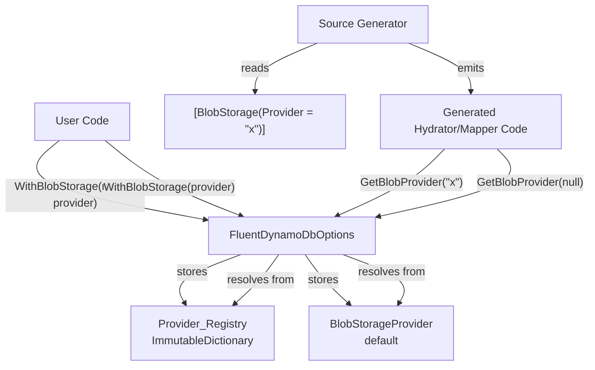

# Design Document: Named Blob Providers

## Overview

This feature extends `FluentDynamoDbOptions` to support registering multiple `IBlobStorageProvider` instances by name, and extends the `[BlobStorage]` attribute to specify which named provider to use per property. This enables entities with properties stored across different blob backends (e.g., images in one S3 bucket, documents in another bucket or provider entirely).

The design preserves full backwards compatibility — existing entities using `[BlobStorage]` without a `Provider` property continue to work unchanged against the default (unnamed) provider.

### Key Design Decisions

1. **String-based naming**: Provider names are plain strings rather than enums, giving users full flexibility without needing library changes for each new backend.
2. **Resolution at runtime via Options**: The `GetBlobProvider(string? name)` method on `FluentDynamoDbOptions` centralizes resolution logic, keeping the source generator simple — it only needs to emit the correct name string per property.
3. **ImmutableDictionary for Provider_Registry**: Uses `System.Collections.Immutable.ImmutableDictionary<string, IBlobStorageProvider>` to maintain the copy-on-write pattern already used by `FluentDynamoDbOptions`.
4. **Source generator emits per-property calls**: Rather than resolving a single provider for all blob properties, generated code calls `GetBlobProvider` once per blob-annotated property with that property's specific provider name (or `null` for default).

## Architecture



### Data Flow

1. **Registration**: User registers providers via fluent `WithBlobStorage` overloads on `FluentDynamoDbOptions`.
2. **Compile-time**: Source generator reads the `Provider` property from `[BlobStorage]` attributes and emits `GetBlobProvider("providerName")` calls in generated hydration/mapping code.
3. **Runtime**: Generated code calls `GetBlobProvider` per property, which resolves the correct provider from the registry or returns the default.

## Components and Interfaces

### FluentDynamoDbOptions Changes

```csharp
public sealed class FluentDynamoDbOptions
{
    // Existing property — unchanged
    public IBlobStorageProvider? BlobStorageProvider { get; private init; }
    
    // NEW: Registry of named providers
    internal ImmutableDictionary<string, IBlobStorageProvider> NamedBlobProviders { get; private init; }
        = ImmutableDictionary<string, IBlobStorageProvider>.Empty;

    // Existing method — unchanged signature and behavior
    public FluentDynamoDbOptions WithBlobStorage(IBlobStorageProvider? provider) { ... }

    // NEW: Register a named provider
    /// <summary>
    /// Creates a new options instance with the specified named blob storage provider registered.
    /// </summary>
    /// <param name="name">The provider name. Must not be null, empty, or whitespace.</param>
    /// <param name="provider">The blob storage provider instance. Must not be null.</param>
    /// <returns>A new FluentDynamoDbOptions instance with the named provider registered.</returns>
    /// <exception cref="ArgumentException">Thrown when name is null, empty, or whitespace.</exception>
    /// <exception cref="ArgumentNullException">Thrown when provider is null.</exception>
    public FluentDynamoDbOptions WithBlobStorage(string name, IBlobStorageProvider provider)
    {
        ArgumentException.ThrowIfNullOrWhiteSpace(name);
        ArgumentNullException.ThrowIfNull(provider);
        
        return CloneWith(namedBlobProviders: NamedBlobProviders.SetItem(name, provider));
    }

    // NEW: Resolve a provider by name
    /// <summary>
    /// Gets the blob storage provider for the given name.
    /// </summary>
    /// <param name="name">The provider name, or null/empty to get the default provider.</param>
    /// <returns>The resolved IBlobStorageProvider.</returns>
    /// <exception cref="InvalidOperationException">
    /// Thrown when the requested provider is not registered.
    /// </exception>
    public IBlobStorageProvider GetBlobProvider(string? name)
    {
        if (string.IsNullOrEmpty(name))
        {
            return BlobStorageProvider 
                ?? throw new InvalidOperationException(
                    "No default blob storage provider has been configured. " +
                    "Call .WithBlobStorage(provider) on FluentDynamoDbOptions to register one.");
        }

        if (NamedBlobProviders.TryGetValue(name, out var provider))
        {
            return provider;
        }

        var message = NamedBlobProviders.IsEmpty
            ? $"Named blob storage provider '{name}' is not registered and no named providers have been configured. " +
              $"Call .WithBlobStorage(\"{name}\", provider) on FluentDynamoDbOptions to register it."
            : $"Named blob storage provider '{name}' is not registered. " +
              $"Available providers: {string.Join(", ", NamedBlobProviders.Keys.OrderBy(k => k))}. " +
              $"Call .WithBlobStorage(\"{name}\", provider) on FluentDynamoDbOptions to register it.";

        throw new InvalidOperationException(message);
    }
}
```

### BlobStorageAttribute Changes

```csharp
[AttributeUsage(AttributeTargets.Property)]
public sealed class BlobStorageAttribute : Attribute
{
    // Existing property — unchanged
    public bool LazyLoad { get; set; } = false;

    // NEW: Optional named provider
    /// <summary>
    /// Gets or sets the name of the blob storage provider to use for this property.
    /// When null (default), the default provider registered via WithBlobStorage(provider) is used.
    /// When set, the named provider registered via WithBlobStorage(name, provider) is used.
    /// </summary>
    public string? Provider { get; set; }
}
```

### Source Generator Model Changes

The `ComplexTypeInfo` model already has a `BlobProviderConfig` field. We add a string `BlobStorageProviderName` to carry the attribute's `Provider` value through to code generation:

```csharp
internal class ComplexTypeInfo
{
    // ... existing fields ...
    
    // NEW: The named provider string from [BlobStorage(Provider = "x")]
    public string? BlobStorageProviderName { get; set; }
}
```

### HydratorGenerator Changes

The generated hydrator currently passes a single `blobProvider` parameter. With this feature, generated code instead calls `options.GetBlobProvider(providerName)` per property:

**Before (single provider for all properties):**
```csharp
var reference = await blobProvider.StoreAsync(stream, suggestedKey, cancellationToken).ConfigureAwait(false);
```

**After (per-property provider resolution):**
```csharp
// For [BlobStorage] (no Provider set)
var blobProvider_Content = options.GetBlobProvider(null);
var reference = await blobProvider_Content.StoreAsync(stream, suggestedKey, cancellationToken).ConfigureAwait(false);

// For [BlobStorage(Provider = "documents")]
var blobProvider_ContractPdf = options.GetBlobProvider("documents");
var reference = await blobProvider_ContractPdf.StoreAsync(stream, suggestedKey, cancellationToken).ConfigureAwait(false);
```

The generated `FromDynamoDbAsync` and `ToDynamoDbAsync` methods resolve each blob property's provider independently using `options.GetBlobProvider(...)`.

### MapperGenerator Changes

The same pattern applies to the MapperGenerator — each blob property's serialization/deserialization resolves its own provider via `options.GetBlobProvider(providerName)`.

### IAsyncEntityHydrator Interface

The interface signature remains unchanged. The `blobProvider` parameter continues to exist for the `IAsyncEntityHydrator<T>` interface but the generated implementation will use `options.GetBlobProvider(...)` internally for per-property resolution. The `blobProvider` parameter serves as the fallback default when `options` is null (preserving backwards compatibility for direct callers).

## Data Models

### Provider_Registry

| Field | Type | Description |
|-------|------|-------------|
| Key | `string` | Provider name (non-null, non-empty, non-whitespace) |
| Value | `IBlobStorageProvider` | The provider instance |

Storage: `ImmutableDictionary<string, IBlobStorageProvider>` on `FluentDynamoDbOptions`.

### FluentDynamoDbOptions Updated CloneWith

The `CloneWith` method gains a new parameter:

```csharp
private FluentDynamoDbOptions CloneWith(
    // ... existing parameters ...
    ImmutableDictionary<string, IBlobStorageProvider>? namedBlobProviders = null)
{
    return new FluentDynamoDbOptions
    {
        // ... existing property copies ...
        NamedBlobProviders = namedBlobProviders ?? NamedBlobProviders
    };
}
```

### BlobStorageAttribute Model (Source Generator)

The source generator's `Analysis` phase extracts `Provider` from the attribute:

```csharp
// In attribute analysis:
if (attribute is BlobStorageAttribute blobAttr)
{
    complexTypeInfo.IsBlobStorage = true;
    complexTypeInfo.BlobStorageProviderName = blobAttr.Provider; // null if not set
    complexTypeInfo.BlobStorageLazyLoad = blobAttr.LazyLoad;
}
```

## Correctness Properties

*A property is a characteristic or behavior that should hold true across all valid executions of a system — essentially, a formal statement about what the system should do. Properties serve as the bridge between human-readable specifications and machine-verifiable correctness guarantees.*

### Property 1: Registration Round-Trip

*For any* valid provider name (non-null, non-empty, non-whitespace string) and any `IBlobStorageProvider` instance, registering the provider via `WithBlobStorage(name, provider)` and then calling `GetBlobProvider(name)` on the resulting instance SHALL return the same provider instance.

**Validates: Requirements 1.1, 1.2, 2.1**

### Property 2: Invalid Name Rejection

*For any* string that is null, empty, or composed entirely of whitespace characters, calling `WithBlobStorage(name, provider)` with that string as the name SHALL throw an `ArgumentException`.

**Validates: Requirements 1.3**

### Property 3: Replacement Semantics

*For any* valid provider name and any two distinct `IBlobStorageProvider` instances A and B, registering A under the name then registering B under the same name SHALL result in `GetBlobProvider(name)` returning B (the most recently registered provider).

**Validates: Requirements 1.6**

### Property 4: Missing Provider Error with Diagnostic Info

*For any* set of registered named providers (zero or more) and any valid name NOT in that set, calling `GetBlobProvider(missingName)` SHALL throw an `InvalidOperationException` whose message contains the requested name AND (when other providers are registered) lists all available registered provider names.

**Validates: Requirements 2.3, 7.1, 7.2**

### Property 5: Registration Preservation Through Chaining

*For any* sequence of `WithBlobStorage` registrations consisting of one default provider and N named providers (where N ≥ 0), the final `FluentDynamoDbOptions` instance SHALL expose all N named providers via `GetBlobProvider(name)` and the default provider via `GetBlobProvider(null)`.

**Validates: Requirements 6.1, 6.2**

### Property 6: Copy-on-Write Immutability

*For any* `FluentDynamoDbOptions` instance with existing named provider registrations, calling `WithBlobStorage(name, provider)` SHALL return a new instance without mutating the original — the original instance SHALL NOT have access to the newly registered provider, and the original's existing registrations SHALL remain intact.

**Validates: Requirements 6.3**

## Error Handling

### Registration Errors (Fail-Fast at Configuration)

| Error Condition | Exception Type | Message |
|----------------|---------------|---------|
| `name` is null/empty/whitespace | `ArgumentException` | Standard .NET message from `ThrowIfNullOrWhiteSpace` |
| `provider` is null | `ArgumentNullException` | Standard .NET message from `ThrowIfNull` |

### Resolution Errors (Fail-Fast at Runtime)

| Error Condition | Exception Type | Message Content |
|----------------|---------------|-----------------|
| Named provider not found, other providers registered | `InvalidOperationException` | Includes requested name + list of available provider names |
| Named provider not found, no providers registered | `InvalidOperationException` | Includes requested name + states no named providers configured |
| Default provider not found | `InvalidOperationException` | States no default configured + suggests `WithBlobStorage(provider)` |

### Generated Code Error Propagation

The generated hydration/mapping code does NOT catch exceptions from `GetBlobProvider`. If a provider is misconfigured, the `InvalidOperationException` propagates directly to the caller with full context about what's missing and what's available. This matches the existing pattern where `BlobStorageException` wraps provider-level failures but configuration errors are not wrapped.

## Testing Strategy

### Property-Based Tests (xUnit + FsCheck)

The library uses xUnit for testing. Property-based tests will use **FsCheck** (the standard PBT library for .NET/xUnit) with a minimum of 100 iterations per property.

Each property test maps directly to a Correctness Property above:

- **Property 1**: Generate random valid names and mock providers, verify round-trip.
- **Property 2**: Generate strings from whitespace-only character set, verify `ArgumentException`.
- **Property 3**: Generate random name + two distinct mocks, verify replacement.
- **Property 4**: Generate random sets of registered names + a name not in the set, verify exception contents.
- **Property 5**: Generate random sequences of registrations, verify all are retrievable.
- **Property 6**: Generate random initial state + new registration, verify original is not mutated.

Configuration: Each test runs minimum 100 iterations.
Tag format: `Feature: named-blob-providers, Property {N}: {property_text}`

### Unit Tests (Example-Based)

- Default provider resolution via `GetBlobProvider(null)` and `GetBlobProvider("")`
- `WithBlobStorage(null provider)` throws `ArgumentNullException`
- Existing `WithBlobStorage(IBlobStorageProvider)` retains behavior
- `BlobStorageAttribute.Provider` defaults to `null`
- `BlobStorageAttribute.LazyLoad` still defaults to `false`
- Error message for missing default suggests `WithBlobStorage(provider)`
- Error message for missing named with no registry says "no named providers configured"

### Integration Tests (Source Generator Output)

- Entity with single `[BlobStorage]` (no Provider) — verify generated code uses default provider
- Entity with `[BlobStorage(Provider = "docs")]` — verify generated code resolves "docs" provider
- Entity with multiple blob properties using different providers — verify per-property resolution
- Entity mixing default + named providers — verify correct routing
- Backwards compatibility: existing entity compiled against updated library without changes
