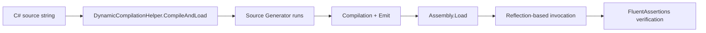

# Design Document: Named-Placeholder Runtime Smoke Tests

## Overview

This design specifies a set of runtime smoke tests that exercise the full source generator pipeline — generate → compile → load → invoke — for entities using the named-placeholder `[Computed("{PropertyName}")]` syntax. The existing `NamedPlaceholderCodeGenerationTests` verify code generation output and compilation, but most do not invoke the generated methods at runtime. These smoke tests close that gap by verifying `FromDynamoDb` round-trips, `ExtractComponents` helpers, `MatchesEntity` discrimination, GSI computed keys, 3+ property keys, and backward compatibility for positional syntax.

All tests live in a single class within the existing source generator test project, using the established `DynamicCompilationHelper.CompileAndLoad()` pattern and reflection-based invocation consistent with `NamedPlaceholderCodeGenerationTests`, `NonOverlappingPatternsBackwardCompatibilityIntegrationTests`, and `GeneratedLoggingIntegrationTests`.

## Architecture

The test class follows the same architecture as existing integration tests:



Each test defines entity source code as an inline C# string, compiles it with the source generator, loads the resulting assembly, and invokes generated methods via reflection to verify runtime behavior.

### Test File Location

`Oproto.FluentDynamoDb.SourceGenerator.UnitTests/Integration/NamedPlaceholderRuntimeSmokeTests.cs`

### Test Organization

The class is organized into regions mirroring the requirements:

| Region | Requirements | Tests |
|--------|-------------|-------|
| Helper Methods | R8 | Shared compilation and reflection helpers |
| FromDynamoDb Round-Trip | R1 | 2 tests: extracted properties, format specifiers |
| ExtractComponents | R2 | 2 tests: SK components, PK with format specifier |
| Composite Entity Assembly | R3 | 1 test: MatchesEntity child discrimination |
| Multi-Entity Discriminator | R4 | 1 test: two-entity cross-check |
| Three-Plus Property Keys | R5 | 2 tests: plain separator, format specifiers |
| GSI with Named-Placeholder | R6 | 2 tests: Keys method, ToDynamoDb GSI attribute |
| Backward Compatibility | R7 | 2 tests: positional Format round-trip, Separator extract |

## Components and Interfaces

### Test Class: `NamedPlaceholderRuntimeSmokeTests`

**Class-level attributes:**
- `[Trait("Category", "Integration")]` — consistent with existing integration test conventions (R8.5)
- `[SuppressMessage("Trimming", "IL2026:RequiresUnreferencedCode", ...)]` — required for reflection-based dynamic assembly testing

### Private Helper Methods

The following helper methods encapsulate reflection patterns established in existing tests. Each is derived from a specific existing test file.

#### `CompileAndLoadEntity(string source)` → `DynamicCompilationResult`

Wraps `DynamicCompilationHelper.CompileAndLoad` with standard references and the source generator. If compilation fails, `CompileAndLoad` throws `CompilationFailedException` with a descriptive error message containing all compilation errors — this satisfies R8.4's requirement for descriptive failure messages.

```csharp
private static DynamicCompilationResult CompileAndLoadEntity(string source)
{
    return DynamicCompilationHelper.CompileAndLoad(
        source,
        DynamicCompilationHelper.GetFluentDynamoDbReferences(),
        new DynamoDbSourceGenerator());
}
```

#### `InvokeToDynamoDb(Type entityType, object instance)` → `Dictionary<string, AttributeValue>`

Finds the static generic `ToDynamoDb<TSelf>` method, makes it generic with the entity type, and invokes with `(instance, null)` for options.

Pattern source: `NamedPlaceholderCodeGenerationTests.cs` lines 1098–1107.

```csharp
private static Dictionary<string, AttributeValue> InvokeToDynamoDb(Type entityType, object instance)
{
    var method = entityType.GetMethods(BindingFlags.Public | BindingFlags.Static)
        .FirstOrDefault(m => m.Name == "ToDynamoDb" && m.IsGenericMethod)
        ?? throw new InvalidOperationException($"ToDynamoDb method not found on {entityType.Name}");

    var genericMethod = method.MakeGenericMethod(entityType);
    return (Dictionary<string, AttributeValue>)genericMethod.Invoke(null, new[] { instance, null })!;
}
```

#### `InvokeFromDynamoDb(Type entityType, Dictionary<string, AttributeValue> item)` → `object`

Finds the static generic `FromDynamoDb<TSelf>` method using `DynamicCompilationHelper.GetGenericMethod`, invokes with `(item, null)` for options.

Pattern source: `GeneratedLoggingIntegrationTests.cs` lines 244–247.

```csharp
private static object InvokeFromDynamoDb(Type entityType, Dictionary<string, AttributeValue> item)
{
    var method = DynamicCompilationHelper.GetGenericMethod(
        entityType, "FromDynamoDb", BindingFlags.Public | BindingFlags.Static);
    return method.Invoke(null, new object?[] { item, null })!;
}
```

#### `InvokeMatchesEntity(Type entityType, Dictionary<string, AttributeValue> item)` → `bool`

Finds the static `MatchesEntity(Dictionary<string, AttributeValue>)` method (non-generic).

Pattern source: `NonOverlappingPatternsBackwardCompatibilityIntegrationTests.cs` lines 306–319.

```csharp
private static bool InvokeMatchesEntity(Type entityType, Dictionary<string, AttributeValue> item)
{
    var method = entityType.GetMethod("MatchesEntity", BindingFlags.Public | BindingFlags.Static)
        ?? throw new InvalidOperationException(
            $"MatchesEntity method not found on type '{entityType.Name}'.");
    return (bool)method.Invoke(null, new object[] { item })!;
}
```

#### `GetKeysMethod(Type entityType, string methodName)` → `MethodInfo`

Gets the nested `Keys` static class and retrieves the named method.

Pattern source: `NamedPlaceholderCodeGenerationTests.cs` lines 120–126.

```csharp
private static MethodInfo GetKeysMethod(Type entityType, string methodName)
{
    var keysType = entityType.GetNestedType("Keys", BindingFlags.Public | BindingFlags.Static)
        ?? throw new InvalidOperationException($"Keys nested type not found on {entityType.Name}");
    return keysType.GetMethod(methodName, BindingFlags.Public | BindingFlags.Static)
        ?? throw new InvalidOperationException(
            $"Method '{methodName}' not found on {entityType.Name}.Keys");
}
```

#### `CreateItem(params (string key, string value)[] attributes)` → `Dictionary<string, AttributeValue>`

Convenience method to build DynamoDB items from string key-value pairs.

```csharp
private static Dictionary<string, AttributeValue> CreateItem(
    params (string key, string value)[] attributes)
{
    var item = new Dictionary<string, AttributeValue>();
    foreach (var (key, value) in attributes)
        item[key] = new AttributeValue { S = value };
    return item;
}
```

### Entity Source Templates

Each test defines its entity source code as an inline C# string constant. All entity sources follow the same structure:

```csharp
var source = @"
using System;
using System.Collections.Generic;
using Oproto.FluentDynamoDb.Attributes;

[assembly: FluentDynamoDbSchemaVersion(1, 0)]

namespace TestNamespace
{
    [DynamoDbTable(""table-name"")]
    public partial class EntityName
    {
        // Key and property definitions
    }
}";
```

The `[assembly: FluentDynamoDbSchemaVersion(1, 0)]` attribute suppresses the FDDB110 diagnostic.

For multi-entity tests (R3, R4), both entities are defined in the same source string within the same namespace, sharing the same `[DynamoDbTable]` with `IsDefault = true` on one entity.

## Data Models

### Test Entity Definitions

Below are the entity definitions used by each test, showing the key attributes and properties exercised.

#### R1.1 / R2.1: InvoiceLine (Named-Placeholder SK with Extracted)

```csharp
[DynamoDbTable("invoices")]
public partial class InvoiceLine
{
    [PartitionKey(Prefix = "CUSTOMER")]
    [DynamoDbAttribute("pk")]
    public string Pk { get; set; } = string.Empty;

    [SortKey]
    [DynamoDbAttribute("sk")]
    [Computed("INVOICE#{InvoiceNumber}#LINE#{LineNumber}")]
    public string Sk { get; set; } = string.Empty;

    [Extracted("Sk", 0)]
    [DynamoDbAttribute("invoiceNumber")]
    public string InvoiceNumber { get; set; } = string.Empty;

    [Extracted("Sk", 1)]
    [DynamoDbAttribute("lineNumber")]
    public int LineNumber { get; set; }

    [DynamoDbAttribute("amount")]
    public decimal Amount { get; set; }
}
```

**R1.1 test flow:** Create instance → set Pk="CUSTOMER#C1", InvoiceNumber="INV-001", LineNumber=42, Amount=99.99 → `ToDynamoDb` → verify sk attribute = "INVOICE#INV-001#LINE#42" → `FromDynamoDb` on result → assert InvoiceNumber="INV-001" and LineNumber=42.

**R2.1 test flow:** `Keys.Sk("INV-001", 42)` → assert returns "INVOICE#INV-001#LINE#42" → `Keys.ExtractSkComponents("INVOICE#INV-001#LINE#42")` → assert extracted values match. The `ExtractSkComponents` method returns a `ValueTuple` — access tuple items via reflection on `Item1`, `Item2`, etc.

#### R1.2 / R2.2: TimeEntry (Named-Placeholder PK with Format Specifiers)

```csharp
[DynamoDbTable("timeseries")]
public partial class TimeEntry
{
    [PartitionKey]
    [DynamoDbAttribute("pk")]
    [Computed("ENTRY#{Date:yyyy-MM-dd}#{Sequence:D4}")]
    public string Pk { get; set; } = string.Empty;

    [SortKey]
    [DynamoDbAttribute("sk")]
    public string Sk { get; set; } = string.Empty;

    [Extracted("Pk", 0)]
    public DateOnly Date { get; set; }

    [Extracted("Pk", 1)]
    public int Sequence { get; set; }
}
```

**R1.2 test flow:** Create instance → set Date=DateOnly(2024,12,25), Sequence=7, Sk="META" → `ToDynamoDb` → verify pk = "ENTRY#2024-12-25#0007" → `FromDynamoDb` → assert Date and Sequence round-trip.

**R2.2 test flow:** A simpler entity with `[Computed("ENTRY#{Date:yyyy-MM-dd}")]` (single extracted property) → `Keys.Pk(DateOnly(2024,12,25))` → assert "ENTRY#2024-12-25" → `ExtractPkComponents` → assert DateOnly matches. The entity for R2.2 uses a single-property PK for a cleaner test of format specifier extraction.

#### R3.1: Invoice Parent + InvoiceLine Child (Composite Entity)

```csharp
[DynamoDbTable("invoices", IsDefault = true)]
public partial class Invoice
{
    [PartitionKey(Prefix = "CUSTOMER")]
    [DynamoDbAttribute("pk")]
    public string Pk { get; set; } = string.Empty;

    [SortKey(Prefix = "INVOICE")]
    [DynamoDbAttribute("sk")]
    public string Sk { get; set; } = string.Empty;

    [DynamoDbAttribute("invoiceNumber")]
    public string InvoiceNumber { get; set; } = string.Empty;

    [RelatedEntity("{InvoiceNumber}#LINE#*", EntityType = typeof(InvoiceLine))]
    public List<InvoiceLine> Lines { get; set; } = new();
}

[DynamoDbTable("invoices")]
public partial class InvoiceLine
{
    [PartitionKey(Prefix = "CUSTOMER")]
    [DynamoDbAttribute("pk")]
    public string Pk { get; set; } = string.Empty;

    [SortKey(Prefix = "LINE")]
    [DynamoDbAttribute("sk")]
    public string Sk { get; set; } = string.Empty;

    [DynamoDbAttribute("lineNumber")]
    public int LineNumber { get; set; }

    [DynamoDbAttribute("amount")]
    public decimal Amount { get; set; }
}
```

**Test flow:** Compile both entities → construct items with sk="INVOICE#INV-001" (parent) and sk="LINE#1", sk="LINE#2" (children) → invoke `MatchesEntity` on the child (`InvoiceLine`) type → assert child items match, parent item does not.

#### R4.1: OrderItem + ShipmentItem (Multi-Entity Discrimination)

```csharp
[DynamoDbTable("fulfillment", IsDefault = true)]
public partial class OrderItem
{
    [PartitionKey]
    [DynamoDbAttribute("pk")]
    public string Pk { get; set; } = string.Empty;

    [SortKey]
    [DynamoDbAttribute("sk")]
    [Computed("ORDER#{OrderId}")]
    public string Sk { get; set; } = string.Empty;

    [Extracted("Sk", 0)]
    [DynamoDbAttribute("orderId")]
    public string OrderId { get; set; } = string.Empty;
}

[DynamoDbTable("fulfillment")]
public partial class ShipmentItem
{
    [PartitionKey]
    [DynamoDbAttribute("pk")]
    public string Pk { get; set; } = string.Empty;

    [SortKey]
    [DynamoDbAttribute("sk")]
    [Computed("SHIPMENT#{ShipmentId}")]
    public string Sk { get; set; } = string.Empty;

    [Extracted("Sk", 0)]
    [DynamoDbAttribute("shipmentId")]
    public string ShipmentId { get; set; } = string.Empty;
}
```

**Test flow:** Compile → create item with sk="ORDER#ORD-1" and item with sk="SHIPMENT#SHP-1" → `MatchesEntity` on both types for both items → assert each matches only its own pattern.

#### R5.1 / R5.2: DateEvent (Three-Property Computed Key)

**R5.1 (separator):**
```csharp
[DynamoDbTable("events")]
public partial class DateEvent
{
    [PartitionKey]
    [DynamoDbAttribute("pk")]
    [Computed("{Year}#{Month}#{Day}")]
    public string Pk { get; set; } = string.Empty;

    [SortKey]
    [DynamoDbAttribute("sk")]
    public string Sk { get; set; } = string.Empty;

    [Extracted("Pk", 0)]
    public int Year { get; set; }
    [Extracted("Pk", 1)]
    public int Month { get; set; }
    [Extracted("Pk", 2)]
    public int Day { get; set; }
}
```

**R5.2 (with format specifiers):**
```csharp
[Computed("{Year:D4}#{Month:D2}#{Day:D2}")]
```

Same structure as R5.1, just with format specifiers on each placeholder.

**Test flow (both):** `Keys.Pk(year, month, day)` → assert key string → `ExtractPkComponents` → assert extracted tuple values match input.

#### R6.1 / R6.2: ProductItem (GSI + Named-Placeholder Computed)

```csharp
[DynamoDbTable("products")]
public partial class ProductItem
{
    [PartitionKey]
    [DynamoDbAttribute("pk")]
    public string Pk { get; set; } = string.Empty;

    [SortKey]
    [DynamoDbAttribute("sk")]
    public string Sk { get; set; } = string.Empty;

    [GsiPartitionKey("status-index")]
    [DynamoDbAttribute("gsi1pk")]
    [Computed("{Status}#{Category}")]
    public string Gsi1Pk { get; set; } = string.Empty;

    [Extracted("Gsi1Pk", 0)]
    [DynamoDbAttribute("status")]
    public string Status { get; set; } = string.Empty;

    [Extracted("Gsi1Pk", 1)]
    [DynamoDbAttribute("category")]
    public string Category { get; set; } = string.Empty;

    [DynamoDbAttribute("name")]
    public string Name { get; set; } = string.Empty;
}
```

**R6.1 test flow:** Compile → get `Keys.Gsi1Pk` method → invoke with ("active", "electronics") → assert returns "active#electronics".

**R6.2 test flow:** Create instance with Status="active", Category="electronics", Pk="PROD#1", Sk="META" → `ToDynamoDb` → assert dictionary contains "gsi1pk" key with value "active#electronics".

#### R7.1: PositionalEntity (Backward Compatibility — Format)

```csharp
[DynamoDbTable("legacy")]
public partial class PositionalEntity
{
    [PartitionKey]
    [DynamoDbAttribute("pk")]
    [Computed("Year", "Month", Format = "{0}#{1}")]
    public string Pk { get; set; } = string.Empty;

    [SortKey]
    [DynamoDbAttribute("sk")]
    public string Sk { get; set; } = string.Empty;

    [Extracted("Pk", 0)]
    public int Year { get; set; }

    [Extracted("Pk", 1)]
    public int Month { get; set; }

    [DynamoDbAttribute("data")]
    public string Data { get; set; } = string.Empty;
}
```

**Test flow:** Create instance with Year=2024, Month=6, Sk="DATA", Data="test" → `ToDynamoDb` → verify pk = "2024#6" → `FromDynamoDb` → assert Year=2024, Month=6, Data="test".

#### R7.2: SeparatorEntity (Backward Compatibility — Separator)

```csharp
[DynamoDbTable("legacy")]
public partial class SeparatorEntity
{
    [PartitionKey]
    [DynamoDbAttribute("pk")]
    [Computed("TenantId", "UserId", Separator = "#")]
    public string Pk { get; set; } = string.Empty;

    [SortKey]
    [DynamoDbAttribute("sk")]
    public string Sk { get; set; } = string.Empty;

    [Extracted("Pk", 0)]
    [DynamoDbAttribute("tenantId")]
    public string TenantId { get; set; } = string.Empty;

    [Extracted("Pk", 1)]
    [DynamoDbAttribute("userId")]
    public string UserId { get; set; } = string.Empty;
}
```

**Test flow:** `Keys.Pk("T1", "U1")` → assert "T1#U1" → `ExtractPkComponents("T1#U1")` → assert Item1="T1", Item2="U1".

## Error Handling

### Compilation Failures

`DynamicCompilationHelper.CompileAndLoad()` throws `CompilationFailedException` with a formatted string of all compilation errors if the generated code fails to compile. This exception propagates as the test failure message, satisfying R8.4.

### Reflection Failures

Each helper method throws `InvalidOperationException` with a descriptive message if the expected method or type is not found in the dynamically loaded assembly. This catches cases where the source generator didn't produce the expected code structure.

### ValueTuple Access

`ExtractPkComponents` and `ExtractSkComponents` return `ValueTuple<T1, T2, ...>` types. Since these are loaded from a dynamic assembly, we access tuple members via reflection using property names `Item1`, `Item2`, `Item3`, etc. The helper converts the result object to a dynamic or accesses properties directly.

## Testing Strategy

### Why Property-Based Testing Does Not Apply

Property-based testing is not appropriate for this feature because:

1. **Fixed entity definitions:** Each test uses a specific, hand-crafted entity source string — the inputs don't vary meaningfully across a range.
2. **Testing infrastructure, not pure functions:** These tests verify the source generator pipeline + reflection invocation, not algorithmic logic with varied inputs.
3. **Deterministic behavior:** Running the same entity definition through the source generator 100 times produces identical output every time. One iteration catches the same bugs as 100.
4. **High cost per iteration:** Each test compiles an assembly from source, which is expensive — running 100 iterations would be slow without additional bug-finding value.

### Test Approach

All 12 tests are example-based integration tests using xUnit `[Fact]` attributes and FluentAssertions.

| Test # | Test Name | Requirement | What It Verifies |
|--------|-----------|-------------|-----------------|
| 1 | `FromDynamoDb_NamedPlaceholder_PopulatesExtractedProperties` | R1.1 | ToDynamoDb → FromDynamoDb round-trip with named-placeholder Extracted properties |
| 2 | `FromDynamoDb_NamedPlaceholderWithFormatSpecifiers_PopulatesExtractedProperties` | R1.2 | Round-trip with format specifiers (DateOnly, D4 padding) |
| 3 | `ExtractSkComponents_NamedPlaceholder_ReturnsCorrectValues` | R2.1 | Keys.Sk() builds key, ExtractSkComponents() decomposes it |
| 4 | `ExtractPkComponents_NamedPlaceholderWithFormatSpecifier_ReturnsCorrectValues` | R2.2 | Keys.Pk() with DateOnly format, ExtractPkComponents() returns correct DateOnly |
| 5 | `MatchesEntity_NamedPlaceholderRelatedEntity_CorrectlyDiscriminatesChildItems` | R3.1 | Child MatchesEntity returns true for child SK patterns, false for parent |
| 6 | `MatchesEntity_TwoNamedPlaceholderEntities_CorrectlyDiscriminates` | R4.1 | Cross-entity MatchesEntity: each entity matches only its own items |
| 7 | `ThreePropertyComputedKey_NamedPlaceholder_KeysAndExtractWork` | R5.1 | 3-property Keys.Pk() and ExtractPkComponents() with separator |
| 8 | `ThreePropertyComputedKey_NamedPlaceholderWithFormatSpecifiers_KeysAndExtractWork` | R5.2 | 3-property Keys.Pk() and ExtractPkComponents() with D4/D2 format specifiers |
| 9 | `GsiWithNamedPlaceholderComputedKey_KeysMethodWorks` | R6.1 | GSI Keys method produces correct computed key string |
| 10 | `GsiWithNamedPlaceholderComputedKey_ToDynamoDbIncludesGsiAttribute` | R6.2 | ToDynamoDb includes GSI key attribute with correct computed value |
| 11 | `BackwardCompat_PositionalSyntax_FullRoundTrip` | R7.1 | Positional Format syntax: full ToDynamoDb → FromDynamoDb round-trip with Extracted |
| 12 | `BackwardCompat_SeparatorSyntax_ExtractComponentsWork` | R7.2 | Separator syntax: Keys.Pk() and ExtractPkComponents() still work |

### Test Infrastructure (R8)

- Single test file: `NamedPlaceholderRuntimeSmokeTests.cs` in the `Integration/` folder (R8.1)
- Uses `DynamicCompilationHelper.CompileAndLoad()` and `GetFluentDynamoDbReferences()` (R8.2)
- xUnit `[Fact]` and FluentAssertions (R8.3)
- `CompilationFailedException` provides descriptive failure on compile errors (R8.4)
- `[Trait("Category", "Integration")]` on the class (R8.5)
