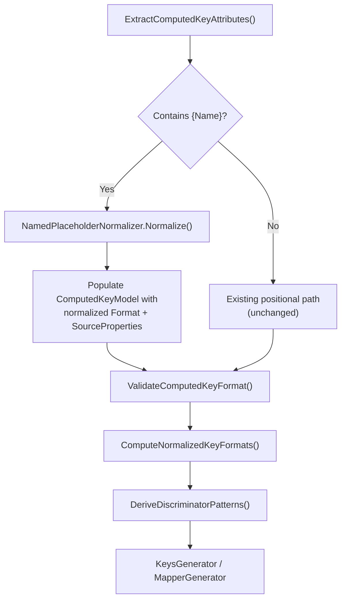

# Design Document: Named Property Placeholders

## Overview

Named property placeholders allow developers to write `{PropertyName}` and `{PropertyName:format}` tokens directly in `[Computed]` format strings and `[RelatedEntity]` sort key patterns, replacing the positional `{0}`, `{1}` syntax that requires separately listed source property names.

### Problem

The current `[Computed]` syntax requires developers to maintain a mental mapping between positional indices and source property names:

```csharp
// Current: positional — must count indices and cross-reference property names
[Computed("InvoiceNumber", "LineNumber", Format = "INVOICE#{0}#LINE#{1}")]
public string Sk { get; set; } = string.Empty;
```

This is error-prone when format strings have many placeholders, and the fluentdynamodb.dev documentation already shows `{PropertyName}` syntax as the primary approach — but it was never implemented.

### Solution

Introduce a normalization step early in the source generator pipeline that detects `{PropertyName}` tokens, resolves them against the entity's declared properties at compile time, and rewrites them to positional `{N}` form before the downstream pipeline runs:

```csharp
// New: named — self-documenting, no positional index bookkeeping
[Computed("INVOICE#{InvoiceNumber}#LINE#{LineNumber}")]
public string Sk { get; set; } = string.Empty;
```

Both syntaxes produce identical `ComputedKeyModel` state after normalization. The entire downstream pipeline (`ComputeNormalizedKeyFormats`, `DeriveDiscriminatorPatterns`, `KeysGenerator`, `MapperGenerator`) operates on positional `{N}` strings unchanged.

### Design Rationale

Named placeholders are **syntactic sugar over positional**. Normalizing early (in `EntityAnalyzer`, between attribute extraction and format validation) keeps the change surface minimal — only the front-end parsing logic needs to understand `{Name}`, and everything downstream stays positional. This avoids changes to `ComputeNormalizedKeyFormats`, `DeriveDiscriminatorPatterns`, `KeysGenerator`, `MapperGenerator`, `FormatSpecifierHelper`, and the discriminator scoring pipeline.

No changes are needed to the `ComputedAttribute` or `RelatedEntityAttribute` runtime classes. The `params string[]` constructor on `[Computed]` already accepts a single string argument, and `[RelatedEntity]` already accepts a `string sortKeyPattern`. Detection relies on the presence of `{` in the argument value — valid C# property names cannot contain braces.

## Architecture

### Pipeline Integration Point

The normalization step inserts between attribute extraction and format validation within `EntityAnalyzer`:



For `[RelatedEntity]`, the same normalizer runs during `ExtractRelationships()` to resolve `{PropertyName}` tokens in sort key patterns before the pattern enters discriminator derivation.

### Boundary: What Changes vs What Doesn't

**Changes:**

| Component | Change |
|-----------|--------|
| `EntityAnalyzer.ExtractComputedKeyAttributes()` | Add detection and normalization call after attribute parsing |
| `EntityAnalyzer.ExtractRelationships()` | Add detection and normalization call for sort key patterns |
| `EntityAnalyzer.ValidateComputedKeyFormat()` | Update to skip named-placeholder validation (already normalized by this point) |
| `DiagnosticDescriptors` | Add FDDB091–FDDB096 |

**New:**

| Component | Purpose |
|-----------|---------|
| `NamedPlaceholderNormalizer` | Static utility: parse `{Name}` tokens, resolve against entity properties, rewrite to `{N}`, emit diagnostics |

**Unchanged (by design):**

| Component | Why |
|-----------|-----|
| `ComputedAttribute` | `params string[]` already accepts a single format string |
| `RelatedEntityAttribute` | `string sortKeyPattern` already accepts named placeholders |
| `ComputedKeyModel` | After normalization, `SourceProperties` and `Format` contain positional data identical to hand-written positional syntax |
| `ComputeNormalizedKeyFormats()` | Receives positional `{N}` format strings as before |
| `DeriveDiscriminatorPatterns()` | Receives positional `{N}` format strings as before |
| `KeysGenerator` | Receives `ComputedKeyModel` with positional data as before |
| `MapperGenerator` | Receives `ComputedKeyModel` with positional data as before |
| `FormatSpecifierHelper` | Operates on positional `{N:format}` strings as before |
| `[Extracted]` attribute handling | Values stored verbatim, no named-placeholder scanning |

## Components and Interfaces

### NamedPlaceholderNormalizer (New)

**Location:** `Oproto.FluentDynamoDb.SourceGenerator/Utilities/NamedPlaceholderNormalizer.cs`

A static utility class that parses named placeholder tokens from format strings, resolves them against known property names, and produces a positional equivalent.

```csharp
internal static class NamedPlaceholderNormalizer
{
    /// <summary>
    /// Result of normalizing a format string from named to positional placeholders.
    /// </summary>
    internal readonly struct NormalizationResult
    {
        /// <summary>The rewritten format string with {N} and {N:specifier} placeholders.</summary>
        public string NormalizedFormat { get; init; }

        /// <summary>Source property names in positional index order (first appearance).</summary>
        public string[] SourceProperties { get; init; }

        /// <summary>True if the input contained named placeholders and was normalized.</summary>
        public bool WasNormalized { get; init; }

        /// <summary>Diagnostics produced during normalization (unresolved names, malformed tokens, etc.).</summary>
        public IReadOnlyList<NormalizationDiagnostic> Diagnostics { get; init; }
    }

    /// <summary>
    /// A diagnostic produced during normalization.
    /// </summary>
    internal readonly struct NormalizationDiagnostic
    {
        public NormalizationDiagnosticKind Kind { get; init; }
        public string Message { get; init; }
        public string? Token { get; init; }
        public int? CharOffset { get; init; }
    }

    internal enum NormalizationDiagnosticKind
    {
        UnresolvedProperty,       // FDDB092
        MixedNamedAndPositional,  // FDDB093
        MalformedPlaceholder,     // FDDB094
        EmptyPlaceholder,         // FDDB095
        AmbiguousNameIndex        // FDDB096
    }

    /// <summary>
    /// Determines whether a string contains named placeholders.
    /// A named placeholder is {Identifier} or {Identifier:format} where Identifier
    /// is a valid C# identifier that is not a non-negative integer.
    /// </summary>
    public static bool ContainsNamedPlaceholders(string formatString);

    /// <summary>
    /// Normalizes a format string from named to positional placeholders.
    /// </summary>
    /// <param name="formatString">The format string potentially containing {PropertyName} tokens.</param>
    /// <param name="knownPropertyNames">Set of declared property names on the entity for resolution.</param>
    /// <returns>Normalization result containing the rewritten format and inferred source properties.</returns>
    public static NormalizationResult Normalize(
        string formatString,
        IReadOnlySet<string> knownPropertyNames);
}
```

#### Detection Logic

The detection logic distinguishes named-placeholder format strings from property name lists:

1. **Single positional argument containing `{`**: Treat as named-placeholder format string. Valid C# property names cannot contain `{`, so this is unambiguous.
2. **Multiple positional arguments, none containing `{`**: Existing positional property name behavior (unchanged).
3. **Multiple positional arguments, any containing `{`**: Emit FDDB091 error — ambiguous.
4. **`Format` named parameter containing named placeholders**: Normalize the `Format` value, infer `SourceProperties` from it.

#### Parsing Rules

The parser scans the format string left-to-right for `{...}` tokens:

1. **`{Identifier}`** — Named placeholder without format specifier. `Identifier` matches `[A-Za-z_][A-Za-z0-9_]*` and is not parseable as a non-negative integer.
2. **`{Identifier:specifier}`** — Named placeholder with format specifier. The specifier is everything after the first `:` up to the closing `}`, preserved character-for-character (including embedded colons like `HH:mm:ss`).
3. **`{N}`** or **`{N:specifier}`** where `N` is a non-negative integer — Positional placeholder. If mixed with named placeholders in the same string, emit FDDB093.
4. **`{}`** — Empty placeholder. Emit FDDB095.
5. **`{` without matching `}`** — Malformed. Emit FDDB094 with character offset.

#### Index Assignment

Each unique property name encountered (left-to-right, first appearance) receives the next zero-based index. A property appearing multiple times in the format string receives the same index each time.

Example: `"INVOICE#{InvoiceNumber}#LINE#{LineNumber}#REF#{InvoiceNumber}"`
- `InvoiceNumber` → index 0 (first at position 9)
- `LineNumber` → index 1 (first at position 31)
- `InvoiceNumber` → index 0 (reused)
- Output: `"INVOICE#{0}#LINE#{1}#REF#{0}"`
- SourceProperties: `["InvoiceNumber", "LineNumber"]`

#### Property Resolution

Each extracted identifier is resolved against the set of property names declared on the entity class (ordinal case-sensitive matching). Only properties with `[DynamoDbAttribute]` are considered. An unresolved name produces FDDB092 with the unresolved name and a comma-separated list of available property names.

#### Ambiguity: Name vs Index

If a placeholder like `{0}` matches both a valid positional index and a declared property name `"0"` on the entity, the normalizer resolves it as a **property name reference** and emits warning FDDB096. This matches the design decision from the issue — property names take precedence over positional indices.

### EntityAnalyzer Changes

#### ExtractComputedKeyAttributes (Modified)

After extracting `sourceProperties` and the `Format` named parameter from the `[Computed]` attribute, the method inserts a normalization check:

```
1. Parse positional constructor arguments → sourceProperties[]
2. Parse Format and Separator named parameters
3. NEW: Detect named placeholders
   a. If sourceProperties.Length == 1 && sourceProperties[0].Contains('{'):
      - Call NamedPlaceholderNormalizer.Normalize(sourceProperties[0], entityPropertyNames)
      - Set computedModel.Format = result.NormalizedFormat
      - Set computedModel.SourceProperties = result.SourceProperties
   b. If sourceProperties.Length > 1 && any sourceProperties[i].Contains('{'):
      - Emit FDDB091
   c. If Format != null && ContainsNamedPlaceholders(Format):
      - If sourceProperties.Length > 0: Emit FDDB091 (can't combine named format with explicit source properties)
      - Else: Call Normalize(Format, entityPropertyNames)
        - Set computedModel.Format = result.NormalizedFormat
        - Set computedModel.SourceProperties = result.SourceProperties
   d. Otherwise: existing behavior (no change)
4. Emit any diagnostics from NormalizationResult
5. Continue to existing validation
```

#### ExtractRelationships (Modified)

After extracting the `SortKeyPattern` from `[RelatedEntity]`, the method inserts a normalization check:

```
1. Parse sortKeyPattern from constructor argument
2. NEW: If sortKeyPattern contains '{' followed by a C# identifier:
   a. Call NamedPlaceholderNormalizer.Normalize(sortKeyPattern, entityPropertyNames)
   b. Replace sortKeyPattern in the RelationshipModel with the normalized pattern
   c. Store resolved source property references for downstream use
3. Emit any diagnostics
4. Continue existing relationship validation
```

Named placeholders in `[RelatedEntity]` coexist with `*` wildcards. The normalizer treats `*` as literal text (not a placeholder), so `"{OrderId}#LINE#*"` normalizes to `"{0}#LINE#*"` with `SourceProperties: ["OrderId"]`.

#### ValidateComputedKeyFormat (Modified)

The existing validation at line 2234 rejects non-integer placeholder indices as invalid. After normalization, this path is never reached for named-placeholder format strings because they've already been rewritten to `{N}` form. However, to guard against edge cases, add an early return if the format was already normalized (tracked via a flag or by checking that normalization already ran successfully).

### Diagnostic Descriptors (New)

Six new diagnostics in the FDDB091–FDDB096 range:

| Code | Severity | Title | Message Template | Trigger |
|------|----------|-------|-----------------|---------|
| FDDB091 | Error | Ambiguous named placeholder usage | `"[Computed] on property '{0}' has multiple positional arguments containing '{{'. Use a single format string with {{PropertyName}} placeholders, or use property names without braces as separate positional arguments with a Format parameter."` | Multiple positional args containing `{`, or named-placeholder Format combined with explicit source properties |
| FDDB092 | Error | Unresolved named placeholder | `"Named placeholder '{{{{1}}}}' in [Computed] on property '{0}' does not match any property on entity '{2}'. Available properties: {3}"` | `{Name}` where Name is not a declared property |
| FDDB093 | Error | Mixed named and positional placeholders | `"Format string on property '{0}' mixes named placeholders (e.g., {{{{1}}}}) with positional placeholders (e.g., {{{2}}}). Use all named or all positional placeholders."` | `{Name}` and `{N}` in same format string |
| FDDB094 | Error | Malformed placeholder | `"Format string on property '{0}' has an unclosed brace at character offset {1}: '{2}'"` | `{Name` without closing `}` |
| FDDB095 | Error | Empty placeholder | `"Format string on property '{0}' has an empty placeholder '{{}}' at character offset {1}"` | `{}` in format string |
| FDDB096 | Warning | Ambiguous placeholder name/index | `"Placeholder '{{{1}}}' on property '{0}' matches both a property name and a positional index. It was resolved as a property name. Consider renaming the property to avoid ambiguity."` | `{0}` where entity has property named `"0"` |

All diagnostics are located on the attribute syntax node so the IDE underlines the attribute declaration.

## Data Models

### No Changes to Existing Models

The design normalizes named placeholders to positional form before populating `ComputedKeyModel`. This means:

- **`ComputedKeyModel`** — No changes. After normalization, `SourceProperties` contains property names in positional order and `Format` contains `{N}` placeholders, identical to hand-written positional syntax.
- **`PropertyModel`** — No changes. `NormalizedKeyFormat` and `DerivedDiscriminatorPattern` are computed from the already-normalized `ComputedKeyModel`.
- **`EntityModel`** — No changes.
- **`RelationshipModel`** — No changes. The `SortKeyPattern` is stored as the normalized positional string.
- **`ExtractedKeyModel`** — No changes. `[Extracted]` attributes are explicitly excluded from named-placeholder processing (Requirement 8).
- **`ComputedAttribute`** — No changes. The `params string[]` constructor already accepts a single format string argument.
- **`RelatedEntityAttribute`** — No changes. The `string sortKeyPattern` constructor already accepts strings containing `{Name}` tokens.

### New: NormalizationResult (Internal)

Introduced as a `readonly struct` inside `NamedPlaceholderNormalizer` (see Components section above). This is an internal source-generator type that does not appear in the public API or the runtime library.

| Field | Type | Description |
|-------|------|-------------|
| `NormalizedFormat` | `string` | Rewritten format string with `{N}` and `{N:specifier}` placeholders |
| `SourceProperties` | `string[]` | Property names in positional index order (first appearance, left-to-right) |
| `WasNormalized` | `bool` | True if input contained named placeholders and was rewritten |
| `Diagnostics` | `IReadOnlyList<NormalizationDiagnostic>` | Any errors/warnings produced during normalization |

### New: NormalizationDiagnostic (Internal)

| Field | Type | Description |
|-------|------|-------------|
| `Kind` | `NormalizationDiagnosticKind` | Category mapping to FDDB091–FDDB096 |
| `Message` | `string` | Human-readable description |
| `Token` | `string?` | The placeholder token that caused the diagnostic |
| `CharOffset` | `int?` | Character offset within the format string (for malformed/empty placeholders) |

### Equivalence Guarantee

The normalization guarantee is that for any entity, the following two declarations produce identical `ComputedKeyModel` state:

```csharp
// Named syntax:
[Computed("INVOICE#{InvoiceNumber}#LINE#{LineNumber}")]
public string Sk { get; set; } = string.Empty;

// Positional syntax:
[Computed("InvoiceNumber", "LineNumber", Format = "INVOICE#{0}#LINE#{1}")]
public string Sk { get; set; } = string.Empty;
```

After normalization, both produce:
- `ComputedKeyModel.SourceProperties` = `["InvoiceNumber", "LineNumber"]`
- `ComputedKeyModel.Format` = `"INVOICE#{0}#LINE#{1}"`

This equivalence extends to format specifiers:

```csharp
// Named with format specifier:
[Computed("ENTRY#{Date:yyyy-MM-dd}")]
// Positional equivalent:
[Computed("Date", Format = "ENTRY#{0:yyyy-MM-dd}")]
// Both produce: Format = "ENTRY#{0:yyyy-MM-dd}", SourceProperties = ["Date"]
```


## Correctness Properties

*A property is a characteristic or behavior that should hold true across all valid executions of a system — essentially, a formal statement about what the system should do. Properties serve as the bridge between human-readable specifications and machine-verifiable correctness guarantees.*

### Property 1: Named-to-Positional Equivalence

*For any* entity with a set of declared properties and *for any* valid format string using named placeholders `{PropertyName}` or `{PropertyName:specifier}`, normalizing the format string SHALL produce a `(SourceProperties, Format)` pair that is identical to the `(SourceProperties, Format)` pair produced by the equivalent hand-written positional `[Computed]` declaration with explicit source property names and `{N}`-based format string.

Concretely: if the named format `"LITERAL#{A}#LITERAL#{B:fmt}"` is normalized against an entity declaring properties `A` and `B`, then `SourceProperties` SHALL equal `["A", "B"]` and `Format` SHALL equal `"LITERAL#{0}#LITERAL#{1:fmt}"` — which is the same state produced by `[Computed("A", "B", Format = "LITERAL#{0}#LITERAL#{1:fmt}")]`.

This property subsumes detection (1.1, 1.2, 2.1, 2.7), parsing (3.1), rewriting (1.3, 3.2, 3.3), index assignment (3.1), deduplication (1.7, 2.4), format specifier preservation (4.1, 4.2, 4.3), and FormatSpecifierHelper equivalence (4.2).

**Validates: Requirements 1.1, 1.2, 1.3, 1.7, 2.1, 2.2, 2.4, 2.7, 3.1, 3.2, 3.3, 3.4, 4.1, 4.2, 4.3**

### Property 2: Backward Compatibility — Positional Syntax Unchanged

*For any* valid `[Computed]` attribute declaration that uses positional `{N}` placeholders with explicit source property names (the existing syntax), the source generator SHALL produce a `ComputedKeyModel` with the same `SourceProperties` array contents and order, the same `Format` string value, and the same `Separator` string value as the version prior to named placeholder support. No normalization diagnostics SHALL be emitted.

This property ensures the existing positional path is untouched — the normalizer either does not activate (no `{` in property name arguments) or produces no side effects for positional-only inputs.

**Validates: Requirements 1.5, 6.1, 6.2, 6.4**

### Property 3: Wildcard Preservation in RelatedEntity Patterns

*For any* `[RelatedEntity]` sort key pattern containing named placeholders `{PropertyName}` alongside wildcard `*` characters, normalization SHALL replace each `{PropertyName}` with the corresponding `{N}` positional placeholder while preserving every `*` character at its original position in the pattern. The resulting pattern SHALL be functionally equivalent to the hand-written pattern with literal property values substituted for `{Name}` tokens and `*` retained.

This property ensures that the normalization step does not corrupt wildcard-based discrimination. For example, `"{OrderId}#LINE#*"` normalizes to `"{0}#LINE#*"` — the `*` is never consumed or rewritten.

**Validates: Requirements 5.1, 5.3, 5.4, 5.7, 6.3**

### Property 4: FDDB091 Rejection of Ambiguous Multi-Argument Input

*For any* `[Computed]` attribute with more than one positional constructor argument where at least one argument contains a `{` character, the source generator SHALL emit diagnostic FDDB091 with severity Error. Code generation for the containing entity SHALL be halted.

**Validates: Requirements 1.4, 2.5, 7.1**

### Property 5: FDDB092 Rejection of Unresolved Property Names

*For any* format string containing a `{Name}` token where `Name` is a valid C# identifier that does not match any declared property (with `[DynamoDbAttribute]`) on the containing entity (case-sensitive), the source generator SHALL emit diagnostic FDDB092 with severity Error. The diagnostic message SHALL include the unresolved property name and the list of available property names.

**Validates: Requirements 1.6, 2.3, 3.5, 5.2, 7.2**

### Property 6: FDDB093 Rejection of Mixed Named and Positional Placeholders

*For any* format string containing at least one named placeholder `{Name}` and at least one positional placeholder `{N}` (where `N` is a non-negative integer and `Name` is not parseable as a non-negative integer), the source generator SHALL emit diagnostic FDDB093 with severity Error.

**Validates: Requirements 3.6, 5.6**

### Property 7: Extracted Attribute Exclusion

*For any* `[Extracted]` attribute declaration, the source generator SHALL store the `sourceProperty` constructor argument as a verbatim literal string in `ExtractedKey.SourceProperty` with no scanning for `{PropertyName}` tokens, no normalization, and no diagnostic emission — regardless of whether the string value contains brace characters.

**Validates: Requirements 8.1, 8.2, 8.3**

## Error Handling

### Diagnostic Emission Strategy

All diagnostics are emitted during the `EntityAnalyzer` analysis phase, specifically within `ExtractComputedKeyAttributes()` and `ExtractRelationships()` after the normalization step. Diagnostics are located on the attribute syntax node so IDEs underline the attribute declaration.

### Diagnostic Reference

| Code | Severity | Title | Trigger | Entity Halt |
|------|----------|-------|---------|-------------|
| FDDB091 | Error | Ambiguous named placeholder usage | Multiple positional args containing `{`, or named-placeholder `Format` combined with explicit source properties | Yes |
| FDDB092 | Error | Unresolved named placeholder | `{Name}` where `Name` is not a declared property on the entity | Yes |
| FDDB093 | Error | Mixed named and positional placeholders | Both `{Name}` and `{N}` tokens in the same format string | Yes |
| FDDB094 | Error | Malformed placeholder | `{Name` without closing `}` | Yes |
| FDDB095 | Error | Empty placeholder | `{}` in format string | Yes |
| FDDB096 | Warning | Ambiguous placeholder name/index | `{0}` where entity has a property named `"0"` — resolved as property name | No |

### Error Recovery

When a normalization error (FDDB091–FDDB095) is encountered, the normalizer returns a `NormalizationResult` with `WasNormalized = false` and populated `Diagnostics`. The calling code in `EntityAnalyzer`:

1. Emits each `NormalizationDiagnostic` as a Roslyn `Diagnostic` located on the attribute syntax node.
2. Does **not** populate `ComputedKeyModel` with partial/invalid data.
3. Returns `null` from `AnalyzeEntity()` when critical errors are present, halting code generation for that entity.

For the warning-level FDDB096 (ambiguous name/index), the normalizer resolves as a property name, emits the diagnostic, and continues normalization. Code generation proceeds normally.

### Interaction with Existing Diagnostics

- **FDDB090** (Format placeholder count mismatch): After normalization, the format string is positional and `ValidateComputedKeyFormat()` runs as usual. If a normalization bug produced a mismatched placeholder count, FDDB090 would catch it as a safety net.
- **DYNDB031** (Invalid computed key source): After normalization, the inferred `SourceProperties` are validated by the existing source property resolution logic. If the normalizer resolved a property name that somehow doesn't exist in the entity model, DYNDB031 catches it.

These existing diagnostics serve as defense-in-depth — they should never fire for correctly normalized input, but they remain active as guards.

### Graceful Handling of Edge Cases

| Edge Case | Behavior |
|-----------|----------|
| Format string with no placeholders (e.g., `"LITERAL"`) | Not detected as named-placeholder input. Existing behavior. |
| Format string with escaped braces (`{{` / `}}`) | Not supported by DynamoDB key patterns. Passed through verbatim — existing behavior. |
| Property name that is a C# keyword (e.g., `class`) | Not a valid C# identifier in attribute context. Would be caught by the C# compiler before the source generator runs. |
| Empty format string | Not detected as named-placeholder input (`Contains('{')` is false). Existing behavior. |
| Very long format string | Normalizer is O(n) single-pass. No performance concern. |

## Testing Strategy

### Testing Framework

- **xUnit** for test organization
- **FsCheck** (via `FsCheck.Xunit`) for property-based tests — minimum 100 iterations per property
- **FluentAssertions** for readable assertions
- **NSubstitute** for mocking (if needed for integration tests)

### Property-Based Tests

Each correctness property maps to one property-based test. Tests use custom generators to produce:
- Random sets of valid C# property names (identifiers matching `[A-Za-z_][A-Za-z0-9_]*`)
- Random format strings built from those property names with literal segments between placeholders
- Random format specifiers from a representative set (`yyyy-MM-dd`, `D4`, `HH:mm:ss`, `F2`, etc.)

| Property | Test | Generator Strategy |
|----------|------|-------------------|
| P1: Named-to-positional equivalence | `Normalize_NamedSyntax_ProducesIdenticalModelToPositionalSyntax` | Generate N random property names, build named format string with random literal segments, build equivalent positional format string, normalize named, compare |
| P2: Backward compat | `Normalize_PositionalSyntax_ProducesUnchangedModel` | Generate valid positional [Computed] declarations (no `{` in property names), verify no normalization occurs |
| P3: Wildcard preservation | `Normalize_RelatedEntityPattern_PreservesWildcards` | Generate patterns with mix of `{Name}` tokens and `*` at random positions, verify `*` positions unchanged after normalization |
| P4: FDDB091 multi-arg | `Normalize_MultipleArgsWithBraces_EmitsFDDB091` | Generate arrays of >1 strings where at least one contains `{`, verify diagnostic kind |
| P5: FDDB092 unresolved | `Normalize_UnresolvedPropertyName_EmitsFDDB092` | Generate format strings with random identifiers NOT in the known property set, verify diagnostic kind |
| P6: FDDB093 mixed | `Normalize_MixedNamedAndPositional_EmitsFDDB093` | Generate format strings with at least one `{Name}` and one `{N}`, verify diagnostic kind |
| P7: Extracted exclusion | `ExtractedAttribute_StoresVerbatim_NoNormalization` | Generate random strings (including those with `{`), verify stored verbatim |

### Unit Tests (Example-Based)

Specific scenarios that complement property tests:

| Category | Tests |
|----------|-------|
| **Basic normalization** | Single property, two properties, three+ properties; with and without format specifiers |
| **Format specifiers** | `{Date:yyyy-MM-dd}`, `{Sequence:D4}`, `{Time:HH:mm:ss}` (embedded colons), mixed specifier/no-specifier |
| **Deduplication** | Property appearing 2x, 3x in same format string |
| **Ambiguity (FDDB096)** | Entity with property named `"0"`, `{0}` in format string — resolves as property, emits warning |
| **Diagnostic messages** | Verify exact message format for FDDB091–FDDB096 including available property list in FDDB092 |
| **Diagnostic location** | Verify diagnostic Location points to attribute syntax node |
| **Malformed input** | Unclosed brace `{Name`, empty placeholder `{}`, nested braces `{{Name}}` |
| **RelatedEntity** | Named placeholders with wildcards, without wildcards, with format specifiers |
| **Extracted exclusion** | `[Extracted("{Pk}", 0)]` stores `"{Pk}"` literally |
| **Edge cases** | No placeholders, single placeholder, format string as `Format` parameter vs positional arg |

### Integration Tests (End-to-End Code Generation)

Verify that entities using named placeholder syntax compile and produce identical generated code to their positional equivalents:

| Test | Description |
|------|-------------|
| `NamedSyntax_ComputedKey_GeneratesIdenticalKeysClass` | Compile entity with named syntax, compile equivalent with positional, compare generated `Keys` class |
| `NamedSyntax_ComputedKey_GeneratesIdenticalMapper` | Compare generated `ToDynamoDb`/`FromDynamoDb` methods |
| `NamedSyntax_RelatedEntity_GeneratesIdenticalDiscriminator` | Compare generated `MatchesEntity` and composite entity assembly code |
| `NamedSyntax_FormatSpecifier_GeneratesIdenticalOutput` | Compare generated code for named with format specifiers vs positional equivalent |
| `ExistingPositionalSyntax_NoNewDiagnostics` | Compile existing test entities, verify zero new diagnostics introduced |

### Test File Organization

```
Oproto.FluentDynamoDb.UnitTests/
├── Utilities/
│   ├── NamedPlaceholderNormalizerTests.cs         # Unit tests for normalizer
│   └── NamedPlaceholderNormalizerPropertyTests.cs # Property-based tests (P1-P7)
├── Diagnostics/
│   ├── NamedPlaceholderDiagnosticsTests.cs        # FDDB091-FDDB096 unit tests
│   └── ExtractedAttributeExclusionTests.cs        # Req 8 tests
└── Integration/
    └── NamedPlaceholderCodeGenerationTests.cs     # End-to-end code gen comparison
```

### Documentation Verification

Requirements 9–11 cover documentation and changelog updates. These are verified by:
- Manual review during PR
- Checking that documented code examples compile (via ApiConsistencyTests or manual build)
- Ensuring changelog entries follow established format conventions
