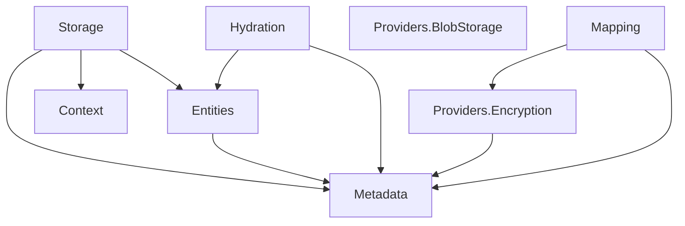

# Design Document: Namespace Reorganization

## Overview

This design document describes the reorganization of the Oproto.FluentDynamoDb library's internal structure from a monolithic `Storage/` folder into logically separated folders and namespaces. The goal is to improve code organization, discoverability, and maintainability before the first public release.

### Current State

All 26 files currently reside in `Oproto.FluentDynamoDb/Storage/` with namespace `Oproto.FluentDynamoDb.Storage`:

```
Storage/
├── DefaultEntityHydratorRegistry.cs
├── DiscriminatorMismatchException.cs
├── DynamoDbIndex.cs
├── DynamoDbMappingException.cs
├── DynamoDbOperationContext.cs
├── DynamoDbOperationContextDiagnostics.cs
├── DynamoDbTableBase.cs
├── EntityMetadata.cs
├── FieldEncryptionContext.cs
├── FieldEncryptionException.cs
├── IAsyncEntityHydrator.cs
├── IBlobStorageProvider.cs
├── IDiscriminatedProjection.cs
├── IDynamoDbEntity.cs
├── IDynamoDbTable.cs
├── IEntityHydratorRegistry.cs
├── IEntityMetadataProvider.cs
├── IFieldEncryptor.cs
├── IJsonBlobSerializer.cs
├── IndexMetadata.cs
├── IProjectionModel.cs
├── MappingErrorHandler.cs
├── OperationContextData.cs
├── ProjectionValidationException.cs
├── PropertyMetadata.cs
└── RelationshipMetadata.cs
```

### Target State

```
Oproto.FluentDynamoDb/
├── Storage/                          # Physical storage only
│   ├── DynamoDbTableBase.cs
│   ├── DynamoDbIndex.cs
│   └── IDynamoDbTable.cs
├── Entities/                         # Entity contracts
│   ├── IDynamoDbEntity.cs
│   ├── IProjectionModel.cs
│   └── IDiscriminatedProjection.cs
├── Metadata/                         # All metadata
│   ├── EntityMetadata.cs
│   ├── PropertyMetadata.cs
│   ├── RelationshipMetadata.cs
│   ├── IndexMetadata.cs
│   └── IEntityMetadataProvider.cs
├── Hydration/                        # Entity materialization
│   ├── IAsyncEntityHydrator.cs
│   ├── IEntityHydratorRegistry.cs
│   └── DefaultEntityHydratorRegistry.cs
├── Providers/
│   ├── Encryption/                   # Field encryption
│   │   ├── IFieldEncryptor.cs
│   │   └── FieldEncryptionContext.cs
│   └── BlobStorage/                  # Blob storage
│       ├── IBlobStorageProvider.cs
│       └── IJsonBlobSerializer.cs
├── Mapping/                          # Mapping + exceptions
│   ├── MappingErrorHandler.cs
│   ├── DynamoDbMappingException.cs
│   ├── DiscriminatorMismatchException.cs
│   ├── ProjectionValidationException.cs
│   └── FieldEncryptionException.cs
└── Context/                          # Operation context
    ├── DynamoDbOperationContext.cs
    ├── DynamoDbOperationContextDiagnostics.cs
    └── OperationContextData.cs
```

## Architecture

### Namespace Mapping

| Old Namespace | New Namespace | Files |
|---------------|---------------|-------|
| `Oproto.FluentDynamoDb.Storage` | `Oproto.FluentDynamoDb.Storage` | DynamoDbTableBase.cs, DynamoDbIndex.cs, IDynamoDbTable.cs |
| `Oproto.FluentDynamoDb.Storage` | `Oproto.FluentDynamoDb.Entities` | IDynamoDbEntity.cs, IProjectionModel.cs, IDiscriminatedProjection.cs |
| `Oproto.FluentDynamoDb.Storage` | `Oproto.FluentDynamoDb.Metadata` | EntityMetadata.cs, PropertyMetadata.cs, RelationshipMetadata.cs, IndexMetadata.cs, IEntityMetadataProvider.cs |
| `Oproto.FluentDynamoDb.Storage` | `Oproto.FluentDynamoDb.Hydration` | IAsyncEntityHydrator.cs, IEntityHydratorRegistry.cs, DefaultEntityHydratorRegistry.cs |
| `Oproto.FluentDynamoDb.Storage` | `Oproto.FluentDynamoDb.Providers.Encryption` | IFieldEncryptor.cs, FieldEncryptionContext.cs |
| `Oproto.FluentDynamoDb.Storage` | `Oproto.FluentDynamoDb.Providers.BlobStorage` | IBlobStorageProvider.cs, IJsonBlobSerializer.cs |
| `Oproto.FluentDynamoDb.Storage` | `Oproto.FluentDynamoDb.Mapping` | MappingErrorHandler.cs, DynamoDbMappingException.cs, DiscriminatorMismatchException.cs, ProjectionValidationException.cs, FieldEncryptionException.cs |
| `Oproto.FluentDynamoDb.Storage` | `Oproto.FluentDynamoDb.Context` | DynamoDbOperationContext.cs, DynamoDbOperationContextDiagnostics.cs, OperationContextData.cs |

### Dependency Flow



## Components and Interfaces

### Storage Namespace (`Oproto.FluentDynamoDb.Storage`)

Contains physical DynamoDB table and index abstractions:

- `DynamoDbTableBase` - Base class for generated table classes
- `DynamoDbIndex` - Represents a DynamoDB index (GSI/LSI)
- `IDynamoDbTable` - Interface for table operations

### Entities Namespace (`Oproto.FluentDynamoDb.Entities`)

Contains entity contract interfaces:

- `IDynamoDbEntity` - Core interface for all DynamoDB entities
- `IProjectionModel` - Interface for projection models
- `IDiscriminatedProjection` - Interface for discriminated projections

### Metadata Namespace (`Oproto.FluentDynamoDb.Metadata`)

Contains metadata classes describing entity structure:

- `EntityMetadata` - Describes an entity's structure
- `PropertyMetadata` - Describes a property's mapping
- `RelationshipMetadata` - Describes entity relationships
- `IndexMetadata` - Describes index configuration
- `IEntityMetadataProvider` - Interface for providing entity metadata

### Hydration Namespace (`Oproto.FluentDynamoDb.Hydration`)

Contains entity materialization logic:

- `IAsyncEntityHydrator<T>` - Interface for async entity hydration
- `IEntityHydratorRegistry` - Registry for hydrator lookup
- `DefaultEntityHydratorRegistry` - Default implementation

### Providers.Encryption Namespace (`Oproto.FluentDynamoDb.Providers.Encryption`)

Contains field encryption interfaces:

- `IFieldEncryptor` - Interface for field encryption/decryption
- `FieldEncryptionContext` - Context for encryption operations

### Providers.BlobStorage Namespace (`Oproto.FluentDynamoDb.Providers.BlobStorage`)

Contains blob storage interfaces:

- `IBlobStorageProvider` - Interface for blob storage operations
- `IJsonBlobSerializer` - Interface for JSON blob serialization

### Mapping Namespace (`Oproto.FluentDynamoDb.Mapping`)

Contains mapping utilities and exceptions:

- `MappingErrorHandler` - Handles mapping errors
- `DynamoDbMappingException` - General mapping exception
- `DiscriminatorMismatchException` - Discriminator mismatch error
- `ProjectionValidationException` - Projection validation error
- `FieldEncryptionException` - Field encryption error

### Context Namespace (`Oproto.FluentDynamoDb.Context`)

Contains operation context classes:

- `DynamoDbOperationContext` - AsyncLocal context for operations
- `DynamoDbOperationContextDiagnostics` - Diagnostics for context
- `OperationContextData` - Data stored in context

## Data Models

No data model changes are required. This is a structural reorganization only.

## Correctness Properties

*A property is a characteristic or behavior that should hold true across all valid executions of a system-essentially, a formal statement about what the system should do. Properties serve as the bridge between human-readable specifications and machine-verifiable correctness guarantees.*

Since this is a refactoring task focused on file moves and namespace changes, the correctness properties are primarily about maintaining existing functionality:

### Property 1: Build Success After Reorganization
*For any* valid build configuration, after the namespace reorganization is complete, the solution SHALL compile with zero errors.
**Validates: Requirements 10.2**

### Property 2: Test Suite Passes After Reorganization
*For any* test in the existing test suite, after the namespace reorganization is complete, the test SHALL pass without modification to test logic (only using directive updates allowed).
**Validates: Requirements 10.3**

### Property 3: Source Generator Emits Valid Code
*For any* entity decorated with `[DynamoDbTable]` or `[DynamoDbEntity]`, the source generator SHALL emit code that compiles successfully with the new namespace structure.
**Validates: Requirements 9.1, 9.2, 9.3, 9.4**

## Error Handling

### Compilation Errors

If namespace references are not updated correctly, the compiler will emit errors like:
- `CS0246: The type or namespace name 'X' could not be found`
- `CS0234: The type or namespace name 'X' does not exist in the namespace 'Y'`

These errors will be resolved by updating using directives in affected files.

### Source Generator Errors

If the source generator emits incorrect namespace references, generated code will fail to compile. The generator files must be updated to emit the new namespace structure.

## Testing Strategy

### Unit Tests

Existing unit tests will be updated with new using directives. No test logic changes are required since this is a structural reorganization.

### Integration Tests

Integration tests will verify that:
1. The solution builds successfully
2. All existing tests pass
3. Generated code compiles correctly

### Verification Approach

1. **Pre-reorganization**: Run `dotnet build` and `dotnet test` to establish baseline
2. **Post-reorganization**: Run `dotnet build` and `dotnet test` to verify no regressions
3. **Manual verification**: Inspect generated code to confirm correct namespace references

## Source Generator Updates

The following generator files require updates to emit new namespace references:

### MapperGenerator.cs

Update using directives emitted for entity implementations:

```csharp
// Before
sb.AppendLine("using Oproto.FluentDynamoDb.Storage;");

// After
sb.AppendLine("using Oproto.FluentDynamoDb.Entities;");
sb.AppendLine("using Oproto.FluentDynamoDb.Metadata;");
sb.AppendLine("using Oproto.FluentDynamoDb.Hydration;");
sb.AppendLine("using Oproto.FluentDynamoDb.Providers.Encryption;");
sb.AppendLine("using Oproto.FluentDynamoDb.Providers.BlobStorage;");
sb.AppendLine("using Oproto.FluentDynamoDb.Mapping;");
sb.AppendLine("using Oproto.FluentDynamoDb.Context;");
```

### TableGenerator.cs

Update using directives emitted for table classes:

```csharp
// Before
sb.AppendLine("using Oproto.FluentDynamoDb.Storage;");

// After
sb.AppendLine("using Oproto.FluentDynamoDb.Storage;");
sb.AppendLine("using Oproto.FluentDynamoDb.Entities;");
sb.AppendLine("using Oproto.FluentDynamoDb.Metadata;");
```

### HydratorGenerator.cs

Update using directives for hydrator implementations:

```csharp
// Before
sb.AppendLine("using Oproto.FluentDynamoDb.Storage;");

// After
sb.AppendLine("using Oproto.FluentDynamoDb.Entities;");
sb.AppendLine("using Oproto.FluentDynamoDb.Hydration;");
sb.AppendLine("using Oproto.FluentDynamoDb.Providers.BlobStorage;");
```

### Other Generators

All generators that emit `using Oproto.FluentDynamoDb.Storage;` must be reviewed and updated to emit the appropriate new namespaces based on what types they reference.

## Implementation Approach

### File Move Strategy

Files will be moved using `mv` command to preserve file contents and git history. This ensures:
1. No accidental content changes during the move
2. Git can track the file rename/move
3. Clear separation between structural changes and code changes

### Two-Phase Approach

**Phase 1: File Moves**
- Create new folder structure
- Use `mv` to move files to new locations
- Do not modify file contents during this phase

**Phase 2: Namespace Updates**
- Update namespace declarations in moved files
- Update using directives in all affected files
- Update source generator to emit new namespaces

### Pre-Release Reorganization

This reorganization is being performed before the first public release. There are no external consumers to migrate, so no migration guide is needed. The namespace structure will be correct from the initial release.
