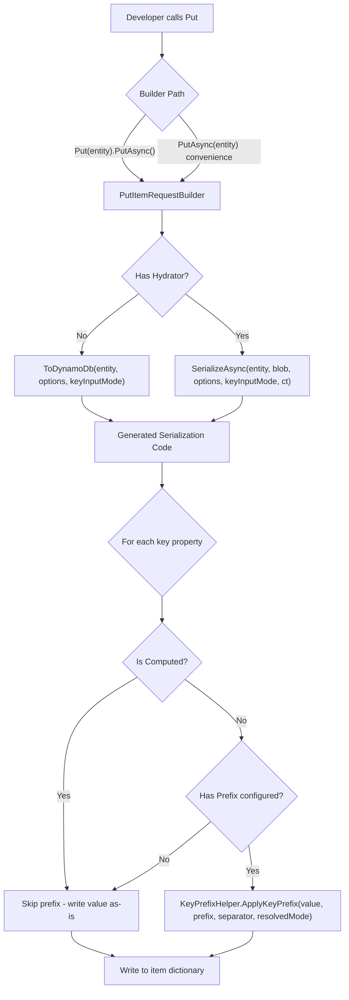

# Design Document: Put Key Prefix Application

## Overview

This feature extends the source-generated `ToDynamoDb()` method and `PutItemRequestBuilder` to automatically apply key prefixes during Put serialization, eliminating the most common source of bugs for new FluentDynamoDb users. Currently, developers must manually call `Entity.Keys.Pk(value)` to construct prefixed key values before Put operations. With this change, the resolved `KeyInputMode` controls whether, and how, prefixes are applied during serialization—making the library "just work" for the common case while preserving escape hatches for advanced scenarios.

The design touches three layers:
1. **Source Generator** — emits `ToDynamoDb` code that invokes `KeyPrefixHelper.ApplyKeyPrefix` for eligible key properties
2. **PutItemRequestBuilder** — exposes `WithKeyMode(KeyInputMode)` and propagates the resolved mode to serialization
3. **IAsyncEntityHydrator** — updated `SerializeAsync` signature to accept `KeyInputMode`

## Architecture



### Key Design Decisions

1. **Prefix application lives in generated code, not the builder** — The source generator has compile-time knowledge of which properties are keys, which have prefixes, and which are computed. This avoids runtime reflection and maintains AOT compatibility.

2. **New `ToDynamoDb` overload rather than modifying existing** — A new overload `ToDynamoDb(entity, options, keyInputMode)` preserves backward compatibility. The existing `ToDynamoDb(entity, options)` resolves `KeyInputMode.Default` to `Auto` internally.

3. **Builder stores KeyInputMode, passes it at serialization time** — `PutItemRequestBuilder` holds the per-operation mode and passes it through to `ToDynamoDb` or `SerializeAsync`. This keeps the builder's role simple: configuration holder and executor.

4. **`KeyInputMode.Default` resolves before reaching `KeyPrefixHelper`** — Resolution happens via `KeyInputModeResolver.Resolve(specified, options)` so the helper never sees `Default`.

## Components and Interfaces

### Modified Components

#### 1. Source Generator (`MapperGenerator.cs`)

**Change**: The `GenerateToDynamoDbMethod` and `GenerateToDynamoDbAsyncMethod` methods emit an additional overload accepting `KeyInputMode`. For key properties that have a configured prefix and are NOT computed, the generated code wraps the value assignment in a `KeyPrefixHelper.ApplyKeyPrefix` call.

**New generated overload signature**:
```csharp
public static Dictionary<string, AttributeValue> ToDynamoDb<TSelf>(
    TSelf entity, 
    FluentDynamoDbOptions? options, 
    KeyInputMode keyInputMode) where TSelf : IDynamoDbEntity
```

**Generated code for a prefixed key property** (non-computed):
```csharp
// Resolve mode before applying
var resolvedMode = Oproto.FluentDynamoDb.Utility.KeyInputModeResolver.Resolve(keyInputMode, options ?? new FluentDynamoDbOptions());

// Apply prefix to partition key
ArgumentNullException.ThrowIfNull(typedEntity.Pk, nameof(typedEntity.Pk));
item["pk"] = new AttributeValue 
{ 
    S = Oproto.FluentDynamoDb.Utility.KeyPrefixHelper.ApplyKeyPrefix(
        typedEntity.Pk, "ORDER", "#", resolvedMode) 
};
```

**Generated code for a computed key property**:
```csharp
// Computed key — no prefix application
item["pk"] = new AttributeValue { S = computedPkValue };
```

**Existing overload behavior change**:
```csharp
// Existing overload now delegates to the new one with Default mode
public static Dictionary<string, AttributeValue> ToDynamoDb<TSelf>(TSelf entity, FluentDynamoDbOptions? options = null) 
    where TSelf : IDynamoDbEntity
{
    return ToDynamoDb(entity, options, KeyInputMode.Default);
}
```

#### 2. `PutItemRequestBuilder<TEntity>` (`Requests/PutItemRequestBuilder.cs`)

**New field**:
```csharp
private KeyInputMode _keyInputMode = KeyInputMode.Default;
```

**New method**:
```csharp
/// <summary>
/// Overrides the KeyInputMode used for prefix application during Put serialization.
/// When not called, KeyInputMode.Default is used (resolved from FluentDynamoDbOptions.DefaultKeyInputMode).
/// </summary>
public PutItemRequestBuilder<TEntity> WithKeyMode(KeyInputMode mode)
{
    _keyInputMode = mode;
    return this;
}
```

**Modified `WithItem(TEntity entity)` path**: When serialization occurs (either immediately for non-hydrator entities, or deferred), the resolved `KeyInputMode` is passed to `ToDynamoDb` or `SerializeAsync`.

**Modified `ToDynamoDbResponseAsync`**: When resolving deferred entities via hydrator, passes the resolved `KeyInputMode` to `SerializeAsync`.

#### 3. `IAsyncEntityHydrator<TEntity>` (`Hydration/IAsyncEntityHydrator.cs`)

**New overload** (preserving existing for backward compatibility):
```csharp
Task<Dictionary<string, AttributeValue>> SerializeAsync(
    TEntity entity,
    IBlobStorageProvider? blobProvider,
    FluentDynamoDbOptions? options,
    KeyInputMode keyInputMode,
    CancellationToken cancellationToken = default);
```

The existing `SerializeAsync` (without `keyInputMode`) delegates to the new overload with `KeyInputMode.Default`.

#### 4. `IDynamoDbEntity` Interface

No interface change required. The new `ToDynamoDb` overload is a static method on the generated class (not an interface method), co-existing with the existing interface-required overload. The existing interface method remains unchanged for backward compatibility.

#### 5. Source Generator - Table Generator (`TableGenerator.cs`)

**Change**: Generated convenience methods (`PutAsync(entity)`, `PutAsync(entity, KeyCondition)`) do NOT set any `KeyInputMode` on the builder, allowing it to resolve `Default` at execution time from `FluentDynamoDbOptions`.

#### 6. Source Generator - Hydrator Generator (`HydratorGenerator.cs`)

**Change**: Generated `IAsyncEntityHydrator<TEntity>` implementations emit code for the new `SerializeAsync` overload that passes `keyInputMode` through to the `ToDynamoDb` overload with the mode parameter.

### GSI/LSI Key Properties

The source generator applies the same logic to GSI and LSI key properties that carry a `[PartitionKey]` or `[SortKey]` attribute with a configured prefix. A `[GsiPartitionKey]` or `[GsiSortKey]` attribute alone (without a co-located `[PartitionKey]`/`[SortKey]` attribute with a `Prefix`) does NOT trigger prefix application.

## Data Models

### Existing Models (unchanged)

| Type | Location | Purpose |
|------|----------|---------|
| `KeyInputMode` enum | `Oproto.FluentDynamoDb/KeyInputMode.cs` | Enum: Default, Auto, Value, Raw |
| `KeyPrefixHelper` | `Utility/KeyPrefixHelper.cs` | Static `ApplyKeyPrefix` method |
| `KeyInputModeResolver` | `Utility/KeyInputModeResolver.cs` | Resolves `Default` → configured mode |
| `FluentDynamoDbOptions` | Root | Holds `DefaultKeyInputMode` (default: Auto) |
| `PropertyModel` | Source generator | Has `IsComputed`, `KeyPrefix`, `KeySeparator` |

### New/Modified Fields

| Component | Field | Type | Purpose |
|-----------|-------|------|---------|
| `PutItemRequestBuilder<T>` | `_keyInputMode` | `KeyInputMode` | Per-operation mode override (default: `Default`) |

### Resolution Flow

```
Caller sets mode → Builder stores → At serialization:
  1. KeyInputModeResolver.Resolve(_keyInputMode, _options)
  2. If result == Raw → pass through
  3. If result == Auto → StartsWith check
  4. If result == Value → always prepend
```


## Correctness Properties

*A property is a characteristic or behavior that should hold true across all valid executions of a system—essentially, a formal statement about what the system should do. Properties serve as the bridge between human-readable specifications and machine-verifiable correctness guarantees.*

### Property 1: ApplyKeyPrefix mode correctness

*For any* non-null key value, any configured prefix and separator, and any resolved `KeyInputMode` (Auto, Value, or Raw), the value written to the DynamoDB item dictionary for a non-computed key property with that prefix configuration SHALL equal `KeyPrefixHelper.ApplyKeyPrefix(value, prefix, separator, resolvedMode)`.

**Validates: Requirements 1.1, 1.2, 1.3, 1.4, 1.5, 2.1, 2.2, 2.3, 2.4, 2.5, 4.2, 4.5, 4.6, 10.1, 10.2, 10.3**

### Property 2: No-prefix pass-through

*For any* key value and any resolved `KeyInputMode`, when a key property has no prefix configured (null or empty prefix on the `[PartitionKey]` or `[SortKey]` attribute), the serialized value SHALL equal the original input value unchanged.

**Validates: Requirements 1.6, 2.6, 10.4**

### Property 3: Computed key exclusion

*For any* key property decorated with `[Computed]`, regardless of whether a prefix is also configured and regardless of the resolved `KeyInputMode`, the serialized value SHALL equal the computed value produced by the composition logic without any prefix transformation applied.

**Validates: Requirements 3.1, 3.2, 3.3, 4.7, 10.5**

### Property 4: Ordinal case-sensitivity in Auto mode

*For any* key value that starts with a case-variant (not exact case) of the configured prefix followed by the separator, when the resolved mode is `Auto`, the result SHALL prepend the correctly-cased prefix and separator to the original value (treating it as not already prefixed).

**Validates: Requirements 6.1, 6.3**

### Property 5: StartsWith positional check in Auto mode

*For any* key value that contains the prefix+separator substring at a position other than index 0, when the resolved mode is `Auto`, the result SHALL prepend the prefix and separator to the original value.

**Validates: Requirements 6.4**

### Property 6: Full prefix+separator boundary in Auto mode

*For any* key value that starts with a string that is a proper superset of the prefix (e.g., prefix characters followed by additional characters before the separator), when the resolved mode is `Auto`, the result SHALL prepend the prefix and separator to the original value.

**Validates: Requirements 6.5**

## Error Handling

### Null Key Values

- **Partition key null at serialization**: The generated `ToDynamoDb` code calls `ArgumentNullException.ThrowIfNull(typedEntity.Pk)` before attempting prefix application. This fails fast with a clear exception message.
- **Sort key null at serialization**: Same pattern — `ArgumentNullException.ThrowIfNull(typedEntity.Sk)` when the sort key has a configured prefix.
- The `KeyPrefixHelper.ApplyKeyPrefix` method also validates null and throws `ArgumentNullException`, providing defense-in-depth.

### Invalid KeyInputMode Enum Values

- `KeyInputModeResolver.Resolve` throws `ArgumentOutOfRangeException` for undefined enum values (anything outside 0-3).
- The resolver never returns `Default` — it always resolves to `Auto`, `Value`, or `Raw`.

### Hydrator Not Found

- If `PutItemRequestBuilder` has a deferred entity but the hydrator registry returns null for the entity type, the existing `ToDynamoDbResponseAsync` behavior applies (throws `InvalidOperationException` when trying to build the request without resolved item data).

### Backward Compatibility Failure Modes

- Existing code using `Entity.Keys.Pk(value)` continues to work because Auto mode's `StartsWith` check detects the prefix is already present and passes through unchanged.
- Code that upgrades and was previously relying on raw values in key properties will now get prefix applied. Users can opt out globally via `options.UseKeyInputMode(KeyInputMode.Raw)` or per-call via `.WithKeyMode(KeyInputMode.Raw)`.

## Testing Strategy

### Property-Based Testing

Property-based tests validate the correctness properties above using [FsCheck](https://fscheck.github.io/FsCheck/) (the standard .NET PBT library compatible with xUnit).

**Configuration**:
- Minimum 100 iterations per property test
- Each test tagged with: `Feature: put-key-prefix-application, Property {N}: {property text}`
- Custom generators for:
  - Valid key values (non-null strings, including empty string)
  - Prefix configurations (non-null, non-empty strings for prefix, single-char separators)
  - `KeyInputMode` enum values (Auto, Value, Raw — excludes Default since that's resolved before reaching the helper)

**Library**: FsCheck 2.x with FsCheck.Xunit integration

### Unit Tests

Unit tests cover specific examples, edge cases, and integration points:

| Area | Test Focus |
|------|-----------|
| `KeyPrefixHelper.ApplyKeyPrefix` | Null value throws, empty string handling, specific prefix/separator combos |
| `PutItemRequestBuilder.WithKeyMode` | Returns same builder instance, mode is stored and propagated |
| `KeyInputModeResolver.Resolve` | Default → configured default, explicit modes pass through, invalid throws |
| Generated `ToDynamoDb` overloads | Both overloads produce consistent results, Default resolves to Auto |
| Computed key exclusion | Specific entity with computed PK + prefixed SK, and vice versa |
| GSI/LSI prefix application | Entity with GSI key carrying primary key prefix attribute |

### Integration Tests

Integration tests verify end-to-end behavior with the source generator and mock DynamoDB client:

| Scenario | Verification |
|----------|-------------|
| `Put(entity).PutAsync()` with Auto mode default | Mock client receives correctly prefixed key values |
| `Put(entity).WithKeyMode(Raw).PutAsync()` | Mock client receives raw unprefixed values |
| `Put(entity).WithKeyMode(Value).PutAsync()` | Mock client receives always-prefixed values |
| `PutAsync(entity)` convenience method | Delegates correctly, uses options default |
| Entity with encrypted fields + prefix | Hydrator path receives and applies KeyInputMode |
| Entity with computed key + non-computed key | Only non-computed key gets prefix |
| Backward compat: entity created with `Keys.Pk(value)` | Auto mode passes through (no double-prefix) |

### Compilation/API Surface Tests

The `Oproto.FluentDynamoDb.ApiConsistencyTests` project verifies:
- Existing `Put` API patterns still compile (no signature breakage)
- New `WithKeyMode` method is available and chainable
- Both `ToDynamoDb` overloads are accessible

### Documentation Verification

Manual verification that:
- `docs/` folder contains Put prefix behavior explanation with examples for each mode
- `docs/DOCUMENTATION_CHANGELOG.md` has appropriate entry
- `CHANGELOG.md` has entry under `[Unreleased]` → `### Added`
