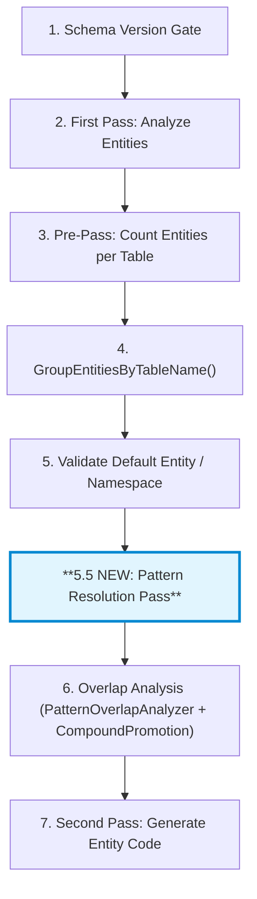
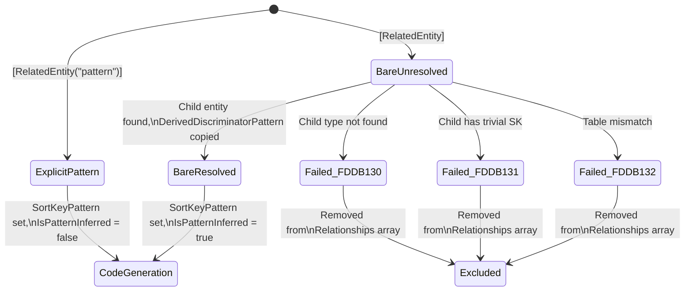

# Design Document: Bare `[RelatedEntity]` Inference

## Overview

This feature adds a parameterless overload to `[RelatedEntity]` so the source generator can automatically infer the sort key matching pattern from the child entity's `DerivedDiscriminatorPattern`. Today, developers must manually write and maintain a pattern string like `[RelatedEntity("ORDER#*#LINE#*")]` that duplicates the child entity's key structure. The bare form eliminates this redundancy by treating the child entity's key definition as the single source of truth.

The core mechanism works by:
1. Detecting bare `[RelatedEntity]` during entity analysis and extracting the child entity type from the property's generic type argument
2. Running a deferred Pattern Resolution Pass after all entities are analyzed, which looks up the child entity in the same table group and copies its `DerivedDiscriminatorPattern` to the relationship's `SortKeyPattern`
3. Feeding the resolved pattern into the existing MapperGenerator code paths unchanged

**Before (explicit pattern — still supported):**
```csharp
[RelatedEntity("ORDER#*#LINE#*", EntityType = typeof(OrderLine))]
public List<OrderLine>? Lines { get; set; }
```

**After (bare inference — recommended):**
```csharp
[RelatedEntity]
public List<OrderLine>? Lines { get; set; }
```

## Architecture

### Pipeline Integration

The feature integrates into the existing source generator pipeline by adding a single new phase. The key constraint is that `DerivedDiscriminatorPattern` is computed per-entity during `DeriveDiscriminatorPatterns()` (step in EntityAnalyzer), but `ExtractRelationships()` runs earlier in the same entity's analysis — and the child entity may not have been analyzed yet. A deferred resolution pass solves both ordering issues.



### Design Decisions

**D1: Deferred resolution vs. multi-pass entity analysis.** Rather than re-analyzing entities or introducing inter-entity dependencies during individual analysis, the Pattern Resolution Pass runs once after all entities are collected. This follows the existing pattern of `PatternOverlapAnalyzer.Analyze()` and `CompoundPromotionPass.Analyze()`, which also operate on complete table groups. The alternative — resolving during `ExtractRelationships()` — would require the source generator to guarantee entity analysis ordering and would break the current incremental generator caching model.

**D2: `SortKeyPattern` becomes `string?` on both the attribute and `RelationshipModel`.** The attribute's `SortKeyPattern` property changes from `string` to `string?` to signal "infer from child." On `RelationshipModel`, the nullable type distinguishes three states: `null` (bare, not yet resolved or resolution failed), empty string (explicit empty — an edge case), and non-empty string (resolved or explicit pattern). Downstream code in `MapperGenerator` already guards with `!string.IsNullOrEmpty(p)` when building exclusion patterns, so null falls through safely.

**D3: Entity type inference from property type.** When `EntityType` is not explicitly provided on a bare `[RelatedEntity]`, the analyzer infers the child entity type from the property declaration: `List<T>` → `T`, `T?` → `T`, `T` → `T`. This reuses the existing `IsCollectionType()` check and Roslyn's `ITypeSymbol` API. The explicit `EntityType` named argument always takes precedence for override scenarios (e.g., `List<IDynamoDbEntity>`).

**D4: Static method for the resolution pass.** `PatternResolutionPass.Resolve()` is a static method on a new class, following the established pattern of `PatternOverlapAnalyzer.Analyze()`. It takes the `entitiesByTable` dictionary and returns a list of diagnostics, modifying `RelationshipModel` instances in place.

**D5: Re-run validation after resolution.** After patterns are resolved, `ValidateRelatedEntityConfiguration()` must run again on affected entities so that ambiguous pattern detection and conflicting pattern checks apply to the inferred patterns. This is a targeted re-validation, not a full re-analysis.

## Components and Interfaces

### Modified Components

#### 1. `RelatedEntityAttribute` (`Oproto.FluentDynamoDb/Attributes/RelatedEntityAttribute.cs`)

**Changes:**
- Add a parameterless constructor that leaves `SortKeyPattern` as `null`
- Change `SortKeyPattern` property type from `string` to `string?`
- Add `ArgumentNullException` guard to the existing `string` constructor

```csharp
[AttributeUsage(AttributeTargets.Property)]
public class RelatedEntityAttribute : Attribute
{
    public string? SortKeyPattern { get; }
    public Type? EntityType { get; set; }

    // NEW: Bare form — pattern inferred from child entity metadata
    public RelatedEntityAttribute()
    {
        SortKeyPattern = null;
    }

    // EXISTING: Explicit pattern form
    public RelatedEntityAttribute(string sortKeyPattern)
    {
        ArgumentNullException.ThrowIfNull(sortKeyPattern);
        SortKeyPattern = sortKeyPattern;
    }
}
```

#### 2. `RelationshipModel` (`Oproto.FluentDynamoDb.SourceGenerator/Models/RelationshipModel.cs`)

**Changes:**
- `SortKeyPattern` type: `string` → `string?`
- Add `IsPatternInferred` (bool, default `false`)
- Add `ResolvedEntityType` (string?, default `null`)
- Update `IsWildcardPattern` to handle null safely

```csharp
internal class RelationshipModel
{
    public string PropertyName { get; set; } = string.Empty;
    public string? SortKeyPattern { get; set; }               // CHANGED: nullable
    public string? EntityType { get; set; }
    public bool IsCollection { get; set; }
    public string PropertyType { get; set; } = string.Empty;
    public bool IsPatternInferred { get; set; }               // NEW
    public string? ResolvedEntityType { get; set; }           // NEW
    public bool IsWildcardPattern => SortKeyPattern?.Contains('*') ?? false;  // CHANGED: null-safe
    public bool HasSpecificEntityType => !string.IsNullOrWhiteSpace(EntityType);
    public bool ChildEntityHasRelationships { get; set; }
    public RelationshipModel[] ChildEntityRelationships { get; set; } = Array.Empty<RelationshipModel>();
}
```

#### 3. `EntityAnalyzer.ExtractRelationships()` (`Oproto.FluentDynamoDb.SourceGenerator/Analysis/EntityAnalyzer.cs`)

**Changes to `ExtractRelationships()`:**

The method currently extracts the sort key pattern from the constructor argument. For bare `[RelatedEntity]`:
- The constructor argument will be absent (no `ArgumentList` arguments, or the argument list is empty of positional arguments)
- `SortKeyPattern` stays `null` on the `RelationshipModel` (no assignment)
- Entity type inference runs: if no explicit `EntityType` named argument, extract from the property type using Roslyn's `ITypeSymbol` API
- Set `ResolvedEntityType` on the `RelationshipModel`

**Entity type inference logic** (new helper method `InferEntityTypeFromProperty`):

```
Input: IPropertySymbol propertySymbol, bool hasExplicitEntityType
Output: string? resolvedEntityType

1. If hasExplicitEntityType → return null (explicit takes precedence, handled separately)
2. Get ITypeSymbol from propertySymbol.Type
3. If type implements IEnumerable<T> (via IsCollectionType check):
   a. If type is INamedTypeSymbol with TypeArguments.Length > 0 → return TypeArguments[0].ToDisplayString()
   b. If type is INamedTypeSymbol and any AllInterfaces has TypeArguments → extract T from the IEnumerable<T> interface → return T.ToDisplayString()
   c. If non-generic collection (ArrayList, raw IEnumerable) → report diagnostic error, return null
4. If NullableAnnotation == Annotated (T?) → unwrap: return type.WithNullableAnnotation(None).ToDisplayString()
5. Return type.ToDisplayString() (non-nullable, non-collection direct type)
```

**Diagnostic for non-generic collection:** When a bare `[RelatedEntity]` is on a property typed as `ArrayList`, `IEnumerable` (non-generic), or similar, emit an error diagnostic. This is not one of the FDDB130-132 codes; it's a pre-resolution validation error on the property itself. We reuse or add a suitable diagnostic indicating the element type cannot be inferred.

#### 4. `PatternResolutionPass` (NEW: `Oproto.FluentDynamoDb.SourceGenerator/Analysis/PatternResolutionPass.cs`)

A new static class following the `PatternOverlapAnalyzer` pattern:

```csharp
internal static class PatternResolutionPass
{
    /// <summary>
    /// Resolves bare [RelatedEntity] patterns by looking up child entity metadata
    /// within the same table group. Modifies RelationshipModel.SortKeyPattern in place
    /// and returns diagnostics for unresolvable patterns.
    /// </summary>
    public static List<Diagnostic> Resolve(
        Dictionary<string, List<EntityModel>> entitiesByTable)
    {
        var diagnostics = new List<Diagnostic>();

        foreach (var (tableName, tableEntities) in entitiesByTable)
        {
            foreach (var entity in tableEntities)
            {
                foreach (var relationship in entity.Relationships)
                {
                    // Skip relationships with explicit patterns (already resolved)
                    if (!string.IsNullOrEmpty(relationship.SortKeyPattern))
                        continue;

                    ResolveRelationship(entity, relationship, tableEntities, entitiesByTable, diagnostics);
                }
            }
        }

        return diagnostics;
    }
}
```

**`ResolveRelationship()` logic:**

```
Input: EntityModel parent, RelationshipModel relationship, 
       List<EntityModel> sameTableEntities, 
       Dictionary<string, List<EntityModel>> allEntitiesByTable,
       List<Diagnostic> diagnostics

1. Determine child entity type name:
   a. If relationship.EntityType is set → use it
   b. Else if relationship.ResolvedEntityType is set → use it
   c. Else → extract from relationship.PropertyType string
      (parse "List<OrderLine>" → "OrderLine", "Payment?" → "Payment", etc.)
   d. If no type resolved → emit FDDB130, return

2. Search for child entity:
   a. Look in sameTableEntities for EntityModel where ClassName matches the resolved type name
   b. If not found in same table, search all table groups for diagnostic context
   c. If found in a DIFFERENT table → emit FDDB132 (table mismatch), return
   d. If not found at all → emit FDDB130 (unknown entity), return

3. Read child entity's sort key DerivedDiscriminatorPattern:
   a. Find the sort key property on the child EntityModel (IsSortKey == true)
   b. If sort key has no DerivedDiscriminatorPattern (null — trivial {0} key) → emit FDDB131, return
   c. Set relationship.SortKeyPattern = childEntity.SortKey.DerivedDiscriminatorPattern
   d. Set relationship.IsPatternInferred = true
   e. If relationship.EntityType is null, set relationship.EntityType = childEntity.ClassName
```

#### 5. `DynamoDbSourceGenerator.Execute()` (`Oproto.FluentDynamoDb.SourceGenerator/DynamoDbSourceGenerator.cs`)

**Insert new step between table validation and overlap analysis:**

```csharp
// Step 5: Validate default entity and namespace
foreach (var tableGroup in entitiesByTable)
{
    ValidateDefaultEntity(tableGroup.Value, context);
    ValidateTableNamespaceConsistency(tableGroup.Value, context);
}

// NEW Step 5.5: Pattern Resolution Pass — resolve bare [RelatedEntity] patterns
var patternResolutionDiagnostics = PatternResolutionPass.Resolve(entitiesByTable);
foreach (var diagnostic in patternResolutionDiagnostics)
{
    context.ReportDiagnostic(diagnostic);
}

// NEW Step 5.6: Exclude failed relationships and re-validate
ExcludeFailedRelationships(entitiesByTable, patternResolutionDiagnostics);
RevalidateResolvedRelationships(entitiesByTable, context);

// Step 6: Overlap analysis pass (unchanged)
```

**`ExcludeFailedRelationships()`:** Removes relationships from `EntityModel.Relationships` arrays where the `SortKeyPattern` is still null after resolution. This prevents MapperGenerator from attempting to generate code for unresolvable relationships (Requirement 5.4).

**`RevalidateResolvedRelationships()`:** For each entity that had bare `[RelatedEntity]` patterns resolved, re-runs `ValidateRelatedEntityConfiguration()` to catch ambiguous or conflicting patterns introduced by the inferred values (Requirement 8.1).

#### 6. `DiagnosticDescriptors` (`Oproto.FluentDynamoDb.SourceGenerator/Diagnostics/DiagnosticDescriptors.cs`)

Three new diagnostic descriptors:

| Code | Title | Severity | Message Template |
|------|-------|----------|-----------------|
| FDDB130 | Bare RelatedEntity unresolved entity type | Error | `"[RelatedEntity] on property '{0}' in entity '{1}' references type '{2}' which is not a known [DynamoDbTable] entity. Specify EntityType explicitly or provide an explicit pattern string."` |
| FDDB131 | Bare RelatedEntity trivial sort key pattern | Error | `"[RelatedEntity] on property '{0}' in entity '{1}' cannot infer a matching pattern because child entity '{2}' has a bare sort key with no distinguishing structure (NormalizedKeyFormat is '{{0}}'). Provide an explicit pattern string."` |
| FDDB132 | Bare RelatedEntity table mismatch | Error | `"[RelatedEntity] on property '{0}' in entity '{1}' (table '{2}') references child entity '{3}' which is on table '{4}'. Related entities must share the same DynamoDB table."` |

Each follows the existing descriptor pattern with `helpLinkUri: string.Format(DiagnosticHelpLinks.BaseUrlFormat, "FDDB130")` etc.

#### 7. `MapperGenerator` (`Oproto.FluentDynamoDb.SourceGenerator/Generators/MapperGenerator.cs`)

**Minimal changes required.** The MapperGenerator already handles patterns via `relationship.SortKeyPattern`. The key change:

- Update all places that access `SortKeyPattern` to handle null safely (most already guard with `!string.IsNullOrEmpty()`)
- In `GenerateRelatedEntityCollectionMappingAsync` and `GenerateRelatedEntitySingleMappingAsync`: if `SortKeyPattern` is null, skip generating the mapping block for that relationship entirely (Requirement 6.2)
- `IsPatternInferred` is never checked by MapperGenerator — resolved patterns produce identical code to explicit ones (Requirement 6.1)

The null-safe access already exists in several places (e.g., `.Where(p => !string.IsNullOrEmpty(p))`), so most code paths naturally handle null `SortKeyPattern` by exclusion. The explicit skip logic is a safety guard for any path that doesn't already filter.

## Data Models

### RelationshipModel State Transitions



### RelationshipModel Property Values by State

| State | SortKeyPattern | IsPatternInferred | ResolvedEntityType | EntityType |
|-------|---------------|-------------------|-------------------|------------|
| Explicit pattern | `"ORDER#*#LINE#*"` | `false` | `null` | From named arg or `null` |
| Bare, unresolved | `null` | `false` | `"OrderLine"` (from property type) | `null` (unless explicit) |
| Bare, resolved | `"ORDER#*#LINE#*"` | `true` | `"OrderLine"` | `"OrderLine"` (set during resolution) |
| Failed (any FDDB13x) | `null` | `false` | `"OrderLine"` | may or may not be set |
| Excluded | *(removed from array)* | — | — | — |

## Correctness Properties

*A property is a characteristic or behavior that should hold true across all valid executions of a system — essentially, a formal statement about what the system should do. Properties serve as the bridge between human-readable specifications and machine-verifiable correctness guarantees.*

### Property 1: Bare inference produces the child entity's DerivedDiscriminatorPattern

*For any* parent entity with a bare `[RelatedEntity]` on a property of type `List<C>` or `C?`, where `C` is a `[DynamoDbTable]` entity on the same table with a non-null `DerivedDiscriminatorPattern`, the resolved `SortKeyPattern` on the `RelationshipModel` SHALL equal `C`'s sort key `DerivedDiscriminatorPattern`.

**Validates: Requirements 3.2, 3.3, 9.6**

### Property 2: Code generation equivalence between bare and explicit patterns

*For any* parent-child entity pair where bare `[RelatedEntity]` resolves to pattern `P`, the generated C# source code for that relationship SHALL be character-for-character identical to the code generated when `[RelatedEntity("P")]` is used explicitly with the same pattern string. The `IsPatternInferred` flag SHALL not influence any code emission path.

**Validates: Requirements 6.1, 6.3**

### Property 3: Entity type extraction from generic collection types

*For any* property declared as a generic type implementing `IEnumerable<T>` (such as `List<T>`, `IList<T>`, `ICollection<T>`, `IEnumerable<T>`, excluding `string`) with a bare `[RelatedEntity]` attribute and no explicit `EntityType` argument, the Entity_Analyzer SHALL extract the type argument `T` and set `ResolvedEntityType` to `T`'s fully qualified display string.

**Validates: Requirements 2.1, 2.2, 2.3**

### Property 4: Explicit patterns are never modified by the resolution pass

*For any* entity with `[RelatedEntity("P")]` using an explicit pattern string `P`, the `RelationshipModel.SortKeyPattern` SHALL remain equal to `P` (or its named-placeholder-normalized form) after the Pattern Resolution Pass, and `IsPatternInferred` SHALL be `false`.

**Validates: Requirements 3.7, 7.1, 7.2, 7.5, 9.7**

### Property 5: Composite entity assembly equivalence

*For any* set of DynamoDB items and any parent-child entity relationship, `ToCompositeEntityAsync` SHALL match the same set of child items and populate the same related entity collections in the same order, regardless of whether the relationship's `SortKeyPattern` was inferred via bare `[RelatedEntity]` or provided via `[RelatedEntity("pattern")]` with the identical pattern string.

**Validates: Requirements 6.4**

## Error Handling

### Compile-Time Diagnostics

| Diagnostic Code | Trigger Condition | Severity | Action Taken |
|-----------------|-------------------|----------|-------------|
| FDDB130 | Bare `[RelatedEntity]` but resolved type is not a `[DynamoDbTable]` entity in any table group | Error | Relationship excluded from code generation |
| FDDB131 | Bare `[RelatedEntity]` but child entity has `NormalizedKeyFormat` of `"{0}"` (bare sort key, no distinguishing structure) | Error | Relationship excluded from code generation |
| FDDB132 | Bare `[RelatedEntity]` but child entity's `TableName` differs from parent's `TableName` | Error | Relationship excluded from code generation |
| DYNDB008 | Resolved pattern is `"*"` or whitespace-only (ambiguous) | Warning | Existing diagnostic, triggered during re-validation |
| DYNDB017 | Resolved pattern conflicts with another relationship's pattern on the same parent | Warning | Existing diagnostic, triggered during re-validation |

### Exclusion After Diagnostic

When any of FDDB130, FDDB131, or FDDB132 is emitted, the affected `RelationshipModel` is removed from the parent entity's `Relationships` array before code generation begins. This ensures:
- No sort key matching code is emitted for the broken relationship
- No `ToCompositeEntityAsync` assembly code references the excluded property
- No `FromDynamoDb` population code is generated
- The remaining valid relationships on the same entity continue to generate correctly

### Runtime Behavior

No new runtime error conditions are introduced. The resolution is entirely compile-time. If a bare `[RelatedEntity]` resolves successfully, the generated code is identical to an equivalent explicit pattern — including existing try/catch error handling around child entity deserialization.

## Testing Strategy

### Dual Testing Approach

This feature is well-suited to property-based testing because:
- The core logic (entity type extraction, pattern resolution, code generation equivalence) operates on a wide space of possible entity configurations
- Universal properties about resolution correctness can be verified across many generated inputs
- Pure function behavior (type extraction, pattern resolution) has clear input/output contracts

### Test Organization

| Test File | Test Level | What It Covers |
|-----------|-----------|---------------|
| `BareRelatedEntityTests.cs` | Unit | `RelationshipModel` state, `IsPatternInferred`, code generation output, null `SortKeyPattern` handling |
| `BareRelatedEntityDiagnosticTests.cs` | Unit | FDDB130, FDDB131, FDDB132 emission with correct codes, severity, and messages |
| `BareRelatedEntityIntegrationTests.cs` | Integration | Full pipeline: generate → compile → load → invoke `ToCompositeEntityAsync` via reflection |
| `BareRelatedEntityPropertyTests.cs` | Property | Properties 1-5: inference correctness, code equivalence, type extraction, explicit pattern preservation |

### Property-Based Testing

**Library:** FsCheck.Xunit (standard for .NET property-based testing with xUnit)

**Minimum iterations:** 100 per property test

Each property test generates random entity configurations (varying key prefixes, computed key formats, collection types, table names) and verifies the universal properties hold.

**Tag format:** `Feature: related-entity-bare-inference, Property {N}: {property_text}`

### Unit Tests

- **Attribute constructor tests:** Parameterless constructor yields null `SortKeyPattern`; string constructor preserves value; null argument throws `ArgumentNullException`
- **RelationshipModel state tests:** Verify `IsPatternInferred` and `ResolvedEntityType` are set correctly for bare vs. explicit patterns
- **Entity type inference tests:** `List<T>` → `T`, `IList<T>` → `T`, `T?` → `T`, `T` → `T`, explicit `EntityType` override
- **Non-generic collection diagnostic test:** `ArrayList` / raw `IEnumerable` with bare attribute triggers diagnostic
- **MapperGenerator null SortKeyPattern test:** Verify no mapping code is generated when `SortKeyPattern` is null
- **Code generation equivalence test:** Compare generated output from bare resolution vs. explicit pattern with same string

### Integration Tests

- **Full pipeline smoke test:** Define parent + child entities with bare `[RelatedEntity]`, run source generator, compile via `DynamicCompilationHelper.CompileAndLoad()`, invoke `ToCompositeEntityAsync` via reflection with mock DynamoDB items, verify child items are correctly populated
- **Backward compatibility test:** Compile existing explicit-pattern entities through the updated pipeline, verify zero errors and unchanged generated code
- **Diagnostic integration tests:** Trigger each FDDB130/131/132 scenario through full source generator pipeline, verify diagnostics are reported

### Test Naming Convention

Following the existing project convention: `{MethodName}{Scenario}` (e.g., `ResolveRelationship_WithBareRelatedEntity_InfersPatterFromChildEntity`, `EmitFddb130_WhenChildTypeNotDynamoDbEntity`).
