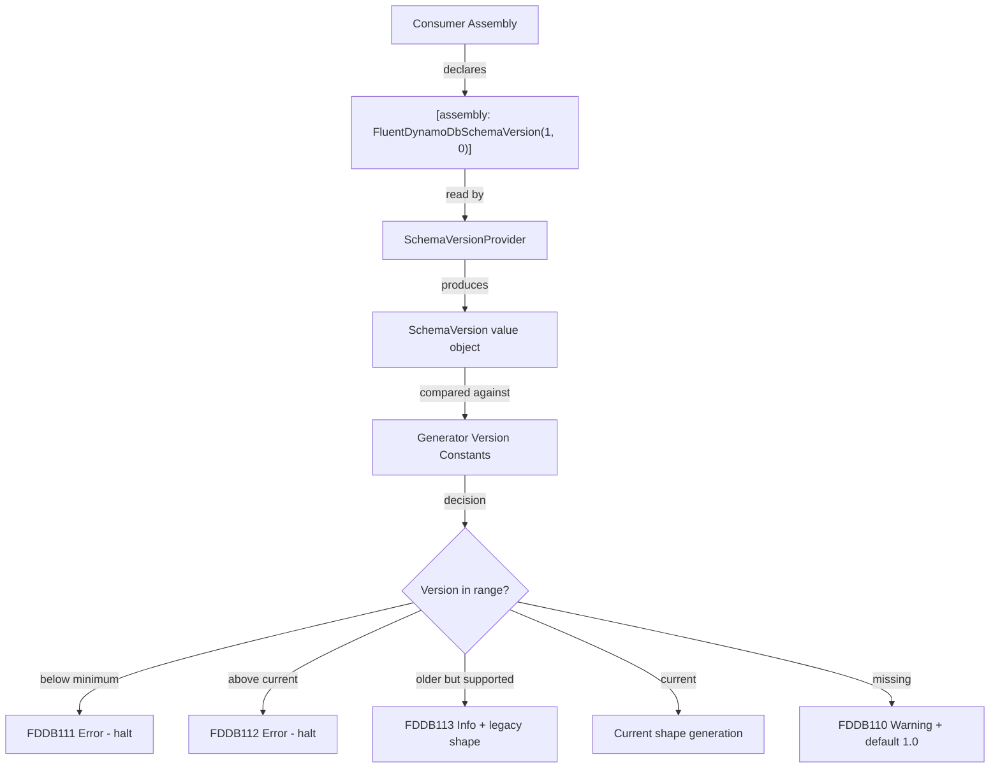
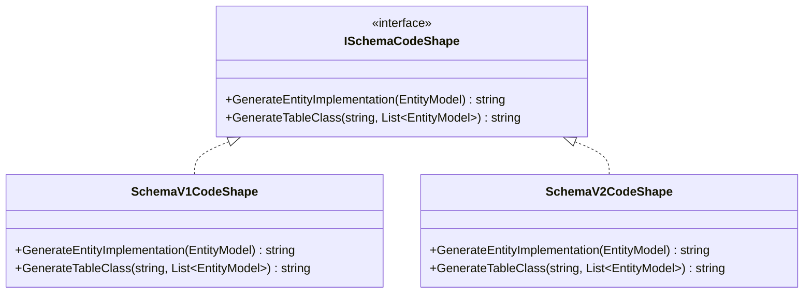

# Design Document: Schema Version Attribute

## Overview

This design introduces a schema versioning mechanism for Oproto.FluentDynamoDb that decouples the generated code shape from the NuGet package version. Consumers declare a target schema version via an assembly-level attribute (`FluentDynamoDbSchemaVersionAttribute`), and the source generator uses that declaration to determine which code shape to emit, which diagnostics to report, and whether to proceed with generation at all.

The schema version acts as a contract: the generator promises to emit code compatible with the declared version, and the consumer promises to use only APIs from that version. This enables the library to evolve its generated output without breaking consumers on upgrade — they migrate at their own pace by bumping their declared version.

## Architecture

The feature spans two layers of the solution:



The key architectural decision is that version detection happens **once per compilation** as an early gate, before any per-entity processing. This keeps the incremental generator efficient and ensures that version-related diagnostics are emitted exactly once.

### Integration with Existing Generator Pipeline

The schema version check inserts between the current syntax filtering and the `Execute` method:

```
Syntax Analysis → Entity Collection → **Schema Version Gate** → Validation → Code Generation
```

The gate either:
1. Passes through with a resolved `SchemaVersion` (happy path)
2. Halts generation entirely and reports an error diagnostic (unsupported version)
3. Passes through with a warning/info diagnostic (missing or older-but-supported)

## Components and Interfaces

### 1. FluentDynamoDbSchemaVersionAttribute

**Location:** `Oproto.FluentDynamoDb/Attributes/FluentDynamoDbSchemaVersionAttribute.cs`

```csharp
using System;

namespace Oproto.FluentDynamoDb.Attributes;

/// <summary>
/// Declares the schema version of generated code that this assembly targets.
/// The source generator uses this to determine which code shape to emit.
/// </summary>
/// <remarks>
/// Schema versions are independent of NuGet package versions. Multiple package
/// versions may support the same schema version. Bump the schema version only
/// when you're ready to adopt new generated code shapes.
/// </remarks>
[AttributeUsage(AttributeTargets.Assembly, AllowMultiple = false)]
public sealed class FluentDynamoDbSchemaVersionAttribute : Attribute
{
    /// <summary>Gets the major schema version component.</summary>
    public int Major { get; }

    /// <summary>Gets the minor schema version component.</summary>
    public int Minor { get; }

    /// <summary>
    /// Initializes a new instance targeting the specified schema version.
    /// </summary>
    /// <param name="major">Major version (must be >= 1).</param>
    /// <param name="minor">Minor version (must be >= 0).</param>
    /// <exception cref="ArgumentOutOfRangeException">
    /// Thrown when <paramref name="major"/> is less than 1 or
    /// <paramref name="minor"/> is less than 0.
    /// </exception>
    public FluentDynamoDbSchemaVersionAttribute(int major, int minor)
    {
        if (major < 1)
            throw new ArgumentOutOfRangeException(nameof(major), major, "Major version must be at least 1.");
        if (minor < 0)
            throw new ArgumentOutOfRangeException(nameof(minor), minor, "Minor version must be at least 0.");

        Major = major;
        Minor = minor;
    }
}
```

**Design Decisions:**
- `sealed` prevents subclassing (consistent with other attributes in the project)
- Constructor validation provides immediate feedback at the consumer level when the attribute is constructed with literal invalid values, complementing the generator-side validation for non-literal/IL-manipulated cases
- Read-only properties (getter-only) ensure immutability

### 2. SchemaVersion Value Object

**Location:** `Oproto.FluentDynamoDb.SourceGenerator/Models/SchemaVersion.cs`

```csharp
namespace Oproto.FluentDynamoDb.SourceGenerator.Models;

/// <summary>
/// Represents a schema version as an immutable major.minor pair.
/// Implements IComparable for version ordering.
/// </summary>
internal readonly struct SchemaVersion : IEquatable<SchemaVersion>, IComparable<SchemaVersion>
{
    public int Major { get; }
    public int Minor { get; }

    public SchemaVersion(int major, int minor)
    {
        Major = major;
        Minor = minor;
    }

    public int CompareTo(SchemaVersion other)
    {
        var majorComparison = Major.CompareTo(other.Major);
        return majorComparison != 0 ? majorComparison : Minor.CompareTo(other.Minor);
    }

    public bool Equals(SchemaVersion other) => Major == other.Major && Minor == other.Minor;
    public override bool Equals(object obj) => obj is SchemaVersion other && Equals(other);
    public override int GetHashCode() => (Major * 397) ^ Minor;
    public override string ToString() => $"{Major}.{Minor}";

    public static bool operator <(SchemaVersion left, SchemaVersion right) => left.CompareTo(right) < 0;
    public static bool operator >(SchemaVersion left, SchemaVersion right) => left.CompareTo(right) > 0;
    public static bool operator <=(SchemaVersion left, SchemaVersion right) => left.CompareTo(right) <= 0;
    public static bool operator >=(SchemaVersion left, SchemaVersion right) => left.CompareTo(right) >= 0;
    public static bool operator ==(SchemaVersion left, SchemaVersion right) => left.Equals(right);
    public static bool operator !=(SchemaVersion left, SchemaVersion right) => !left.Equals(right);
}
```

**Design Decisions:**
- `readonly struct` for zero-allocation value semantics (important in generator hot paths)
- `IComparable<SchemaVersion>` implements major-then-minor comparison as specified
- Operator overloads make comparison code readable at call sites

### 3. SchemaVersionConstants

**Location:** `Oproto.FluentDynamoDb.SourceGenerator/Models/SchemaVersionConstants.cs`

```csharp
namespace Oproto.FluentDynamoDb.SourceGenerator.Models;

/// <summary>
/// Defines the schema versions the current generator supports.
/// Update these when introducing breaking changes to generated code shapes.
/// </summary>
internal static class SchemaVersionConstants
{
    /// <summary>The latest schema version this generator can emit.</summary>
    public static readonly SchemaVersion Current = new(1, 0);

    /// <summary>The oldest schema version this generator still supports.</summary>
    public static readonly SchemaVersion MinimumSupported = new(1, 0);

    /// <summary>The default version assumed when no attribute is declared.</summary>
    public static readonly SchemaVersion Default = new(1, 0);

    /// <summary>URL for the schema version migration guide.</summary>
    public const string MigrationGuideUrl = "https://fluentdynamodb.dev/guides/schema-migration";

    /// <summary>URL for the schema version upgrade guide.</summary>
    public const string UpgradeGuideUrl = "https://fluentdynamodb.dev/guides/schema-upgrade";
}
```

**Design Decisions:**
- Centralized constants make version bumps a single-file change
- At initial release, Current = Minimum = Default = 1.0 (no legacy to support yet)
- When a breaking change is introduced later, bump `Current` to `2.0` and keep `MinimumSupported` at `1.0` to enable dual-targeting. When dropping v1 support, bump `MinimumSupported` to `2.0`.
- URLs are constants so they can be composed into diagnostic messages

### 4. SchemaVersionProvider

**Location:** `Oproto.FluentDynamoDb.SourceGenerator/Analysis/SchemaVersionProvider.cs`

This class is responsible for reading the assembly-level attribute from the Roslyn compilation and returning a validated `SchemaVersion` plus any diagnostics.

```csharp
namespace Oproto.FluentDynamoDb.SourceGenerator.Analysis;

/// <summary>
/// Detects and validates the schema version attribute from the consumer compilation.
/// </summary>
internal static class SchemaVersionProvider
{
    /// <summary>
    /// Result of schema version detection.
    /// </summary>
    internal readonly struct DetectionResult
    {
        public SchemaVersion Version { get; init; }
        public IReadOnlyList<Diagnostic> Diagnostics { get; init; }
        public bool ShouldHaltGeneration { get; init; }
        public Location? AttributeLocation { get; init; }
    }

    /// <summary>
    /// Detects the schema version from assembly-level attributes in the compilation.
    /// </summary>
    public static DetectionResult Detect(Compilation compilation)
    {
        // 1. Find all assembly-level FluentDynamoDbSchemaVersion attributes
        // 2. Handle missing → default + FDDB110 warning
        // 3. Handle multiple → use first + FDDB116 warning
        // 4. Validate major/minor ranges → FDDB114/FDDB115 errors
        // 5. Compare against supported range → FDDB111/FDDB112/FDDB113
        // 6. Return resolved version with diagnostics
    }
}
```

**Key Behavior:**
- Scans `compilation.Assembly.GetAttributes()` for the attribute by fully-qualified name
- Uses the attribute's constructor arguments (accessed via `AttributeData.ConstructorArguments`)
- Returns `ShouldHaltGeneration = true` for any error-severity diagnostic
- The `AttributeLocation` is extracted from `AttributeData.ApplicationSyntaxReference` for diagnostic reporting

### 5. Diagnostic Descriptors (FDDB110–FDDB116)

**Location:** Added to `Oproto.FluentDynamoDb.SourceGenerator/Diagnostics/DiagnosticDescriptors.cs`

| Code | Severity | Trigger | Message Template |
|------|----------|---------|-----------------|
| FDDB110 | Warning | No schema version attribute | "Assembly does not declare [FluentDynamoDbSchemaVersion]. Defaulting to schema version 1.0. Add [assembly: FluentDynamoDbSchemaVersion(1, 0)] to suppress this warning." |
| FDDB111 | Error | Declared version < MinimumSupported | "Declared schema version {0} is no longer supported. Minimum supported version is {1}. See {2} for migration guidance." |
| FDDB112 | Error | Declared version > Current | "Declared schema version {0} is not recognized. Maximum supported version is {1}. Update the Oproto.FluentDynamoDb package to a version that supports schema {0}." |
| FDDB113 | Info | MinimumSupported <= declared < Current | "Schema version {0} is supported but not current. Consider upgrading to {1} for the latest generated code improvements. See {2}." |
| FDDB114 | Error | Major < 1 | "FluentDynamoDbSchemaVersion major version must be at least 1, but was {0}." |
| FDDB115 | Error | Minor < 0 | "FluentDynamoDbSchemaVersion minor version must be at least 0, but was {0}." |
| FDDB116 | Warning | Multiple attributes (IL manipulation) | "Multiple [FluentDynamoDbSchemaVersion] attributes detected. Using first occurrence ({0}). Remove duplicate declarations." |

All diagnostics use category `"FluentDynamoDb"` and include help link URIs formatted via `DiagnosticHelpLinks.BaseUrlFormat`.

### 6. Version-Aware Code Generation Strategy (Dual-Targeting)

The generator needs to produce different code shapes depending on the declared schema version. The design uses a **strategy pattern** keyed by major version:



**However, at initial release, only one shape exists (v1).** The strategy pattern is deferred until the first actual breaking change requires it. Instead, the version is threaded through as a parameter:

```csharp
// In DynamoDbSourceGenerator.Execute():
var versionResult = SchemaVersionProvider.Detect(compilation);
if (versionResult.ShouldHaltGeneration)
{
    foreach (var diagnostic in versionResult.Diagnostics)
        context.ReportDiagnostic(diagnostic);
    return; // No code generation
}

// Report non-fatal diagnostics (FDDB110, FDDB113, FDDB116)
foreach (var diagnostic in versionResult.Diagnostics)
    context.ReportDiagnostic(diagnostic);

// Pass version to generation (for future use)
var schemaVersion = versionResult.Version;
```

**Future Evolution (when v2 is introduced):**
1. Add a `SchemaV1CodeShape` class that captures the current generation logic
2. Add a `SchemaV2CodeShape` class with the new generation logic
3. Select shape based on `schemaVersion.Major`
4. The constraint "at most two concurrent major versions" means at most two shape implementations exist at any time

**Design Decision:** The strategy interface is NOT introduced until it's needed. Premature abstraction would add complexity without value. The version is simply available as data when the first breaking change arrives.

### 7. Generator Integration

The `DynamoDbSourceGenerator.Execute` method is modified to include schema version detection as an early gate. The key change is accessing the `Compilation` object.

**Challenge:** The current `Execute` method signature receives collected entity models and projection contexts, not the raw compilation. The compilation is needed to read assembly attributes.

**Solution:** Add a `CompilationProvider` to the incremental pipeline and combine it with the existing inputs:

```csharp
public void Initialize(IncrementalGeneratorInitializationContext context)
{
    // Existing entity/projection pipelines...

    var compilationProvider = context.CompilationProvider;

    var combined = entityClasses.Collect()
        .Combine(projectionClasses.Collect())
        .Combine(compilationProvider);

    context.RegisterSourceOutput(combined, Execute);
}
```

This gives the `Execute` method access to the compilation for schema version detection without breaking the incremental generation model. The compilation is already available and changes infrequently (only when assembly attributes change), so this has minimal performance impact on incremental builds.

## Data Models

### SchemaVersion (struct)

| Field | Type | Description |
|-------|------|-------------|
| `Major` | `int` | Major version component (>= 1) |
| `Minor` | `int` | Minor version component (>= 0) |

### DetectionResult (struct)

| Field | Type | Description |
|-------|------|-------------|
| `Version` | `SchemaVersion` | Resolved schema version |
| `Diagnostics` | `IReadOnlyList<Diagnostic>` | Diagnostics to report |
| `ShouldHaltGeneration` | `bool` | Whether to stop all code generation |
| `AttributeLocation` | `Location?` | Source location of attribute (for diagnostic reporting) |

### SchemaVersionConstants (static)

| Field | Type | Value (initial) | Description |
|-------|------|-----------------|-------------|
| `Current` | `SchemaVersion` | 1.0 | Latest version the generator emits |
| `MinimumSupported` | `SchemaVersion` | 1.0 | Oldest version still supported |
| `Default` | `SchemaVersion` | 1.0 | Version assumed when attribute is absent |
| `MigrationGuideUrl` | `string` | URL | Link for FDDB111 diagnostic |
| `UpgradeGuideUrl` | `string` | URL | Link for FDDB113 diagnostic |

## Correctness Properties

*A property is a characteristic or behavior that should hold true across all valid executions of a system — essentially, a formal statement about what the system should do. Properties serve as the bridge between human-readable specifications and machine-verifiable correctness guarantees.*

### Property 1: Constructor value round-trip

*For any* valid major version (>= 1) and valid minor version (>= 0), constructing a `FluentDynamoDbSchemaVersionAttribute(major, minor)` shall produce an instance where `Major == major` and `Minor == minor`.

**Validates: Requirements 1.3, 1.4**

### Property 2: Constructor invalid input rejection

*For any* major value less than 1 or minor value less than 0, constructing a `FluentDynamoDbSchemaVersionAttribute(major, minor)` shall throw `ArgumentOutOfRangeException`.

**Validates: Requirements 1.6**

### Property 3: Generator version extraction round-trip

*For any* valid major/minor pair declared in an assembly-level `[FluentDynamoDbSchemaVersion(major, minor)]` attribute within a Roslyn compilation, the `SchemaVersionProvider.Detect` method shall return a `SchemaVersion` with matching `Major` and `Minor` values.

**Validates: Requirements 2.1, 2.2**

### Property 4: Missing attribute diagnostic exclusivity

*For any* compilation containing at least one DynamoDB entity, the FDDB110 diagnostic is emitted if and only if the `FluentDynamoDbSchemaVersion` attribute is absent. When emitted, it is emitted exactly once regardless of entity count.

**Validates: Requirements 3.1, 3.3**

### Property 5: Unsupported old version halts generation

*For any* declared schema version that is strictly less than `MinimumSupported` (using major-then-minor comparison), and for any number of entities N >= 1, the generator shall emit exactly one FDDB111 diagnostic with severity Error and produce zero generated entity sources.

**Validates: Requirements 4.1, 4.4, 4.5**

### Property 6: Unrecognized future version halts generation

*For any* declared schema version that is strictly greater than `Current` (using major-then-minor comparison), and for any number of entities N >= 1, the generator shall emit exactly one FDDB112 diagnostic with severity Error and produce zero generated entity sources.

**Validates: Requirements 5.1, 5.4, 5.5**

### Property 7: Older-but-supported version emits info diagnostic

*For any* declared schema version that is >= `MinimumSupported` and strictly less than `Current`, the generator shall emit exactly one FDDB113 diagnostic with severity Info and proceed with code generation.

**Validates: Requirements 6.1, 6.4**

### Property 8: Version comparison determines correct code shape

*For any* declared schema version with the same major as `Current` but a lower minor, the generator shall produce code using the current major version shape. *For any* declared schema version with an older major that is still >= `MinimumSupported`, the generator shall produce code matching the declared major version's shape.

**Validates: Requirements 7.2, 7.3**

### Property 9: Invalid version validation halts generation

*For any* declared schema version where major < 1 and/or minor < 0, the generator shall emit the appropriate FDDB114 and/or FDDB115 diagnostic(s) and produce zero generated entity sources.

**Validates: Requirements 9.1, 9.2, 9.3, 9.5**

## Error Handling

### Attribute Not Found
- **Behavior:** Default to version 1.0, emit FDDB110 warning, continue generation
- **Rationale:** Existing consumers who upgrade to a package version containing this feature should not break. The warning nudges them to declare a version without blocking compilation.

### Invalid Attribute Values
- **Behavior:** Emit FDDB114/FDDB115 errors, halt generation
- **Rationale:** Invalid values indicate a programmer error. Generating code against an undefined version contract would be misleading.

### Version Out of Range (below minimum)
- **Behavior:** Emit FDDB111 error with migration URL, halt generation
- **Rationale:** The generator cannot produce code for a version it no longer supports. The URL provides actionable guidance.

### Version Out of Range (above current)
- **Behavior:** Emit FDDB112 error with upgrade instructions, halt generation
- **Rationale:** The generator doesn't know what code shape a future version requires. The consumer must update the package.

### Multiple Attributes (IL manipulation)
- **Behavior:** Use first occurrence, emit FDDB116 warning, continue
- **Rationale:** `AllowMultiple = false` prevents this in normal C#. If it happens via IL, graceful degradation is preferable to a crash.

### Compilation Access Failure
- **Behavior:** If compilation is null or attributes cannot be read, default to version 1.0 with FDDB110
- **Rationale:** Defensive handling ensures the generator doesn't crash in unusual IDE scenarios.

## Testing Strategy

### Test Framework
- **xUnit** for test orchestration
- **FsCheck** (already in the project) for property-based tests
- **Roslyn Test Infrastructure** (`Microsoft.CodeAnalysis.CSharp` already referenced) for compiling test assemblies and verifying generator output

### Property-Based Tests (minimum 100 iterations each)

Each correctness property maps to a property-based test using FsCheck:

| Property | Test Class | Generator Strategy |
|----------|-----------|-------------------|
| P1: Constructor round-trip | `SchemaVersionAttributePropertyTests` | Random (major >= 1, minor >= 0) pairs |
| P2: Invalid input rejection | `SchemaVersionAttributePropertyTests` | Random (major < 1) or (minor < 0) pairs |
| P3: Version extraction round-trip | `SchemaVersionDetectionPropertyTests` | Random valid versions embedded in compilations |
| P4: Missing attribute diagnostic | `SchemaVersionDiagnosticPropertyTests` | Random entity counts (1–5) without attribute |
| P5: Unsupported old version | `SchemaVersionDiagnosticPropertyTests` | Random versions below minimum |
| P6: Future version | `SchemaVersionDiagnosticPropertyTests` | Random versions above current |
| P7: Older-but-supported | `SchemaVersionDiagnosticPropertyTests` | Random versions in supported range below current |
| P8: Version-aware shape | `SchemaVersionCodeGenPropertyTests` | Random valid versions, verify shape selection |
| P9: Invalid version halt | `SchemaVersionDiagnosticPropertyTests` | Random invalid (major < 1, minor < 0) versions |

**Tag format:** `Feature: schema-version-attribute, Property {N}: {description}`

### Unit Tests (example-based)

| Test Class | Coverage |
|-----------|----------|
| `FluentDynamoDbSchemaVersionAttributeTests` | Attribute metadata (namespace, sealed, targets, AllowMultiple) |
| `SchemaVersionTests` | Value object comparison, equality, ToString |
| `SchemaVersionProviderTests` | Specific diagnostic message content, diagnostic locations, default behavior |
| `SchemaVersionConstantsTests` | Constants are correctly defined, URL format |

### Integration Tests

| Test | Coverage |
|------|----------|
| End-to-end generation with attribute | Full pipeline produces expected output |
| End-to-end generation without attribute | Warning emitted, code still generated |
| End-to-end with unsupported version | Error emitted, no code generated |

### Test Configuration
- Property tests run minimum 100 iterations via `[Property(MaxTest = 100)]`
- Each property test references its design document property via comment tag
- Generator tests use Roslyn's in-memory compilation to avoid file I/O
