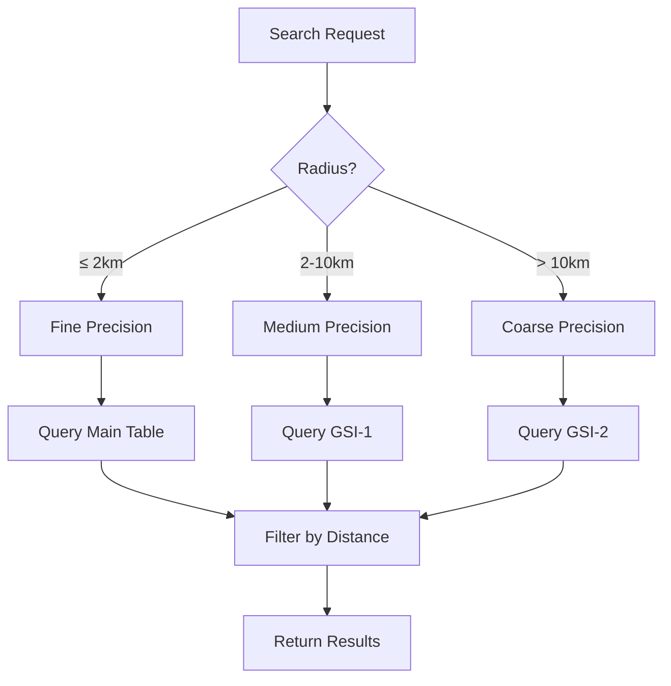

# Design Document: StoreLocator Adaptive Precision

## Overview

This design implements adaptive precision selection for the StoreLocator example application. The current implementation uses fixed high-precision spatial indices that fail for larger search radii due to cell count limits. The solution stores spatial indices at multiple precision levels and selects the appropriate level based on the search radius.

## Architecture

### Multi-Precision Storage Strategy

Each store entity will store spatial indices at three precision levels:

```
┌─────────────────────────────────────────────────────────────────┐
│                        Store Entity                              │
├─────────────────────────────────────────────────────────────────┤
│  Main Table (pk, sk)                                            │
│  ├── Fine precision index (main table sort key)                 │
│  │   S2: Level 14 (~284m) / H3: Resolution 9 (~174m)           │
│  │                                                              │
│  GSI-1 (medium precision)                                       │
│  ├── Medium precision index                                     │
│  │   S2: Level 12 (~1.1km) / H3: Resolution 7 (~1.2km)         │
│  │                                                              │
│  GSI-2 (coarse precision)                                       │
│  └── Coarse precision index                                     │
│      S2: Level 10 (~4.5km) / H3: Resolution 5 (~8.5km)         │
└─────────────────────────────────────────────────────────────────┘
```

### Precision Selection Flow



## Components and Interfaces

### Updated Entity: StoreS2

```csharp
[DynamoDbEntity]
[DynamoDbTable("stores-s2", IsDefault = true)]
[Scannable]
[GenerateAccessors]
public partial class StoreS2 : IDynamoDbEntity
{
    [PartitionKey]
    [DynamoDbAttribute("pk")]
    public string StoreId { get; set; } = string.Empty;

    [SortKey]
    [DynamoDbAttribute("sk")]
    public string Category { get; set; } = "retail";

    // Fine precision - main table (Level 14, ~284m)
    [GlobalSecondaryIndex("s2-index-fine", IsPartitionKey = true)]
    [DynamoDbAttribute("s2_cell_l14", SpatialIndexType = SpatialIndexType.S2, S2Level = 14)]
    [StoreCoordinates(LatitudeAttributeName = "lat", LongitudeAttributeName = "lon")]
    public GeoLocation Location { get; set; }

    // Medium precision - GSI (Level 12, ~1.1km)
    [GlobalSecondaryIndex("s2-index-medium", IsPartitionKey = true)]
    [DynamoDbAttribute("s2_cell_l12", SpatialIndexType = SpatialIndexType.S2, S2Level = 12)]
    public GeoLocation LocationMedium { get; set; }

    // Coarse precision - GSI (Level 10, ~4.5km)
    [GlobalSecondaryIndex("s2-index-coarse", IsPartitionKey = true)]
    [DynamoDbAttribute("s2_cell_l10", SpatialIndexType = SpatialIndexType.S2, S2Level = 10)]
    public GeoLocation LocationCoarse { get; set; }

    [DynamoDbAttribute("store_name")]
    public string Name { get; set; } = string.Empty;

    [DynamoDbAttribute("address")]
    public string Address { get; set; } = string.Empty;
}
```

### Updated Entity: StoreH3

```csharp
[DynamoDbEntity]
[DynamoDbTable("stores-h3", IsDefault = true)]
[Scannable]
[GenerateAccessors]
public partial class StoreH3 : IDynamoDbEntity
{
    [PartitionKey]
    [DynamoDbAttribute("pk")]
    public string StoreId { get; set; } = string.Empty;

    [SortKey]
    [DynamoDbAttribute("sk")]
    public string Category { get; set; } = "retail";

    // Fine precision - main table (Resolution 9, ~174m)
    [GlobalSecondaryIndex("h3-index-fine", IsPartitionKey = true)]
    [DynamoDbAttribute("h3_cell_r9", SpatialIndexType = SpatialIndexType.H3, H3Resolution = 9)]
    [StoreCoordinates(LatitudeAttributeName = "lat", LongitudeAttributeName = "lon")]
    public GeoLocation Location { get; set; }

    // Medium precision - GSI (Resolution 7, ~1.2km)
    [GlobalSecondaryIndex("h3-index-medium", IsPartitionKey = true)]
    [DynamoDbAttribute("h3_cell_r7", SpatialIndexType = SpatialIndexType.H3, H3Resolution = 7)]
    public GeoLocation LocationMedium { get; set; }

    // Coarse precision - GSI (Resolution 5, ~8.5km)
    [GlobalSecondaryIndex("h3-index-coarse", IsPartitionKey = true)]
    [DynamoDbAttribute("h3_cell_r5", SpatialIndexType = SpatialIndexType.H3, H3Resolution = 5)]
    public GeoLocation LocationCoarse { get; set; }

    [DynamoDbAttribute("store_name")]
    public string Name { get; set; } = string.Empty;

    [DynamoDbAttribute("address")]
    public string Address { get; set; } = string.Empty;
}
```

### Updated Table Class: StoreS2Table

```csharp
public class StoreS2Table : DynamoDbTableBase
{
    public const string TableName = "stores-s2";
    
    // Indexes for different precision levels
    public DynamoDbIndex FineIndex { get; }      // Level 14, ~284m
    public DynamoDbIndex MediumIndex { get; }    // Level 12, ~1.1km
    public DynamoDbIndex CoarseIndex { get; }    // Level 10, ~4.5km
    
    public int LastQueryCount { get; private set; }
    public int LastS2Level { get; private set; }
    public string LastCellSize { get; private set; }

    public StoreS2Table(IAmazonDynamoDB client) : base(client, TableName)
    {
        FineIndex = new DynamoDbIndex(this, "s2-index-fine");
        MediumIndex = new DynamoDbIndex(this, "s2-index-medium");
        CoarseIndex = new DynamoDbIndex(this, "s2-index-coarse");
    }

    public async Task<List<(StoreS2 Store, double DistanceKm, string CellId)>> FindStoresNearbyAsync(
        GeoLocation center,
        double radiusKilometers)
    {
        // Select precision based on radius
        var (index, level, cellSize, cellAttribute) = SelectPrecision(radiusKilometers);
        LastS2Level = level;
        LastCellSize = cellSize;

        var result = await index.SpatialQueryAsync<StoreS2>(
            locationSelector: store => store.Location,
            spatialIndexType: SpatialIndexType.S2,
            precision: level,
            center: center,
            radiusKilometers: radiusKilometers,
            queryBuilder: (query, cell, pagination) => query
                .Where($"{cellAttribute} = {{0}}", cell),
            pageSize: null);

        LastQueryCount = result.TotalCellsQueried;

        return result.Items
            .Select(store => (
                Store: store,
                DistanceKm: store.Location.DistanceToKilometers(center),
                CellId: store.Location.SpatialIndex ?? "unknown"))
            .OrderBy(x => x.DistanceKm)
            .ToList();
    }

    private (DynamoDbIndex Index, int Level, string CellSize, string CellAttribute) SelectPrecision(double radiusKilometers)
    {
        return radiusKilometers switch
        {
            <= 2.0 => (FineIndex, 14, "~284m", "s2_cell_l14"),
            <= 10.0 => (MediumIndex, 12, "~1.1km", "s2_cell_l12"),
            _ => (CoarseIndex, 10, "~4.5km", "s2_cell_l10")
        };
    }

    public static int SelectS2Level(double radiusKilometers)
    {
        return radiusKilometers switch
        {
            <= 2.0 => 14,
            <= 10.0 => 12,
            _ => 10
        };
    }
}
```

### Updated Table Class: StoreH3Table

```csharp
public class StoreH3Table : DynamoDbTableBase
{
    public const string TableName = "stores-h3";
    
    // Indexes for different precision levels
    public DynamoDbIndex FineIndex { get; }      // Resolution 9, ~174m
    public DynamoDbIndex MediumIndex { get; }    // Resolution 7, ~1.2km
    public DynamoDbIndex CoarseIndex { get; }    // Resolution 5, ~8.5km
    
    public int LastQueryCount { get; private set; }
    public int LastH3Resolution { get; private set; }
    public string LastCellSize { get; private set; }

    public StoreH3Table(IAmazonDynamoDB client) : base(client, TableName)
    {
        FineIndex = new DynamoDbIndex(this, "h3-index-fine");
        MediumIndex = new DynamoDbIndex(this, "h3-index-medium");
        CoarseIndex = new DynamoDbIndex(this, "h3-index-coarse");
    }

    public async Task<List<(StoreH3 Store, double DistanceKm, string CellId)>> FindStoresNearbyAsync(
        GeoLocation center,
        double radiusKilometers)
    {
        // Select precision based on radius
        var (index, resolution, cellSize, cellAttribute) = SelectPrecision(radiusKilometers);
        LastH3Resolution = resolution;
        LastCellSize = cellSize;

        var result = await index.SpatialQueryAsync<StoreH3>(
            locationSelector: store => store.Location,
            spatialIndexType: SpatialIndexType.H3,
            precision: resolution,
            center: center,
            radiusKilometers: radiusKilometers,
            queryBuilder: (query, cell, pagination) => query
                .Where($"{cellAttribute} = {{0}}", cell),
            pageSize: null);

        LastQueryCount = result.TotalCellsQueried;

        return result.Items
            .Select(store => (
                Store: store,
                DistanceKm: store.Location.DistanceToKilometers(center),
                CellId: store.Location.SpatialIndex ?? "unknown"))
            .OrderBy(x => x.DistanceKm)
            .ToList();
    }

    private (DynamoDbIndex Index, int Resolution, string CellSize, string CellAttribute) SelectPrecision(double radiusKilometers)
    {
        return radiusKilometers switch
        {
            <= 2.0 => (FineIndex, 9, "~174m", "h3_cell_r9"),
            <= 10.0 => (MediumIndex, 7, "~1.2km", "h3_cell_r7"),
            _ => (CoarseIndex, 5, "~8.5km", "h3_cell_r5")
        };
    }

    public static int SelectH3Resolution(double radiusKilometers)
    {
        return radiusKilometers switch
        {
            <= 2.0 => 9,
            <= 10.0 => 7,
            _ => 5
        };
    }
}
```

## Data Models

### DynamoDB Table Schemas

#### stores-s2 (Updated)
- PK: `pk` (String) - StoreId
- SK: `sk` (String) - Category
- Attributes:
  - `s2_cell_l14` - S2 cell token at level 14
  - `s2_cell_l12` - S2 cell token at level 12
  - `s2_cell_l10` - S2 cell token at level 10
  - `lat`, `lon` - Coordinates
  - `store_name`, `address` - Store details
- GSI `s2-index-fine`: PK=`s2_cell_l14`, SK=`pk`
- GSI `s2-index-medium`: PK=`s2_cell_l12`, SK=`pk`
- GSI `s2-index-coarse`: PK=`s2_cell_l10`, SK=`pk`

#### stores-h3 (Updated)
- PK: `pk` (String) - StoreId
- SK: `sk` (String) - Category
- Attributes:
  - `h3_cell_r9` - H3 cell index at resolution 9
  - `h3_cell_r7` - H3 cell index at resolution 7
  - `h3_cell_r5` - H3 cell index at resolution 5
  - `lat`, `lon` - Coordinates
  - `store_name`, `address` - Store details
- GSI `h3-index-fine`: PK=`h3_cell_r9`, SK=`pk`
- GSI `h3-index-medium`: PK=`h3_cell_r7`, SK=`pk`
- GSI `h3-index-coarse`: PK=`h3_cell_r5`, SK=`pk`

#### stores-geohash (Unchanged)
- PK: `pk` (String) - StoreId
- SK: `sk` (String) - Category
- GSI `geohash-index`: PK=`geohash_cell`, SK=`pk`

## Correctness Properties

*A property is a characteristic or behavior that should hold true across all valid executions of a system-essentially, a formal statement about what the system should do. Properties serve as the bridge between human-readable specifications and machine-verifiable correctness guarantees.*

Based on the prework analysis, the following correctness properties have been identified:

### Property 1: S2 Precision Selection
*For any* search radius, the S2 table should select level 14 for radius ≤ 2km, level 12 for radius ≤ 10km, and level 10 for larger radii.
**Validates: Requirements 2.1**

### Property 2: H3 Precision Selection
*For any* search radius, the H3 table should select resolution 9 for radius ≤ 2km, resolution 7 for radius ≤ 10km, and resolution 5 for larger radii.
**Validates: Requirements 2.2**

### Property 3: S2 Multi-Precision Storage
*For any* store added to the S2 table, the stored item should have non-empty S2 cell tokens at levels 14, 12, and 10.
**Validates: Requirements 3.1**

### Property 4: H3 Multi-Precision Storage
*For any* store added to the H3 table, the stored item should have non-empty H3 cell indices at resolutions 9, 7, and 5.
**Validates: Requirements 3.2**

### Property 5: Search Completes Without Cell Limit Error
*For any* search center and radius between 0.1km and 50km, the spatial search should complete without throwing a cell limit exception.
**Validates: Requirements 1.1, 1.2, 1.3**

## Error Handling

### Cell Limit Exceeded
- With adaptive precision, cell limit errors should not occur for reasonable search radii (up to 50km)
- If a cell limit error does occur, display a user-friendly message suggesting a smaller search radius

### Missing GSI
- If a GSI doesn't exist, fall back to the main table index with a warning
- Log the missing GSI for debugging

### Invalid Coordinates
- Validate coordinates before storing (latitude: -90 to 90, longitude: -180 to 180)
- Display validation error for invalid input

## Testing Strategy

### Property-Based Testing Framework
The tests will use **FsCheck** for property-based testing, integrated with xUnit.

### Unit Tests
Unit tests will cover:
- Precision selection logic for S2 and H3
- Entity attribute population at multiple precision levels
- Coordinate validation

### Property-Based Tests
Each correctness property will have a corresponding property-based test:

```csharp
// Property 1: S2 Precision Selection
[Property]
public Property S2PrecisionSelection_MatchesRadiusThresholds(PositiveDouble radius)
{
    var r = radius.Get;
    var level = StoreS2Table.SelectS2Level(r);
    
    return (r <= 2.0 ? level == 14 : true).Label("Fine for ≤2km")
        .And((r > 2.0 && r <= 10.0 ? level == 12 : true).Label("Medium for 2-10km"))
        .And((r > 10.0 ? level == 10 : true).Label("Coarse for >10km"));
}

// Property 2: H3 Precision Selection
[Property]
public Property H3PrecisionSelection_MatchesRadiusThresholds(PositiveDouble radius)
{
    var r = radius.Get;
    var resolution = StoreH3Table.SelectH3Resolution(r);
    
    return (r <= 2.0 ? resolution == 9 : true).Label("Fine for ≤2km")
        .And((r > 2.0 && r <= 10.0 ? resolution == 7 : true).Label("Medium for 2-10km"))
        .And((r > 10.0 ? resolution == 5 : true).Label("Coarse for >10km"));
}
```

### Integration Tests
Integration tests will verify:
- Table creation with all GSIs
- Store insertion populates all precision levels
- Queries at different radii use correct indexes
- End-to-end search functionality
