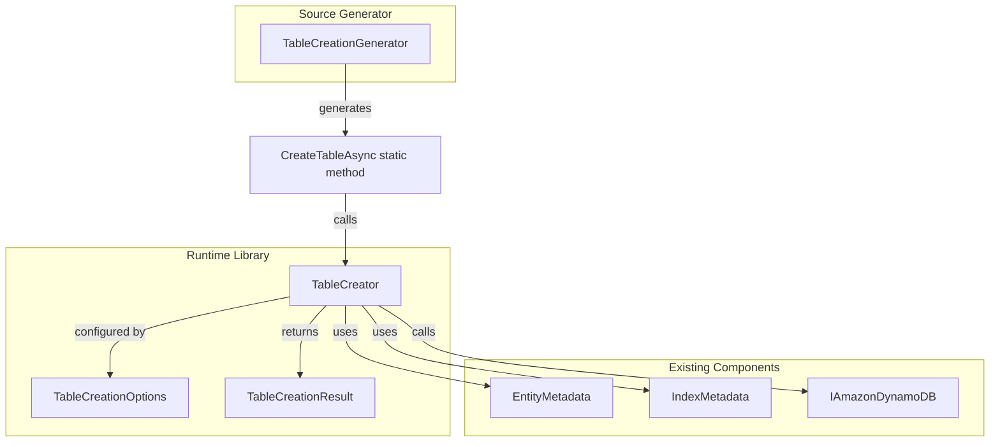

# Design Document: Table Creation from Metadata

## Overview

This feature adds the ability to create DynamoDB tables programmatically using the same `EntityMetadata` that powers schema validation. The implementation follows the existing patterns established by `SchemaValidator` and `SchemaValidationGenerator`, providing both a runtime `TableCreator` class and source-generated convenience methods on table classes.

The primary use case is integration testing, where developers need to create tables matching their entity definitions without manual infrastructure setup. A secondary use case is time-series tables that are created dynamically at runtime.

## Architecture



The architecture mirrors the existing schema validation pattern:
- `TableCreator` is the runtime component that builds and executes `CreateTableRequest`
- `TableCreationGenerator` generates static `CreateTableAsync` methods on table classes
- `TableCreationOptions` configures billing mode, throughput, TTL, and wait behavior
- `TableCreationResult` provides information about the created table

## Components and Interfaces

### TableCreator

The core runtime component responsible for creating DynamoDB tables from entity metadata.

```csharp
namespace Oproto.FluentDynamoDb.Provisioning;

/// <summary>
/// Creates DynamoDB tables from entity metadata.
/// </summary>
public class TableCreator
{
    /// <summary>
    /// Creates a DynamoDB table based on the provided entity metadata.
    /// </summary>
    /// <param name="client">The DynamoDB client to use for CreateTable.</param>
    /// <param name="tableName">The name of the table to create.</param>
    /// <param name="metadata">The entity metadata defining the table schema.</param>
    /// <param name="options">Optional creation options.</param>
    /// <param name="cancellationToken">Cancellation token.</param>
    /// <returns>The creation result containing table information.</returns>
    public async Task<TableCreationResult> CreateAsync(
        IAmazonDynamoDB client,
        string tableName,
        EntityMetadata metadata,
        TableCreationOptions? options = null,
        CancellationToken cancellationToken = default);
    
    /// <summary>
    /// Builds a CreateTableRequest from entity metadata without executing it.
    /// Useful for inspection or custom execution scenarios.
    /// </summary>
    public CreateTableRequest BuildCreateTableRequest(
        string tableName,
        EntityMetadata metadata,
        TableCreationOptions? options = null);
}
```

### TableCreationOptions

Configuration options for table creation.

```csharp
namespace Oproto.FluentDynamoDb.Provisioning;

/// <summary>
/// Options for table creation behavior.
/// </summary>
public class TableCreationOptions
{
    /// <summary>
    /// Gets or sets the billing mode. Default is PAY_PER_REQUEST.
    /// </summary>
    public BillingMode BillingMode { get; set; } = BillingMode.PAY_PER_REQUEST;
    
    /// <summary>
    /// Gets or sets the provisioned throughput for the table.
    /// Only used when BillingMode is PROVISIONED.
    /// </summary>
    public ProvisionedThroughputConfig? ProvisionedThroughput { get; set; }
    
    /// <summary>
    /// Gets or sets the provisioned throughput for GSIs.
    /// Only used when BillingMode is PROVISIONED.
    /// If not specified, uses the same values as the table.
    /// </summary>
    public ProvisionedThroughputConfig? GsiProvisionedThroughput { get; set; }
    
    /// <summary>
    /// Gets or sets whether to enable TTL if the entity metadata defines a TTL attribute.
    /// Default is false.
    /// </summary>
    public bool EnableTtl { get; set; } = false;
    
    /// <summary>
    /// Gets or sets whether to wait for the table to become ACTIVE before returning.
    /// Default is true.
    /// </summary>
    public bool WaitForActive { get; set; } = true;
    
    /// <summary>
    /// Gets or sets the timeout for waiting for the table to become ACTIVE.
    /// Default is 60 seconds.
    /// </summary>
    public TimeSpan WaitTimeout { get; set; } = TimeSpan.FromSeconds(60);
    
    /// <summary>
    /// Gets or sets the polling interval when waiting for the table to become ACTIVE.
    /// Default is 1 second.
    /// </summary>
    public TimeSpan PollingInterval { get; set; } = TimeSpan.FromSeconds(1);
}

/// <summary>
/// Provisioned throughput configuration.
/// </summary>
public class ProvisionedThroughputConfig
{
    /// <summary>
    /// Gets or sets the read capacity units.
    /// </summary>
    public long ReadCapacityUnits { get; set; } = 5;
    
    /// <summary>
    /// Gets or sets the write capacity units.
    /// </summary>
    public long WriteCapacityUnits { get; set; } = 5;
}
```

### TableCreationResult

Result information from table creation.

```csharp
namespace Oproto.FluentDynamoDb.Provisioning;

/// <summary>
/// Result of a table creation operation.
/// </summary>
public class TableCreationResult
{
    /// <summary>
    /// Gets the name of the created table.
    /// </summary>
    public string TableName { get; init; } = string.Empty;
    
    /// <summary>
    /// Gets the ARN of the created table.
    /// </summary>
    public string TableArn { get; init; } = string.Empty;
    
    /// <summary>
    /// Gets the current status of the table.
    /// </summary>
    public TableStatus TableStatus { get; init; }
    
    /// <summary>
    /// Gets whether TTL was enabled on the table.
    /// </summary>
    public bool TtlEnabled { get; init; }
}
```

### TableCreationGenerator

Source generator component that adds `CreateTableAsync` methods to generated table classes. The table name is always required since the entity's table name attribute is only used for connecting multiple entities to a single generated table class, not for actual table naming.

```csharp
// Generated code example for MyTable:
public partial class MyTable
{
    /// <summary>
    /// Creates the DynamoDB table based on entity metadata.
    /// </summary>
    /// <param name="client">The DynamoDB client to use.</param>
    /// <param name="tableName">The name of the table to create.</param>
    /// <param name="options">Optional creation options.</param>
    /// <param name="cancellationToken">Cancellation token.</param>
    public static async Task<TableCreationResult> CreateTableAsync(
        IAmazonDynamoDB client,
        string tableName,
        TableCreationOptions? options = null,
        CancellationToken cancellationToken = default)
    {
        var creator = new TableCreator();
        return await creator.CreateAsync(
            client,
            tableName,
            MyEntity.GetEntityMetadata(),
            options ?? new TableCreationOptions(),
            cancellationToken);
    }
}
```

## Data Models

### CreateTableRequest Building

The `TableCreator` builds a `CreateTableRequest` by mapping `EntityMetadata` to AWS SDK types:

| EntityMetadata Property | CreateTableRequest Property |
|------------------------|----------------------------|
| `PartitionKeyAttributeName` | `KeySchema[0].AttributeName` (HASH) |
| `PartitionKeyAttributeType` | `AttributeDefinitions[].AttributeType` |
| `SortKeyAttributeName` | `KeySchema[1].AttributeName` (RANGE) |
| `SortKeyAttributeType` | `AttributeDefinitions[].AttributeType` |
| `Indexes` (GSI) | `GlobalSecondaryIndexes[]` |
| `Indexes` (LSI) | `LocalSecondaryIndexes[]` |

### Index Mapping

| IndexMetadata Property | GSI/LSI Property |
|-----------------------|------------------|
| `IndexName` | `IndexName` |
| `PartitionKeyAttributeName` | `KeySchema[0].AttributeName` (HASH) |
| `PartitionKeyAttributeType` | `AttributeDefinitions[].AttributeType` |
| `SortKeyAttributeName` | `KeySchema[1].AttributeName` (RANGE) |
| `SortKeyAttributeType` | `AttributeDefinitions[].AttributeType` |
| `ProjectionType` | `Projection.ProjectionType` |
| `ProjectedProperties` | `Projection.NonKeyAttributes` |

## Correctness Properties

*A property is a characteristic or behavior that should hold true across all valid executions of a system-essentially, a formal statement about what the system should do. Properties serve as the bridge between human-readable specifications and machine-verifiable correctness guarantees.*

### Property Reflection

After analyzing the acceptance criteria, the following redundancies were identified:
- Properties 2.4, 2.5, 2.6 (GSI projections) and 3.3, 3.4, 3.5 (LSI projections) can be combined into single properties that test all projection types
- Properties 1.1, 1.2, 1.3 (primary key configuration) can be combined into a single property testing key schema generation

### Properties

**Property 1: Primary key schema round-trip**
*For any* valid EntityMetadata with partition key (and optional sort key), the generated CreateTableRequest SHALL have a KeySchema that matches the metadata's key configuration exactly.
**Validates: Requirements 1.1, 1.2, 1.3**

**Property 2: GSI configuration preservation**
*For any* EntityMetadata with GSI definitions, the generated CreateTableRequest SHALL contain GlobalSecondaryIndexes with matching index names, key schemas, and projection configurations.
**Validates: Requirements 2.1, 2.2, 2.3, 2.4, 2.5, 2.6**

**Property 3: LSI configuration preservation**
*For any* EntityMetadata with LSI definitions, the generated CreateTableRequest SHALL contain LocalSecondaryIndexes with the table's partition key, the LSI's sort key, and matching projection configurations.
**Validates: Requirements 3.1, 3.2, 3.3, 3.4, 3.5**

**Property 4: Attribute definitions completeness**
*For any* EntityMetadata, the generated CreateTableRequest SHALL have AttributeDefinitions containing all unique key attributes from the table and all indexes with correct types.
**Validates: Requirements 1.1, 1.2, 2.2, 2.3, 3.2**

**Property 5: Provisioned throughput configuration**
*For any* TableCreationOptions with PROVISIONED billing mode and specified throughput values, the generated CreateTableRequest SHALL have matching ProvisionedThroughput values.
**Validates: Requirements 1.5**

**Property 6: Table name is used in request**
*For any* table name provided to CreateAsync, the generated CreateTableRequest SHALL use that exact table name.
**Validates: Requirements 6.2**

## Error Handling

### Exception Types

| Scenario | Exception Type | Message Pattern |
|----------|---------------|-----------------|
| Table already exists | `ResourceInUseException` (from SDK) | Propagated with context |
| Invalid metadata (no partition key) | `ArgumentException` | "EntityMetadata must have a partition key defined" |
| Invalid metadata (empty table name) | `ArgumentException` | "Table name cannot be null or empty" |
| Wait timeout exceeded | `TimeoutException` | "Table did not become ACTIVE within {timeout}" |
| DynamoDB service error | SDK exceptions | Propagated with operation context |

### Validation Rules

Before building the request, `TableCreator` validates:
1. `tableName` is not null or empty
2. `metadata.PartitionKeyAttributeName` is not null or empty
3. `metadata.PartitionKeyAttributeType` is a valid type (S, N, B)
4. If sort key is defined, its type is valid
5. All GSI/LSI definitions have valid key configurations

## Testing Strategy

### Property-Based Testing Framework

The implementation will use **FsCheck** for property-based testing, consistent with other property tests in the codebase.

### Unit Tests

Unit tests will cover:
- Default options behavior (PAY_PER_REQUEST billing mode)
- TTL enablement logic
- Wait-for-active disabled behavior
- Source generator output verification
- Error handling for invalid metadata

### Property-Based Tests

Each correctness property will be implemented as a property-based test:

1. **Property 1 Test**: Generate random EntityMetadata with various key configurations, build request, verify KeySchema matches
2. **Property 2 Test**: Generate random EntityMetadata with 0-5 GSIs with various configurations, verify all GSIs appear correctly
3. **Property 3 Test**: Generate random EntityMetadata with 0-5 LSIs, verify all LSIs use table's partition key
4. **Property 4 Test**: Generate random EntityMetadata with indexes, verify AttributeDefinitions contains all unique key attributes
5. **Property 5 Test**: Generate random throughput values, verify they appear in request
6. **Property 6 Test**: Generate random table names, verify request uses provided name

### Test Annotations

Each property-based test MUST be tagged with:
```csharp
// **Feature: table-creation-from-metadata, Property {number}: {property_text}**
// **Validates: Requirements {X.Y}**
```

### Integration Tests

Integration tests (in `Oproto.FluentDynamoDb.IntegrationTests`) will verify:
- End-to-end table creation with DynamoDB Local
- Wait-for-active behavior
- TTL enablement
- Generated static method functionality
