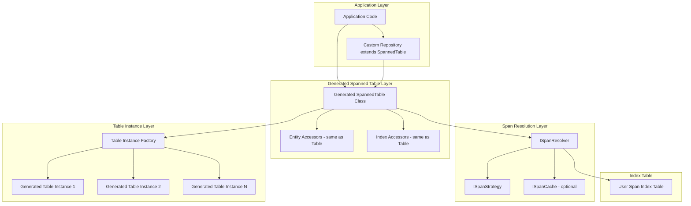

# Design Document: Table Spanning Support

## Overview

This design introduces a table-spanning architecture for FluentDynamoDb that enables transparent operations across multiple DynamoDB tables sharing the same entity schema. The architecture uses source generation to create spanned table classes that mirror the API of regular generated table classes, making them drop-in replacements that can be extended into repositories.

The design prioritizes:
- **Drop-in Replacement**: Spanned tables expose the same API as regular tables
- **Source Generated**: Full compile-time type checking with generated entity accessors
- **Extensibility**: Spanned tables can be extended into repositories just like regular tables
- **Consistency**: Same access modifiers, entity types, and key handling as regular tables

## Architecture



### Design Principle: Mirror the Generated Table API

The spanned table class is source-generated to match the exact API surface of the underlying table class:

| Regular Table | Spanned Table | Behavior |
|---------------|---------------|----------|
| `table.Transactions.Query(...)` | `spannedTable.Transactions.Query(...)` | Routes to appropriate span(s) |
| `table.Transactions.Put(entity)` | `spannedTable.Transactions.Put(entity)` | Routes to span based on entity date |
| `table.Transactions.Get(pk, sk)` | `spannedTable.Transactions.Get(pk, sk)` | Requires span hint or searches |
| `table.StatusIndex.Query(...)` | `spannedTable.StatusIndex.Query(...)` | Cross-span index query |
| `partial class MyTable` | `partial class MySpannedTable` | Both extensible to repositories |

### Component Responsibilities

| Component | Responsibility |
|-----------|----------------|
| Generated Spanned Table | Mirrors table API, orchestrates span routing |
| Entity Accessors | Same API as table accessors, with span-aware routing |
| `ISpanResolver` | Resolves span identifiers to physical table names |
| `ISpanStrategy` | Determines target span for writes, spans for queries |
| `ISpanCache` | Optional caching for span resolution |
| Table Instance Factory | Creates/caches instances of the underlying table class |

## Components and Interfaces

### Source Generator Attribute

```csharp
/// <summary>
/// Marks an entity for spanned table generation.
/// The source generator will create a spanned table class that mirrors
/// the regular table class API but routes operations across multiple physical tables.
/// </summary>
[AttributeUsage(AttributeTargets.Class, AllowMultiple = false)]
public class SpannedTableAttribute : Attribute
{
    /// <summary>
    /// The type of the span index entity used for span resolution.
    /// </summary>
    public Type IndexEntityType { get; }
    
    /// <summary>
    /// The type of the underlying generated table class.
    /// </summary>
    public Type TableType { get; }
    
    /// <summary>
    /// Optional custom name for the generated spanned table class.
    /// Defaults to "{TableClassName}Spanned".
    /// </summary>
    public string? SpannedTableName { get; set; }
    
    /// <summary>
    /// The span strategy type to use. Defaults to TimeSeriesStrategy.
    /// </summary>
    public Type? StrategyType { get; set; }
    
    public SpannedTableAttribute(Type indexEntityType, Type tableType)
    {
        IndexEntityType = indexEntityType;
        TableType = tableType;
    }
}

/// <summary>
/// Marks a property as the span key for routing write operations.
/// </summary>
[AttributeUsage(AttributeTargets.Property, AllowMultiple = false)]
public class SpanKeyAttribute : Attribute
{
    /// <summary>
    /// Optional function to extract span identifier from the property value.
    /// </summary>
    public string? ExtractorMethod { get; set; }
}
```

### Core Interfaces

```csharp
/// <summary>
/// Represents a resolved span with its physical table name and metadata.
/// </summary>
public readonly record struct ResolvedSpan(
    string SpanId,
    string TableName,
    DateTime? PeriodStart = null,
    DateTime? PeriodEnd = null,
    IReadOnlyDictionary<string, string>? Metadata = null);

/// <summary>
/// Strategy for determining which spans to query or write to.
/// </summary>
public interface ISpanStrategy
{
    /// <summary>
    /// Resolves the target span identifier for a write operation based on the span key value.
    /// </summary>
    string ResolveWriteSpan(object spanKeyValue);
    
    /// <summary>
    /// Resolves all span identifiers that should be queried for a given range.
    /// </summary>
    IEnumerable<string> ResolveQuerySpans(object? startValue, object? endValue, bool ascending = true);
    
    /// <summary>
    /// Resolves all available span identifiers.
    /// </summary>
    IEnumerable<string> ResolveAllSpans(bool ascending = true);
}

/// <summary>
/// Resolves span identifiers to physical table information.
/// </summary>
public interface ISpanResolver
{
    /// <summary>
    /// Resolves a single span by its identifier.
    /// </summary>
    Task<ResolvedSpan?> ResolveSpanAsync(string spanId, CancellationToken cancellationToken = default);
    
    /// <summary>
    /// Resolves multiple spans by their identifiers.
    /// </summary>
    Task<IReadOnlyList<ResolvedSpan>> ResolveSpansAsync(
        IEnumerable<string> spanIds, 
        CancellationToken cancellationToken = default);
    
    /// <summary>
    /// Gets all available spans.
    /// </summary>
    Task<IReadOnlyList<ResolvedSpan>> GetAllSpansAsync(CancellationToken cancellationToken = default);
}

/// <summary>
/// Optional cache for span resolution results.
/// </summary>
public interface ISpanCache
{
    bool TryGet(string spanId, out ResolvedSpan span);
    void Set(string spanId, ResolvedSpan span, TimeSpan? ttl = null);
    void Invalidate(string spanId);
    void Clear();
}
```

### Time-Series Strategy

```csharp
/// <summary>
/// Span strategy for time-series partitioned tables.
/// </summary>
public class TimeSeriesStrategy : ISpanStrategy
{
    private readonly int _monthsPerPeriod;
    private readonly bool _allowFutureTables;
    private readonly Func<DateTime, string> _spanIdGenerator;
    
    public TimeSeriesStrategy(
        int monthsPerPeriod = 1,
        Func<DateTime, string>? spanIdGenerator = null,
        bool allowFutureTables = false)
    {
        _monthsPerPeriod = monthsPerPeriod;
        _spanIdGenerator = spanIdGenerator ?? DefaultSpanIdGenerator;
        _allowFutureTables = allowFutureTables;
    }
    
    public string ResolveWriteSpan(object spanKeyValue)
    {
        var date = (DateTime)spanKeyValue;
        
        if (!_allowFutureTables && date > DateTime.UtcNow)
            throw new InvalidOperationException($"Cannot write to future table span for date {date:s}");
        
        return _spanIdGenerator(NormalizeToPeriodStart(date));
    }
    
    public IEnumerable<string> ResolveQuerySpans(object? startValue, object? endValue, bool ascending = true)
    {
        var start = startValue as DateTime? ?? DateTime.MinValue;
        var end = endValue as DateTime? ?? DateTime.UtcNow;
        
        var spans = new List<string>();
        var current = NormalizeToPeriodStart(start);
        
        while (current <= end)
        {
            spans.Add(_spanIdGenerator(current));
            current = current.AddMonths(_monthsPerPeriod);
        }
        
        return ascending ? spans : spans.AsEnumerable().Reverse();
    }
    
    public IEnumerable<string> ResolveAllSpans(bool ascending = true)
    {
        // Returns empty - requires resolver to provide all spans
        return Enumerable.Empty<string>();
    }
    
    private DateTime NormalizeToPeriodStart(DateTime date)
    {
        var periodIndex = (date.Month - 1) / _monthsPerPeriod;
        var periodStartMonth = periodIndex * _monthsPerPeriod + 1;
        return new DateTime(date.Year, periodStartMonth, 1, 0, 0, 0, DateTimeKind.Utc);
    }
    
    private static string DefaultSpanIdGenerator(DateTime periodStart) 
        => $"{periodStart:yyyy-MM}";
}
```

### Default Span Resolver

```csharp
/// <summary>
/// Default span resolver that queries a user-defined index table.
/// </summary>
/// <typeparam name="TIndex">The user's index entity type.</typeparam>
/// <typeparam name="TIndexTable">The user's index table type.</typeparam>
public class DefaultSpanResolver<TIndex, TIndexTable> : ISpanResolver 
    where TIndex : class, IDynamoDbEntity, new()
    where TIndexTable : IDynamoDbTable
{
    private readonly TIndexTable _indexTable;
    private readonly Func<TIndex, ResolvedSpan> _spanMapper;
    private readonly Func<TIndexTable, QueryRequestBuilder<TIndex>> _queryBuilder;
    private readonly ISpanCache? _cache;
    
    public DefaultSpanResolver(
        TIndexTable indexTable,
        Func<TIndex, ResolvedSpan> spanMapper,
        Func<TIndexTable, QueryRequestBuilder<TIndex>> queryBuilder,
        ISpanCache? cache = null)
    {
        _indexTable = indexTable;
        _spanMapper = spanMapper;
        _queryBuilder = queryBuilder;
        _cache = cache;
    }
    
    public async Task<ResolvedSpan?> ResolveSpanAsync(string spanId, CancellationToken cancellationToken = default)
    {
        if (_cache?.TryGet(spanId, out var cached) == true)
            return cached;
        
        var results = await _queryBuilder(_indexTable).ToListAsync(cancellationToken);
        var match = results.FirstOrDefault(r => _spanMapper(r).SpanId == spanId);
        
        if (match == null)
            return null;
        
        var resolved = _spanMapper(match);
        _cache?.Set(spanId, resolved);
        return resolved;
    }
    
    public async Task<IReadOnlyList<ResolvedSpan>> ResolveSpansAsync(
        IEnumerable<string> spanIds, 
        CancellationToken cancellationToken = default)
    {
        var results = new List<ResolvedSpan>();
        var uncachedIds = new List<string>();
        
        foreach (var spanId in spanIds)
        {
            if (_cache?.TryGet(spanId, out var cached) == true)
                results.Add(cached);
            else
                uncachedIds.Add(spanId);
        }
        
        if (uncachedIds.Count > 0)
        {
            var queryResults = await _queryBuilder(_indexTable).ToListAsync(cancellationToken);
            foreach (var result in queryResults)
            {
                var resolved = _spanMapper(result);
                if (uncachedIds.Contains(resolved.SpanId))
                {
                    results.Add(resolved);
                    _cache?.Set(resolved.SpanId, resolved);
                }
            }
        }
        
        return results;
    }
    
    public async Task<IReadOnlyList<ResolvedSpan>> GetAllSpansAsync(CancellationToken cancellationToken = default)
    {
        var queryResults = await _queryBuilder(_indexTable).ToListAsync(cancellationToken);
        return queryResults.Select(_spanMapper).ToList();
    }
}
```

## Generated Spanned Table Structure

The source generator creates a spanned table class that mirrors the underlying table class:

```csharp
// User defines entity with SpannedTable attribute
[DynamoDbTable("transactions")]
[SpannedTable(typeof(SpanIndexEntry), typeof(TransactionsTable))]
public partial class Transaction
{
    [PartitionKey(Prefix = "CUSTOMER")]
    [DynamoDbAttribute("pk")]
    public string Pk { get; set; } = string.Empty;
    
    [SortKey(Prefix = "TXN")]
    [DynamoDbAttribute("sk")]
    public string Sk { get; set; } = string.Empty;
    
    [SpanKey]  // Marks this as the span routing key
    [DynamoDbAttribute("transactionDate")]
    public DateTime TransactionDate { get; set; }
    
    [DynamoDbAttribute("amount")]
    public decimal Amount { get; set; }
}

// Source generator produces:
public partial class TransactionsTableSpanned : ISpannedTable
{
    private readonly IAmazonDynamoDB _client;
    private readonly FluentDynamoDbOptions? _options;
    private readonly ISpanResolver _spanResolver;
    private readonly ISpanStrategy _spanStrategy;
    private readonly ConcurrentDictionary<string, TransactionsTable> _tableCache = new();
    
    /// <summary>
    /// Accessor for Transaction entity operations (mirrors TransactionsTable.Transactions).
    /// </summary>
    public TransactionSpannedAccessor Transactions { get; }
    
    // Constructor mirrors table constructor pattern
    public TransactionsTableSpanned(
        IAmazonDynamoDB client,
        ISpanResolver spanResolver,
        ISpanStrategy? spanStrategy = null,
        FluentDynamoDbOptions? options = null)
    {
        _client = client;
        _spanResolver = spanResolver;
        _spanStrategy = spanStrategy ?? new TimeSeriesStrategy();
        _options = options;
        Transactions = new TransactionSpannedAccessor(this);
    }
    
    /// <summary>
    /// Gets a table instance for a specific span.
    /// </summary>
    public async Task<TransactionsTable> ForSpanAsync(string spanId, CancellationToken ct = default)
    {
        var resolved = await _spanResolver.ResolveSpanAsync(spanId, ct)
            ?? throw new SpanNotFoundException(spanId);
        
        return GetOrCreateTableInstance(resolved.TableName);
    }
    
    /// <summary>
    /// Gets a table instance for a specific date.
    /// </summary>
    public async Task<TransactionsTable> ForDateAsync(DateTime date, CancellationToken ct = default)
    {
        var spanId = _spanStrategy.ResolveWriteSpan(date);
        return await ForSpanAsync(spanId, ct);
    }
    
    private TransactionsTable GetOrCreateTableInstance(string tableName)
    {
        return _tableCache.GetOrAdd(tableName, 
            name => new TransactionsTable(_client, name, _options));
    }
    
    // Nested accessor class mirrors the table's accessor
    public class TransactionSpannedAccessor
    {
        private readonly TransactionsTableSpanned _spannedTable;
        
        internal TransactionSpannedAccessor(TransactionsTableSpanned spannedTable)
        {
            _spannedTable = spannedTable;
        }
        
        // Query - routes to cross-table query
        public SpannedQueryRequestBuilder<Transaction> Query()
        {
            return new SpannedQueryRequestBuilder<Transaction>(_spannedTable);
        }
        
        public SpannedQueryRequestBuilder<Transaction> Query(
            Expression<Func<Transaction, bool>> keyCondition)
        {
            return Query().Where(keyCondition);
        }
        
        // Put - routes to appropriate span based on SpanKey
        public async Task PutAsync(Transaction entity, CancellationToken ct = default)
        {
            var table = await _spannedTable.ForDateAsync(entity.TransactionDate, ct);
            await table.Transactions.PutAsync(entity, ct);
        }
        
        public SpannedPutItemRequestBuilder<Transaction> Put(Transaction entity)
        {
            return new SpannedPutItemRequestBuilder<Transaction>(_spannedTable, entity);
        }
        
        // Get - requires span hint or searches all spans
        public SpannedGetItemRequestBuilder<Transaction> Get(string pk, string sk)
        {
            return new SpannedGetItemRequestBuilder<Transaction>(_spannedTable, pk, sk);
        }
        
        // Update - requires span hint
        public SpannedUpdateItemRequestBuilder<Transaction> Update(
            string pk, string sk, DateTime spanHint)
        {
            return new SpannedUpdateItemRequestBuilder<Transaction>(
                _spannedTable, pk, sk, spanHint);
        }
        
        // Delete - requires span hint
        public SpannedDeleteItemRequestBuilder<Transaction> Delete(
            string pk, string sk, DateTime spanHint)
        {
            return new SpannedDeleteItemRequestBuilder<Transaction>(
                _spannedTable, pk, sk, spanHint);
        }
    }
}
```

## Spanned Request Builders

The spanned request builders wrap the underlying table builders and handle span routing:

```csharp
/// <summary>
/// Query builder that executes across multiple spans.
/// </summary>
public class SpannedQueryRequestBuilder<TEntity> where TEntity : class, IReadOnlyEntity
{
    private readonly ISpannedTable _spannedTable;
    private Expression<Func<TEntity, bool>>? _keyCondition;
    private Expression<Func<TEntity, bool>>? _filterCondition;
    private DateTime? _startDate;
    private DateTime? _endDate;
    private int _pageSize = 100;
    private string? _paginationToken;
    private bool _ascending = true;
    
    internal SpannedQueryRequestBuilder(ISpannedTable spannedTable)
    {
        _spannedTable = spannedTable;
    }
    
    public SpannedQueryRequestBuilder<TEntity> Where(
        Expression<Func<TEntity, bool>> keyCondition)
    {
        _keyCondition = keyCondition;
        return this;
    }
    
    public SpannedQueryRequestBuilder<TEntity> WithFilter(
        Expression<Func<TEntity, bool>> filterCondition)
    {
        _filterCondition = filterCondition;
        return this;
    }
    
    /// <summary>
    /// Limits the query to spans within the date range.
    /// </summary>
    public SpannedQueryRequestBuilder<TEntity> ForDateRange(DateTime start, DateTime end)
    {
        _startDate = start;
        _endDate = end;
        return this;
    }
    
    public SpannedQueryRequestBuilder<TEntity> Take(int pageSize)
    {
        _pageSize = pageSize;
        return this;
    }
    
    public SpannedQueryRequestBuilder<TEntity> StartAt(string paginationToken)
    {
        _paginationToken = paginationToken;
        return this;
    }
    
    public SpannedQueryRequestBuilder<TEntity> ScanIndexForward(bool ascending)
    {
        _ascending = ascending;
        return this;
    }
    
    /// <summary>
    /// Executes the cross-table query and returns aggregated results.
    /// </summary>
    public async Task<CrossTableQueryResponse<TEntity>> ToListAsync(
        CancellationToken cancellationToken = default)
    {
        return await _spannedTable.ExecuteCrossTableQueryAsync(
            new CrossTableQueryRequest<TEntity>
            {
                KeyCondition = _keyCondition,
                FilterCondition = _filterCondition,
                StartDate = _startDate,
                EndDate = _endDate,
                PageSize = _pageSize,
                PaginationToken = _paginationToken,
                Ascending = _ascending
            },
            cancellationToken);
    }
}
```

## Data Models

### Cross-Table Query Request/Response

```csharp
public class CrossTableQueryRequest<TEntity> where TEntity : class, IReadOnlyEntity
{
    public Expression<Func<TEntity, bool>>? KeyCondition { get; init; }
    public Expression<Func<TEntity, bool>>? FilterCondition { get; init; }
    public DateTime? StartDate { get; init; }
    public DateTime? EndDate { get; init; }
    public int PageSize { get; init; } = 100;
    public string? PaginationToken { get; init; }
    public bool Ascending { get; init; } = true;
}

public class CrossTableQueryResponse<TEntity> where TEntity : class
{
    public List<TEntity> Items { get; } = new();
    public string? PaginationToken { get; set; }
    public bool HasMoreResults { get; set; }
    public int ScannedCount { get; set; }
    public int ResultCount { get; set; }
    public int QueryOperations { get; set; }
    public ConsumedCapacity AggregatedCapacity { get; } = new();
    public Dictionary<string, ConsumedCapacity> TableCapacity { get; } = new();
    public List<SpanFailure> FailedSpans { get; } = new();
    public bool HasFailures => FailedSpans.Count > 0;
}

public record SpanFailure(string SpanId, Exception Exception, DateTime FailedAt);
```

### User-Defined Span Index Entity Example

```csharp
[DynamoDbTable("span-index")]
public partial class SpanIndexEntry
{
    [PartitionKey]
    [DynamoDbAttribute("pk")]
    public string Pk { get; set; } = string.Empty;  // e.g., "SPAN#transactions"
    
    [SortKey]
    [DynamoDbAttribute("sk")]
    public string Sk { get; set; } = string.Empty;  // e.g., "2024-01"
    
    [DynamoDbAttribute("tableName")]
    public string TableName { get; set; } = string.Empty;
    
    [DynamoDbAttribute("periodStart")]
    public DateTime PeriodStart { get; set; }
    
    [DynamoDbAttribute("periodEnd")]
    public DateTime PeriodEnd { get; set; }
}
```

## Usage Examples

### Basic Usage - Drop-in Replacement

```csharp
// Regular table usage
var table = new TransactionsTable(client, "transactions-2024-01", options);
var txns = await table.Transactions.Query(x => x.Pk == customerId).ToListAsync();

// Spanned table usage - same API!
var spanResolver = new DefaultSpanResolver<SpanIndexEntry, SpanIndexTable>(
    indexTable,
    entry => new ResolvedSpan(entry.Sk, entry.TableName, entry.PeriodStart, entry.PeriodEnd),
    table => table.SpanEntries.Query(x => x.Pk == "SPAN#transactions"));

var spannedTable = new TransactionsTableSpanned(client, spanResolver, options: options);

// Same query API - but now queries across all spans!
var txns = await spannedTable.Transactions.Query(x => x.Pk == customerId)
    .ForDateRange(new DateTime(2024, 1, 1), new DateTime(2024, 6, 30))
    .ToListAsync();
```

### Extending to Repository

```csharp
// Just like regular tables, spanned tables can be extended
public class TransactionRepository : TransactionsTableSpanned
{
    public TransactionRepository(
        IAmazonDynamoDB client,
        ISpanResolver spanResolver,
        FluentDynamoDbOptions? options = null)
        : base(client, spanResolver, options: options)
    {
    }
    
    // Add domain-specific methods
    public async Task<List<Transaction>> GetCustomerTransactionsAsync(
        string customerId,
        DateTime startDate,
        DateTime endDate,
        CancellationToken ct = default)
    {
        var response = await Transactions.Query(x => x.Pk == Transaction.Keys.Pk(customerId))
            .ForDateRange(startDate, endDate)
            .ToListAsync(ct);
        
        return response.Items;
    }
    
    public async Task<decimal> GetCustomerTotalAsync(
        string customerId,
        DateTime startDate,
        DateTime endDate,
        CancellationToken ct = default)
    {
        var transactions = await GetCustomerTransactionsAsync(customerId, startDate, endDate, ct);
        return transactions.Sum(t => t.Amount);
    }
}
```

### Direct Span Access

```csharp
// When you know exactly which span you need
var januaryTable = await spannedTable.ForSpanAsync("2024-01");
var januaryTxns = await januaryTable.Transactions.Query(x => x.Pk == customerId).ToListAsync();

// Or by date
var table = await spannedTable.ForDateAsync(transactionDate);
await table.Transactions.PutAsync(transaction);
```


## Correctness Properties

*A property is a characteristic or behavior that should hold true across all valid executions of a system—essentially, a formal statement about what the system should do. Properties serve as the bridge between human-readable specifications and machine-verifiable correctness guarantees.*

### Property 1: Generated Spanned Table API Mirrors Regular Table

*For any* entity with `[SpannedTable]` attribute, the generated spanned table class SHALL have entity accessor properties with the same names and method signatures as the underlying generated table class.

**Validates: Requirements 1.1, 1.4**

### Property 2: Span Resolver Mapping Function Application

*For any* span resolver with a configured mapping function and *for any* index entity returned from the index table, the resolver SHALL use the mapping function to extract the table name, and the extracted table name SHALL match what the mapping function returns when applied directly to the entity.

**Validates: Requirements 2.3**

### Property 3: Empty Span Resolution Returns Empty List

*For any* span resolver and *for any* query that returns no results from the index table, the resolver SHALL return an empty list (not null, not throw an exception).

**Validates: Requirements 2.4**

### Property 4: Time-Series Period Start Calculation

*For any* date and *for any* valid period length (1, 3, 6, or 12 months), the calculated period start date SHALL:
- Have day = 1
- Have a month that is the first month of the period containing the input date
- Have the same year as the input date (unless the period spans year boundaries)

**Validates: Requirements 3.2**

### Property 5: Time-Series Period Enumeration Coverage

*For any* date range [start, end] and *for any* valid period length, the enumerated periods SHALL:
- Include all periods that overlap with the date range
- Have no gaps between consecutive periods
- Start with the period containing the start date
- End with the period containing the end date

**Validates: Requirements 3.3**

### Property 6: Time-Series Ascending/Descending Symmetry

*For any* date range and *for any* valid period length, enumerating periods in ascending order and then reversing the result SHALL produce the same sequence as enumerating in descending order.

**Validates: Requirements 3.4**

### Property 7: Table Factory Name Propagation

*For any* resolved table name passed to the table instance factory, the created table instance SHALL have its `Name` property equal to the resolved table name.

**Validates: Requirements 4.2**

### Property 8: Table Factory Instance Caching

*For any* table name requested from the factory multiple times, the factory SHALL return the same instance (reference equality) for all requests with the same table name.

**Validates: Requirements 4.3**

### Property 9: CRUD Operation Routing

*For any* entity with a span key field and *for any* CRUD operation (Put, Get, Update, Delete), the spanned table SHALL route the operation to the table instance whose span contains the entity's span key value. The target table's `Name` property SHALL match the resolved span's table name.

**Validates: Requirements 5.1, 5.2, 5.3, 5.4**

### Property 10: Cross-Table Query Span Coverage

*For any* date range query, the spanned table SHALL query all spans that overlap with the date range, and the combined results SHALL include items from all queried spans.

**Validates: Requirements 6.1, 6.2**

### Property 11: Cross-Table Query Page Size Limit

*For any* cross-table query with a page size limit, the number of items in the response SHALL NOT exceed the page size limit.

**Validates: Requirements 6.3**

### Property 12: Cross-Table Query Pagination Token Generation

*For any* cross-table query that reaches the page size limit before exhausting all spans, the response SHALL include a non-null pagination token and `HasMoreResults` SHALL be true.

**Validates: Requirements 6.4**

### Property 13: Cross-Table Query Capacity Aggregation

*For any* cross-table query across multiple tables, the `AggregatedCapacity` in the response SHALL equal the sum of all values in `TableCapacity`.

**Validates: Requirements 6.5, 9.1, 9.2**

### Property 14: Cross-Table Query Sort Order

*For any* cross-table query, executing with ascending=true and then reversing the results SHALL produce the same item order as executing with ascending=false (assuming deterministic ordering within each span).

**Validates: Requirements 6.6**

### Property 15: Pagination Token Round-Trip

*For any* pagination token generated by a cross-table query, decoding the token and using it to resume the query SHALL continue from the exact position (span and LastEvaluatedKey) that was encoded.

**Validates: Requirements 7.1, 7.2, 7.3**

### Property 16: Invalid Pagination Token Exception

*For any* string that is not a valid base64-encoded pagination token, attempting to decode it SHALL throw an `InvalidPaginationTokenException`.

**Validates: Requirements 7.4**

### Property 17: HasMoreResults Accuracy

*For any* cross-table query response, `HasMoreResults` SHALL be true if and only if there are more items available in the current span or subsequent spans.

**Validates: Requirements 7.5**

### Property 18: Cache Hit Prevents Index Query

*For any* span that is present in the cache, resolving that span SHALL return the cached value without querying the index table.

**Validates: Requirements 8.2**

### Property 19: Cache Invalidation Causes Miss

*For any* span that has been invalidated in the cache, the next resolution of that span SHALL query the index table (cache miss).

**Validates: Requirements 8.4**

### Property 20: No Cache Means Direct Query

*For any* span resolver without a cache, every span resolution SHALL query the index table.

**Validates: Requirements 8.5**

### Property 21: Query Operation Count

*For any* cross-table query, the `QueryOperations` count in the response SHALL equal the number of distinct spans that were queried.

**Validates: Requirements 9.3**

### Property 22: Scanned and Result Count Tracking

*For any* cross-table query, `ScannedCount` SHALL equal the sum of scanned counts from all span queries, and `ResultCount` SHALL equal the sum of result counts from all span queries.

**Validates: Requirements 9.4**

### Property 23: SpanNotFoundException Contains Span ID

*For any* span that cannot be resolved, the thrown `SpanNotFoundException` SHALL have its `SpanId` property equal to the requested span identifier.

**Validates: Requirements 10.1**

### Property 24: TableInstanceCreationException Contains Table Name

*For any* table instance creation failure, the thrown `TableInstanceCreationException` SHALL have its `TableName` property equal to the table name that failed to create.

**Validates: Requirements 10.2**

### Property 25: Cross-Table Query Failure Includes Span ID

*For any* cross-table query that fails on a specific span, the exception message or properties SHALL include the span identifier where the failure occurred.

**Validates: Requirements 10.3**

### Property 26: Continue-On-Error Collects All Failures

*For any* cross-table query using continue-on-error strategy with multiple span failures, the response SHALL include all failed spans with their respective exceptions.

**Validates: Requirements 10.5**

### Property 27: Source Generator Invalid Configuration Diagnostics

*For any* entity with an invalid spanned table configuration (e.g., missing required attributes, conflicting settings), the source generator SHALL emit at least one diagnostic with severity Error or Warning.

**Validates: Requirements 11.5**

### Property 28: Custom Strategy Acceptance

*For any* valid implementation of `ISpanStrategy`, the spanned table SHALL accept it and use it for span resolution without throwing.

**Validates: Requirements 12.4**

## Error Handling

### Exception Hierarchy

```
Exception
├── SpanNotFoundException
│   └── SpanId: string
├── TableInstanceCreationException
│   ├── TableName: string
│   └── InnerException: Exception
├── InvalidPaginationTokenException
│   ├── Token: string
│   └── InnerException: Exception?
└── CrossTableQueryException
    ├── SpanId: string
    ├── InnerException: Exception
    └── PartialResults: CrossTableQueryResponse<T>?
```

### Error Handling Strategies

| Strategy | Behavior | Use Case |
|----------|----------|----------|
| `FailFast` (default) | Stop on first error, throw immediately | Transactional consistency required |
| `ContinueOnError` | Continue querying remaining spans, collect errors | Best-effort data retrieval |

### Configuration

```csharp
var options = new SpannedTableOptions
{
    ErrorHandlingStrategy = ErrorHandlingStrategy.ContinueOnError,
    MaxConsecutiveFailures = 3,
    IncludePartialResultsOnError = true
};
```

## Testing Strategy

### Unit Tests

Unit tests focus on individual component behavior:

1. **TimeSeriesStrategy Tests**
   - Period start calculation for various dates and period lengths
   - Period enumeration for date ranges
   - Future date handling with flag enabled/disabled
   - Edge cases: year boundaries, leap years, month boundaries

2. **DefaultSpanResolver Tests**
   - Mapping function application
   - Cache hit/miss behavior
   - Empty result handling
   - Query customizer application

3. **Pagination Token Tests**
   - Encoding/decoding round-trip
   - Invalid token handling
   - Edge cases: empty LastEvaluatedKey, special characters in span ID

4. **CrossTableQueryResponse Tests**
   - Capacity aggregation accuracy
   - Count tracking accuracy

### Property-Based Tests

Property-based tests verify universal properties using FsCheck:

1. **Property: Period Calculation Consistency**
   - Generator: Random dates within valid range
   - Property: Calculated period start is always <= input date and period end is always > input date

2. **Property: Period Enumeration Completeness**
   - Generator: Random date ranges and period lengths
   - Property: Union of all enumerated periods covers the entire input range

3. **Property: Pagination Token Round-Trip**
   - Generator: Random span IDs and LastEvaluatedKey dictionaries
   - Property: Decode(Encode(spanId, key)) == (spanId, key)

4. **Property: Capacity Aggregation**
   - Generator: Random per-table capacity values
   - Property: Sum of per-table values == aggregated value

5. **Property: Factory Caching**
   - Generator: Random sequences of table name requests
   - Property: Same name always returns same instance

### Integration Tests

Integration tests verify end-to-end behavior with DynamoDB Local:

1. **Cross-Table Query Integration**
   - Set up multiple tables with test data
   - Execute cross-table queries and verify results
   - Test pagination across table boundaries

2. **CRUD Routing Integration**
   - Put entities with various dates
   - Verify they land in correct tables
   - Get/Update/Delete and verify routing

3. **Source Generator Integration**
   - Verify generated spanned table compiles
   - Verify API surface matches underlying table
   - Verify accessor methods work correctly

### Test Configuration

```csharp
// Property-based test configuration
[Property(MaxTest = 100, Arbitrary = new[] { typeof(SpanArbitraries) })]
public Property PeriodEnumerationCoversRange(DateTime start, DateTime end, int monthsPerPeriod)
{
    // ... property implementation
}
```


## Open Design Questions

### Question 1: Point Operation Span Resolution

**Problem Statement:**
For Get/Update/Delete operations, the caller needs to know which span contains the item. Unlike Query operations where a date range can filter spans, point operations target a specific item by key. The challenge is: how does the spanned table know which physical table contains the item?

**Sticking Points:**
1. The underlying request builders (GetItemRequestBuilder, UpdateItemRequestBuilder, etc.) have no awareness of spanning
2. Users expect "point and shoot" simplicity - just provide the key and get the item
3. Searching all spans is expensive (N queries for N spans)
4. Requiring span hints adds friction to the API

**Options Under Consideration:**

**Option A: Span Hint Required**
Require explicit span/date parameter for point operations.
```csharp
// Explicit span ID
spannedTable.Transactions.Get(pk, sk).InSpan("2024-01").GetItemAsync();

// Or date hint that resolves to span
spannedTable.Transactions.Get(pk, sk).ForDate(transactionDate).GetItemAsync();
```
- Pros: Efficient (single query), explicit, no magic
- Cons: Requires caller to know/track span info, not "point and shoot"

**Option B: Search All Spans**
Allow searching all spans until the item is found.
```csharp
// Searches spans in order until found
spannedTable.Transactions.Get(pk, sk).SearchAllSpans().GetItemAsync();
```
- Pros: True "point and shoot", always works
- Cons: Expensive (up to N queries), unpredictable latency

**Option C: Extract Span from Key**
If the span key (e.g., date) is encoded in the sort key, extract it automatically.
```csharp
// SK = "TXN#2024-01-15#abc123" - system extracts "2024-01-15" and resolves span
spannedTable.Transactions.Get(pk, sk).GetItemAsync();
```
- Pros: "Point and shoot" with single query
- Cons: Requires specific key design, fragile if key format changes

**Option D: Separate Span-Aware API**
Don't try to mirror the table API. Provide explicitly span-aware operations.
```csharp
// Get a span-scoped table first
var januaryTable = spannedTable.GetSpan("2024-01");
var txn = await januaryTable.Transactions.Get(pk, sk).GetItemAsync();

// Or fluent span selection
var txn = await spannedTable.InSpan("2024-01").Transactions.Get(pk, sk).GetItemAsync();

// Cross-span query is explicit
var results = await spannedTable.AcrossSpans(start, end).Transactions.Query(...).ToListAsync();
```
- Pros: Clear intent, no hidden behavior
- Cons: Different API from regular tables, not a drop-in replacement

**Option E: Context-Based Span Selection**
Use a disposable context to set the current span for operations.
```csharp
using (spannedTable.UseSpan("2024-01"))
{
    var txn = await spannedTable.Transactions.Get(pk, sk).GetItemAsync();
    await spannedTable.Transactions.Update(pk, sk).Set(...).UpdateAsync();
}
```
- Pros: Clean syntax, groups related operations
- Cons: Implicit state, potential for bugs if context not set

**Option F: Hybrid Approach**
Different defaults for different operation types:
- **Query**: Cross-span by default, with optional `.ForDateRange()` filter
- **Put**: Auto-route based on `[SpanKey]` property
- **Get/Update/Delete**: Require span hint OR opt-in to search-all-spans

```csharp
// Query - cross-span by default
var results = await spannedTable.Transactions.Query(x => x.Pk == pk).ToListAsync();

// Put - auto-routes based on SpanKey
await spannedTable.Transactions.PutAsync(transaction); // Uses transaction.TransactionDate

// Get - requires hint (default) or explicit search
var txn = await spannedTable.Transactions.Get(pk, sk).InSpan("2024-01").GetItemAsync();
// OR
var txn = await spannedTable.Transactions.Get(pk, sk).SearchAllSpans().GetItemAsync();
```

### Question 2: Partial Class Extension Pattern

**Problem Statement:**
Regular generated tables use partial classes for extension:
```csharp
// Generated
public partial class TransactionsTable : IDynamoDbTable { ... }

// User extension
public partial class TransactionsTable
{
    public async Task<List<Transaction>> GetRecentAsync() { ... }
}
```

How should spanned tables support the same pattern?

**Options:**
1. Generate spanned table as partial class (same pattern)
2. Generate spanned table that wraps a partial table class
3. Different extension mechanism for spanned tables

### Question 3: Builder Awareness

**Problem Statement:**
The existing request builders (QueryRequestBuilder, GetItemRequestBuilder, etc.) have no concept of spanning. They operate on a single table.

**Options:**
1. Create new spanned builder types that wrap the existing builders
2. Modify existing builders to support spanning (breaking change)
3. Execute spanning logic outside the builders (in the spanned table class)

### Question 4: Index Operations

**Problem Statement:**
GSI/LSI queries also need span awareness. How should index accessors work on spanned tables?

```csharp
// Regular table
var results = await table.StatusIndex.Query<Transaction>(x => x.Status == "pending").ToListAsync();

// Spanned table - which spans to query?
var results = await spannedTable.StatusIndex.Query<Transaction>(x => x.Status == "pending").ToListAsync();
```

**Options:**
1. Index queries always cross all spans (expensive)
2. Index queries require date range filter
3. Index queries only work on single span (must select span first)

---

**Status:** Design paused pending resolution of open questions. The core architecture is sound, but the API design for point operations needs further consideration based on real-world use cases.
