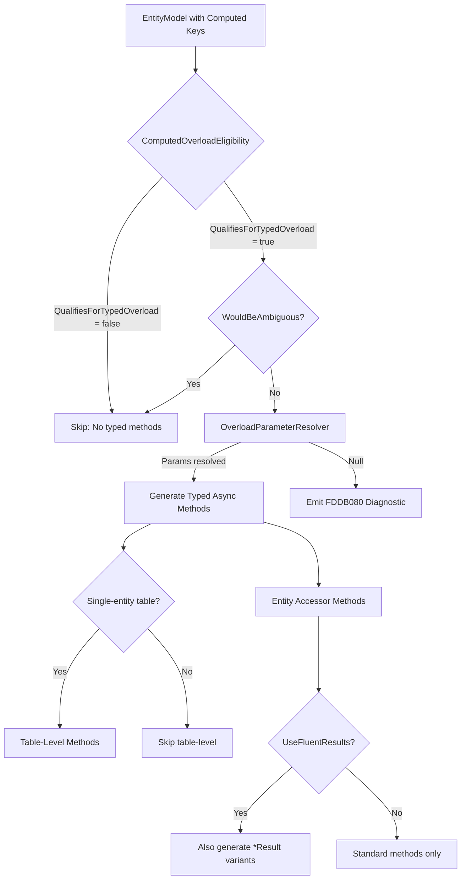

# Design Document: Typed Async Convenience Methods

## Overview

This feature extends the Oproto.FluentDynamoDb source generator to emit typed async convenience methods (`GetAsync`, `DeleteAsync`, `GetAsyncResult`, `DeleteAsyncResult`) for entities with computed keys. Currently, the generator produces typed builder-returning overloads (e.g., `Get(int year, int month, int day)`) but users must manually chain `.GetItemAsync()` or `.DeleteAsync()` to execute. This feature closes that gap by generating one-shot async methods that internally delegate to the typed builder and call the terminal method.

The new methods are generated:
- On Entity Accessors (e.g., `table.ScheduledEvents.GetAsync(2024, 12, 25)`)
- On Table-level classes for single-entity tables (e.g., `table.GetAsync(2024, 12, 25)`)
- In both standard (exception-throwing) and FluentResults (`Result<T>`) variants

All methods reuse the existing `ComputedOverloadEligibility` and `OverloadParameterResolver` infrastructure to determine when to emit and what parameter signatures to use.

## Architecture

The feature fits entirely within the existing source generator pipeline with no new architectural components:



The generation hooks into `TableGenerator.cs` at the same points where existing typed builder overloads are generated — immediately after `GenerateTypedGetOverload` and `GenerateTypedDeleteOverload` calls. Table-level variants are generated alongside existing table-level typed builder overloads.

## Components and Interfaces

### Modified Components

| Component | File | Change |
|-----------|------|--------|
| `TableGenerator` | `Generators/TableGenerator.cs` | Add new private methods for typed async generation |
| (No new files) | — | Feature is self-contained in existing generator |

### New Private Methods in TableGenerator

1. **`GenerateTypedGetAsyncMethod`** — Emits typed `GetAsync` on entity accessor
2. **`GenerateTypedDeleteAsyncMethod`** — Emits typed `DeleteAsync` on entity accessor
3. **`GenerateTypedGetAsyncResultMethod`** — Emits typed `GetAsyncResult` on entity accessor (FluentResults)
4. **`GenerateTypedDeleteAsyncResultMethod`** — Emits typed `DeleteAsyncResult` on entity accessor (FluentResults)
5. **`GenerateTableLevelTypedGetAsyncMethod`** — Emits table-level typed `GetAsync` delegation
6. **`GenerateTableLevelTypedDeleteAsyncMethod`** — Emits table-level typed `DeleteAsync` delegation
7. **`GenerateTableLevelTypedGetAsyncResultMethod`** — Emits table-level typed `GetAsyncResult` delegation
8. **`GenerateTableLevelTypedDeleteAsyncResultMethod`** — Emits table-level typed `DeleteAsyncResult` delegation

### Reused Components (No Modifications)

| Component | Role |
|-----------|------|
| `ComputedOverloadEligibility.QualifiesForTypedOverload` | Gate: at least one key is computed |
| `ComputedOverloadEligibility.WouldBeAmbiguous` | Gate: typed params differ from standard params |
| `OverloadParameterResolver.GetTypedOverloadParameters` | Resolves source properties to parameter list |
| `OverloadParameterResolver.ResolveParameters` | Resolves per-key source properties |

### Generated Method Signatures

For an entity `ScheduledEvent` with computed PK from `(int Year, int Month, int Day)` and a non-computed string SK:

**Entity Accessor:**
```csharp
// Standard
public async Task<ScheduledEvent?> GetAsync(int year, int month, int day, string sK, CancellationToken cancellationToken = default)
public async Task DeleteAsync(int year, int month, int day, string sK, KeyCondition keyCondition = KeyCondition.None, CancellationToken cancellationToken = default)

// FluentResults (when [UseFluentResults] present)
public Task<Result<ScheduledEvent?>> GetAsyncResult(int year, int month, int day, string sK, CancellationToken cancellationToken = default)
public Task<Result> DeleteAsyncResult(int year, int month, int day, string sK, KeyCondition keyCondition = KeyCondition.None, CancellationToken cancellationToken = default)
```

**Table-Level (single-entity tables only):**
```csharp
public Task<ScheduledEvent?> GetAsync(int year, int month, int day, string sK, CancellationToken cancellationToken = default)
public Task DeleteAsync(int year, int month, int day, string sK, KeyCondition keyCondition = KeyCondition.None, CancellationToken cancellationToken = default)
public Task<Result<ScheduledEvent?>> GetAsyncResult(int year, int month, int day, string sK, CancellationToken cancellationToken = default)
public Task<Result> DeleteAsyncResult(int year, int month, int day, string sK, KeyCondition keyCondition = KeyCondition.None, CancellationToken cancellationToken = default)
```

### Generated Method Bodies

**GetAsync (entity accessor):**
```csharp
public async Task<ScheduledEvent?> GetAsync(int year, int month, int day, string sK, CancellationToken cancellationToken = default)
{
    return await Get(year, month, day, sK).GetItemAsync(cancellationToken);
}
```

**DeleteAsync (entity accessor):**
```csharp
public async Task DeleteAsync(int year, int month, int day, string sK, KeyCondition keyCondition = KeyCondition.None, CancellationToken cancellationToken = default)
{
    var builder = Delete(year, month, day, sK);
    if (keyCondition != KeyCondition.None)
        builder.WithKeyCondition(keyCondition);
    await builder.DeleteAsync(cancellationToken);
}
```

**GetAsyncResult (entity accessor):**
```csharp
public Task<Result<ScheduledEvent?>> GetAsyncResult(int year, int month, int day, string sK, CancellationToken cancellationToken = default) =>
    Get(year, month, day, sK).GetItemAsyncResult(cancellationToken);
```

**DeleteAsyncResult (entity accessor):**
```csharp
public Task<Result> DeleteAsyncResult(int year, int month, int day, string sK, KeyCondition keyCondition = KeyCondition.None, CancellationToken cancellationToken = default)
{
    var builder = Delete(year, month, day, sK);
    if (keyCondition != KeyCondition.None)
        builder.WithKeyCondition(keyCondition);
    return builder.DeleteAsyncResult(cancellationToken);
}
```

**Table-Level (all variants delegate to accessor):**
```csharp
public Task<ScheduledEvent?> GetAsync(int year, int month, int day, string sK, CancellationToken cancellationToken = default) =>
    ScheduledEvents.GetAsync(year, month, day, sK, cancellationToken);
```

## Data Models

No new data models are introduced. The feature uses the existing:

- **`EntityModel`** — Provides `UseFluentResults`, `HideGeneratedAsyncMethods`, `PartitionKeyProperty`, `SortKeyProperty`, `ClassName`
- **`PropertyModel`** — Provides `IsComputed`, `ComputedKey`, `PropertyName`, `PropertyType`
- **`ComputedKeyModel`** — Provides `SourceProperties` array
- **`OverloadParameterResolver.ParameterInfo`** — Provides `Name`, `Type`, `IsNullable` for each resolved parameter

### Decision: `generateTraditionalAsync` Flag Behavior

The standard typed `GetAsync`/`DeleteAsync` methods respect the same `generateTraditionalAsync` flag as existing standard async methods:
- If `UseFluentResults = true` and `HideGeneratedAsyncMethods = true` (default), only the `*Result` variants are generated
- If `UseFluentResults = false`, only the standard async methods are generated
- If `UseFluentResults = true` and `HideGeneratedAsyncMethods = false`, both are generated

This matches the existing behavior for non-typed async convenience methods.

## Correctness Properties

*A property is a characteristic or behavior that should hold true across all valid executions of a system — essentially, a formal statement about what the system should do. Properties serve as the bridge between human-readable specifications and machine-verifiable correctness guarantees.*

### Property 1: Eligible entities produce typed async methods with correct signatures

*For any* `EntityModel` where `ComputedOverloadEligibility.QualifiesForTypedOverload` returns true AND `WouldBeAmbiguous` returns false AND `GetTypedOverloadParameters` returns non-null, the generated code SHALL contain a `GetAsync` method and a `DeleteAsync` method whose parameter lists match the resolved typed parameters (plus `KeyCondition` for Delete and `CancellationToken` for both) and whose return types are `Task<T?>` and `Task` respectively.

**Validates: Requirements 1.1, 1.3, 2.1, 2.3**

### Property 2: Ineligible or ambiguous entities produce no typed async methods

*For any* `EntityModel` where `QualifiesForTypedOverload` returns false OR `WouldBeAmbiguous` returns true OR `GetTypedOverloadParameters` returns null, the generated code SHALL NOT contain typed-parameter variants of `GetAsync`, `DeleteAsync`, `GetAsyncResult`, or `DeleteAsyncResult` (methods whose parameter list starts with the resolved typed source property parameters).

**Validates: Requirements 1.4, 1.5, 2.4, 2.5, 3.4, 4.4, 5.4, 5.5, 6.5, 6.6, 7.5, 7.6, 8.1, 8.2, 8.3**

### Property 3: Generated typed async methods delegate correctly to typed builder then terminal

*For any* eligible `EntityModel`, the generated typed `GetAsync` method body SHALL call the typed `Get(...)` builder overload followed by `.GetItemAsync(cancellationToken)`, and the generated typed `DeleteAsync` method body SHALL call the typed `Delete(...)` builder overload, conditionally apply `.WithKeyCondition(keyCondition)` when `keyCondition != KeyCondition.None`, then call `.DeleteAsync(cancellationToken)`.

**Validates: Requirements 1.2, 2.2, 5.2, 6.2, 6.3**

### Property 4: Single-entity tables produce table-level typed async methods that delegate to accessor

*For any* single-entity table configuration where the entity qualifies for typed overloads and the overload is not ambiguous, the generated table class SHALL contain typed `GetAsync` and `DeleteAsync` methods whose bodies delegate to the entity accessor's corresponding typed async method, passing all parameters unchanged.

**Validates: Requirements 3.1, 3.2, 3.3, 4.1, 4.2, 4.3**

### Property 5: FluentResults-enabled entities produce typed Result variants

*For any* `EntityModel` where `UseFluentResults` is true AND the entity qualifies for non-ambiguous typed overloads, the generated code SHALL contain `GetAsyncResult` (returning `Task<Result<T?>>`) and `DeleteAsyncResult` (returning `Task<Result>`) methods with the resolved typed parameter list.

**Validates: Requirements 5.1, 5.3, 6.1, 6.4**

### Property 6: Single-entity FluentResults tables produce table-level Result variants

*For any* single-entity table where the entity has `UseFluentResults` enabled AND qualifies for non-ambiguous typed overloads, the generated table class SHALL contain typed `GetAsyncResult` and `DeleteAsyncResult` methods that delegate to the accessor's corresponding typed Result methods.

**Validates: Requirements 7.1, 7.2, 7.3, 7.4**

### Property 7: Eligibility is consistent between typed builder and typed async generation

*For any* `EntityModel`, the set of entities for which typed async convenience methods are generated SHALL be identical to the set of entities for which typed builder overloads are generated — both use the same `QualifiesForTypedOverload`, `WouldBeAmbiguous`, and `GetTypedOverloadParameters` checks with the same diagnostic behavior on null resolution.

**Validates: Requirements 8.1, 8.2, 8.3**

## Error Handling

### Diagnostic Emission

When `OverloadParameterResolver.GetTypedOverloadParameters` returns `null` (unresolvable source property), the typed async methods are not generated and the existing `FDDB080` diagnostic is emitted. This diagnostic is already emitted by `EmitUnresolvableSourcePropertyDiagnostic` for typed builder overloads — the same call site handles both.

### Runtime Error Handling

No new runtime error paths are introduced. Generated methods delegate to existing builders which already handle:
- DynamoDB service errors (via exception or `Result` depending on variant)
- Cancellation via `CancellationToken`
- KeyCondition violations (ConditionalCheckFailedException)

### Compilation Safety

The generator only emits typed async methods when all parameter types can be resolved, ensuring generated code always compiles. The ambiguity check prevents C# compiler errors from overload resolution conflicts.

## Testing Strategy

### Unit Tests (xUnit + FluentAssertions)

Test the source generator output for specific entity configurations:

1. **Positive emission tests**: Configure `EntityModel` with computed keys (2+ source properties), run `TableGenerator.GenerateTableClass`, assert output contains typed async method signatures
2. **Negative emission tests**: Configure non-qualifying entities (no computed keys, single source property, ambiguous types), assert output does NOT contain typed async methods
3. **FluentResults gating**: Same entities with/without `UseFluentResults`, verify `*Result` variants are present/absent
4. **HideGeneratedAsyncMethods flag**: Verify standard async suppression when `UseFluentResults=true` and `HideGeneratedAsyncMethods=true`
5. **Table-level delegation**: Verify single-entity tables contain table-level methods; multi-entity tables do not
6. **KeyCondition pattern in DeleteAsync**: Verify generated code contains conditional `WithKeyCondition` call
7. **Diagnostic on unresolvable**: Configure entity with dangling source property reference, verify FDDB080 diagnostic and no method generated

### Property-Based Tests (FsCheck or equivalent)

Property-based testing is applicable here because:
- The input space (EntityModel configurations) is large and varied
- Universal properties about generation behavior should hold across all valid configurations
- Edge cases in parameter type combinations, nullable types, and key configurations benefit from randomized exploration

**Library**: FsCheck (standard .NET PBT library compatible with xUnit)
**Minimum iterations**: 100 per property

Each property test will:
- Generate random `EntityModel` instances with varying key configurations
- Run the table generator
- Assert the correctness property holds on the output

**Tag format**: `Feature: typed-async-convenience-methods, Property {N}: {description}`

### Integration Verification

The generated code is validated by the existing `ApiConsistencyTests` project which compiles generated output. Adding test entities with computed keys and `[UseFluentResults]` to the test fixtures will verify the generated methods compile without errors.
