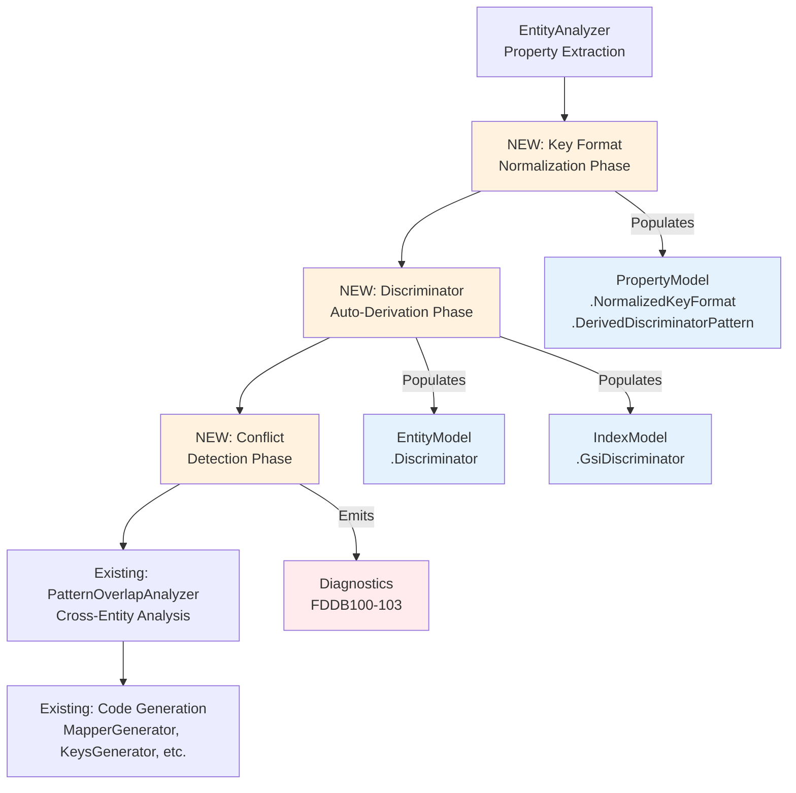
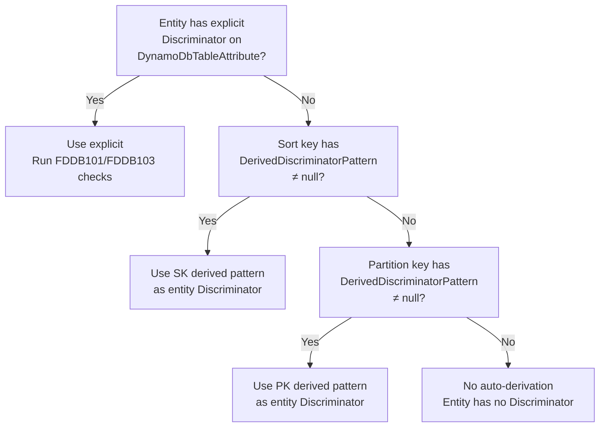

# Design Document: Unify Prefix, Computed Key Format, and Discriminator

## Overview

This feature unifies three overlapping configuration mechanisms — key Prefix, Computed key format, and Discriminator pattern — into a single source of truth based on the normalized format string. The source generator auto-derives discriminator patterns from key formats at compile time, selects the best key property for entity discrimination, populates the derived pattern into the existing `DiscriminatorConfig` infrastructure, and emits compile-time diagnostics (FDDB100–FDDB103) when definitions conflict.

**Core insight**: The key format string already describes the shape of a key value (e.g., `"ORDER#{0}"`). By replacing placeholders with `*`, we get the discriminator pattern (`"ORDER#*"`) for free. This eliminates the need for developers to manually specify `DiscriminatorPattern` in most cases, prevents drift between key definitions and discriminator logic, and unifies the code paths that assemble keys, filter entities, and query indexes.

### Dependency

This feature depends on the completed **Computed Field Format Normalization** feature, which already:
- Normalizes `Separator`/`Prefix`/`PrefixSeparator` into a single `Format` string in `ComputedFieldMetadata`
- Provides `MapperGenerator.ComputeFormatString(computedKey, keyFormat)` for computed keys
- Ensures all runtime paths (Put, Update, Keys) use `string.Format(format, values)`

This feature **extends** format normalization to non-computed keys and adds the discriminator derivation layer on top.

### Before/After Comparison

```
BEFORE: User writes three things that must agree manually

  [PartitionKey(Prefix = "ORDER")]
  [Computed("CustomerId", "OrderId", Separator = "#")]
  [GsiPartitionKey("gsi1", DiscriminatorProperty = "sk", DiscriminatorPattern = "ORDER#*")]

AFTER: User writes the key definition; generator derives the rest

  [PartitionKey(Prefix = "ORDER")]
  [Computed("CustomerId", "OrderId", Separator = "#")]
  [GsiPartitionKey("gsi1")]
  // Generator derives: format = "ORDER#{0}#{1}", discriminator = "ORDER#*#*"
```

## Architecture

The feature adds a new analysis phase in `EntityAnalyzer` that runs after property extraction but before code generation. This phase computes normalized key formats for non-computed keys, derives discriminator patterns from all key formats, and populates the existing `DiscriminatorConfig` and `IndexModel.GsiDiscriminator` structures.



### Design Decisions

1. **Single analysis pass**: All format normalization, discriminator derivation, and conflict detection run in one pass inside `EntityAnalyzer.AnalyzeEntity()`, before the entity model is passed to any generator. This ensures every downstream consumer sees consistent, fully-computed metadata.

2. **SK-preferred discrimination**: When both PK and SK have non-trivial patterns, the sort key is preferred for discrimination because sort keys typically carry entity-type semantics in single-table designs (e.g., `"ORDER#..."` vs `"LINE#..."`).

3. **Reuse existing infrastructure**: The derived discriminator populates the same `DiscriminatorConfig` and uses the same `DiscriminatorStrategy` enum, `PatternOverlapAnalyzer`, and `DiscriminatorCodeGenerator` that already handle explicit discriminators. No new code generation path is needed.

4. **Auto-derived flag**: A new `IsAutoDerived` property on `DiscriminatorConfig` distinguishes auto-derived discriminators from explicit ones. This allows FDDB102 to only warn about auto-derived pairs and FDDB103 to detect redundancy.

5. **Non-computed key normalization**: For keys without `[Computed]`, the format is derived directly from `KeyFormatModel.Prefix` + `KeyFormatModel.Separator`. This uses the same pattern as `ComputeFormatString` but without multiple source properties.

## Components and Interfaces

### 1. PropertyModel Extensions

**File**: `Oproto.FluentDynamoDb.SourceGenerator/Models/PropertyModel.cs`

Two new properties added to `PropertyModel`:

```csharp
/// <summary>
/// Gets or sets the normalized key format string for this key property.
/// Populated by EntityAnalyzer for partition keys and sort keys.
/// For computed keys: uses the format computed by ComputeFormatString.
/// For non-computed keys with prefix: "{Prefix}{Separator}{0}".
/// For non-computed keys without prefix: "{0}".
/// Null for non-key properties.
/// </summary>
public string? NormalizedKeyFormat { get; set; }

/// <summary>
/// Gets or sets the discriminator pattern derived from NormalizedKeyFormat.
/// Computed by replacing each {N} placeholder with *.
/// Null when NormalizedKeyFormat is "{0}" (no discrimination capability)
/// or when the property is not a key property.
/// </summary>
public string? DerivedDiscriminatorPattern { get; set; }
```

### 2. DiscriminatorConfig Extension

**File**: `Oproto.FluentDynamoDb.SourceGenerator/Models/DiscriminatorConfig.cs`

One new property:

```csharp
/// <summary>
/// Gets or sets whether this discriminator was auto-derived from the key format
/// rather than explicitly specified by the developer.
/// Used by FDDB102 (only warn about auto-derived pairs) and FDDB103 (redundancy detection).
/// </summary>
public bool IsAutoDerived { get; set; }
```

### 3. Key Format Normalization Logic (New)

**File**: `Oproto.FluentDynamoDb.SourceGenerator/Analysis/EntityAnalyzer.cs` (new private method)

```csharp
/// <summary>
/// Computes the normalized key format for a non-computed key property.
/// For computed keys, defers to MapperGenerator.ComputeFormatString.
/// </summary>
private static string ComputeNonComputedKeyFormat(KeyFormatModel? keyFormat)
{
    if (keyFormat == null || string.IsNullOrEmpty(keyFormat.Prefix))
        return "{0}";
    
    return $"{keyFormat.Prefix}{keyFormat.Separator}{{0}}";
}
```

### 4. Discriminator Pattern Derivation Logic (New)

**File**: `Oproto.FluentDynamoDb.SourceGenerator/Analysis/EntityAnalyzer.cs` (new private method)

```csharp
/// <summary>
/// Derives a discriminator pattern from a normalized key format by replacing
/// each {N} placeholder with *.
/// Returns null if the resulting pattern is just "*" (no discrimination capability).
/// </summary>
internal static string? DeriveDiscriminatorPattern(string normalizedKeyFormat)
{
    // Replace all {N} placeholders with *
    var pattern = Regex.Replace(normalizedKeyFormat, @"\{\d+\}", "*");
    
    // A pattern of just "*" provides no discrimination
    return pattern == "*" ? null : pattern;
}
```

### 5. Discriminator Selection Algorithm (New)

**File**: `Oproto.FluentDynamoDb.SourceGenerator/Analysis/EntityAnalyzer.cs` (new private method)

Called after all properties have their `NormalizedKeyFormat` and `DerivedDiscriminatorPattern` populated:

```csharp
/// <summary>
/// Selects the best key property for entity discrimination and populates
/// EntityModel.Discriminator with an auto-derived DiscriminatorConfig.
/// Priority: Sort key > Partition key. Skips if pattern is null ("*").
/// Does not override existing explicit discriminators.
/// </summary>
private void ApplyAutoDerivedDiscriminator(EntityModel entity)
{
    // Don't override explicit discriminators
    if (entity.Discriminator != null && entity.Discriminator.IsValid)
        return;
    
    // Try sort key first (preferred for single-table designs)
    var skProperty = entity.SortKeyProperty;
    if (skProperty?.DerivedDiscriminatorPattern != null)
    {
        entity.Discriminator = CreateAutoDerivedDiscriminatorConfig(
            skProperty.AttributeName,
            skProperty.DerivedDiscriminatorPattern);
        return;
    }
    
    // Fall back to partition key
    var pkProperty = entity.PartitionKeyProperty;
    if (pkProperty?.DerivedDiscriminatorPattern != null)
    {
        entity.Discriminator = CreateAutoDerivedDiscriminatorConfig(
            pkProperty.AttributeName,
            pkProperty.DerivedDiscriminatorPattern);
    }
}

private static DiscriminatorConfig CreateAutoDerivedDiscriminatorConfig(
    string attributeName, string pattern)
{
    return new DiscriminatorConfig
    {
        PropertyName = attributeName,
        Pattern = pattern,
        Strategy = DiscriminatorAnalyzer.DeterminePatternStrategy(pattern),
        IsAutoDerived = true
    };
}
```

### 6. GSI Discriminator Auto-Derivation (New)

**File**: `Oproto.FluentDynamoDb.SourceGenerator/Analysis/EntityAnalyzer.cs` (enhancement to `ExtractIndexes`)

After building `IndexModel` objects, for each GSI without an explicit `GsiDiscriminator`:

```csharp
/// <summary>
/// Populates GsiDiscriminator on IndexModel from the GSI partition key property's
/// derived discriminator pattern, when no explicit GSI discriminator is configured.
/// </summary>
private void ApplyAutoDerivedGsiDiscriminator(EntityModel entity)
{
    foreach (var index in entity.Indexes.Where(i => i.IsGsi && i.GsiDiscriminator == null))
    {
        var gsiPkProperty = entity.Properties
            .FirstOrDefault(p => p.GsiPartitionKeys.Any(g => g.IndexName == index.IndexName));
        
        if (gsiPkProperty?.DerivedDiscriminatorPattern != null)
        {
            index.GsiDiscriminator = new DiscriminatorConfig
            {
                PropertyName = gsiPkProperty.AttributeName,
                Pattern = gsiPkProperty.DerivedDiscriminatorPattern,
                Strategy = DiscriminatorAnalyzer.DeterminePatternStrategy(
                    gsiPkProperty.DerivedDiscriminatorPattern),
                IsAutoDerived = true
            };
        }
    }
}
```

### 7. Conflict Detection — FDDB100 (Prefix vs Format)

**File**: `Oproto.FluentDynamoDb.SourceGenerator/Analysis/EntityAnalyzer.cs` (new validation method)

```csharp
/// <summary>
/// Validates that an explicit ComputedAttribute.Format doesn't conflict with the
/// key attribute's Prefix. Emits FDDB100 if the format doesn't start with the
/// expected prefix+separator.
/// </summary>
private void ValidatePrefixFormatConsistency(PropertyModel property)
{
    if (property.KeyFormat == null || string.IsNullOrEmpty(property.KeyFormat.Prefix))
        return;
    if (property.ComputedKey == null || !property.ComputedKey.HasCustomFormat)
        return;
    
    var expectedStart = $"{property.KeyFormat.Prefix}{property.KeyFormat.Separator}";
    if (!property.ComputedKey.Format!.StartsWith(expectedStart, StringComparison.Ordinal))
    {
        ReportDiagnostic(
            DiagnosticDescriptors.PrefixFormatConflict,
            property.PropertyDeclaration?.GetLocation(),
            property.PropertyName,
            property.KeyFormat.Prefix,
            expectedStart,
            property.ComputedKey.Format);
    }
}
```

### 8. Conflict Detection — FDDB101 (Discriminator vs Derived)

**File**: `Oproto.FluentDynamoDb.SourceGenerator/Analysis/EntityAnalyzer.cs` (new validation method)

```csharp
/// <summary>
/// Validates that an explicit DiscriminatorPattern on DynamoDbTableAttribute
/// matches the auto-derived pattern for the referenced key property.
/// Emits FDDB101 if they differ and the derived pattern is not "*".
/// </summary>
private void ValidateExplicitVsDerivedDiscriminator(EntityModel entity)
{
    if (entity.Discriminator == null || entity.Discriminator.IsAutoDerived)
        return;
    
    var explicitProperty = entity.Discriminator.PropertyName;
    var explicitPattern = entity.Discriminator.Pattern;
    
    if (string.IsNullOrEmpty(explicitPattern))
        return; // ExactValue discriminators don't conflict
    
    // Find the key property matching the discriminator property name
    var matchingKey = entity.Properties.FirstOrDefault(p =>
        (p.IsPartitionKey || p.IsSortKey) &&
        string.Equals(p.AttributeName, explicitProperty, StringComparison.Ordinal));
    
    if (matchingKey?.DerivedDiscriminatorPattern == null)
        return; // Derived is "*" — explicit supplements rather than contradicts
    
    if (!string.Equals(explicitPattern, matchingKey.DerivedDiscriminatorPattern, StringComparison.Ordinal))
    {
        ReportDiagnostic(
            DiagnosticDescriptors.DiscriminatorKeyFormatConflict,
            entity.TypeDeclaration?.GetLocation(),
            entity.ClassName,
            explicitProperty,
            explicitPattern,
            matchingKey.DerivedDiscriminatorPattern);
    }
}
```

### 9. FDDB102 — Overlapping Auto-Derived Patterns

**File**: `Oproto.FluentDynamoDb.SourceGenerator/Analysis/PatternOverlapAnalyzer.cs` (enhancement)

The existing `PatternOverlapAnalyzer.Analyze()` method already detects overlapping patterns and assigns exclusion guards. The enhancement adds a new diagnostic for auto-derived pairs with different specificity:

```csharp
// Inside the pair comparison loop, after detecting overlap:
if (overlap && scoreA != scoreB &&
    entityA.Discriminator!.IsAutoDerived && entityB.Discriminator!.IsAutoDerived)
{
    diagnostics.Add(Diagnostic.Create(
        DiagnosticDescriptors.OverlappingAutoDerivedPatterns,
        lessSpecificEntity.TypeDeclaration?.GetLocation(),
        lessSpecificEntity.ClassName,
        moreSpecificEntity.ClassName,
        GetDisplayPattern(lessSpecificConfig),
        GetDisplayPattern(moreSpecificConfig),
        disc.PropertyName));
}
```

The existing exclusion guard logic continues to work — FDDB102 is advisory and doesn't prevent code generation.

### 10. FDDB103 — Redundant Explicit Discriminator

**File**: `Oproto.FluentDynamoDb.SourceGenerator/Analysis/EntityAnalyzer.cs` (new validation method)

```csharp
/// <summary>
/// Detects when an explicit DiscriminatorPattern is redundant because it exactly
/// matches the auto-derived pattern from the referenced key property.
/// Emits FDDB103 Info diagnostic.
/// </summary>
private void DetectRedundantExplicitDiscriminator(EntityModel entity)
{
    if (entity.Discriminator == null || entity.Discriminator.IsAutoDerived)
        return;
    if (entity.Discriminator.Strategy == DiscriminatorStrategy.ExactMatch)
        return; // DiscriminatorValue doesn't get redundancy check
    
    var explicitProperty = entity.Discriminator.PropertyName;
    var explicitPattern = entity.Discriminator.Pattern;
    
    var matchingKey = entity.Properties.FirstOrDefault(p =>
        (p.IsPartitionKey || p.IsSortKey) &&
        string.Equals(p.AttributeName, explicitProperty, StringComparison.Ordinal));
    
    if (matchingKey?.DerivedDiscriminatorPattern != null &&
        string.Equals(explicitPattern, matchingKey.DerivedDiscriminatorPattern, StringComparison.Ordinal))
    {
        ReportDiagnostic(
            DiagnosticDescriptors.RedundantExplicitDiscriminator,
            entity.TypeDeclaration?.GetLocation(),
            entity.ClassName,
            explicitPattern);
    }
}
```

### 11. Diagnostic Descriptors (New)

**File**: `Oproto.FluentDynamoDb.SourceGenerator/Diagnostics/DiagnosticDescriptors.cs`

```csharp
public static readonly DiagnosticDescriptor PrefixFormatConflict = new(
    "FDDB100",
    "Key prefix conflicts with explicit computed format",
    "Property '{0}' has Prefix='{1}' (expecting format to start with '{2}') but ComputedAttribute.Format='{3}' does not match",
    "DynamoDb",
    DiagnosticSeverity.Error,
    isEnabledByDefault: true);

public static readonly DiagnosticDescriptor DiscriminatorKeyFormatConflict = new(
    "FDDB101",
    "Explicit discriminator pattern conflicts with key format",
    "Entity '{0}' specifies DiscriminatorPattern on attribute '{1}' as '{2}' but the key format derives pattern '{3}'",
    "DynamoDb",
    DiagnosticSeverity.Error,
    isEnabledByDefault: true);

public static readonly DiagnosticDescriptor OverlappingAutoDerivedPatterns = new(
    "FDDB102",
    "Overlapping auto-derived discriminator patterns",
    "Entities '{0}' and '{1}' have overlapping auto-derived patterns '{2}' and '{3}' on attribute '{4}' — consider adding more specificity to key formats",
    "DynamoDb",
    DiagnosticSeverity.Warning,
    isEnabledByDefault: true);

public static readonly DiagnosticDescriptor RedundantExplicitDiscriminator = new(
    "FDDB103",
    "Redundant explicit discriminator pattern",
    "Entity '{0}' specifies DiscriminatorPattern='{1}' which is automatically derivable from the key format — the explicit specification can be removed",
    "DynamoDb",
    DiagnosticSeverity.Info,
    isEnabledByDefault: true);
```

### 12. Analysis Pass Ordering in EntityAnalyzer

The new logic is inserted into `EntityAnalyzer.AnalyzeEntity()` after `ExtractProperties` and `ValidateEntityModel` but before returning the entity model:

```csharp
public EntityModel? AnalyzeEntity(TypeDeclarationSyntax typeDecl, SemanticModel semanticModel)
{
    // ... existing extraction code ...
    
    ExtractProperties(typeDecl, semanticModel, entityModel);
    ExtractIndexes(entityModel);
    ExtractRelationships(typeDecl, semanticModel, entityModel);
    
    // === NEW: Unified Key Format & Discriminator Analysis ===
    ComputeNormalizedKeyFormats(entityModel);        // Step 1: Populate NormalizedKeyFormat
    DeriveDiscriminatorPatterns(entityModel);         // Step 2: Populate DerivedDiscriminatorPattern
    ValidatePrefixFormatConsistency(entityModel);     // Step 3: FDDB100
    ApplyAutoDerivedDiscriminator(entityModel);       // Step 4: Set entity.Discriminator
    ApplyAutoDerivedGsiDiscriminator(entityModel);    // Step 5: Set index.GsiDiscriminator
    ValidateExplicitVsDerivedDiscriminator(entityModel); // Step 6: FDDB101
    DetectRedundantExplicitDiscriminator(entityModel);   // Step 7: FDDB103
    // === END NEW ===
    
    ValidateEntityModel(entityModel);
    ValidateComputedAndExtractedKeys(entityModel);
    
    return entityModel;
}
```

Note: FDDB102 is emitted by `PatternOverlapAnalyzer` which runs cross-entity (at the table group level in `DynamoDbSourceGenerator`), not inside `EntityAnalyzer`.

### 13. MatchesEntity Generation (No Changes Needed)

The existing `MapperGenerator.GenerateMatchesEntityMethod` already handles:
- Entities with valid `DiscriminatorConfig` → generates discriminator check
- Single-entity tables without discriminator → minimal key presence check
- Multi-entity tables without discriminator → key presence check

Since auto-derivation populates the same `EntityModel.Discriminator` property, the existing code generation works without modification. The `IsAutoDerived` flag is only used for diagnostic decisions, not code generation.

## Data Models

### PropertyModel Additions

| Property | Type | Default | Description |
|----------|------|---------|-------------|
| `NormalizedKeyFormat` | `string?` | `null` | Full normalized format for key value assembly. Set for PK/SK properties only. |
| `DerivedDiscriminatorPattern` | `string?` | `null` | Pattern with `*` wildcards. Null when format is `"{0}"` (trivial). |

### DiscriminatorConfig Addition

| Property | Type | Default | Description |
|----------|------|---------|-------------|
| `IsAutoDerived` | `bool` | `false` | True when discriminator was derived from key format, not explicitly specified. |

### Format Derivation Rules (Non-Computed Keys)

| Key Configuration | NormalizedKeyFormat | DerivedDiscriminatorPattern |
|---|---|---|
| `[PartitionKey(Prefix = "ORDER")]` | `"ORDER#{0}"` | `"ORDER#*"` |
| `[SortKey(Prefix = "LINE")]` | `"LINE#{0}"` | `"LINE#*"` |
| `[PartitionKey(Prefix = "USER", Separator = "_")]` | `"USER_{0}"` | `"USER_*"` |
| `[PartitionKey(Prefix = "A", Separator = "")]` | `"A{0}"` | `"A*"` |
| `[PartitionKey]` (no prefix) | `"{0}"` | `null` |
| `[SortKey]` (no prefix) | `"{0}"` | `null` |

### Format Derivation Rules (Computed Keys)

Uses existing `MapperGenerator.ComputeFormatString(computedKey, keyFormat)`:

| Key Configuration | NormalizedKeyFormat | DerivedDiscriminatorPattern |
|---|---|---|
| `[Computed("A", "B", Separator = "#")]` + no prefix | `"{0}#{1}"` | `null` (just `"*#*"` → no useful discrimination)* |
| `[Computed("A", "B", Separator = "#")]` + `Prefix = "TENANT"` | `"TENANT#{0}#{1}"` | `"TENANT#*#*"` |
| `[Computed("A", "B", Format = "META#{0}#{1}")]` | `"META#{0}#{1}"` | `"META#*#*"` |
| `[Computed("A", "B", Format = "TENANT#{0}#USER#{1}#")]` | `"TENANT#{0}#USER#{1}#"` | `"TENANT#*#USER#*#"` |

*Note: `"*#*"` starts with `*` — the `DeterminePatternStrategy` would classify it as Complex rather than StartsWith. However, since it starts with a wildcard and provides no useful fixed prefix, we treat it equivalently to `"*"` and set `DerivedDiscriminatorPattern = null`.

### Discriminator Selection Priority



### Diagnostic Decision Matrix

| Scenario | Diagnostic | Severity | Prevents Generation? |
|---|---|---|---|
| Prefix on key + explicit Format that doesn't start with prefix | FDDB100 | Error | Yes |
| Explicit DiscriminatorPattern ≠ derived pattern on same attribute | FDDB101 | Error | Yes |
| Two auto-derived patterns overlap with different specificity | FDDB102 | Warning | No (exclusion guards added) |
| Explicit DiscriminatorPattern == derived pattern (redundant) | FDDB103 | Info | No |

## Correctness Properties

*A property is a characteristic or behavior that should hold true across all valid executions of a system — essentially, a formal statement about what the system should do. Properties serve as the bridge between human-readable specifications and machine-verifiable correctness guarantees.*

### Property 1: Non-Computed Key Format Derivation

*For any* non-empty prefix string and *for any* separator string (including empty string), the normalized key format derived for a non-computed key property SHALL equal `"{prefix}{separator}{0}"`, and `string.Format(derivedFormat, value)` SHALL equal `prefix + separator + value` for any value string.

**Validates: Requirements 1.1, 1.2, 1.5**

### Property 2: Discriminator Pattern Derivation from Format

*For any* normalized key format string containing N placeholders `{0}` through `{N-1}` interleaved with arbitrary literal segments, the derived discriminator pattern SHALL be identical to the format string with every `{N}` placeholder replaced by `*`, preserving all literal text unchanged.

**Validates: Requirements 2.1, 2.2, 2.3, 2.4**

### Property 3: Discriminator Selection Priority

*For any* multi-entity table entity without an explicit `DiscriminatorProperty` on `DynamoDbTableAttribute`, when the sort key has a `DerivedDiscriminatorPattern` that is not null, the entity's auto-derived `Discriminator.PropertyName` SHALL equal the sort key's `DynamoDbAttribute` name and `Discriminator.Pattern` SHALL equal the sort key's `DerivedDiscriminatorPattern`.

**Validates: Requirements 2.6, 2.8, 2.9**

### Property 4: FDDB100 Conflict Detection

*For any* key property with a non-empty Prefix and a ComputedAttribute with a non-null explicit Format, the source generator SHALL emit FDDB100 if and only if the Format string does not start with `"{Prefix}{Separator}"` using ordinal string comparison.

**Validates: Requirements 3.1, 3.4, 3.5, 3.6, 3.7**

### Property 5: FDDB101 Conflict Detection

*For any* entity with an explicit `DiscriminatorPattern` on `DynamoDbTableAttribute` where `DiscriminatorProperty` matches a key property's `DynamoDbAttribute` name and that key property's `DerivedDiscriminatorPattern` is not null, the source generator SHALL emit FDDB101 if and only if the explicit pattern differs (case-sensitive string comparison) from the derived pattern.

**Validates: Requirements 4.1, 4.4, 4.5**

### Property 6: FDDB103 Redundancy Detection

*For any* entity with an explicit `DiscriminatorPattern` (not `DiscriminatorValue`) on `DynamoDbTableAttribute` where `DiscriminatorProperty` matches a key property's `DynamoDbAttribute` name, the source generator SHALL emit FDDB103 if and only if the explicit pattern is a case-sensitive exact string match to that key property's `DerivedDiscriminatorPattern`.

**Validates: Requirements 6.1, 6.4, 6.6**

### Property 7: Backwards Compatibility of Explicit Discriminators

*For any* entity with an explicit `DiscriminatorProperty` and `DiscriminatorPattern` or `DiscriminatorValue` on `DynamoDbTableAttribute`, the generated `MatchesEntity` method SHALL produce identical matching logic to what would have been generated without the auto-derivation feature (the explicit discriminator is used as-is).

**Validates: Requirements 10.5, 10.7**

### Property 8: FDDB102 Emission Constraint

*For any* pair of entities sharing a table with overlapping discriminator patterns of different specificity, the source generator SHALL emit FDDB102 only when **both** patterns are auto-derived (`IsAutoDerived == true`); if either or both patterns are explicit, FDDB102 SHALL NOT be emitted for that pair.

**Validates: Requirements 5.1, 5.6**

### Property 9: GSI Discriminator Auto-Derivation

*For any* GSI partition key property with a `DerivedDiscriminatorPattern` that is not null and no explicit `GsiDiscriminator` configured, the `IndexModel.GsiDiscriminator` SHALL be populated with `PropertyName` equal to the GSI PK property's `DynamoDbAttribute` name and `Pattern` equal to its `DerivedDiscriminatorPattern`.

**Validates: Requirements 9.1, 9.5, 9.6**

### Property 10: NormalizedKeyFormat Population Completeness

*For any* entity analyzed by `EntityAnalyzer`, every property annotated with `[PartitionKey]` or `[SortKey]` SHALL have its `NormalizedKeyFormat` populated (non-null) after analysis completes, regardless of whether the property has a prefix, computed attribute, or neither.

**Validates: Requirements 11.1, 11.4**

## Error Handling

### Compile-Time Diagnostics

| Code | Title | Severity | Trigger | Prevents Generation |
|------|-------|----------|---------|---------------------|
| FDDB100 | Prefix conflicts with format | Error | Key Prefix doesn't match start of explicit ComputedAttribute.Format | Yes |
| FDDB101 | Discriminator vs key format conflict | Error | Explicit DiscriminatorPattern differs from derived pattern on same attribute | Yes |
| FDDB102 | Overlapping auto-derived patterns | Warning | Two auto-derived patterns overlap with different specificity | No (advisory) |
| FDDB103 | Redundant explicit discriminator | Info | Explicit DiscriminatorPattern matches derived pattern exactly | No (advisory) |

### Error Recovery

- **FDDB100/FDDB101**: These are Error severity, so code generation halts for the affected entity. The developer must resolve the conflict before the generator proceeds.
- **FDDB102**: Advisory only. The generator still produces correct exclusion guards. The warning informs the developer their key design may cause ambiguous matching.
- **FDDB103**: Informational. The developer can safely remove the explicit discriminator to simplify their code, or leave it without any correctness impact.

### Runtime Error Scenarios

No new runtime errors are introduced. The auto-derived discriminator feeds into the existing `MatchesEntity` generation which produces the same safe patterns:
- Returns `false` when the discriminator attribute is missing from the item dictionary
- Returns `false` when the discriminator attribute's string value is null
- Uses `StartsWith` / `Contains` checks on non-null strings (no NRE risk)

### Edge Cases

| Scenario | Behavior |
|---|---|
| Entity with no sort key, no partition key prefix | `NormalizedKeyFormat = "{0}"`, `DerivedDiscriminatorPattern = null`, no auto-derived discriminator |
| Multi-entity table where all entities have `DerivedDiscriminatorPattern = null` | No auto-derivation for any entity; MatchesEntity uses key-attribute-only check (existing Tier 3 behavior) |
| Computed key with explicit Format containing no fixed prefix (e.g., `"{0}#{1}"`) | Pattern would be `"*#*"` which starts with wildcard → treated as null (no useful discrimination) |
| Entity with `DiscriminatorValue` (exact match) | Never triggers FDDB101 or FDDB103; auto-derivation doesn't override |
| Explicit DiscriminatorProperty pointing to non-key attribute | Auto-derivation skipped; explicit config used as-is; Key_Format still computed on PropertyModel for use by key builders |

## Testing Strategy

### Property-Based Tests (FsCheck)

The project uses **FsCheck** via `FsCheck.Xunit` with `[Property(MaxTest = 100)]`.

**Configuration**:
- Minimum 100 iterations per property test
- Each property test tagged with: `Feature: unify-prefix-computed-discriminator, Property {N}: {description}`

**Test targets**:

| Property | Test Location | What's Under Test |
|---|---|---|
| 1 | `SourceGenerator/KeyFormatNormalizationPropertyTests.cs` | `ComputeNonComputedKeyFormat` helper |
| 2 | `SourceGenerator/DiscriminatorDerivationPropertyTests.cs` | `DeriveDiscriminatorPattern` helper |
| 3 | `SourceGenerator/DiscriminatorSelectionPropertyTests.cs` | `ApplyAutoDerivedDiscriminator` logic |
| 4 | `SourceGenerator/FDDB100ConflictPropertyTests.cs` | `ValidatePrefixFormatConsistency` |
| 5 | `SourceGenerator/FDDB101ConflictPropertyTests.cs` | `ValidateExplicitVsDerivedDiscriminator` |
| 6 | `SourceGenerator/FDDB103RedundancyPropertyTests.cs` | `DetectRedundantExplicitDiscriminator` |
| 7 | `SourceGenerator/BackwardsCompatibilityPropertyTests.cs` | MatchesEntity output comparison |
| 8 | `Analysis/FDDB102OverlapPropertyTests.cs` | `PatternOverlapAnalyzer` with IsAutoDerived flag |
| 9 | `SourceGenerator/GsiDiscriminatorDerivationPropertyTests.cs` | `ApplyAutoDerivedGsiDiscriminator` |
| 10 | `SourceGenerator/KeyFormatPopulationPropertyTests.cs` | EntityAnalyzer analysis completeness |

### Unit Tests (xUnit + FluentAssertions)

| Test | Purpose |
|---|---|
| `NonComputedKey_WithPrefix_ProducesCorrectFormat` | Concrete examples of format derivation |
| `NonComputedKey_NoPrefix_ProducesIdentityFormat` | Verify `"{0}"` for no-prefix keys |
| `DeriveDiscriminatorPattern_Examples` | Verify derivation for canonical examples from requirements |
| `DeriveDiscriminatorPattern_TrivialFormat_ReturnsNull` | Verify `"{0}"` → null |
| `FDDB100_PrefixConflictsWithFormat_EmitsError` | Verify diagnostic emission |
| `FDDB100_PrefixMatchesFormat_NoDiagnostic` | Verify no false positive |
| `FDDB101_ExplicitVsDerived_Mismatch_EmitsError` | Verify conflict detection |
| `FDDB101_DerivedIsStar_NoDiagnostic` | Verify no diagnostic when derived is null |
| `FDDB102_AutoDerivedOverlap_EmitsWarning` | Verify overlap warning |
| `FDDB102_ExplicitOverlap_NoDiagnostic` | Verify no FDDB102 for explicit patterns |
| `FDDB103_RedundantExplicit_EmitsInfo` | Verify redundancy info |
| `FDDB103_DiscriminatorValue_NoDiagnostic` | Verify no FDDB103 for exact match |
| `SelectionPriority_SKPreferred_WhenBothHavePatterns` | Verify SK wins |
| `SelectionPriority_FallsToPK_WhenSKIsTrivial` | Verify PK fallback |
| `ExplicitDiscriminator_NotOverridden_ByAutoDerived` | Verify explicit takes precedence |
| `GsiDiscriminator_AutoDerived_WhenPKHasPattern` | Verify GSI derivation |
| `GsiDiscriminator_NotPopulated_WhenPatternIsTrivial` | Verify no GSI discriminator for "{0}" |
| `SingleEntityTable_DerivePattern_NoMatchesEntityChange` | Verify single-entity behavior unchanged |
| `MultiEntityTable_AutoDerived_GeneratesCorrectMatchesEntity` | End-to-end generation |

### Integration Tests

| Test | Purpose |
|---|---|
| `ExistingEntitiesWithExplicitDiscriminator_SameOutput` | Upgrade path: existing projects compile with same behavior |
| `NewEntity_WithPrefixOnly_AutoDerives_CorrectMatchesEntity` | New simplified entity definition works correctly |
| `MultiEntityTable_OverlappingPatterns_ExclusionGuards` | Overlapping patterns produce correct mutual exclusion |

### Test Organization

```
Oproto.FluentDynamoDb.SourceGenerator.UnitTests/
  Analysis/
    FDDB102OverlapPropertyTests.cs
  SourceGenerator/
    KeyFormatNormalizationPropertyTests.cs
    DiscriminatorDerivationPropertyTests.cs
    DiscriminatorSelectionPropertyTests.cs
    FDDB100ConflictPropertyTests.cs
    FDDB101ConflictPropertyTests.cs
    FDDB103RedundancyPropertyTests.cs
    BackwardsCompatibilityPropertyTests.cs
    GsiDiscriminatorDerivationPropertyTests.cs
    KeyFormatPopulationPropertyTests.cs
  Diagnostics/
    UnifyDiscriminatorDiagnosticsTests.cs
  Generators/
    MatchesEntityAutoDerivedGenerationTests.cs
```
