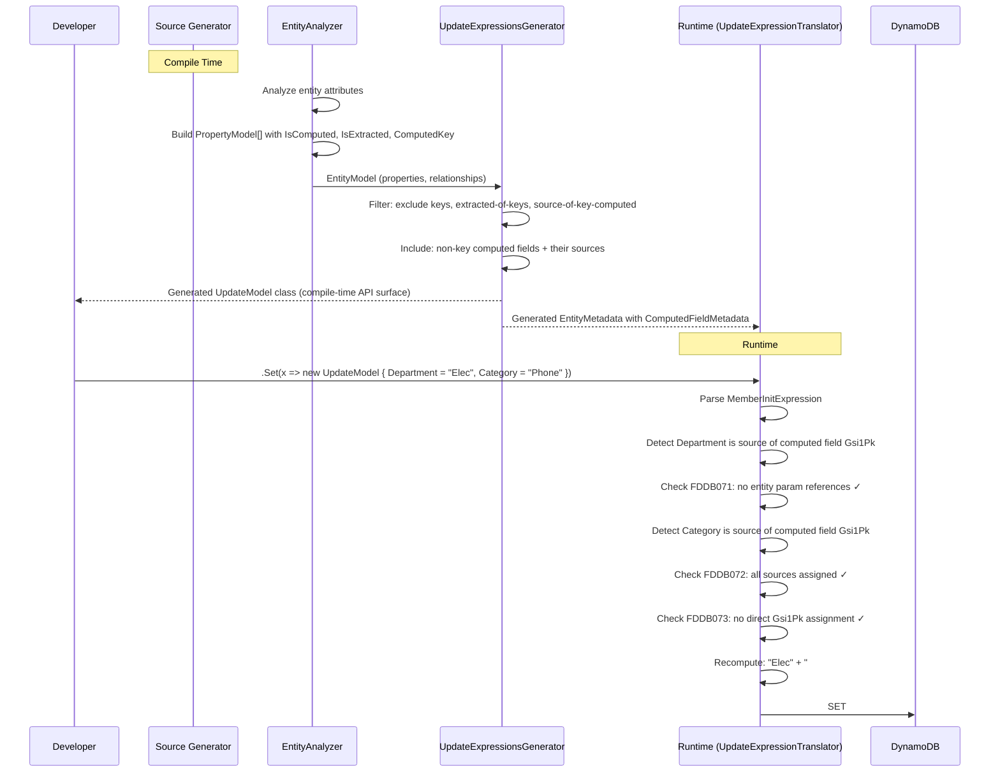

# Design Document: Update Model Computed Field Redesign

## Overview

This design describes the changes needed to the Oproto.FluentDynamoDb source generator and runtime expression translator to:

1. **Exclude non-updatable properties** (keys, extracted properties of keys) from generated update models — converting runtime `InvalidUpdateOperationException` errors into compile-time errors.
2. **Support source-property-based updates** for non-key computed fields, with automatic recomputation of the concatenated value.
3. **Introduce three new diagnostics** (FDDB071, FDDB072, FDDB073) that enforce correctness constraints on computed field updates at expression-translation time.

The changes span two projects:
- **Source Generator** (`Oproto.FluentDynamoDb.SourceGenerator`): Modifies `UpdateExpressionsGenerator` to filter properties and enriches runtime metadata.
- **Runtime Library** (`Oproto.FluentDynamoDb`): Enhances `UpdateExpressionTranslator` with computed field detection, validation, and recomputation logic.

## Architecture

The update model lifecycle has three stages, each modified by this feature:

```mermaid
flowchart TD
    subgraph "Compile Time (Source Generator)"
        A[EntityAnalyzer] -->|PropertyModel[]| B[UpdateExpressionsGenerator]
        B -->|generates| C["{Entity}UpdateModel class"]
        B -->|generates| D["{Entity}UpdateExpressions class"]
        A -->|generates| E["EntityMetadata (runtime)"]
    end

    subgraph "Runtime (Expression Translation)"
        F["User writes .Set(x => new UpdateModel {...})"] --> G[UpdateExpressionTranslator]
        G -->|reads| E
        G -->|validates computed fields| H{Validation}
        H -->|pass| I["DynamoDB SET/REMOVE/ADD expression"]
        H -->|fail| J["InvalidOperationException with FDDB07x message"]
    end
```

### Design Decision: Runtime vs Compile-Time Diagnostics

The diagnostics FDDB071/072/073 are **runtime diagnostics** thrown as `InvalidOperationException` from `UpdateExpressionTranslator`. This is consistent with the existing pattern for `InvalidUpdateOperationException` (key property validation) because:

- The expression translator operates on expression trees at runtime, not during source generation.
- Source generator diagnostics (Roslyn `DiagnosticDescriptor`) require walking the user's lambda expression AST at compile time — beyond the scope of the current source generator architecture which only generates types.
- The existing `ValidateNotKeyProperty` uses the same pattern (throw with descriptive message).

**Rationale**: While "compile-time diagnostic" is used colloquially in the requirements, the practical meaning is "fails immediately when the expression is translated, before reaching DynamoDB" — which is the developer's build/test cycle, not the production runtime path.

### Design Decision: FDDB Code Namespace

The existing `DiagnosticDescriptors.cs` already uses FDDB070 and FDDB072 for index projection warnings (compile-time Roslyn diagnostics). The new FDDB071/072/073 are runtime diagnostic codes embedded in exception messages — they occupy a different layer (expression translator exceptions vs source generator diagnostics). This overlap is acceptable because:

- Source generator diagnostics surface as yellow/red squiggles in the IDE during compilation.
- Expression translator diagnostics surface as `InvalidOperationException` during test execution.
- They are never confused in practice because the contexts are entirely different.
- The requirements document explicitly specifies these codes, so we preserve them as stated.

## Components and Interfaces

### 1. Source Generator: UpdateExpressionsGenerator Modifications

**File**: `Oproto.FluentDynamoDb.SourceGenerator/Generators/UpdateExpressionsGenerator.cs`

#### Modified: `GenerateUpdateModelClass(EntityModel entity)`

Current behavior: Iterates all properties with `HasAttributeMapping` and generates a nullable property for each.

New behavior: Applies exclusion and inclusion logic before generating properties.

```csharp
// Pseudocode for the new property filtering logic
foreach (var property in entity.Properties.Where(p => p.HasAttributeMapping))
{
    // EXCLUSION: Skip key properties (Req 1)
    if (property.IsPartitionKey || property.IsSortKey)
        continue;

    // EXCLUSION: Skip extracted properties whose source is a key (Req 2)
    if (property.IsExtracted && IsExtractedFromKeyProperty(property, entity))
        continue;

    // EXCLUSION: Skip source properties of key-based computed fields (Req 3.5)
    if (IsSourcePropertyOfKeyComputed(property, entity))
        continue;

    // EXCLUSION: Skip extracted properties of key-based computed fields (Req 3.5)
    if (IsExtractedPropertyOfKeyComputed(property, entity))
        continue;

    GenerateUpdateModelProperty(sb, property, entity);
}

// INCLUSION: Add source properties of non-key computed fields (Req 3.2)
// These may not have HasAttributeMapping (they're virtual properties)
foreach (var computedProp in GetNonKeyComputedProperties(entity))
{
    foreach (var sourcePropName in computedProp.ComputedKey.SourceProperties)
    {
        var sourceProp = entity.Properties.FirstOrDefault(p => p.PropertyName == sourcePropName);
        if (sourceProp != null && !alreadyGenerated.Contains(sourcePropName))
        {
            GenerateUpdateModelProperty(sb, sourceProp, entity);
            alreadyGenerated.Add(sourcePropName);
        }
    }
}
```

#### New Helper Methods

```csharp
private static bool IsExtractedFromKeyProperty(PropertyModel property, EntityModel entity)
{
    if (property.ExtractedKey == null) return false;
    var sourceProperty = entity.Properties
        .FirstOrDefault(p => p.PropertyName == property.ExtractedKey.SourceProperty);
    return sourceProperty != null && (sourceProperty.IsPartitionKey || sourceProperty.IsSortKey);
}

private static bool IsSourcePropertyOfKeyComputed(PropertyModel property, EntityModel entity)
{
    // A property is a source of a key-based computed field if:
    // 1. There exists a computed property that is a key (PK or SK)
    // 2. That computed property lists this property's name in its SourceProperties
    return entity.Properties.Any(p =>
        p.IsComputed &&
        (p.IsPartitionKey || p.IsSortKey) &&
        p.ComputedKey!.SourceProperties.Contains(property.PropertyName));
}

private static bool IsExtractedPropertyOfKeyComputed(PropertyModel property, EntityModel entity)
{
    if (property.ExtractedKey == null) return false;
    var sourceProp = entity.Properties
        .FirstOrDefault(p => p.PropertyName == property.ExtractedKey.SourceProperty);
    return sourceProp != null && sourceProp.IsComputed &&
           (sourceProp.IsPartitionKey || sourceProp.IsSortKey);
}

private static IEnumerable<PropertyModel> GetNonKeyComputedProperties(EntityModel entity)
{
    return entity.Properties.Where(p =>
        p.IsComputed && !p.IsPartitionKey && !p.IsSortKey);
}
```

#### Modified: `GenerateUpdateExpressionsClass(EntityModel entity)`

Apply the same filtering to the `{Entity}UpdateExpressions` class so that the `x.PropertyName` parameter matches the model. This ensures:
- No `x.Pk` or `x.Sk` accessors for key properties (already throws at runtime, now compile-time).
- Source properties of non-key computed fields are accessible via `x.SourceProp`.

### 2. Source Generator: Metadata Generation Enhancement

**File**: `Oproto.FluentDynamoDb.SourceGenerator/Generators/MetadataGenerator` (or wherever `EntityMetadata` is emitted)

The runtime `PropertyMetadata` class needs new fields to carry computed field information to the expression translator:

#### New Fields on `PropertyMetadata`

```csharp
// In Oproto.FluentDynamoDb/Metadata/PropertyMetadata.cs
public class PropertyMetadata
{
    // ... existing fields ...

    /// <summary>
    /// If this property is a computed field, contains the computed field metadata.
    /// Null if the property is not computed.
    /// </summary>
    public ComputedFieldMetadata? ComputedField { get; set; }

    /// <summary>
    /// If this property is a source property of a computed field,
    /// contains the name of the target computed property.
    /// Null if the property is not a source of any computed field.
    /// </summary>
    public string? ComputedFieldTarget { get; set; }

    /// <summary>
    /// If this property is an extracted property targeting a computed field,
    /// contains the computed field name and the positional index.
    /// Null if the property is not extracted.
    /// </summary>
    public ExtractedFieldMetadata? ExtractedField { get; set; }
}
```

#### New Metadata Classes

```csharp
// In Oproto.FluentDynamoDb/Metadata/ComputedFieldMetadata.cs
public class ComputedFieldMetadata
{
    /// <summary>
    /// Ordered list of source property names that compose this computed field.
    /// </summary>
    public string[] SourceProperties { get; set; } = Array.Empty<string>();

    /// <summary>
    /// Separator used between source values during concatenation.
    /// </summary>
    public string Separator { get; set; } = "#";

    /// <summary>
    /// Optional prefix from [PartitionKey(Prefix = ...)] or [SortKey(Prefix = ...)].
    /// Null if no prefix is configured.
    /// </summary>
    public string? Prefix { get; set; }

    /// <summary>
    /// Separator between prefix and computed value.
    /// </summary>
    public string? PrefixSeparator { get; set; }
}

// In Oproto.FluentDynamoDb/Metadata/ExtractedFieldMetadata.cs
public class ExtractedFieldMetadata
{
    /// <summary>
    /// The property name this extracted property derives from.
    /// </summary>
    public string SourceProperty { get; set; } = string.Empty;

    /// <summary>
    /// The zero-based positional index in the source property's segments.
    /// </summary>
    public int Index { get; set; }
}
```

### 3. Runtime: UpdateExpressionTranslator Enhancement

**File**: `Oproto.FluentDynamoDb/Expressions/UpdateExpressionTranslator.cs`

#### Modified: `TranslateUpdateExpression<TUpdateExpressions, TUpdateModel>(...)`

After processing all bindings, add a post-processing validation and recomputation step:

```csharp
public string TranslateUpdateExpression<TUpdateExpressions, TUpdateModel>(
    Expression<Func<TUpdateExpressions, TUpdateModel>> expression,
    ExpressionContext context)
{
    // ... existing parsing of MemberInitExpression ...

    // NEW: Collect assignments by property name for computed field analysis
    var assignments = new Dictionary<string, (Expression ValueExpr, object? EvaluatedValue)>();

    foreach (var binding in memberInit.Bindings)
    {
        // ... existing handling ...
        // Track assignments for computed field validation
        assignments[propertyName] = (valueExpression, evaluatedValue);
    }

    // NEW: Validate and process computed field assignments
    if (context.EntityMetadata != null)
    {
        ValidateAndProcessComputedFields(assignments, context, parameter,
            setOperations, addOperations, removeOperations, deleteOperations);
    }

    // ... existing expression building ...
}
```

#### New: `ValidateAndProcessComputedFields(...)`

```csharp
private void ValidateAndProcessComputedFields(
    Dictionary<string, (Expression ValueExpr, object? EvaluatedValue)> assignments,
    ExpressionContext context,
    ParameterExpression parameter,
    List<string> setOperations,
    List<string> addOperations,
    List<string> removeOperations,
    List<string> deleteOperations)
{
    var computedProperties = context.EntityMetadata!.Properties
        .Where(p => p.ComputedField != null)
        .ToList();

    foreach (var computedProp in computedProperties)
    {
        var cf = computedProp.ComputedField!;
        var computedFieldName = computedProp.PropertyName;

        // Gather which source/extracted properties are assigned
        var assignedSources = new Dictionary<string, object?>();
        foreach (var sourceName in cf.SourceProperties)
        {
            if (assignments.ContainsKey(sourceName))
                assignedSources[sourceName] = assignments[sourceName].EvaluatedValue;
        }

        // Also check extracted properties targeting this computed field
        var extractedProps = context.EntityMetadata.Properties
            .Where(p => p.ExtractedField?.SourceProperty == computedFieldName);
        foreach (var extracted in extractedProps)
        {
            if (assignments.ContainsKey(extracted.PropertyName))
            {
                // Map extracted property to its corresponding source property by index
                var sourceIndex = extracted.ExtractedField!.Index;
                if (sourceIndex < cf.SourceProperties.Length)
                {
                    var sourceName = cf.SourceProperties[sourceIndex];
                    assignedSources[sourceName] = assignments[extracted.PropertyName].EvaluatedValue;
                }
            }
        }

        bool directlyAssigned = assignments.ContainsKey(computedFieldName);
        bool anySourceAssigned = assignedSources.Count > 0;

        // FDDB073: Mixed direct + source assignment
        if (directlyAssigned && anySourceAssigned)
        {
            throw new InvalidOperationException(
                $"Cannot set both computed field '{computedFieldName}' and its source properties " +
                $"in the same update expression. Use one approach or the other.");
        }

        if (anySourceAssigned)
        {
            // FDDB072: Partial source assignment
            var missingSources = cf.SourceProperties
                .Where(s => !assignedSources.ContainsKey(s))
                .ToList();
            if (missingSources.Count > 0)
            {
                throw new InvalidOperationException(
                    $"All source properties of computed field '{computedFieldName}' must be " +
                    $"specified when updating via sources. Missing: {string.Join(", ", missingSources)}");
            }

            // FDDB071: Entity parameter references (checked during evaluation)
            // Already handled in ClassifyOperation when attempting to evaluate

            // Recompute: concatenate values in order
            var parts = cf.SourceProperties
                .Select(s => assignedSources[s]?.ToString() ?? string.Empty)
                .ToArray();
            var recomputedValue = string.Join(cf.Separator, parts);

            // Apply prefix if configured
            if (!string.IsNullOrEmpty(cf.Prefix))
            {
                var prefixSep = cf.PrefixSeparator ?? cf.Separator;
                recomputedValue = cf.Prefix + prefixSep + recomputedValue;
            }

            // Generate SET for the computed field's DynamoDB attribute
            var attributeName = GetAttributeName(computedFieldName, context);
            var paramName = CaptureValue(recomputedValue, context, computedProp);
            setOperations.Add($"{attributeName} = {paramName}");

            // Remove source property SET operations (they don't have DynamoDB attributes)
            // Source properties were NOT translated to individual SETs — they were intercepted
        }
    }
}
```

#### Modified: Property Classification in Main Loop

Source properties of computed fields must be intercepted before normal SET translation. When processing a binding:

```csharp
// In the foreach(binding) loop:
var propertyName = assignment.Member.Name;

// Check if this is a source/extracted property of a computed field
if (context.EntityMetadata != null && IsComputedSourceProperty(propertyName, context))
{
    // FDDB071: Validate the value does not reference the entity parameter
    if (ReferencesEntityParameter(valueExpression, parameter))
    {
        throw new InvalidOperationException(
            $"Source properties of computed fields must be assigned constant or local values. " +
            $"'{propertyName}' references the entity parameter, but computed fields are evaluated client-side.");
    }

    // Evaluate and store for later recomputation — do NOT generate a SET
    var evaluatedValue = EvaluateExpression(valueExpression);
    pendingComputedAssignments[propertyName] = evaluatedValue;
    continue; // Skip normal operation classification
}
```

### 4. Data Flow Diagram



### 5. Integration Points

| Component | Current State | Modification |
|-----------|--------------|--------------|
| `PropertyModel` (source gen) | Has `IsComputed`, `IsExtracted`, `ComputedKey`, `ExtractedKey` | No change needed — already has all required data |
| `EntityAnalyzer` | Extracts `[Computed]` and `[Extracted]` attributes | No change needed — already populates `ComputedKeyModel` and `ExtractedKeyModel` |
| `UpdateExpressionsGenerator.GenerateUpdateModelClass` | Generates all `HasAttributeMapping` properties | **Modified**: Apply filtering rules |
| `UpdateExpressionsGenerator.GenerateUpdateExpressionsClass` | Generates all `HasAttributeMapping` properties | **Modified**: Apply same filtering rules |
| `PropertyMetadata` (runtime) | Has `IsPartitionKey`, `IsSortKey`, `IsEncrypted`, etc. | **Extended**: Add `ComputedField`, `ComputedFieldTarget`, `ExtractedField` |
| `UpdateExpressionTranslator.TranslateUpdateExpression` | Processes bindings → operations | **Modified**: Intercept computed source props, validate, recompute |
| `EntityMetadata` generation (source gen) | Emits property array with key/type info | **Extended**: Emit `ComputedFieldMetadata` and `ExtractedFieldMetadata` for relevant properties |

## Data Models

### PropertyModel (Source Generator - Existing, No Change)

```csharp
internal class PropertyModel
{
    public string PropertyName { get; set; }
    public string AttributeName { get; set; }
    public string PropertyType { get; set; }
    public bool IsPartitionKey { get; set; }
    public bool IsSortKey { get; set; }
    public ComputedKeyModel? ComputedKey { get; set; }
    public ExtractedKeyModel? ExtractedKey { get; set; }
    public bool IsComputed => ComputedKey != null;
    public bool IsExtracted => ExtractedKey != null;
    // ... other existing fields
}
```

### ComputedKeyModel (Source Generator - Existing, No Change)

```csharp
internal class ComputedKeyModel
{
    public string[] SourceProperties { get; set; }
    public string? Format { get; set; }
    public string Separator { get; set; } = "#";
}
```

### PropertyMetadata (Runtime - Extended)

```csharp
public class PropertyMetadata
{
    // Existing fields...
    public string PropertyName { get; set; }
    public string AttributeName { get; set; }
    public Type PropertyType { get; set; }
    public bool IsPartitionKey { get; set; }
    public bool IsSortKey { get; set; }
    public KeyFormatMetadata? KeyFormat { get; set; }

    // NEW fields for this feature:
    public ComputedFieldMetadata? ComputedField { get; set; }
    public string? ComputedFieldTarget { get; set; }
    public ExtractedFieldMetadata? ExtractedField { get; set; }
}
```

### ComputedFieldMetadata (Runtime - New)

```csharp
public class ComputedFieldMetadata
{
    public string[] SourceProperties { get; set; } = Array.Empty<string>();
    public string Separator { get; set; } = "#";
    public string? Prefix { get; set; }
    public string? PrefixSeparator { get; set; }
}
```

### ExtractedFieldMetadata (Runtime - New)

```csharp
public class ExtractedFieldMetadata
{
    public string SourceProperty { get; set; } = string.Empty;
    public int Index { get; set; }
}
```

### Diagnostic Definitions (Runtime - New)

The diagnostics are runtime exceptions with specific message templates. They are not Roslyn `DiagnosticDescriptor` instances because they fire during expression tree analysis, not during source generation.

```csharp
// Defined as constants in UpdateExpressionTranslator or a dedicated ComputedFieldDiagnostics class:

// FDDB071
const string EntityParameterReferenceMessage =
    "Source properties of computed fields must be assigned constant or local values. " +
    "'{0}' references the entity parameter, but computed fields are evaluated client-side.";

// FDDB072
const string PartialSourceAssignmentMessage =
    "All source properties of computed field '{0}' must be specified when updating via sources. " +
    "Missing: {1}";

// FDDB073
const string MixedAssignmentMessage =
    "Cannot set both computed field '{0}' and its source properties " +
    "in the same update expression. Use one approach or the other.";
```


## Correctness Properties

*A property is a characteristic or behavior that should hold true across all valid executions of a system — essentially, a formal statement about what the system should do. Properties serve as the bridge between human-readable specifications and machine-verifiable correctness guarantees.*

### Property 1: Key Properties Excluded from Update Model

*For any* entity model with a partition key and/or sort key property, the generated update model class SHALL NOT contain properties matching the key property names, AND SHALL contain all non-key properties that have `HasAttributeMapping`.

**Validates: Requirements 1.1, 1.2, 1.3, 1.4**

### Property 2: Extracted Properties of Keys Excluded from Update Model

*For any* entity model with extracted properties whose `SourceProperty` references a partition key or sort key property, the generated update model class SHALL NOT contain those extracted properties.

**Validates: Requirements 2.1, 2.2, 2.3**

### Property 3: Non-Key Computed Field Inclusion

*For any* entity model with a computed field that is NOT a partition key or sort key, the generated update model class SHALL contain a nullable property for the computed field itself, for each of its source properties, and for each extracted property targeting that computed field.

**Validates: Requirements 3.1, 3.2, 3.3**

### Property 4: Update Model Property Deduplication

*For any* entity model where a property is both a source property and an extracted property of the same non-key computed field, the generated update model class SHALL contain that property exactly once (no duplicates).

**Validates: Requirements 3.4**

### Property 5: Key-Based Computed Field Cascade Exclusion

*For any* entity model with a computed field that IS a partition key or sort key, the generated update model class SHALL NOT contain the computed field, its source properties, or any extracted properties targeting that computed field.

**Validates: Requirements 3.5**

### Property 6: Partial Source Assignment Validation (FDDB072)

*For any* computed field with N source properties where K source properties (0 < K < N) are assigned in an update expression, the expression translator SHALL throw an `InvalidOperationException` whose message identifies the computed field name and lists the (N - K) missing source property names. When K = N, no exception SHALL be thrown.

**Validates: Requirements 4.1, 4.2, 4.3, 4.4**

### Property 7: Mixed Direct and Source Assignment Validation (FDDB073)

*For any* computed field, when both the computed field property and any of its source/extracted properties are assigned in the same update expression, the expression translator SHALL throw an `InvalidOperationException` identifying the computed field. When only the computed field is assigned (without sources), or only sources are assigned (without the computed field), no FDDB073 exception SHALL be thrown.

**Validates: Requirements 5.1, 5.2, 5.3, 5.4**

### Property 8: Independent Computed Field Validation

*For any* entity with multiple independent computed fields, a validation failure (FDDB072 or FDDB073) on one computed field SHALL NOT affect the processing of other computed fields in the same expression. Each computed field is validated independently.

**Validates: Requirements 5.5**

### Property 9: Entity Parameter Reference Detection (FDDB071)

*For any* source property or extracted property of a computed field, when the assigned value transitively references the entity lambda parameter, the expression translator SHALL throw an `InvalidOperationException` identifying the property name. When the assigned value is a constant, local variable, or captured variable that does NOT reference the entity parameter, no FDDB071 exception SHALL be thrown.

**Validates: Requirements 6.1, 6.2, 6.4**

### Property 10: Recomputation Correctness

*For any* non-key computed field with source properties assigned constant values, the expression translator SHALL produce a SET expression targeting the computed field's DynamoDB attribute name with a value equal to the concatenation of source values (converted via `ToString()`) joined by the configured separator, in the positional order defined by the `[Computed]` attribute. If a prefix is configured, it SHALL be prepended with its separator. No individual SET expressions SHALL be generated for the source properties.

**Validates: Requirements 7.1, 7.2, 7.3, 7.4, 7.6**

### Property 11: Backwards Compatibility for Non-Computed Properties

*For any* update expression targeting properties that are not keys, not computed fields, and not sources of computed fields, the expression translator SHALL produce the same SET/REMOVE/ADD/DELETE expressions as the current implementation and SHALL NOT throw FDDB071, FDDB072, or FDDB073 exceptions.

**Validates: Requirements 9.1, 9.2, 9.5**

### Property 12: Nullable Type Generation Convention

*For any* property included in the generated update model, if the property type is a reference type it SHALL be generated as `T?`, and if it is a value type it SHALL be generated as `Nullable<T>` (e.g., `int?`, `DateTime?`, `decimal?`).

**Validates: Requirements 1.5**

## Error Handling

### Source Generator Errors (Compile-Time)

| Condition | Behavior |
|-----------|----------|
| `[Extracted]` references a non-existent property | Emit diagnostic, exclude property from update model (Req 2.4) |
| Invalid `[Computed]` configuration (no sources, circular deps) | Existing diagnostics already handle these cases |

### Expression Translator Errors (Runtime)

| Code | Condition | Exception Type | Behavior |
|------|-----------|----------------|----------|
| FDDB071 | Source property assigned with entity parameter reference | `InvalidOperationException` | Thrown immediately when the offending assignment is encountered |
| FDDB072 | Partial source property assignment for a computed field | `InvalidOperationException` | Thrown during post-processing after all bindings are collected |
| FDDB073 | Both computed field and source properties assigned | `InvalidOperationException` | Thrown during post-processing after all bindings are collected |

### Error Precedence

When multiple violations exist in a single expression:
1. **FDDB071** is detected first (during individual binding processing) — the translator throws immediately on the first entity parameter reference in a source property.
2. **FDDB073** is detected next (during post-processing) — mixed assignment detected before completeness check.
3. **FDDB072** is detected last (during post-processing) — partial assignment checked after confirming no mixed assignment.

### Existing Error Preservation

- `InvalidUpdateOperationException` for key property updates is preserved for any key properties that still appear in the `UpdateExpressions` class (for backwards compatibility if metadata is unavailable).
- `UnmappedPropertyException` for properties without DynamoDB attribute mapping remains unchanged.
- `ExpressionTranslationException` for evaluation failures remains unchanged.

## Testing Strategy

### Property-Based Testing

This feature is well-suited for property-based testing because:
- The source generator's filtering logic is a pure function: `EntityModel → generated code string`
- The expression translator's validation logic has clear input/output behavior with many edge cases
- The recomputation logic is a pure function: `(values[], separator, prefix?) → concatenated string`
- The input space is large (varying property names, types, combinations of attributes)

**Library**: [FsCheck](https://fscheck.github.io/FsCheck/) (already used in the project via `Oproto.FluentDynamoDb.SourceGenerator.UnitTests`)

**Configuration**: Minimum 100 iterations per property test (`[Property(MaxTest = 100)]`)

**Tag Format**: Each test method includes a doc comment: `/// **Feature: update-model-computed-field-redesign, Property {N}: {title}**`

### Test Organization

#### Source Generator Tests (`Oproto.FluentDynamoDb.SourceGenerator.UnitTests/`)

- **Property 1**: Generate random entities with key properties, verify exclusion from update model output
- **Property 2**: Generate random entities with extracted properties of keys, verify exclusion
- **Property 3**: Generate random entities with non-key computed fields, verify inclusion of field + sources + extracted
- **Property 4**: Generate entities with overlapping source/extracted properties, verify no duplicates in output
- **Property 5**: Generate entities with key-based computed fields, verify cascade exclusion
- **Property 12**: Generate entities with various property types, verify nullable convention

#### Expression Translator Tests (`Oproto.FluentDynamoDb.UnitTests/Expressions/`)

- **Property 6**: Generate computed field configs with N sources, assign K<N, verify FDDB072 thrown with correct message; assign all N, verify no exception
- **Property 7**: Generate expressions with both direct and source assignments, verify FDDB073; test exclusive paths pass
- **Property 8**: Generate entities with multiple computed fields, verify independent validation
- **Property 9**: Generate expressions with entity parameter references in source assignments, verify FDDB071; test constant values pass
- **Property 10**: Generate random source values and separators, verify recomputed concatenation matches expected
- **Property 11**: Generate expressions for non-computed properties, verify same output and no FDDB07x exceptions

### Unit Tests (Example-Based)

| Test | Validates |
|------|-----------|
| Entity with PK only → update model excludes PK | Req 1.4 |
| Entity with PK+SK → update model excludes both | Req 1.3 |
| Entity with `[Extracted("Pk", 0)]` → excluded | Req 2.1 |
| Entity with `[Extracted("NonExistentProp", 0)]` → diagnostic emitted | Req 2.4 |
| Direct assignment to non-key computed field → standard SET | Req 7.5, 9.3 |
| Existing features (NoUpdate, Remove, Add, arithmetic) → unchanged | Req 9.4 |
| FDDB071 with `x.Prop + 1` pattern → correct message | Req 6.1 |
| FDDB072 with 1 of 3 sources assigned → message lists 2 missing | Req 4.2 |
| FDDB073 with direct + source → correct message | Req 5.2 |
| Recomputation with prefix ("ORDER" + "#" + "val1#val2") | Req 7.6 |
| Multiple computed fields: FDDB073 on one, other valid → only one throws | Req 5.5 |

### Integration Tests

| Test | Purpose |
|------|---------|
| Full entity with computed GSI key → generate, compile, update via sources → verify DynamoDB expression | End-to-end validation |
| Existing update test suite → all pass without modification | Backwards compatibility |
