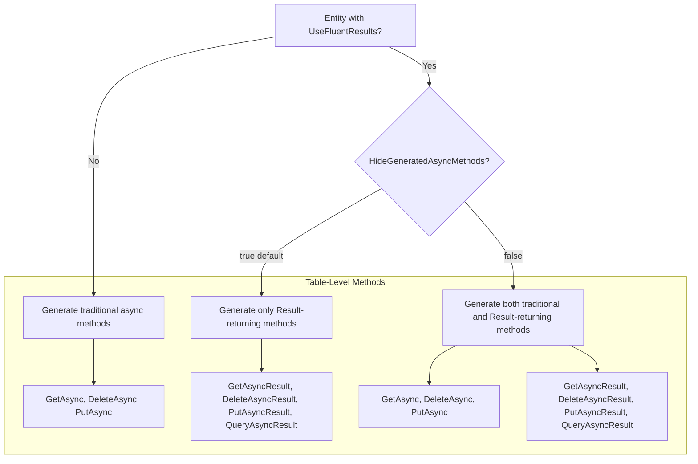

# Design Document: UseFluentResults Table-Accessor Method Mismatch Fix

## Overview

This design addresses a bug in the FluentDynamoDb source generator where table-level convenience methods are generated that call accessor methods that don't exist when `[UseFluentResults]` is applied with `HideGeneratedAsyncMethods = true` (the default).

The root cause is that `GenerateTableLevelGetMethod`, `GenerateTableLevelDeleteMethod`, and related methods in `TableGenerator.cs` unconditionally generate traditional async methods (e.g., `GetAsync`, `DeleteAsync`) that delegate to accessor methods, without checking whether those accessor methods exist based on the `UseFluentResults` and `HideGeneratedAsyncMethods` settings.

## Architecture

The fix modifies the `TableGenerator.cs` file to:

1. Check `UseFluentResults` and `HideGeneratedAsyncMethods` before generating table-level traditional async methods
2. Generate table-level Result-returning methods when `UseFluentResults` is enabled
3. Ensure consistency between table-level and accessor-level method availability



## Components and Interfaces

### Modified Component: TableGenerator.cs

The following methods need modification:

1. **`GenerateTableLevelGetMethod`**: Add conditional generation based on `UseFluentResults` and `HideGeneratedAsyncMethods`. Add generation of `GetAsyncResult` when `UseFluentResults` is enabled.

2. **`GenerateTableLevelDeleteMethod`**: Add conditional generation based on `UseFluentResults` and `HideGeneratedAsyncMethods`. Add generation of `DeleteAsyncResult` when `UseFluentResults` is enabled.

3. **`GenerateTableLevelPutMethod`**: Add generation of `PutAsyncResult` when `UseFluentResults` is enabled.

4. **`GenerateTableLevelQueryMethods`**: Add generation of `QueryAsyncResult` when `UseFluentResults` is enabled.

### Method Generation Logic

For each table-level operation method:

```csharp
// Determine whether to generate traditional async methods
var generateTraditionalAsync = !entity.UseFluentResults || !entity.HideGeneratedAsyncMethods;

// Generate builder method (always)
GenerateBuilderMethod(sb, entity, entityPropertyName);

// Generate traditional async convenience method (conditional)
if (generateTraditionalAsync)
{
    GenerateTraditionalAsyncMethod(sb, entity, entityPropertyName);
}

// Generate Result-returning convenience method (when UseFluentResults is enabled)
if (entity.UseFluentResults)
{
    GenerateAsyncResultMethod(sb, entity, entityPropertyName);
}
```

## Data Models

No new data models are required. The existing `EntityModel` class already contains the necessary properties:

- `UseFluentResults`: Boolean indicating if `[UseFluentResults]` is applied
- `HideGeneratedAsyncMethods`: Boolean indicating if traditional async methods should be hidden (default: `true`)

## Correctness Properties

*A property is a characteristic or behavior that should hold true across all valid executions of a system-essentially, a formal statement about what the system should do. Properties serve as the bridge between human-readable specifications and machine-verifiable correctness guarantees.*

### Property 1: Traditional async methods suppressed when UseFluentResults with default settings

*For any* entity with `[UseFluentResults]` and `HideGeneratedAsyncMethods = true` (default), the generated table class should not contain `GetAsync` or `DeleteAsync` convenience methods that delegate to accessor methods.

**Validates: Requirements 1.1, 1.2, 3.3**

### Property 2: Traditional async methods generated when HideGeneratedAsyncMethods is false

*For any* entity with `[UseFluentResults(HideGeneratedAsyncMethods = false)]`, the generated table class should contain both traditional async methods (`GetAsync`, `DeleteAsync`) and Result-returning methods (`GetAsyncResult`, `DeleteAsyncResult`).

**Validates: Requirements 1.3, 1.4, 3.4**

### Property 3: Traditional async methods generated without UseFluentResults

*For any* entity without `[UseFluentResults]`, the generated table class should contain traditional async convenience methods (`GetAsync`, `DeleteAsync`).

**Validates: Requirements 1.5**

### Property 4: Result-returning methods generated when UseFluentResults is enabled

*For any* entity with `[UseFluentResults]`, the generated table class should contain Result-returning convenience methods (`GetAsyncResult`, `DeleteAsyncResult`, `PutAsyncResult`, `QueryAsyncResult`) that delegate to accessor methods.

**Validates: Requirements 2.1, 2.2, 2.3, 2.4**

### Property 5: Generated code compiles successfully

*For any* entity configuration (with or without `[UseFluentResults]`, with any `HideGeneratedAsyncMethods` value), the generated table class should compile successfully without errors.

**Validates: Requirements 3.1, 3.2**

## Error Handling

The source generator should not produce compilation errors. If the generator logic is correct, the generated code will always be valid C# that compiles successfully.

No runtime error handling changes are required as this is a compile-time code generation fix.

## Testing Strategy

### Dual Testing Approach

Both unit tests and property-based tests will be used to verify the fix:

#### API Consistency Tests

API consistency tests in `Oproto.FluentDynamoDb.ApiConsistencyTests` will verify that the generated methods exist and are callable. These are compile-time tests that fail if the API surface doesn't match expectations.

**New Test File**: `Oproto.FluentDynamoDb.ApiConsistencyTests/FluentResults/FluentResultsTableLevelApiSurface.cs`

This test file will verify:
1. Table-level `GetAsyncResult` methods exist and are callable when `[UseFluentResults]` is applied
2. Table-level `DeleteAsyncResult` methods exist and are callable when `[UseFluentResults]` is applied
3. Table-level `PutAsyncResult` methods exist and are callable when `[UseFluentResults]` is applied
4. Table-level `QueryAsyncResult` methods exist and are callable when `[UseFluentResults]` is applied
5. Traditional async methods (`GetAsync`, `DeleteAsync`) are NOT generated when `HideGeneratedAsyncMethods = true`

**Test Entity**: A new test entity with `[UseFluentResults]` will be added to the ApiConsistencyTests project to enable these compile-time checks.

#### Unit Tests

Unit tests in `Oproto.FluentDynamoDb.SourceGenerator.UnitTests` will verify specific scenarios:

1. Entity with `[UseFluentResults]` (default settings) - verify no `GetAsync`/`DeleteAsync` at table level
2. Entity with `[UseFluentResults(HideGeneratedAsyncMethods = false)]` - verify both method types exist
3. Entity without `[UseFluentResults]` - verify traditional async methods exist
4. Verify generated code compiles for all configurations

#### Property-Based Tests

Property-based tests will use FsCheck to verify the correctness properties across many entity configurations:

- **Testing Framework**: xUnit with FsCheck
- **Minimum Iterations**: 100 per property
- **Test Location**: `Oproto.FluentDynamoDb.SourceGenerator.UnitTests/Generators/`

Each property-based test will:
1. Generate random entity configurations (with/without UseFluentResults, various HideGeneratedAsyncMethods values)
2. Run the source generator
3. Verify the generated code matches the expected pattern
4. Verify the generated code compiles successfully

### Test Annotation Format

Each property-based test will be annotated with:
```csharp
// **Feature: usefluentresults-table-accessor-mismatch, Property {number}: {property_text}**
```
