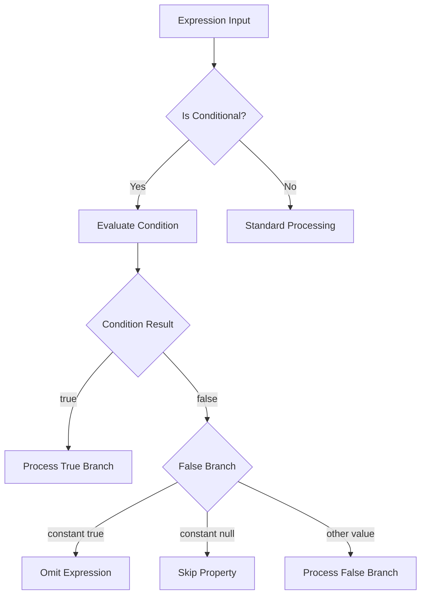

# Design Document: V1.0 Rough Edges

## Overview

This design addresses several rough edges identified during v1.0 release preparation for Oproto.FluentDynamoDb. The enhancements span six areas:

1. **DateTimeOffset Testing** - Comprehensive property-based tests for DateTimeOffset serialization/deserialization
2. **Record Type Support** - Verification and enhancement of C# record type support in the source generator
3. **ToCompositeEntityAsync Pagination** - Documentation of pagination limitations
4. **Conditional Filter Expressions** - Support for ternary expressions in filter lambdas
5. **Conditional Update Expressions** - Support for ternary expressions in update models
6. **Local Function Evaluation** - Clarification and testing of local function handling in expressions

## Architecture

### Current State Analysis

#### DateTimeOffset Support
The source generator already handles DateTimeOffset:
- `MapperGenerator.cs` handles DateTimeOffset TTL conversion using `ToUnixTimeSeconds()` and `FromUnixTimeSeconds()`
- `KeysGenerator.cs` supports DateTimeOffset in key parsing with `DateTimeOffset.Parse()`
- `ProjectionExpressionGenerator.cs` handles DateTimeOffset deserialization

**Gap**: Limited property-based tests specifically for DateTimeOffset round-trip scenarios.

#### Record Type Support
The source generator uses Roslyn's syntax analysis. Records are syntactically similar to classes but have:
- Implicit `init` accessors for positional parameters
- Value-based equality
- `with` expression support

**Gap**: No explicit tests verifying record type support. Need to verify source generator handles:
- `record class` declarations
- Positional parameters (primary constructor)
- Init-only properties

#### ToCompositeEntityAsync Pagination
Current implementation in `EntityExecuteAsyncExtensions.cs`:
- Executes a single Query operation
- Does not handle `LastEvaluatedKey` for pagination
- All items must be returned in a single response

**Gap**: No documentation warning users about this limitation.

#### Expression Translator Conditional Support
Current `ExpressionTranslator.cs`:
- Handles `BinaryExpression` (&&, ||, ==, etc.)
- Handles `ConstantExpression` for values
- Does NOT handle `ConditionalExpression` (ternary operator)

**Gap**: Ternary expressions throw `UnsupportedExpressionException`.

#### Update Expression Conditional Support
Current `UpdateExpressionTranslator.cs`:
- Processes `MemberInitExpression` (object initializers)
- Evaluates captured values via `EvaluateExpression()`
- Does NOT handle conditional assignments specially

**Gap**: `flag ? value : null` is evaluated, but null results in a SET to null, not a skip.

### Proposed Changes



## Components and Interfaces

### 1. ExpressionTranslator Enhancements

Add handling for `ConditionalExpression` in the `Visit` method:

```csharp
// New case in Visit switch
ConditionalExpression conditional => VisitConditional(conditional, entityParameter, context),

// New method
private string VisitConditional(ConditionalExpression node, ParameterExpression entityParameter, ExpressionContext context)
{
    // Evaluate the test condition (must not reference entity parameter)
    if (ReferencesEntityParameter(node.Test, entityParameter))
    {
        throw new UnsupportedExpressionException(
            "Conditional test cannot reference entity properties. " +
            "Use captured variables or constants for the condition.",
            node);
    }
    
    var testResult = (bool)EvaluateExpression(node.Test);
    
    if (testResult)
    {
        return Visit(node.IfTrue, entityParameter, context);
    }
    else
    {
        // Check if false branch is constant true (skip filter)
        if (node.IfFalse is ConstantExpression constant && constant.Value is true)
        {
            return ""; // Signal to omit this part
        }
        return Visit(node.IfFalse, entityParameter, context);
    }
}
```

### 2. UpdateExpressionTranslator Enhancements

Modify `ClassifyOperation` to handle conditional expressions with null false branches:

```csharp
// In ClassifyOperation, before processing value
if (unwrapped is ConditionalExpression conditional)
{
    // Evaluate condition
    if (ReferencesEntityParameter(conditional.Test, parameter))
    {
        throw new UnsupportedExpressionException(
            "Conditional test cannot reference entity properties.",
            conditional);
    }
    
    var testResult = (bool)EvaluateExpression(conditional.Test);
    
    if (testResult)
    {
        unwrapped = conditional.IfTrue;
    }
    else
    {
        // Check for null false branch - skip this property
        if (conditional.IfFalse is ConstantExpression { Value: null } ||
            conditional.IfFalse is DefaultExpression)
        {
            return Operation.Skip; // New operation type
        }
        unwrapped = conditional.IfFalse;
    }
    // Continue processing with unwrapped value
}
```

### 3. Record Type Source Generator Support

Verify and enhance `EntityAnalyzer.cs` to handle:

```csharp
// Check for record declaration
var isRecord = typeDeclaration is RecordDeclarationSyntax;

// For records with positional parameters, extract properties from primary constructor
if (isRecord && typeDeclaration is RecordDeclarationSyntax recordSyntax)
{
    var primaryConstructor = recordSyntax.ParameterList;
    if (primaryConstructor != null)
    {
        foreach (var parameter in primaryConstructor.Parameters)
        {
            // Each parameter becomes a property
            // Check for attributes on the parameter
        }
    }
}
```

## Data Models

### Operation Type Extension

```csharp
internal enum OperationType
{
    Set,
    Add,
    Remove,
    Delete,
    Skip  // New: indicates property should be skipped entirely
}
```

### Conditional Expression Result

```csharp
internal readonly struct ConditionalResult
{
    public bool ShouldProcess { get; init; }
    public Expression? ValueExpression { get; init; }
    public bool IsConstantTrue { get; init; }
}
```

## Correctness Properties

*A property is a characteristic or behavior that should hold true across all valid executions of a system-essentially, a formal statement about what the system should do. Properties serve as the bridge between human-readable specifications and machine-verifiable correctness guarantees.*

### Property 1: DateTimeOffset Round-Trip Consistency
*For any* valid DateTimeOffset value, serializing to DynamoDB format and deserializing back SHALL produce an equivalent DateTimeOffset value (within millisecond precision).
**Validates: Requirements 1.1, 1.2, 1.5**

### Property 2: DateTimeOffset TTL Round-Trip
*For any* DateTimeOffset value after Unix epoch (1970-01-01), converting to Unix epoch seconds and back SHALL produce an equivalent DateTimeOffset value (within second precision).
**Validates: Requirements 1.3, 1.4**

### Property 3: Record Type Entity Round-Trip
*For any* record type entity with valid property values, serializing to DynamoDB and deserializing back SHALL produce an equivalent record instance.
**Validates: Requirements 2.2, 2.3**

### Property 4: Conditional Filter True Omission
*For any* filter expression of the form `x => flag ? x.Property == value : true` where flag is false, the resulting DynamoDB filter expression SHALL be empty or omitted.
**Validates: Requirements 4.1**

### Property 5: Conditional Filter Partial Inclusion
*For any* filter expression of the form `x => x.FieldA < valueA && (flag && x.FieldB == valueB)` where flag is false, the resulting DynamoDB filter expression SHALL only contain the FieldA condition.
**Validates: Requirements 4.2**

### Property 6: Conditional Update Skip on Null
*For any* update expression with `Property = flag ? value : null` where flag is false, the resulting DynamoDB update expression SHALL NOT contain an operation for that property.
**Validates: Requirements 5.1, 5.3**

### Property 7: Conditional Update Value Selection
*For any* update expression with `Property = flag ? valueA : valueB` (both non-null), the resulting DynamoDB update expression SHALL contain the correct value based on the flag.
**Validates: Requirements 5.2**

### Property 8: Local Function Evaluation
*For any* filter expression containing a local function call that doesn't reference the entity parameter, the function SHALL be evaluated at translation time and its result captured as a constant.
**Validates: Requirements 6.1, 6.4**

## Error Handling

### New Exception Scenarios

1. **Conditional test references entity parameter**
   - Exception: `UnsupportedExpressionException`
   - Message: "Conditional test cannot reference entity properties. Use captured variables or constants for the condition."

2. **Filter evaluates to constant false**
   - Exception: `UnsupportedExpressionException`
   - Message: "Filter expression evaluates to constant false, which would return no results. Remove the filter or fix the condition."

3. **Local function references entity parameter**
   - Exception: `UnsupportedExpressionException`
   - Message: "Local function '{functionName}' cannot reference entity properties. DynamoDB expressions cannot execute C# methods with entity data."

## Testing Strategy

### Property-Based Testing Framework
- **Library**: FsCheck (already used in the project)
- **Minimum iterations**: 100 per property test

### Unit Tests

1. **DateTimeOffset Tests**
   - Verify ISO 8601 format output
   - Verify TTL Unix epoch conversion
   - Test edge cases: min/max values, different timezones

2. **Record Type Tests**
   - Verify source generator output for record declarations
   - Test positional parameters
   - Test init-only properties

3. **Conditional Expression Tests**
   - Test true/false branch selection
   - Test constant true omission
   - Test null skip behavior
   - Test error cases (entity parameter in condition)

4. **Local Function Tests**
   - Test evaluation at translation time
   - Test error on entity parameter reference

### Property-Based Tests

Each correctness property MUST be implemented as a property-based test with:
- Comment referencing the property: `// **Feature: v1-rough-edges, Property {N}: {description}**`
- Minimum 100 iterations
- Smart generators constraining to valid input space

### Integration Tests

1. **DateTimeOffset Integration**
   - End-to-end test with DynamoDB Local
   - Verify actual storage format

2. **Record Type Integration**
   - Create, read, update record entities
   - Verify with DynamoDB Local

3. **Conditional Expression Integration**
   - Verify filter omission in actual queries
   - Verify update skip in actual updates

